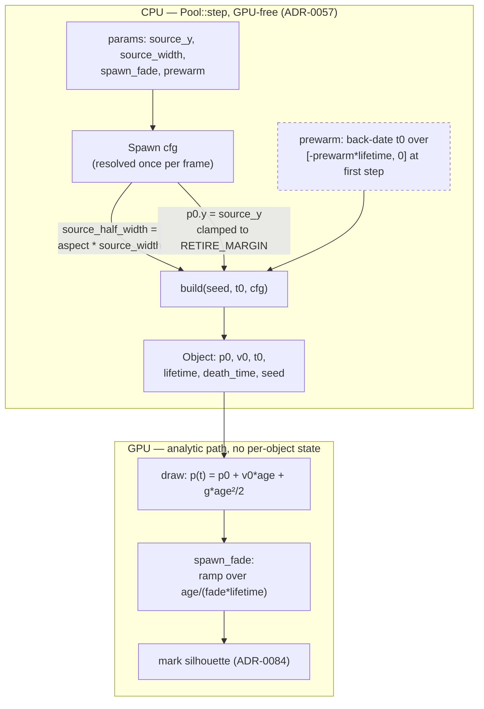

# 0090 — the emitter's source moves

> **Status:** approved
> **Created:** 2026-08-13
> **Owner skill(s):** dev, human
> **Related ADRs:** [ADR-0104](../adrs/0104-the-emitters-source-is-authorable-geometry.md) (accepted, this plan)
> **Closes:** [design-backlog 0068](../design-backlog.md) option 2
> **Supplements:** [ADR-0057](../adrs/0057-emitter-scene-analytic-ballistics-seeded-individuation.md),
> [ADR-0091](../adrs/0091-the-animation-gate-scores-motion-against-the-figures-footprint.md)

## TL;DR

The emitter's source line is two hardcoded facts — `y = -1.12` and "as wide as the frame" — and
`presets/README.md` routes anyone who wants otherwise to engine feedback. This plan makes both
authorable (`source_y`, `source_width`), adds a `spawn_fade` so a source **inside** the frame ramps
instead of popping, and adds a `prewarm` so the object pool can start in steady state instead of
filling over seconds. The last one is what actually makes a slow emitter world gateable: moving the
source into the frame removes the *travel* warm-up and leaves the *population* warm-up untouched.
Every default is an exact arithmetic identity, so no shipped preset and no baseline moves. The world
itself is the closing `human` phase.

## Context & problem

[Backlog 0068](../design-backlog.md) carried two independent asks and one of them is still open.
Option 1 — per-mark variation on the swarm — was delivered by
[Plan 0077](done/0077-the-quiet-sky.md) Phase 2. **Option 2, the source, was never promoted**, and
the entry says so in as many words at every update: *"Option 2 remains open here."*

**Two wants, one of which has a measured casualty.**

- **A point fountain or an off-centre jet.** `presets/README.md` anticipates the ask and refuses it:
  *"There is also no positionable source: the line spans the frame width at `y = -1.12` and cannot be
  moved or narrowed. A look that wants a point fountain or an off-centre jet is engine feedback, not a
  preset."*
- **A slow-drift field.** The entry measured the emitter for a starfield and the obstruction is
  geometric, not aesthetic: the source sits 1.12 units below a frame that is 2 units tall, so an
  object must travel **2.12 units** to cross it. At a sky-slow ~0.85 units/s that is ~2.5 s, and every
  behavioral gate captures **30 frames at 1/60 s = 0.5 s**. The rendered draft reported cover `0.013`
  and `0.000` on all four bands — the gate sees an empty sky. Speeding it to the ~4.3 units/s the
  geometry demands is a rising shower, and the twinkle stops reading at that speed anyway.

**The compromise shipped, which is why this is a demonstrated want.**
`presets/emitter_perseids.toml` exists on `system = "emitter"` at `launch_speed = 2.6` — precisely the
fast shower the entry predicted would be the only reachable form. Backlog 0068's own text still says
the Perseids look was *"routed out of the cohort rather than shipped"*; that is stale, and Phase 5
corrects it. What did not ship is the quiet version.

### The internals are already shaped for this

Nothing here is a restructure. `source_half_width` is a real field on `Spawn`
(`core/src/render/scenes/emitter.rs:357`), assigned `self.aspect` unconditionally at `emitter.rs:898`,
and the spawn site already multiplies a unit draw by it:

```rust
// emitter.rs:505 — as shipped
let p0 = [
    (unit(seed, channel::SOURCE_X) * 2.0 - 1.0) * cfg.source_half_width,
    SOURCE_Y,
];
```

So the geometry is one constant and one assignment. The design question was which knobs to expose and
whether a source may sit inside the frame; that is settled by
[ADR-0104](../adrs/0104-the-emitters-source-is-authorable-geometry.md), decided by interview.

### The second warm-up, which the interview surfaced and the entry did not

**Moving the source into the frame does not by itself make a slow world gateable.** The pool starts
empty — `started = false` and `next_spawn = time` on the first `step` (`emitter.rs:407`) — and fills
at `spawn_rate`, so the population ramps toward `rate * lifetime` wherever the source is. Perseids'
own numbers: `spawn_rate ~ 200/s`, `lifetime = 2.8 s`, steady state ~560 objects against a 2,000-object
Floor pool (`TierConfig::FLOOR.emitter_objects`), so the pool is not the binding constraint — and at
the gate's 0.5 s the pool holds ~100 of ~560, **about 18 %**. Phase 3 exists for this, and it is the
phase most clearly beyond what the interview covered; see **Risks**.

## Decision

Four scalars on `emitter`, in the order that keeps each phase independently valuable: the geometry
first (which is the ask), then the fade that makes an inside-frame source usable, then the prewarm
that makes a slow world gateable, then the docs, then the world.

| param | default | meaning |
|---|---|---|
| `source_y` | `-1.12` | the source line's world `y`. Today's constant as a value; **may sit inside the frame**, clamped only to the retirement bound. |
| `source_width` | `1.0` | half-width **as a fraction of the frame's**: `source_half_width = aspect * source_width`. `0` is a point source. |
| `spawn_fade` | `0` | fraction of lifetime over which brightness ramps from 0. `0` is today. |
| `prewarm` | `0` | at scene start, back-date `prewarm * lifetime` of spawns so the population begins at steady state. |

We rejected exposing `source_width` alone (leaves the measured casualty exactly as unreachable), a
named source-shape enum (`ring`/`area` are speculative surface), clamping `source_y` below the frame
(the decision that keeps the emitter unusable for slow looks), coupling `source_y`'s legality to
`spawn_fade` (no cross-param validation precedent, and it breaks under an eased `spawn_fade` passing
through zero), raising the gates' capture length (backlog 0068 rejected it first), and an absolute
world-unit width (the default stops being an identity and hands the author an ADR-0037
reconciliation). Full reasoning in ADR-0104.

## Architecture diagram



The dashed box is the only new *behaviour* rather than new arithmetic: it changes what the pool holds
at `t = 0` and nothing else. Everything downstream still reads a closed-form path from `t - t0`,
which is what makes back-dating exact rather than approximate.

## Implementation phases

### Phase 1 — the source line becomes a position and a width

- **Owner skill:** dev
- **What:** `source_y` and `source_width` join the param roster and reach the spawn site.
- **Files touched:** `core/src/render/scenes/emitter.rs` (`PARAMS`, `set_param`, `reset_params`, the
  `Spawn` resolve at ~`emitter.rs:889`, and `SOURCE_Y` becomes a default rather than the value),
  `core/src/render/scenes/emitter/tests.rs`.
- **Done when:**
  - `source_half_width` is `aspect * source_width` and `source_width` defaults to `1.0`, so the
    resolved value is **bit-for-bit** `self.aspect` at the default. Assert that as an equality on the
    resolved `Spawn`, not as a tolerance.
  - `source_y` defaults to the existing `-1.12` constant — the same constant, now named as the
    default rather than inlined at the spawn site — and is **clamped inside the retirement bound**.
    A source outside `RETIRE_MARGIN` times the frame half-extents spawns objects whose `exit_time`
    has already passed; assert that a preset asking for `source_y = 9.0` produces objects that are
    alive for at least one frame, because the failure mode is a pool churning against itself rather
    than anything visible.
  - `source_width = 0` puts **every** object's `p0.x` at exactly `0.0` — a point source, asserted
    exactly, since the spawn site multiplies a unit draw by the half-width and zero collapses it.
    A negative `source_width` is clamped at `0` the way `lifetime_spread` is, because a width is only
    meaningful as a magnitude.
  - An off-centre and a narrowed source are both **visible in a render**, not merely resolved: a
    capture at `source_width = 0.1` puts the ejecta in a column, and the test states the property
    (the horizontal spread of lit pixels is a fraction of the frame) rather than a frozen pixel count.
  - **Zero pixels move**, established by a **bless-to-bless control** on this branch — bless twice,
    differing only by reverting the change — never by a `git diff`, since eight baselines drift from
    their committed bytes under `LMV_BLESS` on this box. Bless every binary in scope
    (`--test golden --test composite --test line_joints --test attractor_trails`), then
    `git checkout -- core/tests/golden`. The emitter has **one** baseline (`emitter.png`) and three
    fixtures (`emitter.toml`, `emitter_lit_backdrop.toml`, `emitter_onset.toml`).

### Phase 2 — `spawn_fade`, so an inside-frame source ramps instead of popping

- **Owner skill:** dev
- **What:** an object's brightness ramps from zero over the first `spawn_fade` of its lifetime.
- **Files touched:** `core/src/render/scenes/emitter.rs`, its shader source, and
  `core/src/render/scenes/emitter/tests.rs`.
- **Done when:**
  - The ramp is a pure function of the object's own age and lifetime, both of which the draw already
    has, so **no new per-object state and no new buffer**.
  - **The `spawn_fade = 0` default is exactly `1.0`, by a branch rather than by arithmetic.** The
    natural form divides by `fade * lifetime` and is `0/0` at age zero; the house precedent is
    ADR-0092's `ink_gamma` and ADR-0094's ramp exponent, both of which take an explicit equality
    branch because the "obviously equivalent" arithmetic is not bit-exact. Assert the identity at
    `spawn_fade = 0` across ages **including exactly zero**, and against hostile values (negative,
    NaN, values above 1) via the same `finite`/clamp discipline the other params use.
  - The fade is **visible and monotone**: at `spawn_fade = 0.5` a capture shows the youngest objects
    dimmer than the oldest living ones. State it as a property of the two cohorts' mean luminance, not
    a threshold — and the test must fail if the ramp is applied with its sense inverted, which a
    single-cohort assertion would not catch.
  - Zero pixels move: same bless-to-bless control. This is expected by arithmetic (no fixture binds
    `spawn_fade`), so the control is checking the branch, not the default.

### Phase 3 — `prewarm`, so a slow world is gateable

- **Owner skill:** dev
- **What:** at scene start, the pool is filled with objects whose spawn times are back-dated across
  `prewarm * lifetime`, so the population begins at steady state.
- **Files touched:** `core/src/render/scenes/emitter.rs` (`Pool::step`'s first-run branch),
  `core/src/render/scenes/emitter/tests.rs`.
- **Done when:**
  - **Back-dating is exact, not approximated.** A back-dated object is indistinguishable from one that
    genuinely spawned at that time: assert that a pool prewarmed to time `T` holds objects whose
    positions equal those of a pool stepped normally from `T - prewarm * lifetime` to `T` — the same
    differential shape `the_cpu_step_mirrors_the_shader` uses. This is available *because* the path is
    closed-form in `t - t0` and `death_time` derives from `t0`; if it does not hold, the back-dating is
    wrong and the phase says so rather than loosening the comparison.
  - The draw stays **seeded** (NFR §6) with no clock read: a prewarmed pool is reproducible run to run.
  - **`prewarm = 0` is today's behaviour exactly**, asserted by the existing
    `a_spawn_rate_on_onset_bursts_and_then_idles` staying green unmodified — it asserts an **empty**
    frame at its lead peak, so it is the test a default-on prewarm would break, and that is why this
    is a param.
  - **The gate claim is measured, not argued.** A slow emitter draft — source inside the frame, drift
    slow enough to read as a sky — is rendered through the behavioral gates at `prewarm = 0` and at
    `prewarm = 1` and the two reports are recorded. The plan does **not** promise a pass: what it
    promises is the number, and if `prewarm = 1` still fails the gates then the sparse idiom's
    remaining wall is a finding for [ADR-0091](../adrs/0091-the-animation-gate-scores-motion-against-the-figures-footprint.md),
    not something to fix by moving a floor.

### Phase 4 — the docs stop routing this to engine feedback

- **Owner skill:** dev
- **What:** the operator and content-lane docs learn all four params.
- **Files touched:** `presets/README.md` (the emitter section, including the *"What it does not have"*
  paragraph at ~line 582 which must be **retired, not reworded**), `docs/capturing.md` (the gate
  caveats), `.claude/skills/preset-author/references/systems.md`.
- **Done when:**
  - `presets/README.md`'s "no positionable source" paragraph is gone and the four params are in the
    emitter table with their defaults, the fractional meaning of `source_width`, the point source at
    `0`, and **the pop**: an inside-frame `source_y` at `spawn_fade = 0` produces exactly the artifact
    the old constant existed to prevent, and nothing validates the pair (ADR-0104 rejected coupling
    them, and says why).
  - `docs/capturing.md` states that **a green `anim` on an emitter world means something different at
    `prewarm = 0` than at `prewarm = 1`, and the gate cannot see which** — beside the three caveats
    that section already carries, in the same place a future author reads them.
  - **`.claude/skills/preset-author/references/systems.md` learns the four params.** This file has now
    been raised as a minor at **four consecutive closes** (Plans 0078, 0080, 0081, 0079), every time
    because a content phase was authored against a table that did not know the param it was about to
    bind. This plan's Phase 5 is exactly that situation, so the sweep is a done-when here rather than
    a reviewer's catch — the fix Plan 0081's close identified and applied.

### Phase 5 — the world, and the verdict on the pop

- **Owner skill:** human
- **What:** the content lane authors the look this plan exists for, and the user judges it in the app.
- **Files touched:** `presets/` (one or two worlds, landed by `preset-author` under
  [ADR-0081](../adrs/0081-the-content-lane-lands-presets-and-architect-curates-the-set.md)).
- **Done when:** the user has judged, in the running app, (a) a **quiet drifting field** — the look
  backlog 0068 measured the emitter for and could not reach — and (b) a **point fountain or
  off-centre jet**, the ask `presets/README.md` has been refusing. Two questions to answer while
  looking, because they are the ones no test can:
  - **Does `spawn_fade` actually hide the pop?** ADR-0104 accepts an authorable pop on the argument
    that the fade makes it avoidable. That is an untested claim about a *look*.
  - **Does a prewarmed emitter switch in badly?** A preset switching into a prewarmed world appears
    fully populated in one frame. That is the intent for a sky and would be wrong for a cascade; the
    verdict belongs in the world's header the way the fold-edge verdicts do.
  This phase also **corrects backlog 0068's stale claim** that the Perseids look was routed out
  rather than shipped — it shipped as the fast compromise, and whether the quiet version replaces it
  or joins it is a curation call for the close.

## Data shapes

```rust
// illustrative — not the final interface. The four fields join `Spawn`, which is
// already resolved once per frame from the bound params.
struct Spawn {
    // ... existing: rate, gravity, speed, angle, spread, lifetime, lifetime_spread, bound
    /// Half-extents of the source line, world units. Was `self.aspect`;
    /// now `self.aspect * source_width`, so the default is an exact identity.
    source_half_width: f32,
    /// The source line's world y. Was the `SOURCE_Y` constant at the spawn site.
    /// Clamped inside the retirement bound so a spawn cannot be born dead.
    source_y: f32,
    /// Fraction of lifetime over which brightness ramps from 0. `0` = no ramp,
    /// and the shader takes an equality branch rather than dividing by it.
    spawn_fade: f32,
    /// Seconds of spawns to back-date at scene start, as a fraction of lifetime.
    prewarm: f32,
}
```

## Risks & open questions

- **Phase 3 is beyond what the interview covered, and it is the one to cut if the plan is too big.**
  The interview settled three knobs; `prewarm` is a fourth, added because grounding the gate argument
  showed the source alone does not deliver it (~18 % of steady-state population at the 0.5 s capture,
  from Perseids' own numbers). Phases 1, 2, 4 and 5 stand without it — the point fountain and the
  off-centre jet need nothing from it — and cutting it costs only the *gateable* half of the slow
  look. It is placed third so it can be dropped without reordering anything.
- **Phase 3's measurement can come back negative, and that is a result rather than a failure.** If a
  prewarmed slow world still fails the gates, the wall is the statistic and not the warm-up. Do not
  respond by moving `ANIM_FLOOR` or a coverage floor — the rule this project has settled on is to read
  the floor and re-derive by its own recorded rule, never lower it to fit.
- **The pop is authorable and unvalidated, by decision.** If Phase 5's verdict is that `spawn_fade`
  does *not* hide it, the honest outcome is a documented "do not put the source inside the frame
  unless the marks are faint", not a late clamp — a clamp would take the slow look away again.
- **`prewarm` interacts with a preset switch**, which is the case a test is least likely to cover: the
  scene is constructed fresh, so a prewarmed world pops to full population in one frame at the switch.
  Phase 5 judges it; if it reads badly, the crossfade already in the transition stage is where the
  answer would live, not here.
- **Four params on a 26-param scene.** Watch that they read as one mechanism in the docs rather than
  four unrelated knobs — the emitter table is already the longest in `presets/README.md`.
- **No real-time hazard.** Everything here is CPU-side in `Pool::step`, which is GPU-free by design
  (ADR-0057), plus one shader multiply. Nothing touches the audio callback, nothing allocates per
  frame — the pool is fixed-capacity and `prewarm` fills existing slots.

## What this plan does NOT do

- **It does not add a source *shape*.** No ring, no area, no multiple sources. Two scalars reach every
  shape anyone has asked for; ADR-0104 Alternative B keeps the enum available if a ring is ever wanted.
- **It does not add per-object expressions.** `presets/README.md`'s other stated limit — that
  `hash(index)`-style authoring is out of reach — is untouched and remains true.
- **It does not move any gate's capture length, floor, or statistic.** Backlog 0068 named that as the
  wrong answer and this plan agrees; `prewarm` attacks the warm-up instead.
- **It does not retire `emitter_perseids`.** Whether the quiet world replaces or joins it is a
  curation call at the close, not a plan decision.
- **It does not touch the swarm.** Option 1 of backlog 0068 shipped in Plan 0077 and the two scenes
  keep their separate profiles.
- **It does not fix backlog 0068's stale Perseids claim anywhere but in the entry itself** at Phase 5.

## Followups (after this lands)

- **Backlog 0068 closes in full** — both options delivered, and the entry's own "Option 2 remains
  open here" line is the thing being discharged.
- **If Phase 5 wants a fade-out as well as a fade-in**, that is a second param and a fresh entry; an
  object currently vanishes at `death_time` and the retirement margin exists so it usually vanishes
  off-frame, which an inside-frame source undoes.
- **If the prewarmed switch reads badly**, the transition stage is the place to look and it is a
  different plan.
