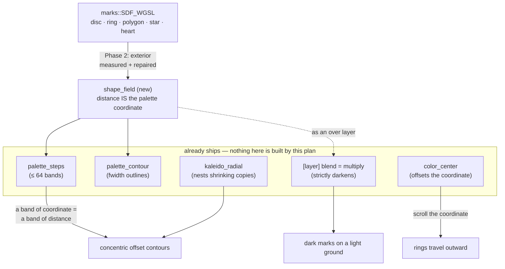

# 0091 — The figure fills the frame

> **Status:** draft
> **Created:** 2026-08-13
> **Owner skill(s):** dev, human
> **Related ADRs:** [0105](../adrs/0105-the-mark-roster-becomes-a-fullscreen-distance-field.md) (the mark roster becomes a fullscreen distance field), [0106](../adrs/0106-two-tone-graphics-come-from-a-multiply-layer.md) (two-tone graphics come from a multiply layer)
> **Corrects:** design-backlog 0069 (premise falsified in part — corrected in place, not archived)

## TL;DR

A new `shape_field` scene draws the `marks` roster's signed distance as a fullscreen scalar, so
banding the palette coordinate produces **concentric offset contours of a chosen shape** — the
construction in the user's reference images, per pixel, with no geometry to facet. The three
reactivity asks (rings travelling outward, ring count on the beat, the figure breathing) fall out of
parameters that already exist once the scalar is a distance. Alongside it, a capability the engine
has had since 2026-08-11 and nobody knew about gets written down: a fullscreen field in a
`multiply` layer draws **dark marks on a light ground**, which is most of what design-backlog 0069
says is impossible.

## Context & problem

The user supplied three reference images. Two are the same subject — concentric offset heart
contours, red on black, tightening toward the centre. The third is a collage: a purple gradient sky
over a white floor of black stripes converging to a vanishing point, with a flat red heart on top.

Decomposing them against the engine found the gap is narrow and specific. Nesting ships
(`kaleido_radial`, periodic in `log r`). Hard graphic banding ships (`palette_steps`, up to 64;
`fragment_mandala` is the worked example). Constant-width outlines ship (`palette_contour`). The
colour surface, the reactivity grammar and the easing all ship. **The single missing piece is a
shape-shaped scalar at frame scale** — the engine's heart exists only as a particle sprite a few
pixels across (ADR-0105 has the full derivation).

Two things about the collage separate from that and are not equal in cost:

- Its **dark-on-light floor and opaque red figure** looked like design-backlog 0069's composite
  redesign. A measurement says otherwise (ADR-0106): a `multiply` layer reaches luma 18.5 where the
  additive control cannot get below 181.6. That half is documentation, not engineering.
- Its **converging stripe fan** is a genuine gap with no cheap route. The backdrop ramp is linear
  along `bg_angle`, so it makes parallel stripes only, and the obvious trick of folding it radially
  is closed off: `post.rs:33` — *"The backdrop is **not** in the chain's input"* — so the
  kaleidoscope cannot reach it. This plan treats the fan as a **cut point**, not a promise.

What is explicitly not in reach at any price: the collage's photographic arrow and the poster's
typography. There is no runtime asset path and no text rendering outside the F3 debug overlay.

## Decision

Build the `shape_field` scene per ADR-0105, opening with a **measurement of the roster's exterior**
rather than a feature, because the field the contours read has never been looked at:
`marks.rs:33-37` states that the polygon and star arms are deliberately not true distance functions
outside the silhouette. Document the multiply route per ADR-0106 and correct backlog 0069 in place.
Leave the converging fan to a final phase that must earn itself.

We rejected putting the shape on `fragment_field` as a mode (one scene, two unrelated jobs, and a
byte-identity burden on every shipped `fragment_*` preset), adding a heart to `CurveFamily` or the
`Motif` roster (backlog 0073's faceting and ADR-0098's vertex bead, both maximised by ~20 nested
thin contours, on the same files as Plan 0087), and a composable SDF grammar (it makes the preset
language a shader language, which ADR-0002 has declined for the project's whole life).

## Architecture diagram



## Implementation phases

### Phase 1 — Two-tone reaches the backdrop, or it does not

- **Owner skill:** dev
- **What:** Settles the one thing ADR-0106 leaves unmeasured, then writes the whole two-tone route
  down. It is first because it is cheap, it is independent of every other phase, and its answer
  changes what Phase 6 can attempt.
- **Files touched:** `presets/README.md`, `docs/preset-palettes.md`, `docs/design-backlog.md`,
  a golden fixture under `core/tests/`.
- **Done when:**
  - A rendered measurement says whether a `multiply` layer darkens a **lit backdrop**, in the shape
    ADR-0106's table already uses: same preset, `blend` the only variable, the luma minimum
    reported for both. `post.rs:33` says the backdrop is composited underneath rather than living
    in the chain's input, so this is a genuinely separate path from the one already measured — and
    the honest outcome is whichever it is. **A negative result is a result**, and it means the
    reference collage's floor must come from the backdrop's own palette rather than from a
    darkening layer.
  - `presets/README.md` and `docs/preset-palettes.md` carry the route, **including the trap rather
    than only the working case**: a field scene in a multiply layer darkens because its alpha is
    `occlude` on every pixel; a `swarm` or `emitter` in the same slot cannot, because a particle's
    alpha is its own falloff. Two routes to one shape with different colour capabilities, for a
    reason no parameter table shows.
  - design-backlog 0069 is **corrected in place and stays live**, carrying the measurement and
    keeping its surviving half: multiply darkens by coverage and still nothing decides what is in
    front of what.
  - A golden fixture pins a multiply layer over a lighter chain, so the capability this plan is
    about to document cannot silently regress.

### Phase 2 — The exterior distance is measured, and repaired where it is wrong

- **Owner skill:** dev
- **What:** Establishes what each of the five arms actually returns *outside* its silhouette,
  before anything depends on it. This is the phase ADR-0105 exists to justify: contours read a
  region the roster was explicitly never built for.
- **Files touched:** `core/src/render/scenes/marks.rs`, `core/src/render/scenes/marks/tests.rs`.
- **Done when:**
  - Each of `disc`, `ring`, `polygon`, `star`, `heart` has its returned distance compared against a
    **numerically computed** distance to its own outline, sampled over a region that reaches well
    outside the silhouette — the ground truth being a dense boundary sampling, so the test does not
    grade an approximation against itself.
  - The comparison is reported per arm, and each arm is then either **repaired** or **recorded as
    approximate with the error it carries**. `disc` is exact by construction (`length(p) - 1`) and
    is the control: an arm that cannot reproduce `disc` exactly has a broken harness, not a broken
    shape. The polygon and star arms are expected to fail — `marks.rs:33-37` says they are two cheap
    lines — and either outcome for them is a legitimate phase result, but **which one must be
    stated, not left implied**.
  - **The particle path moves zero pixels.** Every existing golden baseline is byte-identical,
    proved bless-to-bless on the branch rather than by `git diff` — eight baselines drift from their
    committed bytes on this box under a clean bless, so a diff would charge that drift to this
    phase. The property is structural (the sprite clamps at `d >= 1` and only ever reads the
    interior) and the control is what confirms the structure was not disturbed.

### Phase 3 — The shape field lands

- **Owner skill:** dev
- **What:** The new scene: a fullscreen distance from the shared roster, mapped through the shared
  palette. The walking skeleton — with `palette_steps` bound, this phase alone renders the
  reference's concentric contours.
- **Files touched:** `core/src/render/scenes/shape_field.rs` (new),
  `core/src/render/scenes/mod.rs`, the system registry, `core/tests/` (golden fixture),
  `presets/README.md`, `docs/presets.md` if the roster reaches the grammar.
- **Done when:**
  - `system = "shape_field"` loads and renders a centred figure whose shape, scale and centre are
    parameters, with the closed roster and the CPU-side quantizer reused from `marks` rather than
    re-stated — one roster, still one copy.
  - **The aspect comes from the render target**, and a test proves it *bites*: rendered at a
    non-16:9 size where a wrong source would visibly distort the figure, since ADR-0037 has shipped
    three times in this repo and both 1920x1080 and this box's 2048x1152 quantize to exactly 16:9,
    where no test can tell a right source from a wrong one. There is no internal grid here to take
    the aspect from by accident, which removes the usual mechanism but not the obligation.
  - `palette_steps` over the distance produces contours that are **offsets of the shape rather than
    concentric circles** — checkable as a property, not a threshold: on a shape that is not radially
    symmetric (the heart), the band boundary's distance from the figure's outline is constant where
    a circular banding's would not be.
  - A golden fixture pins one banded heart. Adapters compared before blessing (the WARP precedent:
    a new pass whose bind-group layout matches a live pipeline's takes that pass's uniform, and the
    suite blesses garbage), and an ADR-0058 enumeration entry if the layout shape is new.
  - `presets/README.md` gains the system and its parameter rows in the same commit — the doc gate
    runs immediately, and Plan 0079's close recorded a minor for landing a param row a phase late.

### Phase 4 — The figure responds

- **Owner skill:** dev
- **What:** The three reactivity levers the user asked for. Most of this phase is **verification
  that they are already free**, and the plan says so rather than pretending to build them.
- **Files touched:** `core/src/render/scenes/shape_field.rs`, its tests, `presets/README.md`.
- **Done when:**
  - **Rings travel outward** — confirmed to come from binding `color_center`, which offsets the
    palette coordinate that is now a distance. If it does, this is a documented recipe and **no
    code**; if the repeat-addressing seam makes it stutter at the wrap, the finding is recorded and
    the fix is scoped there rather than as a new parameter.
  - **The figure breathes** — the scale parameter takes a binding and the response is monotone in
    it.
  - **Ring count on the beat** — `palette_steps` already quantizes CPU-side for exactly this
    reason (a fractional band count leaves every boundary crawling). The open question is not
    whether it works but whether it *reads*: `fragment_mandala`'s own header flags that quantizing
    colour is a global change to every pixel at once, "which is exactly the shape a strobe has",
    and that preset never settled it. This phase renders it; Phase 5 judges it.
  - A **response exponent** on the distance before the palette coordinate, so contour spacing can
    compress toward the centre the way the reference does — even spacing is what a raw distance
    gives, and the reference is not evenly spaced. Same shape as `bg_ramp_gamma` and `ink_gamma`
    (ADR-0092), including the exact-identity branch at 1.0, since `pow(x, 1.0)` is not bit-exact.

### Phase 5 — The look gate

- **Owner skill:** human
- **What:** Judge the concentric figure **in motion, in the running app**, against the reference
  images — and judge the beat-latched band count specifically, since that is the one the engine
  cannot answer for itself.
- **Done when:**
  - A verdict on whether the contours read as the reference does, and on whether the ring count on
    the beat reads as a **response or as a strobe**. If it strobes, the recorded fallback is the one
    `fragment_mandala` already named — move the beat term onto the geometry and let the band count
    sit still.
  - A verdict on the response exponent's useful range, taken from rendered comparisons rather than
    from the parameter's clamp.
  - **This phase may carry forward.** If the user is not available, the `dev` phases close the plan
    and the item moves to `docs/content-brief.md` under the rule Plan 0083's and Plan 0088's Phase
    7 both followed. It gates nothing below it.

### Phase 6 — The converging fan, and it must earn itself

- **Owner skill:** dev
- **What:** The reference collage's floor: stripes converging to a vanishing point. **This is the
  designed cut point.** Phases 1-5 stand entirely without it, and it is last because it is the only
  part of this plan whose value is not already established.
- **Files touched:** `core/src/render/background.rs` and its tests, `presets/README.md` — *if it
  proceeds*.
- **Done when** — **and the first bullet may end the phase**:
  - The route is settled by rendering, not by argument. The backdrop's ramp is linear along
    `bg_angle`, and its swept coordinate is already repeat-addressed (`background.rs:45`), so
    `bg_hue_span` greater than 1 gives repeating **parallel** stripes today at no cost. What is
    missing is only the *coordinate*: an angular one about a movable point turns the same stripes
    into a fan. Folding the existing ramp is not available — `post.rs:33` puts the backdrop outside
    the chain the kaleidoscope reads.
  - **If it proceeds, it owes its own ADR** (next free number at the time), because a backdrop
    coordinate mode is the third decision on that pass after ADR-0094 and ADR-0095 and it has a real
    rejected alternative — drawing the floor as a scene instead, which costs the preset's one
    `[layer]` slot that Phase 1's two-tone route also wants.
  - Every default is an arithmetic identity and the existing baselines move zero pixels, proved
    bless-to-bless as in Phase 2.
  - **A negative outcome is a legitimate close.** If the fan needs more than a coordinate — and the
    collage's floor is also *bounded* by a horizon, which the ramp expresses only through palette
    stop placement — the honest result is a backlog entry describing what was learned, not a
    half-built mode. The reference is a collage; this engine is not a collage tool, and Phase 5's
    verdict on the heart is the part of this plan the user actually asked for twice.

## Data shapes

The parameter surface, illustrative — final names settle in Phase 3 against `presets/README.md`'s
existing conventions:

```rust
// illustrative — not the final interface
struct ShapeFieldParams {
    shape: f32,        // roster index, quantized CPU-side (marks::SHAPES)
    points: f32,       // polygon/star vertex count, reused from marks
    scale: f32,        // the figure's size in the fit-normalized frame
    // centre offset reuses the shared `pan_x`/`pan_y` (ADR-0018's ViewTransform)
    gamma: f32,        // response exponent on the distance, exact identity at 1.0
    // colour is the shared surface: color_span, color_center, saturation,
    // palette_steps, palette_contour, palette_mix, occlude — none new
}
```

The scalar handed to the palette is the roster's existing normalization,
`d = 1 + sd(p) / R` (`marks.rs:14-24`) — `0` at the deepest interior point, exactly `1` on the
outline, unbounded outside. Phase 2 establishes what "unbounded outside" is actually worth per arm.

## Risks & open questions

- **The exterior repair may be larger than one phase.** A true polygon SDF is a well-known handful
  of lines, but `star` is a non-convex shape and its exact distance is materially harder. The
  recorded fallback is shipping those two arms as *approximate*, documented with their error, and
  restricting the contour recipe to the arms that earn it — the heart is the one the references
  need and it is IQ's, the one arm `marks.rs:109` names a source for.
- **Whether "black" is black enough.** ADR-0106 measured the floor at luma 18.5, not 0, with bloom
  and the tonemap both live and unseparated. If the reference's flat black gaps need a true zero,
  the mechanism has to be identified first. This is not on the critical path for the red-on-black
  heart, where the gaps are unlit rather than darkened.
- **The layer slot is contended by this plan's own two halves.** ADR-0090 caps a preset at one
  `[layer]`, and both the two-tone route (Phase 1) and a fan-plus-figure collage (Phase 6) want it.
  That contention is a reason Phase 6 is a cut point, and it is worth stating before someone
  discovers it while authoring.
- **Cost at the floor tier is unmeasured.** A fullscreen distance is a handful of ALU ops per pixel
  and unconditional, unlike the sprite path where the quad bounds the work. Expected cheap; not
  measured. NFR §1's floor tier is the reference if it turns out not to be.

## What this plan does NOT do

- **It does not make the shape roster extensible.** Five names, closed, per ADR-0084's consequence
  restated in ADR-0105. A sixth shape is an architect decision, not a preset-side extension.
- **It does not ship preset content.** The engine lands here; worlds are the `preset-author` lane's
  under ADR-0081, exactly as Plan 0076 shipped `[layer]` with no preset declaring one. Golden
  fixtures are not content.
- **It does not redesign the composite**, and it does not close design-backlog 0069 — that entry
  keeps its occlusion half, corrected rather than archived (ADR-0106).
- **It does not reproduce the reference images.** The poster's typography and the collage's
  photographic arrow are outside what this engine does at all: no text rendering beyond the F3
  overlay, no runtime asset path. The plan takes the *construction* from the references, not the
  compositions.
- **It does not touch the line renderer**, and therefore does not interact with Plan 0087. That is
  the point of ADR-0105's route, and it means these two plans can run in either order or
  concurrently.
