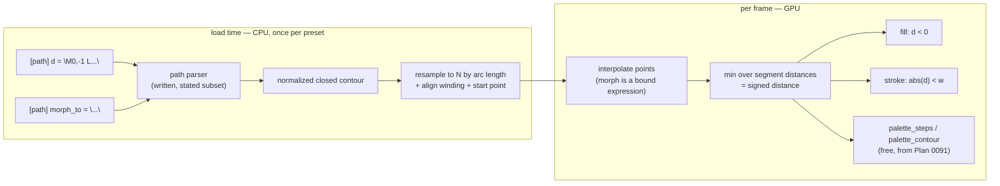

# 0092 — The engine draws an authored path

> **Status:** in-progress
> **Created:** 2026-08-13
> **Approved:** 2026-08-13 (user)
> **Owner skill(s):** dev, human
> **Related ADRs:** [0107](../adrs/0107-an-authored-path-is-inline-svg-data-and-it-morphs-by-resampling.md) (an authored path is inline SVG data, and it morphs by resampling)
> **Depends on:** [Plan 0091](done/0091-the-figure-fills-the-frame.md) (hard — the field scene this draws into). [Plan 0087](done/0087-the-line-renderer-draws-a-curve.md) is a **soft** dependency; see the sequencing note below.

## TL;DR

A `[path]` table takes inline SVG path data, parsed once at load into a normalized closed contour
and rendered as a per-pixel signed distance field — so a preset can author its own silhouette
instead of picking from a closed roster of five. Fill and stroke come from the *same* field
(`d < 0` and `abs(d) < w`), and two paths morph by resampling both to a common arity, aligning
winding and start point, and interpolating. The morph parameter is an ordinary bindable expression,
so a figure can become another figure on the beat.

## Context & problem

Every silhouette this engine can draw is one of five names (`marks.rs:63`), and a closed roster by
construction answers only the asks someone has already had. [ADR-0084](../adrs/0084-a-particle-marks-silhouette-is-a-signed-distance-function.md)
made that a deliberate consequence and [ADR-0105](../adrs/0105-the-mark-roster-becomes-a-fullscreen-distance-field.md)
restated it; this plan is the escape hatch, taken as a decision rather than by widening the roster
one name at a time.

**The six star references that raised the question do not motivate it**, and the plan says so up
front because it is the honest framing: five of them are the existing `star` arm wanting three
parameters, which is [Plan 0091](done/0091-the-figure-fills-the-frame.md) Phase 5. What motivates this is
the general capability — and the sixth reference, a cartoon star **with eyes**, which is the one
silhouette in the batch that no parameter reaches.

[ADR-0107](../adrs/0107-an-authored-path-is-inline-svg-data-and-it-morphs-by-resampling.md) settles
the four forks and carries the reasoning. Two of its findings shape every phase below:

- **Fill and stroke are one field, not two routes.** A signed distance gives both, which is why the
  interview's "both" answer costs a shader branch rather than a second renderer.
- **ADR-0098's vertex bead does not transfer.** That artifact belongs to the instanced-quad line
  renderer, where [ADR-0041](../adrs/0041-line-joins-are-per-endpoint-on-the-segment-instance.md)'s
  joins overlap and the additive composite sums them. A `min` over segment distances has no quads
  and is exactly correct at every join — so dense resampling costs ALU and compounds nothing.

### Sequencing, and a disagreement with it worth stating

This plan was sequenced after Plan 0087 so that paths would inherit its arc primitive instead of
inventing a second curve representation. **That instinct is right and the dependency is real, but it
is softer than the sequencing implies, and the difference matters because Plan 0087 carries two
gates that can end it early** into ADR-0098's Alternative C.

A polyline distance field is complete on its own. Arcs let *fewer segments* express a curve exactly,
which lowers `N` and therefore the per-pixel cost — a fidelity and performance gain, not a
prerequisite. So: take this after 0087 as intended, but if 0087 stalls or ends at its Alternative C,
**this plan is still takeable**, with the arity ceiling from Phase 2's measurement sitting lower than
it otherwise would. Phase 4 is written to consume arcs *if they exist* and to be complete without
them.

The hard dependency is Plan 0091, which builds the scene this draws into.

## Decision

Build the parser, the field and the morph in that order, and **set the arity ceiling from a
measurement rather than from ADR-0107's construction estimate**. The ADR's cost arithmetic (~2 % of
a nominal iGPU at `N = 32`) is explicitly not a measurement, and an arity ceiling chosen from an
unmeasured number is the kind of done-when this project has been burned by before.

We rejected a triangulated fill (its topology must be valid every frame a morph moves, and a shape
interpolating between two silhouettes self-intersects precisely mid-morph — a failure mode
concentrated in the feature this plan exists for), an SVG-parsing crate (the needed subset is small
enough to write; `lyon` also brings the tessellator already rejected), same-arity-only morphing
(pushes three alignment problems onto the author), and external `.svg` files (a runtime asset path
this project has never had, and a preset that stops being self-contained).

## Architecture diagram



## Implementation phases

### Phase 1 — The parser, and what it refuses

- **Owner skill:** dev
- **What:** Inline SVG path data becomes a normalized contour at load. No rendering yet — this phase
  is pure CPU and is fully testable without a GPU, which is why it is first.
- **Files touched:** `core/src/preset/path.rs` (new), `core/src/preset/mod.rs`,
  `core/src/preset/` schema, its tests.
- **Done when:**
  - The supported subset is **stated in one place and enforced**: `M`/`m`, `L`/`l`, `H`/`h`, `V`/`v`,
    `C`/`c`, `S`/`s`, `Q`/`q`, `T`/`t`, `Z`/`z`. **`A`/`a` (elliptical arc) and multi-contour paths
    are refused**, each with its own error naming what it found and why the subset excludes it —
    an author will be holding a file a browser renders correctly, and "invalid path" would be a
    cruel thing to tell them.
  - **A malformed path is a load error carrying a character offset**, not a fallback shape. A
    silently mis-parsed path renders as a plausible wrong figure, which is worse than a red build:
    it looks like a design decision.
  - The contour is normalized to the fit-normalized world the rest of the engine uses, and the
    normalization is **recorded rather than inferred** — a path authored at any scale or offset
    lands in the same place, so swapping one path for another does not also move the figure.
  - Round-trip tests over hand-written paths, including the relative-command forms (`m`, `c`, `s`)
    that are the ones a real exported file actually uses, and the smooth-continuation commands
    (`S`, `T`) whose reflected control point is the classic place a hand-written parser is wrong.

### Phase 2 — The path becomes a field, and the arity ceiling is measured

- **Owner skill:** dev
- **What:** The contour renders — fill and stroke from one signed distance — inside Plan 0091's
  scene. This is the walking skeleton: at the end of this phase a preset draws its own silhouette.
- **Files touched:** `core/src/render/scenes/shape_field.rs`, its shader, `core/tests/`.
- **Done when:**
  - A `[path]` preset renders its silhouette filled, and `abs(d) < w` strokes the same contour, from
    **one** distance evaluation — verified as a property: the stroked outline lies on the fill's
    boundary at every sample, which is what "same field" means and what a second route could not
    guarantee.
  - **The arity ceiling comes out of a measurement against NFR §1's floor tier**, and it is the
    output of this phase rather than an input. ADR-0107's ~2 % estimate at `N = 32` is a construction
    from pixel count x segments x ops, and the ADR labels it as such; the number that ships is the
    measured one. **If the measurement disagrees with the estimate, the estimate is what was wrong.**
  - A path exceeding the ceiling is a **load error naming the ceiling and the path's own count**, not
    a silent decimation — an author who pastes a 500-point traced logo needs to be told, because the
    cost is paid on every pixel of every frame whether or not the figure is on screen.
  - The aspect comes from the render target (ADR-0037), on the same terms Plan 0091 Phase 3 states.
  - A golden fixture pins one filled path, adapters compared before blessing.

### Phase 3 — Two paths morph

- **Owner skill:** dev
- **What:** The correspondence machinery — the part ADR-0107 names as having three alignment
  problems, one of which is refused rather than solved.
- **Files touched:** `core/src/preset/path.rs`, its tests, `core/src/render/scenes/shape_field.rs`.
- **Done when:**
  - Both endpoints resample to a common arity **by arc length**, so points are distributed evenly
    along the outline rather than evenly per command — a shape whose commands are unevenly sized
    would otherwise bunch its correspondence where the author happened to click.
  - **Winding is normalized by signed area.** A path authored clockwise morphing into a
    counter-clockwise one turns inside out through the middle, and it is checkable directly: the
    interpolated contour's signed area does not pass through zero for an aligned pair, and provably
    does for a mis-aligned one. Assert the negative control, or the alignment is untested.
  - **Start-point rotation is chosen by minimising total displacement over cyclic offsets.** Without
    it, a star morphing to a star can unwind through a spiral — every intermediate frame valid, the
    whole motion wrong. `O(N^2)` at load for `N` in the low hundreds is thousands of operations, so
    the brute-force search is affordable and no cleverness is owed.
  - **Mid-morph states are inspected, not assumed.** Plan 0079 swept twenty tuple pairs and *four*
    were refused by measurement because intermediate states collapsed to zero extent;
    [ADR-0075](../adrs/0075-ifs-family-morphs-in-singular-value-space.md) exists because naive
    interpolation of the obvious representation was wrong. This phase renders a strip across the
    morph for each shipped pair and **records what it saw** — a degenerate interval is a finding to
    write down, not a bug to tune away.
  - Morph is a bindable expression under the existing grammar, with `[smoothing]` applying to it
    like any other param.

### Phase 4 — Arcs, if Plan 0087 delivered them

- **Owner skill:** dev
- **What:** The soft dependency, consumed. **This phase may be empty, and that is a legitimate
  outcome** rather than a failure — it is written so the plan is complete without it.
- **Files touched:** `core/src/preset/path.rs`, `core/src/render/scenes/shape_field.rs`.
- **Done when:**
  - **If Plan 0087 landed its arc primitive:** the parser's cubic and quadratic segments are fitted
    to biarc chains through 0087's own fitter rather than a second one, and the field evaluates arc
    distance where an arc exists. The win is stated as a measurement — the arity needed for a given
    fidelity drops, and by how much — not as an assertion that curves are now exact.
  - **If Plan 0087 ended at ADR-0098's Alternative C or has not run:** this phase records that in one
    paragraph and closes. Nothing below it depends on arcs, and the Phase 2 ceiling already reflects
    the polyline cost.
  - Either way, **no second curve representation enters the engine.** If arcs exist, they come from
    0087's seam; if they do not, paths stay polylines. What this phase must not do is grow its own.

### Phase 5 — The authoring surface is documented

- **Owner skill:** dev
- **Files touched:** `presets/README.md`, `docs/presets.md`, `.claude/skills/preset-author/`
  reference sweep.
- **Done when:**
  - `presets/README.md` carries the `[path]` table, the supported subset **and the refused
    commands**, the arity ceiling with the measurement behind it, and the morph alignment rules —
    specifically that a pair morphs well when both are single closed contours of comparable
    complexity, since that is the thing an author can act on.
  - It says plainly that **a preset carrying a long path stops being readable**, which is a real cost
    of this feature and not something to discover in review.
  - The `preset-author` lane's references are swept in this commit. That lane keeps no catalogue of
    its own precisely so these stay the one copy, and the identical minor has been raised at four
    consecutive closes.

### Phase 6 — The look gate

- **Owner skill:** human
- **Done when:**
  - A verdict on the morph **in motion** — the question no test answers is whether a figure becoming
    another figure on the beat reads as transformation or as mush, and a strip of stills cannot
    settle it.
  - A verdict on whether the authoring loop is actually usable: paste a path from a design tool,
    see it render, adjust. If that loop is painful the feature does not land, whatever the tests say.
  - **May carry forward** to `docs/content-brief.md` under the rule Plan 0083's and Plan 0088's
    Phase 7 both followed. It gates nothing.

### Phase 7 — The pasted path is the path the browser drew

Phase 6's look gate answered its second question — *paste a path from a design tool, see it render,
adjust* — with a defect rather than a verdict: **every pasted path arrives mirrored top to bottom.**
`M 0,-1 L 1,1 L -1,1 Z` is a triangle with its apex at the SVG top and renders apex-down. SVG's y
axis points down; this engine's clip space points up (`core/src/render/gpu.rs`, and ADR-0070 on the
same asymmetry one layer lower), and nothing between the two negates it. Neither `path.rs`'s module
docs nor `presets/README.md`'s `[path]` section mentions an axis convention, and both sell the table
on a file *"a browser renders correctly"*.

No test sees it because **every path literal in the suite is y-symmetric** — the leaf, the diamond,
the triangle pair. That is the phase's real deliverable: a y-**asymmetric** figure in the suite,
which is what makes the axis assertable at all.

The `coord_mode` range row rides here because it is one line in the same `ParamSpec` block, found by
the same look gate: `COORD_MODES` has two entries and `applied_coord_mode` clamps to `0..=1`, but the
spec declares `[0.0, 2.0]`, so ADR-0170's generated row in `presets/README.md` advertises `0` - `2`.
An author writing `coord_mode = "2"` silently gets mode 1. `range` is documentation-only
(`scenes/mod.rs`: *"the range that reads"* — not a clamp), so the spec is the fix and the
hand-written prose beside it is already correct. `marks::shape` is `[0.0, 4.0]` against five entries
and is right, so this is a typo rather than a class — but nothing holds a selector's declared range
to its roster, which is why the guard below is cheap and worth having.

- **Owner skill:** dev
- **Files:** `core/src/preset/path.rs`, `core/src/render/scenes/shape_field.rs`,
  `core/src/preset/path/tests.rs` (or wherever the parser's tests sit),
  `core/src/render/scenes/shape_field/tests.rs`, `presets/README.md`,
  `presets/pending/path_maple.toml`, `presets/pending/path_lion.toml`,
  `presets/pending/README.md`
- **Done when:**
  - **The negation happens once, at parse, on the raw coordinates — before anything consults
    winding.** `signed_area`'s doc comment already says *"positive when it winds counter-clockwise in
    a y-up frame"*; today that frame is not the one the points are in, and after this it is. A flip
    applied later — at pack time, or in the shader — would leave the morph's winding normalization
    and start-point search reasoning in the opposite frame from the geometry they align.
  - **A y-asymmetric literal is in the suite, and it is asserted on the contour, not only on
    pixels.** The point of minimum SVG `y` in `d` must come back as the point of *maximum* engine
    `y`. That is exact, needs no GPU, and is the assertion that fails today.
  - **One rendered assertion covers the whole chain** — parse, normalize, pack, field — so a flip
    that is correct in the contour and undone downstream cannot pass. The property is that the
    figure's lit mass sits in the half of the frame the `d` string puts it in; no threshold beyond
    "the two halves are not equal" is claimed, because the figure's own area is what sets the margin.
  - **Both pending presets are re-flipped in the same commit.** `path_maple.toml` and
    `path_lion.toml` author `d` inverted to work around this; the workaround and the defect must
    leave together or the presets render upside down the moment the engine is right. Their headers
    and `presets/pending/README.md` lose the blocker.
  - **The two presets are no longer blocked from shipping** — whether they *ship* is the close
    ceremony's curation call (step 3b), not this phase's. Moving them out of `pending/` is the
    `preset-author` lane's, on its own judgement of the look.
  - `presets/README.md`'s `[path]` section states the axis convention in one line: coordinates are
    read as SVG reads them, y down, which is what a design tool exports and what a browser draws.
  - **`coord_mode`'s `ParamSpec` range is `[0.0, 1.0]`** and the regenerated row reads `0` - `1`
    (`RLX_UPDATE_PARAM_REFERENCE=1`; ADR-0170's gate is red until it is).
  - **A test holds every roster-selecting param's declared range to its roster length** — `shape`
    against `marks::SHAPES`, `coord_mode` against `COORD_MODES`. Two entries today; the value is that
    a third roster cannot be added with a range nobody rechecked.
  - The full suite is green, and the goldens are unmoved: this changes no roster figure and no
    existing path literal's rendering, because all of them are y-symmetric. **A moved golden is a
    finding, not a bless.**

## Data shapes

```toml
# illustrative — not the final interface
[path]
d        = "M 0,-1 L 0.22,-0.31 L 0.95,-0.31 L 0.36,0.12 ..."
morph_to = "M 0,-1 C 0.3,-0.4 0.9,-0.35 0.95,-0.31 ..."   # optional
samples  = 64        # resample arity; ceiling set by Phase 2's measurement

[params]
morph  = "beat"      # ordinary bindable expression
stroke = "0.0"       # 0 = filled; > 0 strokes at abs(d) < w
```

## Risks & open questions

- **The cost estimate is unmeasured and the plan is built on it.** ADR-0107 says so in its own
  Notes. If the floor tier comes back materially worse than the construction suggests, the arity
  ceiling drops and the fidelity of a curved path drops with it — which is the scenario where Plan
  0087's arcs stop being an optimisation and become the thing that makes this viable.
- **The refused subset may be the common case.** Real exported SVGs use `A` for rounded corners and
  carry multiple subpaths routinely (any letterform with a counter). If Phase 1's refusals fire on
  most files an author reaches for, the subset is the wrong cut and that is a Phase 1 finding, not a
  Phase 5 documentation problem.
- **Morph degeneracy is expected, not hypothetical.** The recorded fallback if a wanted pair morphs
  badly is ADR-0075's: change the interpolated *representation*, not the endpoints. What this plan
  will not do is tune a bad pair until one still frame looks acceptable.
- **This is the first geometry authored in a preset.** Structural tables already carry data, so it is
  a difference of degree — but the content lane's boundary moves, and nobody has judged whether
  authoring shapes is work that lane wants.

## What this plan does NOT do

- **It does not add a runtime asset path.** No `.svg` file loading, no external references; the path
  lives in the preset.
- **It does not tessellate**, and therefore never needs a valid triangulation of a self-intersecting
  mid-morph contour.
- **It does not build a second curve representation.** Either it inherits Plan 0087's arcs or it
  stays polylines (Phase 4).
- **It does not compose multiple shapes.** The cartoon star's *eyes* — two discs on a star — are
  multi-shape composition, which is neither a path nor a parameter, and it stays unbuilt after this
  plan as it was before it.
- **It does not close the roster question.** `marks`' five shapes stay exactly as they are; a path
  is an alternative source of a silhouette, not a replacement for them.
- **It does not shade.** The chrome register is [backlog 0092](../design-backlog.md), gated on Plan
  0091 and independent of this.

## Implementation log

> Written by `dev` — one row per phase as that phase's commit lands, and the close block after the
> last one. **The phases above are the contract; everything here is what happened.**

**Lane:** `WORK/rlx-plan-0092` on `plan-0092-the-engine-draws-an-authored-path`

| phase | owner | state | commit |
|---|---|---|---|
| 1 — The parser, and what it refuses | dev | done | `6cd20de` |
| 2 — The path becomes a field | dev | done | `bad073f` |
| 3 — Two paths morph | dev | done | `987c758` |
| 4 — Arcs, if Plan 0087 delivered them | dev | done | `85e41b7` |
| 5 — The authoring surface is documented | dev | done | `d66c3c6` |
| 6 — The look gate | human | not started | — |

### Notes

- Phase 1 ships `[path] d` and `samples` only; `morph_to` lands with the morph in Phase 3.
- **The Phase 2 measurement came back an order of magnitude worse than ADR-0107's construction, and
  `MAX_SAMPLES` fell from the `192` Phase 1 committed to `64`.** `core/tests/path_cost.rs`, 1920x1080
  (NFR §1's own floor resolution), floor tier, AMD Radeon(TM) Graphics (IntegratedGpu), DX12, debug,
  best of three interleaved: roster control 1.03 ms; path at `samples` 16/32/64/128/192 →
  2.69 / 4.33 / 7.70 / 14.51 / 21.22 ms, a flat **~0.105 ms per segment**. The ADR predicted ~2 % of
  such a GPU at 32 and ~8 % at 128; measured 26 % and 87 %, with 192 over the whole 16.67 ms budget
  on its own. The ceiling is where the field alone stays under half that budget. The 128 and 192
  readings are now unreachable from the test (an arity over the ceiling is a load error) and are
  recorded in that file's header as prose.
- **`GeneratorConfig::Path`'s field became `Option<PathShape>` and the config is now always `Some`**
  for `shape_field`. `Scene::configure` runs only when the config is `Some`, so a preset declaring no
  `[path]` had to hand one over anyway or the outgoing preset's contour survived the switch. Pinned
  by `switching_away_from_a_path_preset_clears_the_contour`.
- Phase 2 touched three files outside its list: `core/src/render/scenes/mod.rs` (the `Option` above),
  `core/src/preset/schema/load.rs` + `raw/path.rs` (the same), and `presets/README.md` — the last
  mechanically, `RLX_UPDATE_PARAM_REFERENCE=1` regenerating one row for the new `stroke` param
  (ADR-0170's block is generated, and its gate is red until it is). The hand-written `[path]` prose
  is still Phase 5's.
- The scene's rendered tests live in `core/src/render/scenes/shape_field/tests.rs` rather than in
  `core/tests/` as the phase's file list says — that is where the scene's existing rendered tests
  are, including the ADR-0037 aspect one. Only the cost probe went to `core/tests/`.
- **`stroke` is a scene param, so it applies to the `marks` roster too**, not only to an authored
  contour. It falls out of both silhouettes sharing one coordinate and could only have been withheld
  by a branch that asked where the figure came from.
- The plan and ADR write fill and stroke as `d < 0` and `abs(d) < w`; this scene's coordinate is that
  signed distance normalized to `1` on the outline, so they ship as `d < 1` and `abs(d - 1) < w` —
  the same two tests on the same one evaluation, shifted by one.
- `coord_mode = 1` (the scaled-copy coordinate) works on an authored contour as well as on the
  roster, via a second ray-crossing walk. The phase's done-when named only the distance.
- **No committed golden baseline moved**: the suite passes unblessed against every existing baseline
  with the change in place; `core/tests/golden/shape_field_path.png` is the one file added. A bless
  rewrites nine PNGs byte-wise on this box without moving a pixel, which is the drift CLAUDE.md's
  control warns about — the unblessed pass is what was trusted.
- Deferred GPU suites run under ADR-0156's upward override (this phase changes a scene and the preset
  engine): `golden`, `sanity`, `reactivity`, `animation`, `distinctness` — 280 passed, 3 skipped.

**Phase 3.**

- **The morph strip, rendered at 200x200, figure area in pixels across the travel** — the phase's
  "inspected, not assumed". No pair collapses; the gate (a quarter of the smaller endpoint) is not
  approached by any of them.

  | pair | t=0 | 0.25 | 0.5 | 0.75 | 1 |
  |---|---|---|---|---|---|
  | square → leaf | 12100 | 10328 | 8648 | 7056 | 5552 |
  | leaf → star(5) | 5552 | 5286 | 4892 | 4392 | 3740 |
  | triangle → square | 5274 | 6880 | 8598 | 10342 | 12100 |
  | leaf → leaf turned 90° | 5552 | 5636 | 5652 | 5636 | 5552 |

  The last row is the one worth reading: the same outline at a quarter turn, where a lost
  correspondence would sweep the figure through a spiral. Its area moves by under 2 % across the
  whole travel.
- **The morph is interpolated on the CPU, once per frame, not per pixel in the shader.** The
  alternative — both contours in the uniform, lerped inside the distance loop — doubles the uniform
  and the per-pixel loads to re-derive at 2 M pixels a value that changes once a frame. Consequence:
  the shipped per-pixel cost of a morphing path is the same as a static one, so `path_cost.rs`'s
  ceiling covers both.
- **The interpolated contour's inradius is the interpolation of the two endpoints' inradii, not a
  measurement of the interpolated shape.** The true value needs the load-time grid search. The error
  is one-sided where it matters — the shader clamps the coordinate at 0 from below — and is noted on
  the field.
- `morph` is clamped to `0..=1` rather than extrapolated past either end.
- Phase 3 touched `presets/README.md` again, mechanically, for the `morph` row (as Phase 2 did for
  `stroke`).

**Phase 4 — not empty. Plan 0087's fitter landed, so the first branch applied.**

- **The arc chain is a large win and it is measured, not asserted.** `core/tests/path_cost.rs`'s
  second test, same machine and configuration as Phase 2's:

  | figure | pieces | arcs | polyline (64 pts) | |
  |---|---|---|---|---|
  | leaf, 2 cubics | 16 | 4.15 ms | 7.09 ms | **−41 %** |
  | circle, 4 cubics | 6 | 1.99 ms | 7.12 ms | **−72 %** |
  | blob, 4 cubics | 24 | 4.98 ms | 7.10 ms | **−30 %** |

  An arc piece costs ~0.17 ms against a segment's ~0.105 — about 1.6× — and the fit needs about four
  times fewer of them. **This is the scenario ADR-0107's Risks named**: after Phase 2's reading, arcs
  stopped being an optimisation.
- **The fit reads the dense flattened contour, not the resample.** So an arc figure's fidelity stops
  depending on `samples` at all; the polyline arity governs only the polyline route.
- **Two things put a figure back on the polyline, and both are the chain's own limits:** a morph in
  flight (two arc chains have no point correspondence — ADR-0075's representation problem, refused
  rather than invented), and `coord_mode = 1` (the scaled-copy coordinate needs a boundary radius
  along a ray, a second intersection routine the chain does not carry). Both are decided CPU-side per
  frame in `pack_path`.
- The chain is also dropped when it did not collapse the count (`pieces * 2 > points`) or would not
  fit `MAX_ARC_PIECES` — a polygon comes back from the fitter as the lines it went in as and lands
  there.
- **`MAX_SAMPLES` was not raised.** It bounds the polyline, which is still what a morph and the
  scaled-copy coordinate use, and that route's cost did not change.
- **`core/tests/golden/shape_field_path.png` was re-blessed**: the fixture's leaf is now drawn by the
  chain. Mean 0.0009 against the Phase 2 baseline with a max outlier of 142 on band-edge pixels —
  the picture, moved by the fit's own lateral error. Adapter-compared again first (hardware vs WARP
  `frame_diff` 0.000232). **No other baseline moved**: the bless rewrote nine PNGs byte-wise, all
  nine were restored, and the suite passes unblessed against them.
- The arc chain and the polyline are asserted to draw the same figure —
  `the_arc_chain_draws_the_same_figure_as_the_polyline` forces the polyline route with
  `morph_to = d` and compares: 14 of 57600 px differ at 240x240.

**Phase 5.**

- The `preset-author` sweep found that reference's `systems.md` catalogues **9 of the 12 systems** —
  `shape_field`, `warp_mesh` and `shape_collage` have never had an entry. `shape_field` gained one
  here because this plan changed it; the other two are left as they were found.
- `presets/README.md`'s structural-config section was retitled — it said "line systems and the
  attractor", and the shape field now joins it.

- Not acted on, noticed at the sweep: `docs/preset-guide.md` — the illustrated entrance, one picture
  per system — has no picture for an authored path, and Phase 5's file list does not name it.

### Close triggers

- **`presets/` touched:** yes — `presets/README.md` only. **No preset `.toml` was added**: nothing in
  the shipped library declares a `[path]`, so the feature ships with no content on it.
- **Plan header `Closes:`** none — the header names no `design-backlog` entry.
- **What shipped:** feature. A new `[path]` structural table, two new `shape_field` params (`stroke`,
  `morph`), and a new load-error class.
- **Operator docs touched:** `presets/README.md` (the `[path]` section, the `shape_field` essay's
  pointer and param rows, the structural-config section title, the generated param block) and
  `docs/presets.md` (the `[path]` table section, the optional-table roster, the hard-error list).
- **Backlog probes (`node scripts/check-backlog-claims.mjs`):** exit `0`, no entry named.
- **Full suite:** `cargo nextest run --workspace`, exit `0`, **1593 passed, 6 skipped**, 483.8 s.
  Upward overrides were also run at Phases 2, 3 and 4 (`golden`, `sanity`, `reactivity`, `animation`,
  `distinctness`), because each of those phases changed a scene and the preset engine.
- **Outstanding `human` phases:** Phase 6, the look gate — the morph judged in motion, and whether
  the paste-render-adjust loop is usable. It gates nothing.
