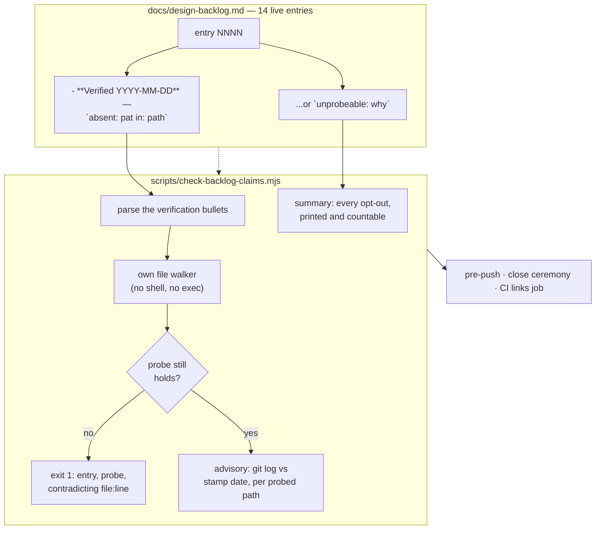

# 0093 — the backlog stops asserting things about a repo it has not read

> **Status:** draft
> **Created:** 2026-08-15
> **Owner skill(s):** dev
> **Related ADRs:** [ADR-0108](../adrs/0108-a-backlog-claim-about-the-repo-carries-an-executable-probe.md)

## TL;DR

Four backlog entries have been falsified and all four failed identically: each asserted something
about *the repository* — what it contains, what it documents, what is built — and each assertion was
wrong when written or shortly after. This plan makes that class checkable. A repo-claim carries a
dated verification bullet with a machine-runnable probe (`absent: <regex> in: <path>`), a new
`scripts/check-backlog-claims.mjs` re-runs every probe, and it joins the link checker at all three of
its call sites. The first user-visible behaviour: `node scripts/check-backlog-claims.mjs` prints
`backlog claims: OK (14 entries, 0 stale)` — or names the entry, the probe, and the file that
contradicts it.

## Context & problem

`docs/design-backlog.md` is the `preset-author → architect` inbox and the file the architect reads
when deciding what to design next. Its entries are meant to be **acted on now**, which is what makes
a stale one dangerous rather than merely historical: it sends the next reader to do work that is
already done.

Four have been falsified, and the pattern is one shape ([ADR-0108](../adrs/0108-a-backlog-claim-about-the-repo-carries-an-executable-probe.md)
carries the table): 0052, 0078, 0081, 0082. **Three carried no verification stamp at all.** The
fourth, 0081, carried one that was dated, recent and *true* — and verified the half of the entry that
survived rather than the half in its own title. That is the case that decides the mechanism: a prose
stamp records that somebody looked, not what they looked at, and cannot be re-run when the subject
moves.

The rule already exists in prose. The file's header says *"Verify every entry against the code before
acting on it"*, and `- **Verified against code:**` appears **52 times** across the live file and the
archive — many already citing `file:line`. Nothing re-reads any of them. The 2026-08-13 sweep wrote
the lifecycle down and the same drift recurred **within hours**, twice, which is this project's
standing evidence that a duty living only in prose is a duty that decays.

The cost is small and already counted: **14 live entries**, and the CI `links` job is
`ubuntu-latest` plus one `node` line with no setup step.

## Decision

Per [ADR-0108](../adrs/0108-a-backlog-claim-about-the-repo-carries-an-executable-probe.md): a
restricted, two-verb, **non-executing** probe grammar beside each claim, re-run by a checked-in
script that is a **gate** — with staleness as a printed **advisory** rather than a failure, and an
explicit `unprobeable: <why>` opt-out whose every use is printed in the summary.

We rejected a mandatory prose stamp with no probe (0081 proves a true stamp can miss its own
claim), staleness alone (blind to the birth-defect case, and both 0081 and 0082 were wrong at
birth), extending the gate to ADRs and plans (an accepted ADR is deliberately a frozen snapshot with
its own `Outcome` mechanism), and a probe on every entry with no opt-out (it manufactures weak probes
that read as verification).

## Architecture diagram



## Implementation phases

### Phase 1 — the checker exists and convicts a real historical claim

- **Owner skill:** dev
- **What:** `scripts/check-backlog-claims.mjs`, a sibling of `check-doc-links.mjs` in shape,
  reporting style (`file:line -> detail`), exit codes, and self-documenting header comment. It parses
  `- **Verified <ISO date>**` bullets out of `docs/design-backlog.md`, extracts inline-code probes in
  the two-verb grammar, and resolves them with **its own file walker — never `exec`, never a shell**
  (ADR-0108's Notes say why). It takes the same optional `root` argument the link checker takes.
  Grammar, exactly: `absent: <regex> in: <path>`, `present: <regex> in: <path>`, and
  `unprobeable: <free text>`. `<path>` is a file or a directory, resolved from the repo root.
- **Files touched:** `scripts/check-backlog-claims.mjs`, and a committed fixture tree under
  `scripts/fixtures/` (see below).
- **Done when:** three things hold, and the third is the one that matters.
  1. Run against the repo at `HEAD` it exits 0 — trivially, since no entry carries a probe yet, which
     is why Phase 2 is separate.
  2. Run against a **committed fixture tree** it reports exactly the seeded breaks and nothing else:
     one violated `absent:`, one violated `present:`, one malformed probe, one bullet with no probe
     and no opt-out, and one valid `unprobeable:` that must **not** be reported as a break.
     **This fixture also gives `check-doc-links.mjs`'s orphaned `root` argument its first caller** —
     Plan 0084 built that argument for a tree it never committed, recorded at its close as the one
     thing left undone, so the same fixture serves both and both bite checks become repeatable.
  3. **The non-vacuity half, and it is a permanent one:** a test asserts that the probe reconstructed
     from backlog 0082's own claim — `absent: sustained_miss in: core/src` — **fails against today's
     tree**. That is the instrument proving, without time travel, that it would have caught the
     historical case on the day the governor landed. If `sustained_miss` is ever renamed this test
     fails loudly, which is correct: it is pinned to the worked example, and the example is the point.

### Phase 2 — the 14 live entries get probes, and the failures are reported rather than resolved

- **Owner skill:** dev
- **What:** read each of the 14 live entries in `docs/design-backlog.md`, reduce its repo-claims to
  probes, and add a dated `- **Verified <today>**` bullet carrying them — or an `unprobeable: <why>`
  naming what makes it unreducible. Prefer the **narrowest** path that carries the claim
  (`core/src/render/tier.rs`, not `core/src`): a narrow path makes Phase 4's advisory quiet, and a
  narrow probe is a better probe.
- **Files touched:** `docs/design-backlog.md` only.
- **Done when:** every live entry carries either a dated verification bullet with at least one probe
  or a reasoned `unprobeable:`, and `node scripts/check-backlog-claims.mjs` exits 0 against `HEAD`.
  **Any entry whose probe comes back red is REPORTED in the phase commit and left alone — not
  repaired, not re-scoped, not deleted.** Whether a falsified entry is corrected in place, closed, or
  split is an `architect` call (a wrong live entry is more dangerous than a closed one, so the
  judgement matters more than the edit), and `dev` correctly refused exactly this at Plan 0085 Phase 4
  when it left backlog 0082 standing. **This plan authorizes `dev` to edit `docs/design-backlog.md`
  for the narrow purpose of adding verification bullets, and for nothing else.** Expect this phase to
  convict at least one entry — 14 entries, none ever mechanically checked, against a repo that has
  moved through ninety-odd plans.

### Phase 3 — the gate takes its three call sites

- **Owner skill:** dev
- **What:** wire the checker where the link checker already runs — `.githooks/pre-push` (beside the
  existing `check-doc-links.mjs` step, both before `fmt`), the CI `links` job as one more `- run:`,
  and the architect skill's close-ceremony step 1b, which is where a human is already running the
  link checker by hand. Ordering matters: this lands **after** Phase 2, so turning the gate on cannot
  red the build on its first day.
- **Files touched:** `.githooks/pre-push`, `.github/workflows/ci.yml`,
  `.claude/skills/architect/SKILL.md`.
- **Done when:** a deliberately broken probe (introduce one, run, revert) is caught by the hook and by
  a local `node scripts/check-backlog-claims.mjs`, and the CI job's step is present and named. The
  hook step must **skip cleanly when `node` is absent**, matching what the link-checker step already
  does — the hook is opt-in per clone and must not become the reason someone disables it (ADR-0033).
  The close-ceremony edit states the trigger and the output, because this project has repeated
  evidence that a ceremony duty with neither gets skipped.

### Phase 4 — staleness becomes a printed advisory

- **Owner skill:** dev
- **What:** for each probed path, ask `git log -1` for its most recent commit date and compare it
  against the entry's stamp date. Print the entries whose subject has moved since anyone last read
  them, as a summary block after the pass/fail line. **It never changes the exit code.** Print the
  `unprobeable:` roster in the same block, so the set of unchecked claims is visible and countable at
  every push.
- **Files touched:** `scripts/check-backlog-claims.mjs`, `docs/design-backlog.md` (its header
  documents the grammar and what the advisory means).
- **Done when:** the advisory names at least one real entry on the tree as it stands — and if it names
  **none**, that is a result to state in the commit rather than a threshold to lower, because Phase 2
  will have just re-stamped all 14 with today's date and a quiet advisory is the honest consequence.
  The exit code is unchanged by anything in this phase, asserted by running against a tree whose
  advisory is non-empty and observing exit 0.

## Data shapes

The probe grammar, in full. It is a *parsed* grammar, not a shell command — the script resolves it
with its own file walker, so a markdown file can describe a check without CI being able to execute a
document (ADR-0108).

```markdown
<!-- illustrative — the three forms, as they appear in an entry -->

- **Verified 2026-08-15** — the governor does not exist:
  `absent: sustained_miss in: core/src`
- **Verified 2026-08-15** — the rule is documented, and here:
  `present: G = C / 0\.85 in: presets/README.md`
- **Verified 2026-08-15** — `unprobeable: this is a judgement about rendered output,
  not a claim about repo contents`
```

```js
// illustrative — not the final interface
/** One parsed probe from a verification bullet. */
const probe = {
  entry: "0082",          // the `## NNNN —` heading it sits under
  line: 917,              // where the bullet is, for the file:line report
  verb: "absent",         // "absent" | "present" | "unprobeable"
  pattern: "sustained_miss", // a JS regex source; ignored for `unprobeable`
  path: "core/src",       // file or directory, resolved from the repo root
  stamped: "2026-08-15",  // the bullet's ISO date, for the Phase 4 advisory
};
```

## Risks & open questions

- **A passing probe is not a correct entry, and the summary line must not imply it is.** The probe
  verifies the reduction its author chose; 0081 was falsified *by* a verification that was true and
  off-target. The output should say what it checked, not bless the entry — the wording of the
  green line is a real decision, not a formatting detail.
- **`absent:` on a common word is a probe that can never fail.** `absent: governor in: core/src` is
  satisfiable forever and reads as verification. Nothing in the script can detect this, and it is the
  same weak-probe hazard ADR-0108's opt-out exists to relieve pressure on. The mitigation is that the
  probe is printed beside the claim and a reviewer can see it; there is no mechanical defence and the
  plan should not pretend to one.
- **Regexes in markdown need escaping, and the escaping will be got wrong.** `G = C / 0.85` needs its
  `.` escaped or it matches `0-85`. A malformed regex must be a **reported break naming the entry**,
  never a crash and never a silent skip — that is one of the five seeded fixture cases.
- **The fixture tree is shared with `check-doc-links.mjs` and could drift into serving one of them.**
  Keep the seeded cases per-checker and clearly named; a fixture that quietly stops exercising the
  link checker's three break classes would silently un-repeat the bite check Plan 0084 already left
  unrepeatable once.
- **A rename reds the gate for a reason that is not the entry's fault.** Accepted, and argued in
  ADR-0108's Negative section: an entry naming a symbol that no longer means what it meant needs
  re-reading whatever the cause.

## What this plan does NOT do

- **It does not gate ADRs or plans**, though both rot the same way (ADR-0099 named an instrument that
  did not exist; Plan 0085 Phase 3's own done-when named a log column that did not exist). ADR-0108
  Alternative C declines ADRs on a difference in kind; plans are the natural second scope and are a
  followup below, not this plan.
- **It does not touch `docs/design-backlog-archive.md`.** An archived entry is a closed record whose
  value is the correction it carries. Re-probing it would be checking history against the present.
- **It does not repair any entry Phase 2 convicts.** Reporting is `dev`'s; deciding whether a
  falsified entry is corrected in place, closed, or split is `architect`'s.
- **It does not make staleness a failure.** ADR-0108 Alternative B is explicit about why: scoped
  broadly it fires on every commit, scoped narrowly it says nothing.
- **It does not add a dependency.** Node is already assumed by `check-doc-links.mjs`, `docs-shots.mjs`
  and two tuple scripts; `git log` is already assumed by everything.

## Followups (after this lands)

- **Plans as a second scope.** A plan's done-when is a claim about the artifact it will be checked
  against, and Plan 0085 Phase 3 shipped one that was unsatisfiable as written. If Phase 2 shows the
  grammar carries its weight on the backlog, extending it to `docs/plans/*.md` (active plans only,
  never `done/`) is a small plan of its own.
- **A `count:` verb**, if a claim ever needs one. Deliberately omitted — no falsified entry needed it,
  and a third verb is a grammar to learn rather than a check to run.
