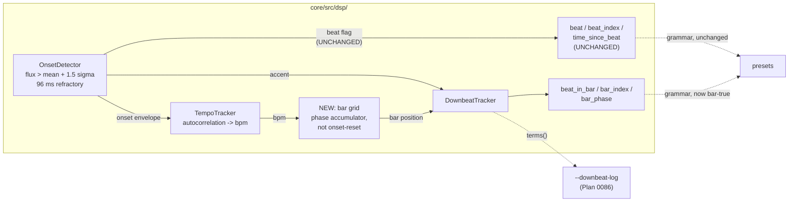

# 0095 — the downbeat fold gets a musical beat

> **Status:** in-progress
> **Created:** 2026-08-15
> **Owner skill(s):** dev, human
> **Related ADRs:** [ADR-0109](../adrs/0109-the-beat-clock-counts-onsets-not-beats.md),
> supplementing [ADR-0050](../adrs/0050-downbeat-and-phrase-tracking-with-confidence-fallback.md),
> [ADR-0082](../adrs/0082-the-downbeat-gate-holds-and-the-estimator-is-diagnosed-first.md) and
> [ADR-0097](../adrs/0097-the-downbeat-cue-is-chosen-against-per-beat-evidence.md)
> **Succeeds:** [0086](done/0086-the-downbeat-finds-a-cue-that-is-not-the-kick.md), which measured the
> defect this plan repairs and shipped the instrument it is measured with

## TL;DR

The downbeat fold is indexed by onset-detector events, not musical beats — measured at
**1.73x / 1.35-2.10x / 1.76x** detections per beat on three genres, wandering across 1x, 2x and
4x *inside* a single track, against a synthesized control that reads exactly 1.00. So
`beat_index % 4` spans well under a bar and a bar-locked accent precesses across all four
alignments. Per [ADR-0109](../adrs/0109-the-beat-clock-counts-onsets-not-beats.md) this plan
gives Layer 2 its **own** bar grid, built from the autocorrelated tempo, and leaves `beat` /
`beat_index` / `time_since_beat` bit-for-bit unchanged. The tempo estimate is octave-unstable
and settling it is **on the critical path**, not a follow-on. The authoring docs, which
currently teach the false idiom, are corrected here.

## Context & problem

[Plan 0086](done/0086-the-downbeat-finds-a-cue-that-is-not-the-kick.md) Phase 1 shipped
`--downbeat-log`, and its Phase 2 captured three matched 240 s runs on real material. The
table, and the reason it is the whole argument, is in
[ADR-0109](../adrs/0109-the-beat-clock-counts-onsets-not-beats.md); the shape of it:

| | techno | hip-hop | rock/pop | synthesized control |
|---|---|---|---|---|
| detections per musical beat | 1.73x | 1.35-2.10x | 1.76x | **1.00** |
| publish rate | 2.89 % | 1.59 % | 2.27 % | locks |
| `effect_corrected` median | 0.0000 | 0.0000 | 0.0000 | — |

`beat_index` is `beats_seen - 1` (`core/src/dsp/tempo.rs:122`), `beats_seen` increments on the
onset flag unconditionally (`tempo.rs:107-110`), and that flag is `flux > mean + 1.5 * std` with
a 96 ms refractory and no tempo gating (`core/src/dsp/onset.rs:70-73`).

Two things make this harder than re-pointing an index:

- **The tracker's existing phase is contaminated.** `tempo.rs:107-110` resets `phase` to `0` on
  every detected onset, so it is yanked 1.7-2.1x per beat by the same detector. Only `bpm` is
  independent.
- **`bpm` is octave-unstable.** Across the same three runs: p10 **64.0** against a 128.0 median,
  and p90 **200.9** against a 100.2 median — both at the `MIN_BPM` 60 / `MAX_BPM` 200 search
  bounds. A grid built on a rate that halves and doubles inherits the jump.

## Decision

Per ADR-0109: build a bar-scale grid inside the analysis path from the autocorrelated tempo plus
a phase accumulator **not** reset by every onset, and fold the accent history over *that*.
`beat`, `beat_index` and `time_since_beat` keep their present behaviour exactly, so no preset's
flash timing moves. `CONFIDENCE_THRESHOLD` does not move (ADR-0082's reason is untouched).

**Measure before repairing, twice.** Phase 1 measures the tempo estimate on known input before
Phase 2 changes it; Phase 5 re-measures the whole chain through the same instrument Plan 0086
built, against the same three genres. This is ADR-0097's shape, and it is what turned that
plan's inherited argument into this plan's evidence.

## Architecture diagram

## Implementation phases

### Phase 1 — the tempo estimate is measured before it is touched

- **Owner skill:** dev
- **What:** a probe over synthesized clips at **known** tempos through the real `Analyzer`,
  printing the estimate against the truth: a BPM ladder across the search range, plus the two
  ambiguous cases the live captures hit — a pattern with strong off-beat energy (invites
  double-time) and one with a sparse half-time feel (invites half-time).
- **Files touched:** a new `core/tests/tempo_probe.rs`, `core/src/signal.rs` if a generator is
  missing.
- **Done when:** the table prints, in the shape `downbeat_probe.rs` established, and the
  assertions are **properties** rather than frozen numbers (ADR-0071): on an unambiguous click
  train the estimate is within a stated tolerance of the truth *or of an exact octave of it*,
  and the octave error is reported as its own column rather than folded into the error. **The
  deliverable is the table** — it is what Phase 2 chooses a repair against.

### Phase 2 — the tempo estimate stops jumping octaves

- **Owner skill:** dev
- **What:** the repair Phase 1's table indicates. Stated as properties because the plan will not
  pick it blind: candidates are octave-preference scoring against the autocorrelation's
  harmonics, hysteresis on the estimate, or a comb-filter score over the envelope.
- **Files touched:** `core/src/dsp/tempo.rs`, `core/tests/tempo_probe.rs`.
- **Done when:** the module keeps its panic-denial pragma, stays allocation-free after
  construction and clock-free, and its state remains fixed arrays. Determinism holds — the same
  envelope produces the same estimate, pinned by feeding one buffer twice. On Phase 1's ladder
  the octave-error column **improves and no rung regresses**; on the two ambiguous cases the
  estimate is stable *or* the plan records that it is not and says which rung defeated it. NFR
  section 6's window budget is the ceiling; a repair that does not fit is a finding and the next
  candidate is taken.

### Phase 3 — the bar grid exists, and nothing reads it yet

- **Owner skill:** dev
- **What:** a phase accumulator advanced by `bpm` and **not** reset by the onset flag, exposed
  only within the analysis path. A walking skeleton: built, tested, wired to nothing.
- **Files touched:** `core/src/dsp/tempo.rs` (or a new `core/src/dsp/grid.rs` if it earns its own
  module), `core/src/dsp/mod.rs`.
- **Done when:** the grid's position over a synthesized clip of known tempo advances exactly one
  bar per four musical beats, asserted against the clip's construction rather than against the
  onset stream. `beat`, `beat_index` and `time_since_beat` are **provably unchanged** — a test
  drives a clip through the analyzer and asserts the three are bit-identical to a run on the
  unchanged code path, which is the property that keeps every shipped preset's timing intact.

### Phase 4 — the fold folds over the grid

- **Owner skill:** dev
- **What:** `DownbeatTracker` takes bar position from the grid instead of `beat_index %
  BEATS_PER_BAR`.
- **Files touched:** `core/src/dsp/downbeat.rs`, `core/src/dsp/mod.rs`.
- **Done when:** the module's existing synthesized tests still classify correctly —
  **including the unaccented click train, which must still score near zero**, because a change
  that raises confidence on material with no bar structure has broken the gate rather than
  improved the estimator. The hot-path contract is asserted, not argued: pragma intact,
  allocation-free after construction, clock-free, fixed-array state, and determinism pinned by
  feeding one buffer twice. `CONFIDENCE_THRESHOLD` is unchanged and a test asserts the constant
  rather than trusting the diff. The one fixture binding a bar variable
  (`core/tests/fixtures/composite_symmetry.toml`) is re-blessed if it moves — **and the
  baseline-drift control applies**: bless twice on the same branch differing only by reverting
  the change, never diff against the committed bytes (`docs/plans/README.md`).

### Phase 5 — re-measure through the same instrument

- **Owner skill:** human
- **What:** re-run Plan 0086 Phase 2's capture — three genres, matched 240 s, the user's own
  material — with `--downbeat-log`, and read the new table beside the old one.
- **Done when:** the detections-per-beat column is no longer the fold's index (it will still
  read 1.7-2.1x, because `beat_index` is deliberately unchanged — what must change is that the
  *fold* no longer tracks it), the publish rate is recorded per genre against the 2.89 / 1.59 /
  2.27 % baseline, and the score profile is re-read for ADR-0097's degeneracy signature on
  backbeat rock/pop, which is the question this repair finally makes askable. **An improvement
  that does not rescue the backbeat case is a recorded outcome**, not a failed phase.

### Phase 6 — the authoring docs stop teaching the false idiom

- **Owner skill:** dev
- **What:** correct what `beat_index` is documented to count, retract the bar-arithmetic idiom,
  and name the six presets whose comments claim a musical period they do not get.
- **Files touched:** `presets/README.md`, `docs/presets.md`,
  `.claude/skills/preset-author/references/` if its tables name the musical-time variables, and
  the header comments of `attractor_valentine`, `attractor_torusknot`, `attractor_thomas`,
  `attractor_dragon`, `curve_nightbloom`, `fragment_vitrail`.
- **Done when:** no doc says `beat_index` counts musical beats or that `mod(beat_index, 16)` is
  four bars; `presets/README.md`'s *"always meaning what they say"* is gone; the bar trio's entry
  reflects whatever Phase 5 measured; and the six preset headers state the period they actually
  get. **The presets' expressions are not re-tuned** — that is content work and the
  `preset-author` lane's, and it is listed as a followup rather than done here.

## Risks & open questions

- **Phase 2 may not be solvable at this cost.** Octave ambiguity is a genuinely hard DSP problem
  and this plan puts it on the critical path by choice (ADR-0109). If Phase 1's table shows the
  estimate is stable enough on real material to grid against, Phase 2 shrinks to a hysteresis;
  if it shows the octave choice is essentially a coin flip, the plan stops at Phase 2 with a
  diagnosis and the grid is not built on sand.
- **A grid that free-runs will drift.** A phase accumulator not corrected by anything will walk
  off the music within seconds at any tempo error. The design question Phase 3 has to answer is
  what corrects it *without* reintroducing the onset contamination — a candidate is correcting
  toward the onset stream's *median* phase over a window rather than snapping to each event.
  This is the plan's most likely place to need a second attempt.
- **The measurement that motivated this may not be the whole story.** Plan 0068's 6.79 % / 0.14 %
  genre split did **not** reproduce (all three genres landed 1.6-2.9 %). Either it is material
  this capture set lacked or the two statistics differ. Phase 5 will produce a third reading and
  should say which.
- **New DSP on the sacred path.** Phases 2-4 all touch the analysis hop. The pragma, fixed-array
  state, determinism tests and the NFR section 6 window budget are the guard.

## What this plan does NOT do

- **It does not change what `beat`, `beat_index` or `time_since_beat` mean**, and Phase 3
  asserts that as a bit-identity property. ADR-0109's Alternatives A and B record why.
- **It does not rename `beat_index`.** The name stays wrong; the docs stop compounding it.
- **It does not re-tune the six mis-scaled presets.** Phase 6 corrects their comments; the
  expressions are content work.
- **It does not move `CONFIDENCE_THRESHOLD`, `SWITCH_MARGIN` or `HYSTERESIS_BEATS`.**
- **It does not touch the C ABI.** Analysis diagnostics are native-only (ADR-0052);
  `LMV_ABI_VERSION` stays 4.
- **It does not choose the accent cue.** ADR-0097's shortlist stays deferred until the fold has a
  bar-scale unit and Phase 5 has re-read the decomposition on it.

## Implementation log

> Written by `dev` — one row per phase as that phase's commit lands, and the close block after the
> last one. **The phases above are the contract; everything here is what happened.**

**Lane:** `WORK/lmv-plan-0095` on `plan-0095-musical-bar-grid`, branched from `main` at `1be71c8`.

| phase | owner | state | commit |
|---|---|---|---|
| 1 — the tempo estimate is measured | dev | done | `5bdce91` |
| 2 — the octave repair | dev | done | `09abdee` |
| 3 — the bar grid | dev | done | `cae98a5` |
| 4 — the fold folds over the grid | dev | done | `d4e7cec` |
| 5 — re-measure through the instrument | human | not started | — |
| 6 — the authoring docs | dev | not started | — |

**Session stopped at Phase 5, the `human` gate.** Phases 1-4 are landed and the whole suite is
green (`cargo nextest run -p lmv-core`, 725 passed). Phase 6 is `dev` but sits behind Phase 5: one
of its done-whens — "the bar trio's entry reflects whatever Phase 5 measured" — cannot be written
until the capture is read, so the phase was left whole rather than half-written. What Phase 6 needs
from Phase 5 is the publish rate per genre against the 2.89 / 1.59 / 2.27 % baseline, and whether
the backbeat rock/pop degeneracy signature survives. **Nothing in Phases 1-4 changed what
`beat_index` counts, so Phase 5's detections-per-beat column will still read 1.7-2.1x** — that is
the plan's own prediction and not a null result; what must have changed is that the *fold* no longer
tracks it.

**Phase 1's table** (`cargo nextest run -p lmv-core --test tempo_probe --no-capture`), the reading
Phase 2 chooses against:

| case | truth | p10 | median | p90 | octave | err | oct-jump |
|---|---|---|---|---|---|---|---|
| click train, 60-200 BPM (8 rungs) | — | — | — | — | **x1 on all 8** | max 0.4 % | 0 % |
| off-beat clicks at 0.30, 90 BPM | 90.0 | 89.9 | 90.0 | 90.1 | x1 | 0.0 % | 0 % |
| off-beat clicks at 0.50, 90 BPM | 90.0 | 90.0 | 180.4 | 180.5 | **x2** | 0.2 % | 15 % |
| off-beat clicks at 0.80, 90 BPM | 90.0 | 180.4 | 180.4 | 180.5 | **x2** | 0.2 % | 0 % |
| half-time, beats 2/4 at 0.70, 150 BPM | 150.0 | 75.0 | 75.0 | 75.0 | **/2** | 0.0 % | 0 % |
| half-time, beats 2/4 at 0.50, 150 BPM | 150.0 | 75.0 | 75.0 | 75.0 | **/2** | 0.0 % | 0 % |
| half-time, beats 2/4 at 0.25, 150 BPM | 150.0 | 75.0 | 75.0 | 75.0 | **/2** | 0.0 % | 0 % |

**Phase 2 did not settle the octave, and the reading that says why is
`the_octave_ambiguity_is_one_sided`** in the same file. Correlation at the winning lag's octave
neighbours, as a share of the peak:

| direction | clean click trains | trap |
|---|---|---|
| halving (corr at 2L) — "is the beat slower?" | 80.0 - 88.5 % | off-beat: 75.2 - 90.7 % |
| doubling (corr at L/2) — "is the beat faster?" | -4.0 - -2.4 % | half-time: 37.5 - 79.7 % |

Every periodic signal correlates at twice its own lag, so the halving column does not separate and
a preference rule taking the slower reading moved the 140/165/200 rungs down an octave in trial. The
doubling column does separate, and was refused: it fires on a 60-100 BPM track with events between
the beats, which is the capture set's hip-hop. So the repair is the third candidate — a margin plus
a hold on the winning lag. **The three trap rungs stay an octave off after Phase 2**; what changed
is that the off-beat 0.50 rung stopped flickering (15 % of its window on the other octave, now
0 %), and all twelve rows are now stable. Every ladder rung reads the same value it read before the
repair.

**Phase 3 answered the plan's open design question — the grid is phase-locked, not free-running.**
The risk section asked what corrects the drift without reintroducing the onset contamination; what
shipped is a phase-locked loop over the onset **envelope** (two exponentially-decayed quadrature
accumulators, 2 s time constant, 2 % of the error corrected per hop), which is the plan's
"aggregate phase over a window" rather than its literal "median". The reason it is not free-running
is in `grid.rs`'s module docs and is not drift: a free accumulator can settle with its beat boundary
sitting *on* the transients, which splits every accent across two cells and smears the fold it
exists to sharpen. It lives in a new `core/src/dsp/grid.rs`, registered in `dsp/mod.rs` and read by
nothing.

**Phase 4 found a defect in Phase 3's grid, and its commit repairs it — so it touches
`core/src/dsp/grid.rs`, which is outside the phase's stated file list.** Wiring the fold to the
grid turned `the_downbeat_estimator_locks_onto_a_kick_pattern_in_real_audio` red: the estimator
still locked, but the accented beats no longer all read `beat_in_bar` 0. The grid's *rate* was
exactly right (119.9 BPM against a 120 BPM stimulus, 1 grid beat per musical beat on average) and
its phase lock was working as designed — which was the defect. Parking the envelope's energy at
phase 0 puts the grid's cell boundary **on** the transients, so each flag landed at phase 0.98 or
0.01 and its bucket was decided by where the 10.7 ms hop lattice fell; the grid beat count skipped
one and repeated another across successive musical beats. `LOCK_TARGET` now parks the energy 0.12
of a beat in, and the same stimulus reads +1 per musical beat with the phase steady at 0.11-0.12.

**`core/tests/fixtures/composite_symmetry.toml` did not move, and could not have.** Its golden is
driven by a hand-built `AnalysisFrame` (`core/tests/composite.rs:223`), never by the analyzer, so no
DSP change reaches it — the re-bless the phase called for was structurally unreachable rather than
merely unexercised, and no baseline-drift control was run.

## Followups (after this lands)

- **The accent-cue question becomes askable again** — ADR-0097's Alternative A (a second accent
  band) against its Alternative B (a harmonic-change cue), now with a fold that is indexed by
  the bar and a decomposition that can separate them.
- **The six presets' bar arithmetic**, re-tuned to a musical period by the `preset-author` lane
  once Phase 6 has named them.
- **Phrase-level structure (8/16-bar arcs)**, which ADR-0050 always pointed at and which is
  unreachable while Layer 2 is fallback.
