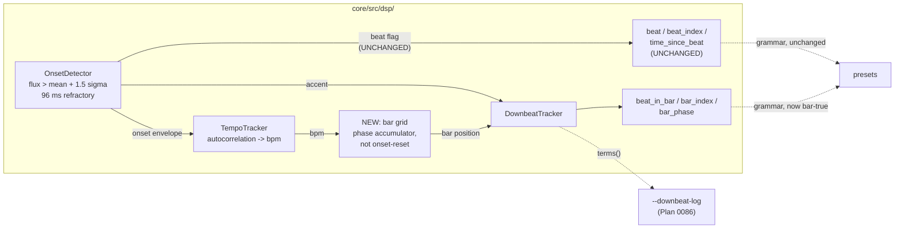

# 0095 — the downbeat fold gets a musical beat

> **Status:** in-progress
> **Created:** 2026-08-15
> **Owner skill(s):** dev, human
> **Related ADRs:** [ADR-0109](../adrs/0109-the-beat-clock-counts-onsets-not-beats.md),
> supplementing [ADR-0050](../adrs/0050-downbeat-and-phrase-tracking-with-confidence-fallback.md),
> [ADR-0082](../adrs/0082-the-downbeat-gate-holds-and-the-estimator-is-diagnosed-first.md) and
> [ADR-0097](../adrs/0097-the-downbeat-cue-is-chosen-against-per-beat-evidence.md)
> **Succeeds:** [0086](done/0086-the-downbeat-finds-a-cue-that-is-not-the-kick.md), which measured the
> defect this plan repairs and shipped the instrument it is measured with
> **Reviewed:** 2026-08-25 (Mode 4) - no blockers, four majors, all one shape. **Phase 7 below
> is the repair pass**; the fourth major (an `Outcome` on ADR-0109, which claims the tempo estimate
> was settled when only its *stability* was) is architect-owned and lands at the close.

## TL;DR

The downbeat fold is indexed by onset-detector events, not musical beats — measured at
**1.73x / 1.35-2.10x / 1.76x** detections per beat on three genres, wandering across 1x, 2x and
4x *inside* a single track, against a synthesized control that reads exactly 1.00. So
`beat_index % 4` spans well under a bar and a bar-locked accent precesses across all four
alignments. Per [ADR-0109](../adrs/0109-the-beat-clock-counts-onsets-not-beats.md) this plan
gives Layer 2 its **own** bar grid, built from the autocorrelated tempo, and leaves `beat` /
`beat_index` / `time_since_beat` bit-for-bit unchanged. The tempo estimate is octave-unstable
and settling it is **on the critical path**, not a follow-on. The authoring docs, which
currently teach the false idiom, are corrected here.

## Context & problem

[Plan 0086](done/0086-the-downbeat-finds-a-cue-that-is-not-the-kick.md) Phase 1 shipped
`--downbeat-log`, and its Phase 2 captured three matched 240 s runs on real material. The
table, and the reason it is the whole argument, is in
[ADR-0109](../adrs/0109-the-beat-clock-counts-onsets-not-beats.md); the shape of it:

| | techno | hip-hop | rock/pop | synthesized control |
|---|---|---|---|---|
| detections per musical beat | 1.73x | 1.35-2.10x | 1.76x | **1.00** |
| publish rate | 2.89 % | 1.59 % | 2.27 % | locks |
| `effect_corrected` median | 0.0000 | 0.0000 | 0.0000 | — |

`beat_index` is `beats_seen - 1` (`core/src/dsp/tempo.rs:122`), `beats_seen` increments on the
onset flag unconditionally (`tempo.rs:107-110`), and that flag is `flux > mean + 1.5 * std` with
a 96 ms refractory and no tempo gating (`core/src/dsp/onset.rs:70-73`).

Two things make this harder than re-pointing an index:

- **The tracker's existing phase is contaminated.** `tempo.rs:107-110` resets `phase` to `0` on
  every detected onset, so it is yanked 1.7-2.1x per beat by the same detector. Only `bpm` is
  independent.
- **`bpm` is octave-unstable.** Across the same three runs: p10 **64.0** against a 128.0 median,
  and p90 **200.9** against a 100.2 median — both at the `MIN_BPM` 60 / `MAX_BPM` 200 search
  bounds. A grid built on a rate that halves and doubles inherits the jump.

## Decision

Per ADR-0109: build a bar-scale grid inside the analysis path from the autocorrelated tempo plus
a phase accumulator **not** reset by every onset, and fold the accent history over *that*.
`beat`, `beat_index` and `time_since_beat` keep their present behaviour exactly, so no preset's
flash timing moves. `CONFIDENCE_THRESHOLD` does not move (ADR-0082's reason is untouched).

**Measure before repairing, twice.** Phase 1 measures the tempo estimate on known input before
Phase 2 changes it; Phase 5 re-measures the whole chain through the same instrument Plan 0086
built, against the same three genres. This is ADR-0097's shape, and it is what turned that
plan's inherited argument into this plan's evidence.

## Architecture diagram

## Implementation phases

### Phase 1 — the tempo estimate is measured before it is touched

- **Owner skill:** dev
- **What:** a probe over synthesized clips at **known** tempos through the real `Analyzer`,
  printing the estimate against the truth: a BPM ladder across the search range, plus the two
  ambiguous cases the live captures hit — a pattern with strong off-beat energy (invites
  double-time) and one with a sparse half-time feel (invites half-time).
- **Files touched:** a new `core/tests/tempo_probe.rs`, `core/src/signal.rs` if a generator is
  missing.
- **Done when:** the table prints, in the shape `downbeat_probe.rs` established, and the
  assertions are **properties** rather than frozen numbers (ADR-0071): on an unambiguous click
  train the estimate is within a stated tolerance of the truth *or of an exact octave of it*,
  and the octave error is reported as its own column rather than folded into the error. **The
  deliverable is the table** — it is what Phase 2 chooses a repair against.

### Phase 2 — the tempo estimate stops jumping octaves

- **Owner skill:** dev
- **What:** the repair Phase 1's table indicates. Stated as properties because the plan will not
  pick it blind: candidates are octave-preference scoring against the autocorrelation's
  harmonics, hysteresis on the estimate, or a comb-filter score over the envelope.
- **Files touched:** `core/src/dsp/tempo.rs`, `core/tests/tempo_probe.rs`.
- **Done when:** the module keeps its panic-denial pragma, stays allocation-free after
  construction and clock-free, and its state remains fixed arrays. Determinism holds — the same
  envelope produces the same estimate, pinned by feeding one buffer twice. On Phase 1's ladder
  the octave-error column **improves and no rung regresses**; on the two ambiguous cases the
  estimate is stable *or* the plan records that it is not and says which rung defeated it. NFR
  section 6's window budget is the ceiling; a repair that does not fit is a finding and the next
  candidate is taken.

### Phase 3 — the bar grid exists, and nothing reads it yet

- **Owner skill:** dev
- **What:** a phase accumulator advanced by `bpm` and **not** reset by the onset flag, exposed
  only within the analysis path. A walking skeleton: built, tested, wired to nothing.
- **Files touched:** `core/src/dsp/tempo.rs` (or a new `core/src/dsp/grid.rs` if it earns its own
  module), `core/src/dsp/mod.rs`.
- **Done when:** the grid's position over a synthesized clip of known tempo advances exactly one
  bar per four musical beats, asserted against the clip's construction rather than against the
  onset stream. `beat`, `beat_index` and `time_since_beat` are **provably unchanged** — a test
  drives a clip through the analyzer and asserts the three are bit-identical to a run on the
  unchanged code path, which is the property that keeps every shipped preset's timing intact.

### Phase 4 — the fold folds over the grid

- **Owner skill:** dev
- **What:** `DownbeatTracker` takes bar position from the grid instead of `beat_index %
  BEATS_PER_BAR`.
- **Files touched:** `core/src/dsp/downbeat.rs`, `core/src/dsp/mod.rs`.
- **Done when:** the module's existing synthesized tests still classify correctly —
  **including the unaccented click train, which must still score near zero**, because a change
  that raises confidence on material with no bar structure has broken the gate rather than
  improved the estimator. The hot-path contract is asserted, not argued: pragma intact,
  allocation-free after construction, clock-free, fixed-array state, and determinism pinned by
  feeding one buffer twice. `CONFIDENCE_THRESHOLD` is unchanged and a test asserts the constant
  rather than trusting the diff. The one fixture binding a bar variable
  (`core/tests/fixtures/composite_symmetry.toml`) is re-blessed if it moves — **and the
  baseline-drift control applies**: bless twice on the same branch differing only by reverting
  the change, never diff against the committed bytes (`docs/plans/README.md`).

### Phase 5 — re-measure through the same instrument

- **Owner skill:** human
- **What:** re-run Plan 0086 Phase 2's capture — three genres, matched 240 s, the user's own
  material — with `--downbeat-log`, and read the new table beside the old one.
- **Done when:** the detections-per-beat column is no longer the fold's index (it will still
  read 1.7-2.1x, because `beat_index` is deliberately unchanged — what must change is that the
  *fold* no longer tracks it), the publish rate is recorded per genre against the 2.89 / 1.59 /
  2.27 % baseline, and the score profile is re-read for ADR-0097's degeneracy signature on
  backbeat rock/pop, which is the question this repair finally makes askable. **An improvement
  that does not rescue the backbeat case is a recorded outcome**, not a failed phase.

### Phase 6 — the authoring docs stop teaching the false idiom

- **Owner skill:** dev
- **What:** correct what `beat_index` is documented to count, retract the bar-arithmetic idiom,
  and name the six presets whose comments claim a musical period they do not get.
- **Files touched:** `presets/README.md`, `docs/presets.md`,
  `.claude/skills/preset-author/references/` if its tables name the musical-time variables, and
  the header comments of `attractor_valentine`, `attractor_torusknot`, `attractor_thomas`,
  `attractor_dragon`, `curve_nightbloom`, `fragment_vitrail`.
- **Done when:** no doc says `beat_index` counts musical beats or that `mod(beat_index, 16)` is
  four bars; `presets/README.md`'s *"always meaning what they say"* is gone; the bar trio's entry
  reflects whatever Phase 5 measured; and the six preset headers state the period they actually
  get. **The presets' expressions are not re-tuned** — that is content work and the
  `preset-author` lane's, and it is listed as a followup rather than done here.

### Phase 7 — the review findings are repaired

- **Owner skill:** dev
- **Why this phase exists:** the Mode 4 close review (2026-08-25) found no blockers and four
  majors, all one shape — **the shipped docs and the test set generalize past what the captures
  measured**, on the axis the implementation log itself flags. The fourth is architect-owned (an
  `Outcome` on ADR-0109) and is not here. These six are.
- **Files touched:** `core/src/dsp/mod.rs`, `core/src/dsp/grid.rs`, `core/src/dsp/tempo.rs`,
  `core/src/dsp/downbeat.rs`, `docs/presets.md`, `presets/README.md`,
  `.claude/skills/preset-author/SKILL.md`, `presets/attractor_walkdejong.toml`,
  `presets/shape_pulse.toml`.

**7a — `bar_index` stops stepping backwards at the grid handover.** `mod.rs` switches
`fold_count` from `clock.beat_index` to the grid's beat count, which restarts at `0`, so the
published `bar_index` jumps back once per stream at ~4.2 s. Measured through the real `Analyzer`:
**1 bar** on a 120 BPM click train, **2** on `offbeat_click_track(90, 0.8)`, **3** on
`click_track(200)` and on `dynamic_groove(124)` — larger on material with a denser onset stream.
`docs/presets.md` asserts it *"never moves by more than a bar"*, and nothing tests it.

The repair is a one-time offset, **not** a doc correction: capture `grid_offset` on the first hop
where `grid.running` turns true, as `clock.beat_index` rounded **up to the next multiple of
`BEATS_PER_BAR`**, and fold over `grid_offset + grid.bar_index * BEATS_PER_BAR +
grid.beat_in_bar`. Rounding to a whole bar is what makes this safe: the offset is invisible to
`beat_in_bar` and to the fold's four buckets (whose phase is arbitrary anyway — `alignment`
absorbs it), and it leaves the published `bar_index` continuing forward across the handover.

- **Done when:** the published `bar_index` is monotone across the handover on every stimulus above
  and on `dynamic_groove`, asserted by a test that drives PCM through the analyzer rather than the
  tracker directly — the handover only exists at that level. The one remaining non-monotonicity is
  the alignment change `bar_index_steps_back_across_an_alignment_change` already pins, and
  `docs/presets.md`'s "never more than a bar" becomes true rather than deleted.

**7b — the grid is probed where the tempo estimate is an octave off.** Every `grid.rs` test and
`the_downbeat_estimator_locks_onto_a_kick_pattern_in_real_audio` drive **one transient per beat**
— the single configuration where the grid, the tempo estimate and `beat_index` all agree, so no
test at it can say which of the three the grid actually followed. That is the coincidence
[ADR-0037](../adrs/0037-internal-grid-is-a-resolution-not-a-shape.md) is about, one subsystem
over. The uncovered case is not hypothetical: Phase 2 proved the halving direction undiscriminable,
`offbeat_click_track(90, ., 0.5)` and `(., 0.8)` read `bpm` 180, and the live hip-hop capture read
a 165.4 median on a track that counts at ~90.

The property to assert is **not** that the grid finds a bar there — it provably cannot. It is that
**the grid tracks whatever rate it is handed**: across a settled window its beat rate matches the
estimator's own `bpm` within the tolerance
`the_grid_advances_one_bar_per_four_musical_beats` already states, and the bar counter stays
monotone. That is the reading which separates *"the grid tracks and the accent feature is weak"*
from *"the grid does not track on this material"* — the pair the Phase 5 captures could not
separate, because no log column carries the grid.

- **Done when:** that test exists on at least the two off-beat stimuli whose estimate sits an
  octave high, and its failure message says which of the two readings it caught.

**7c — the operator docs stop claiming a bar the captures did not measure.** `presets/README.md`
says *"so its unit really is a bar"* and `.claude/skills/preset-author/SKILL.md` says *"so its
unit is a real bar"*, the latter citing the hip-hop 3.67 % — the one capture where the estimate
sat an octave high and the grid's bar therefore spanned two musical beats. The log records this;
the docs an author reads do not, and this lane keeps no catalogue of its own.

- **Done when:** both files state what was earned — the grid's bar is a **stable integer multiple
  of the beat**, which is a real bar when the tempo estimate is on the right octave and half or
  double one when it is not — and the hip-hop figure carries that caveat where it is cited. The
  numbers themselves do not move; only the claim attached to them.

**7d — `tempo.rs:182`'s trap figure matches the probe.** The doc comment on
`TempoTracker::hold` cites *"77.7-94.5 %"* for the off-beat traps; the shipped probe prints
**75.2 %** and **90.7 %**. The clean range on the same line (80.0-88.5 %) matches exactly, so it
is the trap figure alone that is stale, from an earlier probe configuration. The argument survives
— the ranges still overlap — but the number is the evidence the argument cites.

- **Done when:** the comment's numbers are the ones
  `the_octave_ambiguity_is_one_sided` prints, and it names that test as where they come from, so
  the next edit to the trap set has somewhere to look.

**7e — the two stale `(beat_index - alignment) / 4` doc comments.** `core/src/dsp/mod.rs:160`
(`AnalysisFrame::bar_index`) and `core/src/dsp/downbeat.rs:488` still carry the derivation Phase 4
falsified. `docs/presets.md` was corrected in Phase 6; the Rust API doc for the same variable was
not, and `downbeat.rs:488` is inside the file Phase 4 edited.

- **Done when:** both read the grid's beat count, with `beat_index` named as the warmup fallback,
  matching the wording `docs/presets.md` already landed on. A repo-wide grep for the old
  derivation returns only ADR-0050 and the archive, which are historical records and stay as
  written.

**7f — the two preset headers Phase 6's file list missed.**
`presets/attractor_walkdejong.toml:44` states *"Every 16 beats is ~8 s at 120 BPM, well inside one
48 s round trip"* — the exact arithmetic Phase 6 retracts, load-bearing in its own sentence, in a
file that is not among the plan's six. `presets/shape_pulse.toml:123` cites "1.7-2.1x", narrower
than the 1.20x-2.28x these captures measured.

- **Done when:** both headers state the period they actually get, in the shape the six already
  landed on, and their conclusions are re-checked rather than assumed — `walkdejong`'s round-trip
  claim survives the correction (16 detections is ~3.5-7 s, still inside 48 s) and should say so
  rather than quietly dropping the number. **No expression changes**, same as Phase 6.

## Risks & open questions

- **Phase 2 may not be solvable at this cost.** Octave ambiguity is a genuinely hard DSP problem
  and this plan puts it on the critical path by choice (ADR-0109). If Phase 1's table shows the
  estimate is stable enough on real material to grid against, Phase 2 shrinks to a hysteresis;
  if it shows the octave choice is essentially a coin flip, the plan stops at Phase 2 with a
  diagnosis and the grid is not built on sand.
- **A grid that free-runs will drift.** A phase accumulator not corrected by anything will walk
  off the music within seconds at any tempo error. The design question Phase 3 has to answer is
  what corrects it *without* reintroducing the onset contamination — a candidate is correcting
  toward the onset stream's *median* phase over a window rather than snapping to each event.
  This is the plan's most likely place to need a second attempt.
- **The measurement that motivated this may not be the whole story.** Plan 0068's 6.79 % / 0.14 %
  genre split did **not** reproduce (all three genres landed 1.6-2.9 %). Either it is material
  this capture set lacked or the two statistics differ. Phase 5 will produce a third reading and
  should say which.
- **New DSP on the sacred path.** Phases 2-4 all touch the analysis hop. The pragma, fixed-array
  state, determinism tests and the NFR section 6 window budget are the guard.

## What this plan does NOT do

- **It does not change what `beat`, `beat_index` or `time_since_beat` mean**, and Phase 3
  asserts that as a bit-identity property. ADR-0109's Alternatives A and B record why.
- **It does not rename `beat_index`.** The name stays wrong; the docs stop compounding it.
- **It does not re-tune the six mis-scaled presets.** Phase 6 corrects their comments; the
  expressions are content work.
- **It does not move `CONFIDENCE_THRESHOLD`, `SWITCH_MARGIN` or `HYSTERESIS_BEATS`.**
- **It does not touch the C ABI.** Analysis diagnostics are native-only (ADR-0052);
  `LMV_ABI_VERSION` stays 4.
- **It does not choose the accent cue.** ADR-0097's shortlist stays deferred until the fold has a
  bar-scale unit and Phase 5 has re-read the decomposition on it.

## Implementation log

> Written by `dev` — one row per phase as that phase's commit lands, and the close block after the
> last one. **The phases above are the contract; everything here is what happened.**

**Lane:** `WORK/lmv-plan-0095` on `plan-0095-musical-bar-grid`, branched from `main` at `1be71c8`.

| phase | owner | state | commit |
|---|---|---|---|
| 1 — the tempo estimate is measured | dev | done | `5bdce91` |
| 2 — the octave repair | dev | done | `09abdee` |
| 3 — the bar grid | dev | done | `cae98a5` |
| 4 — the fold folds over the grid | dev | done | `d4e7cec` |
| 5 — re-measure through the instrument | human | ran 2026-08-25 | n/a (captures are gitignored) |
| 6 — the authoring docs | dev | done | `80f346f` |

**Phase 6 took `.claude/skills/preset-author/SKILL.md:105-107` as the skill-lane target instead of
the `references/` the phase names.** No file under `references/` mentions `beat_index` or the bar
trio; SKILL.md carried the sharpest statement of the idiom anywhere ("build an arc on `beat_index`
and treat the bar trio as decorative", plus a "~3 % lock rate").

**Phase 5 ran 2026-08-25**, three genres through the live app on the user's own material, ~5 min
each (`spike/after-{techno,rockpop,hiphop}.log`, gitignored). Phase 6 is still `dev` and still
unwritten; the plan is not yet ready for its close review.

**The capture is single-arm — but the control was recovered offline, and that is the reading to
trust.** Comparing against Plan 0086's table means comparing across different code *and* different
tracks. A `downbeat.log` row carries `beat` (the old fold's bucket index) and the `bass`/`onset` it
folded, so the **pre-0095 fold was reconstructed from each capture's own rows**
(`spike/replay-old-fold.mjs`): same audio, same detections, same accent formula. Not bit-exact —
the logged band levels can be stale by `time_since_beat`, and the *new* arm cannot be reconstructed
because no log column carries the grid — but it removes the material confound entirely.

| paired, same audio | rock/pop | hip-hop | techno |
|---|---|---|---|
| `effect_raw` med, old → new | 0.0746 → **0.1680** | 0.0998 → **0.1178** | 0.0744 → 0.0493 |
| `effect_corrected` med, old → new | 0.0000 → **0.0780** | 0.0018 → **0.0217** | 0.0000 → 0.0000 |
| `effect_corrected` p90, old → new | 0.0843 → **0.2060** | 0.1445 → **0.1821** | 0.1231 → 0.0418 |
| rows with corrected > 0 | 37.0 → **87.2 %** | 51.0 → **56.2 %** | 38.9 → 21.0 % |
| **rows over the 0.25 gate** | **0.00 → 2.36 %** | **0.79 → 3.67 %** | **4.16 → 0.42 %** |
| publish rate vs 0086 baseline | 2.27 → 2.36 % | 1.59 → 3.67 % | 2.89 → 0.42 % |
| detections per beat (new capture) | 1.20x | 1.22x | 2.28x |
| `best == held` | 23.3 → 63.8 % | — → 57.8 % | 37.2 → 48.1 % |
| sorted profile (new) | .525/.473/.404/.275 | .581/.513/.467/.415 | .614/.570/.540/.504 |

**Two of three genres improve on every measure; techno regresses tenfold, and `dev`'s reading is
that the regression is the repair working — which is exactly the claim architect should test
hardest.** Four-on-the-floor has a kick on every beat, so there is no bar-scale accent structure to
find. The old fold bucketed by a counter running at 2.28 detections per beat, making its "bar"
1.75 musical beats long and aliasing its four buckets onto the kick/hat alternation — a real
4-periodicity that is **not a bar**. It scored well and locked 4.16 % of the time onto a musically
meaningless phase, which is precisely the confidently-wrong downbeat ADR-0050 calls worse than
none. Given a true bar, the fold finds little there and declines to publish.

**The gate is now the binding constraint where it never was.** On rock/pop `effect_corrected` p90
is 0.2060 against `CONFIDENCE_THRESHOLD` 0.25: the distribution moved up *under* the gate rather
than through it. ADR-0082's reason for that threshold was argued when the estimator had no signal
at all, which is no longer the case — a successor question, not this plan's to move.

**Three things the capture did not settle, kept because they bound the claim:**

- **No instrument sees the grid.** Neither `downbeat.log` nor `diagnostics.log` carries
  `beat_in_bar`, `bar_index` or anything from `grid.rs` — Plan 0086 built the log before the grid
  existed. So "the grid tracks and the accent feature is weak" and "the grid does not track on real
  material" are not separable from these captures; the synthetic evidence for the former is in
  `grid.rs`'s tests and `the_downbeat_estimator_locks_onto_a_kick_pattern_in_real_audio`.
- **The hip-hop tempo spanned the octave**: `bpm` p10/med/p90 read 89.3 / 165.4 / 181.4 on a track
  that counts at ~90. Phase 2's hold suppresses hop-to-hop flicker, not a sustained switch, and the
  halving direction is the one Phase 2 measured as undiscriminable. At 2x the grid's bar spans two
  musical beats — a stable integer relationship, unlike the old wandering ratio, but not a bar.
  Plan 0086 recorded this genre's tempo as unresolved too (ear ~90, estimator 137.7 then).
- **n = 1 track per genre**, as in Plan 0086. The paired control removes the material confound
  between the arms; it does not make one track per genre representative.

**Phase 1's table** (`cargo nextest run -p lmv-core --test tempo_probe --no-capture`), the reading
Phase 2 chooses against:

| case | truth | p10 | median | p90 | octave | err | oct-jump |
|---|---|---|---|---|---|---|---|
| click train, 60-200 BPM (8 rungs) | — | — | — | — | **x1 on all 8** | max 0.4 % | 0 % |
| off-beat clicks at 0.30, 90 BPM | 90.0 | 89.9 | 90.0 | 90.1 | x1 | 0.0 % | 0 % |
| off-beat clicks at 0.50, 90 BPM | 90.0 | 90.0 | 180.4 | 180.5 | **x2** | 0.2 % | 15 % |
| off-beat clicks at 0.80, 90 BPM | 90.0 | 180.4 | 180.4 | 180.5 | **x2** | 0.2 % | 0 % |
| half-time, beats 2/4 at 0.70, 150 BPM | 150.0 | 75.0 | 75.0 | 75.0 | **/2** | 0.0 % | 0 % |
| half-time, beats 2/4 at 0.50, 150 BPM | 150.0 | 75.0 | 75.0 | 75.0 | **/2** | 0.0 % | 0 % |
| half-time, beats 2/4 at 0.25, 150 BPM | 150.0 | 75.0 | 75.0 | 75.0 | **/2** | 0.0 % | 0 % |

**Phase 2 did not settle the octave, and the reading that says why is
`the_octave_ambiguity_is_one_sided`** in the same file. Correlation at the winning lag's octave
neighbours, as a share of the peak:

| direction | clean click trains | trap |
|---|---|---|
| halving (corr at 2L) — "is the beat slower?" | 80.0 - 88.5 % | off-beat: 75.2 - 90.7 % |
| doubling (corr at L/2) — "is the beat faster?" | -4.0 - -2.4 % | half-time: 37.5 - 79.7 % |

Every periodic signal correlates at twice its own lag, so the halving column does not separate and
a preference rule taking the slower reading moved the 140/165/200 rungs down an octave in trial. The
doubling column does separate, and was refused: it fires on a 60-100 BPM track with events between
the beats, which is the capture set's hip-hop. So the repair is the third candidate — a margin plus
a hold on the winning lag. **The three trap rungs stay an octave off after Phase 2**; what changed
is that the off-beat 0.50 rung stopped flickering (15 % of its window on the other octave, now
0 %), and all twelve rows are now stable. Every ladder rung reads the same value it read before the
repair.

**Phase 3 answered the plan's open design question — the grid is phase-locked, not free-running.**
The risk section asked what corrects the drift without reintroducing the onset contamination; what
shipped is a phase-locked loop over the onset **envelope** (two exponentially-decayed quadrature
accumulators, 2 s time constant, 2 % of the error corrected per hop), which is the plan's
"aggregate phase over a window" rather than its literal "median". The reason it is not free-running
is in `grid.rs`'s module docs and is not drift: a free accumulator can settle with its beat boundary
sitting *on* the transients, which splits every accent across two cells and smears the fold it
exists to sharpen. It lives in a new `core/src/dsp/grid.rs`, registered in `dsp/mod.rs` and read by
nothing.

**Phase 4 found a defect in Phase 3's grid, and its commit repairs it — so it touches
`core/src/dsp/grid.rs`, which is outside the phase's stated file list.** Wiring the fold to the
grid turned `the_downbeat_estimator_locks_onto_a_kick_pattern_in_real_audio` red: the estimator
still locked, but the accented beats no longer all read `beat_in_bar` 0. The grid's *rate* was
exactly right (119.9 BPM against a 120 BPM stimulus, 1 grid beat per musical beat on average) and
its phase lock was working as designed — which was the defect. Parking the envelope's energy at
phase 0 puts the grid's cell boundary **on** the transients, so each flag landed at phase 0.98 or
0.01 and its bucket was decided by where the 10.7 ms hop lattice fell; the grid beat count skipped
one and repeated another across successive musical beats. `LOCK_TARGET` now parks the energy 0.12
of a beat in, and the same stimulus reads +1 per musical beat with the phase steady at 0.11-0.12.

**`core/tests/fixtures/composite_symmetry.toml` did not move, and could not have.** Its golden is
driven by a hand-built `AnalysisFrame` (`core/tests/composite.rs:223`), never by the analyzer, so no
DSP change reaches it — the re-bless the phase called for was structurally unreachable rather than
merely unexercised, and no baseline-drift control was run.

### Notes

- **Deviation, Phase 6:** the skill-lane target was `.claude/skills/preset-author/SKILL.md` rather
  than `references/` — the row above says why.
- **Deviation, Phase 6:** `docs/presets.md`'s `bar_index` note documented it as
  `(beat_index - alignment) / 4`, which Phase 4 made stale; corrected to the grid's beat count in
  the same commit, though the phase's stated scope was `beat_index`'s meaning.
- **Not acted on:** `core/src/dsp/mod.rs:160` still carries that same stale
  `(beat_index - alignment) / 4` derivation for `AnalysisFrame::bar_index` — a Phase 4 doc-comment
  miss, outside Phase 6's file list, left as found.
- **Not acted on:** `presets/attractor_walkdejong.toml:43-45` makes the falsified claim the phase
  retracts ("Every 16 beats is ~8 s at 120 BPM") and is not among the plan's six;
  `presets/shape_pulse.toml:123` states "about 1.7-2.1x per musical beat", narrower than the
  1.20x-2.28x these captures measured. Neither is in the phase's file list.
- **Followup:** the six presets' expressions are unchanged by construction — the Phase 6 diff over
  `presets/*.toml` contains no non-comment line — so the `preset-author` re-tune the plan lists
  under `## Followups` is still open.

### Close triggers

- **`presets/` touched:** yes — `presets/README.md` and the six named `.toml`
  (`attractor_valentine`, `attractor_torusknot`, `attractor_thomas`, `attractor_dragon`,
  `curve_nightbloom`, `fragment_vitrail`), comments only in the `.toml`.
- **`Closes:` entries in the plan header:** none — the header carries no `Closes:` line.
- **What shipped:** feature (Phases 2-4 change analysis behaviour: `fix(dsp)` `09abdee`,
  `feat(dsp)` `cae98a5`, `feat(dsp)` `d4e7cec`) plus test-only `5bdce91` and this docs phase.
- **Operator docs moved:** `docs/presets.md`, `presets/README.md`,
  `.claude/skills/preset-author/SKILL.md`. Not moved: `docs/nfr.md`, `docs/capturing.md`,
  `docs/releasing.md`, `docs/specs/`, `CLAUDE.md`, `docs/adrs/`.
- **`node scripts/check-backlog-claims.mjs`:** exit 0 — "64 stated reductions still hold across all
  39 live entries (4 unprobeable)". Its advisory names 17 moved probe paths; the ones this plan's
  own commits moved are **0032** and **0123** (`core/src/dsp/mod.rs`), **0042**
  (`core/src/dsp/downbeat.rs`, and `presets/README.md`), **0021** and **0092** (`core/src`).
- **`human` phases remaining:** none — Phase 5 ran 2026-08-25.
- **Gates run at the tip:** `check-doc-links.mjs` OK, `check-index-rows.mjs` OK,
  `cargo fmt --all --check` clean, `cargo nextest run -p lmv-core --test sanity --test reactivity
  --test preset --test hygiene` 63 passed / 0 failed.

## Followups (after this lands)

- **The accent-cue question becomes askable again** — ADR-0097's Alternative A (a second accent
  band) against its Alternative B (a harmonic-change cue), now with a fold that is indexed by
  the bar and a decomposition that can separate them.
- **The six presets' bar arithmetic**, re-tuned to a musical period by the `preset-author` lane
  once Phase 6 has named them.
- **Phrase-level structure (8/16-bar arcs)**, which ADR-0050 always pointed at and which is
  unreachable while Layer 2 is fallback.
