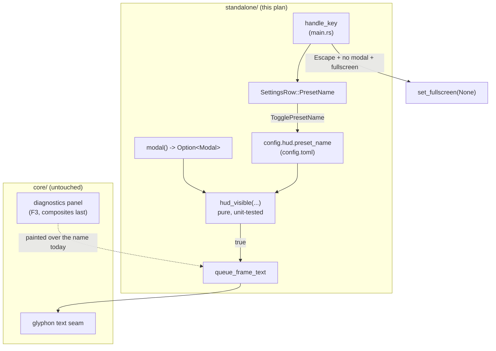

# 0096 — The HUD gets out of the way

> **Status:** draft
> **Created:** 2026-08-16
> **Owner skill(s):** dev
> **Related ADRs:** none (three shell-local UX fixes; no rejected alternative worth recording)

## TL;DR

Three small corrections to the standalone's on-screen furniture, all inside `standalone/`: the
preset name stops being painted underneath the F3 diagnostics panel and the two modals, `Escape`
leaves fullscreen instead of reaching nothing, and the settings menu grows a row that turns the
preset name off for good. No core change, no ABI change, no new dependency.

## Context & problem

Three separate nits from the user, which share one file and one session:

1. **The preset name collides with everything drawn over it.** `standalone/src/main.rs:760`
   queues the name unconditionally at `(16, 16)`. The core's diagnostics panel starts at a 12 px
   margin and composites *after* the text layer (`core/src/render/overlay.rs`), so pressing F3
   paints the panel straight over the name. The settings and browse modals draw their own header
   at `LIST_TOP = 64` and crowd it from below. The name is legible in exactly the state where
   nothing else is on screen.
2. **`Escape` does nothing outside a modal.** `decode_overlay_key` (`main.rs:1027`) maps `Escape`
   to `OverlayKey::Escape`, so with the browse overlay closed `handle_key` takes the
   `OverlayAction::None` arm and **returns early** — the key never reaches the shell's own match.
   Leaving fullscreen currently needs `F` or a double-click, which is not what a fullscreen app
   trains you to reach for.
3. **The preset name cannot be turned off.** Some operators want a clean canvas permanently, not
   just while a menu is up. There is no control for it at all today.

## Decision

Fix all three in the shell, keeping the project's existing seam: the *decision* about what is
visible becomes a pure function that can be unit-tested without winit or a GPU, exactly as
`overlay.rs` and `settings.rs` already are, and `main.rs` only draws the result.

Suppression is **presence-based, not timed** — the name returns the instant the thing covering it
closes. We rejected an auto-fade a few seconds after each switch (a bigger change that alters the
idle look, and the user chose the minimal fix) and rejected leaving the collision to the new
menu row alone (it would make the operator turn the name off by hand to read the diagnostics
panel, which is not a fix).

`Escape` exits fullscreen and does **nothing** in a window. It never quits: one stray keypress
ending a running show is the failure mode this binding is worth avoiding.

## Architecture diagram



## Implementation phases

### Phase 1 — The preset name yields to whatever is on top

- **Owner skill:** dev
- **What:** The preset name is suppressed while either modal is open or the diagnostics overlay
  is on, and returns when they close.
- **Files touched:** `standalone/src/main.rs` (a new pure helper + the `queue_frame_text` guard),
  plus its unit tests.
- **How:** Add a pure, free function beside `Modal` — shape roughly
  `fn preset_name_visible(modal: Option<Modal>, diagnostics: bool, enabled: bool) -> bool`,
  returning `enabled && modal.is_none() && !diagnostics`. `queue_frame_text` calls it before
  pushing the name at `main.rs:760`. Take `enabled` as a parameter now even though Phase 3 is
  what supplies a real value — it costs one argument and saves re-opening the signature.
  **Keep the F3 capture line unconditional on the name's visibility**: it is a diagnostics line
  that exists *because* the panel is up (Plan 0083), so it must not be suppressed by the same
  flag that hides the show furniture.
- **Done when:** With the app running, pressing F3 removes the preset name and leaves the
  diagnostics panel and the `audio …` capture line intact; pressing F3 again restores the name.
  Opening the settings menu or the browse overlay removes it; closing either restores it. Unit
  tests cover the four-way table (each modal, diagnostics on, all clear) against the helper
  directly, with no window and no GPU.

### Phase 2 — Escape leaves fullscreen

- **Owner skill:** dev
- **What:** `Escape` exits fullscreen when no modal owns the keyboard, and does nothing in a
  window.
- **Files touched:** `standalone/src/main.rs`.
- **How:** The subtlety is the early return described in Context. The settings modal already
  consumes `Escape` in its own branch and returns before this point, so the only path to guard is
  the browse one: `Escape` with the browser **closed** currently lands on
  `OverlayAction::None => return`. Handle `Escape` explicitly *before* the `decode_overlay_key`
  dispatch, gated on `self.modal().is_none()`, rather than by letting the `None` arm fall through
  — falling through would also route `Enter`, `Backspace` and the arrows into the shell match,
  which is a wider behavioral change than this phase is asking for and would have to be argued
  key by key. When fullscreen, call the existing `toggle_fullscreen()` so the config write and
  the `[output] fullscreen` persistence stay on one path; when windowed, consume nothing.
- **Done when:** In fullscreen with no menu open, `Escape` returns to a window and the change
  persists to `config.toml` exactly as `F` does. `Escape` in a window does nothing observable and
  never exits the app. `Escape` with the browse overlay open still closes the overlay and leaves
  fullscreen untouched; the same holds for the settings menu.

### Phase 3 — A settings row for the preset name

- **Owner skill:** dev
- **What:** A `Preset name` on/off row in the settings menu, persisted across restarts.
- **Files touched:** `standalone/src/config.rs` (a new `[hud]` section),
  `standalone/src/settings.rs` (the row + action), `standalone/src/main.rs` (wire the action),
  the settings unit tests, and the operator docs.
- **How:** Add `Hud { preset_name: bool }` defaulting to **true** (today's behavior), `#[serde(default)]`
  like every other section so an existing `config.toml` with no `[hud]` degrades to the default
  rather than failing. Add `SettingsRow::PresetName` to `ALL` (8 → 9 entries) and a
  `SettingsAction::TogglePresetName` the shell executes by flipping the config and calling
  `save_config()`, matching how `ToggleAuto` already persists. Feed the value into Phase 1's
  `enabled` argument.
  **Update the "eight rows fit any window" comment at `main.rs:783`** — nine rows now, and the
  arithmetic still holds: rows start at `ROWS_TOP` (94 px) with a 30 px pitch, so the ninth ends
  at 364 px, well inside any window this app opens.
- **Done when:** The menu shows `Preset name  on`; `Left`/`Right` toggles it and the name appears
  or disappears immediately; the choice survives a restart. Turning it **off** hides the name in
  every state, and turning it **on** restores Phase 1's behavior (visible only when nothing is
  drawn over it). Unit tests assert the new row's label, its rendered value for both states, and
  that `Left`/`Right` on it yield `TogglePresetName` — following the existing row tests.
  `README.md`'s Controls table documents the `Escape` binding from Phase 2 and the new row.

## Data shapes

```toml
# illustrative — the new config section
[hud]
preset_name = true
```

```rust
// illustrative — the pure visibility rule Phase 1 introduces
fn preset_name_visible(modal: Option<Modal>, diagnostics: bool, enabled: bool) -> bool {
    enabled && modal.is_none() && !diagnostics
}
```

## Risks & open questions

- **The `Escape` placement is the one real hazard.** Put the check after the modal branches and
  it works; put it before them and `Escape` leaves fullscreen instead of closing an open menu,
  which is worse than today. The done-when names both modal cases for exactly this reason.
- **No hot path is touched.** The visibility rule runs once per frame in `queue_frame_text`
  against three booleans, and the config write happens on a keypress. Neither is an allocation in
  the audio callback or a per-frame allocation — `queue_frame_text` already reuses its buffers,
  and skipping a `push` only reduces work.
- **A suppressed name is not a fading name.** If the user later wants the auto-fade that was
  offered and declined in the interview, it composes cleanly on top of Phase 1's helper (the
  envelope multiplies the color alpha; the boolean rule is unchanged), so nothing here forecloses
  it.

## What this plan does NOT do

- **No now-playing metadata.** That is [ADR-0110](../adrs/0110-now-playing-is-a-shell-supplied-string-and-the-core-owns-the-banner.md)
  and [Plan 0097](0097-the-track-announces-itself.md), which touch the core and the C ABI. This
  plan is deliberately shell-local so it can land in one short session.
- **No auto-fade or timed reveal** of the preset name (offered in the interview, declined).
- **No change to the plugin.** The foobar shim has no preset-name HUD and no settings menu; every
  file here is under `standalone/`.
- **No rework of the modal system.** `Escape` and the visibility rule use the existing `modal()`
  accessor rather than reshaping how modals are dispatched.

## Followups (after this lands)

- If Plan 0097's banner ships, decide whether it obeys the same `[hud]` section (a second
  `now_playing` key) or its own row — the interview picked "its own control", so `[hud]` is
  already the right home for both keys.
</content>
