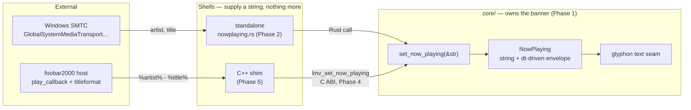

# 0097 — The track announces itself

> **Status:** approved
> **Created:** 2026-08-16
> **Approved:** 2026-08-16 (user)
> **Owner skill(s):** dev, human
> **Related ADRs:** [ADR-0110](../adrs/0110-now-playing-is-a-shell-supplied-string-and-the-core-owns-the-banner.md)

## TL;DR

When the track changes, the artist and title fade in over the visuals, hold a few seconds, and
fade out. The core owns that banner — the string, the envelope, the layout — and each frontend
only supplies a string: the standalone reads Windows SMTC, the foobar plugin uses the host's own
`titleformat` through a new `lmv_set_now_playing` C ABI entry point. The standalone half lands
first and is complete on its own; the plugin half is gated on a measured DLL size check.

## Context & problem

The user asked whether the visualizer can show what is playing. Both frontends can answer, from
sources that have nothing in common — foobar hands its component the exact metadata, while the
standalone has to ask the OS — and the core, which is the only thing that can draw, must not
learn what either source is.

[ADR-0110](../adrs/0110-now-playing-is-a-shell-supplied-string-and-the-core-owns-the-banner.md)
settles the shape: a UTF-8 string pushed in from the shell, a core-owned transient banner, and
glyphon rather than the core's 31-glyph quad font — which cannot spell `Björk` and fails by
painting a silent blank. This plan builds it, in the order that puts a visible result first and
the expensive, reversible decision last.

## Decision

Build the banner in the core against a **stub string** first, so the look is finished and
signed off before either metadata source exists. Then add the standalone's SMTC source (a feature
flag on a crate the shell already depends on — no new dependency). Then, and only then, widen the
C ABI and pay glyphon's cost in the plugin, behind a measurement that can stop the plan without
losing anything already shipped.

Phases 1–3 are Windows-and-Mac standalone work that ships a complete feature. Phases 4–5 are the
plugin. Phase 6 is the user's on-device check.

## Architecture diagram



## Implementation phases

### Phase 1 — The core draws a transient banner

- **Owner skill:** dev
- **What:** A core-owned now-playing banner: it takes a string, fades in, holds, fades out, and
  is driven by injected `dt`. Fed by a stub in this phase so the look is checkable immediately.
- **Files touched:** `core/src/render/` (a new `now_playing.rs` beside `text.rs`, wired in
  `mod.rs`), `standalone/src/main.rs` (a temporary trigger), core unit tests.
- **How:** The state is a string plus an elapsed-seconds counter advanced by the same `dt` the
  renderer already receives (Plan 0014), so the envelope is a pure function of elapsed time and
  needs no wall-clock read. Setting a new string restarts the envelope; setting the *same* string
  does not, so a source that re-reports the current track cannot re-trigger the banner. Drawing
  goes through the existing glyphon seam under `#[cfg(feature = "text")]`, exactly as the browse
  overlay's text does — a build without the feature keeps the state and draws nothing, which is
  what lets Phase 4 turn the feature on without touching this code.
  Place the banner clear of the top-left furniture (the preset name and the diagnostics panel
  both live there); the lower-left corner is free.
- **Done when:** A temporary hotkey or a hard-coded string makes a two-line artist/title banner
  fade in, hold, and fade out over any preset, and it does not re-trigger while the same string
  is set. The envelope is unit-tested as a pure function — feed it a `dt` sequence and assert
  the alpha rises, plateaus at full, and returns to zero, with the **same total duration when fed
  one 1/60 s step per call and when fed one 1/165 s step per call** (the frame-rate independence
  Plan 0014 bought, stated as a property rather than a pinned frame count). Long titles truncate
  rather than run off the surface.

### Phase 2 — The standalone reads Windows SMTC

- **Owner skill:** dev
- **What:** A Windows metadata source that reports the current track and pushes it into Phase 1's
  banner on every change.
- **Files touched:** `standalone/Cargo.toml` (add the `Media_Control` feature to the existing
  `windows` dependency), `standalone/src/nowplaying_win.rs` (new), `standalone/src/main.rs`.
- **How:** `GlobalSystemMediaTransportControlsSessionManager::RequestAsync()` →
  `GetCurrentSession()` → `TryGetMediaPropertiesAsync()` for `Artist()` and `Title()`, with the
  `MediaPropertiesChanged` and `CurrentSessionChanged` events driving updates so nothing is
  polled per frame. **This is not the audio thread and must never become it** — the handler may
  allocate, but it hands the string across to the render side rather than calling into the
  renderer from a WinRT callback thread. Follow `capture_win.rs` for the module's shape and its
  COM/threading conventions. Every failure degrades to silence, never a crash (NFR §10): no
  session, no permission, an empty title, or a WinRT error all mean "no banner".
- **Done when:** With foobar2000 (or any SMTC-publishing player) running, starting a track shows
  its artist and title, and skipping tracks re-triggers the banner with the new one. Closing the
  player, or running with no player at all, shows nothing and logs nothing per frame. The
  non-Windows build still compiles with the module absent, and `cargo clippy --workspace` is
  clean on both targets.

### Phase 3 — An operator control and the docs

- **Owner skill:** dev
- **What:** A settings row and config key to turn the banner off, plus the operator docs for the
  whole feature.
- **Files touched:** `standalone/src/config.rs`, `standalone/src/settings.rs`,
  `standalone/src/main.rs`, `README.md`.
- **How:** Add `now_playing: bool` (default **true**) to the `[hud]` section
  [Plan 0096](done/0096-the-hud-gets-out-of-the-way.md) introduces, and a `Now playing` row beside
  its `Preset name` row, following the same action-and-persist path. **0096 closed 2026-08-16, so
  `[hud]` already exists** (`standalone/src/config.rs`, `#[serde(default)]`, one key) — this phase
  adds a second key to it rather than creating the section, and the conditional this bullet used to
  carry is discharged.
- **Done when:** The menu row toggles the banner live and the choice survives a restart; with it
  off, a track change draws nothing. `README.md` documents the banner, the row, and that metadata
  is Windows-only on the standalone path.

### Phase 4 — The C ABI grows a text entry point

- **Owner skill:** dev
- **What:** `lmv_set_now_playing` on the C ABI, the `text` feature enabled for `core-cabi`, and
  **the DLL size measured against NFR §4**.
- **Files touched:** `core-cabi/src/lib.rs`, `core-cabi/include/lmv_core.h`,
  `core-cabi/Cargo.toml`, [`docs/specs/0001-c-abi.md`](../specs/0001-c-abi.md).
- **How:** `int32_t lmv_set_now_playing(LmvHandle *handle, const uint8_t *utf8, size_t len)`,
  following the existing `lmv_load_presets` convention for a byte-slice argument. The core
  **copies on receipt and never retains the pointer**; the caller may free immediately. Invalid
  UTF-8 is rejected at the boundary with an error code rather than trusted inward, per the
  validate-at-the-boundary rule. Bump `LMV_ABI_VERSION` (ADR-0003) and update the spec, which is
  the authority on this surface — not `CLAUDE.md`.
  **The measurement is the point of this phase**: record the release DLL size before and after
  the `text` feature, in the plan's own commit message.
- **Done when:** A C caller can set a string and the banner appears in a `core-cabi`-linked
  build; a null pointer, a zero length, and invalid UTF-8 each return an error instead of
  crashing; `lmv_abi_version()` reports the bumped value and the header matches. **Stop
  condition:** if the DLL exceeds NFR §4's ~10 MB soft cap, stop here, record the number, and
  route the choice back to the architect — ADR-0110's Alternative A (the quad font) is the named
  fallback and Phases 1–3 remain shipped either way.

### Phase 5 — The foobar shim reports the track

- **Owner skill:** dev
- **What:** The C++ shim subscribes to foobar's track changes and pushes the formatted title in.
- **Files touched:** `plugin-foobar/` (the shim's playback-callback registration).
- **How:** Register a `play_callback` for track changes, render `%artist% - %title%` through
  `titleformat`, and call `lmv_set_now_playing` from that callback — which is a UI/main-thread
  callback, **not** the `visualisation_stream` thread. That distinction is the real-time rule
  here and is worth a comment at the call site.
- **Done when:** Playing a track in foobar2000 shows its artist and title in the visualizer, a
  track change re-triggers it, and stopping playback leaves no stale banner. The shim's audio
  path is untouched — no metadata work happens on the `visualisation_stream` thread.

### Phase 6 — On-device verification

- **Owner skill:** human
- **What:** Confirm the two paths on the user's real setup, since neither can be verified in CI.
- **Done when:** The user reports whether the standalone shows the correct track for their
  everyday player (and specifically whether foobar2000 v2 publishes SMTC without an extra
  component — recorded as a fact, since ADR-0110 currently flags it unverified), and whether the
  plugin banner renders and reads correctly at their normal viewing distance.

## Data shapes

```c
/* illustrative — the new C ABI entry point (Phase 4) */
/* The core copies the bytes; the caller may free immediately.
   Returns 0 on success, negative on a null handle or invalid UTF-8. */
int32_t lmv_set_now_playing(LmvHandle *handle, const uint8_t *utf8, size_t len);
```

```rust
// illustrative — the core-side banner state (Phase 1)
pub struct NowPlaying {
    text: String,       // "" means nothing to draw
    elapsed: f32,       // seconds since the string was set, advanced by injected dt
}
```

## Risks & open questions

- **WinRT from a COM-initialized app.** The shell already initializes COM for WASAPI, but whether
  that apartment satisfies WinRT's requirements is unverified. If it does not, the source runs on
  its own thread with its own initialization — a contained fix, but it is the most likely place
  Phase 2 stalls.
- **The glyphon size cost is unknown until it is measured**, which is why Phase 4 measures it
  before anything depends on it and carries an explicit stop condition. Phases 1–3 do not depend
  on the outcome.
- **Not every player publishes SMTC.** Silence is the correct degradation, not an error — but it
  means the standalone path cannot promise to work with everything, and the README should say so
  rather than imply universality.
- **macOS gets no standalone metadata.** `MediaRemote` is private and recent macOS restricted
  third-party access (unverified). No Mac source is scheduled here; the plugin path is the answer
  on that platform, which is the same asymmetry loopback capture already has.
- **A string on the ABI is a lifetime hazard.** Copy-on-receipt is stated in the spec and tested
  in Phase 4 rather than left to the C++ side to honour.
- **Long or CJK titles.** Truncation is Phase 1's job and is a done-when there; glyphon's font
  fallback is what makes non-Latin titles legible at all, which is the whole reason ADR-0110
  chose it.

## What this plan does NOT do

- **No macOS metadata source.** See the risk above; it would need its own ADR.
- **No album art, no elapsed-time readout, no scrolling marquee.** One transient two-line banner.
- **No preset-name changes** — that is [Plan 0096](done/0096-the-hud-gets-out-of-the-way.md).
- **No reactive coupling.** The banner is informational; nothing in the analysis or preset layer
  learns that a track changed. (The director already has its own track-change notion for
  rotation; this plan does not touch it.)

## Followups (after this lands)

- If Phase 4's measurement rejects glyphon, the fallback decision (ADR-0110 Alternative A) needs
  an architect session and probably a superseding ADR.
- Whether the banner should also fire on a *preset* change, replacing the shell-drawn preset
  name with one core-owned mechanism, is worth asking once both exist.
</content>
