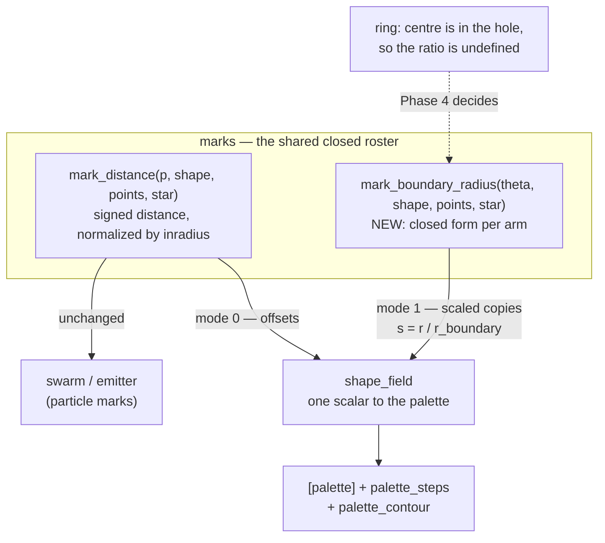

# 0098 — The figure nests properly

> **Status:** in-progress
> **Created:** 2026-08-16
> **Owner skill(s):** dev, human
> **Related ADRs:** [0111](../adrs/0111-the-shape-field-gains-a-scaled-copy-coordinate.md) (the shape field gains a scaled-copy coordinate)
> **Closes:** design-backlog 0096, design-backlog 0097

## TL;DR

`shape_field` learns a second coordinate — `r / r_boundary(theta)` — whose level sets are **scaled
copies** of the outline rather than offsets of it, which is the construction two batches of user
reference images have now asked for and the one the distance coordinate provably cannot make. On
the way, the `star` arm stops returning a **negative** normalized distance at its own centre, which
today punches a hole through any curved or jittered star drawn on this scene.

## Context & problem

Two findings from the content pass that authored the first `shape_field` world
([Plan 0091](done/0091-the-figure-fills-the-frame.md) Phase 6), both verified against the code
rather than taken on report.

**The nesting is the wrong kind of nesting.** ADR-0105 chose offset contours and delivers them; the
reference wants scaled copies. An inward offset is an erosion, and erosion **rounds a reflex corner
while keeping convex ones sharp**, so a nested heart keeps its bottom point and loses its top notch
as the rings move inward. That is not tunable: the innermost band sits at
`d = ((1/palette_steps)/color_span)^(1/gamma)`, so a sharp notch needs `palette_steps * color_span ~ 1`,
which leaves **one** band inside the figure. The far end of that trade was rendered and the user
rejected it. [ADR-0111](../adrs/0111-the-shape-field-gains-a-scaled-copy-coordinate.md) has the
derivation and the rejected alternatives.

**The star arm's interior is not merely approximate, it is signed wrong.** The straight-edge branch
returns `0` at the centre, honouring the contract `marks.rs` documents. The curved/jittered branch —
taken whenever `star_curve` or `star_jitter` is non-zero — returns `1 + sd/inradius` with `sd` a true
distance, and at the centre that is `1 - k/inradius` for valley radius `k`. **It is always negative,
provably:** `inradius` is the perpendicular from the origin to the edge *line*, and a perpendicular
to a chord is never longer than either endpoint's radius, so `inradius <= k` always. Measured:
`-0.23`, `-0.30`, `-0.30`, `-0.75`, `-0.94` across five configurations. On this scene the palette
repeat-addresses, so a negative coordinate wraps and puts a hard n-sided dark hole through the middle
of the figure.

**Nothing in the suite can see the second one**, which is why it shipped: on the particle path a
negative `d` only makes `max(0, 1 - d)` exceed 1 and the falloff saturates brighter, so no golden
baseline moves, and no shipped preset drives `shape_field` with a star.

## Decision

Build ADR-0111's coordinate mode as a numeric selector with the distance mode as its default, with
`r_boundary` derived **per arm in closed form** rather than by marching the SDF. Fix the star's
interior sign first, because it is on the same file and a wrong arm underneath new work is a bad
foundation. Leave the `ring` question — where the mode is undefined, since an annulus's centre is
in its hole — to a phase that decides it against a rendered figure.

## Architecture diagram

## Implementation phases

### Phase 1 — The star's interior stops lying

- **Owner skill:** dev
- **What:** Closes design-backlog 0097. It is first because it is small, independent of everything
  below, and it is on the file the later phases extend — building a second coordinate on top of an
  arm whose first one is signed wrong is how a defect gets inherited rather than fixed.
- **Files touched:** `core/src/render/scenes/marks.rs`, `core/src/render/scenes/marks/tests.rs`.
- **Done when:**
  - `mark_distance` returns a value **`>= 0` everywhere inside every arm**, swept across the roster
    and across the point counts, with `star_curve` and `star_jitter` both zero and non-zero. This is
    a property, not a threshold: the module header states `0` at the deepest interior point, and the
    curved branch currently violates it for every star configuration.
  - The repair is stated as a choice with its reason recorded, because there are two and they are
    not equivalent: give the curved branch a reference equal to the figure's **actual** deepest-point
    distance, or clamp the normalized result at `0` and document that the interior is not metric
    there. **The first changes what the interior field looks like; the second does not.**
  - **`gamma` is usable again on a curved or jittered star, and this is a separate assertion from
    the sign.** The shader takes `select(pow(d, gamma), d, gamma == 1.0)` and `pow` of a negative
    base is **NaN**, so today a bound `gamma` puts a hard artifact through the figure's middle — and
    the `color_center` offset the backlog entry recommends **cannot** repair it, because it is added
    on the next line, after the exponent. A fix that only makes `d` non-negative happens to cure this
    too; a fix that clamps *the coordinate* later would not. **Assert it directly**: a curved star
    with a bound `gamma` renders with no NaN and no hole, at several exponents either side of 1.
  - **The particle path moves zero pixels**, proved bless-to-bless on the branch rather than by
    `git diff` — the Plan 0091 Phase 2 precedent, and the same reason: baselines drift from their
    committed bytes on this box under a clean bless, so a diff would charge that drift here. The
    straight-edge branch must remain bit-for-bit the arithmetic every shipped `shape = "3"` mark
    evaluates.
  - A test renders a jittered star on `shape_field` and asserts the **centre is not a hole** — that
    the innermost region takes the palette colour its coordinate should give rather than the far end
    of the gradient. The existing probe presets reproduce it; `presets/README.md` has the numbers.

### Phase 2 — The coordinate exists, and a polygon proves it is scaled copies

- **Owner skill:** dev
- **What:** The walking skeleton: the selector, the uniform, and `r_boundary` for the two arms whose
  closed form is one line (`disc` is `1`; `polygon` is `apothem / cos(f)` on the angle the fold has
  already computed). **The polygon is what makes this phase a proof rather than a wiring exercise** —
  a scaled polygon keeps its corners, an eroded one rounds them, so the two coordinates are
  visibly and measurably different figures on it. The `disc` cannot show that: its offsets and its
  scaled copies are the same circles, which is exactly why it is the control.
- **Files touched:** `core/src/render/scenes/marks.rs`, `core/src/render/scenes/shape_field.rs`,
  their tests, `presets/README.md`.
- **Done when:**
  - A numeric selector chooses the mode, defaulting to the distance, **clamped and rounded
    CPU-side** — the `kaleido_edge` / `shape` treatment, for the `kaleido_edge` reason: a mode is an
    identity, and `[smoothing]` and preset dissolves interpolate a binding continuously.
  - **The property, stated as a ratio that is constant:** on a `polygon`, walk rays out from the
    centre and find where a given band boundary falls; under the radius mode the ratio
    `r_level / r_boundary(theta)` is **constant in `theta`** to the harness's own resolution, which
    is the definition of a scaled copy.
  - **The control that makes it non-vacuous:** the same measurement under the **distance** mode is
    *not* constant on the same figure. Both numbers get printed. Without this the first assertion
    would pass on a disc, on a bug, and on a coordinate that was never wired up.
  - **The `disc` arm agrees between the two modes**, which is the harness check: for a circle the
    two constructions coincide exactly, so a disagreement there convicts the harness rather than the
    shape.
  - **Every existing golden baseline is byte-identical**, proved bless-to-bless as in Phase 1. The
    default mode is the shipped arithmetic and nothing else may move.

### Phase 3 — The heart and the star take the coordinate

- **Owner skill:** dev
- **What:** The two arms the references actually need. Both admit a closed form and neither is
  one line: `star` is a ray against the tip-valley edge the angular fold has already selected, and
  `heart` is a ray against a lobe circle or a tangent ray, chosen by the same branch its SDF takes.
- **Files touched:** `core/src/render/scenes/marks.rs`, its tests, `presets/README.md`.
- **Done when:**
  - Both arms satisfy Phase 2's constant-ratio property, swept across the point counts and across
    the three `star_*` shape params — including the curved and jittered configurations, since those
    change where the boundary is and are the arms Phase 1 just repaired.
  - **`r_boundary` agrees with the outline the SDF describes**, checked against the numerically
    sampled boundary `marks/tests.rs` already builds for Plan 0091 Phase 2 rather than against a
    second ground truth. A ratio that is beautifully constant against the *wrong* boundary is the
    failure this check exists to catch.
  - **The heart's notch is measurably sharper under the new mode** — the property the whole plan is
    for. Stated as a comparison rather than an absolute: at equal ring counts, the inner contour's
    deviation from a scaled copy of the outline is far smaller under the radius coordinate than
    under the distance one, and the distance one's deviation grows as the contour moves inward while
    the radius one's does not.

### Phase 4 — `ring` gets an honest answer

- **Owner skill:** dev
- **What:** ADR-0111 names this as the one behavioural choice it leaves open. An annulus's centre is
  in its hole, a ray from there crosses the boundary twice, and `r / r_boundary` has no single
  value. Three answers are defensible — fall back to the distance silently, refuse the combination
  with a load warning, or define it against the outer edge and document that the hole is not
  expressed — and the phase picks one **against a rendered figure**.
- **Files touched:** `core/src/render/scenes/marks.rs`, `core/src/preset/schema.rs` if the answer is
  a warning, `presets/README.md`.
- **Done when:**
  - All three are rendered before one is chosen, and the phase records **why** rather than only
    which. The silent fallback is the cheapest and the worst to debug; the warning is the
    ADR-0020 precedent and costs a load-path branch; the outer-edge definition is the only one that
    draws something on a ring at all.
  - Whatever is chosen, **a preset cannot reach a state that renders as a third thing without
    saying so** — the negative ADR-0111 records is that a legal shape plus a legal mode could
    otherwise produce a figure nobody asked for.
  - `presets/README.md` carries it beside the selector, not in a footnote.

### Phase 4b — The figure can turn

- **Owner skill:** dev
- **What:** `shape_field` has **no rotation lever at all** — its `PARAMS` carries no `rotation` and
  no `spin`, while every other figure-drawing scene has one (`lines/star.rs` and `lines/lsystem.rs`
  have `rotation`, `lines/parametric.rs` has `spin`). So a star on this scene can breathe, drift and
  morph, and cannot turn, which for a star is the most obvious motion there is. Folded in here
  rather than given its own plan because it is one term in a shader this plan already has open.
- **Files touched:** `core/src/render/scenes/shape_field.rs`, its tests, `presets/README.md`.
- **Done when:**
  - A `rotation` param turns the figure about its own centre, applied in the figure's own frame —
    the shader builds `p = (uv - pan) / scale`, and the rotation belongs there, **after** the pan so
    the figure spins in place rather than orbiting the frame centre. Which of those two it is must be
    a stated choice, because both are defensible and they look completely different.
  - **The default is an exact arithmetic identity** and every existing golden baseline is
    byte-identical, proved bless-to-bless as in Phase 1.
  - **It is not `kaleido_*` and the docs say so.** The screen-space fold is not a substitute: it
    folds the finished frame about a screen-centred axis, and this project has already recorded that
    it fights a translating `pan_*`. A reader who wants a turning figure must not be sent there.
  - **The aspect stays the render target's** ([ADR-0037](../adrs/0037-internal-grid-is-a-resolution-not-a-shape.md)).
    A rotation in a frame whose x has been stretched by the aspect **shears** rather than rotates
    unless the rotation is applied in square units — this is the exact configuration where a wrong
    source is invisible at 16:9 and obvious at 2:1, so the test renders at a non-16:9 target and
    asserts the figure's extent is unchanged by a quarter turn.

### Phase 5 — What it costs at the floor tier

- **Owner skill:** dev
- **What:** ADR-0111 argues the closed forms are "a handful of ALU ops, the same order as the SDF
  they sit beside" and that this is what makes the mode cheap enough not to need a gate. That is an
  argument, not a measurement, and this phase settles it.
- **Files touched:** none necessarily — a measurement phase, plus `docs/nfr.md` if a budget moves.
- **Done when:**
  - The radius mode's per-frame cost is measured against the distance mode's on the same preset and
    the same figure, at the **floor tier** ([`docs/nfr.md`](../nfr.md) §1 is the reference), and the
    reading is recorded with the machine it was taken on (ADR-0071).
  - **A negative result is a legitimate outcome and it does not sink the plan** — the mode would
    ship documented as the expensive coordinate, or gated to the tiers that can afford it. What is
    not acceptable is shipping it unmeasured after an ADR that asserted it was cheap.

### Phase 6 — The docs learn both coordinates

- **Owner skill:** dev
- **What:** The three load-bearing authoring docs, swept in the same commit as the last code phase
  rather than after it (the Plan 0079 minor).
- **Files touched:** `presets/README.md`, `docs/preset-palettes.md`.
- **Done when:**
  - `presets/README.md` carries the selector, the per-arm availability, and — **stated, not
    implied** — that `color_span` values do **not** transfer between the modes, because the exterior
    is divided by the inradius under one and grows linearly in `r` under the other. This sits beside
    the portability trap that param already has, which the same file documents.
  - `docs/preset-palettes.md` learns that `palette_contour` behaves differently under the radius
    coordinate: it is an `fwidth` of whatever field it is given, and the radius field's gradient
    differs sharply from the distance's near the centre, so the hairline does not keep its weight at
    the same value.
  - The worked recipe for the reference construction — nested figure, ring count on
    `palette_steps`, spacing on `gamma` — replaces the palette-packing workaround
    `shape_pulse` uses today as the documented route.

### Phase 7 — The look gate

- **Owner skill:** human
- **What:** Judge the nested figure in motion against the reference images that started this.
- **Done when:**
  - A verdict on whether the reference now reproduces — specifically whether the inner rings keep
    the heart's notch where the offset coordinate rounded it off.
  - A verdict on whether `shape_pulse` should be **re-authored onto the new coordinate** or left as
    it is. It is a shipped, accepted world built on the palette-packing workaround; the new route is
    better but the look was judged and approved on the old one, so this is a content call and not an
    automatic migration.
  - **This phase may carry forward.** If the user is not available the `dev` phases close the plan
    and the item moves to [`docs/content-brief.md`](../content-brief.md), the rule Plan 0083, Plan
    0088 and Plan 0091 all followed. It gates nothing below it.

## Risks & open questions

- **The heart's closed form is the one that could turn out fiddly.** Its SDF is piecewise with a
  branch, and the ray intersection has to take the *same* branch or the boundary radius and the
  distance will describe different outlines. Phase 3's check against the numerically sampled
  boundary is aimed squarely at this.
- **Phase 1's repair choice has a look consequence and the plan does not pre-empt it.** Giving the
  curved branch a true reference changes what the interior field looks like on a curved or jittered
  star; clamping at zero does not, but leaves the interior non-metric. The phase must state which it
  took and why.
- **`shape_pulse` is a shipped world built on the workaround this plan supersedes.** Nothing forces
  it to move, and Phase 7 asks the question rather than assuming the answer — but if it stays, the
  library ships an example of the route the docs will now steer people away from.
- **A second scalar per arm is a standing tax on the roster.** ADR-0084's closed roster bounds it,
  and this plan does not open it.

## What this plan does NOT do

- **It does not make the roster extensible.** Five names, closed, per ADR-0084 and restated in
  ADR-0105 and ADR-0111. This plan adds a coordinate, not a shape.
- **It does not touch the particle path.** `swarm` and `emitter` read `mark_distance` and only its
  interior; the new function is a second entry point that they do not call. Phase 1's repair is the
  one place the two paths meet, which is why it owes a zero-pixel proof.
- **It does not build a composable field grammar.** ADR-0111 Alternative D, declined for the same
  reason ADR-0002 has declined it for the project's life.
- **It does not address the occlusion half of design-backlog 0069.** Nothing here decides what is in
  front of what.

## Implementation log

> Written by `dev` — one row per phase as that phase's commit lands, and the close block after the
> last one. **The phases above are the contract; everything here is what happened.**
> **Observations, never conclusions:** this says where to look, architect decides how it went.

**Lane:** `WORK/lmv-plan-0098` on `plan-0098-nested-figure`

| phase | owner | state | commit |
|---|---|---|---|
| 1 — The star's interior stops lying | dev | done | `28336c3` |
| 2 — The coordinate exists, and a polygon proves it | dev | done | `a6bb867` |
| 3 — The heart and the star take the coordinate | dev | done | `43b269a` |
| 4 — `ring` gets an honest answer | dev | done | `4257596` |
| 4b — The figure can turn | dev | done | `01f3775` |
| 5 — What it costs at the floor tier | dev | done | `255f386` |
| 6 — The docs learn both coordinates | dev | done | `de1df96` |
| 7 — The look gate | human | done | `30b2bce` |

### Notes

- **Phase 1 took the first of the two repairs the phase named — the true reference, not the
  clamp.** The curved branch divides by the distance from the origin to its own boundary polyline,
  walked from the **unjittered** edge so the divisor stays a per-draw property of the figure rather
  than of whichever spike a fragment folded onto. A `max(0, ·)` guard remains for the case the
  angular fold cannot see: under `star_jitter` the reference is the unjittered figure's while the
  measurement is the fragment's own spike's. Consequence, stated because it is a look change the
  byte-identity contract does not cover: a curved star's **exterior** contour spacing moves too,
  since the divisor moved — `presets/shape_facet.toml` is the shipped preset affected.
- `no_arm_returns_a_negative_normalized_distance` prints `d(centre)` beside the value the
  pre-repair reference gave, recovered from the same sample. It is `0.00000` for every
  configuration except `curve +0.5 jitter 0.3` (`0.076`–`0.085`, positive).
- `the_curved_star_exterior_is_re_measured`'s recorded table did not move: the arm and the harness
  divide by the same reference, so it cancels out of the recovered signed distance.
- **Two pre-existing defects surfaced while building the rendered `gamma` assertion.** Both
  reproduce with this phase's change reverted **and** on the hardware adapter, so neither is
  Phase 1's and neither is an adapter artifact:
  - the palette LUT is sampled with linear filtering and **repeat** addressing, so a coordinate
    within half a texel of `0` blends the gradient's last texel with its first. On `shape_field`
    the figure's centre is `d = 0`, and `color_center` defaults to `0` — so every preset on this
    scene with a non-cyclic palette has a speck of the gradient's far end at the figure's middle.
  - `atan2(0, 0)` is undefined and the `star` and `polygon` arms fold on it, so a render target
    whose pixel grid puts a fragment centre exactly on the figure's centre samples one garbage
    fragment. Even-sized targets do not.
- **Phase 2: the polygon proves the property OUTSIDE the figure, not inside it, and the plan's
  stated mechanism does not hold in the interior.** "A scaled polygon keeps its corners, an eroded
  one rounds them" is true outside the outline only: erosion rounds a **reflex** corner, and a
  convex polygon has none, so eroding a *regular* polygon moves every edge in by the same amount
  and produces a scaled copy. The two coordinates are therefore literally the same expression
  inside one — the arm's interior is `r cos(f) / apothem` and `r_boundary` is `apothem / cos(f)`.
  Measured on a pentagon at the first interior contour: mean `0.2513`, relative spread `0.0177`
  under **both** modes, agreeing to four figures. `palette_steps * color_span` is set below 1 in
  the test so the first band boundary an outward ray meets is already the exterior one; there the
  arm measures to the edge as a segment and the separation is real — on a triangle, relative
  spread `0.0027` (radius) against `0.0631` (distance), 23x.
- Phase 2's selector is `coord_mode`, numeric, `0` = distance (default) and `1` = radius, quantized
  CPU-side. It lives in `shape_field`'s own `PARAMS`, not in the shared `marks` roster: the two
  particle scenes never call `mark_boundary_radius`.
- `mark_boundary_radius` takes the point `p` rather than the diagram's `theta` and folds the angle
  itself, which is `mark_distance`'s own signature and keeps the two arms reading one fold.
- **Phase 3: the straight-edge `star`'s interior behaves like the regular polygon's** — both modes
  read `0.00000` deviation from a scaled copy at interior levels, because that branch returns the
  distance to the edge *plane*, which is linear in `p` and therefore has scaled-copy level sets.
  The arms separate outside the outline (`0.03`–`0.06`), and the **curved** star separates
  everywhere (`0.12`–`0.20`) because that branch computes a true distance.
- `mark_boundary_radius` is exact against the numerically sampled outline for every closed-form
  arm (`0.00000`, heart `0.00001` at the polyline's own resolution). The curved/jittered star
  carries `0.00472`, which is the 8-segment Bezier polyline's sagitta — the same residual
  `the_curved_star_exterior_is_re_measured` records at `0.0032` for the distance — so it is bounded
  separately, at `0.01`.
- **Phase 4 chose the load warning plus the distance.** All three candidates were rendered at
  420x420 first. The two fallbacks (silent, and warned) render the same annulus. The outer-rim
  definition renders a file that is **byte-identical to a `disc`** at the same settings — md5
  `6df825d9…` for both — because the coordinate collapses to `length(p)` and the hole stops
  existing. The rendered pair is what ruled it out rather than the argument.
- **Phase 4 touched two files outside its list**, both to wire the answer it chose:
  `core/src/render/scenes/shape_field.rs` (`applied_coord_mode` gained the quantized `shape` and
  returns the default on `RING_SHAPE` — the fallback has to live at the call site, and the phase's
  list names only `marks.rs`, `schema.rs` and the README), and `core/tests/preset.rs` (the two
  load-warning tests, which is where the `thickness` dead-zone precedent's tests live). The
  rendered fallback assertion went into `core/src/render/scenes/shape_field/tests.rs`.
- The warning fires only on a `shape` that **rests** at `ring`, the same limit the `thickness`
  dead-zone check has. An animated `shape` sweeping through `ring` still falls back frame by frame
  and nothing warns.
- **Phase 4b applies `rotation` after the pan**, so a panned figure spins in place; the alternative
  swings it around the frame centre on a circle of radius `|pan|`. Measured at `pan_x = 0.5` on a
  240 px frame: the figure's centre stays within 4 px of its unrotated position across four angles,
  where an orbit would move it 60 px. Radians, unclamped, non-finite falls back to the identity;
  `0` skips `cos`/`sin` entirely.
- **Phase 5 added `core/tests/field_cost.rs`**, on the `mark_cost.rs` / `arc_cost.rs` precedent —
  the phase's file list says "none necessarily", and a measurement in a commit message is not
  re-runnable. `docs/nfr.md` did not move.
- The reading, median of three runs on the adapter `wgpu` selects here (AMD Radeon integrated,
  DX12, driver 30.0.13002.1001), 1280x720, floor tier: `disc` control `-1.1 %`, `heart` `-0.5 %`,
  straight `star(7)` `-4.7 %`, curved+jittered `star` **`-25.9 %`**. The control's own spread across
  the three runs was `-1.1 %`/`-2.2 %`/`+3.4 %` on identical arithmetic, so the noise floor is
  about ±3 % and the two closed-form arms are inside it. The curved star is cheaper because the
  distance walks two sampled polylines there (the edge plus the unjittered reference Phase 1 added)
  while the radius walks one and computes only the crossing.
- **Phase 6 could not write its `palette_contour` done-when as stated, because the behaviour it
  describes does not reproduce.** ADR-0111 books as a negative consequence that "the hairline will
  not have the same weight it has today at the same `palette_contour` value". Measured on a
  nine-ring heart at `palette_contour = "0.75"`, as the darkening the parameter adds: distance mode
  `27.3` mean over 492 px (inner rings) and `32.6` over 2131 px (outer); radius mode `29.8` over
  466 px and `31.3` over 1929 px. The modes differ by less than the inner and outer rings differ
  *within* either one. The mechanism is `band_contour` dividing by `fwidth` of the banded
  coordinate — the line is drawn within one **pixel** of a band edge, so a changed gradient is
  exactly what that normalization absorbs. `docs/preset-palettes.md` carries the measurement and
  says not to re-tune the parameter across the switch, plus what does change (where the rings sit).
  **ADR-0111's consequence list is architect's to correct.**
- Phase 6 also corrected `presets/README.md`'s three standing statements that Phase 1 falsified:
  the **DO NOT BIND `gamma`** warning, the `gamma` row's "unusable on a curved or jittered star",
  and the `star_curve` bullet. They now record that the defect is fixed and that a `color_span`
  tuned against the old reference is out by roughly 1.1x-1.9x.
- **Phase 7 ran in the app, and both verdicts came back.** The user judged an A/B of one heart
  preset differing only in `coord_mode`, at 165 fps / p99 7.0 ms: (1) the reference reproduces —
  under `"1"` every ring keeps the notch where `"0"` rounds it into a blob by the third ring
  inward; (2) `shape_pulse` is **re-authored** rather than left. The engine phases were already
  committed, so this landed after the close block as `30b2bce`.
- The re-author is `coord_mode = "1"` and nothing else. `color_span` was deliberately held at
  `0.45`: both coordinates put the outline at exactly 1, so holding it holds the interior banding
  fixed at the same four boundaries. The alternative — raising it to `0.85` to restore the old
  corner density — was rendered and rejected as a busier figure (seven boundaries inside instead of
  four). The surround consequently carries ~20 rings to the corner where it carried ~41.
- Still noticed and not acted on: `presets/shape_facet.toml` pins `gamma = "1.0"` and its header
  explains the pin by design-backlog 0097, which Phase 1 closed. The pin is now unnecessary rather
  than load-bearing, and the preset also carries a `color_span` tuned against the old reference.

### Close triggers

- **`presets/` touched:** yes — `presets/README.md`, and `presets/shape_pulse.toml` re-authored at
  Phase 7 (`30b2bce`). Nothing embedded or removed: the shipped set is the same files.
- **Plan header `Closes:`** design-backlog 0096, design-backlog 0097.
- **What shipped:** feature (one fix — Phase 1 — plus a new preset-facing parameter surface:
  `coord_mode` and `rotation` on `shape_field`, a new load warning, and a new cost test).
- **Operator docs touched:** `presets/README.md`, `docs/preset-palettes.md`. `docs/nfr.md` not
  touched — Phase 5 measured no budget movement.
- **Backlog probes (`node scripts/check-backlog-claims.mjs`):** exit `0`. Four entries print a
  stamped-before-touch staleness notice because this plan edited files their probes name: `0096`
  and `0097` (`shape_field.rs`, `marks.rs`) — the two this plan closes — plus `0128` and `0133`
  (`schema.rs`, from Phase 4's warning). No probe failed.
- **Outstanding `human` phases:** none. Phase 7 was judged in the running app; it did not carry
  forward, so nothing moves to `docs/content-brief.md`.
