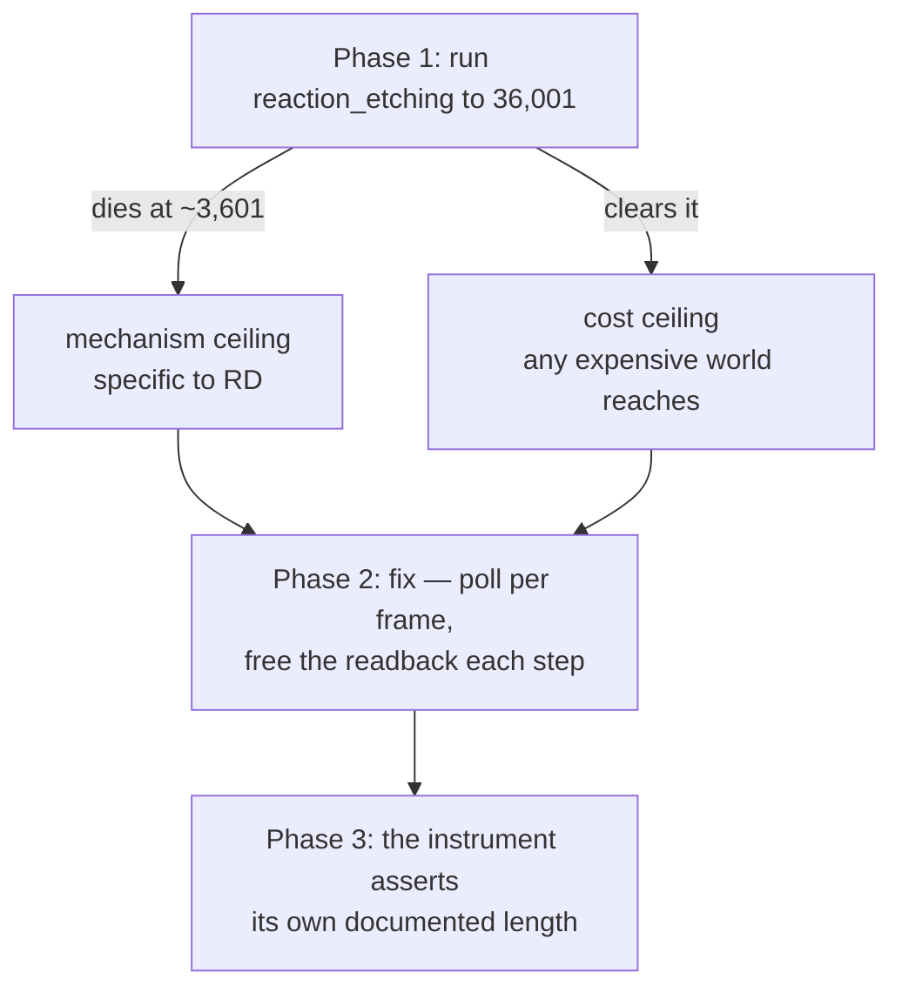

# 0099 — The horizon reaches its own length

> **Status:** draft
> **Created:** 2026-08-16
> **Owner skill(s):** dev
> **Related ADRs:** none — this is a defect repair, not a design choice
> **Closes:** design-backlog 0093

## TL;DR

`shot --horizon 10` is documented as ten simulated minutes — 36,001 renders — and on two shipped
reaction-diffusion worlds it dies at **3,601** with `Buffer with 'lmv-capture-readback' label is
invalid`, after the resident set climbs to ~2.9 GB. The rows it produced are a **0.5-minute**
horizon reported as a ten-minute one, and their `monotone 1.00` is a world still settling rather
than drifting — which is precisely the misreading the instrument exists to prevent.

## Context & problem

[Plan 0085](done/0085-the-show-length-horizon-gets-an-instrument.md) shipped the only instrument
this project has for show-length behaviour. Its own Phase 2 run found the ceiling, and
[design-backlog 0093](../design-backlog.md) carries the measurement.

Three things are already established and this plan does not re-derive them:

- **It is pre-existing, not a defect in Plan 0085's sampling primitive.** The shipped
  `Renderer::capture_preset` fails identically at the same frame count on the same preset — run as
  a control *before* it was called a finding.
- **The capture size is not the lever.** 2.9 GB is four orders above what 3,600 frames of 96x96
  RGBA would be.
- **It was invisible until Plan 0085 because nothing had ever driven a world for thousands of
  frames.** The four synthesized gates capture 30 frames; the reactivity gate a few hundred.

**The candidate mechanism is one line, and the backlog entry states it as a probe rather than a
conclusion:** `core/src/render/capture_api.rs`'s `step_offscreen` never polls the device. The
entry's own `absent: poll` probe is the hypothesis — the day anyone polls per frame in that file it
goes red, which is the signal to re-read the entry whether or not the fix worked.

**What is genuinely open is how wide the ceiling is**, and the entry is explicit that it originally
overstated how well that was known. Two readings survive: a **mechanism** ceiling specific to
reaction-diffusion's heavy per-frame ping-pong, or a **cost** ceiling that any sufficiently
expensive world reaches and RD reaches first. The measured set omitted `reaction_etching`, the third
RD world, which was shipped five days before the entry was written and simply never run.

## Decision

Open with the discriminator the backlog entry already identifies as the cheapest thing anyone can
do here, then fix against whichever reading it produces. Do not start from the one-line hypothesis,
because a fix that makes the symptom go away without naming which ceiling it removed leaves the
instrument's *documented length* still unverified.

## Architecture diagram

## Implementation phases

### Phase 1 — Which ceiling is it

- **Owner skill:** dev
- **What:** One `shot --horizon` run of `reaction_etching`, the RD world the original measurement
  missed. It separates the two readings, and it costs one command.
- **Files touched:** none — a measurement.
- **Done when:**
  - `reaction_etching` is driven to the same 36,001 renders the other two were, and the frame it
    reaches is recorded beside theirs.
  - **The verdict is stated either way and both are useful.** If it dies near 3,601 the ceiling is
    the RD family's mechanism; if it clears, the ceiling tracks per-frame cost and the fix has to
    answer a general question rather than a family one.
  - **The reading names its machine** (ADR-0071) — the original was Windows, hardware adapter,
    debug build, 96x96, and a different build profile is a different measurement.
  - If `reaction_etching` cannot be driven at all for an unrelated reason, that is a finding and the
    phase stops rather than guessing from two data points.

### Phase 2 — The capture path stops accumulating

- **Owner skill:** dev
- **What:** The repair. The hypothesis is that `step_offscreen` never polls, so wgpu never runs the
  cleanup that reclaims mapped readback buffers and completed submissions, and the process grows
  until an allocation fails.
- **Files touched:** `core/src/render/capture_api.rs`, its tests.
- **Done when:**
  - **The mechanism is named before it is fixed.** ~2.9 GB over 3,600 frames is ~800 KB per frame
    against a 96x96 RGBA capture of ~36 KB, so roughly twenty times the frame's own bytes are being
    retained. Whatever the repair is, the phase records what that factor was made of — otherwise
    the next person meets the same growth at a different frame count with no account of it.
  - The failing worlds reach **36,001 renders**, which is `--horizon 10`'s own documented length,
    and the resident set is **flat** rather than merely slower-growing across that run. A ceiling
    pushed from 3,601 to 30,000 is the same defect with a bigger number.
  - **A regression test drives a world past the old ceiling** — deliberately past 3,601 rather than
    to some round number, because that frame count is the thing that must never come back. It is a
    slow test and belongs with the GPU-heavy suites the pre-push hook excludes
    ([`README.md`](../../README.md) names them), not in the fast subset.
  - The backlog entry's `absent: poll` probe is expected to go **red on delivery**. That is the
    entry working as designed — re-read it and correct it in place rather than treating the red as
    a failure.

### Phase 3 — The instrument stops overstating itself

- **Owner skill:** dev
- **What:** Whatever Phase 1 and 2 conclude, `--horizon` should not be able to report a truncated
  run as a completed one. That is the property that made this worth a plan rather than a bug fix.
- **Files touched:** `standalone/examples/shot.rs`, `docs/capturing.md`.
- **Done when:**
  - A horizon run that ends early **says so in its output**, and says it where the table is read —
    not only on stderr. The original failure printed rows that looked like a result; the
    truncation was legible only to someone who counted them.
  - `docs/capturing.md` states the verified ceiling and the machine it was verified on, replacing
    the current implicit promise that `--horizon N` delivers N minutes.
  - **If Phase 1 found a cost ceiling rather than a mechanism one**, this phase also records what a
    caller can do about it — a smaller `--size`, a coarser interval — because then the limit is real
    and the honest answer is to make it visible and adjustable rather than to claim it is gone.

## Risks & open questions

- **The one-line hypothesis may be right and the fix may still not clear 36,001.** Polling reclaims
  what wgpu is holding; it does not help if something else retains per-frame state. Phase 2's
  flat-resident-set done-when is what stops a partial fix passing as a whole one.
- **This is a QA path, and the temptation is to under-test the repair.** The regression test is slow
  by construction — it has to be, since the defect only appears after thousands of frames — and the
  plan accepts that cost rather than testing a proxy.
- **Phase 1 could come back ambiguous** if `reaction_etching` dies at a different frame count than
  either reading predicts. That is a third outcome and it is more interesting than either, but it
  would want a short interview before Phase 2 rather than a guess.

## What this plan does NOT do

- **It does not touch the live render path.** The app polls every frame through its own present;
  this is the offscreen capture path only.
- **It does not revisit the quality governor**, which is
  [design-backlog 0094](../design-backlog.md)'s subject and a different question about a different
  statistic.
- **It does not re-measure the horizon findings** Plan 0085 recorded. Once the ceiling is gone the
  rows that were truncated are worth re-running, but that is an instrument *use* and belongs to
  whoever next asks a show-length question.
