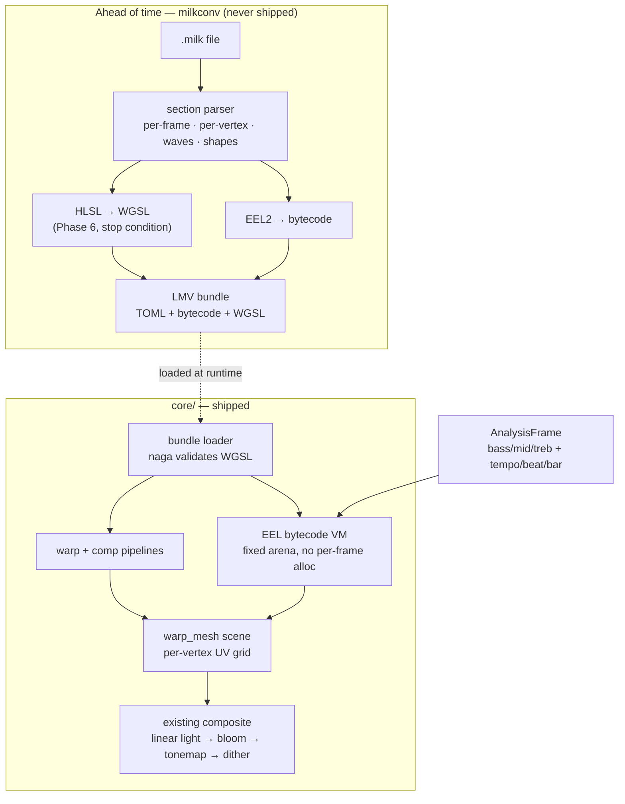

# 0100 — The engine speaks MilkDrop

> **Status:** in-progress
> **Created:** 2026-08-16
> **Approved:** 2026-08-16 (user)
> **Owner skill(s):** dev, human
> **Related ADRs:** [0113](../adrs/0113-milkdrop-presets-are-translated-ahead-of-time-onto-a-warp-mesh-idiom.md) (MilkDrop presets are translated ahead of time onto a warp-mesh idiom)

## TL;DR

The engine gains a **warp-mesh render idiom** — a per-vertex mesh that resamples the previous
frame, generalizing [ADR-0048](../adrs/0048-transformed-feedback.md)'s single shared transform —
and a **dev-only converter** that translates `.milk` presets onto it ahead of time. The first phase
ships a native, preset-authorable warp-mesh scene that stands alone whether or not the import half
ever finishes. The last phases add the MilkDrop 2 pixel shaders behind a stop condition, so the
plan can land at partial fidelity rather than fail. What it buys, if it lands whole, is a content
library this project cannot author its way to — rendered in a linear-light HDR pipeline the
original never had.

## Context & problem

39 shipped presets against a MilkDrop community library measured in tens of thousands. That gap
is the single largest thing standing between this engine and the field, it is not closable by
authoring, and it is the gap the user asked to close.

The capability gap runs the other way, which is what makes the import interesting rather than
merely useful. MilkDrop composites in 8-bit additive; this engine accumulates in linear-light
`Rgba16Float` with a real bright-pass bloom, one engine-fixed tonemap and a dithered display write.
MilkDrop gives a preset `bass`/`mid`/`treb` and a beat heuristic; this engine's analysis carries
tempo in BPM, a beat index, bar phase and spectral novelty. **The same preset should look better
here**, and Phase 7 is where a human says whether it does.

The obstacle is that a `.milk` file is not data. It is two imperative EEL2 programs (per-frame and
per-vertex), up to four custom waves and four custom shapes with their own code, and — since
MilkDrop 2 — a warp and a composite pixel shader in HLSL. This project's expression layer is
deliberately **pure and total** ([ADR-0002](../adrs/0002-layered-preset-architecture.md),
[ADR-0020](../adrs/0020-preset-grammar-v2-branching-functions-tempo.md)) and has no assignment, no
sequencing, no memory and no shader compile — and that purity underwrites both
[NFR §6](../nfr.md#6-determinism) and the property that a preset cannot crash the app.

## Decision

Per [ADR-0113](../adrs/0113-milkdrop-presets-are-translated-ahead-of-time-onto-a-warp-mesh-idiom.md):
**translate ahead of time, run natively.** A converter binary outside `default-members` parses
`.milk`, compiles EEL2 to bytecode and HLSL to WGSL, and emits a bundle; the engine gains a
`warp_mesh` scene and a small stack VM to execute the bytecode. No `.milk` text, no HLSL and no
translator ever enters `lmv.exe` or `foo_lmv.dll`.

We rejected a **runtime `.milk` interpreter** because it lands untrusted program text and a large
C++ translator inside a binary under a ~10 MB cap — in a process that is sometimes foobar2000's —
and because Butterchurn, the highest-fidelity implementation that exists, declined it too. We
rejected **converting onto the existing expression grammar** because a pure, total language cannot
hold EEL2's state and the result would be a caricature of each preset. We rejected **linking
projectM** because it would put an OpenGL stack inside a wgpu app and render the presets in
projectM's 8-bit pipeline, forfeiting the only reason to do this at all.

## Architecture diagram



## The corpus, measured (2026-08-16)

Three public collections are on disk before Phase 3 starts, cloned shallow from
`github.com/projectM-visualizer` — **`presets-cream-of-the-crop`** (9,795 presets, the projectM
default pack since 2022), **`presets-milkdrop-original`** (552, what shipped with the last official
MilkDrop) and **`presets-milkdrop-texture-pack`** (the shared disk textures the original set
declares it needs). **They live outside this repository and stay there until Phase 8 decides
provenance**, which is also why this section names the upstream repositories rather than a local
path.

A feature census over all 10,347 files, taken before implementation because three phases below are
sized by it rather than by estimate. Counted by `grep` over the preset text, so each row is an
**upper bound on what that phase must handle**, not a parse:

| What | Count | Share | What it prices |
|------|-------|-------|----------------|
| `MILKDROP_PRESET_VERSION=201` — MilkDrop 2, carries HLSL | 8,500 | 82 % | Phase 6, behind its stop condition |
| no version line — MilkDrop 1.x, no shaders | ~1,847 | 18 % | what Phases 1–5 reach alone |
| an **enabled** custom shape (`shapecode_N_enabled=1`) | 6,498 | 63 % | Phase 4 |
| an **enabled** custom wave (`wavecode_N_enabled=1`) | 4,852 | 47 % | Phase 4 |
| reads a procedural noise sampler | 5,323 | 51 % | Phase 6's input surface |
| reads a **disk** texture | 1,937 | 19 % | out of scope — see the last section |
| touches `megabuf` / `gmegabuf` | 435 | 4 % | Phase 2's arena |
| uses `loop()` | 418 | 4 % | Phase 2's bounded loops |

**The 82 % is the number to carry into Phase 6.** Its stop condition is not a tail risk — it decides
whether four fifths of the corpus renders as authored. Phases 1–5 landing alone is still a real
outcome, but [ADR-0113](../adrs/0113-milkdrop-presets-are-translated-ahead-of-time-onto-a-warp-mesh-idiom.md)'s
Alternative D should be read as *~1,847 presets plus a native idiom*, not as "most of it works".

**The 4 % on `megabuf` lets Phase 2 size its arena from evidence.** EEL2's reference `megabuf` is
8,388,608 slots, which is tens of MB per preset at any float width — allocated once per load and
never grown, that is the single largest memory number this plan can introduce. Size it from what
the corpus actually uses and refuse the rest **by name**, per Phase 3's no-silent-zero rule.

## Implementation phases

### Phase 1 — the warp mesh is a native scene

- **Owner skill:** dev
- **What:** A new `SystemKind::WarpMesh` that resamples the previous frame through a per-vertex UV
  grid, driven by ordinary preset bindings. No MilkDrop anything — this is the render idiom, and it
  is valuable on its own.
- **Files touched:** `core/src/preset/schema.rs` (the variant), `core/src/render/scenes/warp_mesh/`
  (new), `core/src/render/scenes/mod.rs`, `presets/README.md`, `docs/presets.md`,
  `core/tests/fixtures/`.
- **Notes for the implementer:**
  - The mesh is a **resolution, not a shape** ([ADR-0037](../adrs/0037-internal-grid-is-a-resolution-not-a-shape.md)).
    Every screen-destined coordinate — the UV projection, `rad`, `ang` — takes its aspect from the
    **render target**, never from `meshx`/`meshy`. This family has shipped that bug three times
    elsewhere; the grid here is user-visible and quantized, so it is the most likely place for a
    fourth.
  - Per-vertex bindings get `x`, `y`, `rad`, `ang` **only inside a `[per_vertex]` table**, by the
    same mechanism `index` already uses for per-element evaluation. This does not widen the grammar
    for other systems.
  - A new pass means [ADR-0058](../adrs/0058-bind-group-layout-collisions-carry-evidence.md)
    applies: if its bind-group layout shape matches a live pipeline's, it needs an allowlist entry
    carrying the reason.
- **Done when:** a native `warp_mesh` preset in `core/tests/fixtures/` renders a radial pulse from
  a `[per_vertex]` binding over `rad`, and passes `sanity`, `animation` and `reactivity`. **The mesh
  grid is a tier capacity** (`TierConfig`, [ADR-0045](../adrs/0045-quality-tiers-floor-and-rich.md)),
  and its `Floor` value is **the output of a measurement, not a guess**: raise the grid until
  per-frame mesh evaluation costs more than **1 ms — 6 % of the 16.67 ms budget
  [NFR §1](../nfr.md#1-performance--adaptive-quality) commits to at 1080p** — and cap `Floor` one
  step below. Record the number and the machine. `Rich` may go to the format's maximum
  (`meshx` ≤ 128, `meshy` ≤ 96) if it measures clean, and lower if it does not.

### Phase 2 — the EEL2 machine

- **Owner skill:** dev
- **What:** A bytecode format, a compiler for it in the converter crate, and a stack VM in `core`
  that executes it. The VM is the only half that ships.
- **Files touched:** `core/src/milk/vm.rs` + `core/src/milk/bytecode.rs` (new), `milkconv/` (new
  workspace member, **outside `default-members`** exactly as `lmv-core-cabi` is —
  [ADR-0072](../adrs/0072-the-c-abi-ships-from-its-own-crate.md)), root `Cargo.toml`.
- **Notes for the implementer:**
  - The VM's registers and `megabuf`/`gmegabuf` scratch are a **fixed arena allocated once at
    preset load**. Zero heap allocation per frame; this runs on the render thread, and
    [NFR §5](../nfr.md#5-real-time-safety-testable-restatement) governs it.
  - No clock reads and no unseeded randomness. EEL2's `rand()` is salted per preset from the same
    mechanism [ADR-0051](../adrs/0051-seeded-grammar-randomness-with-per-run-opt-in.md) already
    uses, so a converted preset is reproducible and the capture harness stays a pure function of
    its inputs.
  - Division by zero, `log(0)` and friends are **total** — the VM returns a defined value and never
    panics. `unwrap`/`expect` are denied on this path by the Plan 0002 pragma, and
    `core/src/milk/` must be **added to `core/tests/hygiene.rs`'s scan set** or the guard silently
    passes it.
- **Done when:** a conformance suite of EEL2 snippets — assignment, sequencing, `if`/`above`/
  `below`/`equal`, `loop` with a bounded count, `megabuf` round-trip, the `q1`–`q32` and `t1`–`t8`
  bridges — compiled by `milkconv` and executed by the VM produces the values the MilkDrop authoring
  reference specifies for each. A hand-written bundle drives Phase 1's mesh from a per-frame
  program, and the render is byte-identical across two runs.

### Phase 3 — the converter reads a real preset

- **Owner skill:** dev
- **What:** `milkconv` parses a `.milk` file end to end — the section layout, the per-frame and
  per-vertex code, the full output-variable roster — and emits a loadable bundle. No shaders, no
  custom waves or shapes yet.
- **Files touched:** `milkconv/src/`, `core/src/preset/` (bundle loading), `docs/capturing.md`.
- **Notes for the implementer:** the variable roster is the spec, and it is long — `zoom`,
  `zoomexp`, `rot`, `warp`, `cx`, `cy`, `dx`, `dy`, `sx`, `sy`, `decay`, `gamma`, `echo_zoom`,
  `echo_alpha`, `echo_orient`, `wrap`, `invert`, `brighten`, `darken`, `solarize`, `darken_center`,
  plus the read-only inputs `bass`/`mid`/`treb` and their `_att` variants, `time`, `frame`, `fps`,
  `progress`, `meshx`, `meshy`, `aspectx`, `aspecty`. **An unrecognized name is a named warning, not
  a silent zero** — a preset that reads a variable we do not supply must say so, in the shape a
  typo warning already takes ([ADR-0020](../adrs/0020-preset-grammar-v2-branching-functions-tempo.md)).
- **Done when:** a real `.milk` file from a public collection converts and renders as **recognizably
  the same preset** as its published description — motion in the right direction, at the right
  rate, reacting to the same bands. This is the plan's moment of truth and the verdict is a
  captured frame sequence in the phase commit, not an assertion.

### Phase 4 — the draw layer

- **Owner skill:** dev
- **What:** Everything MilkDrop draws between the warp and the composite: the waveform
  (`wave_mode` 0–7 with `wave_x/y/r/g/b/a`, `wave_mystery`, `wave_usedots`, `wave_thick`,
  `wave_additive`, `wave_brighten`), up to four custom waves and four custom shapes with their own
  per-point code, the inner and outer borders (`ib_*`, `ob_*`), and the motion-vector grid (`mv_*`).
- **Files touched:** `core/src/render/scenes/warp_mesh/`, `milkconv/src/`.
- **Notes for the implementer:** the waveform and custom shapes are line and point geometry — the
  shared line renderer is the natural target, and [ADR-0059](../adrs/0059-line-scenes-colour-along-their-generator-axis.md)'s
  palette contract applies to anything drawn through it.
- **Done when:** each `wave_mode` renders distinguishably from the others under one fixture, custom
  shapes honour their per-point program, and a preset using borders and motion vectors shows both.

### Phase 5 — what actually converts

- **Owner skill:** dev
- **What:** Run `milkconv` over a corpus of public `.milk` files and report what happens.
- **Files touched:** `milkconv/src/` (a `--report` mode), `docs/capturing.md`.
- **Done when:** the converter prints, over the corpus above, how many
  **parse**, how many **compile**, how many **render non-blank**, and the ranked reasons for each
  failure class. **The ranking is read against the census, not against an empty prior**: a
  disk-texture failure class near **19 %** and a shaderless-only success class near **18 %** are
  what the measured distribution predicts before the converter runs, so a ranking that disagrees
  sharply with either is evidence about *the converter* rather than about the corpus. That is the
  whole reason the census was taken first, and it costs nothing to state the prediction in
  advance. **This is a measurement and it asserts no threshold** — per
  [ADR-0071](../adrs/0071-a-numeric-test-contract-states-a-property-or-names-its-machine.md), a
  coverage percentage is a property of the corpus and the converter at one moment, so it is
  recorded with both named and is never a gate. The ranked failure reasons are the output that
  matters: they are the work list for whether Phase 6 is worth starting.

### Phase 6 — the shaders, with a stop condition

- **Owner skill:** dev
- **What:** Translate MilkDrop 2's `warp` and `comp` HLSL blocks to WGSL in the converter, and
  compile them through `naga` at bundle load.
- **Files touched:** `milkconv/src/shader/`, `core/src/render/scenes/warp_mesh/`.
- **Notes for the implementer:**
  - The shader input surface is fixed and large: `uv`, `uv_orig`, `rad`, `ang`, `hue_shader`,
    `sampler_main` and its `fw`/`fc`/`pw`/`pc` variants, `GetBlur1/2/3`, `texsize`, `aspect`,
    `time`, `fps`, `frame`, `progress`, the audio scalars, `rand_frame`, `rand_preset`,
    `slow_roam_*`/`roam_*`, `q1`–`q32` and the grouped `_qa`–`_qh`, and the `rot_s/d/f/vf/uf/rand`
    matrix families. Supply all of it or presets fail in ways that read as our bug.
  - **The procedural noise textures are part of that surface and are not a corner** —
    `sampler_noise_lq`, `_lq_lite`, `_mq`, `_hq` and the `sampler_noisevol_lq`/`_hq` volumes.
    **51 % of the corpus reads one**, which makes them the most common sampler after `main`.
    MilkDrop generates them internally from a seeded RNG at startup, so they are ours to generate
    too: a fixed set built once at device init, deterministic under
    [ADR-0051](../adrs/0051-seeded-grammar-randomness-with-per-run-opt-in.md)'s rule, no disk file
    and no bundle payload. **A preset sampling a missing one does not fail — it renders wrong**,
    which is the failure class this plan's Risks call the worst for reputation.
  - **Bound every loop in the converter and record the instruction count.** A converted shader can
    still trip a driver TDR (ADR-0113's stated residual risk); a bound is the only lever we hold.
  - A failed `naga` compile **rejects that preset by name** and loads the rest. One bad bundle must
    not take the library down.
- **STOP CONDITION:** if no viable route to HLSL→WGSL exists within this phase's budget — the
  reference implementations are a C++ chain (`hlsl2glslfork` + `glsl-optimizer`) with no Rust
  equivalent, and vendoring one into `milkconv` may be more than this plan can carry — **the plan
  stops here.** Phases 1–5 stand as MilkDrop 1.x-class fidelity plus a native warp-mesh idiom, which
  is [ADR-0113](../adrs/0113-milkdrop-presets-are-translated-ahead-of-time-onto-a-warp-mesh-idiom.md)
  Alternative D and an honest landing zone. Record the reason and close.
- **Done when:** a MilkDrop 2 preset with custom warp and composite shaders renders, and the
  **shipped** binary's size delta against `main` is measured and stated
  ([NFR §4](../nfr.md#4-size-and-dependencies) expects it to be near zero, since the translator is
  in `milkconv` — measuring is how we find out it was not).

### Phase 7 — does it actually look right

- **Owner skill:** human
- **What:** Run the same converted presets in this engine and in `foo_vis_milk2` on the same track,
  side by side, and judge.
- **Done when:** the user states, for a handful of presets, whether the conversion is faithful and
  whether the HDR pipeline makes them **better** rather than merely different. The second half is
  the claim this whole plan rests on; if it comes back negative, that is a finding worth more than
  the feature.

### Phase 8 — what, if anything, ships

- **Owner skill:** human
- **What:** Decide the provenance question. The large circulating collections have no clear
  licensing, and this repository is dual Apache-2.0/MIT.
- **Done when:** the user decides whether converted presets ship in-repo, ship as a separately
  licensed download, or never ship at all and the import path only ever reads a user-supplied
  directory. **The technical path works in every case** — this decides distribution, not
  capability. Whatever is chosen is written into `docs/presets.md` and the release notes.

## Data shapes

```rust
// illustrative — not the final interface

/// One compiled EEL2 program. Emitted by milkconv, executed by core's VM.
/// Fixed-size at load; nothing here grows per frame.
pub struct EelProgram {
    code: Vec<Op>,          // flat bytecode, bounded loops only
    n_regs: u16,            // register file size, known at compile time
    megabuf_len: u32,       // scratch, allocated once
}

/// What a converted preset carries beyond an ordinary LMV preset.
pub struct MilkBundle {
    per_frame_init: EelProgram,
    per_frame: EelProgram,
    per_vertex: EelProgram,
    waves: Vec<CustomWave>,     // ≤ 4
    shapes: Vec<CustomShape>,   // ≤ 4
    warp_wgsl: Option<String>,  // None until Phase 6, or if the source had none
    comp_wgsl: Option<String>,
    mesh: (u8, u8),             // requested meshx/meshy, clamped to the tier cap
}
```

## Risks & open questions

- **Phase 6 may be the whole plan's cost.** The HLSL→WGSL chain is the only part with no clear
  route, which is why it is last and why it has a stop condition rather than a hope.
- **The binary budget is tighter than when this plan was written, and Phase 6 is where we find
  out.** [Plan 0097](done/0097-the-track-announces-itself.md) closed 2026-08-16 and took the
  shipped `foo_lmv.dll` to **8,879,104 B against [NFR §4](../nfr.md#4-size-and-dependencies)'s
  ~10 MB soft cap — about 1.07 MB of headroom**, the tightest that component has had;
  [`docs/specs/0001-c-abi.md`](../specs/0001-c-abi.md) now carries the rule that came out of it,
  that the next dependency added there re-measures rather than assumes. What *this* plan ships into
  that same binary is the VM, the bundle loader and the `warp_mesh` scene — small Rust, with `naga`
  already inside wgpu — so the expected delta is tens of KB, not MB. **The reading stays at Phase 6
  by the user's call (2026-08-16)**; what changes is the number it is read against. ADR-0113's
  Positive that NFR §4 "is unaffected by the expensive half" remains true of `milkconv` and was
  reasoned against 3.2 MB of headroom, not 1.07 — so Phase 6's stated expectation of a near-zero
  delta is now load-bearing rather than reassuring.
- **Per-vertex evaluation is CPU work on the render thread.** Phase 1's measurement sets the cap;
  if the cap lands embarrassingly low, the honest answer is a low cap and a recorded number, not a
  hidden `Rich`-only feature. Moving the per-vertex program to a compute shader is a *future* plan,
  not a rescue for this one — EEL2's sequencing and scratch memory do not port trivially.
- **Fidelity failures will look like our bugs.** A preset that renders but wrong is worse for
  reputation than one that refuses to load. Phase 3's "named warning, never a silent zero" rule
  and Phase 6's "reject by name" rule both exist for this, and Phase 5's failure ranking is how we
  find out which class dominates.
- **Two preset languages, forever.** An author reading `docs/presets.md` will occasionally assume
  EEL2 semantics and vice versa. The mitigation is documentation discipline, and it will partly
  fail.
- **A converted shader can trip a GPU watchdog.** Stated in the ADR, bounded in Phase 6, not
  eliminated. This is the residual of the full-fidelity scope call.
- **Contention:** Phase 1 edits `core/src/preset/schema.rs` and `core/src/render/scenes/mod.rs`,
  which nothing on the current roster touches. It does **not** contend with
  [0092](0092-the-engine-draws-an-authored-path.md) or [0098](0098-the-figure-nests-properly.md)
  (both `shape_field.rs`) or [0087](0087-the-line-renderer-draws-a-curve.md) (`lines/`). Phase 4
  draws through the shared line renderer and **would** contend with 0087 — sequence them.

## What this plan does NOT do

- **It does not widen the expression grammar.** EEL2 gets its own machine precisely so
  [ADR-0002](../adrs/0002-layered-preset-architecture.md)'s purity survives. No assignment, no
  sequencing and no memory enter the native preset language.
- **It does not ship a runtime `.milk` parser.** Conversion is ahead of time, always.
- **It does not import MilkDrop's `textures/` directory or its user texture sampling.** Presets
  that sample a disk texture will fail to convert and be reported as such in Phase 5. **That is a
  measured 19 % of the corpus — 1,937 of 10,347 files — and the exclusion is deliberate at that
  price** (user's call, 2026-08-16). The number is stated here so Phase 5's ranking confirms a
  known cost rather than discovering one; the followup below stands, and its trigger has already
  fired in the sense that matters. **The procedural noise samplers are the opposite case and are
  in scope** — see Phase 6.
- **It does not promise a coverage percentage.** Phase 5 measures; nothing asserts.
- **It does not decide preset licensing** — Phase 8 does, and it is the user's call.

## Implementation log (dev, 2026-08-16)

**Bookkeeping, not design.** Written by `dev` mid-plan so a fresh session can pick
the work up without re-deriving it. Everything below is *what happened*; the
phases above are still the contract.

**Lane:** worktree `WORK/lmv-plan-0100`, branch
`plan-0100-the-engine-speaks-milkdrop`, branched from local `main` at `657d103`
(**not** `origin/main`, which was behind it — the corpus-census commit this plan
is sized by is only local).

### Where it stands

| phase | state |
|---|---|
| 1 — the warp mesh is a native scene | **done**, committed `2603309` |
| 2 — the EEL2 machine | **done**, committed `bfb5536` |
| 3 — the converter reads a real preset | **done**, committed `ebbf395` |
| 4 — the draw layer | **done**, committed `aec8f15` (built at `9941129`, finished at `aec8f15`) |
| 5 — what actually converts | **done**, committed below |
| 6 — the shaders | not started — its stop condition is the next decision |
| 7, 8 — human | not started, and not `dev`'s |

`cargo nextest run --workspace` is **863 passed, 3 skipped**; `cargo clippy
--workspace --all-targets`, `cargo fmt --all --check` and
`scripts/check-doc-links.mjs` are clean.

There is one **`wip:` commit** in this branch's history (`dc9612f`). It is the
checkpoint a bisect control needed — the composite goldens had to be run against
the pre-change tree — and it is not squashed because this project does not rewrite
history. Fold it at merge if you want to.

### What finishing Phase 4 turned out to mean

The handoff above said "one thing left". It was three.

**1. The custom waves and shapes never reached the engine.** `milkconv` compiled
them into the bundle and `emit()` dropped them: `RawMilk` had no field to receive
them and `MilkBundle::from_assembly` hard-coded both vectors empty. So **63 % of
the corpus drew none of its shapes and 47 % none of its waves**, silently, and
the earlier session's report of "the waveform, the custom shapes, a moiré of both"
was the waveform alone. Fixed by adding `[[milk.waves]]` / `[[milk.shapes]]` to
the bundle format, `MilkBundle::push_element` to load them under the same roster
validation the three main programs get, and the emitter side.

**2. The blend, and the user chose the faithful one.** The diagnosis above was
right about the cause and understated the size. The additive seam **sums** where
alpha-over **replaces**, so N overlapping producers land at N rather than at ≤ 1 —
which no scalar fixes, because a scalar cannot bound a sum. Measured against the
corpus: **2 949 of 10 347 presets (28.5 %) set `fDecay >= 1.0`**, where the field
never fades and nothing brings the sum back down. That number was put to the user
and **option 2 was chosen** (2026-08-16): `LineRenderer` gains an opt-in second
pipeline and `draw_split`, the shape pipeline gains its twin, and `DrawGeometry`
partitions each buffer by blend mode.

Three things about that landed differently from the sketch:

- **`SegmentInstance` gained an `alpha`**, `1.0` at every existing call site and
  therefore byte-identical for the nine line scenes that do not split. It is
  declared **last**, because `vertex_attr_array!` derives offsets from location
  order — putting it before `joined` reinterprets the join bits as a float, which
  compiles, renders, and moved five composite golden baselines. Written up on the
  field.
- **The second pipeline is opt-in** (`LineRenderer::new_split`). Building it for
  the nine scenes that never bind it is not free: an extra device allocation
  changes what WARP resolves later, which is the hazard `core/tests/composite.rs`
  records.
- **The over-blend alpha is rate-converted** — `1 - (1-a)^rate` rather than `a` —
  so a 30 Hz frame travels as far as two 60 Hz ones. ADR-0019 applied to a blend.

**3. Two `wave_mode` figures were aliases.** `0`/`1` and `6`/`7` built identical
geometry, so the phase's done-when was not met — the test written for it is what
found that, which is the argument for writing it as a *pairwise* comparison. The
reference tells each pair apart using the **second audio channel** and this engine
is mono, so each now draws the one trace at the separation the reference's own
parameters name.

Tests, all of Phase 4's done-when plus what ADR-0056 owes a new seam:

| test | where | pins |
|---|---|---|
| `every_wave_mode_builds_a_different_figure` | `warp_mesh/tests.rs` | the eight modes, pairwise |
| `a_custom_shape_honours_its_per_point_program` | `milkconv/tests/draw_layer.rs` | `.milk` text to triangles; only that crate can compile EEL2 |
| `borders_and_motion_vectors_each_draw_their_own_figure` | `warp_mesh/tests.rs` | each alone, then both |
| `the_blend_partition_separates_the_two_seams` | `warp_mesh/tests.rs` | the invariant the two-pipeline draw assumes |
| `the_over_blend_alpha_is_frame_rate_independent` | `warp_mesh/tests.rs` | ADR-0019 on the blend |
| `a_lit_backdrop_survives_where_the_draw_layer_drew_nothing` | `core/tests/warp_mesh.rs` | ADR-0056's owed capture. Corners move 0 channels; the drawn region moves 103 |

The draw layer is tested **as geometry rather than as pixels** where it can be —
"each `wave_mode` renders distinguishably" is a statement about figures, and
comparing eight point sets answers it exactly where eight captures answer a weaker
version through a rasterizer at a hundred times the cost.

### Decisions taken along the way that are not in the phases above

- **`AnalysisFrame` gained `waveform: [f32; WAVE_SAMPLES]`** (512). Phase 4's
  file list did not include `core/src/dsp/`, and MilkDrop's light source is the
  waveform, so this was surfaced and the user approved the widening before it was
  made. It is the scope trace: consecutive tail of the window, un-normalized,
  and deliberately **not** in `Variables` (the grammar stays scalar, ADR-0036).
- **The warp transform follows the reference's stage order** (Phase 3): `zoom`
  about the frame centre, `sx`/`sy` and `rot` about the per-vertex `cx`/`cy`,
  `dx`/`dy` in uv. Collapsing the two origins renders a different picture for any
  preset with an off-centre centre.
- **`zoomexp` needs no engine parameter** — the converter folds it into the
  per-vertex program as `zoom^(zoomexp^(rad*2-1))`.
- **Seven composite params were built rather than warned about**, chosen by
  measuring the corpus: `bTexWrap` 58 %, `bDarken` 36 %, `bBrighten` 14 %,
  `bDarkenCenter` 7 %, `bInvert` 6 %, `bSolarize` 4 %. The video echo (2.4 %) is
  named instead, being a second sampled copy rather than a remap.
- **The VM's loop and instruction bounds are per program** (`Budget::INIT` /
  `FRAME` / `VERTEX`): the corpus's commonest `per_frame_init` idiom is a
  10 000-iteration `megabuf` seed, and a bound tight enough for `per_vertex`
  breaks it.
- **Two `.milk` parser readings were decided by measurement**, both on
  `milk::join_code` and `eel::Compiler::argument`: code lines join **directly**
  (MilkDrop's writer cuts mid-identifier) with `//` comments stripped per line
  first, and a trailing or doubled `;` inside a call argument is legal. Together
  they are the difference between 525/552 and 552/552.
- **The mesh grid's tier values are measured** — `mesh_cost_by_grid` prints the
  ladder; `Floor` is `64x48` and `Rich` `88x66`, and the format's own maximum is
  refused at 1.92 ms. See `TierConfig::mesh_grid`.

### Phase 5, and what it measured

`milkconv --report <dir>` walks a corpus, converts everything and ranks what
happened; `--render` adds the third count by loading every converted preset into a
headless renderer. It **asserts no threshold and exits zero however bad the
numbers are** (ADR-0071) — a non-zero exit would make it a gate the first time
somebody put it in a script. The full table is in
[`docs/capturing.md`](../capturing.md).

**Both census predictions held**, which is the result that says the ranking is
about the corpus rather than about the converter:

| | predicted | measured |
|---|---|---|
| reads a disk texture | 19.0 % | 21.8 % |
| MilkDrop 1.x, no shaders | 18.0 % | 17.9 % |

The disk-texture class came in 2.8 points high, and in the expected direction: the
census counted a `grep` for a texture name and the converter also flags
`sampler_pc`, so it sees a slightly wider class than the census could.

### Phase 6: the stop condition does NOT fire, and why

**The plan asked whether a route to HLSL→WGSL exists and assumed the answer
depended on porting a C++ chain. It does not.** The reference implementations are
`hlsl2glslfork` + `glsl-optimizer` (Butterchurn ships them through Emscripten) and
there is no Rust equivalent — `naga` has an HLSL *backend* and no HLSL frontend.
That is all true and it is not the question.

MilkDrop shaders are not general HLSL. Censused over all **430 854** shader source
lines in the corpus (2026-08-16):

| what | count |
|---|---|
| distinct intrinsics covering essentially everything | ~30 — `tex2D` `lerp` `saturate` `length` `pow` `frac` `abs` `max` `sin` `cos` `floor` `mul` `atan2` `clamp` `dot` `normalize` `sqrt` `tan` `min` `log` `exp` `cross` `tex3D` |
| MilkDrop's own prelude helpers | `GetBlur1/2/3` `GetPixel` `lum` `GetDist` `uv_rotate` `uv_polar` `uv_bipolar` — **ours to define once**, not to parse |
| `if` | 12 822 |
| presets whose shader contains **any** loop | **928 of 10 347 (9 %)** |
| user-defined helper functions, whole corpus | 1 888 declarations across 16 380 shader bodies |

A representative shader is twenty lines of expression code over `float2`/`float3`/
`float2x2`, a few `tex2D`/`tex3D` calls and swizzles. **That is a bounded language
a hand-written Rust frontend can cover**, and the 9 % with loops plus the 1 888
helper declarations are exactly the tail Phase 6's "reject that preset by name"
rule exists for.

So the route is: a lexer, a parser for that subset, HLSL's vector/matrix promotion
rules, a WGSL emitter, the ~40-name input surface, and the four procedural noise
textures (**51 % of the corpus samples one**, so they are not a corner). Comparable
in size to Phase 2's EEL2 machine, which was its own session.

**The user's call (2026-08-16): Phase 6 goes to a fresh session.** It is not
blocked and it is not deferred by doubt — it is deferred because a whole subsystem
belongs in its own context, and because this one had already run Phase 4's blend
rework and Phase 5.

### Things a fresh session will want to know

- `milkconv` is outside `default-members`, so `cargo build` does not build it;
  `-p milkconv` or `--workspace` does.
- Blessing goldens rewrites **every** baseline — check `git status` afterwards
  and restore any that were not meant to move.
- The `shot` CLI renders a converted bundle like any other preset:
  `cargo run -p standalone --example shot -- --preset-file converted.toml`.
- Two adapter comparisons are recorded and `#[ignore]`d in
  `core/tests/warp_mesh.rs`; re-run `the_adapters_agree_on_the_warp_mesh` before
  blessing anything, since the golden suite captures on WARP.
- **A new vertex attribute goes LAST in its `#[repr(C)]` struct.** `vertex_attr_array!`
  derives byte offsets from shader-location order, so inserting a field in the
  middle silently re-points every attribute after it. It compiles and it renders.
  See `SegmentInstance::alpha`.
- **A new pipeline is not free on WARP even if nothing binds it.** The extra
  device allocation changes what a later pass resolves to — the hazard
  `core/tests/composite.rs`'s header records. `LineRenderer::new_split` exists so
  the nine scenes that never split do not pay it.
- `milkconv --report <dir>` takes about a minute over the whole corpus;
  `--render` takes tens of minutes, because it builds a scene per preset.
- The two `milkconv` test files split by what they can do: `conformance.rs` and
  `draw_layer.rs` live there rather than in `core` because **only that crate can
  compile EEL2**, and a fixture assembled by hand pins the assembler rather than
  the semantics.

## Followups (after this lands)

- Per-vertex evaluation on a compute shader, if Phase 1's cap lands low enough to hurt.
- A `warp_mesh` content cohort — the idiom is native and authorable, and
  [Plan 0104](0104-the-library-stops-being-lopsided.md)'s per-system floor will apply to it once it
  exists.
- MilkDrop's `textures/` support, if Phase 5's failure ranking says it is a large class.
