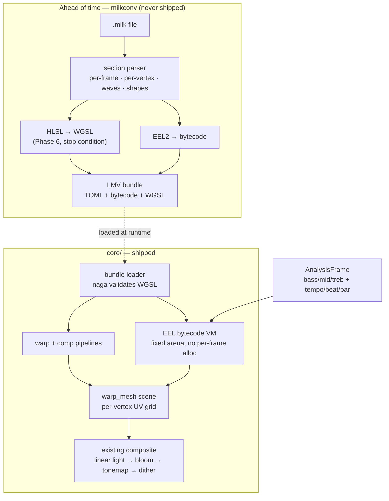

# 0100 — The engine speaks MilkDrop

> **Status:** draft
> **Created:** 2026-08-16
> **Owner skill(s):** dev, human
> **Related ADRs:** [0113](../adrs/0113-milkdrop-presets-are-translated-ahead-of-time-onto-a-warp-mesh-idiom.md) (MilkDrop presets are translated ahead of time onto a warp-mesh idiom)

## TL;DR

The engine gains a **warp-mesh render idiom** — a per-vertex mesh that resamples the previous
frame, generalizing [ADR-0048](../adrs/0048-transformed-feedback.md)'s single shared transform —
and a **dev-only converter** that translates `.milk` presets onto it ahead of time. The first phase
ships a native, preset-authorable warp-mesh scene that stands alone whether or not the import half
ever finishes. The last phases add the MilkDrop 2 pixel shaders behind a stop condition, so the
plan can land at partial fidelity rather than fail. What it buys, if it lands whole, is a content
library this project cannot author its way to — rendered in a linear-light HDR pipeline the
original never had.

## Context & problem

39 shipped presets against a MilkDrop community library measured in tens of thousands. That gap
is the single largest thing standing between this engine and the field, it is not closable by
authoring, and it is the gap the user asked to close.

The capability gap runs the other way, which is what makes the import interesting rather than
merely useful. MilkDrop composites in 8-bit additive; this engine accumulates in linear-light
`Rgba16Float` with a real bright-pass bloom, one engine-fixed tonemap and a dithered display write.
MilkDrop gives a preset `bass`/`mid`/`treb` and a beat heuristic; this engine's analysis carries
tempo in BPM, a beat index, bar phase and spectral novelty. **The same preset should look better
here**, and Phase 7 is where a human says whether it does.

The obstacle is that a `.milk` file is not data. It is two imperative EEL2 programs (per-frame and
per-vertex), up to four custom waves and four custom shapes with their own code, and — since
MilkDrop 2 — a warp and a composite pixel shader in HLSL. This project's expression layer is
deliberately **pure and total** ([ADR-0002](../adrs/0002-layered-preset-architecture.md),
[ADR-0020](../adrs/0020-preset-grammar-v2-branching-functions-tempo.md)) and has no assignment, no
sequencing, no memory and no shader compile — and that purity underwrites both
[NFR §6](../nfr.md#6-determinism) and the property that a preset cannot crash the app.

## Decision

Per [ADR-0113](../adrs/0113-milkdrop-presets-are-translated-ahead-of-time-onto-a-warp-mesh-idiom.md):
**translate ahead of time, run natively.** A converter binary outside `default-members` parses
`.milk`, compiles EEL2 to bytecode and HLSL to WGSL, and emits a bundle; the engine gains a
`warp_mesh` scene and a small stack VM to execute the bytecode. No `.milk` text, no HLSL and no
translator ever enters `lmv.exe` or `foo_lmv.dll`.

We rejected a **runtime `.milk` interpreter** because it lands untrusted program text and a large
C++ translator inside a binary under a ~10 MB cap — in a process that is sometimes foobar2000's —
and because Butterchurn, the highest-fidelity implementation that exists, declined it too. We
rejected **converting onto the existing expression grammar** because a pure, total language cannot
hold EEL2's state and the result would be a caricature of each preset. We rejected **linking
projectM** because it would put an OpenGL stack inside a wgpu app and render the presets in
projectM's 8-bit pipeline, forfeiting the only reason to do this at all.

## Architecture diagram



## Implementation phases

### Phase 1 — the warp mesh is a native scene

- **Owner skill:** dev
- **What:** A new `SystemKind::WarpMesh` that resamples the previous frame through a per-vertex UV
  grid, driven by ordinary preset bindings. No MilkDrop anything — this is the render idiom, and it
  is valuable on its own.
- **Files touched:** `core/src/preset/schema.rs` (the variant), `core/src/render/scenes/warp_mesh/`
  (new), `core/src/render/scenes/mod.rs`, `presets/README.md`, `docs/presets.md`,
  `core/tests/fixtures/`.
- **Notes for the implementer:**
  - The mesh is a **resolution, not a shape** ([ADR-0037](../adrs/0037-internal-grid-is-a-resolution-not-a-shape.md)).
    Every screen-destined coordinate — the UV projection, `rad`, `ang` — takes its aspect from the
    **render target**, never from `meshx`/`meshy`. This family has shipped that bug three times
    elsewhere; the grid here is user-visible and quantized, so it is the most likely place for a
    fourth.
  - Per-vertex bindings get `x`, `y`, `rad`, `ang` **only inside a `[per_vertex]` table**, by the
    same mechanism `index` already uses for per-element evaluation. This does not widen the grammar
    for other systems.
  - A new pass means [ADR-0058](../adrs/0058-bind-group-layout-collisions-carry-evidence.md)
    applies: if its bind-group layout shape matches a live pipeline's, it needs an allowlist entry
    carrying the reason.
- **Done when:** a native `warp_mesh` preset in `core/tests/fixtures/` renders a radial pulse from
  a `[per_vertex]` binding over `rad`, and passes `sanity`, `animation` and `reactivity`. **The mesh
  grid is a tier capacity** (`TierConfig`, [ADR-0045](../adrs/0045-quality-tiers-floor-and-rich.md)),
  and its `Floor` value is **the output of a measurement, not a guess**: raise the grid until
  per-frame mesh evaluation costs more than **1 ms — 6 % of the 16.67 ms budget
  [NFR §1](../nfr.md#1-performance--adaptive-quality) commits to at 1080p** — and cap `Floor` one
  step below. Record the number and the machine. `Rich` may go to the format's maximum
  (`meshx` ≤ 128, `meshy` ≤ 96) if it measures clean, and lower if it does not.

### Phase 2 — the EEL2 machine

- **Owner skill:** dev
- **What:** A bytecode format, a compiler for it in the converter crate, and a stack VM in `core`
  that executes it. The VM is the only half that ships.
- **Files touched:** `core/src/milk/vm.rs` + `core/src/milk/bytecode.rs` (new), `milkconv/` (new
  workspace member, **outside `default-members`** exactly as `lmv-core-cabi` is —
  [ADR-0072](../adrs/0072-the-c-abi-ships-from-its-own-crate.md)), root `Cargo.toml`.
- **Notes for the implementer:**
  - The VM's registers and `megabuf`/`gmegabuf` scratch are a **fixed arena allocated once at
    preset load**. Zero heap allocation per frame; this runs on the render thread, and
    [NFR §5](../nfr.md#5-real-time-safety-testable-restatement) governs it.
  - No clock reads and no unseeded randomness. EEL2's `rand()` is salted per preset from the same
    mechanism [ADR-0051](../adrs/0051-seeded-grammar-randomness-with-per-run-opt-in.md) already
    uses, so a converted preset is reproducible and the capture harness stays a pure function of
    its inputs.
  - Division by zero, `log(0)` and friends are **total** — the VM returns a defined value and never
    panics. `unwrap`/`expect` are denied on this path by the Plan 0002 pragma, and
    `core/src/milk/` must be **added to `core/tests/hygiene.rs`'s scan set** or the guard silently
    passes it.
- **Done when:** a conformance suite of EEL2 snippets — assignment, sequencing, `if`/`above`/
  `below`/`equal`, `loop` with a bounded count, `megabuf` round-trip, the `q1`–`q32` and `t1`–`t8`
  bridges — compiled by `milkconv` and executed by the VM produces the values the MilkDrop authoring
  reference specifies for each. A hand-written bundle drives Phase 1's mesh from a per-frame
  program, and the render is byte-identical across two runs.

### Phase 3 — the converter reads a real preset

- **Owner skill:** dev
- **What:** `milkconv` parses a `.milk` file end to end — the section layout, the per-frame and
  per-vertex code, the full output-variable roster — and emits a loadable bundle. No shaders, no
  custom waves or shapes yet.
- **Files touched:** `milkconv/src/`, `core/src/preset/` (bundle loading), `docs/capturing.md`.
- **Notes for the implementer:** the variable roster is the spec, and it is long — `zoom`,
  `zoomexp`, `rot`, `warp`, `cx`, `cy`, `dx`, `dy`, `sx`, `sy`, `decay`, `gamma`, `echo_zoom`,
  `echo_alpha`, `echo_orient`, `wrap`, `invert`, `brighten`, `darken`, `solarize`, `darken_center`,
  plus the read-only inputs `bass`/`mid`/`treb` and their `_att` variants, `time`, `frame`, `fps`,
  `progress`, `meshx`, `meshy`, `aspectx`, `aspecty`. **An unrecognized name is a named warning, not
  a silent zero** — a preset that reads a variable we do not supply must say so, in the shape a
  typo warning already takes ([ADR-0020](../adrs/0020-preset-grammar-v2-branching-functions-tempo.md)).
- **Done when:** a real `.milk` file from a public collection converts and renders as **recognizably
  the same preset** as its published description — motion in the right direction, at the right
  rate, reacting to the same bands. This is the plan's moment of truth and the verdict is a
  captured frame sequence in the phase commit, not an assertion.

### Phase 4 — the draw layer

- **Owner skill:** dev
- **What:** Everything MilkDrop draws between the warp and the composite: the waveform
  (`wave_mode` 0–7 with `wave_x/y/r/g/b/a`, `wave_mystery`, `wave_usedots`, `wave_thick`,
  `wave_additive`, `wave_brighten`), up to four custom waves and four custom shapes with their own
  per-point code, the inner and outer borders (`ib_*`, `ob_*`), and the motion-vector grid (`mv_*`).
- **Files touched:** `core/src/render/scenes/warp_mesh/`, `milkconv/src/`.
- **Notes for the implementer:** the waveform and custom shapes are line and point geometry — the
  shared line renderer is the natural target, and [ADR-0059](../adrs/0059-line-scenes-colour-along-their-generator-axis.md)'s
  palette contract applies to anything drawn through it.
- **Done when:** each `wave_mode` renders distinguishably from the others under one fixture, custom
  shapes honour their per-point program, and a preset using borders and motion vectors shows both.

### Phase 5 — what actually converts

- **Owner skill:** dev
- **What:** Run `milkconv` over a corpus of public `.milk` files and report what happens.
- **Files touched:** `milkconv/src/` (a `--report` mode), `docs/capturing.md`.
- **Done when:** the converter prints, over a corpus of at least several hundred presets, how many
  **parse**, how many **compile**, how many **render non-blank**, and the ranked reasons for each
  failure class. **This is a measurement and it asserts no threshold** — per
  [ADR-0071](../adrs/0071-a-numeric-test-contract-states-a-property-or-names-its-machine.md), a
  coverage percentage is a property of the corpus and the converter at one moment, so it is
  recorded with both named and is never a gate. The ranked failure reasons are the output that
  matters: they are the work list for whether Phase 6 is worth starting.

### Phase 6 — the shaders, with a stop condition

- **Owner skill:** dev
- **What:** Translate MilkDrop 2's `warp` and `comp` HLSL blocks to WGSL in the converter, and
  compile them through `naga` at bundle load.
- **Files touched:** `milkconv/src/shader/`, `core/src/render/scenes/warp_mesh/`.
- **Notes for the implementer:**
  - The shader input surface is fixed and large: `uv`, `uv_orig`, `rad`, `ang`, `hue_shader`,
    `sampler_main` and its `fw`/`fc`/`pw`/`pc` variants, `GetBlur1/2/3`, `texsize`, `aspect`,
    `time`, `fps`, `frame`, `progress`, the audio scalars, `rand_frame`, `rand_preset`,
    `slow_roam_*`/`roam_*`, `q1`–`q32` and the grouped `_qa`–`_qh`, and the `rot_s/d/f/vf/uf/rand`
    matrix families. Supply all of it or presets fail in ways that read as our bug.
  - **Bound every loop in the converter and record the instruction count.** A converted shader can
    still trip a driver TDR (ADR-0113's stated residual risk); a bound is the only lever we hold.
  - A failed `naga` compile **rejects that preset by name** and loads the rest. One bad bundle must
    not take the library down.
- **STOP CONDITION:** if no viable route to HLSL→WGSL exists within this phase's budget — the
  reference implementations are a C++ chain (`hlsl2glslfork` + `glsl-optimizer`) with no Rust
  equivalent, and vendoring one into `milkconv` may be more than this plan can carry — **the plan
  stops here.** Phases 1–5 stand as MilkDrop 1.x-class fidelity plus a native warp-mesh idiom, which
  is [ADR-0113](../adrs/0113-milkdrop-presets-are-translated-ahead-of-time-onto-a-warp-mesh-idiom.md)
  Alternative D and an honest landing zone. Record the reason and close.
- **Done when:** a MilkDrop 2 preset with custom warp and composite shaders renders, and the
  **shipped** binary's size delta against `main` is measured and stated
  ([NFR §4](../nfr.md#4-size-and-dependencies) expects it to be near zero, since the translator is
  in `milkconv` — measuring is how we find out it was not).

### Phase 7 — does it actually look right

- **Owner skill:** human
- **What:** Run the same converted presets in this engine and in `foo_vis_milk2` on the same track,
  side by side, and judge.
- **Done when:** the user states, for a handful of presets, whether the conversion is faithful and
  whether the HDR pipeline makes them **better** rather than merely different. The second half is
  the claim this whole plan rests on; if it comes back negative, that is a finding worth more than
  the feature.

### Phase 8 — what, if anything, ships

- **Owner skill:** human
- **What:** Decide the provenance question. The large circulating collections have no clear
  licensing, and this repository is dual Apache-2.0/MIT.
- **Done when:** the user decides whether converted presets ship in-repo, ship as a separately
  licensed download, or never ship at all and the import path only ever reads a user-supplied
  directory. **The technical path works in every case** — this decides distribution, not
  capability. Whatever is chosen is written into `docs/presets.md` and the release notes.

## Data shapes

```rust
// illustrative — not the final interface

/// One compiled EEL2 program. Emitted by milkconv, executed by core's VM.
/// Fixed-size at load; nothing here grows per frame.
pub struct EelProgram {
    code: Vec<Op>,          // flat bytecode, bounded loops only
    n_regs: u16,            // register file size, known at compile time
    megabuf_len: u32,       // scratch, allocated once
}

/// What a converted preset carries beyond an ordinary LMV preset.
pub struct MilkBundle {
    per_frame_init: EelProgram,
    per_frame: EelProgram,
    per_vertex: EelProgram,
    waves: Vec<CustomWave>,     // ≤ 4
    shapes: Vec<CustomShape>,   // ≤ 4
    warp_wgsl: Option<String>,  // None until Phase 6, or if the source had none
    comp_wgsl: Option<String>,
    mesh: (u8, u8),             // requested meshx/meshy, clamped to the tier cap
}
```

## Risks & open questions

- **Phase 6 may be the whole plan's cost.** The HLSL→WGSL chain is the only part with no clear
  route, which is why it is last and why it has a stop condition rather than a hope.
- **Per-vertex evaluation is CPU work on the render thread.** Phase 1's measurement sets the cap;
  if the cap lands embarrassingly low, the honest answer is a low cap and a recorded number, not a
  hidden `Rich`-only feature. Moving the per-vertex program to a compute shader is a *future* plan,
  not a rescue for this one — EEL2's sequencing and scratch memory do not port trivially.
- **Fidelity failures will look like our bugs.** A preset that renders but wrong is worse for
  reputation than one that refuses to load. Phase 3's "named warning, never a silent zero" rule
  and Phase 6's "reject by name" rule both exist for this, and Phase 5's failure ranking is how we
  find out which class dominates.
- **Two preset languages, forever.** An author reading `docs/presets.md` will occasionally assume
  EEL2 semantics and vice versa. The mitigation is documentation discipline, and it will partly
  fail.
- **A converted shader can trip a GPU watchdog.** Stated in the ADR, bounded in Phase 6, not
  eliminated. This is the residual of the full-fidelity scope call.
- **Contention:** Phase 1 edits `core/src/preset/schema.rs` and `core/src/render/scenes/mod.rs`,
  which nothing on the current roster touches. It does **not** contend with
  [0092](0092-the-engine-draws-an-authored-path.md) or [0098](0098-the-figure-nests-properly.md)
  (both `shape_field.rs`) or [0087](0087-the-line-renderer-draws-a-curve.md) (`lines/`). Phase 4
  draws through the shared line renderer and **would** contend with 0087 — sequence them.

## What this plan does NOT do

- **It does not widen the expression grammar.** EEL2 gets its own machine precisely so
  [ADR-0002](../adrs/0002-layered-preset-architecture.md)'s purity survives. No assignment, no
  sequencing and no memory enter the native preset language.
- **It does not ship a runtime `.milk` parser.** Conversion is ahead of time, always.
- **It does not import MilkDrop's `textures/` directory or its user texture sampling.** Presets
  that sample a disk texture will fail to convert and be reported as such in Phase 5.
- **It does not promise a coverage percentage.** Phase 5 measures; nothing asserts.
- **It does not decide preset licensing** — Phase 8 does, and it is the user's call.

## Followups (after this lands)

- Per-vertex evaluation on a compute shader, if Phase 1's cap lands low enough to hurt.
- A `warp_mesh` content cohort — the idiom is native and authorable, and
  [Plan 0104](0104-the-library-stops-being-lopsided.md)'s per-system floor will apply to it once it
  exists.
- MilkDrop's `textures/` support, if Phase 5's failure ranking says it is a large class.
