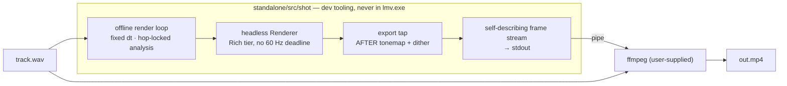

# 0101 — The engine renders a music video

> **Status:** approved
> **Created:** 2026-08-16
> **Approved:** 2026-08-16 (user)
> **Owner skill(s):** dev, human
> **Related ADRs:** [0114](../adrs/0114-the-engine-renders-video-offline-and-delegates-encoding.md) (the engine renders video offline and delegates encoding)
> **Hard dependency:** [0099](0099-the-horizon-reaches-its-own-length.md) — the long-run render path currently dies at ~3,601 frames, and a four-minute video is 14,400.

## TL;DR

`shot` gains an offline render mode that walks a WAV clip at a fixed frame step and streams frames
over a pipe to the user's own `ffmpeg`. No encoder ships. The property that makes this worth doing
— and that no live visualizer has — is that the render is **deterministic and decoupled from real
time**: it cannot drop a frame, it is not capped by the display, and two runs produce the same
bytes. The first phase is the whole feature at 1080p; the rest is colour correctness, long-render
viability, and a human verdict on an actual video.

## Context & problem

Every product in this space that charges money sells a file: Specterr, SYQEL and ProVisHD render
a music video from a track. Every live visualizer — projectM, MilkDrop, Plane9 — does not, because
its render loop is welded to a real-time audio device, so "export" means screen-capturing the
window and keeping whatever the machine managed.

**This engine is already decoupled**, and three shipped decisions are why: `dt` is injected by the
caller ([ADR-0013](../adrs/0013-c-abi-v4-render-dt.md)); DSP is a pure function of its input window
with no clock read ([NFR §6](../nfr.md#6-determinism)); visual randomness is explicitly seeded and
every capture path forces the declared number
([ADR-0051](../adrs/0051-seeded-grammar-randomness-with-per-run-opt-in.md)). `shot` already drives
a headless renderer over a WAV clip on every push. The only missing piece is turning a frame
sequence into a file — and the arithmetic says that piece must be a pipe: a 1080p RGBA frame is
**8.29 MB**, sixty a second is **498 MB/s**, and four minutes is **119 GB** if the frames touch
disk before the encoder.

The repository also has a smaller, embarrassing version of the same gap. Every picture in it is a
**still**, because there has never been a way to record a moving one — which is exactly what
[Plan 0103](0103-the-project-gets-an-audience.md) needs and cannot make.

## Decision

Per [ADR-0114](../adrs/0114-the-engine-renders-video-offline-and-delegates-encoding.md): render
offline, stream over a pipe, ship no encoder. A self-describing stream format carries its own
dimensions, rate and colour range so a mistyped geometry cannot silently produce garbage; a
convenience flag spawns a user-supplied `ffmpeg` and wires the pipe. We rejected **bundling a
static encoder** (larger than the whole application's ~10 MB soft cap), a **pure-Rust encoder**
(the mature ones bind to the libraries we just refused to bundle), a **frame sequence on disk**
(tens of gigabytes per track), and **screen capture** (which throws away the determinism that is
the entire advantage).

## Architecture diagram

## Implementation phases

### Phase 1 — the render loop, end to end

- **Owner skill:** dev
- **What:** `shot --render <clip.wav> --fps <n>` walks the clip, advancing the analyzer hop by hop
  and the renderer by a fixed injected `dt`, and writes a self-describing frame stream to stdout.
- **Files touched:** `standalone/src/shot/render.rs` (new), `standalone/src/shot/args.rs`,
  `standalone/src/shot/mod.rs`, `docs/capturing.md`.
- **Notes for the implementer:** the analysis hop cadence and the frame cadence are **different
  clocks** and must not be conflated — `HOP_SIZE` at the clip's sample rate sets one, `--fps` sets
  the other, and the loop advances whichever is due next. `film.rs` already owns the
  hops-per-clip arithmetic; use it rather than writing a second copy, which is the mistake that
  file's own header warns about.
- **Done when:** `shot --render` over a fixture clip produces a stream whose **two runs are
  byte-identical**, and whose frame count equals `ceil(clip_seconds × fps)`. Determinism is the
  property this whole plan rests on, so it is asserted here and not left to inference.

### Phase 2 — one command produces a file

- **Owner skill:** dev
- **What:** `--ffmpeg <path>` spawns the encoder, wires the pipe, and passes the source WAV through
  for muxing. Its absence is a named error naming the flag, never a silent fallback.
- **Files touched:** `standalone/src/shot/render.rs`, `docs/capturing.md`.
- **Notes for the implementer:** handle encoder backpressure and a non-zero encoder exit. A broken
  pipe must report *the encoder's* failure, not a generic write error — this is the first path in
  the repo with a child process, and a mystery `EPIPE` is the obvious way it goes wrong.
- **Done when:** one command over a WAV produces a playable MP4 with audio, and killing the
  encoder mid-render makes `shot` exit non-zero with the encoder's own message.

### Phase 3 — the file matches the app

- **Owner skill:** dev
- **What:** Put the export tap in the right place and declare colour correctly.
- **Files touched:** `standalone/src/shot/render.rs`, `core/src/render/` (tap point only).
- **Notes for the implementer:** the composite is linear-light `Rgba16Float` until the tonemap
  ([ADR-0046](../adrs/0046-linear-light-hdr-composite-bloom-tonemap.md)) and the display write
  dithers in the **encoded** domain ([ADR-0096](../adrs/0096-the-display-write-dithers.md)). The tap
  sits after **both**, or the file is washed out relative to the app in a way that reads as an
  engine bug.
- **Done when:** for the same preset, clip and frame index, a frame pulled from `--render` is
  **byte-identical** to the frame `shot --frame-at` writes as a PNG. That is an exact property, it
  needs no tolerance, and it is only true if the tap is in the right place and the stream declares
  full-range sRGB correctly.

### Phase 4 — it survives a whole track

- **Owner skill:** dev
- **What:** Make a 14,400-frame render complete.
- **Files touched:** `standalone/src/shot/render.rs`, and whatever
  [Plan 0099](0099-the-horizon-reaches-its-own-length.md) found.
- **Notes for the implementer:** **this phase is why 0099 is a hard dependency.** `shot --horizon`
  dies at ~3,601 frames at ~2.9 GB resident (design-backlog 0093); four minutes at 60 fps is
  14,400 — four times past a wall that already exists on a sibling path. If 0099 has not landed,
  stop here and say so rather than working around it in a second place.
- **Done when:** a four-minute clip renders to completion at 1080p/60 with resident memory **flat
  across the run** — the same no-session-growth requirement [NFR §12](../nfr.md#12-runtime-memory)
  makes of a live session, measured the same way, because a render that leaks is the identical
  defect with a different symptom.

### Phase 5 — is it actually a music video

- **Owner skill:** human
- **What:** Render a real track with a real preset and watch it.
- **Done when:** the user says whether the output is something they would publish. Two specific
  questions ride it: does an offline `Rich`-tier render at full cost look **better** than the live
  app on the same machine, and does the visual land on the beat when nothing is racing a display.

## Risks & open questions

- **Blocked by [0099](0099-the-horizon-reaches-its-own-length.md).** Phases 1–3 are takeable
  immediately at short clip lengths; Phase 4 is not takeable at all until that repair lands.
- **Colour is the most likely silent failure.** A file that is subtly darker than the app passes
  every automated check that does not compare against the app. Phase 3's byte-identity assertion is
  the guard, and it is deliberately exact rather than tolerant.
- **`ffmpeg` invocation is a support surface.** The documented command will be wrong on somebody's
  build. Keep exactly one canonical invocation in `docs/capturing.md` and make `--ffmpeg` generate
  it, so there is one thing to fix rather than a wiki of incantations.
- **Nothing validates the MP4.** We test the frames and the stream; whether the encoder made a good
  file is outside the harness, and that is accepted.
- **Contention:** touches `standalone/src/shot/` and one tap point in `core/src/render/`. Nothing
  on the current roster is in `shot/` except 0099, which is the dependency — so run them in
  sequence in the same lane rather than in parallel.

## What this plan does NOT do

- **No encoder ships**, and no in-app "Export" button exists. This is `shot`, i.e. dev and creator
  tooling, and `lmv.exe` does not change size.
- **No real-time capture.** This path never touches loopback; it reads a file.
- **No timeline, no cuts, no preset automation across a track.** One preset per render. A director
  track is a future plan, and `core/src/director/` already exists as the place it would live.
- **No validation of the produced container.**

## Followups (after this lands)

- A preset **arc** across a render — the engine has a `director` module and a novelty signal, and
  an authored per-track sequence is the natural next thing to want once one video exists.
- Use this to produce the repository's demo material for
  [Plan 0103](0103-the-project-gets-an-audience.md), which currently has no way to record motion.
