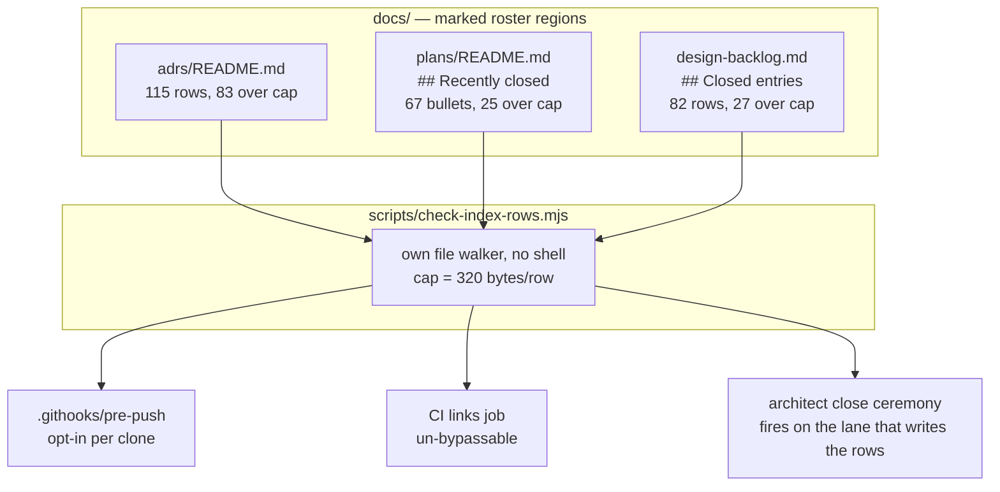

# 0105 — The indexes go back to being indexes

> **Status:** approved
> **Created:** 2026-08-16
> **Approved:** 2026-08-16 (user)
> **Owner skill(s):** dev
> **Related ADRs:** [0116](../adrs/0116-an-index-row-is-a-pointer-and-a-gate-holds-it-to-one.md)

## TL;DR

Three roster files have grown rows that summarize the documents they point at:
`docs/adrs/README.md` is **188,820 bytes** — 16 % of the ADR corpus it indexes — and grew 41,705 of
those bytes in three days. This plan builds a byte-cap gate first so it prints the exact work list,
trims **135 over-cap rows** across the three files back to pointers, wires the gate into the three
places `check-doc-links.mjs` already runs, and closes the loop by fixing the close ceremony that
writes the fat rows in the first place.

## Context & problem

The user asked for `docs/adrs/README.md` to be trimmed or archived. Measuring it redirected the
request twice.

**Archiving by age saves nothing.** Row width grows monotonically with ADR number — 152 bytes
average for ADRs 0001-0020 against **3,302** for 0101-0115 — so ADRs 0001-0040 are only **5.7 %**
of the file. The fat is at the new end.

**And the archive remedy has already been tried here and already failed.** On 2026-08-08 Plan 0061
Phase 7b moved the plan close write-ups verbatim into `docs/plans/README-archive.md`, cutting
`docs/plans/README.md` to **20,438 bytes**. Eight days later it is **145,945** — 7.1x — with 85,892
bytes sitting under a heading that still reads *"One line per plan."* Preservation was never the
problem; nothing bounded the new rows.

[ADR-0116](../adrs/0116-an-index-row-is-a-pointer-and-a-gate-holds-it-to-one.md) records the
decision and the arithmetic behind the cap.

## Decision

Cut every roster row to link + title + status, and enforce it with `scripts/check-index-rows.mjs`
asserting a **320-byte cap** inside explicitly marked regions. We rejected archiving by age (the
5.7 % arithmetic), a `digest.md` companion (a third copy of prose that already exists in the ADR
bodies), a prose-only rule (Plan 0061 Phase 7b is the worked counter-example), and a whole-file cap
(it convicts the project for having many ADRs rather than fat rows).

**The gate is built first and wired last.** Built first because it prints the work list the trim
phases consume and proves it can convict before anything is deleted; wired last because a gate
turned on at Phase 1 would block the push of every intermediate phase.

## Architecture diagram



## Implementation phases

### Phase 1 — The gate, red on the current tree

- **Owner skill:** dev
- **What:** `scripts/check-index-rows.mjs` — a byte-cap checker over explicitly marked roster
  regions, following `check-doc-links.mjs`'s conventions (own file walker, **never a shell**, so no
  markdown file becomes something CI executes).
- **Files touched:** `scripts/check-index-rows.mjs` (new); region markers added to
  `docs/adrs/README.md`, `docs/plans/README.md`, `docs/design-backlog.md`.
- **Done when:** Run against the current tree it exits non-zero and names **135 over-cap rows —
  83 in the ADR roster, 25 in the plans `## Recently closed` section, 27 in the backlog
  `## Closed entries` ledger** — each as `file:line`, the measured byte count, and the cap.
  Run against a fixture whose rows are all under cap it exits 0. A row outside any marked region
  is not measured, and the script reports the region count it found per file so a missing marker
  shows up as a region that vanished rather than as silence.
  **This phase adds the markers but trims nothing** — red here is the expected result and the
  work list for Phases 2-4.

### Phase 2 — Trim the ADR roster

- **Owner skill:** dev
- **What:** Reduce all 115 rows to `| [NNNN](file.md) | <title> | <status> |`, deleting the
  abstracts.
- **Files touched:** `docs/adrs/README.md`; possibly individual `docs/adrs/NNNN-*.md` (see below).
- **Done when:**
  - Every row in the marked region is under the cap and `node scripts/check-index-rows.mjs` reports
    zero violations for this file.
  - **The title comes from the ADR body's `H1`**, which is authoritative where the index's bolded
    lead disagrees with it.
  - **The forward-reference graph survives.** It exists nowhere else, so before and after the trim,
    `awk -F'|' 'NR>=14 {print $4}' docs/adrs/README.md | grep -ciE "supersed|extend|supplement|revis"`
    returns the same count, and the ADR numbers named in those cells are unchanged.
  - **No claim is deleted that lives only in the index.** For each row whose abstract is removed,
    the linked ADR body carries the same claims; anything found only in the index is appended to
    that ADR as a dated `## Outcome` section on the ADR-0054 / ADR-0074 precedent, never written
    into the ADR's existing prose.
  - `node scripts/check-doc-links.mjs` still exits 0 — the trim removes many links, and a removed
    link is fine while a mangled one is not.

### Phase 3 — Trim the plans `## Recently closed` section

- **Owner skill:** dev
- **What:** Return the 67 bullets to the one line per plan the section heading already promises,
  moving any write-up detail not already in `README-archive.md` into it.
- **Files touched:** `docs/plans/README.md`, `docs/plans/README-archive.md`.
- **Done when:** All 25 over-cap bullets are under the cap and the gate reports zero violations for
  this file. Each bullet keeps its link, its close date, and its review verdict. **Nothing is
  deleted** — any detail removed from a bullet exists in `README-archive.md` first, which is the
  rule Plan 0061 Phase 7b established and this phase re-applies rather than invents. The other
  sections (`Active roster`, `Recommended execution sequence`, `Standing`, `Roadmap`) are prose,
  are not inside a marked region, and are untouched.

### Phase 4 — Trim the backlog closed-entry ledger

- **Owner skill:** dev
- **What:** Return the 82 ledger rows to `| NNNN | <one-line what> | <where it went> |`.
- **Files touched:** `docs/design-backlog.md`, `docs/design-backlog-archive.md`.
- **Done when:** All 27 over-cap rows are under the cap and the gate reports zero violations for
  this file. **Live entry bodies are not touched** — only the `## Closed entries` ledger is inside
  the marked region. Any detail removed from a ledger row is already present in the archived body
  it points at; the archive is append-only, so this phase adds nothing to it and only verifies.
  `node scripts/check-backlog-claims.mjs` still exits 0, since the live entries and their probes
  are out of scope for this phase.

### Phase 5 — Wire the gate into all three call sites

- **Owner skill:** dev
- **What:** Add `check-index-rows.mjs` beside `check-doc-links.mjs` in the pre-push hook and the CI
  `links` job.
- **Files touched:** `.githooks/pre-push`, `.github/workflows/ci.yml`.
- **Done when:** `node scripts/check-index-rows.mjs` runs as a step in `.githooks/pre-push` (after
  the link check, before `fmt`) and in the CI `links` job, and **the full tree is green** — this is
  the first phase at which the gate passes, and it passes because Phases 2-4 did the work rather
  than because the cap was loosened. If the cap has to move, it moves with new arithmetic recorded
  in the ADR, not silently here.

### Phase 6 — Stop the close ceremony from writing fat rows

- **Owner skill:** dev
- **What:** Update the architect skill so the ceremony that produces these rows produces thin ones,
  and runs the new gate.
- **Files touched:** `.claude/skills/architect/SKILL.md`.
- **Done when:** The close-ceremony bookkeeping states the one-pointer row shape and the 320-byte
  cap at each of the three places it currently says to refresh a roster (step 2 for
  `docs/adrs/README.md`, step 3 for `docs/plans/README.md`, step 3c for the backlog ledger), and
  `node scripts/check-index-rows.mjs` is listed beside the existing `check-doc-links.mjs` and
  `check-backlog-claims.mjs` invocations. `node scripts/check-doc-links.mjs` exits 0, which covers
  `.claude/skills/**` as well as `docs/`.

## Data shapes

The marked region, illustrative — one mechanism across three different row syntaxes, because the
region rather than the markdown is the unit:

```markdown
<!-- roster:begin cap=320 -->
| ADR  | Title                                    | Status   |
|------|------------------------------------------|----------|
| [0001](0001-rust-core-wgpu-cabi-foobar-shim.md) | Rust core, wgpu rendering, C ABI with a C++ foobar shim | accepted |
<!-- roster:end -->
```

Measured target widths, from the real filenames and `H1` titles (construction arithmetic — no
trimmed file exists yet):

| Roster | median | max | worst case | cap headroom |
|--------|--------|-----|------------|--------------|
| ADR rows | 152 | 219 | 269 (with forward-refs) | 51 |
| Closed-plan bullets | 183 | 234 | 234 | 86 |
| Ledger rows | 218 | — | ~280 | 40 |

## Risks & open questions

- **The index title and the body `H1` may disagree** on some ADRs, and the fat cells make the
  index's own title hard to extract mechanically. Resolved by rule rather than by inspection: the
  body `H1` wins. If that produces a title that does not describe the decision, that is an ADR
  body problem and is out of scope here.
- **The 320-byte cap has 40-86 bytes of headroom**, which is thin. The first row to hit it will be
  a long slug plus a forward-reference. The honest response is new arithmetic in the ADR, not a
  quietly raised constant or a row nudged outside the markers.
- **A row moved outside a marked region escapes the gate silently.** Phase 1 mitigates by reporting
  the per-file region count, so a deleted marker is visible; a row relocated past a marker is not,
  and nothing here catches it.
- **The deletion is the irreversible half.** The verification that every abstract is a duplicate was
  done at the level of "the body has an `## Outcome` section" for all 22 fat status cells, not
  claim-by-claim across all 83 rows. Phase 2's done-when carries that claim-level check precisely
  because the sampling has not proved it.
- **Phases 2-4 are 135 rows of editing** and the gate only checks size. A row can shrink to a
  correct byte count and a useless pointer, and no gate in this plan would notice.

## What this plan does NOT do

- **It does not touch live entry bodies in `docs/design-backlog.md`.** That file is the architect's
  inbox; its entry bodies are content with no second copy. Only the closed-entry ledger is a roster.
- **It does not trim the other sections of `docs/plans/README.md`** — `Recommended execution
  sequence` (20 KB) and `Standing` (10.5 KB) are prose at ~192 bytes per line, which is not this
  defect. Whether that file wants a separate prose diet is a later question.
- **It does not touch `README-archive.md` or `design-backlog-archive.md`** beyond verifying that
  what leaves a row is already in them. Both are already off the hot read path.
- **It does not check whether any ADR is correct**, only whether its index row is a pointer.
- **It does not add a quality check on titles.** ADR-0116 records that as a known gap.

## Followups (after this lands)

- Decide whether `docs/plans/README.md`'s `Recommended execution sequence` and `Standing` sections
  want their own diet — they are prose, so a row cap is the wrong instrument.
- Consider whether the plans index and the ADR index should carry a generated-from-bodies section
  at all, once the forward-reference graph is the only hand-maintained part left.
