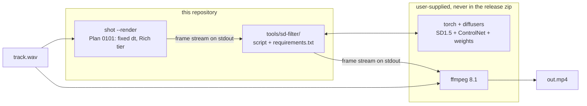

# 0106 — The frame stream passes through a diffusion model

> **Status:** draft
> **Created:** 2026-08-16
> **Owner skill(s):** dev, human
> **Related ADRs:** none yet — **one is owed and deliberately deferred**, see Phase 2
> **Hard dependency:** [0101](done/0101-the-engine-renders-a-music-video.md) Phases 1–2, for every
> phase except the spike. *(The transitive dependency on
> [0099](done/0099-the-horizon-reaches-its-own-length.md) for renders past ~2 minutes is
> **discharged** — it closed 2026-08-16 and the long-run path now completes.)*

## TL;DR

The offline render stream gains an optional **stdin→stdout diffusion filter**: attractors and
mandalas go in, and an img2img pass with ControlNet holding their geometry turns them into
material — a canyon, a cathedral rose window, a creature — while the shape keeps tracking the
music. The filter is a **Python script in `tools/`**, not a bundled runtime, so `lmv.exe` and the
release zip do not change at all. **Phase 1 is a throwaway spike and Phase 2 is a stop condition**:
nobody has yet seen what this engine's output looks like through a diffusion pass, and if it boils,
the plan ends there having cost an afternoon.

## Context & problem

The user asked for TouchDesigner-plus-TouchDiffusion: take this engine's abstract output and let a
diffusion model reimagine it. The architecture turned out to be nearly free, because
[Plan 0101](done/0101-the-engine-renders-a-music-video.md) /
[ADR-0114](../adrs/0114-the-engine-renders-video-offline-and-delegates-encoding.md) already build
the pipe it needs: `shot --render clip.wav` walks a WAV at fixed injected `dt` and streams
self-describing frames to stdout for the user's own `ffmpeg`. **A diffusion stage is a filter
dropped in the middle of an existing pipe, and costs zero new Rust.**

So the architecture is not the risk. The picture is. Frame-independent img2img on moving abstract
content is notorious for **boiling** — a seething per-frame reinterpretation that reads as noise
rather than as a scene — and no amount of design removes that uncertainty. Two further unknowns
ride with it, and both are specific to this content rather than general:

- **An attractor is not a photograph.** It is thin bright filaments on dark ground. Canny edge
  detection on a filament produces a *double* edge, one line per side, so the model is conditioned
  on tubes where the render drew strands.
- **A mandala is radially symmetric, and diffusion is famously bad at preserving symmetry.**
  `star_rosewindow` either survives that or it does not, and the answer is not predictable from
  first principles.

The environment is measured rather than assumed (dev box, 2026-08-16): **RTX 3080 Laptop, 8 GB
VRAM**, driver 581.42, **Python 3.9.13**, **`ffmpeg` 8.1** already installed. That is comfortably
enough for SD1.5-class inference with ControlNet at fp16 (roughly 4–5 GB) and too tight for SDXL
plus ControlNet (roughly 7.5 GB) without offloading that would cost throughput over a
thousand-frame loop.

## Decision

The diffusion stage is an **out-of-process stdio filter** speaking Plan 0101's own frame format.
The repository ships a **script and a `requirements.txt`; no model, no weights, and no Python
runtime**, so [NFR §4](../nfr.md#4-size-and-dependencies)'s ~10 MB soft cap is untouched and the
release artifact does not change. The AI stage **reimagines** rather than restyles — high denoise
with ControlNet holding the geometry — and **no audio data crosses the seam**: the image is the
whole signal.

We rejected **in-process Rust inference** (immature wgpu-native diffusion, no TensorRT path, and a
very large dependency against "lightweight is a feature"); **`shot` spawning and owning the
sidecar** (a three-process chain gives a broken pipe three candidate culprits, for ergonomics that
are one flag and a spawn to add later — it is a followup, not a rewrite); **the diffused frame
re-entering the renderer as a sampled texture** (genuinely the most interesting version, and it
needs a new `core` capability and its own ADR — it is the headline followup); and **publishing
frames to TouchDesigner over Spout** (gives away ownership of the loop, which the user explicitly
did not want).

## Architecture diagram



**`core/` does not appear in that diagram, and that is the point.** Nothing in this plan touches
the core, the C ABI, or `lmv.exe`.

## Implementation phases

### Phase 1 — the spike renders

- **Owner skill:** dev
- **What:** Produce the artifacts Phase 2 judges: a stills sweep and two or three short motion
  clips of a diffused attractor and a diffused mandala.
- **Files touched:** **none in the repository.** Everything lives under an untracked `spike/`.
  Note the `block-broad-git-add` hook will refuse a broad stage; do not add `spike/` to git.
- **Notes for the implementer:**

  **Frames come from tooling that already exists.** Plan 0101 is not built, so there is no stream
  yet — but `shot --frame-at <hop>` already writes one full-size frame under real audio *after the
  tonemap*, which is exactly one frame of what 0101 will stream. Loop it:

  ```powershell
  cargo run -p standalone --release --example shot -- `
    --preset-file presets/attractor_leviathan.toml --signal dynamic:110 `
    --frame-at $hop --size 768x768 --tier rich --out ("spike/frames/f{0:d4}.png" -f $i)
  ```

  Sixty frames at every third hop. The arithmetic: a hop is 512 samples at 48 kHz = 10.667 ms, so
  93.75 hops/s, so every third hop is **31.25 fps** and sixty frames is **1.92 s** — ample to see
  boiling. That quantization is precisely what 0101 Phase 1 removes; its note about the analysis
  hop and the frame rate being different clocks is this. `--signal dynamic:110` needs no asset and
  is the only synthesized kind with real dynamics. `--release` is not optional: this launches sixty
  processes and the cost is dominated by startup and shader compilation, not rendering — **expect
  10–15 minutes**, all of it an artifact of 0101 not existing yet.

  **Three subjects, because they fail differently:** `attractor_leviathan` (dense filaments, the
  hard ControlNet case), `star_rosewindow` (the radial-symmetry question), `attractor_ink`
  (black-on-white, inverted tonality, the easy control).

  **Models — SD1.5 class, not SDXL**, per the VRAM arithmetic above. `Lykon/dreamshaper-8` as the
  base: for reimagining into a scene a finetune is markedly better than stock SD1.5, which is the
  wrong default here. `lllyasviel/control_v11p_sd15_canny` to start, with `..._softedge` /
  `..._lineart` as the expected fallback for the double-edge problem named in Context.
  `StableDiffusionControlNetImg2ImgPipeline` is img2img and ControlNet in one call.

  **The coherence recipe is the design content of this phase.** Four lines, all load-bearing:

  ```python
  # illustrative — the algorithm, not the script
  for i, render in enumerate(frames):
      control = canny(render)                                            # STRUCTURE: this frame
      base    = render if i == 0 else lerp(render, prev_out, FEEDBACK)   # APPEARANCE: carried
      out     = pipe(prompt=PROMPT, image=base, control_image=control,
                     strength=STRENGTH, controlnet_conditioning_scale=CN,
                     num_inference_steps=STEPS,
                     generator=torch.Generator("cuda").manual_seed(SEED)).images[0]
      prev_out = out
  ```

  The control image comes from **this frame's render** and the img2img base carries the
  **previous output** — that split is the whole trick: geometry tracks the music frame by frame,
  material persists across frames. Taking the control from the previous output instead lets the
  shape drift off the audio. `SEED` is fixed for the entire render; a per-frame seed guarantees
  boiling whatever else is tuned.

  **Two passes, not twelve clips.** Stills cannot answer the boiling question and motion is too
  slow to sweep. Pass 1 (~1 minute): one mid-clip frame across `strength ∈ {0.45, 0.60, 0.75}` ×
  `cn_scale ∈ {0.6, 1.0}` × `control ∈ {canny, softedge}`, as one contact sheet. Pass 2
  (~5 minutes): all sixty frames through the two or three surviving cells, plus `FEEDBACK` at 0.0
  against 0.4 for the best one, assembled with `ffmpeg -r 31.25`.

  **Traps, each of which reads as "the model is bad" and is not:** in img2img the actual steps run
  are `steps × strength`, so `steps=4, strength=0.5` gives **two** steps and mud — use `steps=8`
  under LCM or `steps=20` without it. SD1.5 at 768² can duplicate or mirror content, which is its
  native-resolution artifact; drop to 512² rather than changing pipeline. Do not
  `enable_model_cpu_offload()` at 8 GB with SD1.5 — correct output, ruinous throughput over a
  thousand frames.

- **Done when:** a contact sheet and at least two motion clips exist, together with four measured
  numbers: **seconds per frame** at the chosen cell, **peak VRAM** during the run, the cell itself
  (strength, `cn_scale`, feedback, control type, prompt, steps, base model), and whether the
  radial symmetry of `star_rosewindow` survived. The timing figures quoted during the interview —
  roughly 0.1 s/frame for SD-Turbo at 512², 0.3 s/frame for SD1.5+LCM at 768² — are **rough
  estimates and unverified**; this phase replaces them with measurements, and every later phase's
  arithmetic is built on what it measures.

### Phase 2 — the look gate (STOP CONDITION)

- **Owner skill:** human
- **What:** Watch the clips and decide whether this is worth building.
- **Done when:** the user answers three questions. **Does it boil** — usable, usable only with
  feedback, or unusable? **Does the music still read** — after diffusion, does the visual still
  land on the beat, or has the AI stage flattened the dynamics into uniform busyness? And **is
  this something they would publish**?

  **If the answer to the first is "unusable" across every cell, the plan ends here** with a
  written diagnosis and nothing built. That is a good outcome for one afternoon, and it is the
  reason the spike precedes the architecture rather than sitting inside it.

  The second question is the one that is easy to forget and is the whole point of the application.
  A "no" there does not kill the plan; it **reopens the no-audio-conditioning decision**, and the
  repair would be denoise strength driven by the onset envelope — a protocol change carrying real
  data across the seam, not a tuning change. Phases 3–5 would need re-scoping before they start.

  **The ADR is written between this phase and the next**, by the architect, in a fresh session.
  The rejected alternatives are already enumerated in this plan's Decision; what they are missing
  is the evidence this phase produces, and an ADR written before it would be recording a guess as
  a decision.

### Phase 3 — the pass-through stub

- **Owner skill:** dev
- **What:** `tools/sd-filter/` reads Plan 0101's frame stream on stdin and writes it unchanged to
  stdout, with **no model involved**.
- **Files touched:** `tools/sd-filter/` (new), `docs/capturing.md`.
- **Notes for the implementer:** **read 0101 Phase 1's stream-format note first.** It records a
  measurement against `ffmpeg` 8.1 that decides this phase's difficulty: the Y4M muxer accepts
  `yuv444p, yuv422p, yuv420p, yuv411p, gray8` and **errors on `rgb24`**, so a Y4M stream costs
  this filter a YUV round-trip, while NUT with `rawvideo` carries `rgb24` unconverted. Whichever
  0101 chose, this filter speaks it and does not invent a second format.
- **Done when:** `shot --render | sd-filter | <sink>` produces bytes **identical** to
  `shot --render | <sink>`. That is an exact property needing no tolerance, it proves the whole
  plumbing with no GPU and no weights, and it is **the one part of this feature that can be a real
  CI gate** — everything downstream of it is a model whose output is not reproducible across
  machines.

### Phase 4 — the filter does the work

- **Owner skill:** dev
- **What:** The stub grows the Phase 1 recipe at the Phase 2 cell, with strength, ControlNet
  weight, feedback blend, prompt, seed and control type as command-line configuration.
- **Files touched:** `tools/sd-filter/`, `docs/capturing.md`.
- **Notes for the implementer:** the model loads **once**, before the first frame, and the
  previous output is held across frames — this is a stateful stream filter, not a
  request/response service, and reloading per frame would dominate the runtime completely. Report
  progress on **stderr**, never stdout, which carries frames.
- **Done when:** a sixty-frame clip through the real pipe reproduces the Phase 1 result at the
  same cell, and two runs on this machine with the same seed and arguments produce the same
  bytes. **Same-machine only**, and the done-when says so on purpose: fp16 reduction order and
  cuDNN autotuning make cross-machine equality false, so per
  [ADR-0071](../adrs/0071-a-numeric-test-contract-states-a-property-or-names-its-machine.md) this is a
  measurement that names its configuration rather than a property.

### Phase 5 — one command, and the documentation

- **Owner skill:** dev
- **What:** One canonical invocation end to end, and the setup written down.
- **Files touched:** `docs/capturing.md`, `tools/sd-filter/README.md`, `README.md`.
- **Notes for the implementer:** keep **exactly one** canonical command in `docs/capturing.md`, so
  there is one thing to fix rather than a wiki of incantations — the same posture 0101 Phase 2
  takes with `--ffmpeg`. State the prerequisites honestly: a CUDA GPU, a Python environment, and a
  first-run weight download of several gigabytes from Hugging Face.
- **Done when:** a reader who has never run this can go from a clean checkout to an MP4 by
  following `docs/capturing.md`, and the page states plainly that nothing here ships in the
  release zip.

### Phase 6 — a real track

- **Owner skill:** human
- **What:** Render a full track with the chosen preset and cell, and watch it.
- **Done when:** the user says whether it is publishable. *(This done-when carried a two-minute
  ceiling — `shot --horizon` dying at ~3,601 frames — which **is gone**:
  [Plan 0099](done/0099-the-horizon-reaches-its-own-length.md) closed 2026-08-16, the wall was
  memory pressure from a capture path that never polled rather than a frame count, and the fix is
  one `poll` in `step_offscreen`. Track length is no longer a bound. **The one thing to carry
  forward:** a render mode that submits its own passes outside `step_offscreen` inherits the defect
  and none of the fix.)*

## Data shapes

The filter's contract with the pipe — illustrative, and deliberately minimal:

```
stdin   <- Plan 0101's frame stream (format fixed by 0101 Phase 1)
stdout  -> the same stream format, same geometry, same frame count
stderr  -> progress and diagnostics ONLY

--prompt <str>  --negative <str>  --strength <f>  --cn-scale <f>
--feedback <f>  --seed <int>      --steps <int>   --control canny|softedge|lineart
--model <hf-id> --controlnet <hf-id>
```

Frame count in equals frame count out, always. A filter that drops or duplicates a frame
desynchronizes the audio mux downstream, and that failure is silent in the file.

## Risks & open questions

- **The whole plan is gated on Phase 2, by construction.** This is the intended shape, not a
  weakness — but it does mean Phases 3–6 should not be estimated or scheduled until Phase 1 has
  run.
- **An ADR is owed and does not exist.** Deferred deliberately to after Phase 2 (see that phase).
  If Phases 3+ begin without it, that is a Mode 4 blocker.
- **Blocked on [0101](done/0101-the-engine-renders-a-music-video.md) Phases 1–2** for everything except
  the spike. The transitive block on [0099](done/0099-the-horizon-reaches-its-own-length.md) past
  ~2 minutes is **discharged** (closed 2026-08-16). Phase 1 is takeable **today** and depends on
  neither.
- **The stream format is not settled yet**, and it changes Phase 3's cost. 0101 Phase 1 owns that
  choice and now records the measurement behind it.
- **Weights are a multi-gigabyte first-run download from a third party.** Hugging Face model IDs
  can move or be withdrawn — `runwayml/stable-diffusion-v1-5` already did. Pin what works and
  expect to re-pin.
- **Nothing here is reproducible across machines**, so nothing here can be a golden baseline. A
  diffused frame must never enter `core/tests/golden/`; Phase 3's stub is the only gateable part.
- **Python 3.9.13 is at the floor** of what current `torch`/`diffusers` target. If resolution goes
  badly, a 3.11 virtual environment is the fix rather than pinning old wheels.
- **Contention:** none. This plan touches `tools/` and `docs/` only, and no other roster entry is
  in either. It reads 0101's output but does not edit `standalone/src/shot/`.

## What this plan does NOT do

- **Nothing ships.** No model, no weights, no Python runtime in the release zip; `lmv.exe` and
  `foo_lmv.dll` do not change size, and there is no in-app Export button.
- **No `core/` change and no C ABI change.** The core never learns that a diffusion model exists.
- **No audio conditioning.** The image is the whole signal. Phase 2's second question is the
  measurement that would reopen this, not a hedge against it.
- **No real-time or live path.** This is offline creator tooling. Near-real-time preview at 512²
  looks reachable on this hardware and is a followup, not a scope.
- **No `shot`-owned child process.** The filter is a pipe stage the user composes; promoting it to
  a `--diffuse` flag is a followup and is one flag plus a spawn, not a rewrite.
- **No timeline, cuts, or prompt automation across a track.** One prompt per render, matching
  0101's one preset per render.

## Followups (after this lands)

- **The diffused frame re-enters the renderer** as a texture the scene samples — the attractor
  drawing over its own hallucinated past, inside the engine. The genuinely novel version, needing
  a new `core` capability and its own ADR.
- **`shot --diffuse <filter>`** — 0101's `--ffmpeg` ergonomics applied to this stage, once the
  pipeline has proved itself.
- **Near-real-time preview.** If Phase 1 measures ~0.1 s/frame at 512², a live-ish preview window
  is within reach and would change what this feature is.
- **Audio-conditioned diffusion** — denoise from the onset envelope, prompt blend on bar
  boundaries — if Phase 2 finds the dynamics flattened, or simply as the next thing to want.
- **Demo material for [0103](0103-the-project-gets-an-audience.md)**, which needs moving images
  and currently has none.
