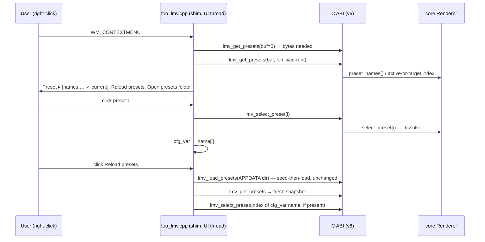

# 0107 — The foobar menu picks a preset

> **Status:** in-progress
> **Created:** 2026-08-16
> **Approved:** 2026-08-16
> **Owner skill(s):** dev, human
> **Related ADRs:** [0117](../adrs/0117-c-abi-v6-the-host-reads-the-roster-and-selects-a-preset.md) (C ABI v6), [0006](../adrs/0006-c-abi-v2-preset-loading.md) (the folder + seed-then-load this builds on)

## TL;DR

The foobar component's right-click menu gains a **Preset** submenu listing every loaded preset
with a checkmark on the current one, a **Reload presets** item that picks up files dropped into
the shared preset folder without restarting foobar, and an **Open presets folder** item that
makes the folder discoverable at all. The chosen preset persists across foobar restarts by name.
The one engine change is ABI v6 (ADR-0117): two functions — a roster snapshot and a
select-by-index — wrapping core capability the standalone's browse overlay has had since Plan
0008. Presets already ship as files: the plugin seeds the embedded set into
`%APPDATA%\light-music-visualizer\presets` (write-if-absent, shared with the standalone) and
loads whatever it finds. This plan makes that folder *usable* from inside foobar.

## Context & problem

The user's request: ship presets as files, load new presets by dropping a file in a folder, and
choose a preset from the component's right-click menu. The first two half-exist — ADR-0006's
`lmv_load_presets` seeds and loads the shared APPDATA directory, and the shim calls it at handle
creation — but three gaps make the capability invisible to a foobar user:

1. **A dropped file needs a restart.** The shim loads presets only at handle creation and on a
   stream-format change; nothing re-scans on demand.
2. **Selection is cycle-only.** ADR-0006 explicitly deferred pick-by-name over the ABI; the
   context menu today has exactly "Next scene" and the stats-overlay toggle. Reaching a chosen
   preset in a 39-preset library (heading to ~57 with Plan 0104) is up to N-1 dissolves.
3. **Nothing tells the user the folder exists.** The seeding is silent; discoverability is zero.

Interview decisions (all four the recommended option): keep the shared APPDATA folder (no
profile-local split), pick up dropped files via an explicit **Reload presets** menu item (no
watcher, no rescan-on-open), a **flat Preset submenu with a checkmark** (no grouping yet), and
**persist the chosen preset by name** across restarts.

## Decision

Widen the C ABI to v6 with exactly two functions (ADR-0117): `lmv_get_presets` (caller-buffer
snapshot of the roster names, NUL-separated, plus the current index; call-twice sizing) and
`lmv_select_preset` (switch by snapshot index, with the standard dissolve). Everything else is
shim-side: menu construction from the snapshot, reload via a re-call of the existing
`lmv_load_presets`, persistence via the shim's first `cfg_var` (name-based, re-resolved against a
fresh snapshot after every load). We rejected four narrow enumeration functions (surface grows to
seventeen for no consumer benefit) and select-by-name with a shim-side folder scan (the menu
would lie exactly when a user's hand-authored file is malformed) — see ADR-0117.

## Architecture diagram



## Implementation phases

### Phase 1 — ABI v6: snapshot + select
- **Owner skill:** dev
- **What:** `lmv_get_presets` and `lmv_select_preset` in `core-cabi`, `LMV_ABI_VERSION` 5 → 6,
  the header mirror, and the Rust-side FFI coverage. Core side: expose whatever thin accessor the
  wrapper needs for "current index, defined as the dissolve target while one is in flight" —
  `preset_names()` and `select_preset()` already exist.
- **Files touched:** `core-cabi/src/lib.rs`, `core-cabi/include/lmv_core.h`,
  `core/src/render/mod.rs` (accessor only, if needed), `core/tests/ffi.rs`,
  `docs/specs/0001-c-abi.md` (surface moves to v6; reconciled-through this plan).
- **Done when:** `core/tests/ffi.rs` drives create → load_presets → get_presets → select → free
  across the boundary and defends these behavioral claims: the sizing call (`buf_len = 0`)
  returns exactly the byte count a subsequent fill needs and writes nothing; the filled buffer
  contains as many NUL-terminated names as `lmv_load_presets` reported installed, in roster
  order; after `lmv_select_preset(i)` succeeds, `out_current_index` reads `i` (the dissolve
  target, per ADR-0117's convention); a negative and an out-of-range index each return
  `LMV_ERR_INVALID_ARG` and leave `out_current_index` unchanged; pre-attach `lmv_get_presets`
  returns `LMV_ERR_NO_WINDOW`. `-p lmv-core-cabi` builds clean (the crate is outside
  `default-members`; a bare `cargo build` will not compile it).

### Phase 2 — The menu: Preset submenu, Reload, Open folder
- **Owner skill:** dev
- **What:** Rework `WM_CONTEXTMENU` to build: **Preset ▸** (flat, one item per roster name in
  roster order, `MF_CHECKED` radio on the current index), **Next scene** (kept), **Reload
  presets**, **Open presets folder** (ShellExecute on the resolved APPDATA dir), and the existing
  overlay toggle. Preset command IDs take a reserved range (e.g. base 2000 + index) disjoint from
  the existing 1001/1002. Names are UTF-8 from the snapshot; convert to UTF-16 for `AppendMenuW`
  (preset names may be non-ASCII). Reload = `lmv_load_presets` re-call, then re-select the
  previously current name against a fresh snapshot if it still exists (core's `set_presets`
  keeps the *index*, not the name, so without this a reordered folder silently moves the
  selection). All of it on the foobar main thread — the menu is modal, so the snapshot an item
  click acts on cannot go stale between build and dispatch.
- **Files touched:** `plugin-foobar/foo_lmv.cpp`.
- **Done when:** in foobar2000, right-click shows the Preset submenu naming every preset the
  component loaded (not every file in the folder — a deliberately malformed `.toml` dropped in
  the directory does **not** appear); clicking a name switches with a dissolve and the checkmark
  follows; dropping a valid new `.toml` then clicking Reload presets makes it appear in the menu
  without restarting foobar, and the active preset's *name* is unchanged by the reload when its
  file still exists.

### Phase 3 — Persistence by name
- **Owner skill:** dev
- **What:** The shim's first `cfg_var` (a `cfg_string` under a new GUID): written on every
  successful selection (menu pick or Next scene), read after `load_presets_into` at handle
  creation and resolved by name against a fresh snapshot — found: select it (via
  `lmv_select_preset`); missing or empty: leave the roster's default, don't guess. The
  re-selection must run after `lmv_attach_window` (the roster installs at attach; pre-attach the
  snapshot call returns `LMV_ERR_NO_WINDOW`).
- **Files touched:** `plugin-foobar/foo_lmv.cpp`.
- **Done when:** pick a non-default preset, exit foobar2000 fully, relaunch — the same preset is
  rendering and carries the checkmark; delete that preset's file, relaunch — the component comes
  up on the roster default with no error surfaced (a stale name degrades silently, per the
  interview's name-based-persistence rationale).

### Phase 4 — Operator-doc sweep
- **Owner skill:** dev
- **What:** Every user-facing doc that describes the plugin's controls or preset delivery says
  what ships now: the right-click menu's new items, the shared folder path, and drop-a-file +
  Reload as the authoring loop on the foobar path. Known holders: `README.md` (component
  section), `plugin-foobar/README.md`, `packaging/foobar/`'s READ-ME-FIRST text, and
  `docs/presets.md` / `docs/capturing.md` only if they state the plugin cannot select (grep for
  cycle-only claims rather than assuming). Count-free phrasing throughout — no "39 presets" that
  re-drifts when Plan 0104 lands.
- **Files touched:** the docs above as the grep finds them.
- **Done when:** `node scripts/check-doc-links.mjs` exits 0 and no shipped doc still describes
  the plugin's selection as cycle-only or the preset folder as standalone-only.

### Phase 5 — On-device verification
- **Owner skill:** human
- **What:** The four-part loop in a real foobar2000 v2 install, since CI builds no C++: (1) pick
  a preset from the menu mid-playback, (2) drop a fresh `.toml` (author one or copy-rename an
  existing file with an edited name) and Reload, (3) restart foobar and confirm persistence, (4)
  confirm Open presets folder lands in the right Explorer window. Also worth one glance: menu
  behavior while foobar is in layout-edit mode, which is Plan 0103 Phase 1's territory — note
  what you see rather than fixing it here.
- **Files touched:** none.
- **Done when:** all four behave as Phases 2–3 describe on the real host, or the failures are
  written into this plan as findings.

## Data shapes

```c
// illustrative — the header mirror is authoritative once Phase 1 lands
// v6 additions (ADR-0117)
int32_t lmv_get_presets(LmvHandle *handle,
                        uint8_t  *buf,       // UTF-8, each name followed by one 0x00
                        size_t    buf_len,   // if < needed: nothing written
                        int32_t  *out_current_index); // nullable; -1 = empty roster
// returns: total bytes the full list needs (>= 0), or LMV_ERR_*
int32_t lmv_select_preset(LmvHandle *handle, int32_t index); // 0 or LMV_ERR_*
```

`out_current_index` is the dissolve's **target** while a transition is in flight — the same
"where the show is going" convention `cycle_preset`'s return value already uses — so the menu
checkmark always matches the most recent user action.

## Risks & open questions

- **File contention with Plan 0103 Phase 1** (approved), which redesigns this same
  `WM_CONTEXTMENU` handler to stop shadowing foobar's layout-edit menu (backlog 0103). Run the
  two **in sequence, either order, never in parallel lanes**. If 0103 Phase 1 lands first, the
  Preset submenu inherits the edit-mode deference for free; if this lands first, 0103's fix
  restructures a slightly bigger menu. No capability dependency either way.
- **Reload restarts the active scene's simulation state.** `set_presets` calls
  `configure_active_scene()`, so even a no-change reload re-seeds the running look — same
  property as the standalone's hot-reload. Acceptable because reload is an explicit user action;
  the plan does not try to diff-and-skip. If Phase 5 finds it jarring, that is a finding, not a
  license to add a watcher.
- **Roster identity is by name.** Two files declaring the same preset name make persist-by-name
  and reselect-after-reload ambiguous (first match wins). Not new — the roster already tolerates
  it — but worth one sentence in the Phase 4 docs.
- **Real-time safety is untouched by construction:** every new call sits on the foobar main
  thread; nothing here goes near `lmv_push_samples` or the ring. Phase 1's boundary code must
  keep the standing rules — validate at the boundary, no panic across it.
- **NFR §4 headroom is ~1.07 MB** after the v5 text feature. This plan links nothing new, so no
  re-measure is owed — but if Phase 1 somehow pulls a dependency, re-measure rather than assume
  (the spec's own instruction).

## What this plan does NOT do

- No file watcher / live hot-reload in the plugin (explicit menu item only — interview decision).
- No grouped or nested preset menu; flat list with checkmark. Regrouping at ~57 presets is a
  future UX call.
- No profile-local or portable-install preset folder; the shared APPDATA directory stays the one
  location (interview decision).
- No standalone changes — its browse overlay already selects by name.
- No fix for backlog 0102 (1x1 surface attach) or 0103 (menu shadows layout-edit) — Plan 0103
  Phase 1 owns both. This plan only touches the same handler.
- No stable preset IDs over the ABI; indices are snapshot-scoped (ADR-0117's recorded limit).
- No preset content: nothing in `presets/` changes.

## Followups (after this lands)

- (empty at draft)
