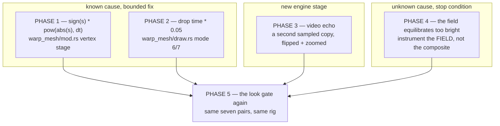

# 0109 — The MilkDrop import gets its geometry back

> **Status:** in-progress — **amended 2026-08-19: a Phase 6 was added after this plan started**,
> carrying Plan 0110's close-review major. It is **order-independent** and touches no file any
> phase below touches, so it does not disturb work in flight; take it whenever convenient.
> **Created:** 2026-08-17
> **Owner skill(s):** dev, human
> **Related ADRs:** none yet — Phase 1 writes one if the wash needs a design call
> **Closes:** design-backlog 0113, 0114, 0115, 0116

## TL;DR

[Plan 0108](done/0108-the-milkdrop-import-gets-its-tone-back.md)'s look gate answered its own
question negatively — **still merely different** — and found four defects it was never scoped to
fix, three of them mechanical and one unknown. This plan takes all four. Two are small and certain
(a clamped sign, a rogue `time` term), one is a missing engine stage, and one is a hunt with a stop
condition. The certain ones go first, because they are what make the next look gate readable.

## Context & problem

Plan 0108 shipped [ADR-0118](../adrs/0118-the-milkdrop-feedback-field-quantizes-in-the-encoded-domain.md)'s
feedback quantizer and three of four defect hunts, then put seven converted presets beside
`foo_vis_milk2` 0.2.0.0. **One pair read better; six read wrong; none of the six for the reason that
plan was built on.** The full verdict table is in that plan's own look-gate section. What it produced
was a better problem statement:

1. **A negative scale is destroyed, not applied.** `warp_mesh/mod.rs`'s mesh vertex shader converts
   MilkDrop's per-frame rates to per-second with `pow(max(v, 1e-4), dt)` for `zoom`, `sx` and `sy`.
   The `max` exists because `pow()` of a negative base is undefined — but a **negative scale is
   MilkDrop's standard mirror idiom**, so the guard replaces a mirror with a near-zero positive
   scale. *chasers 19 Portal*'s `per_pixel_3 = sx = -zm` is exactly this, and Plan 0108 Phase 5
   attributed that preset's missing fold to something else entirely.
2. **There is no video-echo stage.** MilkDrop composites a second sampled copy of the frame at
   `fVideoEchoAlpha`, zoomed by `fVideoEchoZoom` and flipped per `nVideoEchoOrientation`. `milkconv`
   already names this at conversion time as unconsumed. *Songflower (Moss Posy)* sets alpha
   **1.000** with an animated orientation, and its woven lattice **is** the echo: without it only one
   family of bars survives and the preset is unrecognisable.
3. **The mode 6/7 waveform rotates and should not.** `draw.rs` computes its angle as
   `mystery * PI + time * 0.05` — a full turn every ~126 s. Plan 0108 Phase 4 named it, left it in
   deliberately, and the look gate convicted it: the reference's *Blur Mix 3* traces stay horizontal.
4. **The wash, and it is the dominant defect.** On the five pairs with no echo the background
   equilibrates far brighter than the reference's and takes the picture with it — *Fog Tunnel*'s
   tunnel is a skeleton of rings in the reference and a solid tube here. **Cause unknown.** Two
   hypotheses died during the gate and are recorded so nobody re-runs them: the deposit is already
   `dt`-scaled (`mod.rs:1814`, plus `draw::Exposure`), so it is not a frame-rate accumulation; and
   `bAdditiveWaves` does not separate the washed presets from the clean one (*Blur Mix 3*, the good
   control, is `0`; *Contortion*, badly washed, is `1`).

## Decision

**Order the work by certainty, not by size.** Phases 1 and 2 are the two defects where the cause is
known and the fix is bounded; they land first because every later judgement is made through them —
the same reasoning that put Plan 0108's Phase 1 ahead of its re-judge, which was the one thing about
that plan's shape that worked. Phase 3 is the echo, a real new stage. Phase 4 is the wash hunt, and
it carries a **stop condition** in the shape Plan 0108 proved out.

**The wash is deliberately not first**, despite being dominant, because it is the only phase that
might not converge, and putting it first would risk the plan ending with three known fixes unbuilt.

## Architecture diagram



## Implementation phases

### Phase 1 — a negative scale mirrors instead of collapsing

- **Owner skill:** dev
- **What:** Carry the sign through the rate conversion for `zoom`, `sx` and `sy`.
- **Files touched:** `core/src/render/scenes/warp_mesh/mod.rs` (the mesh vertex stage, ~360), a
  fixture under `core/tests/fixtures/scratch-0109/`, `milkconv/tests/warp_geometry.rs`.
- **The arithmetic, so the shape is not guessed:** the conversion is `s^dt` because a scale is a
  rate. `sign(s) * pow(abs(s), dt)` preserves it for a positive `s` exactly, and for a negative one
  applies the flip every frame. **That is safe under any frame rate**: a mirror composed with itself
  is the identity, so the symmetric fixed point the preset converges to is the same at 30 Hz and at
  144 Hz, even though the intermediate frames differ. Say that in a comment — it is the non-obvious
  half.
- **Done when:**
  - A converted fixture whose per-pixel code sets `sx = -zoom` renders **bilaterally symmetric**,
    stated as the property (distance from its own horizontal mirror is a small fraction of a control
    that sets `sx = zoom`), reusing `warp_geometry.rs`'s `mirror_asymmetry` statistic rather than a
    new one.
  - A positive scale is **byte-identical** to before. Assert against a live control, not by
    argument — `sign(x) * pow(abs(x), dt)` and `pow(max(x, 1e-4), dt)` differ for `0 < x < 1e-4`,
    so this is a real claim and not a formality.
  - The golden suite is re-blessed for whatever moved, bless-to-bless (see Risks).

### Phase 2 — the mode 6/7 waveform stops rotating

- **Owner skill:** dev
- **What:** Remove `time * 0.05` from the mode 6/7 angle and add the removal to the module header's
  stated-approximations list.
- **Files touched:** `core/src/render/scenes/warp_mesh/draw.rs` (~620), `milkconv/tests/draw_layer.rs`.
- **Done when:** a test pins that a mode-6 figure's orientation is **a pure function of
  `wave_mystery`** — the same geometry at two well-separated `time` values — and the golden suite is
  re-blessed for whatever moved. The behavioural claim is the plan's, not the implementation's:
  *"a trace authored horizontal stays horizontal."*
- **Note:** this changes every mode-6 and mode-7 preset, which is why Plan 0108 refused to do it on
  suspicion. It is no longer suspicion.

### Phase 3 — the video echo

- **Owner skill:** dev
- **What:** The composite stage gains a second sampled copy of the previous frame — zoomed by
  `echo_zoom`, flipped per `echo_orient` (0 none, 1 flip x, 2 flip y, 3 both), blended at
  `echo_alpha`. All three are already per-frame outputs the runtime computes and currently drops.
- **Files touched:** `core/src/render/scenes/warp_mesh/mod.rs` (the composite), `milkconv/src/` (stop
  warning about a consumed feature), `core/src/milk/`, `presets/README.md`, `docs/presets.md`.
- **Done when:**
  - A fixture with `echo_alpha = 1`, `echo_orient = 1` renders **left-right symmetric** where the
    same fixture at `echo_alpha = 0` does not, on the `mirror_asymmetry` statistic.
  - `echo_alpha = 0` is an **exact identity** — every preset that sets no echo renders its committed
    bytes. `core/tests/golden/warp_mesh_milk.png` must not move on that ground.
  - The converter's `echo_zoom` / `echo_orient` "not consumed" warnings are gone, and nothing else
    in that warning set was silently swept up with them.
- **Reach, so the cost is known going in:** the converter's own census puts non-zero echo alpha at
  **2.4 %** of the corpus. This is a narrow feature that is load-bearing where it appears — one of
  Plan 0108's seven pairs is unrecognisable without it.

### Phase 4 — the wash

- **Owner skill:** dev
- **What:** Find why the feedback field equilibrates far brighter than the reference's, on the five
  presets with no echo.
- **Files touched:** unknown by construction; expect `warp_mesh/mod.rs`, `warp_mesh/shader.rs`,
  `milkconv/src/shader/emit.rs`, a probe under `core/tests/`.
- **Where to start, and what not to re-run.** **Instrument the field, not the composite** — every
  observation so far is of the final picture, where `gamma`, `brightness` and the present remaps all
  sit downstream and any of them could be the whole story. Read the `Rgba16Float` field's own
  equilibrium level, frame by frame, for one preset, and compare it against what the reference's
  8-bit field must hold given the same `decay` and deposit. **Two hypotheses are already dead and
  must not be re-run:** the deposit is `dt`-scaled at `mod.rs:1814` and in `draw::Exposure`, so this
  is not frame-rate accumulation; and `bAdditiveWaves` does not correlate with which presets wash
  (measured across all seven, 2026-08-17).
- **Done when:** either the equilibrium level is brought to the reference's with a named mechanism
  and a test that pins it, or **(stop condition)** the phase commits its instrumentation, records
  what the field actually does and which further hypotheses it ruled out, and the plan continues. A
  committed instrument that makes the field observable is a successful phase in that branch — the
  reason this defect survived two plans is that nobody could see it.

### Phase 5 — the look gate, third time

- **Owner skill:** human
- **What:** The same seven pairs, same rig, same three-variant preset set. Plus the two questions
  Plan 0108's gate could not reach.
- **Files touched:** none (verdicts recorded at the close).
- **Done when:** a verdict per pair, plus:
  1. **Is *chasers 19 Portal* bilaterally symmetric now?** Phase 1's acceptance case on real content.
  2. **Does *Blur Mix 3* draw horizontal traces?** Phase 2's.
  3. **Does *Songflower* weave?** Phase 3's.
  4. **Phase 3 of Plan 0108's seam, finally** — with the mirror defects above fixed, a seam that
     survives is the `emit.rs` sign and a seam that vanishes was never one. The reproduction fixture
     (`core/tests/fixtures/scratch-0108/ang-roundtrip.milk`) is already committed.
- **Pin the reference by full filename.** Plan 0108's gate lost one pair to `Geiss - Cosmic Dust 2 -
  Trails 5b` being judged against the plain `Geiss - Cosmic Dust 2`; the seven exact filenames are in
  that plan's close notes.

### Phase 6 — the pragma guard learns to see a `#[path]` module

- **Owner skill:** dev
- **Added 2026-08-19**, from [Plan 0110](done/0110-the-shader-surface-stops-being-invisible.md)'s
  close review. It lands here because the file it concerns is this plan's own subsystem
  (`core/src/render/scenes/warp_mesh/`) and the fix is about ten lines — not because it has anything
  to do with MilkDrop geometry. **Order-independent:** it shares no file with Phases 1-5 and may be
  taken first, last, or between any two of them.
- **What:** `core/tests/hygiene.rs`'s `is_cfg_test_module` decides which files are *test* modules —
  and so exempt from the hot-path panic-denial pragma — by matching a line `#[cfg(test)]`
  **immediately followed by** `mod <file stem>;`. Plan 0110 Phase 1 wrote:

  ```rust
  #[cfg(test)]
  #[path = "shader_tests.rs"]   // an attribute in between
  mod tests;                     // and the module is named `tests`, not `shader_tests`
  ```

  which matches on neither count. So `shader_tests.rs` is collected as **hot-path source** and
  passes the guard **only because its `#![allow(...)]` block contains the literal
  `clippy::indexing_slicing`** — the string the guard greps for as its sentinel. That is exactly the
  failure `is_cfg_test_module`'s own doc comment names: *"satisfy the check with an allow exactly
  where the guard means to demand a deny — passing vacuously, and turning a real gate into a
  spelling coincidence."* Nothing is unsafe today; the file really is test-only. What is broken is
  the guard, and this is the tree's first `#[path]`-declared module, so the pattern is now available
  to the next one.
- **Files touched:** `core/tests/hygiene.rs`, and possibly the declaration at the foot of
  `core/src/render/scenes/warp_mesh/shader.rs`.
- **Two routes, and the choice is yours.** Either teach `is_cfg_test_module` to step over an
  attribute run between `#[cfg(test)]` and the `mod` line and to resolve `#[path = "<file>"]` to its
  target; **or** move the file to `core/src/render/scenes/warp_mesh/shader/shader_tests.rs` and
  declare it `#[cfg(test)] mod shader_tests;`, which the existing matcher already recognises (its
  parent search tries `dir.with_extension("rs")`, and `warp_mesh/shader.rs` is exactly that). The
  first is more robust and the second is smaller. **Prefer the first** — the defect is that the
  guard is blind, and the second only removes today's instance of it.
- **Done when:**
  - `shader_tests.rs` is skipped because the guard **resolved its declaration**, not because of what
    its allow-block spells.
  - **The guard is proven non-vacuous on that file, by inversion.** Today, deleting
    `clippy::indexing_slicing` from `shader_tests.rs`'s `#![allow(...)]` block makes
    `hot_path_modules_carry_the_panic_pragma` **fail**, naming the file — that is how this defect was
    found. After the fix it must **pass**. Run that scratch edit, observe the flip, revert it. This
    is the one check the fix cannot satisfy by accident, and no permanent assertion replaces it.
  - **The skip rule did not widen into real code.** The same scratch probe on a genuine hot-path
    file — remove the pragma block from `warp_mesh/draw.rs` — still **fails**. Revert.
  - The scanned file set is otherwise unchanged: same files as today, minus `shader_tests.rs`.
- **Not in scope:** auditing the rest of the tree for the same shape. There is exactly one
  `#[path]`-declared module in `core/src` as of 2026-08-19 (`grep -rn "#\[path" core/src`), and it
  is this one.

## Risks & open questions

- **Phase 4 may stop.** It is the dominant defect and the least certain, which is the whole reason it
  is fourth rather than first. The plan is worth running on Phases 1-3 alone.
- **Phase 2 moves every mode-6 and mode-7 preset**, and Phase 1 moves every preset using a negative
  scale (363 corpus files, 3.5 %). Both need a golden re-bless and both are *intended* to change what
  ships.
- **Do not `git diff` the committed baselines.** Bless twice on the same branch, differing only by
  reverting the change under test, and compare bless-to-bless. Re-derive the baseline count rather
  than copying one forward.
- **[ADR-0037](../adrs/0037-internal-grid-is-a-resolution-not-a-shape.md) applies.** Phases 1 and 3
  both touch screen-destined geometry near `U.aspect`. Any aspect comes from the **render target**,
  never a grid or mesh size, and the development display cannot tell the two apart.
- **Open: does the echo sample before or after the warp?** MilkDrop composites it from the previous
  frame's final target. Phase 3 should confirm against the reference rather than assume, because it
  decides whether the echo accumulates.

## What this plan does NOT do

- **Re-open ADR-0118.** The quantizer stands; the look gate confirmed the banding does not read and
  Alternative D is not needed.
- **Backlog 0108's conversion tail** (~71 HLSL-array files, 218 MD2 presets rendering blank) or
  [backlog 0109](../design-backlog.md)'s disk textures. Re-run `milkconv --render` after this closes
  and re-rank both — with the wash and the mirror fixed, that list changes.
- **`textures/` support, per-vertex evaluation on a compute shader**, or a `warp_mesh` content
  cohort ([Plan 0104](0104-the-library-stops-being-lopsided.md) owns the last, and its wait on Plan
  0108 Phase 1 is discharged).
- **Any move on the engine-wide HDR chain.** ADR-0046 and ADR-0096 are inputs, not subjects.
