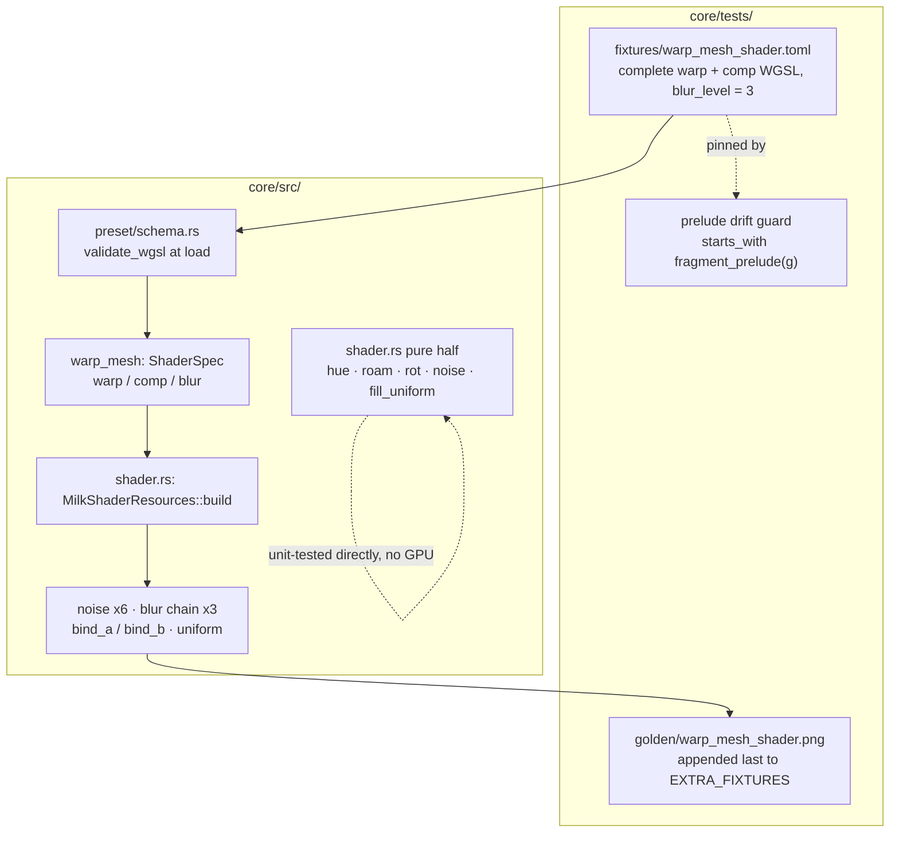

# 0110 — The shader surface stops being invisible

> **Status:** in-progress
> **Created:** 2026-08-18
> **Owner skill(s):** dev, human
> **Related ADRs:** [0033](../adrs/0033-testing-strategy-coverage-ratchet-and-pre-push-gate.md) (the ratchet this restores), [0023](../adrs/0023-golden-drift-guard-uses-frozen-fixtures.md) (the fixture discipline), [0058](../adrs/0058-bind-group-layout-collisions-carry-evidence.md) (the adapter comparison Phase 5 owes), [0113](../adrs/0113-milkdrop-presets-are-translated-ahead-of-time-onto-a-warp-mesh-idiom.md) (what the surface is for)

## TL;DR

`core/src/render/scenes/warp_mesh/shader.rs` is **719 lines at 0.00 % coverage** — not one of
them executes in CI — because every test fixture in the repo drives the warp mesh from EEL2
bytecode and **none carries WGSL**, and that file is deliberately built only for a bundle that
does. This plan writes the missing fixture: a hand-authored warp + comp shader pair, pinned by a
golden baseline, plus unit tests over the file's large pure-CPU half and over the wave/shape
element half of `milk/mod.rs`. The floor stays at 91; this plan earns its way back over it
rather than moving it.

## Context & problem

CI's `coverage` job has been red since 2026-08-16 21:37 (run `31974037098`, the `v0.71.0` push)
and every run since. It is the **only** failing job — `deny`, `check` on both platforms, `links`
and `miri` are green, and the `Release` workflow publishes fine.

The failing step is `Measure lmv-core line coverage and enforce the floor`
(`.github/workflows/ci.yml:166`), gating on `COVERAGE_FLOOR: "91"` (`ci.yml:35`):

| | lines | missed | line coverage |
|---|---|---|---|
| last green (run `31958383461`, 2026-08-16 16:21) | 16,042 | 1,033 | **93.56 %** |
| now (run `32008593831`, 2026-08-17) | 19,935 | 2,540 | **87.26 %** |

The MilkDrop/warp-mesh merge added **~3,893 lines of which ~1,507 are uncovered**. Where they
are:

| file | lines missed | line coverage |
|---|---|---|
| `core/src/render/scenes/warp_mesh/shader.rs` | **719** | **0.00 %** |
| `core/src/milk/mod.rs` | 271 | 52.62 % |
| `core/src/render/scenes/warp_mesh/draw.rs` | 128 | 72.53 % |
| `core/src/render/scenes/warp_mesh/mod.rs` | 116 | 88.79 % |
| `core/src/milk/vm.rs` | 87 | 71.84 % |

**The 0.00 % is not a runner artifact.** The coverage job runs on `windows-latest` precisely so
the DX12 WARP adapter makes GPU tests real (`ci.yml:145-147`, ADR-0016). The file is unreached
because of what it says about itself in its own header:

> Everything here exists **only for a bundle that carries WGSL**. A native `warp_mesh` preset —
> and a converted one without shaders — builds none of it, which is what keeps every existing
> golden byte-identical.

`core/tests/fixtures/warp_mesh_milk.toml` carries a `[milk]` table of EEL2 bytecode and **no**
`warp_shader`, `comp_shader` or `blur_level` keys. So `MilkShaderResources::build`, the six
procedural noise textures, the three-level blur chain, `fill_uniform`, `encode_clear` and
`encode_blur` have never run under any test, on any adapter. That is a test gap Plan
[0100](done/0100-the-engine-speaks-milkdrop.md) Phase 6 left behind and Plan
[0108](done/0108-the-milkdrop-import-gets-its-tone-back.md) widened.

**The arithmetic, because it decides the scope.** At the current denominator, a 91 % floor
allows `0.09 x 19,935 = 1,794` missed lines. There are 2,540. **This plan must eliminate at
least 746 of them.** The two files in scope offer `719 + 271 = 990`. So roughly **three
quarters of the available holes must close** — the margin is real but thin, and that thinness
is why the scope is two files rather than the one obvious one. Covering `shader.rs` alone and
perfectly reaches 90.87 %, which is still red.

## Decision

We write the fixture the engine never had: a **hand-authored WGSL warp + comp pair** checked in
as `core/tests/fixtures/warp_mesh_shader.toml`, carrying the complete modules the preset schema
demands, exercising the noise set, the blur chain and the uniform block, pinned by a golden
baseline appended to `EXTRA_FIXTURES`. Around it go unit tests for `shader.rs`'s pure half
(which needs no GPU at all) and for the wave/shape element half of `milk/mod.rs`. **The floor
stays at 91.**

We rejected **converting a real corpus preset** (`WORK/milkdrop-corpus`) because the output is
large, opaque and re-churns the golden whenever the converter changes — the fixture would pin
`milkconv`'s current opinion rather than the engine's contract. We rejected **converting at test
time** because it couples `core`'s test suite to the `milkconv` binary and pays conversion cost
on every run. We rejected **behavioral assertions without a golden** because 719 lines of
pipeline construction and bind-group wiring is exactly the code that breaks silently, and
`warp_mesh_milk` already set the precedent that this family gets pinned to pixels. And we
rejected **re-deriving the floor downward** — ADR-0033 permits it with a one-line note naming
the plan, and `ci.yml:33` even says 91 is "owed a second look", but lowering a ratchet to meet
uncovered code is how a ratchet stops meaning anything. That second look is a separate question
from this regression, and it is left as a followup.

**No new ADR.** The fixture applies patterns already decided — ADR-0023's frozen fixtures,
ADR-0033's ratchet, and the `warp_mesh_milk` precedent of a hand-written artifact guarded
against drift by a test. Nothing here is a cross-cutting tradeoff future readers would need the
rejected alternatives for; the paragraph above is enough.

### The one real hazard, and its settled answer

A hand-written fixture must inline the **complete** module: `milkconv/src/shader/emit.rs:121`
builds every converted shader as `fragment_prelude(group)` followed by translated code, and
`core/src/preset/schema.rs:1562-1570` runs `validate_wgsl` over the whole string at load. The
prelude is ~2 KB of generated text, and ADR-0118 changed it this month. A verbatim copy in a
`.toml` will drift.

The house already solved this. `warp_mesh_milk.toml` inlines compiled EEL2 assembly, and
`milkconv/tests/fixture.rs` asserts byte-for-byte that compiling the commented source produces
it — so the two cannot drift into a comment that used to be true. **Phase 2 owes the same
guard**: an assertion that the fixture's shaders begin with exactly
`milk::shader::fragment_prelude(WARP_GROUP)` and `(COMP_GROUP)`. When the prelude changes, that
test fails and names the repair, rather than the fixture silently pinning a stale surface.

## Architecture diagram



## Implementation phases

### Phase 1 — The pure half gets unit tests

- **Owner skill:** dev
- **What:** Unit-test everything in `shader.rs` that needs no GPU. This is the walking skeleton:
  it lands real coverage on the worst file before any fixture exists, and it cannot be broken by
  an adapter.
- **Files touched:** `core/src/render/scenes/warp_mesh/shader.rs` (add
  `#[cfg(test)] #[path = "shader_tests.rs"] mod tests;` at the foot — the private functions are
  not reachable from the existing sibling `tests.rs`), new
  `core/src/render/scenes/warp_mesh/shader_tests.rs`.
- **Done when** these properties hold. They are properties, not frozen numbers — each is exact
  or has a tolerance derived from the mechanism (ADR-0071):
  - `ShaderSpec::key` is stable across repeated calls on an equal spec, and differs when any one
    of `warp` / `comp` / `blur` differs.
  - `hue_corners` returns four rows whose **max channel is exactly 1.0** (the documented
    normalization) with `a = 1.0`, and is a pure function of `time`.
  - Every component `roam_vectors` produces lies in `0..=1` — the documented remap of a
    sine/cosine pair.
  - `rot_rows` fills `ROT_MATRICES * 4` rows; each matrix's upper 3x3 block is **orthonormal**
    (row norms 1, rows mutually perpendicular) to an f32 tolerance, because Rodrigues' formula
    produces a rotation and nothing else; each fourth row has `w == 1.0`. A different `salt`
    produces different axes; the same `salt` reproduces.
  - `noise_2d` / `noise_3d` return exactly `size*size*4` and `size*size*size*4` bytes, are
    deterministic in `(size, zoom, seed)`, and change with the seed. `zoom == 1` and `zoom > 1`
    take different arms — the interpolated arm's output has strictly lower mean absolute
    neighbour difference than the per-texel arm at equal size, which is what "smoothly
    interpolated" means and is checkable without freezing a number.
  - `fill_uniform` converts a per-second decay to this frame's factor: at `dt == 1.0` the
    `misc.x` lane equals the per-second value. The aspect lanes are reciprocal (`z == 1/x`,
    `w == 1/y`) and the **longer axis reads 1.0** at both landscape and portrait.
  - All of the above are **total on degenerate input** — zero size, non-finite or zero aspect,
    `dt == 0`, `zoom == 0`, `size == 0` — returning finite values and never panicking. The file
    carries the hot-path `#![deny(clippy::panic, clippy::indexing_slicing, ...)]` pragma; these
    tests are what make that claim observable.

### Phase 2 — A shader-carrying fixture, and the guard that keeps it honest

- **Owner skill:** dev
- **What:** The fixture that makes `MilkShaderResources::build` run at all, plus its drift guard.
- **Files touched:** new `core/tests/fixtures/warp_mesh_shader.toml`, `core/tests/warp_mesh.rs`.
- **How to author it.** Start from `warp_mesh_milk.toml` (same `[mesh]`, `[palette]`, `[params]`
  discipline, same header stating what it pins and why a shorter shader would pin less). Add
  `warp_shader`, `comp_shader` and `blur_level = 3` to the `[milk]` table. Each shader string is
  `fragment_prelude(g)` verbatim, then a small `@fragment fn fs_main` body. Generate the prelude
  text by printing it rather than transcribing it. The bodies must, between them, read:
  - `lmv_GetPixel` (binding 1 — `t_main`, so `bind_a` / `bind_b` both matter),
  - at least one 2D noise and one 3D noise sampler,
  - `lmv_GetBlur1`, `lmv_GetBlur2` and `lmv_GetBlur3` (which is what forces `blur_level = 3` to
    build all three levels),
  - and several distinct uniform lanes — `U.clock`, `U.bands`, `U.q`, `U.roam`, `U.rot`, `U.hue`
    — so `fill_uniform`'s output is load-bearing on the picture rather than merely written.

  `core/src/milk/shader.rs`'s own `the_prelude_is_valid_wgsl_at_both_groups` test shows the
  minimal shape of a valid module; the fixture bodies are that, with more reads.
- **Done when:**
  - The fixture parses and loads **clean** — no warnings — and `validate_wgsl` accepts both
    modules (a rejected module is a named load error, so a broken fixture fails loudly here
    rather than at render).
  - **The drift guard:** the fixture's `warp_shader` starts with exactly
    `milk::shader::fragment_prelude(milk::shader::WARP_GROUP)`, and `comp_shader` with
    `(COMP_GROUP)`. This is the `milkconv/tests/fixture.rs` discipline applied to WGSL.
  - The fixture **renders a real shape** and **animates** — the same two statistics
    `warp_mesh.rs` already applies to its other fixtures, against the same floors, so the new
    entry is comparable to the existing ones rather than measured differently.
  - **The shaders and not the defaults drive the picture:** the fixture renders differently from
    the same preset with `warp_shader`/`comp_shader` removed, which is the `[milk]`-vs-control
    argument `the_bundle_and_not_the_defaults_drives_the_transform` already makes one layer down.

### Phase 3 — The branches where the surface is partly absent

- **Owner skill:** dev
- **What:** Cover `build`'s `Option` arms and the no-blur-chain path. Three variants derived
  from the fixture **text in-test** — no new files, no new baselines.
- **Files touched:** `core/tests/warp_mesh.rs`.
- **Done when:** warp-only (no `comp_shader`), comp-only (no `warp_shader`), and
  `blur_level = 0` each build and render a finite frame without panicking; and the `blur_level =
  0` arm renders **differently** from the `blur_level = 3` arm, since the fixture's shaders read
  `lmv_GetBlur3` by construction. If those two arms come back identical, that is a finding about
  what bindings 12..14 resolve to when no chain is built — record it, do not tune the fixture
  until it goes away.

### Phase 4 — The element half of the runtime

- **Owner skill:** dev
- **What:** Unit-test the wave/shape element half of `MilkRuntime` — the 271 missed lines in
  `milk/mod.rs`. The existing 15 tests in `core/src/milk/tests.rs` cover the VM, the bundle and
  the q-bridge; the element path landed later, in Plan 0108, and carries almost none.
- **Files touched:** `core/src/milk/tests.rs`.
- **Done when** these hold:
  - **A wave's per-point state carries to the next point within a wave, and does not leak into
    the next wave.** This is the exact defect commit `a07b0c6` fixed; nothing currently pins it.
  - A shape instance's index reaches its program — instance `n` and instance `m` produce
    different `ShapeInstance` output when the program reads the instance variable.
  - `push_element` rejects an element whose register roster disagrees with the bundle's, with a
    named `BundleError` (the same shape `a_bundle_with_mismatched_rosters_is_rejected` asserts
    for the frame programs), and every `BundleError` variant's `Display` renders non-empty text.
  - `wave_spec` / `shape_spec` return `None` past the end and `Some` within it; `wave_count` and
    `shape_count` agree with what was pushed.
  - `take_snapshot` / `restore_snapshot` round-trip: a run, a snapshot, a divergent run, a
    restore, and the same run again produces identical output.
  - `uses_random` is true exactly when some pushed program draws randomness.

### Phase 5 — Compare adapters, bless once, measure

- **Owner skill:** dev
- **What:** Land the baseline safely and report the real number. This phase is bookkeeping in
  the same sense a landing is: it is where the recorded hazards bite.
- **Files touched:** new `core/tests/golden/warp_mesh_shader.png`, `core/tests/golden.rs`.
- **Done when:**
  - The new entry is **appended last** to `EXTRA_FIXTURES` (`core/tests/golden.rs:130`), never
    inserted. That array's own header states why: it is captured after the roster loop so that
    adding an entry moves no existing baseline, "which matters on WARP, where building GPU
    resources mid-run is documented to change what a later capture resolves to". Its doc comment
    gains a paragraph in the established voice saying what this sixth-plus-one fixture pins that
    no other can — that it is the only baseline in the crate executing a converted shader
    module, a procedural noise texture, or the blur chain.
  - **The ADR-0058 adapter comparison runs before the bless**, hardware against WARP, and its
    result is recorded in the plan's implementation log. This is not optional ceremony: a new
    pass whose bind-group layout matches a live pipeline's has been observed taking that other
    pass's uniform on WARP while hardware stayed correct — which blesses garbage. A 15-binding
    layout with two 3D textures is exactly the kind of new layout that needs the check.
  - **Exactly one baseline file is new or changed in `git status`.** `LMV_BLESS` rewrites every
    baseline it renders, not only the failing one; restore any others it touched before
    committing, and confirm with the diff rather than by intent.
  - `cargo llvm-cov nextest -p lmv-core --summary-only` is run locally and **both** numbers —
    total lines and missed — are recorded in the plan's implementation log with the margin over
    746. Note in the log that this box has a hardware GPU and CI has WARP, so hardware-gated
    tests execute here and skip there: **the local reading is an over-estimate of CI's**, which
    is the same asymmetry `ci.yml:29-33` records about the floor itself.

### Phase 6 — The CI reading

- **Owner skill:** human
- **What:** Push, and read the number CI actually produces. The plan's whole success criterion
  is a CI job, and only the user pushes.
- **Done when:** the `coverage` job passes at floor 91 on `main`. If it comes in under, the
  shortfall is the input to a followup phase — extending to `milk/vm.rs` (87) and
  `warp_mesh/draw.rs` (128), which together hold more than any plausible gap — and **not** a
  reason to lower the floor. That call was made in the Decision above and does not get remade
  under schedule pressure.

## Data shapes

The fixture's `[milk]` table, illustrative — the two shader strings are the new part, everything
else follows `warp_mesh_milk.toml`:

```toml
# illustrative — the real prelude is ~2 KB and is generated, not transcribed
[milk]
blur_level = 3
per_frame = """..."""      # as warp_mesh_milk.toml
warp_shader = """
<verbatim fragment_prelude(WARP_GROUP)>
@fragment
fn fs_main(in: VsOut) -> @location(0) vec4<f32> {
    let past = lmv_GetPixel(in.uv);
    let n    = textureSampleLevel(t_noise_mq, s_fw, in.uv * U.roam[0].xy, 0.0).xyz;
    let b    = lmv_GetBlur1(in.uv) + lmv_GetBlur3(in.uv);
    ...
}
"""
comp_shader = """..."""
```

The uniform block is **not** redefined here: it is `MilkUniform` in `shader.rs`, field-for-field
with `UNIFORM_WGSL` in `milk/shader.rs`, and a test already naga-parses that text so the two
cannot drift.

## Risks & open questions

- **The margin is thin.** 746 missed lines must go, and the two files in scope hold 990. If
  Phases 1–4 land short, Phase 6 names the extension (`vm.rs`, `draw.rs`) rather than reopening
  the floor decision.
- **WARP and 3D textures.** The fixture samples `texture_3d` through `t_noisevol_lq` /
  `_hq`, which nothing in the suite has asked a software adapter to do. If WARP refuses or
  diverges, drop the 3D reads from the fixture bodies and record that as a finding about the
  adapter — the 2D noise, the blur chain and the uniform block still carry the bulk of the file.
- **The denominator moves.** Coverage is a ratio, and any non-test code landing in parallel
  changes it. `milk/tests.rs` and `warp_mesh/tests.rs` are both absent from CI's per-file
  breakdown, which is why Phase 1 puts new tests in a **separate file** rather than an inline
  module — but whether an inline `#[cfg(test)] mod` would count is not established here. Phase 5
  measures; it does not assume.
- **CI time.** The `coverage` job already runs 22m43s and the fixture adds WARP render work to
  it and to `golden`. If the job approaches the runner limit that is a real cost, and the answer
  is a narrower capture size for this fixture, not a dropped assertion.
- **The fixture is hand-written, so it is only as representative as its author.** It pins that
  the surface *works*, not that any real preset renders correctly — Plan
  [0109](0109-the-milkdrop-import-gets-its-geometry-back.md) owns the latter.

## What this plan does NOT do

- **Does not move the coverage floor**, in either direction. `ci.yml:33` records that 91 was
  "measured once, on the wrong machine, and is owed a second look" — that re-derivation is a
  real and separate question, and doing it while a regression is red would launder the
  regression into the new number.
- **Does not touch `render/text.rs` (128 missed, 0.00 %) or `render/overlay.rs` (183 missed).**
  Both were already dark in the last green run; they are a standing gap, not this regression.
- **Does not cover `milk/vm.rs` or `warp_mesh/draw.rs`** unless Phase 6's reading forces it.
- **Does not convert a corpus preset, wire `milkconv` into `core`'s tests, or ship a
  shader-carrying preset to `presets/`.** Shipping `warp_mesh` worlds belongs to Plan
  [0104](0104-the-library-stops-being-lopsided.md) and the `preset-author` lane.
- **Does not change engine behavior.** If a phase finds a defect, it records it and the fix goes
  to a followup — a coverage plan that also changes what the code does cannot tell you which of
  the two moved the baseline.

## Followups (after this lands)

- Re-derive the 91 floor from a real cache-warm CI reading, as `ci.yml:33` has asked since Plan
  0061 Phase 9 — as its own decision, on a green tree.
- `render/text.rs` at 0.00 % and `render/overlay.rs` at 44.49 %: decide whether they are
  untested or structurally unreachable, and say so in one place.
- If Phase 3 finds that `blur_level = 0` and `= 3` render identically, that is a real question
  about the placeholder binding, not a test-authoring detail.
