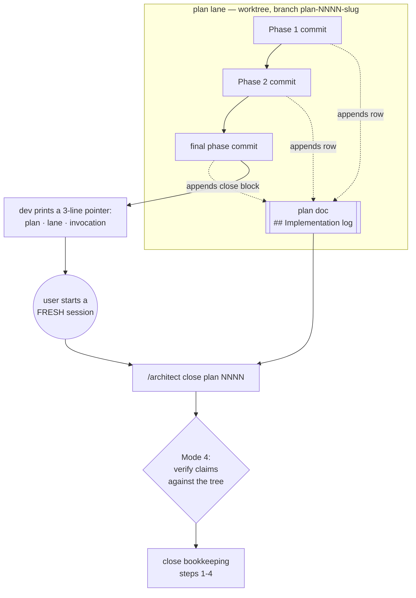

# 0112 — The handoff stops being a chat message

> **Status:** draft
> **Created:** 2026-08-25
> **Owner skill(s):** dev
> **Related ADRs:** [0120](../adrs/0120-the-close-brief-is-a-section-of-the-plan.md) (proposed),
> resting on [0053](../adrs/0053-plan-lanes-run-in-git-worktrees.md)

## TL;DR

`dev` writes its close brief into the plan document instead of the chat window — a
`## Implementation log` section, one row per phase as that phase commits, and a close block after
the last one. The plan template carries the empty skeleton so the affordance is visible from the
day a plan is drafted. Architect's Mode 4 reads it as the brief and verifies its claims against the
tree. **Nothing about the fresh-session boundary changes**; what changes is that a finished lane is
now self-describing, so it can sit on disk and wait its turn instead of living in one session's
scrollback. Moves no pixels, touches no Rust.

## Context & problem

The user's report: *"when dev finishes work, I have to manually pass prompt and details to a new
architect session."* That copy-paste is the visible symptom. The underlying defect, and the reason
it blocks parallel lanes, is in
[ADR-0120](../adrs/0120-the-close-brief-is-a-section-of-the-plan.md) — the brief is synchronous,
single-copy, and does not cross the worktree boundary.

Two facts shape the design, and both are already in the tree:

- **`dev` has already invented this, four times.** Plans 0100, 0108, 0110 and 0111 each carry a
  hand-rolled `## Implementation log`. Plan 0110's says outright that it exists *"so the close
  ceremony does not have to re-derive any of it"*, and records the lane, a per-phase table with
  commit SHAs, and what each phase found. This plan specifies a practice rather than introducing
  one.
- **Half the close ceremony is conditional, and the conditions are what get skipped.** Steps 3b,
  3c and 4 of architect's bookkeeping fire on triggers architect re-derives from the diff every
  time. The measured cost: five consecutive feature plans with no version bump, and 49 backlog
  entries marked `CLOSED` but never archived across three separate sweeps. `dev` knows every one of
  those trigger facts when it commits, and has nowhere to put them.

## Decision

Take ADR-0120: the brief is a section of the plan, appended per phase.

Rejected, with the one decisive reason each: a **separate `NNNN-close.md`** needs a fold-or-delete
step at close, which adds a skippable step to a ceremony whose failure mode is skipped steps; an
**untracked scratch file** dies with `git worktree remove` and never reaches `main`; **keeping the
chat brief** is contradicted by four independent reinventions of a file; **writing the log once at
the end** loses everything when a session is cleared mid-plan, which has already happened here.

## Architecture diagram

The dotted edges are the change. The solid path is what exists today, unchanged — including the
fresh-session boundary, which is the point of the seam and is not being automated away.

## Implementation phases

Every phase edits harness markdown only. No Rust, no `presets/`, no `scripts/`. All three are
tagged `dev` on the [Plan 0067](done/0067-the-curation-route.md) Phase 4 precedent (`docs(skills):`,
commit `be7204c`) — the owner vocabulary has no word for a harness-editing phase, which is a known
wart already filed as a followup by [Plan 0104](0104-the-library-stops-being-lopsided.md).

Each phase's done-when is a property of the resulting file, checkable by reading it. `node
scripts/check-doc-links.mjs` must exit 0 at the end of every phase — it covers `.claude/skills/**`
as well as `docs/`, and these phases add relative links in both.

### Phase 1 — The plan template carries the log skeleton

- **Owner skill:** dev
- **What:** the template every new plan is written from ships with the empty
  `## Implementation log` section, so the affordance is visible before the first phase runs.
- **Files touched:** `.claude/skills/architect/references/templates/plan.md`
- **Done when:**
  - `## Implementation log` is the template's **final** section, after
    `## Followups (after this lands)`.
  - It opens with a blockquote saying who writes it (`dev`), when (one row per phase, close block
    at the end), and that **the phases above remain the contract while the log is what happened**.
  - The blockquote states the claims-not-evidence rule in one sentence: architect verifies every
    claim here against the tree.
  - It carries a `**Lane:**` line whose placeholder covers both cases (`main` directly, or a
    worktree path plus branch name).
  - It carries a table with the columns `phase | owner | state | commit`.
  - It carries a `### Notes` subsection whose placeholder says what belongs there — deviations,
    judgement calls on underspecified spots, followups noticed and not acted on — and that empty is
    a valid answer.
  - It carries a `### Close triggers` subsection with one bullet per conditional close step,
    covering at minimum: `presets/` touched; the plan header's `**Closes:** design-backlog NNNN`
    entries; what shipped (feature / fix-only / docs-chore-only); operator docs touched, named from
    architect Mode 4's sweep table; the result of `node scripts/check-backlog-claims.mjs`;
    outstanding `human` phases; and the final phase's done-when results quoted verbatim with
    pass/fail.
  - The `### Close triggers` heading itself says these are **facts for architect to verify and
    decide from**, and the bullets contain no recommendation — in particular **no suggested version
    bump level**, which is architect-owned per
    [ADR-0005](../adrs/0005-versioning-and-release-cadence.md).
  - `node scripts/check-doc-links.mjs` exits 0.

### Phase 2 — `dev` writes the log as the phases land

- **Owner skill:** dev
- **What:** the `dev` skill appends its log row inside each phase commit and completes the close
  block after the last one; the close-ceremony reference stops being a chat brief and becomes the
  field guide plus a short pointer.
- **Files touched:** `.claude/skills/dev/SKILL.md`,
  `.claude/skills/dev/references/close-ceremony-prompt.md`
- **Done when:**
  - `dev`'s Step 3 phase loop names writing the phase's log row as part of **the same commit** as
    the phase — explicitly not a separate commit, and staged by explicit path along with the
    phase's files.
  - Step 3 says that when the plan predates this change and has no `## Implementation log` section,
    `dev` **creates it** rather than skipping the log. (Seven plans are in flight today and none
    has one; this is why they are not being backfilled.)
  - Step 3 says the log carries **deltas, not a recap** — no diffs, no self-review, no restatement
    of the phase text — and that a phase whose row would say nothing beyond `done` says exactly
    that.
  - Step 4 no longer instructs pasting a filled-in brief into chat. What it prints names the plan
    (number, title, path), the lane (branch and worktree path, or `main`), and the fresh-session
    invocation. Nothing else.
  - Step 4 completes the close block **before** printing the pointer, and that block is committed —
    a pointer to an unwritten log is the one failure this phase must not permit.
  - `close-ceremony-prompt.md` is rewritten to document (a) how to fill each log field, (b) the
    claims-not-evidence rule, (c) why the session must still be fresh — the existing "Why a fresh
    session" argument survives verbatim in substance — and (d) the surviving "what NOT to include"
    list: no full diff, no self-review, no session recap, no secrets.
  - `dev`'s "What you do NOT do" bullet on plans widens to exactly two things — the `Status:` line
    and the `## Implementation log` section — and still states that **editing a phase block is
    prohibited** and a wrong plan remains an escalation to architect.
  - `node scripts/check-doc-links.mjs` exits 0.

### Phase 3 — Architect reads the log, and `CLAUDE.md` names the seam

- **Owner skill:** dev
- **What:** Mode 4 opens on the log, the conditional bookkeeping steps point at the field that
  states their trigger, and the orientation map's handoff sentence stops describing a chat message.
- **Files touched:** `.claude/skills/architect/SKILL.md`, `CLAUDE.md`
- **Done when:**
  - Mode 4 lens 1's **first** instruction is to read the plan's `## Implementation log`, described
    as the brief `dev` left.
  - The same paragraph states that the log is **claims, not evidence** — architect still opens the
    tests, reads the diff and decides — and that a close which grades the log instead of the tree
    has failed. This sits alongside the existing lens-1 rule that a green `cargo test` is not a
    passing test.
  - Bookkeeping steps **3b**, **3c** and **4** each name the `### Close triggers` bullet that
    states their trigger, and each says the bullet is where to start looking, not the decision. In
    particular step 4 still requires architect to choose the bump level itself.
  - Mode 4 names a **missing or empty** log as a `minor` finding — explicitly **not** a blocker —
    and says the review proceeds from `git` as it does today.
  - The "Closing a plan that was built in a worktree" sequence takes the branch name and worktree
    path from the log's `**Lane:**` line rather than asking the user for them.
  - `CLAUDE.md`'s "How we work" handoff sentence describes `dev → architect` as the log plus a
    pointer, not a pasted brief.
  - `node scripts/check-doc-links.mjs` exits 0.

## Risks & open questions

- **The log becomes a substitute for the review.** The single largest risk in ADR-0120, and the
  reason the claims-not-evidence sentence appears in three places (the template blockquote, the
  `dev` reference, Mode 4 lens 1). If a future close reads as a grading of the log rather than of
  the tree, that is the symptom.
- **Nothing gates the log's presence or its size.** Deliberate, and argued in ADR-0120's
  Consequences: a gate would fire on architect at the close, after `dev`'s session is gone. If a
  log goes missing twice, or a log outgrows the plan's own phase section, revisit — a
  `roster:begin cap=` region is the obvious instrument and `scripts/check-index-rows.mjs` already
  implements it.
- **`.claude/skills/**` writes have been intermittent** across sessions in this project. They have
  succeeded in the sessions that attempted them; if a write is refused, that is a `human` task and
  the phase escalates rather than working around it.
- **The owner vocabulary still has no word for a harness phase.** All three phases are `dev` by
  precedent. Not this plan's problem to fix, but it is the second plan to trip on it.

## What this plan does NOT do

- **Does not change the fresh-session boundary.** The user still starts a new `/architect` session;
  that seam is the value, not the friction.
- **Does not add a gate** for the log's presence, shape or size.
- **Does not backfill** the seven in-flight plans with an empty skeleton — Phase 2 has `dev` create
  the section on demand instead.
- **Does not touch the `preset-author` handoff.** [`docs/design-backlog.md`](../design-backlog.md)
  remains that lane's inbox, unchanged.
- **Does not automate any part of the close ceremony.** The log states facts; architect performs
  every step.
- **Touches no Rust, no presets, no scripts, no CI.** Nothing renders differently and the version
  bump for this plan is a judgement architect makes at the close like any other.

## Followups (after this lands)

- **Run the next real close through the route and record the friction.** This plan's own log (the
  skeleton below) is the first exercise, but it is a docs-only plan with no `presets/`, no
  `Closes:`, and nothing for steps 3b or 3c to bite on — so the trigger bullets go untested until a
  code plan closes through them.
- **Revisit gating** if a log goes missing twice, or grows past the phase section it accompanies.
- **The mid-plan resume path** is now implied but not specified: a fresh `dev` session picking up an
  in-flight plan should read the log to find where it is. Worth one line in `dev`'s Step 2 if the
  first resume proves awkward.

## Implementation log

> Written by `dev` — one row per phase as that phase's commit lands, and the close block after the
> last one. **The phases above are the contract; everything here is what happened.** These are
> claims, not evidence: architect verifies each against the tree.

**Lane:** _(to be filled: `main` directly, or worktree path + branch)_

| phase | owner | state | commit |
|---|---|---|---|
| 1 — the plan template carries the log skeleton | dev | not started | — |
| 2 — `dev` writes the log as the phases land | dev | not started | — |
| 3 — architect reads the log, and `CLAUDE.md` names the seam | dev | not started | — |

### Notes

_(deviations, judgement calls on underspecified spots, followups noticed and not acted on. Empty is
a valid answer.)_

### Close triggers

_(facts for architect to verify and decide from — not recommendations.)_

- **`presets/` touched:** —
- **Plan header `Closes:`** —
- **What shipped:** —
- **Operator docs touched:** —
- **Backlog probes (`node scripts/check-backlog-claims.mjs`):** —
- **Outstanding `human` phases:** —
- **Final-phase done-when results:** —
