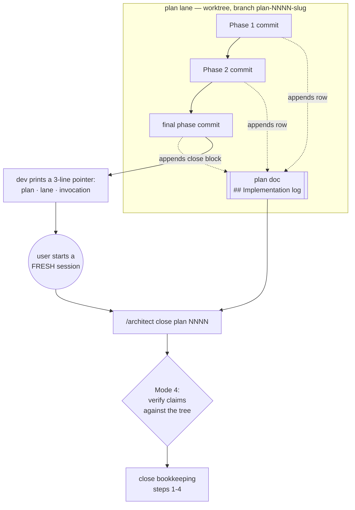

# 0112 — The handoff stops being a chat message

> **Status:** in-progress
> **Created:** 2026-08-25
> **Owner skill(s):** dev
> **Related ADRs:** [0120](../adrs/0120-the-close-brief-is-a-section-of-the-plan.md) (proposed),
> resting on [0053](../adrs/0053-plan-lanes-run-in-git-worktrees.md)

## TL;DR

`dev` writes its close brief into the plan document instead of the chat window — a
`## Implementation log` section, one row per phase as that phase commits, and a close block after
the last one. The plan template carries the empty skeleton so the affordance is visible from the
day a plan is drafted. Architect's Mode 4 reads it as the brief and verifies its claims against the
tree.

**The log is deliberately thin, and that is a design constraint rather than a style note.** It
carries `dev`'s **observations, never `dev`'s conclusions** — the lane, the phase-to-commit
mapping, and raw `git`-derived trigger facts, with no per-criterion `[pass]` list, no
self-assessment and no narrative. A written brief anchors a reader far harder than a chat message
does, and the review's entire value is that architect reaches its own verdict. The one thing
thinness never applies to is a **finding**: a deviation from the plan, or a done-when that could
not be met as stated, is always disclosed.

**Nothing about the fresh-session boundary changes**; what changes is that a finished lane is
now self-describing, so it can sit on disk and wait its turn instead of living in one session's
scrollback. Moves no pixels, touches no Rust.

## Context & problem

The user's report: *"when dev finishes work, I have to manually pass prompt and details to a new
architect session."* That copy-paste is the visible symptom. The underlying defect, and the reason
it blocks parallel lanes, is in
[ADR-0120](../adrs/0120-the-close-brief-is-a-section-of-the-plan.md) — the brief is synchronous,
single-copy, and does not cross the worktree boundary.

Two facts shape the design, and both are already in the tree:

- **`dev` has already invented this, four times.** Plans 0100, 0108, 0110 and 0111 each carry a
  hand-rolled `## Implementation log`. Plan 0110's says outright that it exists *"so the close
  ceremony does not have to re-derive any of it"*, and records the lane, a per-phase table with
  commit SHAs, and what each phase found. This plan specifies a practice rather than introducing
  one.
- **Half the close ceremony is conditional, and the conditions are what get skipped.** Steps 3b,
  3c and 4 of architect's bookkeeping fire on triggers architect re-derives from the diff every
  time. The measured cost: five consecutive feature plans with no version bump, and 49 backlog
  entries marked `CLOSED` but never archived across three separate sweeps. `dev` knows every one of
  those trigger facts when it commits, and has nowhere to put them.

## Decision

Take ADR-0120: the brief is a section of the plan, appended per phase.

Rejected, with the one decisive reason each: a **separate `NNNN-close.md`** needs a fold-or-delete
step at close, which adds a skippable step to a ceremony whose failure mode is skipped steps; an
**untracked scratch file** dies with `git worktree remove` and never reaches `main`; **keeping the
chat brief** is contradicted by four independent reinventions of a file; **writing the log once at
the end** loses everything when a session is cleared mid-plan, which has already happened here.

## Architecture diagram

The dotted edges are the change. The solid path is what exists today, unchanged — including the
fresh-session boundary, which is the point of the seam and is not being automated away.

## Implementation phases

Every phase edits harness markdown only. No Rust, no `presets/`, no `scripts/`. All three are
tagged `dev` on the [Plan 0067](done/0067-the-curation-route.md) Phase 4 precedent (`docs(skills):`,
commit `be7204c`) — the owner vocabulary has no word for a harness-editing phase, which is a known
wart already filed as a followup by [Plan 0104](0104-the-library-stops-being-lopsided.md).

Each phase's done-when is a property of the resulting file, checkable by reading it. `node
scripts/check-doc-links.mjs` must exit 0 at the end of every phase — it covers `.claude/skills/**`
as well as `docs/`, and these phases add relative links in both.

### Phase 1 — The plan template carries the log skeleton

- **Owner skill:** dev
- **What:** the template every new plan is written from ships with the empty
  `## Implementation log` section, so the affordance is visible before the first phase runs.
- **Files touched:** `.claude/skills/architect/references/templates/plan.md`
- **Done when:**
  - `## Implementation log` sits **immediately before `## Followups (after this lands)`** — the
    placement all four existing logs already use (0100, 0108, 0110, 0111), so the contract sections
    stay together above it and the forward-looking section stays last.
  - It opens with a blockquote saying who writes it (`dev`), when (one row per phase, close block
    at the end), and that **the phases above remain the contract while the log is what happened**.
  - The blockquote states the rule the section turns on, in one sentence: **observations, never
    conclusions** — the log says where to look, architect decides how it went.
  - It carries a `**Lane:**` line whose placeholder covers both cases (`main` directly, or a
    worktree path plus branch name).
  - It carries a table with the columns `phase | owner | state | commit`. The `state` placeholder
    offers `done` / `not started` / `abandoned` and **no quality word** — a phase state is a fact,
    not an assessment.
  - It carries a `### Notes` subsection whose placeholder says what belongs there and, as
    importantly, what does not:
    - **deviations from the plan — required**, because a silent one is a review failure rather than
      a review challenge and Mode 4's lens 1 cannot answer it from a diff. Each records **what
      `dev` did differently and the commit**, and stops there: no justification, no argument that
      it was fine.
    - **done-when criteria `dev` could not satisfy as stated — by exception only.** No `[pass]`
      list. Silence means `dev` believes the rest passed, and architect verifies exactly as today.
    - **followups noticed and not acted on.**
    - and explicitly **not**: narrative, self-assessment, "nothing notable", or any restatement of
      the phase text. Empty is a valid answer and needs no sentence saying so.
  - It carries a `### Close triggers` subsection with one bullet per conditional close step,
    covering at minimum: `presets/` touched; the plan header's `**Closes:** design-backlog NNNN`
    entries; what shipped (feature / fix-only / docs-chore-only); operator docs touched, named from
    architect Mode 4's sweep table; the result of `node scripts/check-backlog-claims.mjs`; and
    outstanding `human` phases. Every one is raw `git`-derived data architect can re-check in a
    single command.
  - The `### Close triggers` heading itself says these are **facts for architect to verify and
    decide from**, and the bullets contain no recommendation — in particular **no suggested version
    bump level**, which is architect-owned per
    [ADR-0005](../adrs/0005-versioning-and-release-cadence.md).
  - The blockquote states the size rule as a property, not a constant: **the log stays shorter than
    the plan's own `## Implementation phases` section.** It self-scales with the plan, it encodes
    that the contract outweighs the report, and it is checkable by looking. It is deliberately
    ungated — see Risks.
  - The section contains **only** those four blocks. No free prose between them.
  - `node scripts/check-doc-links.mjs` exits 0.

### Phase 2 — `dev` writes the log as the phases land

- **Owner skill:** dev
- **What:** the `dev` skill appends its log row inside each phase commit and completes the close
  block after the last one; the close-ceremony reference stops being a chat brief and becomes the
  field guide plus a short pointer.
- **Files touched:** `.claude/skills/dev/SKILL.md`,
  `.claude/skills/dev/references/close-ceremony-prompt.md`
- **Done when:**
  - `dev`'s Step 3 phase loop names writing the phase's log row as part of **the same commit** as
    the phase — explicitly not a separate commit, and staged by explicit path along with the
    phase's files.
  - Step 3 says that when the plan predates this change and has no `## Implementation log` section,
    `dev` **creates it** rather than skipping the log. (Seven plans are in flight today and none
    has one; this is why they are not being backfilled.)
  - Step 3 states the observations-never-conclusions rule in `dev`'s own voice, with the three
    concrete prohibitions: **no per-criterion `[pass]` list**, no self-review, no narrative of how
    a phase went. A phase whose row would say nothing beyond `done` says exactly that, and writes
    no note.
  - Step 3 states the counterweight so the rule is not read as licence to omit: **a deviation from
    the plan is always disclosed** — what was done differently, and the commit — and a done-when
    criterion that could not be met as stated is always noted. Thinness applies to `dev`'s
    opinions, never to `dev`'s findings.
  - Step 3 distinguishes the two write cadences and does not let them contradict each other: a
    **phase row rides inside that phase's commit**, while a **mid-session handoff** — the session
    is being cleared or compacted between phases — finishes the unit in flight and lands the log
    update as its own `docs(plans): …` commit, so the handoff is legible in the log. That second
    case is existing practice and is what the four hand-rolled logs were written for.
  - **Step 3 resolves the conflict those two cadences create, because they have different
    readers.** A mid-session handoff is read by a *resuming `dev`*, which needs exactly what the
    thin rule forbids — the diagnosis behind an unfinished symptom, the candidate fixes and what
    each costs, the test/lint state at the tip, what a fresh session would otherwise rediscover.
    Anchoring is irrelevant there: it is the same lane continuing. A close block is read by
    *architect*, reviewing. So resume detail is **scaffolding**: `dev` writes it freely when a
    session is being cleared, and **removes it when the phase it was written for lands**, leaving
    only whatever qualifies as a finding. Without this, mid-plan richness survives to the close and
    anchors the reviewer — which would defeat the thin rule by a side door, in exactly the case
    where nobody is watching for it. The size property is the visible symptom if it is skipped.
  - Step 4 no longer instructs pasting a filled-in brief into chat. What it prints names the plan
    (number, title, path), the lane (branch and worktree path, or `main`), and the fresh-session
    invocation. Nothing else.
  - Step 4 completes the close block **before** printing the pointer, and that block is committed —
    a pointer to an unwritten log is the one failure this phase must not permit.
  - `close-ceremony-prompt.md` is rewritten to document (a) how to fill each log field, (b) the
    observations-never-conclusions rule and the deviation counterweight, (c) why the session must
    still be fresh — the existing "Why a fresh session" argument survives verbatim in substance —
    and (d) the "what NOT to include" list, which grows one entry: no full diff, no self-review,
    **no per-criterion pass/fail list**, no session recap, no secrets.
  - The reference explains **why** the log is thin, not just that it is — a file anchors a reader
    far harder than a chat message does, and the review's value is that architect reaches its own
    verdict. A rule whose reason is stated survives a `dev` session that thinks it is being
    helpful; one that is merely asserted does not.
  - `dev`'s "What you do NOT do" bullet on plans widens to exactly two things — the `Status:` line
    and the `## Implementation log` section — and still states that **editing a phase block is
    prohibited** and a wrong plan remains an escalation to architect.
  - `node scripts/check-doc-links.mjs` exits 0.

### Phase 3 — Architect reads the log, and `CLAUDE.md` names the seam

- **Owner skill:** dev
- **What:** Mode 4 opens on the log, the conditional bookkeeping steps point at the field that
  states their trigger, and the orientation map's handoff sentence stops describing a chat message.
- **Files touched:** `.claude/skills/architect/SKILL.md`, `CLAUDE.md`
- **Done when:**
  - Mode 4 lens 1's **first** instruction is to read the plan's `## Implementation log`, described
    as the brief `dev` left.
  - The same paragraph states that the log is **claims, not evidence** — architect still opens the
    tests, reads the diff and decides — and that a close which grades the log instead of the tree
    has failed. This sits alongside the existing lens-1 rule that a green `cargo test` is not a
    passing test.
  - **Mode 4 states that silence in the log is not certification.** Done-when results are reported
    by exception, so a criterion with no note carries `dev`'s belief that it passed and nothing
    more — which is exactly the claim the lens exists to test. Without this sentence the thinness
    bought to protect the review reads as a review already performed, which would leave the plan
    worse than the chat brief it replaces.
  - Mode 4 checks the size property — the log shorter than the plan's `## Implementation phases`
    section — and reports a breach as a `minor`, since nothing gates it.
  - Bookkeeping steps **3b**, **3c** and **4** each name the `### Close triggers` bullet that
    states their trigger, and each says the bullet is where to start looking, not the decision. In
    particular step 4 still requires architect to choose the bump level itself.
  - Mode 4 names a **missing or empty** log as a `minor` finding — explicitly **not** a blocker —
    and says the review proceeds from `git` as it does today.
  - The "Closing a plan that was built in a worktree" sequence takes the branch name and worktree
    path from the log's `**Lane:**` line rather than asking the user for them.
  - `CLAUDE.md`'s "How we work" handoff sentence describes `dev → architect` as the log plus a
    pointer, not a pasted brief.
  - `node scripts/check-doc-links.mjs` exits 0.

## Risks & open questions

- **The log anchors the review — the risk this plan is shaped around.** A written brief pre-forms a
  verdict far harder than a chat message does, and the review's whole value is that architect
  reaches its own. That is why the log carries observations and not conclusions, why the
  per-criterion `[pass]` list was cut, and why the rule is restated in three places (the template
  blockquote, the `dev` reference, Mode 4 lens 1). **The symptom to watch for: a close whose
  findings all trace back to something the log raised.** A review that only ever confirms the log
  has been captured by it.
- **The opposite failure is also live, and it is quieter.** Thinness applies to `dev`'s opinions,
  never to `dev`'s findings — an undisclosed deviation or an unmet done-when is a defect architect
  may never see, because a diff cannot say what the plan asked for. Phase 2 carries that
  counterweight explicitly, and Phase 3 makes Mode 4 say that **silence is not certification**. If
  a close ever discovers a deviation the log did not name, that is the symptom, and it is more
  serious than a log that said too much.
- **Nothing gates the log's presence or its size, and the size risk is measured rather than
  feared.** The four logs already in the tree run **86, 118, 219 and 305 lines** (0108, 0110, 0111,
  0100) — 0100's is longer than that plan's entire phase section, which is precisely the inversion
  the size property forbids. **None of the four was written under that property**, which is why a
  fourth doc gate was considered and declined here as premature: it would be gating a rule with no
  evidence yet of failing. That is a deliberate acceptance of the weaker discipline, against a
  project history that has measured it failing before (ADR-0116: *"One line per plan"*, regrown
  7.1x in eight days). **Revisit trigger: two logs breaching the property, or a log going missing
  twice.** The instrument exists — `roster:begin cap=` plus `scripts/check-index-rows.mjs` — and a
  *size* gate, unlike a *presence* gate, would fire on `dev` at push time rather than on architect
  at the close, which is the cheap moment.
- **Architect also appends to closed plans**, in a section after the log (0100's
  `## Phases 7 and 8, run at the close`, 0110's `## Close review`, 0108's `## The look gate`).
  Nothing in this plan forbids that and nothing in it specifies it; if the two conventions start
  colliding, that is an architect-side question for a later pass.
- **`.claude/skills/**` writes have been intermittent** across sessions in this project. They have
  succeeded in the sessions that attempted them; if a write is refused, that is a `human` task and
  the phase escalates rather than working around it.
- **The owner vocabulary still has no word for a harness phase.** All three phases are `dev` by
  precedent. Not this plan's problem to fix, but it is the second plan to trip on it.

## What this plan does NOT do

- **Does not change the fresh-session boundary.** The user still starts a new `/architect` session;
  that seam is the value, not the friction.
- **Does not add a gate** for the log's presence, shape or size.
- **Does not backfill** the seven in-flight plans with an empty skeleton — Phase 2 has `dev` create
  the section on demand instead.
- **Does not touch the `preset-author` handoff.** [`docs/design-backlog.md`](../design-backlog.md)
  remains that lane's inbox, unchanged.
- **Does not automate any part of the close ceremony.** The log states facts; architect performs
  every step.
- **Touches no Rust, no presets, no scripts, no CI.** Nothing renders differently and the version
  bump for this plan is a judgement architect makes at the close like any other.

## Implementation log

> Written by `dev` — one row per phase as that phase's commit lands, and the close block after the
> last one. **The phases above are the contract; everything here is what happened.**
> **Observations, never conclusions:** this says where to look, architect decides how it went.
> No per-criterion pass list, no self-assessment, no narrative — but a deviation from the plan or
> an unmet done-when is always disclosed. Stays shorter than `## Implementation phases` above.

**Lane:** `main` directly, no worktree. A parallel lane is live at `WORK/lmv-plan-0106` on branch
`plan-0106-diffusion-filter`.

| phase | owner | state | commit |
|---|---|---|---|
| 1 — the plan template carries the log skeleton | dev | done | `9d8b359` |
| 2 — `dev` writes the log as the phases land | dev | done | `51053b0` |
| 3 — architect reads the log, and `CLAUDE.md` names the seam | dev | done | `1708b79` |

### Notes

- Step 4 no longer prints the `git log --oneline` the old brief pasted; the pointer is the three
  named lines and nothing else. Commit `51053b0`.
- The plan does not say how a row names the commit it rides in. Rows read `committed with this row`
  while in flight and are backfilled with the real SHA on the next commit — the Plan 0110 precedent
  (`committed with this log`). The last row is backfilled by this close-block commit.
- Followup, not acted on: `dev`'s frontmatter `description:` still says "does not author or edit
  plans/ADRs", which is now inaccurate by one section. Outside every phase's done-when, and editing
  a skill description risks its triggering.

### Close triggers

_(facts for architect to verify and decide from — not recommendations.)_

- **`presets/` touched:** no.
- **Plan header `Closes:`** none — the header names no `design-backlog` entry.
- **What shipped:** harness markdown only — `.claude/skills/**` and `CLAUDE.md`. No Rust, no
  `presets/`, no `scripts/`, no CI.
- **Operator docs touched:** none from Mode 4's sweep table. `CLAUDE.md` was edited (the handoff
  sentence) and is not on that table.
- **Backlog probes (`node scripts/check-backlog-claims.mjs`):** exit 0 — 61 reductions hold across
  36 live entries, 4 unprobeable. Advisory names 14 moved paths, one of them `docs/plans/README.md`
  under entry 0038, touched 2026-08-25 by this plan's own approval commit.
- **Outstanding `human` phases:** none — all three phases are `dev` and all three landed.

## Followups (after this lands)

- **Run the next real close through the route and record the friction.** This plan's own log (the
  skeleton below) is the first exercise, but it is a docs-only plan with no `presets/`, no
  `Closes:`, and nothing for steps 3b or 3c to bite on — so the trigger bullets go untested until a
  code plan closes through them.
- **Revisit gating** if a log goes missing twice, or grows past the phase section it accompanies.
- **The mid-plan resume path** is now implied but not specified: a fresh `dev` session picking up an
  in-flight plan should read the log to find where it is. Worth one line in `dev`'s Step 2 if the
  first resume proves awkward.
