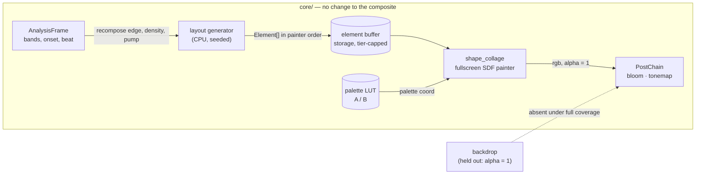

# 0113 — The engine paints a canvas

> **Status:** in-progress
> **Created:** 2026-08-25
> **Owner skill(s):** dev, human
> **Related ADRs:** [0123](../adrs/0123-a-flat-graphic-scene-paints-its-own-paper-and-composites-opaque-elements-in-one-pass.md)
> **Relates to:** [design-backlog 0069](../design-backlog.md) — partially advanced, not closed.

## TL;DR

A twelfth system, `shape_collage`, draws flat opaque elements — quads, bars, circles, triangles,
rings, lines, arcs, checker patches — on its own off-white paper, in painter order, from one
fullscreen distance-field pass. It is the engine's first **graphic** world rather than a luminous
one: no glow, no bloom, hard edges, solid colour, and a black bar that genuinely sits in front of a
red one. A seeded layout grammar composes the canvas; the music recomposes it on the beat, drifts
and rotates it continuously, populates and empties it, and pumps individual elements. The first
user-visible behaviour is a static Malevich rendering on screen at the end of Phase 1.

## Context & problem

The user asked to explore a visualisation system resembling Russian avant-garde painting — "solid
colors, objects" — supplying six references: three Malevich suprematist canvases, Malevich's
figurative constructivism, Kandinsky's *On White II*, and a Severini futurist collage. The
interview settled the target at **suprematist plus Kandinsky vocabulary**, a **mandatory light
ground**, **all four reactivity levers**, and a **seeded generated composition** rather than an
authored one.

The engine cannot draw this today, and the reason is structural rather than incidental. All eleven
systems emit premultiplied additive colour into a linear-light composite, and additive light has no
notion of one object being in front of another. `design-backlog 0069` files precisely this and
prices it as a composite redesign, which is why it has sat at **Low** priority since 2026-08-05.

ADR-0123 establishes that the price is wrong: a fullscreen scene emitting alpha 1 already holds the
backdrop out entirely (measured, Plan 0091 Phase 1), the tonemap is exactly the identity below
`KNEE = 0.6` so flat colour survives byte-identical, and bloom's threshold sits above that knee so
hard edges stay hard for free. The capability lands as a scene, with no composite change at all.

What remains genuinely uncertain is **cost**. The chosen draw path is O(elements) per pixel, and
the bounding-box reject removes the distance evaluation but not the loop step. That is a real risk
against the NFR floor tier, and this plan carries a stop gate for it rather than an assumption.

## Decision

We implement ADR-0123's fullscreen distance-field painter as a new `shape_collage` system. We
rejected **Alternative A** (instanced quads with `over` blending) because it needs a new blend state
and a "scene owns its clear colour" concept for a capability the fullscreen route delivers with
none, while still requiring the same distance functions; **Alternative B** (tile-binned compute
prepass) because it commits two passes, a bin buffer, an overflow policy and the engine's first
compute scene before anything is known about whether the plain loop suffices; **Alternative C**
(the `multiply` layer) because multiply is commutative and therefore cannot express occlusion at
all; and **Alternative D** (extending `shape_field`) because that scene's contour-band machinery is
exactly what a flat opaque element must switch off, and Plan 0098 is concurrently changing the file.

Two questions this plan deliberately does not answer up front. **Whether the cost is affordable** is
measured in Phase 2 and decided by a human in Phase 3, which can route the whole plan to
Alternative A or B. **Which layout grammar reads as a composition rather than confetti** is decided
in Phase 5 from rendered samples, not from prose.

## Architecture diagram



## Implementation phases

### Phase 1 — The painter draws a static canvas
- **Owner skill:** dev
- **What:** `shape_collage` exists as the twelfth system and renders a fixed, preset-authored
  element list through the fullscreen distance-field painter.
- **Files touched:** `core/src/render/scenes/shape_collage.rs` (new), `core/src/render/scenes/mod.rs`
  (factory + `draws_through_shared_line_renderer`), `core/src/preset/schema.rs` (`SystemKind`,
  `ALL`, `VARIANT_COUNT`, `param_names`), `presets/collage_suprematist.toml` (new),
  `core/tests/fixtures/`.
- **Done when:**
  - `shot --preset collage_suprematist` renders flat quads, circles and triangles on an off-white
    ground, in painter order, with no glow and no bloom halo.
  - **Occlusion is demonstrated, not assumed:** a test renders two overlapping elements in both
    array orders and asserts the overlap region takes the colour of the later element in each case,
    and that the two frames differ there. Order is the mechanism, so this is the assertion that
    proves it works.
  - **Flat colour is exact:** an element authored at a palette coordinate whose resolved brightest
    channel is at or below `KNEE` reads back from the capture at the value it was authored at, to
    within the display's own 8-bit quantisation and nothing more. This is a property, not a
    measurement — below the knee ADR-0046's curve is the identity, so any larger tolerance would be
    hiding something.
  - **The aspect comes from the render target** (ADR-0037). A circle element renders circular at
    **1280x800**, not only at 16:9. The dev box is 2048x1152 and the usual capture is 1920x1080 —
    both exactly 16:9 — so a test at those sizes cannot distinguish a target-derived aspect from a
    grid-derived one, and this system computes screen-destined geometry. The 16:10 case is the one
    that discriminates.
  - `cargo build` fails to compile until the new variant is added to every exhaustive match
    (`variant_roster_reminder` enforces this by construction).

### Phase 2 — What an element costs
- **Owner skill:** dev
- **What:** The cost instrument, sweeping element count, so Phase 3 has numbers instead of an
  argument.
- **Files touched:** `core/tests/collage_cost.rs` (new), `core/src/render/tier.rs` (the cap).
- **Done when:**
  - The test sweeps element count across at least 8, 16, 32, 64 and 128 at 1080p, renders each, and
    **prints per-frame cost with the adapter, driver, profile and window size named**.
  - **It asserts no threshold.** Per [ADR-0071](../adrs/0071-a-numeric-test-contract-states-a-property-or-names-its-machine.md)
    a frame time is a fact about a GPU and a driver, not about the code. Model this file on
    `core/tests/mark_cost.rs`, which is the in-tree precedent: it prints, it names its machine, and
    the only thing it asserts is that it genuinely measured different configurations.
  - **It skips on a software rasterizer with a printed notice** (ADR-0016's shape). A WARP reading
    says nothing about the iGPU floor in `docs/nfr.md` §7, and would be a number that looks like
    evidence and is not.
  - The element cap is a `TierConfig` field with `Floor` and `Rich` values, so no build can ship an
    unbounded loop. The values may be provisional at this phase; Phase 3 sets them.

### Phase 3 — The stop gate
- **Decided 2026-08-25: CONTINUE.** `TierConfig::collage_elements` is **Floor 40,
  Rich 96**. Two things the gate settled that the plan did not ask for, and that
  the content lane needs more than the verdict:
  - **The user's working density is 8 to 14 elements**, judged from rendered
    canvases at 8 / 14 / 32 / 64 / 128. Denser canvases were rejected **on sight,
    not on cost** — at 64 the forms stop reading as objects floating in space and
    start reading as a fragmented facet field, which is the Severini territory
    this plan puts out of scope. So the cost was never the binding constraint:
    the fidelity ceiling arrived well before the budget one.
  - **The cap was then set from the densest thing the plan still has to build**,
    not from the taste above and not from the budget — Kandinsky's *On White II*,
    which ADR-0123 counts at just above 40. The user chose to keep Phase 7 aimed
    at the painting rather than at their own density, so 40 sits **exactly on**
    that count. A `collage_onwhite` that needs a forty-first element moves this
    number; it must not be quietly truncated.
- **Owner skill:** human
- **What:** Read Phase 2's numbers and decide whether the fullscreen painter survives.
- **Done when:** The user has chosen one of three, and the choice is written into this plan:
  - **Continue** — the floor tier holds at least **32 elements** at 1080p inside the NFR §1 budget.
    32 is counted from the user's own references, not estimated: *Suprematist Composition* has
    roughly 35 elements and *On White II* above 40, so a canvas below this cannot render the target
    paintings. Set the two `TierConfig` values and proceed to Phase 4.
  - **Escalate to ADR-0123 Alternative A** (instanced quads) — if the wall is element count and the
    canvases are sparse. Phases 4 onward are unaffected; only `shape_collage.rs`'s draw path is
    rewritten, and Phase 1's tests still hold.
  - **Escalate to ADR-0123 Alternative B** (tile binning) — if neither element count nor coverage
    alone explains the cost. This is a new ADR and a new plan, not a phase here.

### Phase 4 — The layout generator and a sample sheet
- **Owner skill:** dev
- **What:** A seeded CPU layout grammar with three candidate strategies, plus the rendered sample
  sheet Phase 5 judges.
- **Files touched:** `core/src/render/scenes/shape_collage/layout.rs` (new),
  `core/tests/collage_layout.rs` (new), sample output under the scratch capture path.
- **Done when:**
  - Three grammars are selectable by parameter and documented in one sentence each:
    **anchor-and-satellites** (one or two dominant elements, the rest clustered around them),
    **diagonal-axis** (a dominant angle with elements distributed along and across it), and
    **size-hierarchy** (a power-law size distribution with position independent of size).
  - **The generator is deterministic**: the same seed and recomposition index produce a
    bit-identical element list, asserted directly. No wall-clock reads and no unseeded randomness
    (the cross-cutting determinism rule).
  - **It allocates once.** The element vector is preallocated to the tier cap at scene construction
    and reused by `clear()` + `push()`; a test asserts capacity does not change across a thousand
    recompositions.
  - A sample sheet renders at least 5 seeds x 3 grammars at 1080p, one image per cell, ready for a
    human to compare side by side.

### Phase 5 — The composition call
- **Owner skill:** human
- **What:** Pick the grammar (or the combination) that reads as a painting, from Phase 4's images.
- **Done when:** The user has named the winning grammar and the plan records the choice plus, in one
  or two sentences, **what made the losers lose** — that reason is what the content lane will need
  and is the half that gets lost if only the verdict is written down.

### Phase 6 — The music moves the canvas
- **Owner skill:** dev
- **What:** All four reactivity levers, on the chosen grammar's element list.
- **Files touched:** `core/src/render/scenes/shape_collage/`, `presets/collage_suprematist.toml`.
- **Done when:**
  - **Recomposition:** a rising edge on a bound `recompose` expression re-runs the generator with
    the next seed. `recompose_blend` at 0 hard-cuts; above 0 it crossfades over that many seconds.
  - **Drift and spin:** per-element velocity and angular velocity, assigned at generation from the
    seed and integrated by the **injected real `dt`** — never a fixed per-frame constant. A test
    asserts that stepping 1 second as 60 frames and as 30 frames lands elements in the same place
    to within float tolerance.
  - **Spawn and decay:** `density` gates what fraction of the generated list is live, with elements
    fading in and out by age. Birth order is stable, so raising `density` never reorders or pops an
    already-live element — asserted.
  - **Per-element pumping:** `pump_size` and `pump_alpha` modulate individual elements, **phase-
    offset by element index** so the canvas does not breathe in unison. The property to assert is
    that at a given instant the modulation values across live elements are not all equal — a
    threshold on their spread would be inventing a number.
  - The preset passes `reactivity`, which is the **only** one of the five gates that drives real PCM
    through the analyzer; the other four synthesize their frames and would not notice a canvas that
    ignored the music.

### Phase 7 — The Kandinsky vocabulary
- **Owner skill:** dev
- **What:** The rest of the element roster, taking the system from suprematist to *On White II*.
- **Files touched:** `core/src/render/scenes/shape_collage/sdf.rs`, `presets/collage_onwhite.toml`
  (new).
- **Done when:**
  - `bar`, `ring`, `segment`, `arc` and `checker` join `quad`, `circle` and `triangle`, each with
    an exact axis-aligned bounding box — a loose box is a silent cost regression on the Phase 2
    measurement, so the box is asserted to be tight for every kind.
  - Per-element `alpha` below 1 produces a translucent crossing: where two elements overlap the
    result is the `over` composite of both, and a test asserts the crossing region differs from
    both parents' solid colour.
  - `presets/collage_onwhite.toml` ships and passes all five gates.
  - **Re-run Phase 2's cost sweep** after the roster lands. The roster puts a branch in the painter
    loop, which is the same hazard `mark_cost.rs` was written for; a roster added without
    re-measuring silently spends Phase 3's budget.

### Phase 8 — Documentation and the shipped set
- **Owner skill:** dev
- **What:** The operator-doc sweep and the golden baselines.
- **Files touched:** `presets/README.md`, `docs/presets.md`, `docs/preset-palettes.md`,
  `README.md`, `core/tests/golden/`.
- **Done when:**
  - **`presets/README.md` carries the complete `shape_collage` param roster** and its structural
    table. This row is load-bearing for the `preset-author` lane, which keeps no catalogue of its
    own and authors against this file.
  - **`docs/preset-palettes.md` states the knee constraint in authoring terms** — that a
    `shape_collage` preset keeps its palette below linear 0.6 to stay flat and bloom-free, and that
    the paper is off-white by construction because `f(1.0) = 0.800`. An author who does not know
    this will reach for a brighter palette and lose the look without being told why.
  - `docs/presets.md` gains any new expression-grammar surface this plan introduced, or the plan
    records that it introduced none.
  - Golden baselines exist for both shipped presets, blessed on **hardware**, and the bless is
    scoped — unrelated baselines are restored before committing.

## Data shapes

```rust
// illustrative — not the final interface
/// One flat element. 64 bytes, 16-byte aligned; the array is the painter's
/// order, so index IS depth. Colour is a PALETTE COORDINATE, not an RGB triple,
/// so ADR-0086/0102 and the A/B crossfade apply unchanged.
#[repr(C)]
#[derive(Clone, Copy, bytemuck::Pod, bytemuck::Zeroable)]
struct Element {
    center_size: [f32; 4], // cx, cy, half_x, half_y  (target-aspect space)
    shape:       [f32; 4], // angle, kind, p0, p1     (p0/p1 kind-specific)
    tint:        [f32; 4], // palette_coord, alpha, birth, spare
    aabb:        [f32; 4], // x0, y0, x1, y1          (precomputed reject box)
}
```

At the reference density this is small: 128 elements is 8 KB of storage buffer, so buffer size is
not a constraint anywhere in this plan. The cost is entirely per-pixel loop traffic.

The provisional parameter surface, for Phase 8's roster: `paper`, `count`, `density`, `scale`,
`size_hierarchy`, `angle_bias`, `drift`, `spin`, `recompose`, `recompose_blend`, `pump_size`,
`pump_alpha`, `palette_shift`, `color_span`, `opacity`, `edge_softness`, `seed`, `roster`.

## Risks & open questions

- **The per-pixel loop is the plan's real risk.** The bounding-box reject saves the distance
  evaluation but not the loop step, so a wavefront walks every element regardless. Phase 2 measures
  it and Phase 3 can stop the plan. This is the risk the phase order exists to expose early.
- **The generator may produce confetti.** A seeded layout that satisfies every statistic can still
  fail to read as a composition, and no test can tell us. Phase 5 is a human gate for exactly this,
  and Phase 4 spends its effort on making three candidates comparable rather than on making one
  good.
- **Recomposition may read as a glitch rather than a cut.** Hard-cutting a whole canvas on a beat is
  visually violent. `recompose_blend` exists as the lever; if neither extreme works, the finding is
  content-lane feedback, not an engine defect.
- **The beat clock counts onsets, not beats** ([ADR-0109](../adrs/0109-the-beat-clock-counts-onsets-not-beats.md)),
  at 1.7–2.1x. A `recompose` bound to `beat_index` will fire roughly twice as often as the music's
  beat, and Plan 0095 is the fix in flight. Author the shipped presets knowing this, and do not
  compensate for it inside the scene — that would have to be unwound when 0095 lands.
- **The aspect hazard has shipped three times in this repo.** This system computes screen-destined
  geometry from a normalized space, which is exactly the shape of the bug. Phase 1's 1280x800 check
  is the guard; keep it.
- **No allocation in the render path.** The generator runs on the render thread at recomposition,
  not in the audio callback, so the audio rule is not at stake — but a per-recomposition `Vec`
  reallocation would still spike a frame. Phase 4 asserts capacity stability.

## What this plan does NOT do

- **It does not close `design-backlog 0069`.** Occlusion works *within* one `shape_collage` scene;
  a collage element and a `swarm` particle still have no ordering relationship. That entry stays
  live and takes a dated update at this plan's close naming the half that moved.
- **It does not add engine-wide depth, sorting or a render graph.** ADR-0018 and ADR-0031 rejected
  the render graph twice and both rejections stand.
- **It does not deliver Malevich's figurative constructivism** (reference image 1). Figures
  assembled from colour blocks are authored bespoke geometry, which is
  [Plan 0092](0092-the-engine-draws-an-authored-path.md)'s territory.
- **It does not deliver the Severini collage** (reference image 5). A dense fragmented-facet field
  is a subdivision mechanism, not a shape roster, and would be its own ADR.
- **It does not add `paper_alpha`**, so `shape_collage` composes as the lower ADR-0090 layer only.
  Filed as a followup rather than built, because nothing in the reference set needs it.
- **It does not retune the existing library** for the tonemap knee. `design-backlog 0038` owns that.

## Implementation log

> Written by `dev` — one row per phase as that phase's commit lands.

**Lane:** branch `plan-0113-shape-collage`, worktree `WORK/lmv-plan-0113`.

| phase | owner | state | commit |
|---|---|---|---|
| 1 — The painter draws a static canvas | dev | done | 046b9f3 |
| 2 — What an element costs | dev | done | 6038d25 |
| 3 — The stop gate | human | **continue** | de69a52 |
| 4 — The layout generator and a sample sheet | dev | done | committed with this row |
| 5 — The composition call | human | not started | |
| 6 — The music moves the canvas | dev | not started | |
| 7 — The Kandinsky vocabulary | dev | not started | |
| 8 — Documentation and the shipped set | dev | not started | |

### Notes

**Phase 1 — files outside the phase's list.** Five test files and one doc were
touched that the phase does not name, each because a gate fires the moment the
twelfth variant exists rather than at the phase that would have owned it:

- `core/tests/{animation,reactivity,sanity,geometry_extent}.rs` — exhaustive
  `SystemKind` matches, which is the mechanism the phase's own last done-when
  describes. `sanity.rs` also needed a `coverage_floor` value; it is inherited
  from `FragmentField` on `ShapeField`'s and `WarpMesh`'s structural argument,
  and the arm records that coverage cannot judge this family at all — a
  `shape_collage` canvas lights every pixel by construction.
- `core/tests/golden.rs` — the exhaustive fixture roster.
- `presets/README.md` — Phase 8's file.
  `every_declared_param_is_documented_in_the_presets_readme` fails as soon as a
  param is declared, so the roster row and a `shape_collage` section landed here
  instead. Phase 7 and Phase 8 extend both.

**Phase 1 — deviations.**

- **The shipped preset carries motion and a band binding the plan does not
  introduce until Phase 6.** All five gates sweep every embedded preset, so a
  preset that ships in Phase 1 is held to `animation` and `reactivity` in
  Phase 1. `scale`'s slow breath alone measured **0.0006** against the animation
  gate's `0.01` floor, so `pan_x`/`pan_y` were added as a whole-canvas float
  (**0.0219**), and `saturation` on the top end was added after the first
  reactivity reading came in at **0.0209** against a `0.02` floor
  (now **0.0342**). Both are marked in the preset as placeholders for Phase 6's
  levers.
- **The element struct's `shape` field carries `[cos, sin, kind, p0]`, not the
  plan's `[angle, kind, p0, p1]`**, and `p1` moved to `tint.w`. The plan calls
  the struct illustrative; the reason for the change is that an angle costs a
  trig pair per pixel per element in the innermost loop, and puts the geometry on
  `sin`'s implementation-defined precision, which ADR-0096 rules out elsewhere.
  Size and alignment are unchanged at 64 bytes.
- **The scene carries a `#[cfg(test)]` element-array override.** The done-when
  requires two overlapping elements rendered in *both* array orders, and no
  preset can reverse a compiled-in roster. It does not exist in a shipped build
  (`Scene::feedback_field`'s argument).

**Phase 2 — files outside the phase's list.** `core/src/render/tier.rs`'s
`collage_elements` landed in Phase 1, because the scene's constructor sizes its
storage buffer from it. `core/src/render/context.rs` and `core/src/render/mod.rs`
gained a `Renderer::adapter_description()`: the phase requires the report to name
its adapter and driver, and no accessor existed — `RenderContext` kept only the
`is_software` flag. Nothing on a render path reads it.

**Phase 2 — the reading, and what it was taken on.** The full table is in
`core/tests/collage_cost.rs`'s module docs. The one thing the plan should carry
into Phase 3: **`Renderer::new_headless` asks for no power preference, so on this
box it selected the AMD *integrated* GPU rather than the discrete one.** That is
not the machine `mark_cost.rs` recorded its table on (an RTX 3080 Laptop), and it
is much the closer model of what `docs/nfr.md` §1's floor tier targets — read the
numbers as an optimistic floor-tier reading, on an iGPU a decade newer than the
one the tier is quoted against.

**Phase 4 — deviations.**

- **A fourth `layout` option was added: the authored canvas, as a control**, and
  it is the default. The plan implies the grammar replaces Phase 1's element
  list; it does not. Two reasons, and the second is the load-bearing one: the
  golden baseline and the shipped preset would otherwise move underneath Phase 5
  rather than after it, and the authored canvas is **the only composition a human
  has approved** — the Phase 3 gate judged it at 8 and 14 elements and chose that
  density from it. A sample sheet of three generated candidates with nothing to
  judge them against is how a gate picks the best of three bad options. Golden
  re-ran clean without a re-bless, which is the evidence the control is byte-for-byte
  Phase 1's canvas.
- **The plan's two list-level done-whens are asserted in the unit tests, not in
  `core/tests/collage_layout.rs`.** Bit-identical output for an equal recipe, and
  capacity across a thousand recompositions, are claims about the element array,
  which an integration test cannot see without making `Element` and `generate`
  public — a real widening of the crate's surface for a test's convenience
  (`marks` is `pub(crate)` for the same reason). The integration test asserts what
  only it can: that the whole path from preset to pixel carries a seed and a
  grammar to the frame. Both files say which half they hold.
- **`presets/README.md` again**, for Phase 1's reason — four new params, and the
  documentation gate fires when they are declared.

**Phase 4 — the first three grammars were wrong and were rewritten before the
sheet was rendered.** Worth recording because the defect is not one a test would
have caught and the gate would have judged it as if it were the grammar: every
element was sized as though its half-extent were a full extent, so a "dominant"
form came out ~1.5 canvas units across — a near-square slab — and the canvases
read as four slabs in a corner. The fix is a rule taken from the authored canvas
rather than invented (`draw_extents`): **the elongation ceiling falls as an
element grows**, so a large element is necessarily a bar and only a small one is
blocky, which is what the reference canvases do. A second pass added `place`,
because clamping an element's *centre* to the canvas lets a 0.7-unit bar hang
half off the edge.

**Phase 3 — a correction to the numbers the gate was first shown.** The sweep was
retargeted to the shipped cap (rungs `8/16/24/32/40`; above the cap
`applied_count` clamps, so two rungs there would render one canvas and the
instrument's own non-vacuity assertion would fire). Re-measured, **every rung
came in about 4 ms cheaper than the pre-Phase-3 sweep reported** — 32 elements
reads 26 % of the 60 Hz budget where the first table said 45 %. Nothing about the
8- or 32-element cases changed; the *sweep* went from ~20 s of GPU work to ~2 s,
and this box's adapter is a **power-shared integrated GPU** whose clocks drop
under sustained load. The interleaving protected the comparison — both sweeps
agree the cost is linear — but not the absolute numbers. `collage_cost.rs` carries
the finding and both tables. **The gate's verdict is unaffected**, and in the
safe direction: the cap it chose is cheaper than it was told.

**Phase 3 — followup, not fixed here.** `shape_collage::applied_count` clamps to
the cap **silently**, where ADR-0007 requires `max_segments` surface a
`CapOverflow` rather than cut geometry without saying so. That was harmless while
the cap sat far above any authored canvas; it is not harmless now that Phase 7's
target sits exactly on it. Not fixed in this phase because the surfaced channel is
`CapOverflow`, whose `OverflowContext` enum is shared with the line scenes —
widening it is an architect call. Recorded under Followups.

**Phase 1 — observation for the review.** The animation gate's `footprint_diff`
statistic (ADR-0091) exists so a sparse figure's motion is not diluted into the
empty frame around it — it means over the *lit* pixels only. A `shape_collage`
canvas lights every pixel, because the paper is the ground, so its footprint is
the whole frame and the dilution ADR-0091 removed returns by another door: the
gate reads a full-coverage graphic scene the way the pre-0091 gate read
everything. The number this preset ships at was chosen against that floor.

### Close triggers

- **`presets/` touched:**
- **Plan header `Closes:`** none
- **What shipped:**
- **Operator docs touched:**
- **Backlog probes (`node scripts/check-backlog-claims.mjs`):**
- **Outstanding `human` phases:**

## Followups (after this lands)

- **The collage element cap clamps silently.** ADR-0007 requires a cap never be a
  silent cut, and `max_segments` surfaces a `CapOverflow` for exactly this; the
  collage cap does not, and since Phase 3 it sits exactly on the element count
  Phase 7's `collage_onwhite` needs. Widening `OverflowContext` is an architect
  call because that enum is shared with the line scenes.
- `paper_alpha`, so a collage can sit as the upper ADR-0090 layer.
- A dated update on `design-backlog 0069` recording that in-scene occlusion now exists and
  cross-scene ordering does not.
- Malevich's figurative constructivism, once Plan 0092's authored path lands.
- The Severini subdivision field, if the canvas proves the style is worth extending.
