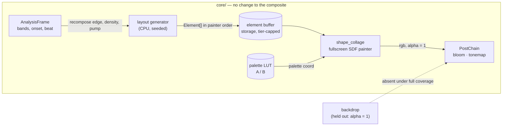

# 0113 — The engine paints a canvas

> **Status:** in-progress
> **Created:** 2026-08-25
> **Owner skill(s):** dev, human
> **Related ADRs:** [0123](../adrs/0123-a-flat-graphic-scene-paints-its-own-paper-and-composites-opaque-elements-in-one-pass.md)
> **Relates to:** [design-backlog 0069](../design-backlog.md) — partially advanced, not closed.
> **Amended 2026-08-25:** **Phase 6b added**, and Phase 6 is now blocked on
> [Plan 0116](done/0116-the-sanity-lens-finds-the-ground.md) / [ADR-0126](../adrs/0126-the-sanity-lens-measures-departure-from-the-frames-own-ground.md).
> Phase 1's `coverage_floor` arm correctly found that this family's lit fraction is `1.0` by
> construction and leaned on `MAX_TONAL_FLATNESS` as the rescue; that rescue is read only at `LOUD`,
> where Phase 6's `density` holds the canvas at its fullest, so the emptying canvas Phase 6 builds is
> measured by nothing. Phases 1-5 and 7-8 are unaffected.
> **Unblocked 2026-08-26:** Plan 0116 closed, `sanity` now derives its reference per capture, and its
> Phase 6 fixture demonstrates the emptied-canvas conviction on a synthetic stand-in. Two obligations
> pass to this plan, both because `ShapeCollage` does not exist on that branch: `coverage_floor` needs
> a `ShapeCollage` arm **derived from the printed distribution** at half the family minimum like every
> other floor (never inherited from `FragmentField`, whose `0.50` is now `0.08`), and Phase 6b should
> replace the synthetic fixture's role with the real family where it can.

## TL;DR

A twelfth system, `shape_collage`, draws flat opaque elements — quads, bars, circles, triangles,
rings, lines, arcs, checker patches — on its own off-white paper, in painter order, from one
fullscreen distance-field pass. It is the engine's first **graphic** world rather than a luminous
one: no glow, no bloom, hard edges, solid colour, and a black bar that genuinely sits in front of a
red one. A seeded layout grammar composes the canvas; the music recomposes it on the beat, drifts
and rotates it continuously, populates and empties it, and pumps individual elements. The first
user-visible behaviour is a static Malevich rendering on screen at the end of Phase 1.

## Context & problem

The user asked to explore a visualisation system resembling Russian avant-garde painting — "solid
colors, objects" — supplying six references: three Malevich suprematist canvases, Malevich's
figurative constructivism, Kandinsky's *On White II*, and a Severini futurist collage. The
interview settled the target at **suprematist plus Kandinsky vocabulary**, a **mandatory light
ground**, **all four reactivity levers**, and a **seeded generated composition** rather than an
authored one.

The engine cannot draw this today, and the reason is structural rather than incidental. All eleven
systems emit premultiplied additive colour into a linear-light composite, and additive light has no
notion of one object being in front of another. `design-backlog 0069` files precisely this and
prices it as a composite redesign, which is why it has sat at **Low** priority since 2026-08-05.

ADR-0123 establishes that the price is wrong: a fullscreen scene emitting alpha 1 already holds the
backdrop out entirely (measured, Plan 0091 Phase 1), the tonemap is exactly the identity below
`KNEE = 0.6` so flat colour survives byte-identical, and bloom's threshold sits above that knee so
hard edges stay hard for free. The capability lands as a scene, with no composite change at all.

What remains genuinely uncertain is **cost**. The chosen draw path is O(elements) per pixel, and
the bounding-box reject removes the distance evaluation but not the loop step. That is a real risk
against the NFR floor tier, and this plan carries a stop gate for it rather than an assumption.

## Decision

We implement ADR-0123's fullscreen distance-field painter as a new `shape_collage` system. We
rejected **Alternative A** (instanced quads with `over` blending) because it needs a new blend state
and a "scene owns its clear colour" concept for a capability the fullscreen route delivers with
none, while still requiring the same distance functions; **Alternative B** (tile-binned compute
prepass) because it commits two passes, a bin buffer, an overflow policy and the engine's first
compute scene before anything is known about whether the plain loop suffices; **Alternative C**
(the `multiply` layer) because multiply is commutative and therefore cannot express occlusion at
all; and **Alternative D** (extending `shape_field`) because that scene's contour-band machinery is
exactly what a flat opaque element must switch off, and Plan 0098 is concurrently changing the file.

Two questions this plan deliberately does not answer up front. **Whether the cost is affordable** is
measured in Phase 2 and decided by a human in Phase 3, which can route the whole plan to
Alternative A or B. **Which layout grammar reads as a composition rather than confetti** is decided
in Phase 5 from rendered samples, not from prose.

## Architecture diagram



## Implementation phases

### Phase 1 — The painter draws a static canvas
- **Owner skill:** dev
- **What:** `shape_collage` exists as the twelfth system and renders a fixed, preset-authored
  element list through the fullscreen distance-field painter.
- **Files touched:** `core/src/render/scenes/shape_collage.rs` (new), `core/src/render/scenes/mod.rs`
  (factory + `draws_through_shared_line_renderer`), `core/src/preset/schema.rs` (`SystemKind`,
  `ALL`, `VARIANT_COUNT`, `param_names`), `presets/collage_suprematist.toml` (new),
  `core/tests/fixtures/`.
- **Done when:**
  - `shot --preset collage_suprematist` renders flat quads, circles and triangles on an off-white
    ground, in painter order, with no glow and no bloom halo.
  - **Occlusion is demonstrated, not assumed:** a test renders two overlapping elements in both
    array orders and asserts the overlap region takes the colour of the later element in each case,
    and that the two frames differ there. Order is the mechanism, so this is the assertion that
    proves it works.
  - **Flat colour is exact:** an element authored at a palette coordinate whose resolved brightest
    channel is at or below `KNEE` reads back from the capture at the value it was authored at, to
    within the display's own 8-bit quantisation and nothing more. This is a property, not a
    measurement — below the knee ADR-0046's curve is the identity, so any larger tolerance would be
    hiding something.
  - **The aspect comes from the render target** (ADR-0037). A circle element renders circular at
    **1280x800**, not only at 16:9. The dev box is 2048x1152 and the usual capture is 1920x1080 —
    both exactly 16:9 — so a test at those sizes cannot distinguish a target-derived aspect from a
    grid-derived one, and this system computes screen-destined geometry. The 16:10 case is the one
    that discriminates.
  - `cargo build` fails to compile until the new variant is added to every exhaustive match
    (`variant_roster_reminder` enforces this by construction).

### Phase 2 — What an element costs
- **Owner skill:** dev
- **What:** The cost instrument, sweeping element count, so Phase 3 has numbers instead of an
  argument.
- **Files touched:** `core/tests/collage_cost.rs` (new), `core/src/render/tier.rs` (the cap).
- **Done when:**
  - The test sweeps element count across at least 8, 16, 32, 64 and 128 at 1080p, renders each, and
    **prints per-frame cost with the adapter, driver, profile and window size named**.
  - **It asserts no threshold.** Per [ADR-0071](../adrs/0071-a-numeric-test-contract-states-a-property-or-names-its-machine.md)
    a frame time is a fact about a GPU and a driver, not about the code. Model this file on
    `core/tests/mark_cost.rs`, which is the in-tree precedent: it prints, it names its machine, and
    the only thing it asserts is that it genuinely measured different configurations.
  - **It skips on a software rasterizer with a printed notice** (ADR-0016's shape). A WARP reading
    says nothing about the iGPU floor in `docs/nfr.md` §7, and would be a number that looks like
    evidence and is not.
  - The element cap is a `TierConfig` field with `Floor` and `Rich` values, so no build can ship an
    unbounded loop. The values may be provisional at this phase; Phase 3 sets them.

### Phase 3 — The stop gate
- **Decided 2026-08-25: CONTINUE.** `TierConfig::collage_elements` is **Floor 40,
  Rich 96**. Two things the gate settled that the plan did not ask for, and that
  the content lane needs more than the verdict:
  - **The user's working density is 8 to 14 elements**, judged from rendered
    canvases at 8 / 14 / 32 / 64 / 128. Denser canvases were rejected **on sight,
    not on cost** — at 64 the forms stop reading as objects floating in space and
    start reading as a fragmented facet field, which is the Severini territory
    this plan puts out of scope. So the cost was never the binding constraint:
    the fidelity ceiling arrived well before the budget one.
  - **The cap was then set from the densest thing the plan still has to build**,
    not from the taste above and not from the budget — Kandinsky's *On White II*,
    which ADR-0123 counts at just above 40. The user chose to keep Phase 7 aimed
    at the painting rather than at their own density, so 40 sits **exactly on**
    that count. A `collage_onwhite` that needs a forty-first element moves this
    number; it must not be quietly truncated.
- **Owner skill:** human
- **What:** Read Phase 2's numbers and decide whether the fullscreen painter survives.
- **Done when:** The user has chosen one of three, and the choice is written into this plan:
  - **Continue** — the floor tier holds at least **32 elements** at 1080p inside the NFR §1 budget.
    32 is counted from the user's own references, not estimated: *Suprematist Composition* has
    roughly 35 elements and *On White II* above 40, so a canvas below this cannot render the target
    paintings. Set the two `TierConfig` values and proceed to Phase 4.
  - **Escalate to ADR-0123 Alternative A** (instanced quads) — if the wall is element count and the
    canvases are sparse. Phases 4 onward are unaffected; only `shape_collage.rs`'s draw path is
    rewritten, and Phase 1's tests still hold.
  - **Escalate to ADR-0123 Alternative B** (tile binning) — if neither element count nor coverage
    alone explains the cost. This is a new ADR and a new plan, not a phase here.

### Phase 4 — The layout generator and a sample sheet
- **Owner skill:** dev
- **What:** A seeded CPU layout grammar with three candidate strategies, plus the rendered sample
  sheet Phase 5 judges.
- **Files touched:** `core/src/render/scenes/shape_collage/layout.rs` (new),
  `core/tests/collage_layout.rs` (new), sample output under the scratch capture path.
- **Done when:**
  - Three grammars are selectable by parameter and documented in one sentence each:
    **anchor-and-satellites** (one or two dominant elements, the rest clustered around them),
    **diagonal-axis** (a dominant angle with elements distributed along and across it), and
    **size-hierarchy** (a power-law size distribution with position independent of size).
  - **The generator is deterministic**: the same seed and recomposition index produce a
    bit-identical element list, asserted directly. No wall-clock reads and no unseeded randomness
    (the cross-cutting determinism rule).
  - **It allocates once.** The element vector is preallocated to the tier cap at scene construction
    and reused by `clear()` + `push()`; a test asserts capacity does not change across a thousand
    recompositions.
  - A sample sheet renders at least 5 seeds x 3 grammars at 1080p, one image per cell, ready for a
    human to compare side by side.

### Phase 5 — The composition call
- **Decided 2026-08-25: `diagonal-axis` wins, with `size-hierarchy`'s spread
  folded into it.** Judged from 20 rendered cells (4 strategies x 5 seeds at
  1080p), then from a 16-cell head-to-head of the two finalists at 8 seeds.
  **What made the losers lose**, which is the half that does not survive as a
  verdict alone:
  - **`anchor-and-satellites` leaves the canvas half empty.** Its satellites orbit
    one off-centre point, so the composition sits in a region and a large part of
    the frame stays bare — a picture with a subject, but not one that uses the
    canvas.
  - **`size-hierarchy` reads as scattered rather than composed.** Position is
    independent of size by construction, which is the grammar's whole definition,
    and the consequence is that nothing relates to anything: a range of sizes with
    no structure holding them together.
  - **`diagonal-axis` wins because the dominant angle *is* the suprematist
    organising principle** — the reference canvases are built on it, so this
    grammar inherits their structure while the other two have to invent one.
  - **But it did not win outright**, and the combination is the verdict rather
    than a tune: `size-hierarchy` used the *frame* better. `diagonal-axis` hugged
    its axis so tightly that a canvas read as one band across the middle with the
    top and bottom empty. So the across-axis spread and the angle jitter are the
    runner-up's; the placement is the winner's.
- **A defect the gate found, which no test would have.** The band ran at about
  **-15 deg while `angle_bias` asked for -22**, because the axis direction was
  rotated in unit space and *then* scaled anisotropically by the canvas's own
  shape, while each element's rotation was applied afterwards and was not. The
  elements and the band they were distributed along were at different angles.
  Fixed in `layout::reach`; only a rendered canvas shows this.
- **Owner skill:** human
- **What:** Pick the grammar (or the combination) that reads as a painting, from Phase 4's images.
- **Done when:** The user has named the winning grammar and the plan records the choice plus, in one
  or two sentences, **what made the losers lose** — that reason is what the content lane will need
  and is the half that gets lost if only the verdict is written down.

### Phase 6 — The music moves the canvas
- **Owner skill:** dev
- **What:** All four reactivity levers, on the chosen grammar's element list.
- **Files touched:** `core/src/render/scenes/shape_collage/`, `presets/collage_suprematist.toml`.
- **Done when:**
  - **Recomposition:** a rising edge on a bound `recompose` expression re-runs the generator with
    the next seed. `recompose_blend` at 0 hard-cuts; above 0 it crossfades over that many seconds.
  - **Drift and spin:** per-element velocity and angular velocity, assigned at generation from the
    seed and integrated by the **injected real `dt`** — never a fixed per-frame constant. A test
    asserts that stepping 1 second as 60 frames and as 30 frames lands elements in the same place
    to within float tolerance.
  - **Spawn and decay:** `density` gates what fraction of the generated list is live, with elements
    fading in and out by age. Birth order is stable, so raising `density` never reorders or pops an
    already-live element — asserted.
  - **Per-element pumping:** `pump_size` and `pump_alpha` modulate individual elements, **phase-
    offset by element index** so the canvas does not breathe in unison. The property to assert is
    that at a given instant the modulation values across live elements are not all equal — a
    threshold on their spread would be inventing a number.
  - The preset passes `reactivity`, which is the **only** one of the five gates that drives real PCM
    through the analyzer; the other four synthesize their frames and would not notice a canvas that
    ignored the music.

> **Blocked on [Plan 0116](done/0116-the-sanity-lens-finds-the-ground.md), added 2026-08-25.** This phase
> builds a canvas the music empties, and **no gate in this repo can currently see that state.**
> `sanity` reads `tonal_flatness` only at `LOUD`, where `density` holds the canvas at its fullest;
> the quiet capture buys only `MODERATE_MIN_COVERAGE`, which is degenerate for this family because
> the paper makes `coverage` exactly `1.0000` — measured on this branch's own committed golden,
> which reads `coverage 1.0000, tonal_flatness 0.7577`. A canvas the music emptied correctly and one
> that is broken and drew no elements are the same flat sheet of paper. **Do not weaken `density`'s
> range to keep the gate green** — that is tuning content to a lens ADR-0126 has already ruled
> wrong. See Phase 6b.

### Phase 6b — The canvas is measured against its own paper

- **Owner skill:** dev
- **What:** Adopt [Plan 0116](done/0116-the-sanity-lens-finds-the-ground.md)'s derived ground for this
  family, and retire the placeholder reasoning this branch shipped in Phase 1.
- **Depends on:** Plan 0116 Phase 3 having landed. If it has not, **stop and say so** rather than
  proceeding — Phase 7 does not depend on this and can be taken first.
- **Files touched:** `core/tests/sanity.rs`, `presets/collage_suprematist.toml` (only if Phase 5
  adjudicates it defective — not to satisfy a threshold).
- **Done when:**
  - The `coverage_floor` arm for `ShapeCollage` no longer rests on the premise that *"its lit
    fraction is 1.0 by construction"*. After Plan 0116 Phase 3 that premise is false, and the
    comment written here in Phase 1 is re-pointed rather than left standing as the reason for an
    inherited `0.50`.
  - The floor is re-derived from the family's own measured distribution by the rule beside it, as
    Plan 0116 Phase 4 does for every other system.
  - A capture at `density` low enough that no elements are live is **convicted**, and the assertion
    demonstrably fails if reverted onto the `BLACK` predicate.
  - **No threshold is invented for how sparse a legitimate canvas may be.** The property asserted is
    that a bare ground and a composed canvas are separated; where a suprematist composition stops
    being sparse and starts being empty is a content judgement and stays one.

### Phase 7 — The Kandinsky vocabulary
- **Owner skill:** dev
- **What:** The rest of the element roster, taking the system from suprematist to *On White II*.
- **Files touched:** `core/src/render/scenes/shape_collage/sdf.rs`, `presets/collage_onwhite.toml`
  (new).
- **Done when:**
  - `bar`, `ring`, `segment`, `arc` and `checker` join `quad`, `circle` and `triangle`, each with
    an exact axis-aligned bounding box — a loose box is a silent cost regression on the Phase 2
    measurement, so the box is asserted to be tight for every kind.
  - Per-element `alpha` below 1 produces a translucent crossing: where two elements overlap the
    result is the `over` composite of both, and a test asserts the crossing region differs from
    both parents' solid colour.
  - `presets/collage_onwhite.toml` ships and passes all five gates.
  - **Re-run Phase 2's cost sweep** after the roster lands. The roster puts a branch in the painter
    loop, which is the same hazard `mark_cost.rs` was written for; a roster added without
    re-measuring silently spends Phase 3's budget.

### Phase 8 — Documentation and the shipped set
- **Owner skill:** dev
- **What:** The operator-doc sweep and the golden baselines.
- **Files touched:** `presets/README.md`, `docs/presets.md`, `docs/preset-palettes.md`,
  `README.md`, `core/tests/golden/`.
- **Done when:**
  - **`presets/README.md` carries the complete `shape_collage` param roster** and its structural
    table. This row is load-bearing for the `preset-author` lane, which keeps no catalogue of its
    own and authors against this file.
  - **`docs/preset-palettes.md` states the knee constraint in authoring terms** — that a
    `shape_collage` preset keeps its palette below linear 0.6 to stay flat and bloom-free, and that
    the paper is off-white by construction because `f(1.0) = 0.800`. An author who does not know
    this will reach for a brighter palette and lose the look without being told why.
  - `docs/presets.md` gains any new expression-grammar surface this plan introduced, or the plan
    records that it introduced none.
  - Golden baselines exist for both shipped presets, blessed on **hardware**, and the bless is
    scoped — unrelated baselines are restored before committing.

### Phase 9 — The Mode 4 repairs

> **Added 2026-08-26 by the close review**, on the [Plan 0095](done/0095-the-downbeat-fold-gets-a-musical-beat.md)
> precedent: findings that need code become a phase rather than a paragraph, so the session that
> fixes them reads them in the plan it is already holding. Phases 1-8 landed cleanly and the
> workspace is green (993 tests) on the merged lane; nothing below reverses a decision.

- **Owner skill:** dev
- **What:** The three `major` findings from the close review, plus the four documentation `minor`s.
  Independent of Phase 6b and takeable in either order.
- **Files touched:** `docs/preset-palettes.md`, `presets/README.md`,
  `presets/collage_suprematist.toml`, `core/tests/fixtures/shape_collage.toml`,
  `core/src/render/scenes/shape_collage.rs`, `core/src/render/tier.rs`, `docs/preset-guide.md`,
  `docs/design-backlog.md`.
- **Done when:**
  - **The colour promise states what the knee actually buys.** Five sites say a colour under the
    knee *"reaches the display byte-identical"* / *"as authored"* / *"untouched"*:
    `docs/preset-palettes.md` (the `shape_collage` section), `presets/README.md`,
    `presets/collage_suprematist.toml`, `core/tests/fixtures/shape_collage.toml`, and
    `shape_collage.rs`'s module docs. It is false and the same file already says so 750 lines up:
    a hex stop is a **linear coefficient with no sRGB decode**, so the display byte is its sRGB
    *encoding*. Measured on the shipped preset: `#111111` renders `#494949`, `#8a1420` renders
    `#BF5164`, `#d9d5c8` renders `#E2E0DA`. The true claim — and the one the look rests on — is that
    below the knee the **tonemap** is the identity, so the fill survives the post chain **unshaded
    and halo-free**. Fix all five together; half a repair leaves the tree contradicting itself.
    `an_element_under_the_knee_arrives_at_the_value_it_was_authored_at` is already correct (it
    asserts `encoded(hex/255)`) and must not be changed to match the prose.
  - **`core/src/render/tier.rs` stops quoting the sweep it forbids quoting.** The paragraph reading
    *"the user's working density is 8 to 14 elements — where the canvas costs 36-39 %"* takes those
    figures from the pre-Phase-3 throttled sweep, five lines under the sentence that says **do not
    quote it**. The shipped table in the same comment reads 12.7 % at 8 and 16.8 % at 16; a re-run
    on 2026-08-26 read **7.3 % at 8 and 18.2 % at 40**. Replace with a figure the comment's own
    table supports.
  - **`Element::build` allocates nothing.** Its `segment`/`arc` arm builds a `Vec::with_capacity(9)`,
    and `compose()` calls `Element::build` for every live element **every frame**
    (`advance` -> `step` -> `compose`, unconditionally) — so `collage_onwhite` pays roughly five
    heap allocations a frame on the render thread, against this plan's own *"No allocation in the
    render path"*. A fixed `[[f32; 2]; 9]` plus a length, passed to `hull` as a slice, is the whole
    change. **The existing capacity test cannot see this** — it measures `Vec<Placed>`, not the
    hull — so the assertion needs to reach the allocator or the sector arm needs to hold no `Vec`
    for one to be able to.
  - **The retracted beat multiplier is gone.** `presets/collage_suprematist.toml` (twice) and
    `presets/README.md` state *"1.7-2.1x"* and *"Plan 0095 is the fix in flight"*. Plan 0095 closed
    by **retracting the multiplier** — `docs/presets.md` now says no fixed multiplier converts, and
    that close swept seven other presets to *"a preset-author followup (Plan 0095)"*. Match them.
    `collage_onwhite.toml` is already clean, and no binding changes: `hash(beat_index)` is
    activity-gating, which is what `beat_index` is still good for.
  - **`docs/preset-guide.md` section 2 lists every system.** It stops at ten while `README.md` now
    says twelve and links to it. `warp_mesh` was already missing; add both rather than one.
  - **`design-backlog 0128` records that its motivating family landed.** Its finding says the
    black-ground precondition *"holds for all eleven current systems"*; there are twelve, and the
    twelfth is the light-ground case the entry was raised on. A dated bullet, not a rewrite — the
    entry closed with Plan 0116 and the archive is append-only.
  - `cargo nextest run --workspace` is green, and the two golden baselines are unmoved — none of the
    above is a pixel change.

### Phase 10 — The second-pass repairs

> **Added 2026-08-26 by the second close review**, on the same [Plan 0095](done/0095-the-downbeat-fold-gets-a-musical-beat.md)
> precedent Phase 9 used. That pass found no blockers and one `major`; the `major`
> is architect-owned — ADR-0123 carries its own copy of the colour promise Phase 9
> repaired at five sites, and is the document those five cite — so it is repaired
> at the close, not here. What is below is the four `minor`s and two `nit`s that
> need `dev`. **Nothing here is a pixel change**, and none of it reverses a decision.

- **Owner skill:** dev
- **What:** Two stale measurements, one collision hazard, one defensive assert, one
  unrecorded answer, and two lines of the plan's own log that the plan itself
  falsified.
- **Files touched:** `core/src/render/tier.rs`, `core/tests/sanity.rs`,
  `core/src/render/scenes/shape_collage.rs`,
  `core/src/render/scenes/shape_collage/tests.rs`, `docs/presets.md`,
  `docs/plans/0113-the-engine-paints-a-canvas.md` (the `## Implementation log` only).
- **Done when:**
  - **`tier.rs` quotes the ladder that describes what ships.** Phase 9 replaced
    *"36-39 %"* with *"12.7 % at eight and 16.8 % at sixteen"*, which satisfies its
    own done-when literally but takes those from the **pre-roster** 2026-08-25
    table. `collage_cost.rs`'s Phase 7 table - the same file this comment already
    cites, the same box, the same day - measures the **shipped** configuration at
    **8.2 % at eight and 10.7 % at sixteen**. The sentence is about the user's
    working density on the system as shipped, so it takes the post-roster figures
    and names which of the two tables it is quoting. This is the third pass over one
    sentence; end it by naming the table inline rather than leaving the next reader
    to pick.
  - **`sanity.rs`'s `Ink on Paper` / `Thomas` note stops asserting a falsified
    number.** The passage at `sanity.rs:449-457` states both *"read exactly
    `1.0000`"*. ADR-0126's derived ground falsified that inside this same tree - the
    `Attractor` arm forty lines above records `0.2167` / `0.2917`. Re-point it the
    way those arms were re-pointed: the `1.0000` becomes what it **was** under the
    `BLACK` predicate, dated, with the current reading beside it. **Keep the
    mechanism sentence verbatim** - *"the ink remap is a terminal engine stage, not
    a `bg_*` binding, so ADR-0067's backdrop suppression does not reach it"*. It is
    the only record of that fact in the tree.
  - **The `#[global_allocator]` says what it costs the crate.**
    `shape_collage/tests.rs:280` installs `CountingAlloc` for the **entire
    `lmv-core` lib unit-test binary**, from a leaf scene's test module. It is
    `#[cfg(test)]`-gated and a `System` pass-through, so nothing production-facing -
    but the slot is now taken, and the next in-lib test wanting an allocator counter
    gets *"cannot define multiple global allocators"* from a file it has no reason to
    be reading. Either hoist it to shared test support or state the collision where
    it stands. A sentence is an acceptable fix; silence is not.
  - **`Element::build`'s candidate buffer convicts an overflow instead of absorbing
    one.** The `push` closure drops silently past index 8 (`points.get_mut(n)`).
    Nine is exhaustive for today's kinds and the comment proves it, so this is not a
    live defect - but a future kind that adds a candidate would shrink its own hull,
    and a shrunk hull is a bounding box that is **too small**, which
    `every_kind_is_contained_by_its_own_bounding_box` catches only if that kind
    happens to be rendered at an angle that exposes it. A `debug_assert!` on the
    bound is the whole change.
  - **`docs/presets.md` records that this plan introduced no grammar surface.**
    Phase 8's done-when offered two ways to satisfy it and the tree satisfies neither
    in writing: the diff adds the system-roster row and no expression grammar, which
    is the right answer, unstated. One line.
  - **The `## Implementation log` stops carrying two claims this plan falsified.**
    Both sit in **Observations for the review**, both were written before Phase 6b
    landed, and `dev` owns that section:
    - *"Both shipped presets clear all five gates. `Suprematist`: coverage 1.0000 …
      `On White`: coverage 1.0000"* - Phase 6b measured `0.3028` and `0.2677`
      against the derived ground and re-derived the floor **from those numbers**.
      Report the post-6b readings; keep the pre-6b ones only if labelled as the
      `BLACK`-predicate reading they were.
    - *"That fixture was also the only place in the tree recording that `ink_*` is a
      terminal engine stage … Nothing records it now."* - it is recorded, at
      `core/tests/sanity.rs:452-456`, in the same file the fixture moved within.
      Correct the observation rather than deleting it: a close brief that reported a
      loss which did not happen is worth one line saying so.
  - `cargo nextest run --workspace` is green, `cargo clippy --all-targets --workspace
    -- -D warnings` and `cargo fmt --all --check` are clean, and both golden
    baselines are unmoved.

## Data shapes

```rust
// illustrative — not the final interface
/// One flat element. 64 bytes, 16-byte aligned; the array is the painter's
/// order, so index IS depth. Colour is a PALETTE COORDINATE, not an RGB triple,
/// so ADR-0086/0102 and the A/B crossfade apply unchanged.
#[repr(C)]
#[derive(Clone, Copy, bytemuck::Pod, bytemuck::Zeroable)]
struct Element {
    center_size: [f32; 4], // cx, cy, half_x, half_y  (target-aspect space)
    shape:       [f32; 4], // angle, kind, p0, p1     (p0/p1 kind-specific)
    tint:        [f32; 4], // palette_coord, alpha, birth, spare
    aabb:        [f32; 4], // x0, y0, x1, y1          (precomputed reject box)
}
```

At the reference density this is small: 128 elements is 8 KB of storage buffer, so buffer size is
not a constraint anywhere in this plan. The cost is entirely per-pixel loop traffic.

The provisional parameter surface, for Phase 8's roster: `paper`, `count`, `density`, `scale`,
`size_hierarchy`, `angle_bias`, `drift`, `spin`, `recompose`, `recompose_blend`, `pump_size`,
`pump_alpha`, `palette_shift`, `color_span`, `opacity`, `edge_softness`, `seed`, `roster`.

## Risks & open questions

- **The per-pixel loop is the plan's real risk.** The bounding-box reject saves the distance
  evaluation but not the loop step, so a wavefront walks every element regardless. Phase 2 measures
  it and Phase 3 can stop the plan. This is the risk the phase order exists to expose early.
- **The generator may produce confetti.** A seeded layout that satisfies every statistic can still
  fail to read as a composition, and no test can tell us. Phase 5 is a human gate for exactly this,
  and Phase 4 spends its effort on making three candidates comparable rather than on making one
  good.
- **Recomposition may read as a glitch rather than a cut.** Hard-cutting a whole canvas on a beat is
  visually violent. `recompose_blend` exists as the lever; if neither extreme works, the finding is
  content-lane feedback, not an engine defect.
- **The beat clock counts onsets, not beats** ([ADR-0109](../adrs/0109-the-beat-clock-counts-onsets-not-beats.md)),
  at 1.7–2.1x. A `recompose` bound to `beat_index` will fire roughly twice as often as the music's
  beat, and Plan 0095 is the fix in flight. Author the shipped presets knowing this, and do not
  compensate for it inside the scene — that would have to be unwound when 0095 lands.
- **The aspect hazard has shipped three times in this repo.** This system computes screen-destined
  geometry from a normalized space, which is exactly the shape of the bug. Phase 1's 1280x800 check
  is the guard; keep it.
- **No allocation in the render path.** The generator runs on the render thread at recomposition,
  not in the audio callback, so the audio rule is not at stake — but a per-recomposition `Vec`
  reallocation would still spike a frame. Phase 4 asserts capacity stability.

## What this plan does NOT do

- **It does not close `design-backlog 0069`.** Occlusion works *within* one `shape_collage` scene;
  a collage element and a `swarm` particle still have no ordering relationship. That entry stays
  live and takes a dated update at this plan's close naming the half that moved.
- **It does not add engine-wide depth, sorting or a render graph.** ADR-0018 and ADR-0031 rejected
  the render graph twice and both rejections stand.
- **It does not deliver Malevich's figurative constructivism** (reference image 1). Figures
  assembled from colour blocks are authored bespoke geometry, which is
  [Plan 0092](0092-the-engine-draws-an-authored-path.md)'s territory.
- **It does not deliver the Severini collage** (reference image 5). A dense fragmented-facet field
  is a subdivision mechanism, not a shape roster, and would be its own ADR.
- **It does not add `paper_alpha`**, so `shape_collage` composes as the lower ADR-0090 layer only.
  Filed as a followup rather than built, because nothing in the reference set needs it.
- **It does not retune the existing library** for the tonemap knee. `design-backlog 0038` owns that.

## Implementation log

> Written by `dev` — one row per phase as that phase's commit lands.

**Lane:** branch `plan-0113-shape-collage`, worktree `WORK/lmv-plan-0113`, for
Phases 1-8. Merged to `main` on 2026-08-26; Phases 6b and 9 land on `main`
directly.

| phase | owner | state | commit |
|---|---|---|---|
| 1 — The painter draws a static canvas | dev | done | 046b9f3 |
| 2 — What an element costs | dev | done | 6038d25 |
| 3 — The stop gate | human | **continue** | de69a52 |
| 4 — The layout generator and a sample sheet | dev | done | a008327 |
| 5 — The composition call | human | **diagonal-axis + hierarchy spread** | 168e42a |
| 6 — The music moves the canvas | dev | done | 47ef35d |
| 6b — The canvas is measured against its own paper | dev | done | df6ed6e |
| 7 — The Kandinsky vocabulary | dev | done | 35d2f9f |
| 8 — Documentation and the shipped set | dev | done | b31a4e7 |
| 9 — The Mode 4 repairs | dev | done | 015f8a3 |
| 10 — The second-pass repairs | dev | done | committed with this row |

### Notes

**Two phase blocks were edited, which `dev` is not supposed to do.** Phase 3's and
Phase 5's human decisions are written into their own phase blocks rather than
here, because both phases' done-when says the choice is written into the plan and
a gate's verdict is not a `dev` opinion. Flagged rather than left to be noticed.

**Defects found, in the order they were found.**

- **The triangle's bounding box was a quarter of the figure too tall on one side,
  and had been since Phase 1** (found at Phase 7). The check compared the box's
  **half extents** against half extents recovered from the geometry, and a half
  extent is symmetric by construction — but a triangle's apex is at `+hy` and its
  base at `-hy/2`. Sectors have the same asymmetry. Boxes are now a `(min, max)`
  pair, and the check **renders each kind and measures drawn pixels against the
  stored box**, which also reaches what the CPU version could not: a Rust formula
  disagreeing with the WGSL it bounds. The CPU-only test was retired, not kept;
  the note where it stood says why.
- **The canvas rendered washed pale under real audio** (found at Phase 6, by
  `shot --signal click:110 --strip 8`, while every gate in the suite stayed
  green). Two independent causes. The crossfade composites the two canvases
  *sequentially* with `over` rather than mixing, so at linear weights a pixel
  covered by both is `t(1-t)*paper + (1-t)^2*A + t*B` — a quarter bare paper at
  the midpoint; fixed with equal-power (`sqrt`) weights, which take the leak under
  9 %. And the preset gated recomposition on `onset > 0.82`, which under a click
  track fires on *every click* because `onset` normalizes against its own recent
  peak (ADR-0049), so the canvas was almost never not mid-blend; re-gated to
  roughly one beat in eight.
- **The diagonal grammar's band ran at −15° while `angle_bias` asked for −22°**
  (found at the Phase 5 gate, in the samples). The axis was rotated in unit space
  and *then* scaled anisotropically by the canvas's shape, while each element's
  own rotation was not — so the elements and the band they lay along were at
  different angles.
- **All three grammars were rewritten before the Phase 5 sheet was rendered.**
  Every element was sized as though its half extent were a full one, so dominant
  forms came out as near-square slabs ~1.5 canvas units across. The replacement
  rule is taken from the authored canvas rather than invented: the elongation
  ceiling falls as an element grows, so a large element is necessarily a bar.

**Deviations from the plan.**

- **Phase 4 added a fourth `layout` option — the authored canvas as a control —
  and made it the default.** The plan implies the grammar replaces Phase 1's list.
  Reasons: the golden baseline and the shipped preset would otherwise move
  *underneath* Phase 5 rather than after it, and the authored canvas was the only
  composition a human had approved. Golden re-ran clean without a re-bless, which
  is the evidence the control is byte-for-byte Phase 1's canvas.
- **Phase 4's two list-level done-whens are asserted in the unit tests, not in
  `core/tests/collage_layout.rs`.** Bit-identical output and capacity across a
  thousand recompositions are claims about the element array, which an
  integration test cannot see without making `Element` and `generate` public.
  The integration test asserts what only it can — that the whole path carries a
  seed and a grammar to the frame.
- **Phase 6 advances a recomposition *index*, not "the next seed"** as its
  done-when words it. The plan's Phase 4 uses the same index language, and a
  preset's `seed` stays its identity.
- **Phase 8's golden done-when asks for baselines of "both shipped presets,
  blessed on hardware".** The suite does neither by design — ADR-0023 pins frozen
  fixtures and never pixel-pins shipped presets, and ADR-0016 makes it WARP-only.
  Delivered as intent: a second fixture through `EXTRA_FIXTURES`, whose bar (the
  rostered one structurally cannot reach the code) is met, blessed on WARP and
  adapter-compared against hardware first.
- **The element struct's `shape` carries `[cos, sin, kind, p0]`, not the plan's
  `[angle, …]`** (the plan calls the struct illustrative). An angle costs a trig
  pair per pixel per element in the innermost loop and puts the geometry on
  `sin`'s implementation-defined precision, which ADR-0096 rules out elsewhere.
- **The shipped preset carried motion and a band binding from Phase 1**, which
  the plan does not introduce until Phase 6: all five gates sweep every embedded
  preset, so a preset shipping in Phase 1 is held to `animation` and `reactivity`
  in Phase 1. `scale`'s breath alone measured 0.0006 against a 0.01 floor.
- **The scene carries a `#[cfg(test)]` element-array override.** The done-when
  needs two elements rendered in *both* array orders and no preset can reverse a
  compiled-in roster (`Scene::feedback_field`'s argument).

**Files outside the phases' lists.** `core/tests/{animation,reactivity,sanity,
geometry_extent,golden}.rs` — exhaustive `SystemKind` matches, which the Phase 1
done-when describes. `sanity.rs` also needed a `coverage_floor`; it is inherited
from `FragmentField` and the arm records that coverage cannot judge this family at
all, since the canvas lights every pixel (**Phase 6b retires that arm and its
reasoning** — see its row). `core/src/render/{context,mod}.rs` — a
`Renderer::adapter_description()`, because Phase 2 requires the report name its
adapter and driver and nothing could. `core/src/render/tier.rs`'s cap landed in
Phase 1 rather than Phase 2, because the constructor sizes its buffer from it.
`presets/README.md` in four separate phases, because the documentation gate fires
the moment a param is declared.

**Measurements, and one that was wrong when first reported.** Phase 3 was shown a
sweep whose rungs ran to 128; retargeted to the shipped cap it came in **~4 ms
cheaper at every rung** (32 elements: 26 % of the 60 Hz budget, not 45 %). Nothing
about those cases changed — the sweep went from ~20 s of GPU work to ~2 s, and
this box's adapter is a **power-shared integrated GPU** whose clocks drop under
sustained load. The interleaving protected the comparison, not the absolute
numbers. The gate's verdict is unaffected and in the safe direction. Phase 7's
required re-measure after the roster landed came in cheaper again (0.058 ms an
element against 0.09): the branch is not what the loop costs, coverage is.
`collage_cost.rs` carries all three tables and says the two are not a controlled
before/after.

**Phase 9's repairs, and two places it went past its own list.**

- **The `shape_field` entry in `docs/preset-guide.md` section 2 was repaired
  alongside the two additions.** The done-when asks only for `warp_mesh` and
  `shape_collage`, but the section's preamble names the systems that have no
  picture, and it could not be made true without also saying that `shape_field`
  now ships `Facet` and `Pulse`. Same sentence, so it is disclosed rather than
  split out.
- **`tier.rs`'s replacement figures are the comment's own table, not a re-run.**
  The done-when says "a figure the comment's own table supports", so the
  sentence now quotes 12.7 % at eight and 16.8 % at sixteen. The plan also
  records a 2026-08-26 re-run reading 7.3 % at eight and 18.2 % at forty, which
  **disagrees with the committed table** at both ends; nothing here re-blesses
  it, and the log's earlier note on this box's power-shared iGPU is the standing
  explanation.

**Phase 10's repairs.** All six landed inside the phase's file list, and
none is a pixel change. Two things worth naming:

- **The allocator finding took the sentence, not the hoist.** Its done-when
  allowed either; the note now says the slot is taken, points the next caller at
  `alloc_count` rather than at a second declaration, and names three callers as
  the threshold for hoisting to shared test support. Two is not yet worth the
  move.
- **`tier.rs` now cites *which* of the two ladders it is quoting**, because
  naming the figures alone is what let this sentence go wrong twice. The
  pre-roster ladder above the sentence stays exactly as Phase 3 read it — it is
  the record of the gate's own reasoning, and correcting it would be rewriting
  what the human saw.

**Observations for the review.**

- **The `animation` gate's `footprint_diff` statistic (ADR-0091) does not fit a
  full-coverage scene.** It means over the *lit* pixels so a sparse figure's
  motion is not diluted into the empty frame around it; a `shape_collage` canvas
  lights every pixel, so its footprint is the whole frame and the dilution
  ADR-0091 removed returns by another door. The shipped preset's drift rate was
  chosen against that floor.
- **The element cap clamps silently**, where ADR-0007 requires `max_segments`
  surface a `CapOverflow`. Harmless while the cap sat far above any canvas; not
  harmless now that Phase 7's `collage_onwhite` sits exactly on it. Under
  Followups: widening `OverflowContext` touches an enum shared with the line
  scenes.
- **A recomposition crossfade puts two whole canvases in the per-pixel loop**, so
  the storage buffer is twice the tier cap and a blend is the one moment a preset
  exceeds Phase 3's cost decision — bounded by the blend's own duration.
- **`LMV_BLESS=1` is not scoped**: it rewrote `shape_collage.png` for a one-byte
  difference against a tolerance of 48. Restored from git and re-checked clean.
- **The root README said "Ten built-in rendering systems" and had been wrong since
  `warp_mesh` made eleven.** Now twelve.
- **Phase 6b re-pointed Plan 0116 Phase 6's fixture rather than adding a second
  one**, which is what its amendment asks for — the attractor `ink_*` stand-in is
  *gone*, not kept alongside. **The second half of this observation was wrong and
  Phase 10 corrects it**: it said that fixture was the only place in the tree
  recording that `ink_*` is a terminal engine stage ADR-0067's backdrop
  suppression does not reach, and that nothing records it now. It is recorded, at
  `core/tests/sanity.rs`, in the coverage-distribution note in the same file the
  fixture moved within — Phase 10 marks that sentence as the load-bearing one so
  the next re-point does not actually lose it.
- Both shipped presets clear all five gates. Against the derived ground
  (ADR-0126, adopted in Phase 6b): `Suprematist` coverage **0.3028**, `On White`
  coverage **0.2677**, which are the two numbers the `0.13` floor is half of.
  Flatness 0.7094 / 0.7152, animation 0.0263 / 0.0201, reactivity `bass=0.0511` /
  `bass=0.0384` against a 0.02 floor. **The `1.0000` this bullet reported until
  Phase 10** was the pre-merge reading under the `BLACK` predicate, which is
  exactly the degeneracy Phase 6b exists to retire — it is kept here only as what
  the old lens said.

**Merged, and both semantic collisions the lane recorded are discharged.** The
branch merged into `main` on 2026-08-26 (`b20ba21`); neither collision was a
conflict git would have shown. Plan 0095's retracted beat multiplier is repaired
in Phase 9 — both shipped presets and `presets/README.md` now match
`docs/presets.md`. ADR-0126 / Plan 0116's rebuilt sanity lens is adopted in
Phase 6b — the `coverage_floor` arm is re-derived rather than duplicated, and the
backlog entry raised on this scene takes a dated bullet. The `animation`
footprint observation below is untouched by either and is still open.

### Close triggers

- **`presets/` touched:** yes — `collage_suprematist.toml` and
  `collage_onwhite.toml` are new, and `presets/README.md` gained the
  `shape_collage` roster row, a param table and an authoring section (touched in
  four separate phases; see Notes).
- **Plan header `Closes:`** none.
- **What shipped:** feature. A twelfth system, its seeded layout grammar, its four
  reactivity levers, an eight-kind element roster, two shipped presets, two golden
  fixtures and a cost instrument.
- **Operator docs touched:** `presets/README.md`, `docs/presets.md`,
  `docs/preset-palettes.md`, `README.md`, and — in Phase 9 —
  `docs/preset-guide.md` and `docs/design-backlog.md`.
- **Backlog probes (`node scripts/check-backlog-claims.mjs`):** exit 0, 72
  reductions across 41 live entries. Four unprobeable claims, unchanged —
  `0038`, `0069`, `0079`, `0110`. **`0069` is this plan's own entry** and its
  probe still reads as unprobeable because the entry is the absence of a
  mechanism; it needs the dated update the plan's Followups name, which is
  architect's at close. `0128` gained a probed bullet in Phase 9.
- **Outstanding `human` phases:** none. Phase 3 decided *continue*, Floor 40 /
  Rich 96; Phase 5 decided *diagonal-axis with size-hierarchy's spread*. Both
  verdicts and their reasons are in their own phase blocks.
- **Workspace at the tip:** `cargo nextest run --workspace` 994 passed, 5
  skipped; `cargo fmt --all --check` and `cargo clippy --all-targets --workspace
  -- -D warnings` clean; both golden baselines unmoved. Re-run at the Phase 10
  tip with the same result — that phase adds one `debug_assert!` and otherwise
  edits only comments and prose, so the suite is confirming the assert does not
  fire for any shipped kind rather than confirming a behaviour change.

## Followups (after this lands)

- **The collage element cap clamps silently.** ADR-0007 requires a cap never be a
  silent cut, and `max_segments` surfaces a `CapOverflow` for exactly this; the
  collage cap does not, and since Phase 3 it sits exactly on the element count
  Phase 7's `collage_onwhite` needs. Widening `OverflowContext` is an architect
  call because that enum is shared with the line scenes.
- `paper_alpha`, so a collage can sit as the upper ADR-0090 layer.
- A dated update on `design-backlog 0069` recording that in-scene occlusion now exists and
  cross-scene ordering does not.
- Malevich's figurative constructivism, once Plan 0092's authored path lands.
- The Severini subdivision field, if the canvas proves the style is worth extending.
