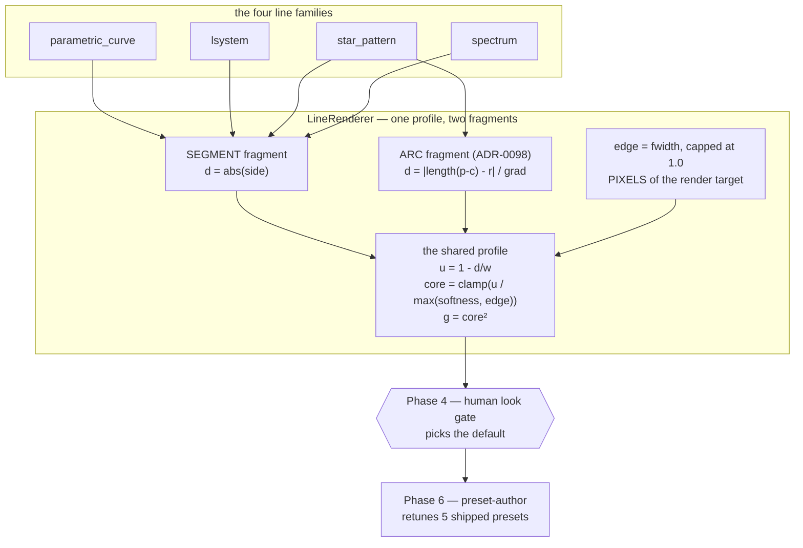

# 0114 — the line stroke reads as a drawn line

> **Status:** draft
> **Created:** 2026-08-25
> **Owner skill(s):** dev, human
> **Related ADRs:** [ADR-0124](../adrs/0124-the-line-stroke-carries-a-solid-core-and-a-pixel-wide-edge.md),
> supplementing [ADR-0056](../adrs/0056-additive-scenes-emit-premultiplied-alpha.md),
> [ADR-0098](../adrs/0098-the-line-renderer-draws-arcs-as-per-pixel-distance-fields.md)
> **Blocks:** [Plan 0087](0087-the-line-renderer-draws-a-curve.md) Phase 5 — parked at Phase 4 by
> user decision 2026-08-25, so the biarc chain is judged on the final stroke rather than through
> this defect

## TL;DR

Every line scene's stroke is a quadratic falloff across the **whole** half-width, so a 14 px line is
a 4 px spine inside a 10 px gradient and the user's verdict at Plan 0087's look gate was that it
reads *"blurred"* — said at both takes, beside the positive half that closed that plan's question.
This adds a **plateau and a one-pixel edge**: a new `softness` parameter where `1.0` is today's
fragment byte-for-byte and `0` is a solid stroke with an antialiased boundary. **A look gate picks
the new default from rendered samples**, and the five shipped line presets are retuned to it.

## Context & problem

The fragment has drawn one profile since Plan 0010, and all four line families share it:

```wgsl
let falloff = max(0.0, 1.0 - d);   // d: across-the-stroke, 0 at the centreline, 1 at the edge
let g = falloff * falloff;
return vec4<f32>(in.color * g * u.v.y, g * in.alpha);
```

There is no plateau. Brightness starts falling at the centreline. Measured at Plan 0087 Phase 4 on
the arc build's own frame, on a preset binding **no bloom, no trails and no `glow`**:

| quantity | reading |
|---|---|
| a ~14 px stroke's cross-section | `28 45 68 91 113 134 156 177 198 215 225 223 211 192 170 149 128 106 83 60 40` |
| within 10 % of peak | **4 px** |
| above half peak | 13 px |
| frame pixels reaching >= 200/255 | 13.0 % |

**Nothing regressed and this is not a bug.** It is [ADR-0056](../adrs/0056-additive-scenes-emit-premultiplied-alpha.md)
working as specified — the profile that produces the blur is the same one that makes the
premultiplied seam correct, so the quad's long edges write nothing instead of opaque black. Plan
0087 Phase 1's done-when *required* the arc primitive to reproduce it exactly, and it does, at mean
0.0000. The reading is identical either side of that plan.

**Three levers were checked and none reaches it** — the detail is in
[ADR-0124](../adrs/0124-the-line-stroke-carries-a-solid-core-and-a-pixel-wide-edge.md)'s Context.
`glow` multiplies the light and not the coverage, so it dims without narrowing. `thickness` scales
the whole profile, so a thinner stroke is a smaller blur at the same spine-to-gradient ratio — which
is why four years of tuning never found this. Bloom adds halo and cannot remove one, and the
measurement above was taken with it unbound.

**Why it is worth a plan now.** The blur reaches **every line preset shipping today**, not the
unbuilt mandalas: `curve_nightbloom`, `curve_ionwake`, `lsystem_vellum`, `star_rosewindow` and
`fragment_vitrail`'s line layer all stroke through this fragment. Its blast radius is larger than
Plan 0087's remaining phases, and Phase 5 of that plan would otherwise produce biarc curves to be
judged through the same defect.

## Decision

Per [ADR-0124](../adrs/0124-the-line-stroke-carries-a-solid-core-and-a-pixel-wide-edge.md): the
fragment gains a **plateau whose width is authorable** and an **edge specified in pixels of the
render target**, taken from `fwidth` — the technique `palette.rs:744` already uses here for a
screen-constant contour. `softness = 1.0` is today's fragment exactly; `softness → 0` is a solid
stroke with a one-pixel antialiased boundary.

**This plan does not choose the default.** Phase 4 is a `human` look gate against rendered samples,
for the reason Plan 0087 Phase 4 existed: the profile is a claim about what an eye does, no test in
this repo settles it, and a human looking at the running app is the instrument that found the
problem. Phase 5 flips whatever it picks and pays the re-bless once.

We rejected letting bloom carry the halo (measured with bloom unbound — the blur is in the stroke),
exposing the exponent `k` in `u^k` (moves the spine, leaves the smear: `u^k` is zero exactly where
`u` is, so no `k` produces an edge), a screen-space sharpen (it would sharpen every other scene in
the composite), and shipping it opt-in with today's profile as the permanent default (**rejected by
the user 2026-08-25** — an opt-in leaves the library looking exactly the way the complaint reads).

## Architecture diagram



## Implementation phases

### Phase 1 — the profile lands, and at its default nothing moves

- **Owner skill:** dev
- **What:** the `softness` parameter and the `fwidth`-derived edge in the segment fragment, plumbed
  through the four line scenes' `PARAMS` rosters and the uniform's **already-unused** `v.zw`
  (no new bind group — nothing for ADR-0058 to enumerate). Default `1.0`.
- **Files touched:** `core/src/render/scenes/lines/renderer.rs`, `renderer/tests.rs`, the four
  scenes' param rosters, `core/src/render/scenes/lines/mod.rs`.
- **Done when:**
  - **At the default the whole golden corpus is byte-identical** — not "within tolerance", exactly
    equal, because `softness = 1.0` must reduce the new expression to `g = u²` term for term.
  - **The edge term cannot exceed the softness term**, and there is a fixture that would catch it if
    it could. This is the trap: `d` is normalized across the half-width, so `fwidth(d)` is roughly
    `1 / half-width-in-pixels` — about **0.41 at `thickness = 1.5`** and **0.19 at `3.2`** (the
    shipped range, at 1080p), comfortably below 1.0 — but a **sub-pixel** stroke drives it *above*
    1.0, where an uncapped `max(softness, edge)` would dim the line instead of sharpening it and
    byte-identity at the default would break. `thickness = 0.1` reaches that regime and is inside
    the dead zone Plan 0087 Phase 1b made warnable, so the fixture is cheap and the two facts belong
    in one place.
  - **The edge is a width in pixels, not a fraction of the stroke**: at a low `softness` the
    transition from full to zero coverage spans the **same number of pixels** at 1280x800 and at
    1920x1080, where its share of the stroke differs. Stated as the property rather than a pixel
    count, since the exact figure depends on the `fwidth` quantization the rasterizer chooses.
  - A low `softness` measurably changes the cross-section — the plateau exists — asserted on the
    profile, not on a total-brightness statistic, which moves for several reasons.

### Phase 2 — the arc fragment shares the profile, and 0087's equivalence test proves it

- **Owner skill:** dev
- **What:** the same expression in `ARC_SHADER`, applied to the arc's own distance. This is a
  **correctness obligation of Phase 1, not a followup**: the two fragments drawing different
  profiles would mean a mandala whose circles and interlace no longer match.
- **Files touched:** `core/src/render/scenes/lines/renderer.rs`, `renderer/tests.rs`.
- **Done when:** Plan 0087's `an_arc_draws_the_same_curve_as_a_dense_polyline` **still passes at
  three `softness` values including both ends**, which is the cheapest possible proof that the two
  fragments share one profile — that test compares an arc against a polyline of the same circle at
  the golden suite's own tolerances, and it can only stay green if both sides changed together.
  The arc's `d` is in NDC and its `width` is flat-interpolated, so `fwidth(d/width)` is
  `fwidth(d)/width`; the aspect does not enter, and that is asserted at a non-16:9 target.

### Phase 3 — the sample sheet

- **Owner skill:** dev
- **What:** render the artifacts Phase 4 judges. Not a synthetic figure: **the shipped line presets**
  at a spread of `softness`, so the gate is a judgement about the library rather than about a test
  fixture. Include at least one `star_pattern` ring of arcs, since the arc primitive is what
  surfaced this, and one `spectrum` frame, since straight bars are the case where a plateau could
  read as heavy rather than crisp.
- **Files touched:** none in `core/` — this is `shot` runs and committed images under a scratch
  path, plus a short index the gate reads.
- **Done when:** one sheet exists per preset, each showing the same frame at four `softness`
  settings spanning both ends, at the resolution the user actually judges in the running app **and**
  at one non-16:9 size. The `softness` value is legible on each panel — a gate that cannot name what
  it picked produces a verdict nobody can act on.

### Phase 4 — pick the default

- **Owner skill:** human
- **What:** the look gate. Judge the Phase 3 sheets, and then the winner in the **running app** on
  real audio, because a still cannot show what a moving stroke does.
- **Done when:** a `softness` default exists as a number, plus a verdict on two questions the retune
  depends on. **Does a crisper stroke read brighter at the same `brightness`** — it should, since
  more of the footprint is at full coverage — and by roughly how much? And **does any shipped preset
  want to keep `softness = 1.0`**, which is a legitimate outcome and the reason the parameter is
  authorable rather than a constant. A verdict of "none of these is right" routes back to Phase 1
  with what was wrong about them, and is a result rather than a failure.

### Phase 5 — flip the default, re-bless, and repair the docs

- **Owner skill:** dev
- **What:** the default becomes Phase 4's number; the line baselines are re-blessed; the authoring
  docs learn the parameter.
- **Files touched:** `core/src/render/scenes/lines/`, the golden baselines, `presets/README.md`,
  `docs/presets.md`.
- **Done when:**
  - The re-bless is **measured bless-to-bless against a control, never as a `git diff`**, and
    adapters are compared before blessing. This repo has blessed rasterizer garbage before; the
    baselines that move are re-derived at the phase rather than counted here, because that number
    has gone stale twice in `docs/plans/README.md` and once inside Plan 0087.
  - **`presets/README.md`'s `glow` line is repaired.** It calls `glow` "the line renderer's
    per-segment **falloff** multiplier"; `glow` multiplies the light and never touches the falloff,
    which is precisely the confusion that let this defect sit. The four interacting levers —
    `thickness`, `softness`, `brightness`, `glow` — get one sentence saying which to reach for.
  - `docs/presets.md` carries the new parameter, and the sub-pixel note from Phase 1 lands beside
    the `thickness` dead zone rather than in a second place.

### Phase 6 — the library is retuned to the new stroke

- **Owner skill:** human
- **What:** a `preset-author` sitting over the five presets tuned against the old profile —
  `curve_nightbloom`, `curve_ionwake`, `lsystem_vellum`, `star_rosewindow`, and `fragment_vitrail`'s
  line layer. **Judging the look is content work**, so it lands in that lane, not here.
- **Done when:** a verdict per preset and any retune committed through the `preset-author` route,
  gated on the behavioural suite. A preset that legitimately keeps `softness = 1.0` is an outcome,
  not a miss — and it wants a header line saying why, or the next reader will "fix" it.

## Risks & open questions

- **`fwidth` is a derivative, and it is quantized to the 2x2 rasterization quad.** Below about two
  pixels of stroke the edge term stops describing a real gradient. Phase 1's cap keeps that from
  dimming the line, but a hairline simply cannot be given a one-pixel edge — there is no room for
  one. This is a limit to state, not to engineer around.
- **The look may not be the profile.** The user said "blurred **and semi-transparent**". Coverage
  and brightness are separable here, and it is possible the complaint is partly about the additive
  composite rather than the stroke shape — which is [backlog 0069](../design-backlog.md)'s
  territory and a redesign. Phase 4 asks the brightness question directly for this reason. If the
  sheets come back "sharper but still washed out", that is the finding and it routes there.
- **A crisper stroke is more fuel for bloom**, since more of the footprint sits at full coverage and
  the bloom threshold is a brightness cut. Presets binding both may need less bloom, not just less
  brightness — Phase 6's sitting should expect it rather than discover it.
- **This is a third live lane** alongside Plan 0087 (parked) and Plan 0095. Its only file contention
  is `core/src/render/scenes/lines/`, which is exactly Plan 0087's territory — hence the parking,
  which is a decision rather than an accident.

## What this plan does NOT do

- **It does not change the composite.** ADR-0056 and ADR-0018 stand; colour and alpha still carry
  the same coverage `g`, and only the shape of `g` moves. The two-tone fill-and-outline question
  stays in [backlog 0069](../design-backlog.md).
- **It does not touch the particle, field or attractor families.** Their strokes are not this
  fragment.
- **It does not resume Plan 0087.** Phase 5 of that plan stays green-lit and unbuilt until this
  closes.
- **It does not choose the default.** That is Phase 4's whole job.

## Followups (after this lands)

- Plan 0087 Phase 5 (the biarc chain) resumes, now judged on the final stroke.
- If Phase 4 says "sharper but still washed out", that is [backlog 0069](../design-backlog.md)'s
  evidence and its ADR's opening argument — the same routing Plan 0087 Phase 4 carried.
