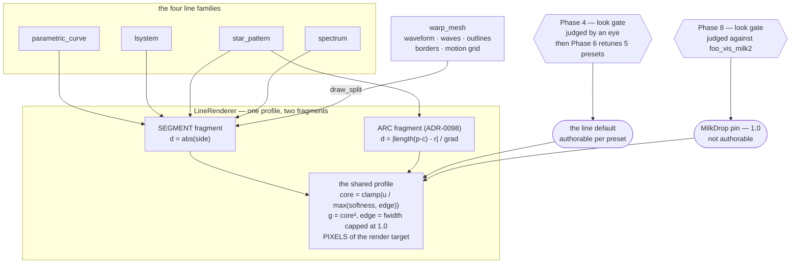

# 0114 — the line stroke reads as a drawn line

> **Status:** in-progress — **the `dev` arm is done, reviewed and merged (2026-08-26): phases 1-5
> and 7-9.** Two phases remain and neither gates the other: **Phase 6**, the `preset-author` retune,
> and **Phase 10**, the Mode 4 review's findings. [ADR-0124](../adrs/0124-the-line-stroke-carries-a-solid-core-and-a-pixel-wide-edge.md)
> is accepted with a dated `Outcome`.
> **Created:** 2026-08-25
> **Owner skill(s):** dev, human
> **Related ADRs:** [ADR-0124](../adrs/0124-the-line-stroke-carries-a-solid-core-and-a-pixel-wide-edge.md),
> supplementing [ADR-0056](../adrs/0056-additive-scenes-emit-premultiplied-alpha.md),
> [ADR-0098](../adrs/0098-the-line-renderer-draws-arcs-as-per-pixel-distance-fields.md)
> **Blocks:** [Plan 0087](0087-the-line-renderer-draws-a-curve.md) Phase 5 — parked at Phase 4 by
> user decision 2026-08-25, so the biarc chain is judged on the final stroke rather than through
> this defect
> **Amended 2026-08-26, before Phase 1 started.** `dev` found a **fifth consumer** of the fragment:
> `warp_mesh` strokes through it via `LineRenderer::draw_split`, and since all three entry points
> funnel into one `draw_all` writing one uniform, it cannot abstain. It is **pinned** to the
> pre-0114 profile rather than following the new default, because it answers to `foo_vis_milk2` and
> not to Phase 4 — see [ADR-0124](../adrs/0124-the-line-stroke-carries-a-solid-core-and-a-pixel-wide-edge.md)'s
> Decision and its Alternative D0. Phase 1 grows the pin and one file; **Phases 7-9 are new** and
> are the arm that judges that surface properly. Phase 3's output path is settled. Phases 2, 4 and 6
> are unchanged.
> **Two corrections to the escalation, both verified here.** The three `warp_mesh` goldens do
> **not** hang off this fragment — all three are warp field, deposit and shader output with no line
> geometry in them — so Phase 5's re-bless stays lines-only as originally written. The real finding
> is the other side of the same fact: **nothing in the golden corpus shades a `warp_mesh` stroke at
> all**, which is why Phase 9 adds a baseline rather than re-blessing one.
> **Correction, 2026-08-26 at the close — the conclusion above is right and the reason is not.**
> The three `warp_mesh` goldens **do** carry line geometry: `wave_a` defaults to `1.0`
> (`core/src/milk/outputs.rs:166`), so all three stroke a waveform and always have. What makes them
> blind is the golden suite's **128 px capture**, where `THIN` is 0.16 px of half-width and the edge
> cap makes the profile inert — which also makes `parametric_curve`, `lsystem` and `star_pattern`
> blind, so this is a property of the capture size rather than of those fixtures. Phase 5's
> lines-only re-bless and Phase 9's new baseline are both still correct; the same wording recurs in
> Phase 5's first done-when below and is wrong there too. See the `Implementation log` and
> [ADR-0124](../adrs/0124-the-line-stroke-carries-a-solid-core-and-a-pixel-wide-edge.md)'s `Outcome`.

## TL;DR

Every line scene's stroke is a quadratic falloff across the **whole** half-width, so a 14 px line is
a 4 px spine inside a 10 px gradient and the user's verdict at Plan 0087's look gate was that it
reads *"blurred"* — said at both takes, beside the positive half that closed that plan's question.
This adds a **plateau and a one-pixel edge**: a new `softness` parameter where `1.0` is today's
fragment byte-for-byte and `0` is a solid stroke with an antialiased boundary. **A look gate picks
the new default from rendered samples**, and the five shipped line presets are retuned to it.

**A fifth consumer, `warp_mesh`, is pinned rather than moved** — it strokes the MilkDrop waveform
through the same fragment and is judged against `foo_vis_milk2`, not against this plan's gate.
Phases 7-9 point that instrument at it properly, and close the fact that **no golden baseline in
the repo shades a `warp_mesh` stroke**.

## Context & problem

The fragment has drawn one profile since Plan 0010, and all four line families share it:

```wgsl
let falloff = max(0.0, 1.0 - d);   // d: across-the-stroke, 0 at the centreline, 1 at the edge
let g = falloff * falloff;
return vec4<f32>(in.color * g * u.v.y, g * in.alpha);
```

There is no plateau. Brightness starts falling at the centreline. Measured at Plan 0087 Phase 4 on
the arc build's own frame, on a preset binding **no bloom, no trails and no `glow`**:

| quantity | reading |
|---|---|
| a ~14 px stroke's cross-section | `28 45 68 91 113 134 156 177 198 215 225 223 211 192 170 149 128 106 83 60 40` |
| within 10 % of peak | **4 px** |
| above half peak | 13 px |
| frame pixels reaching >= 200/255 | 13.0 % |

**Nothing regressed and this is not a bug.** It is [ADR-0056](../adrs/0056-additive-scenes-emit-premultiplied-alpha.md)
working as specified — the profile that produces the blur is the same one that makes the
premultiplied seam correct, so the quad's long edges write nothing instead of opaque black. Plan
0087 Phase 1's done-when *required* the arc primitive to reproduce it exactly, and it does, at mean
0.0000. The reading is identical either side of that plan.

**Three levers were checked and none reaches it** — the detail is in
[ADR-0124](../adrs/0124-the-line-stroke-carries-a-solid-core-and-a-pixel-wide-edge.md)'s Context.
`glow` multiplies the light and not the coverage, so it dims without narrowing. `thickness` scales
the whole profile, so a thinner stroke is a smaller blur at the same spine-to-gradient ratio — which
is why four years of tuning never found this. Bloom adds halo and cannot remove one, and the
measurement above was taken with it unbound.

**Why it is worth a plan now.** The blur reaches **every line preset shipping today**, not the
unbuilt mandalas: `curve_nightbloom`, `curve_ionwake`, `lsystem_vellum`, `star_rosewindow` and
`fragment_vitrail`'s line layer all stroke through this fragment. Its blast radius is larger than
Plan 0087's remaining phases, and Phase 5 of that plan would otherwise produce biarc curves to be
judged through the same defect.

## Decision

Per [ADR-0124](../adrs/0124-the-line-stroke-carries-a-solid-core-and-a-pixel-wide-edge.md): the
fragment gains a **plateau whose width is authorable** and an **edge specified in pixels of the
render target**, taken from `fwidth` — the technique `palette.rs:744` already uses here for a
screen-constant contour. `softness = 1.0` is today's fragment exactly; `softness → 0` is a solid
stroke with a one-pixel antialiased boundary.

**This plan does not choose the default.** Phase 4 is a `human` look gate against rendered samples,
for the reason Plan 0087 Phase 4 existed: the profile is a claim about what an eye does, no test in
this repo settles it, and a human looking at the running app is the instrument that found the
problem. Phase 5 flips whatever it picks and pays the re-bless once.

We rejected letting bloom carry the halo (measured with bloom unbound — the blur is in the stroke),
exposing the exponent `k` in `u^k` (moves the spine, leaves the smear: `u^k` is zero exactly where
`u` is, so no `k` produces an edge), a screen-space sharpen (it would sharpen every other scene in
the composite), and shipping it opt-in with today's profile as the permanent default (**rejected by
the user 2026-08-25** — an opt-in leaves the library looking exactly the way the complaint reads).

## Architecture diagram



**The two constants feed one uniform, and that is the whole shape of the amendment.** All three
entry points funnel into one `draw_all` writing one `Uniforms`, so `softness` is per-draw: each
caller supplies its own and none can abstain. The diagram's two gates are two different
instruments, and neither one's verdict is evidence for the other's constant.

## Implementation phases

### Phase 1 — the profile lands, and at its default nothing moves

- **Owner skill:** dev
- **What:** the `softness` parameter and the `fwidth`-derived edge in the segment fragment, plumbed
  through the four line scenes' `PARAMS` rosters and the uniform's **already-unused** `v.zw`
  (no new bind group — nothing for ADR-0058 to enumerate). Default `1.0`.
- **Files touched:** `core/src/render/scenes/lines/renderer.rs`, `renderer/tests.rs`, the four
  scenes' param rosters, `core/src/render/scenes/lines/mod.rs`, **`core/src/render/scenes/warp_mesh/mod.rs`**
  (the `draw_split` call site — it must pass a `softness` for the workspace to compile).
- **Done when:**
  - **At the default the whole golden corpus is byte-identical** — not "within tolerance", exactly
    equal, because `softness = 1.0` must reduce the new expression to `g = u²` term for term.
  - **The edge term cannot exceed the softness term**, and there is a fixture that would catch it if
    it could. This is the trap: `d` is normalized across the half-width, so `fwidth(d)` is roughly
    `1 / half-width-in-pixels` — about **0.41 at `thickness = 1.5`** and **0.19 at `3.2`** (the
    shipped range, at 1080p), comfortably below 1.0 — but a **sub-pixel** stroke drives it *above*
    1.0, where an uncapped `max(softness, edge)` would dim the line instead of sharpening it and
    byte-identity at the default would break. `thickness = 0.1` reaches that regime and is inside
    the dead zone Plan 0087 Phase 1b made warnable, so the fixture is cheap and the two facts belong
    in one place.
  - **The edge is a width in pixels, not a fraction of the stroke**: at a low `softness` the
    transition from full to zero coverage spans the **same number of pixels** at 1280x800 and at
    1920x1080, where its share of the stroke differs. Stated as the property rather than a pixel
    count, since the exact figure depends on the `fwidth` quantization the rasterizer chooses.
  - A low `softness` measurably changes the cross-section — the plateau exists — asserted on the
    profile, not on a total-brightness statistic, which moves for several reasons.
  - **The two profiles are two named constants, and neither call site carries a bare literal.** The
    line families take the authorable default; `warp_mesh` takes its own pinned constant at `1.0`,
    whose doc comment says it answers to `foo_vis_milk2` rather than to Phase 4 and points at
    Phase 8. A reader of either call site can see which judge it serves without leaving the file.
  - **The sub-pixel fixture uses real shipped geometry, not only a synthetic thickness.** `warp_mesh`'s
    `draw.rs` `THIN = 0.0025` NDC-y is a **1.35 px** half-width at 1080p and **1.0 px** at 1280x800
    — below the 1.5–3.2 px range this phase's arithmetic above spans, and at the small target
    `fwidth` reaches the cap exactly. That is the configuration where an uncapped `max` and a capped
    one disagree, so it is the one the fixture must cover; the synthetic `thickness = 0.1` arm stays
    as the deeper case. **Byte-identity for `warp_mesh` depends on the cap**, so this fixture is
    what holds the pin honest rather than a nicety.

### Phase 2 — the arc fragment shares the profile, and 0087's equivalence test proves it

- **Owner skill:** dev
- **What:** the same expression in `ARC_SHADER`, applied to the arc's own distance. This is a
  **correctness obligation of Phase 1, not a followup**: the two fragments drawing different
  profiles would mean a mandala whose circles and interlace no longer match.
- **Files touched:** `core/src/render/scenes/lines/renderer.rs`, `renderer/tests.rs`.
- **Done when:** Plan 0087's `an_arc_draws_the_same_curve_as_a_dense_polyline` **still passes at
  three `softness` values including both ends**, which is the cheapest possible proof that the two
  fragments share one profile — that test compares an arc against a polyline of the same circle at
  the golden suite's own tolerances, and it can only stay green if both sides changed together.
  The arc's `d` is in NDC and its `width` is flat-interpolated, so `fwidth(d/width)` is
  `fwidth(d)/width`; the aspect does not enter, and that is asserted at a non-16:9 target.

### Phase 3 — the sample sheet

- **Owner skill:** dev
- **What:** render the artifacts Phase 4 judges. Not a synthetic figure: **the shipped line presets**
  at a spread of `softness`, so the gate is a judgement about the library rather than about a test
  fixture. Include at least one `star_pattern` ring of arcs, since the arc primitive is what
  surfaced this, and one `spectrum` frame, since straight bars are the case where a plateau could
  read as heavy rather than crisp.
- **Files touched:** none in `core/` — a new `scripts/softness-sheets.mjs`, and nothing else
  committed. **Follow the `scripts/tuple-sheets.mjs` precedent** (Plan 0079 Phase 3, the same shape
  of `human` curation gate): the script is committed, it writes scratch presets into a temp dir and
  drives the `shot --all` labeled contact sheet, and its output lands in **`target/softness-sheets/`**
  — sheets plus an `index.md` — which is gitignored and therefore never committed. The earlier
  wording here said "committed images under a scratch path", which is not a thing this repo has:
  `target/` is gitignored and `renders/` is explicitly never committed.
- **Done when:** one sheet exists per preset, each showing the same frame at four `softness`
  settings spanning both ends, at the resolution the user actually judges in the running app **and**
  at one non-16:9 size. The `softness` value is legible on each panel — a gate that cannot name what
  it picked produces a verdict nobody can act on.

### Phase 4 — pick the default

- **Owner skill:** human
- **What:** the look gate. Judge the Phase 3 sheets, and then the winner in the **running app** on
  real audio, because a still cannot show what a moving stroke does.
- **Done when:** a `softness` default exists as a number, plus a verdict on two questions the retune
  depends on. **Does a crisper stroke read brighter at the same `brightness`** — it should, since
  more of the footprint is at full coverage — and by roughly how much? And **does any shipped preset
  want to keep `softness = 1.0`**, which is a legitimate outcome and the reason the parameter is
  authorable rather than a constant. A verdict of "none of these is right" routes back to Phase 1
  with what was wrong about them, and is a result rather than a failure.

### Phase 5 — flip the default, re-bless, and repair the docs

- **Owner skill:** dev
- **What:** the default becomes Phase 4's number; the line baselines are re-blessed; the authoring
  docs learn the parameter.
- **Files touched:** `core/src/render/scenes/lines/`, the golden baselines, `presets/README.md`,
  `docs/presets.md`.
- **Done when:**
  - **`warp_mesh`'s three baselines are out of scope and must not move.** They carry no line
    geometry (verified 2026-08-26: `warp_mesh.png`, `warp_mesh_milk.png` and `warp_mesh_shader.png`
    are warp field, deposit and shader output; the fixtures set no wave and no border), and the pin
    holds the profile regardless. If one of them moves at this phase, the pin is broken or the cap
    is — stop and diagnose rather than blessing. This is the standing
    `warp_mesh_shader.png` hazard `docs/plans/README.md` names, turned into a check that fires.
  - The re-bless is **measured bless-to-bless against a control, never as a `git diff`**, and
    adapters are compared before blessing. This repo has blessed rasterizer garbage before; the
    baselines that move are re-derived at the phase rather than counted here, because that number
    has gone stale twice in `docs/plans/README.md` and once inside Plan 0087.
  - **`presets/README.md`'s `glow` line is repaired.** It calls `glow` "the line renderer's
    per-segment **falloff** multiplier"; `glow` multiplies the light and never touches the falloff,
    which is precisely the confusion that let this defect sit. The four interacting levers —
    `thickness`, `softness`, `brightness`, `glow` — get one sentence saying which to reach for.
  - `docs/presets.md` carries the new parameter, and the sub-pixel note from Phase 1 lands beside
    the `thickness` dead zone rather than in a second place.

### Phase 6 — the library is retuned to the new stroke

- **Owner skill:** human
- **What:** a `preset-author` sitting over the five presets tuned against the old profile —
  `curve_nightbloom`, `curve_ionwake`, `lsystem_vellum`, `star_rosewindow`, and `fragment_vitrail`'s
  line layer. **Judging the look is content work**, so it lands in that lane, not here.
- **Done when:** a verdict per preset and any retune committed through the `preset-author` route,
  gated on the behavioural suite. A preset that legitimately keeps `softness = 1.0` is an outcome,
  not a miss — and it wants a header line saying why, or the next reader will "fix" it.

### Phase 7 — the MilkDrop stroke comparison set

- **Owner skill:** dev
- **What:** the artifacts Phase 8 judges. `warp_mesh`'s own line path — the waveform and a custom
  wave — rendered at a spread of `softness`, plus the instructions for putting `foo_vis_milk2`
  beside them. **This is a different surface from Phase 3's**, which renders line *presets*;
  `warp_mesh` ships zero worlds, so the subjects are fixtures rather than presets.
- **Files touched:** none in `core/` — a script alongside Phase 3's, writing to
  `target/milk-softness/`. Uncommitted output, committed script, same precedent.
- **Done when:**
  - The set drives **segments that actually reach the fragment**. `core/tests/fixtures/` has the
    warp-mesh bundles and `scratch-0108/wave-dots.milk` is a wave preset; the shipped
    `warp_mesh_milk.toml` sets no wave and is **not** a usable subject on its own. Confirm segments
    are non-empty before rendering a sheet that would otherwise show a warp field and nothing else.
  - Both `THIN` and `THICK` appear, at 1080p **and** at 1280x800 — the small target being where
    `fwidth` reaches the cap, and therefore where the profiles differ most.
  - The rig side is written down, not assumed: which `.milk` goes where for `foo_vis_milk2`, so
    Phase 8 is a judging session rather than a setup session.

### Phase 8 — judge the MilkDrop stroke against the reference

- **Owner skill:** human
- **What:** the second look gate, and the only instrument that exists for this surface. Compare
  Phase 7's spread against `foo_vis_milk2` running the same preset, and return a number.
- **Done when:** a value for the pinned constant exists, plus a verdict on whether MilkDrop's line
  is in fact *harder* than this engine's soft falloff. **`1.0` — keep the pin as it stands — is a
  legitimate outcome and closes the question**; it is not a null result. A verdict of "the profile
  is not what differs" is also a result, and routes to
  [ADR-0113](../adrs/0113-milkdrop-presets-are-translated-ahead-of-time-onto-a-warp-mesh-idiom.md)'s
  fidelity ledger rather than back here.

### Phase 9 — set the constant, and give the surface a baseline

- **Owner skill:** dev
- **What:** Phase 8's number becomes the pinned constant, and the coverage gap that made this whole
  question invisible gets closed.
- **Files touched:** `core/src/render/scenes/warp_mesh/`, `core/tests/fixtures/`, `core/tests/golden.rs`,
  one new golden baseline.
- **Done when:**
  - The constant is Phase 8's value. If that value is `1.0` the code does not change, and **that is
    a pass** — the phase's other half is the deliverable.
  - **A golden fixture exists whose frame contains `warp_mesh` stroke geometry**, and it is blessed.
    No baseline shades a `warp_mesh` stroke today, which is why a fragment change could reach every
    MilkDrop line with nothing in the repo moving. The fixture sets a wave; asserting it is
    non-empty at build time is what stops it from silently degrading into another warp-field
    picture.
  - The new baseline is blessed on hardware with adapters compared first, per the standing rule —
    this repo has blessed rasterizer garbage before.

### Phase 10 — the guard that this plan made retirable says so, out loud

- **Owner skill:** dev
- **Why:** the Mode 4 review (2026-08-26) found one major and two minors, all in test surface, all
  created by phases that are otherwise green. They are one commit.
- **Files touched:** `core/tests/fixtures/lines_lit_backdrop.toml`,
  `core/src/render/scenes/lines/renderer/tests.rs`, `core/src/render/scenes/lines/star/tests.rs`,
  `docs/capturing.md`, `scripts/softness-sheets.mjs`.
- **Done when:**
  - **`lines_lit_backdrop.toml`'s `softness = "1.0"` is guarded the way its `thickness` is.**
    Phase 5 added that line because at the new default a plateau legitimately extinguishes a
    *region*, so the wide arm of `a_lit_backdrop_survives_where_the_strokes_drew_nothing` can no
    longer separate coverage-is-1 from the constant-alpha defect it exists to catch. Right now the
    line carries **no comment**, and the test reads back `bg_bright`, `draw_progress`, `thickness`
    and `trails` as preconditions but **not** `softness`. That is precisely the trap the fixture's
    own header is written about — *"'simplifying' it back to a shipped width retires this test
    silently while leaving it green"* — and the pin is now the easiest thing in the file to
    normalise away. So: a `fixture_value("softness")` arm asserting it is still `1.0`, worded like
    the `thickness >= 6.0` one and pointing at the header, plus a header paragraph saying why.
  - **`docs/capturing.md` says it too.** That file documents this fixture at length, including the
    *"do not 'simplify' it away"* section, and still describes the line falloff as unconditionally
    *"one-dimensional and quadratic"* — which is now true only at `softness = 1.0`. One sentence in
    each place; the numbers in its table were measured at that profile and stay valid because the
    fixture pins it.
  - **`star/tests.rs`'s `BEAD_SPREAD` stops eating its test's doc comment.** The const was inserted
    *inside* the header for `a_circle_motif_is_round_and_unbeaded_at_ornament_scale_and_full_frame`,
    so the whole "what this test proves" block now documents the constant and the test has no doc
    comment at all. Split them; neither text changes.
  - **`BEAD_SPREAD` is asserted as the gap it claims to be, or it names its machine** ([ADR-0071]).
    `0.12` is a frozen number chosen to sit between two adapter-dependent readings (the arc's 7.9 %,
    the 24-gon control's 34.3 %), asserted universally, naming no configuration — and its own doc
    already says *"the gap between the two arms is what carries the property, not the absolute
    figure"*. Both readings are taken in the **same test**, so assert the ratio and let the absolute
    figures be printed. If a ratio will not carry it, the fallback is the honest one: keep the
    constant and name the machine and adapter it was measured on.
  - **`scripts/softness-sheets.mjs` stops calling `1.00` the shipped default.** Its index prose says
    *"`1.00` is the stroke the library ships today, byte for byte"* and it labels that panel
    *"(ships today)"*. Phase 5 moved the default to `0.25`; a Phase 6 sitting re-running this script
    would be told the wrong thing about its own control panel.
  - No golden baseline moves. Nothing here touches a fragment, a default or a fixture's geometry —
    if a baseline moves, something in this phase reached further than it was asked to.

[ADR-0071]: ../adrs/0071-a-numeric-test-contract-states-a-property-or-names-its-machine.md

## Risks & open questions

- **`fwidth` is a derivative, and it is quantized to the 2x2 rasterization quad.** Below about two
  pixels of stroke the edge term stops describing a real gradient. Phase 1's cap keeps that from
  dimming the line, but a hairline simply cannot be given a one-pixel edge — there is no room for
  one. This is a limit to state, not to engineer around.
- **The look may not be the profile.** The user said "blurred **and semi-transparent**". Coverage
  and brightness are separable here, and it is possible the complaint is partly about the additive
  composite rather than the stroke shape — which is [backlog 0069](../design-backlog.md)'s
  territory and a redesign. Phase 4 asks the brightness question directly for this reason. If the
  sheets come back "sharper but still washed out", that is the finding and it routes there.
- **A crisper stroke is more fuel for bloom**, since more of the footprint sits at full coverage and
  the bloom threshold is a brightness cut. Presets binding both may need less bloom, not just less
  brightness — Phase 6's sitting should expect it rather than discover it.
- **The pin is a divergence, and divergences rot.** Once the default moves, `warp_mesh` draws a
  different stroke from every other consumer of one fragment, and the only thing recording why is a
  doc comment and Phase 8. If Phase 8 is never run the pin becomes folklore — which is the argument
  for it being a phase in this plan rather than a followup.
- **This is a third live lane** alongside Plan 0087 (parked) and Plan 0095. Its only file contention
  is `core/src/render/scenes/lines/`, which is exactly Plan 0087's territory — hence the parking,
  which is a decision rather than an accident.

## What this plan does NOT do

- **It does not change the composite.** ADR-0056 and ADR-0018 stand; colour and alpha still carry
  the same coverage `g`, and only the shape of `g` moves. The two-tone fill-and-outline question
  stays in [backlog 0069](../design-backlog.md).
- **It does not touch the particle, field or attractor families.** Their strokes are not this
  fragment.
- **It does not change how a MilkDrop preset looks.** `warp_mesh` is pinned to the pre-0114
  profile through Phases 1-6, so the conversion keeps the fidelity it was judged under. Phase 8 is
  the first moment that can move, and it moves on a verdict against the reference.
- **It does not resume Plan 0087.** Phase 5 of that plan stays green-lit and unbuilt until this
  closes.
- **It does not choose the default.** That is Phase 4's whole job.

## Implementation log

> Written by `dev` — one row per phase as that phase's commit lands, and the close block after the
> last one. **The phases above are the contract; everything here is what happened.**

**Lane:** `WORK/lmv-plan-0114` on `plan-0114-line-stroke`, branched off `main` and merged forward
at `b2fb13b`.

| phase | owner | state | commit |
|---|---|---|---|
| 1 — the profile lands | dev | done | `e2eb8fc` |
| 2 — the arc fragment shares it | dev | done | `348cc01` |
| 3 — the sample sheet | dev | done | `5592e40` |
| 4 — pick the default | human | done | verdict below |
| 5 — flip, re-bless, repair the docs | dev | done | `707bdb8` |
| 6 — the library is retuned | human | **outstanding — `preset-author`, does not gate 7** | |
| 7 — the MilkDrop comparison set | dev | done | `4579dd8` |
| 8 — judge against the reference | human | done | verdict below |
| 9 — set the constant, add a baseline | dev | done | `60cf15e` |
| 10 — the guard says so out loud | dev | **outstanding — from the Mode 4 review, does not gate 6** | |

### Notes

**Phase 4's verdict, given in the running app on real audio (2026-08-26).** Default **`0.25`**.
A crisper stroke reads **noticeably brighter** at the same `brightness`, so Phase 6 should expect
an exposure trim and not discover one — bloom included, since its threshold is a brightness cut.
Per preset, for Phase 6 to bind: `curve_ionwake` **0**, the Maurer roses **1.0**
(`curve_nightbloom`, and `fragment_vitrail`'s line layer is one too), `lsystem_vellum` **0.25**.
`star_rosewindow` and `spectrum_halo` were not given a value.

**Phase 8's verdict (2026-08-26): the pin stays at `1.0`.** Which the plan names as a legitimate
outcome that closes the question rather than a null result, so `MILKDROP_SOFTNESS` is unchanged
and Phase 9's deliverable is its other half.

- **Phase 1 touched two files outside its list.** `presets/README.md`, because
  `core/tests/preset.rs`'s `every_declared_param_is_documented_in_the_presets_readme` fails the
  moment a name enters a `PARAMS` roster — so `softness` is documented in the same commit that
  declares it, and Phase 5 still owes the `glow` repair and the four-lever sentence.
  `core/src/render/scenes/lines/star/tests.rs`, which calls `draw_arcs` and had to pass the new
  argument to compile.
- **Phase 9's new baseline is proved to convict, not assumed to.** With the pin driven
  `1.0 -> 0.0` through the golden harness, `warp_mesh_stroke` reads **mean 0.0336 / outlier 162**
  against tolerances of 0.02 / 48, while `warp_mesh.png`, `warp_mesh_milk.png` and
  `warp_mesh_shader.png` all read **mean 0.0000 / outlier 0** on the same run. That is the gap
  ADR-0124 records, closed and measured.
- **It took a fat border to get there, and that is a fact about the surface.** `draw.rs`'s `THIN`
  and `THICK` are constants, 0.16 px and 0.38 px of half-width at the golden suite's 128 px, both
  under the one-pixel floor — so a fixture that merely "sets a wave", which is what the
  done-when asks for, would have added a fourth blind baseline. `ob_size` is the only stroke
  width on this surface a preset controls; at `0.12` it is 7.7 px. The fixture sets **both**, and
  `the_warp_mesh_stroke_fixture_shades_a_resolvable_stroke` guards the border's width in pixels,
  `ob_a`, `wave_a`, and that the draw actually reaches the line renderer.
- **The baseline was blessed on WARP, not on hardware, against Phase 9's done-when.** `golden.rs`'s
  own header requires it — every baseline in that roster is a software-adapter capture and the
  suite compares against one — so blessing this one on hardware would have made it the only
  baseline CI could not reproduce. Adapters were compared instead, which is the part of the rule
  that carries the intent: `warp_mesh_stroke` agrees hardware-vs-WARP at **mean 0.0003 / outlier
  1**.
- The entry goes last in `EXTRA_FIXTURES`, per that file's own rule about allocation order on
  WARP, and the bless confirmed no existing baseline moved.
- **Phase 7 was built out of order, and deliberately.** Phase 6 is a `preset-author` sitting and
  Phase 7 touches a different scene and a different constant, so it is not gated on it. Both
  human gates now have their materials.
- **`scripts/milk-softness.mjs` temporarily edits a tracked source file**, because
  `MILKDROP_SOFTNESS` is a compile-time constant by ADR-0124's design and there is no runtime
  lever to sweep — the surface is built four times. A first run was killed by a harness timeout
  mid-build and left the constant at `0.00` in the working tree; the restore is now wired to
  `SIGINT`/`SIGTERM`/`SIGHUP`/`exit` as well as to the `finally`, and the run refuses to write an
  index unless the file came back byte-identical.
- **The `warp_mesh` line surface is almost entirely inside the edge cap, which shrinks Phase 8's
  question to nearly binary.** Across the full `1.00 → 0.00` range there are **two** distinct
  pictures at `THIN` (both sizes) and **three** at `THICK`: everything at or below 0.50 (THIN) or
  0.25 (THICK) is byte-identical. MilkDrop's own widths are 1.0–1.35 px of half-width, right at
  the one-pixel floor, so most of the range has no room to differ. The index marks every twin.
- **ADR-0124's *reason* for the `warp_mesh` coverage gap is wrong, though its conclusion holds.**
  It says the three fixtures "set no wave"; `wave_a` defaults to **1.0**, so all three do stroke a
  waveform. Measured: driving the pin from `1.0` to `0.0` — the largest change available — moves
  `warp_mesh.png`, `warp_mesh_milk.png` and `warp_mesh_shader.png` by **mean 0.0000 / outlier 0**.
  The cause is the golden suite's 128 px capture, where `THIN` is 0.16 px of half-width and the
  cap makes the profile inert — the same mechanism that leaves the line baselines blind. **This
  bears on Phase 9:** a fixture that merely "sets a wave" would add another blind baseline; it has
  to be stroked wide enough at 128 px to resolve a profile, and asserting non-empty geometry is
  not sufficient to prove it can.
- The custom-wave subject is `THIN` only. `THIN`/`THICK` are both covered on the built-in
  waveform at both sizes, which is what the done-when names.
- **The re-bless is two files, not "every line baseline".** `spectrum.png` and
  `line_joint_zigzag.png`. `parametric_curve`, `lsystem` and `star_pattern` moved by **mean
  0.0000 / outlier 0** — at the golden suite's 128 px a `thickness ≈ 2` stroke is 0.38 px of
  half-width, so the edge cap makes `softness` inert and those baselines cannot see this
  fragment at all. That is the same coverage gap ADR-0124 records for `warp_mesh`, now shown to
  reach the line families; Phase 9 closes it only for `warp_mesh`.
- **`line_joint_zigzag.png` lives in `tests/golden/` but is blessed by its own binary**, so
  `LMV_BLESS=1 ... --test golden` does not reach it and it surfaced only on the full suite. Its
  behavioural arms still pass — the joint is a local maximum (0.7015 against 0.5120 either side)
  and neither end overshoots — so what moved is the pixels, not the notch.
- **`warp_mesh`'s three baselines did not move**, per Phase 5's stop-and-diagnose check. The pin
  and the cap both hold.
- **Adapters compared before blessing.** Both re-blessed baselines were re-read on the hardware
  adapter against the WARP-blessed file: `spectrum` and `line_joint_zigzag` each at **mean
  0.0000 / outlier 1**. In the same hardware pass `attractor` reads outlier 107 and
  `reaction_diffusion` 46 — neither scene was touched and neither baseline was re-blessed, so
  that is pre-existing cross-adapter drift and not this plan's.
- **Three tests encoded the old profile and were repointed rather than retuned away.**
  `the_arc_stroke_falls_off_quadratically_like_a_segment` keyed its `(1 - d/w)²` closed form on
  `DEFAULT_SOFTNESS`; it now names `SOFT_PROFILE = 1.0`, the value that expression is about.
  `a_circle_motif_is_round_and_unbeaded_...` moved from a bare `0.05` per-ray spread to a named
  `BEAD_SPREAD = 0.12` on **both** arms — measured, the arc spreads 7.9 % and the 24-gon control
  34.3 %, so the gap that carries the property widened rather than narrowed; a solid core
  contributes whole pixels to a ray's sum where a gradient contributes fractions.
  `lines_lit_backdrop.toml` now pins `softness = "1.0"`, because that guard's wide arm reads
  alpha off the *fully extinguished* set and a plateau legitimately extinguishes a region rather
  than a thread — at the new default it cannot tell coverage-is-1-over-a-region from the
  constant-alpha defect it exists to catch.
- **Followup, deliberately not acted on:** `docs/images/gallery/`'s four line-scene renders
  (`parametric_curve`, `lsystem`, `star_pattern`, `spectrum`) now show a stroke the engine no
  longer draws. `scripts/docs-shots.mjs` re-shoots them and is explicitly not a CI gate, so
  nothing fails. Re-shooting belongs **after** Phase 6, or it is paid twice.
- **Phase 3 emits two artifacts per (preset, size), not one.** `shot --all` resizes every capture
  to a 320 px thumbnail, so a 1080p contact sheet is a 6:1 downsample and a 4 px stroke lands at
  0.7 px. The sheet ranks the four and shows whether the figure still reads; the four full-size
  panels beside it are what a one-pixel edge can be judged on. Both land in
  `target/softness-sheets/` and `index.md` links them.
- **The bottom of the `softness` range collapses on two of the six subjects, and the index says
  so per panel.** `curve_nightbloom` at 1280x800 draws `0.00` and `0.25` byte-identically;
  `fragment_vitrail` does at both sizes. That is the one-pixel edge floor working as ADR-0124's
  Negative section states — those strokes are around two pixels wide, so the floor is the whole
  ramp. It is a fact about those presets' `thickness` and it is Phase 4/6 material, not a defect.
  The script hashes each panel and marks the twins, so the gate is not shown two identical
  pictures under different labels.
- The sheets are rendered against a held stimulus (`bass=0.55,mid=0.45,treb=0.4,tempo=120`, 240
  frames), so they show the library at one operating point rather than across a track. Phase 4's
  second half — the winner in the running app on real audio — is what covers the rest.
- **Phase 2 changed the arc fragment beyond restating the profile.** It now differentiates the
  SIGNED across-the-stroke distance: `fwidth` of the absolute one is near zero on the 2x2 quad
  straddling the centreline, and at `softness = 0.5` that read as a brighter arc than the polyline
  it is compared against — outlier 185 against a tolerance of 48. The default is unaffected either
  way, so no baseline moves.
- **`an_arc_draws_the_same_curve_as_a_dense_polyline` cannot resolve `softness` at its own width.**
  `ARC_WIDTH` is 0.72 px of half-width at a 240-row target, where the edge term is capped and all
  three values draw the identical picture — 632 lit pixels, mean 0.0000 at each. Fattening it is
  not available: a 512-sample polyline at 0.04 NDC-y seams, and disagrees with the arc by a whole
  pixel of bright core at the unchanged default. So the done-when's sweep runs there for the
  *curve*, and the profile equality is asserted in
  `the_arc_stroke_falls_off_quadratically_like_a_segment` against a single straight segment, at
  both ends of the range and one value between.
- Byte-identity at Phase 1 was read bless-to-bless, not off a `git diff`:
  `LMV_BLESS=1 cargo nextest run -p lmv-core --test golden` moves `core/tests/golden/shape_collage.png`
  and nothing else. A control bless with the phase stashed moves the same one file, and so does a
  bless in the `main` checkout at `0b9a486` with none of this branch's code — so that baseline
  drifts locally on this machine independently of this plan. The other 34, the three `warp_mesh`
  ones included, are byte-identical.

### Close triggers

- **`presets/` touched:** `presets/README.md` only (the `softness` entry, the `glow` repair, the
  four-lever paragraph). No `.toml` preset changed — that is Phase 6, still outstanding.
- **Plan header `Closes:`** none — the header names no `design-backlog` entry.
- **What shipped:** feature. A new authorable line parameter (`softness`), a changed default, one
  new golden fixture and baseline, two committed scripts.
- **Operator docs touched:** `presets/README.md`, `docs/presets.md`.
- **Backlog probes (`node scripts/check-backlog-claims.mjs`):** exit 0, no entry named.
- **Outstanding `human` phases:** **Phase 6** — the `preset-author` retune of the five presets.
  Phases 4 and 8 are done and their verdicts are recorded above. Phase 6 does not gate anything
  else in this plan.
- **Not done and deliberately:** `docs/images/gallery/`'s four line-scene renders
  (`parametric_curve`, `lsystem`, `star_pattern`, `spectrum`) show the pre-0114 stroke.
  `scripts/docs-shots.mjs` re-shoots them and is explicitly not a CI gate. Re-shooting belongs
  after Phase 6 or it is paid twice.
- **For architect, not `dev` to act on:** [ADR-0124]'s Negative section gives the wrong *reason*
  for the `warp_mesh` coverage gap. It says the three fixtures "set no wave"; `wave_a` defaults to
  1.0, so all three stroke one. The cause is the 128 px capture, measured above. The conclusion
  the ADR draws from it is correct and unaffected.

[ADR-0124]: ../adrs/0124-the-line-stroke-carries-a-solid-core-and-a-pixel-wide-edge.md

## Followups (after this lands)

- Plan 0087 Phase 5 (the biarc chain) resumes, now judged on the final stroke. It is gated on
  Phases 1-6 only — the `warp_mesh` arm (Phases 7-9) touches a different constant and a different
  scene, and does not block it.
- If Phase 4 says "sharper but still washed out", that is [backlog 0069](../design-backlog.md)'s
  evidence and its ADR's opening argument — the same routing Plan 0087 Phase 4 carried.
