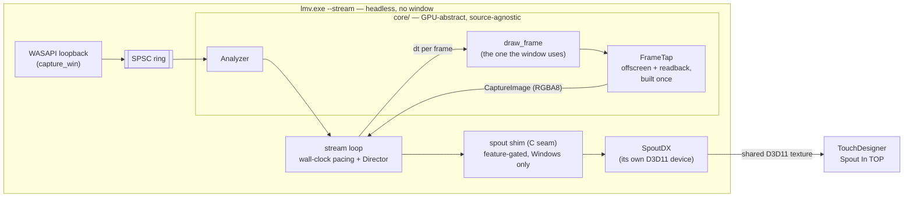

# 0115 — The engine becomes a live video source

> **Status:** draft
> **Created:** 2026-08-25
> **Owner skill(s):** dev, human
> **Related ADRs:** [0125](../adrs/0125-the-live-video-out-is-a-spout-sender-fed-by-a-frame-tap.md) (proposed),
> [0115](../adrs/0115-the-foobar-component-is-a-released-artifact-with-a-parameterized-sdk.md),
> [0114](../adrs/0114-the-engine-renders-video-offline-and-delegates-encoding.md),
> [0001](../adrs/0001-rust-core-wgpu-cabi-foobar-shim.md)

## TL;DR

`lmv --stream` runs the visualizer **headless** — no window, no swapchain — rendering live loopback
audio at a declared size and frame rate and publishing every frame as a **Spout sender**.
**TouchDesigner, on the same machine, picks it up with a Spout In TOP.** No codec, no network, one
or two frames of latency. The first user-visible behavior is Spout's own demo sender arriving in
TouchDesigner before a line of engine code is written; the first real one is this engine's picture
there, reacting to whatever is playing.

## Context & problem

The user wants this engine's video inside TouchDesigner, running on **the same Windows machine**,
with **no window** on our side. The engine becomes a headless source feeding somebody else's
composite — one step further out than
[NFR §10](../nfr.md#10-live-performance-added-in-the-2026-07-21-follow-up-interview)'s "renders to
a projector", and the same live-show use.

Two things the engine already has make this small. `shot --render`
([ADR-0114](../adrs/0114-the-engine-renders-video-offline-and-delegates-encoding.md), Plan 0101)
walks a clip headless, rendering through the same `draw_frame` the window presents through and
reading each frame back — with memory behaviour proven over 14,400 consecutive frames (Plan 0099).
And the foobar component ([ADR-0115](../adrs/0115-the-foobar-component-is-a-released-artifact-with-a-parameterized-sdk.md))
already establishes how this repo takes on a third-party C++ SDK: fetched against a pinned hash,
never committed, staged by a script that CI and a developer run identically.

What is missing is a **wall clock** and a **sink**. The render path is driven by a file cursor at
whatever speed the machine manages — the property ADR-0114 was proud of, and the property a live
source must give up — and the frames have nowhere to go but a pipe.

**The transport question was asked twice and the second answer is the one that counts.** With
TouchDesigner on another machine over WiFi it is a bandwidth problem, and h.264 through `ffmpeg`
beats NDI by an order of magnitude. On one machine there is no link, no bandwidth problem, and no
reason to run a codec at all.
[ADR-0125](../adrs/0125-the-live-video-out-is-a-spout-sender-fed-by-a-frame-tap.md) records the
decision, the three alternatives it beat, and the remote case that stays deferred.

## Decision

We add a **frame tap** to `core`'s render API — persistent offscreen target plus readback buffer,
drawn through the same `draw_frame` the window presents through, at a caller-supplied per-frame
`dt`, returning the `CaptureImage` every capture path already returns — and a **headless `stream`
mode** in the standalone that drives it from the live loopback ring at wall-clock cadence and
publishes each frame as a Spout sender through `SpoutDX`'s **CPU pixel** entry point.

**The tap is in `core`, the Spout sender is in `standalone`.** Spout is Windows, D3D11 and
third-party — everything the source-agnostic, GPU-abstract core rule forbids. That split is not
bookkeeping: it is what makes the tap transport-agnostic, so the deferred remote sink (ADR-0114's
`ffmpeg` pipe, already built for `--render`) attaches later without the core moving.

Two non-obvious calls, both stated in ADR-0125 with their exits. We take the **CPU pixel path, not
zero-copy** texture sharing, because zero-copy means unsafe `wgpu-hal` interop against a raw D3D12
device at the one seam [ADR-0001](../adrs/0001-rust-core-wgpu-cabi-foobar-shim.md) keeps abstract —
and if measurement convicts the two copies, that is the known fix and nothing here has to move to
adopt it. And we add a **tap** rather than reusing `Renderer::capture_stream`, because that entry
point takes one fixed `dt` for a whole run (so a machine that falls behind would run the animation
slow against the music) and renders one named preset start to finish (so rotation, which a
four-hour source needs, is not expressible through it). `capture_frame` is not a candidate at all:
it builds a fresh texture and readback buffer on **every call**, right for QA tooling and wrong for
864,000 of them.

## Architecture diagram



## Implementation phases

### Phase 1 — Stage the SDK and prove the receiving half, with no engine code

- **Owner skill:** human
- **What:** establish, using Spout's **own** demo sender and TouchDesigner alone, that a Spout
  source arrives in a Spout In TOP on this machine and looks right — and read the four facts
  ADR-0125 flagged as unverified out of the staged SDK. **This is a stop gate:** if Spout does not
  reach TouchDesigner here, Phase 3 onward does not proceed as written.
- **Files touched:** none in the repo. Findings go in this plan's `## Implementation log`.
- **How:** download the pinned Spout2 release, unpack it outside the repo, run the bundled demo
  sender, and open a Spout In TOP in TouchDesigner. Then, for the colour question, have the demo
  sender publish a **known reference image** (a mid-grey patch and a black-to-white ramp) and put
  the same file into a Movie File In TOP beside it — if the two do not match, the TOP needs a
  colour setting, and this phase is where that is discovered rather than in Phase 6.
- **Done when** this plan's log records six things:
  - **Whether the demo sender appears in a Spout In TOP**, and the sender name TouchDesigner shows.
  - **The Spout2 release version and its SHA-256**, ready for a pin file in Phase 3.
  - **The licence**, read from the SDK's own licence file — ADR-0125 asserts BSD and this is the
    check on that assertion. If it is not a licence permitting a pinned fetch and redistribution of
    a linked binary, that is a blocking finding and the plan stops here.
  - **The exact `SpoutDX` CPU entry point** — its name, its signature, and the meaning of its
    channel-order and row-order flags — read from the staged headers, not from memory.
  - **How TouchDesigner reads the colour**: whether the reference image matched, and what the TOP
    needed if it did not.
  - **Whether a Spout sender survives the sending process changing resolution**, since Phase 4 must
    decide whether a resize tears down the sender or updates it.

### Phase 2 — The core grows a transport-agnostic frame tap

- **Owner skill:** dev
- **What:** `Renderer` gains a persistent tap — offscreen render target plus readback buffer,
  created once — and a per-frame entry point that draws through the same `draw_frame` every other
  path uses, at a caller-supplied `dt`, returning a `CaptureImage`. **Core-only: no new dependency,
  no C ABI change, nothing platform-specific, and nothing that names Spout.** This phase is
  independently valuable and would survive a Phase 1 that killed the rest of the plan.
- **Files touched:** `core/src/render/capture.rs` (reach the existing target/readback constructors
  from the new API), `core/src/render/capture_api.rs`, `core/src/render/mod.rs`, a new file under
  `core/tests/`.
- **Done when:**
  - **A frame taken through the tap is byte-identical to `capture_frame`'s frame at the same
    clock**, for the same preset and the same `AnalysisFrame`. This is the property that says the
    tap sits at exactly the stage ADR-0114 put the render tap at. It is asserted **exactly**, on
    the precedent of `standalone/tests/shot_cli.rs`'s
    `a_rendered_frame_is_byte_identical_to_the_png_the_app_writes` and for its reason: a tolerance
    would pass with the tap one stage too early, which is the failure most likely to ship unnoticed.
  - **One tap renders 300 consecutive frames with no per-frame GPU allocation.** State the claim
    against what is observable — the texture and buffer are built in the constructor and taken by
    reference per frame, so the test asserts that 300 calls complete and that the resident set does
    not grow across them beyond the sampling noise `ResidentSet` already reports for `--render`.
    Reuse that helper rather than writing a second one.
  - `cargo nextest run` and `cargo clippy --workspace --all-targets` are clean, and the hot-path
    panic-denial pragma is on any file added under `core/src/render/`.

### Phase 3 — The Spout shim: an `extern "C"` seam over SpoutDX

- **Owner skill:** dev
- **What:** a ~60-line C++ file exposing four `extern "C"` entry points (create, send, resize,
  destroy) over `SpoutDX`, compiled by a new `standalone/build.rs`, behind a **`spout` cargo
  feature that is off by default** and a Windows target cfg. Plus the SDK staging scripts, mirroring
  `packaging/foobar/` exactly.
- **Files touched:** `standalone/build.rs` (new), `standalone/src/spout/shim.cpp` (new),
  `standalone/src/spout/mod.rs` (new — the Rust side of the seam), `standalone/Cargo.toml`
  (the feature, and `cc` as a **build**-dependency), `packaging/spout/fetch-sdk.ps1` +
  `packaging/spout/sdk-pin.ps1` (new), `.gitignore`, `standalone/README` or the docs Phase 7 writes.
- **Notes for the implementer:**
  - **The SDK is never committed** — fetched against the Phase 1 SHA-256, gitignored. ADR-0115
    Alternative A is the precedent and `packaging/foobar/fetch-sdk.ps1` is the shape to copy.
  - The C seam exists so the C++ surface is four functions wide. This repo already runs a thin
    C++ shim over a C boundary in `plugin-foobar/`; this is the same discipline pointing the other
    way.
  - **`standalone/src/spout/mod.rs` is the only Rust that names Spout, and `core/` never does.**
- **Done when:**
  - With `--features spout`, a small example or ignored-by-default test publishes a known solid
    colour and a black-to-white ramp, and TouchDesigner's Spout In TOP shows them — **matching the
    reference the same way Phase 1 established**, so a channel-order or row-order flag that is
    wrong is caught here and not at Phase 6.
  - **Without the feature, `cargo build`, `cargo clippy --workspace --all-targets` and
    `cargo nextest run` behave exactly as they do today and need no SDK, no MSVC C++ step and no
    network.** This is the property that keeps CI and every ordinary build untouched, and it is the
    one to check deliberately rather than assume.
  - `fetch-sdk.ps1` fails loudly on a hash mismatch rather than proceeding.

### Phase 4 — `lmv --stream`: the headless live source

- **Owner skill:** dev
- **What:** the walking skeleton end to end. A `--stream` branch in `main()` **ahead of the event
  loop**, beside the existing `--list-devices` early exit: start loopback capture, build a
  **headless** `Renderer` at the requested size, open the tap and a Spout sender, then loop —
  drain the ring into the `Analyzer`, measure `dt`, render through the tap, hand the pixels to
  Spout, sleep to the next frame deadline. No window, no swapchain.
- **Files touched:** `standalone/src/stream.rs` (new), `standalone/src/lib.rs`,
  `standalone/src/main.rs`, `standalone/tests/`.
- **Notes for the implementer:**
  - Pacing reads the wall clock, so those call sites need the same
    `#[allow(clippy::disallowed_methods, reason = "…")]` shape `main.rs` already uses for frame
    pacing. **`core` still never reads a clock.**
  - Arg parsing, the request struct and the frame-deadline arithmetic are pure functions — put them
    where they are testable without a GPU or an audio device, as `shot/args.rs` and `shot/film.rs`
    are.
  - Built **without** the `spout` feature, `--stream` must fail with a named error saying the
    binary was built without it — not silently do nothing.
- **Done when:**
  - `lmv --stream --size 1280x720 --fps 60`, with music playing, shows this engine's picture live
    in a TouchDesigner Spout In TOP, reacting to that music.
  - **No window is created** in that mode — checked deliberately, since the whole point of the mode
    is that there is nothing to look at locally.
  - **At exit the mode prints, to stderr, three numbers: frames emitted, wall-clock elapsed, and
    scene-clock elapsed.** They exist so Phase 6's reading is a measurement rather than an
    argument. **No threshold is asserted on them here.**
  - `--stream` with no capture device available fails with a named error naming the flag.

### Phase 5 — The stream survives a set

- **Owner skill:** dev
- **What:** a source stuck on one preset for four hours is not what NFR §10 describes. Wire the
  existing `Director` into the stream loop so presets rotate exactly as they do in the window —
  `Director::advance(dt, frame)` is already the whole interface — with `--preset <name>` pinning one
  and disabling rotation. Add periodic resident-set reporting, reusing `ResidentSet`, and a
  per-stage cost line (render / readback / send) so Phase 6 can convict the right stage rather than
  guess.
- **Files touched:** `standalone/src/stream.rs`, `standalone/src/director.rs` (only if the existing
  API genuinely does not reach), `standalone/tests/`.
- **Done when:**
  - A ten-minute run at 60 fps rotates presets, and stderr shows the rotations.
  - `--preset <name>` holds that preset for the whole run and logs no rotation.
  - The run reports resident set at intervals and at exit in the shape `--render` already prints
    (`resident set N MB, growth +X MB across F frames`), and reports the three per-stage costs.
    **No growth or cost threshold is asserted here** — these are the readings Phase 6 is taken
    against.

### Phase 6 — The gate: in TouchDesigner, for real

- **Owner skill:** human
- **What:** run the finished mode into TouchDesigner and settle the things no test in this repo can.
  This phase can send the plan back: if the colour is wrong in a way Phase 1's setting does not fix,
  or the frame cost does not fit, those are findings with named next steps.
- **Files touched:** none. Findings go in the log, and into Phase 7's docs.
- **Done when** five things are written down:
  - **Colour fidelity.** Put the Spout In TOP beside a `shot --frame-at` PNG of the same preset at
    the same size and compare. ADR-0125 names this as the hazard nothing in the repo can catch, and
    this is the instrument.
  - **The largest size and frame rate that hold steady** for ≥ 30 minutes (108,000 frames at
    60 fps), with the per-stage cost line from Phase 5 saying what the limit was.
  - **Latency**, estimated by eye against the audio — good enough to answer "can you cut to this",
    which is the question that matters.
  - **Resident-set growth** across that run.
  - **A plain sentence on whether this is usable** for the work the user actually wants to do in
    TouchDesigner.

### Phase 7 — Packaging and docs

- **Owner skill:** dev
- **What:** ship it, and write down what Phase 6 measured.
- **Files touched:** `.github/workflows/release.yml` (stage the pinned Spout SDK and build
  `lmv.exe` with `--features spout`, mirroring the existing `foobar` job), `packaging/` (the
  READ-ME-FIRST a tester finds in the zip), `docs/capturing.md` (a live-source section beside
  `--render`, since that page already owns the frame-stream story), `README.md` (the CLI flags),
  `docs/nfr.md` (§3 gains a sentence stating the streamed picture sits **outside** the 60 ms
  audio-to-visual budget, which binds the window and always did).
- **Done when:**
  - A release build of `lmv.exe` streams to TouchDesigner **without the user compiling anything**.
  - A reader who has never seen this plan can set up both sides from `docs/capturing.md` alone,
    including the TouchDesigner colour setting Phase 1 established.
  - `node scripts/check-doc-links.mjs` and `node scripts/check-index-rows.mjs` exit 0.

## Data shapes

```rust
// illustrative — not the final interface

/// Persistent offscreen target + readback for a sustained live tap. Built once;
/// every frame reuses it. Contrast `capture_frame`, which builds both on every
/// call — correct for QA tooling, wrong for 864,000 frames.
pub struct FrameTap { /* texture, view, readback buffer, padded_bpr */ }

impl Renderer {
    /// Build a tap sized to this renderer's configured target.
    pub fn open_tap(&self) -> Result<FrameTap, RenderError>;

    /// Advance the clock by `dt` real seconds, draw the active preset for
    /// `frame` through the same `draw_frame` the window presents through, and
    /// read the result back. `dt` is per call — a caller that falls behind stays
    /// in step with the music instead of running the animation slow.
    pub fn render_tapped(
        &mut self,
        tap: &mut FrameTap,
        frame: &AnalysisFrame,
        dt: f32,
    ) -> Result<CaptureImage, RenderError>;
}
```

```c
/* illustrative — standalone/src/spout/shim.cpp, the whole C++ surface */
typedef struct LmvSpout LmvSpout;
LmvSpout *lmv_spout_create(const char *sender_name, unsigned width, unsigned height);
int       lmv_spout_send(LmvSpout *, const unsigned char *rgba, unsigned width, unsigned height);
int       lmv_spout_resize(LmvSpout *, unsigned width, unsigned height);
void      lmv_spout_destroy(LmvSpout *);
```

## Risks & open questions

- **Phase 1 may fail, and it is placed first so that costs an hour.** If Spout does not reach this
  TouchDesigner install, or the licence is not what ADR-0125 assumes, the transport choice is wrong
  before any code exists. Phase 2 is deliberately independent of that outcome — a transport-agnostic
  frame tap is worth having either way, and the deferred remote sink needs exactly it.
- **The frame budget is not proven.** At 60 fps each frame has 16.7 ms for render, readback and
  send. At 1280x720 the readback is 3.69 MB a frame (221.2 MB/s sustained, and the same again on
  Spout's upload); at 1920x1080 it is 8.29 MB and 497.7 MB/s each way. `--render` sustains the
  readback side today with **no deadline** — nothing in this engine has ever run one against a wall
  clock. Phase 5's per-stage cost line is the instrument, and the mitigations if it does not fit are
  ordinary and already exposed: a smaller size, a lower frame rate, `--tier floor`. The
  extraordinary one — zero-copy sharing — is ADR-0125's Alternative A and stays unbuilt until a
  measurement convicts.
- **The readback blocks, deliberately.** `capture::read_back` is `map_async` + `poll(Wait)`, which
  this codebase forbids in the live *display* loop and which is fine here: there is no present
  deadline, only throughput, and the audio thread stays decoupled by the ring exactly as before. If
  it turns out to be what eats the budget, the fix is a two-frame readback ring — one buffer being
  mapped while the next is drawn — and it is deliberately **not** in scope, because a plan that
  builds it before measuring has guessed.
- **Colour is the likeliest way this ships looking wrong.** The tap reads back `Rgba8UnormSrgb` —
  display-referred, dithered in the encoded domain ([ADR-0096](../adrs/0096-the-display-write-dithers.md))
  — and Spout publishes unlabelled 8-bit. This project has shipped a wash-out defect before
  ([Plan 0111](done/0111-the-milkdrop-import-stops-washing-out.md)), and no instrument here can see
  it. Phase 1 answers it with a reference image before we build, Phase 3 re-checks it on our own
  sender, and Phase 6 checks the real picture against a `shot` PNG. Three passes, because it is
  cheap to check and expensive to miss.
- **Falling behind is visible in a specific way.** The scene clock takes the measured `dt`, so a
  slow machine yields *fewer, correctly-timed* frames rather than a slow-motion picture. Spout has
  no frame-rate contract, so the TOP simply sees the latest frame — which is the behaviour we want,
  but it also means a stream running at half rate looks like a smooth stream, not a struggling one.
  The Phase 5 cost line is the only place that shows.
- **Two render loops now exist** — the window's `render` and the stream's — walking the same
  `draw_frame`. ADR-0125 names this as a cost. Only one runs per process, and Phase 4 keeps them
  structurally parallel (`pump_audio` → `dt` → render) so a change to one reads as an omission in
  the other.
- **A C++ build step reaches a second artifact.** `lmv.exe` is pure `cargo` today. The feature gate
  keeps that true for everyone who does not ask, but the release job now needs MSVC and a staged
  SDK where it did not. The foobar job proves the pattern; this doubles the surface it runs on.
- **Nothing in the golden suite can cover this mode.** Wall-clock paced, therefore not reproducible.
  Every done-when above touching the live path is either a byte-identity claim against a
  *deterministic* path (Phase 2) or a human reading (Phases 1, 3, 6). That is deliberate and it is
  the price ADR-0125 records.

## What this plan does NOT do

- **No macOS.** Spout is Windows-only; the Mac analogue is Syphon, a different SDK against a
  Metal/IOSurface seam. The mode is Windows-first for the same reason loopback capture is.
- **No remote / cross-machine streaming.** Deferred by the user's own answer. ADR-0125's
  Alternative D is the shape it takes when it comes — ADR-0114's `ffmpeg` pipe attached to the same
  tap — and it is a followup, not a phase.
- **No NDI.** ADR-0125 Alternative B, with its reasons and the condition under which it comes back.
- **No zero-copy texture sharing.** ADR-0125 Alternative A, unbuilt until a measurement demands it.
- **No async readback ring.** Named as the mitigation if Phase 5's cost line convicts the readback,
  and deliberately unbuilt until then.
- **No audio in the stream.** Spout is a video transport; TouchDesigner takes audio from its own
  source.
- **No windowed streaming.** Headless because the user asked for headless. Streaming *and*
  previewing would mean either two render paths per frame or presenting the tapped texture, and
  neither was asked for.
- **No C ABI change, so no foobar-plugin streaming.** The tap is native Rust API. Extending it
  across the C ABI is a versioned-contract change and its own ADR.

## Implementation log

> Written by `dev` — one row per phase as that phase's commit lands, and the close block after the
> last one. **The phases above are the contract; everything here is what happened.**

**Lane:** _(to be filled by `dev`)_

| phase | owner | state | commit |
|---|---|---|---|
| 1 — Stage the SDK, prove the receiving half | human | not started | |
| 2 — The core grows a frame tap | dev | not started | |
| 3 — The Spout shim | dev | not started | |
| 4 — `lmv --stream` | dev | not started | |
| 5 — The stream survives a set | dev | not started | |
| 6 — The gate in TouchDesigner | human | not started | |
| 7 — Packaging and docs | dev | not started | |

### Notes

### Close triggers

- **`presets/` touched:**
- **Plan header `Closes:`** none
- **What shipped:**
- **Operator docs touched:**
- **Backlog probes (`node scripts/check-backlog-claims.mjs`):**
- **Outstanding `human` phases:**

## Followups (after this lands)

- **The remote sink**, when TouchDesigner moves to another machine: ADR-0114's `ffmpeg` pipe
  attached to the same frame tap, h.264 over SRT or RTSP into a Video Stream In TOP. The user has
  said this matters later.
- **Zero-copy Spout** (ADR-0125 Alternative A), if Phase 5's cost line convicts the readback.
- **An async two-frame readback ring**, same trigger, cheaper than zero-copy and less invasive.
- **Syphon on macOS**, if the Mac frontend ever needs a video-out.
- **The stream mode over the C ABI**, so the foobar plugin can be a source too.
