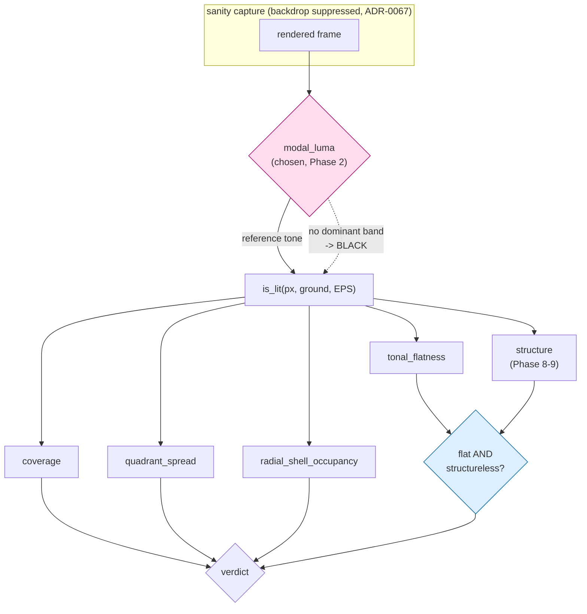

# 0116 — The sanity lens finds the ground

> **Status:** in-progress
> **Created:** 2026-08-25
> **Approved:** 2026-08-25
> **Owner skill(s):** dev, human
> **Related ADRs:** [0126](../adrs/0126-the-sanity-lens-measures-departure-from-the-frames-own-ground.md) (proposed),
> [0127](../adrs/0127-a-tonally-flat-picture-is-a-blot-only-if-it-is-also-structureless.md) (proposed)
> **Closes:** design-backlog 0128
> **Amended:** 2026-08-26, at Phase 2's stop gate. `modal_luma` chosen; Phases 3-7 corrected against
> Phase 1's measurement; **Phases 8-9 added** carrying ADR-0127, because the measurement showed the
> ground fixes two of ADR-0126's three motivations and structurally cannot fix the third.
> **Sequencing constraint:** must land **before [Plan 0113](0113-the-engine-paints-a-canvas.md)
> Phase 6**, which is where the emptying canvas arrives. Plan 0113 Phases 3-5 are unaffected and the
> two lanes can run in parallel until then.

## TL;DR

`core/tests/sanity.rs` measures every preset against a hardcoded `BLACK`, so a scene that paints its
own ground is unmeasurable: twelve shipped presets already read `coverage = 1.0000` exactly, and the
one statistic still live for them is read only at the excitation where the defect it guards against
cannot appear. This plan re-bases `is_lit` — and therefore all four statistics — on a ground
**derived from the frame**. The estimator is chosen in Phase 2 from Phase 1's measured table, not
from argument, because the obvious candidate is already falsified.

**Phase 1 ran and it moved the plan.** The estimator is free — `modal_luma` re-bases 17 of 41 presets
and changes **no** verdict at either excitation — and it clears the degeneracy for the eight presets
that have a ground. It cannot clear it for the four that do not, and it cannot repair the
flat-graphic false positive at all: that one is a property of `tonal_flatness` itself, not of the
reference it measures from. Phases 8-9 carry [ADR-0127](../adrs/0127-a-tonally-flat-picture-is-a-blot-only-if-it-is-also-structureless.md)
for that residue.

## Context & problem

ADR-0126 carries the full argument and the measurements. The short form is three facts:

1. **`coverage = 1.0000` already ships**, for all seven `fragment_field` presets plus `Vellum`,
   `Facet`, `Drift`, `Ink on Paper`, `Thomas` and `Valentine`. For those twelve, `coverage`,
   `quadrant_spread` and `radial_shell_occupancy` are constants, not measurements.
2. **The false negative is designed-in.** Plan 0113 Phase 6 builds a canvas the music empties.
   `sanity` reads `tonal_flatness` only at `LOUD`, where the canvas is fullest; the quiet capture
   buys only `MODERATE_MIN_COVERAGE`, which is degenerate for that family. An emptied canvas and a
   broken one are the same picture and nothing looks at it.
3. **The false positive convicts correct content.** `fragment_tiledmono` reads `flatness = 0.9346`
   against a `0.90` ceiling because its black *ink* is excluded as unlit.

The naive repair is already falsified and must not be re-attempted: re-basing on the most populous
luminance bucket changes the reference for **17 of 41** shipped presets.

## Decision

Implement ADR-0126: one derived reference tone, threaded through `is_lit`, with the estimator picked
by a measured stop gate. We take the root fix over the cheaper `tonal_flatness`-only change because
three of the four statistics are degenerate for exactly the content that motivates the work.

## Implementation phases

### Phase 1 — What each candidate ground would say

- **Owner skill:** dev
- **What:** A measurement harness only. **No production behaviour changes in this phase.** For every
  preset in the embedded set, at both `LOUD` and `MODERATE`, print the reference tone each candidate
  estimator picks and the four statistics that follow from it, beside today's `BLACK` baseline.
- **Candidate estimators to table** (the roster is the deliverable, not a choice yet): the frame's
  modal luminance bucket; the modal bucket among **border** pixels only; the modal **RGB** cluster
  rather than luminance; and `BLACK` itself as the control column.
- **Files touched:** `core/tests/` (a new reporting test or an example under `standalone/examples/`).
- **Done when:**
  - The table covers every preset in the embedded set at both excitations, and prints the control
    column so a candidate's effect is read as a difference rather than an absolute.
  - For each candidate, the report names **which presets change verdict** (pass→fail and fail→pass)
    against today's floors, since that count is what Phase 2 decides on.
  - `shape_collage` is included if Plan 0113's branch has merged by then; if not, the report says so
    where the table is read rather than silently omitting the family that motivates the work.
  - The harness is a report and gates nothing — it must not be able to redden CI on its own.

### Phase 2 — The stop gate

- **Owner skill:** human
- **What:** Read Phase 1's table and choose the estimator, or reject all of them.
- **Done when:** one of:
  - **An estimator is chosen** — Phase 3 proceeds with it, and the choice is recorded in this plan
    with the count of verdict changes it accepts.
  - **None is acceptable** (every candidate re-bases too much of the library). The plan stops here
    and routes back to `architect`; ADR-0126 gains a dated `Outcome` recording what was measured and
    that the derivation approach did not survive contact. **This is a real outcome, not a
    formality** — the alternative ADR-0126 kept alive for exactly this case is reading
    `tonal_flatness` at the quiet excitation, which is a much smaller change.

**Outcome (2026-08-26) — `modal_luma` chosen, and the gate did not end the plan.**

Phase 1's table (`each_candidate_ground_is_tabled_against_the_library`) reports, over the embedded
set plus the held-out `Tiled Rosette Mono`:

| candidate | re-based @`LOUD` | re-based @`MODERATE` | pass -> fail | fail -> pass |
|---|---|---|---|---|
| `modal_luma` | 17 / 41 | 15 / 41 | **0** | **0** |
| `modal_border` | 16 / 41 | 16 / 41 | **0** | **0** |
| `modal_rgb` | 17 / 41 | 15 / 41 | **0** | **0** |

**The estimator accepts zero verdict changes.** ADR-0126's "17 of 41" is reproduced exactly and its
reading of that count — that re-basing half the library makes it "a different lens" — is falsified in
the permissive direction: the library's verdicts are insensitive to it. `modal_luma` is chosen as the
simplest of three that measured equivalent; `modal_border` adds a structural assumption (the ground
reaches the frame edge) and `modal_rgb` a sparser histogram, neither for any measured return.

Two findings from the same table redirect the rest of the plan, and both are recorded in ADR-0127:

1. **The estimator clears the degeneracy for 8 of the twelve, and structurally cannot for 4.**
   `Tiled Rosette` `1.0000 -> 0.1645`, `Ink on Paper` `-> 0.2167`, `Thomas` `-> 0.2917`, `Vellum`
   `-> 0.3704`, `Valentine` `-> 0.4389`, `Facet` `-> 0.5940`, `Vitrail` `-> 0.7071`, `Banded Mandala`
   `-> 0.7574`. But `Sumi`, `Whorl`, `Supernova` and `Neon Tunnel` are smooth luminous fields whose
   modal band holds `7.4 %` / `5.0 %` / `0.7 %` / `0.3 %` of the frame — at or under the `6.25 %` a
   uniform distribution puts in one of sixteen bands. They have no ground, and their `coverage` of
   1.0 is honest.
2. **No estimator repairs `Tiled Rosette Mono`.** All three find the paper at `(245,245,245)` and all
   three still convict it: `0.9413` / `0.9419` / `0.9413` against `0.9346` under the control. ADR-0127
   carries the arithmetic; the short form is that a duotone has two large populations and `is_lit`
   removes whichever one is the ground, so the other holds ~94 % of what remains either way.

### Phase 3 — The lens takes a ground

- **Owner skill:** dev
- **What:** Thread `modal_luma` through `is_lit` and the four statistics that call it.
- **Files touched:** `core/src/render/metrics.rs`, `core/tests/sanity.rs`, and every other caller of
  these metrics. **Corrected 2026-08-26:** `golden.rs` and `reactivity.rs` do *not* pass `BLACK` to
  these functions — both import only `frame_diff`, which takes no reference. The callers that do are
  `core/tests/animation.rs`, `core/tests/warp_mesh.rs`, `core/tests/attractor.rs`,
  `core/tests/reaction_diffusion.rs` and `standalone/src/shot/{report,horizon}.rs`. Audit that list.
- **Done when:**
  - The estimator's behaviour on a frame with **no dominant tone** is defined in code and asserted,
    not discovered later. A uniform-noise frame is the test case. **The rule is derived, not tuned:**
    a modal band holding no more than the share a uniform distribution would put in one band
    (`1 / TONE_BANDS`) is not a ground, and the estimator returns `BLACK` there. Phase 1 measured
    four shipped presets under or near that line (`Supernova` `0.7 %`, `Neon Tunnel` `0.3 %`, `Whorl`
    `5.0 %`, `Sumi` `7.4 %`) — record which fall back, and that no verdict moves either way.
  - Every preset either keeps its verdict or appears on Phase 5's adjudication list. **No preset
    changes verdict silently.** Phase 1 measured this list as **empty** against today's floors; a
    non-empty one here means the threaded implementation diverged from the harness, which is a
    finding before it is an adjudication.
  - Callers that should be unaffected are shown to be unaffected: the golden baselines are
    **byte-identical**, or the phase explains per image why not.
  - **`fragment_tiledmono` is NOT expected to pass here.** Phase 1 measured that no ground estimator
    repairs it; the preset stays in `presets/pending/` until Phase 9. Moved out of this phase's
    done-when on 2026-08-26 — see Phase 2's Outcome and ADR-0127.

### Phase 4 — The floors are re-derived, not re-used

- **Owner skill:** dev
- **What:** Every per-system `coverage_floor` and `MAX_FLOOR_SLACK` is a constant measured against
  the old predicate. Re-derive them against the new one.
- **Files touched:** `core/tests/sanity.rs`.
- **Done when:**
  - Each floor is re-derived by the rule already documented beside it (half the family minimum), from
    the **new** distribution, and the doc comment records the date and what moved.
  - **The `shape_collage` arm does not exist on this branch** and this bullet cannot be satisfied
    here (noted 2026-08-26): Plan 0113 has not merged, so `coverage_floor` has no `ShapeCollage` arm
    to re-point. The obligation passes to Plan 0113's own merge, which is already sequenced after
    this plan. Say so in the log rather than inventing the arm.
  - **`SystemKind::ShapeField`'s arm is stale and is in scope.** It states the family "has zero
    shipped members and this floor has never gated anything", but `Facet` and `Pulse` ship and Phase
    1's table carries `Facet` at `coverage 1.0000` under the control. Re-derive it from the printed
    distribution like every other floor, at half the family minimum.
  - `MAX_FLOOR_SLACK` still holds against shipped content, or is re-measured with its own note. Note
    that Phase 3 lowers many measured coverages, so slack moves **down** — the direction that
    tightens floors rather than loosening them.

### Phase 5 — Adjudicate what changed

- **Owner skill:** human
- **What:** For each preset whose verdict moved, decide: latent defect the old lens could not see, or
  correct content the new lens is wrong about.
- **Done when:** every entry on the list has a recorded verdict. A preset judged defective routes to
  `preset-author` as content work; a preset the new lens is wrong about is a Phase 3 finding and
  sends the estimator back, not the preset.
- **Expected size, measured (2026-08-26):** Phase 1 found **zero** verdict changes from the estimator
  alone, so this list is expected to be empty or near it. What can still fill it is **Phase 4** —
  re-derived floors move verdicts even when the statistics behind them do not. An empty list is a
  valid outcome and this phase is then a one-line confirmation, not a formality to pad.

### Phase 6 — The emptying canvas is actually caught

- **Owner skill:** dev
- **What:** Close the false negative that started this, with a test that fails on today's lens.
- **Files touched:** `core/tests/sanity.rs`.
- **Done when:**
  - A capture of a canvas with no live elements — a bare ground — is **convicted**, and the test
    demonstrably fails if reverted onto the `BLACK` predicate.
  - **The fixture is synthetic, not `shape_collage`** (noted 2026-08-26): Plan 0113 has not merged,
    so no scene in this branch paints a bare canvas. Build the bare ground the way this file already
    builds `blown_out()` and `pre_repair_spectrum_ridge()` — an inline `Preset::from_toml_str`
    fixture whose ground stage paints and whose figure draws nothing. The attractor's `ink_*` remap
    is a terminal engine stage that ADR-0067's backdrop suppression does not reach, which is what
    makes a paper-white frame reachable without `shape_collage`.
  - The statistic that convicts it is read at an excitation where an emptied canvas can actually
    occur, which today's `LOUD`-only tonal read is not.
  - The distinction the lens must now make is asserted as a property, not a threshold: a bare ground
    and a composed canvas are separated, and **no number is invented** for how sparse a legitimate
    composition may be. That is a content judgement and stays one.

### Phase 7 — Documentation

- **Owner skill:** dev
- **What:** Sweep what the change makes stale.
- **Files touched:** `docs/capturing.md` (the gate table), `core/tests/sanity.rs` module docs,
  `presets/pending/README.md`.
- **Done when:**
  - The module docs no longer describe the lens as measuring against black; the gate table in
    `docs/capturing.md` reflects what each statistic now answers. Prefer count-free phrasing.
  - **Two pre-existing errors in that same gate-table row are corrected while it is open** (found
    2026-08-26, `docs/capturing.md:1517`): it says presets are measured "**against its own
    background**", which ADR-0067 made false two years of plans ago, and it says "`Spectrum Ridge` is
    listed in `KNOWN_FLAT` — it measures `1.000` today", where `KNOWN_FLAT` is empty and that preset
    reads `0.1916`.
  - `presets/pending/README.md`'s "Held today" table is re-pointed: `fragment_tiledmono`'s blocker is
    no longer "sanity excludes black as unlit" (Phase 1 falsified that), and its exit is Phase 9, not
    Phase 3. If Phase 9 shipped the preset, the row leaves the table entirely.

### Phase 8 — What separates a composition from a blot

- **Owner skill:** dev
- **What:** A measurement harness, the same shape as Phase 1 and for the same reason — ADR-0126 named
  a mechanism without measuring it and Phase 1 falsified it one plan later. **No production
  behaviour changes in this phase.** Table candidate **structural** statistics over the lit mask.
- **Candidate statistics to table** (the roster is the deliverable, not a choice): boundary length of
  the lit mask per unit area; count of connected components in the lit mask; absolute Sobel edge
  density over the binary mask; and the existing `tonal_flatness` as the control column.
- **The frames that matter**, all three already frozen in `core/tests/sanity.rs` or reachable from
  `presets/pending/`: the `blown_out()` fixture (a saturated additive mass — **must** read
  structureless), `Tiled Rosette Mono` (**must** read structured), and the whole shipped library
  (**must** move no verdict). Include the four groundless luminous fields — `Sumi`, `Whorl`,
  `Supernova`, `Neon Tunnel` — as rows, since ADR-0127 records them as the same open question.
- **Files touched:** `core/src/render/metrics.rs` (a new pure statistic may land here if a candidate
  needs one; it is unused by any gate in this phase), `core/tests/sanity.rs`.
- **Done when:**
  - Every candidate is printed for every frame above, beside the control, at `LOUD`.
  - The report names, per candidate, the **margin** between `blown_out()` and `Tiled Rosette Mono`
    and whether any shipped preset falls between them. That ordering — separated, with the library
    not in the gap — is the whole criterion.
  - **Thin-stroke content is in the table.** Design-backlog 0072 measured that a hairline over a
    46-fold ornament aliases to almost nothing at 96x96, which is what made `coverage` a halo-meter;
    the three frozen `retired_mandalas()` fixtures already in this file are that content, and a
    boundary-length measure must be shown against them rather than assumed safe.
  - The harness is a report and gates nothing — it must not be able to redden CI on its own.
  - **The stop condition is mechanical, stated here so no phase invents a threshold to clear.** If no
    candidate separates the two fixtures with the library outside the gap, **Phase 9 does not run**:
    the plan closes at Phase 8, ADR-0127 gains a dated `Outcome`, and `fragment_tiledmono` stays held
    with its blocker re-pointed at that Outcome.

### Phase 9 — The flatness ceiling gains a second condition

- **Owner skill:** dev
- **What:** Implement ADR-0127 — a picture is convicted as a blot only when it is tonally flat
  **and** structureless. Runs only if Phase 8's stop condition passed.
- **Files touched:** `core/src/render/metrics.rs`, `core/tests/sanity.rs`,
  `presets/pending/fragment_tiledmono.toml` -> `presets/fragment_tiledmono.toml` (a `git mv`),
  `presets/README.md`.
- **Done when:**
  - The chosen statistic's threshold is derived by the ceremony this file already uses — half the
    sparsest legitimate content — from the distribution Phase 8 printed, and the doc comment records
    the date and the derivation beside the constant (ADR-0071).
  - `blown_out()` is **still convicted**, asserted on the frozen fixture. The gate is now weaker by
    construction, so the test that it did not become vacuous is the load-bearing one.
  - `Tiled Rosette Mono` passes `every_preset_draws_a_real_shape`, and the preset is `git mv`d into
    `presets/` so the gate actually covers it. Its own header stops naming a blocker that no longer
    exists.
  - `MAX_TONAL_FLATNESS`'s doc comment says that flatness is now one of two terms. It currently
    argues the ceiling from the library's distribution as if it were a verdict on its own; left
    unedited that becomes the most confidently wrong paragraph in the file.
  - No other shipped preset changes verdict, or it appears on Phase 5's list — which this phase
    reopens if it fills.

## Architecture diagram

Today the pink diamond is the constant `BLACK`; Phases 3-4 make it `modal_luma`, and everything
between it and the four statistics is unchanged in shape — which is why the ground is one change at
the root rather than four.

The blue diamond is [ADR-0127](../adrs/0127-a-tonally-flat-picture-is-a-blot-only-if-it-is-also-structureless.md),
added at the Phase 2 gate. It is a **separate** change and deliberately downstream of the first: the
ground decides *which pixels are the figure*, and this decides *what the figure having one tone is
allowed to mean*. Phase 1 measured that the first cannot do the second's job.

## Risks & open questions

- **The estimator may not exist.** Phase 2 can legitimately end the plan. That is why Phase 1 builds
  no production behaviour — a rejected estimator costs one harness, not a rewrite.
- **Verdict churn is the real cost**, not the code. Phase 5 is human work of unknown size, bounded
  only by Phase 1's measured count — which is exactly why Phase 2 decides on that count.
- **Racing Plan 0113.** If 0113 reaches Phase 6 first, its emptying canvas ships unmeasured. The
  phase added to 0113 records the dependency so `dev` sees it in the plan it is actually reading.
  **Phase 1 sharpened this:** 0113 has not merged, so Phases 6 and 8 both work against synthetic
  fixtures, and 0113 inherits the obligation to re-point its own `coverage_floor` arm at its merge.
- **The plan grew a second decision at its own stop gate**, which is the risk the Phase 2 gate was
  built to expose and not the one it was expected to find. Phases 8-9 carry ADR-0127 and have their
  own mechanical stop condition (Phase 8's last bullet) for exactly that reason: if the structural
  statistic does not survive measurement either, the plan closes at Phase 8 with the ground landed
  and the residue routed, rather than growing a third attempt.
- **Two terms make the flatness gate strictly weaker.** ADR-0127's Negative section states the cost:
  a picture that is tonally flat and structurally busy now passes, and a defect with that signature
  would ship. Phase 9's non-vacuity assertion on `blown_out()` is what holds the line.
- **Resolved:** whether the quiet excitation should also read `tonal_flatness` once the ground is
  right. Phase 1's table says no — `modal_luma` moves no verdict at `MODERATE` either, so a second
  read buys nothing measurable today. Left unbuilt; it stays cheap if the library changes.

## What this plan does NOT do

- **It does not retune any preset.** `fragment_tiledmono` is unchanged; the lens changes. Phase 9
  `git mv`s that file into `presets/` — shipping it, not editing it.
- **It does not add a preset-level or system-level ground declaration.** ADR-0126 rejects both, on
  the measured fact that `fragment_field` hosts luminous and graphic presets simultaneously.
- **It does not add an exemption roster.** `KNOWN_FLAT` stays empty.
- **It does not change what the engine renders.** Every file it touches is a test or a metric.
- **It does not decide how sparse a composition may legitimately be.** No such threshold is invented.
- **It does not answer the composition-or-fill question for the four groundless luminous fields.**
  `Sumi`, `Whorl`, `Supernova` and `Neon Tunnel` keep `coverage` near 1.0 after Phase 3 and that
  reading is honest. Phase 8 tables them so the instrument is known; ADR-0127 records the question as
  instrumented, not answered.

## Implementation log

**Lane:** `WORK/lmv-plan-0116` on `plan-0116-sanity-ground`, branched from `main` at `e022a5d`.

| phase | owner | state | commit |
|---|---|---|---|
| 1 — What each candidate ground would say | dev | done | `8d4a9a9` |
| 2 — The stop gate | human | done | recorded in Phase 2's Outcome above |
| 3 — The lens takes a ground | dev | done | `debd803` |
| 4 — The floors are re-derived, not re-used | dev | done | `5d97abd` |
| 5 — Adjudicate what changed | human | done | confirmed empty, 2026-08-26 |
| 6 — The emptying canvas is actually caught | dev | done | `86106af` |
| 7 — Documentation | dev | done | `022e4c5` |
| 8 — What separates a composition from a blot | dev | done | `c2dc0dc` |
| 9 — The flatness ceiling gains a second condition | dev | **did not run** | Phase 8's stop condition fired |

### Notes

- Phase 1's harness landed as an `#[ignore]`d test **inside `core/tests/sanity.rs`**, not as a new
  file: it then shares `coverage_floor`, `MAX_TONAL_FLATNESS`, `MIN_QUADRANTS`,
  `MIN_STRUCTURAL_SHELLS` and `MODERATE_MIN_COVERAGE` with the gate, so "against today's floors" is
  true by construction rather than by transcription.
- The held-out `presets/pending/fragment_tiledmono.toml` is tabled through `include_str!` — it is
  not in the embedded set, so `sanity_roster()` cannot reach it.
- `shape_collage` contributes no row (Plan 0113 unmerged). The test's doc comment and the printed
  header both say so where the table is read.
- **Measured, at both excitations, for all three candidates: zero verdict changes.** `pass->fail 0`
  and `fail->pass 0` against today's floors. `modal_luma` re-bases 17 of 41 presets at `LOUD` and 15
  at `MODERATE`; `modal_border` 16 / 16; `modal_rgb` 17 / 15. ADR-0126's "17 of 41" is reproduced
  exactly, and it costs no verdict.
- **Measured: no candidate repairs `Tiled Rosette Mono`.** It reads `flatness` `0.9346` under the
  `BLACK` control and `0.9413` / `0.9419` / `0.9413` under `modal_luma` / `modal_border` /
  `modal_rgb` — all three find the paper correctly at `(245,245,245)` and all three still fail the
  `0.90` ceiling. Phase 3's done-when names that preset, so it is **not reachable by a ground
  estimator alone**; input to the Phase 2 gate.
- Measured: the degeneracy ADR-0126 was raised on does clear. The fourteen presets the control
  scores at or above `0.98` spread to `0.1645`-`0.9969` under `modal_luma` — `Tiled Rosette`
  `1.0000` -> `0.1645`, `Ink on Paper` `1.0000` -> `0.2167`, `Vellum` `1.0000` -> `0.3704`.
- Observed, not acted on: `coverage_floor`'s `SystemKind::ShapeField` arm states the family "has
  zero shipped members and this floor has never gated anything", but `Facet` and `Pulse` ship and
  `Facet` is in the table at `coverage 1.0000`. Stale on `main`; Phase 4 is where floors are
  re-derived.
- Deviation from the plan's Phase 3 file list, authorized by the user before Phase 1 began:
  `presets/pending/fragment_tiledmono.toml` is to be `git mv`d into `presets/`, which
  `presets/pending/README.md` records as that preset's exit condition. **Re-sited to Phase 9 by the
  2026-08-26 amendment** — Phase 1 measured that no ground estimator repairs the preset, so shipping
  it at Phase 3 would ship a preset that fails the gate. Not yet done.
- Rows 8-9 and the Phase 2 row were written by `architect` at the Phase 2 gate, not by `dev`: the
  amendment added the phases they enumerate.

#### Phase 3

- **This commit is red on one test, by the user's decision at a stop the plan did not anticipate.**
  `a_frame_with_no_tonal_structure_is_reported_flat` fails its own precondition — see the
  `blown_out()` entry below — because the constant it is asserted against is a **coverage floor**,
  and every floor in the file was measured under the old predicate. That is Phase 4's whole subject,
  and Phase 4 restores this test. Offered as three options (two commits with a red one between,
  one combined commit, or re-pointing the test twice); the user chose two commits. Nothing else in
  the workspace is red: `cargo nextest run --workspace` is **967 of 968**, and the one failure is
  this test.
- **The verdict count Phase 1 promised is reproduced: zero.** `every_preset_draws_a_real_shape`
  passes over all 40 shipped presets with the derived ground threaded through all four statistics,
  and the printed coverages match Phase 1's `modal_luma` column exactly.
- **The estimator landed in `core/src/render/metrics.rs` as `modal_ground`, and the change to that
  file is purely additive** — 93 insertions, 0 deletions, no existing function's body touched. No
  render path is reachable from it, so the golden baselines cannot move; the workspace run above
  includes `golden` and it is green. `reactivity.rs` and `golden.rs` are confirmed non-callers, as
  the 2026-08-26 correction to this phase said.
- **The `1 / TONE_BANDS` fallback was implemented exactly as the done-when states it, and measured
  against nothing.** No shipped preset falls back. The premise behind that bullet is falsified: the
  modal band's share of the **whole frame** never drops below `0.1590` (`Clifford`), two and a half
  times the `0.0625` line, and it cannot in principle — the largest of `TONE_BANDS` counts is at
  least their mean. The `Supernova 0.7 %` / `Neon Tunnel 0.3 %` / `Whorl 5.0 %` / `Sumi 7.4 %`
  figures in Phase 2's Outcome are the largest **lit** bucket's share under the `BLACK` control
  (`flatness x coverage`), not the modal band's share; the same four presets measure `0.4263` /
  `0.1723` / `0.2735` / `0.2346` on the axis the rule actually reads. The rule therefore defines the
  boundary case and reaches no content, which is what `MIN_GROUND_SHARE`'s doc comment now says.
  The `coverage ~ 1.0` those four keep is delivered by a different mechanism than the plan expected:
  their modal band's *mean* is a tone the frame barely contains, so almost every pixel departs from
  it. Asserted on a synthetic exactly-flat histogram and on seeded uniform noise, which is **not**
  the same case and now says so in the test.
- **`blown_out()` becomes its own ground, and this is the finding Phases 8 and 9 need.** The fixture
  is `80.5 %` one luminance band, so `modal_ground` returns the blot at `(158,254,202)`:

  | lens | reference | coverage | shells | flatness | convicted by |
  |---|---|---|---|---|---|
  | `BLACK` | `(0,0,0)` | 0.8203 | 10/10 | 0.9816 | flatness alone |
  | derived | `(158,254,202)` | 0.1963 | 1/10 | 0.9154 | the blank arm **and** flatness |

  It is convicted twice rather than once, so the gate did not weaken — but the test's stated claim,
  that "a blot satisfies coverage and spread and only flatness catches it", is no longer true of
  this fixture under this lens. Two consequences, neither acted on here: **Phase 9's non-vacuity
  assertion** rests on `blown_out()` still being convicted, and it would now be satisfied by the
  blank arm even if the flatness term went vacuous; and **Phase 8 rosters this fixture as the frame
  that "must read structureless"**, but its lit mask under the derived ground is the blot's fringe —
  one radial shell, a ring — which a boundary-length measure may well read as structured. Whether
  Phase 4's re-derived floor puts the fixture back above its floor (it lands near `0.11` on the
  half-the-family-minimum rule, against the fixture's `0.1963`) is Phase 4's to record.
- **Route changes, which are not verdict changes.** Measured both lenses on the same tree (the old
  one by stashing this phase's diff). Under `BLACK`, **eight** presets already cleared the gate
  through the structural rescue rather than the coverage floor — `Ion Wake`, `Nightbloom`,
  `Drift Field`, `Ember Jet`, `Perseids`, `Pulse`, `Halo`, `Rose Window` — and all eight measure
  **the identical coverage** under the derived ground, because their ground *is* black. Two more
  join them: `Tiled Rosette` (`1.0000` -> `0.1645`) and `Vellum` (`1.0000` -> `0.3704`). Fourteen
  presets read `1.0000` under the control and none does now; the lowest `fragment_field` coverage
  is `Tiled Rosette`'s `0.1645` against a floor of `0.50`. All of that is Phase 4's input.
- **Caller audit, all six.** `animation.rs` and `warp_mesh.rs` keep `BLACK` and each now carries a
  doc note saying why: `footprint_diff` masks over the **union of two captures**, so a per-frame
  ground gives that mask two references; and `warp_mesh.rs`'s floors are its own constants measured
  under the old predicate, which Phase 4 is scoped away from. The other four — `attractor.rs`,
  `reaction_diffusion.rs`, `standalone/src/shot/report.rs`, `standalone/src/shot/horizon.rs` — do
  **not** pass `BLACK`: they already derive a ground, from the frame's **top-left pixel**. That is a
  fifth estimator, in production, that Phase 1 never tabled, and it is the one ADR-0067 discredited
  for this gate on the measurement that `bg_vignette` makes the corner the darkest pixel in the
  frame. Left alone — changing it is a behaviour change to a user-facing `--report` and to two
  suites with their own thresholds — and raised here.

#### Phase 4

- **The workspace is green again: `cargo nextest run --workspace` is 968 of 968.** Phase 3's red
  test passes, and no other verdict moved.
- **Five floors re-derived, six left alone, and the split is measured.** The derived ground only
  moves a preset that paints its own; a lit-on-dark scene's modal band *is* the black it was already
  compared to, and its coverage comes back identical to the digit. Moved:
  `fragment_field` `0.50 -> 0.08` (family minimum `1.0000` -> `0.1645` `Tiled Rosette`, all eight
  members came off `1.0000`), `lsystem` `0.50 -> 0.19` (`Vellum` `1.0000` -> `0.3704`),
  `swarm` `0.42 -> 0.28` (`Shatter` `0.5701` -> `0.5553`), `attractor` `0.18 -> 0.11`
  (`De Jong Gallery` `0.2214` -> `0.2156`, but the family's three ink duotones came off `1.0000`),
  and `shape_field` `0.50 -> 0.22`, which the plan names: its arm claimed the family "has zero
  shipped members" while `Facet` and `Pulse` ship. Unmoved, because their minimums are
  byte-identical under both lenses: `parametric_curve` `0.33`, `emitter` `0.25`, `star_pattern`
  `0.34`, `spectrum` `0.28`, `reaction_diffusion` `0.09`. Each moved arm carries the date and what
  moved it; the table above `coverage_floor` carries the split.
- **Deviation, authorized by the user before the phase: the plan says re-derive every floor and
  five were left alone.** Applying "half the family minimum" to all eleven arms breaks
  `the_honest_mandala_tunings_pass_the_structural_measure`. That test asserts the three frozen
  retired-mandala fixtures (`0.2444` / `0.2509` / `0.2546`) sit **under** the `star_pattern` floor,
  which is the whole premise that the structural rescue is what saves them; the rule gives
  `0.1484 / 2 = 0.07` and they clear it outright. The families it would have broken are exactly the
  ones the ground change never touched. Offered as three options (re-derive only what the ground
  moved; re-derive all eleven and re-point the mandala test; stop and route to `architect`); the
  user chose the first.
- **`MAX_FLOOR_SLACK` re-checked and unchanged at `2.2`.** The five re-derived floors sit at
  `1.95x`-`2.06x`, the six untouched ones at `0.28x`-`1.78x`. Nothing approaches the cap. Its doc
  comment records the re-check.
- **Finding: `MAX_FLOOR_SLACK` is one-sided, and six families are on the side it cannot see.** It
  fires when a floor sits too far *below* its family and says nothing when a floor sits *above* it.
  `parametric_curve`, `emitter`, `star_pattern`, `spectrum`, `reaction_diffusion` and `shape_field`
  all have their thinnest member under their floor, clearing the gate through Plan 0075's structural
  rescue rather than the floor — `emitter` most sharply, at `0.0696 Ember Jet` against `0.25`. That
  predates this plan entirely and is not obviously a defect (the rescue carrying a thin figure is
  its design), which is why it is raised rather than fixed. It is also what makes the plan's
  "half the family minimum" rule ambiguous: it was never applied to a family whose minimum is itself
  rescued, and the `star_pattern` history in `coverage_floor`'s doc comment is the precedent.
- **`SystemKind::WarpMesh` kept `0.50` and therefore stopped inheriting from `FragmentField`.** Two
  reasons, both in the arm: the structural argument the inheritance rests on ("a fullscreen
  `occlude` scene cannot score low") is the one Phase 3 falsified, and the number is duplicated in
  `core/tests/warp_mesh.rs`, which this phase is not scoped to touch and which asserts the two
  match. The family has no shipped members, so it gates nothing either way.
- **`a_frame_with_no_tonal_structure_is_reported_flat` was re-pointed, and this is not a floor
  change.** The Phase 3 finding stands: the blot is its own modal band, so no floor movement makes
  its coverage healthy again. The test now reads both lenses, the same idiom
  `the_pre_repair_ridge_passed_the_old_gate_and_fails_this_one` already uses — against `BLACK` it
  freezes the original demonstration (every areal check passes, only flatness convicts), and against
  the derived ground it asserts flatness still convicts and that the fixture is dense enough for the
  two lenses to actually differ. It no longer asserts the blank arm's conviction, which would pin an
  incidental consequence of a floor this phase deliberately did not move.

#### Phase 5

- Confirmed empty by the user on 2026-08-26. No preset changed verdict at any point in Phases 3-4;
  `cargo nextest run --workspace` was 968 of 968 at the Phase 4 tip. One route change end to end:
  `Pulse` (`0.4312`) stopped riding the structural rescue and now clears `shape_field`'s derived
  floor of `0.22`. Seven presets still ride the rescue — `Ion Wake`, `Nightbloom`, `Drift Field`,
  `Ember Jet`, `Perseids`, `Halo`, `Rose Window` — and all seven did before this plan, at identical
  coverages.

#### Phase 6

- **The first fixture built was wrong and it is worth recording why, because the plan's Phase 6
  bullet is what caught it.** A page that is bare at *both* excitations is convicted at `LOUD` by
  `tonal_flatness` — a uniform sheet is one tone — so it would have demonstrated nothing about the
  statistic being read at the wrong excitation. The defect ADR-0126 names needs a canvas that is
  **composed when driven and bare when not**, which is what `pan_x = "(1 - bass) * 40"` builds: at
  `LOUD` the drawing is centred, and as the level falls it translates off frame leaving the page.
- **Measured, both excitations, one fixture:**

  | excitation | ground | coverage | quadrants | shells | flatness |
  |---|---|---|---|---|---|
  | `LOUD` | `(252,250,246)` | 0.1177 | 4 | 9/10 | 0.4590 |
  | `MODERATE` | `(253,251,247)` | **0.0000** | 0 | 0/10 | — |

  Against `BLACK` the quiet frame reads `1.0000` and clears `MODERATE_MIN_COVERAGE`, which is the
  false negative stated as a fact rather than an argument.
- **The revert demonstration is asserted in the test rather than performed by hand.** It asserts
  `coverage(bare, BLACK) == 1.0` and that this value passes the same sentinel the derived ground
  fails, so substituting `BLACK` back into the predicate makes assertion (2) fail on a value the
  test has already pinned. That is stronger than a one-time manual revert, which nothing preserves.
- **No sparsity number was invented.** The separation asserted is `coverage == 0.0` against
  `coverage > 0.0`: a bare ground is not sparsely covered but uncovered, because every pixel *is*
  the ground it would be measured against. Both frames come from the same preset at two levels, so
  the comparison is not between two authors' taste either.
- The fixture is synthetic and inline, as the plan's 2026-08-26 note requires — Plan 0113 has not
  merged, so no scene on this branch paints a bare canvas. It reaches a paper-white frame through
  the attractor's `ink_*` remap, a terminal engine stage ADR-0067's backdrop suppression does not
  reach. It carries no `time` terms, so it is a pure function of its excitation.

#### Phase 7

- Swept `docs/capturing.md`'s gate table, `core/tests/sanity.rs`'s module docs, the `EPS` and
  `BLACK` doc comments beside them, and `presets/pending/README.md`'s held row.
- **Both pre-existing errors in the gate-table row are corrected, and the second was worse than the
  plan recorded.** "against its own background" is gone; the row now says what each statistic
  answers and names both moves — ADR-0067 stripping `bg_*`, ADR-0126 deriving the reference. The
  `KNOWN_FLAT` sentence claimed `Spectrum Ridge` is listed there and measures `1.000`; the roster is
  empty, and **`Spectrum Ridge` is not a shipped preset at all** — the `spectrum` family is
  `Halo` alone, so the plan's "it reads `0.1916`" is itself out of date. The row now states the
  roster is empty and that nothing is excused.
- A second stale mention was found outside the row and fixed in the same pass:
  `docs/capturing.md`'s geometry-extent aside called `sanity.rs`'s question "coverage against
  black".
- `BLACK` is kept in `core/tests/sanity.rs` rather than deleted, and its doc comment now says why:
  two fixtures assert against **both** lenses, which is the only way a test shows that the change
  repaired something rather than moved a number.
- `presets/pending/README.md`'s held row is re-pointed to ADR-0127 with the measured arithmetic
  (`0.9346` under black, `0.9413` under the derived ground) and its exit moved from Phase 3 to
  Phase 9, noting that Phase 8 is a stop gate which can leave the row blocked on its outcome.
- All three doc gates pass, including `node scripts/check-backlog-claims.mjs`: **OK, 69 stated
  reductions across 41 live entries.**

#### Phase 8 — and the stop condition fired

- **No candidate separates a blot from a composition. Phase 9 did not run**, per this phase's own
  mechanical stop condition. The harness is
  `each_structure_candidate_is_tabled_against_the_library`, `#[ignore]`d and assertion-free like
  Phase 1's.
- **The control column is the sharpest result in the table.** `1 - tonal_flatness` scores the frozen
  `Blown Out` blot at `0.0846` and `Tiled Rosette Mono` at `0.0587` — **the blot reads as more
  structured than the drawing**. Today's statistic does not merely fail to separate them, it orders
  them backwards, which is ADR-0127's premise stated as a measurement.
- **Measured at `LOUD`, over the shipped library plus `Blown Out`, `Tiled Rosette Mono` and the
  three frozen `retired_mandalas()`:**

  | candidate | blot -> composition | frames in the gap | derived threshold | convicts the blot? |
  |---|---|---|---|---|
  | `flatness^-1` (control) | `0.0846` -> `0.0587` | **not separated** | — | — |
  | `boundary` | `0.2631` -> `0.3602` | 3 (`Banded Mandala`, `Mitosis`, `Verdigris`) | `0.0220` | **no** |
  | `components` | `4.4223` -> `10.2980` | 5 (`De Jong Walk`, `Rho Walk`, `Banded Mandala`, `Pulse`, `Etching`) | `0.0544` | **no** |
  | `sobel` | `0.2199` -> `1.3876` | **32** | `0.0215` | **no** |

- **The report prints two readings of the stop condition and they agree.** The plan's own — separated
  with the library outside the gap — fails for all three. The harness adds the sharper one: run the
  threshold ceremony Phase 9 would have been required to use (half the sparsest legitimate content,
  ADR-0071) and check whether the constant it produces still convicts the blot. It does not, for any
  candidate, by an order of magnitude. That is the addition to the plan's stated report, made because
  "no shipped preset in the gap" is a proxy for the thing that actually matters and this measures the
  thing itself.
- **Why all three fail is one fact.** Under the derived ground a saturated blot is **its own modal
  band**, so its lit mask is not the mass but the mass's *fringe* — `Blown Out` reads `coverage
  0.1963` at one occupied radial shell (the Phase 3 finding). A fringe is a thin ring, and every one
  of these statistics is built to score a thin ring as structured. The ground change and ADR-0127's
  mechanism work against each other on exactly this fixture, which no reading of either document
  predicted.
- **Thin-stroke content was in the table and is not the reason it failed.** The three frozen
  mandalas read `boundary` `0.9480` / `0.9641` / `0.8653` — the top of the range, not the bottom — so
  design-backlog 0072's aliasing failure did not reproduce on a boundary measure. That is a clean
  negative result about the *worry*, inside a phase whose overall answer is negative for another
  reason.
- The candidates live in `core/tests/sanity.rs`, not `core/src/render/metrics.rs`, following Phase
  1's precedent. The plan permits either; two discarded candidates shipped as `pub` production
  statistics would have been the worse outcome, and this is the branch where that mattered.
- `presets/pending/README.md`'s held row is re-pointed a second time, as this phase's stop condition
  requires: `fragment_tiledmono` has **nothing scheduled**, and the row now carries why.

### Close triggers

- **`presets/` touched:** yes, but only `presets/pending/README.md` — no `.toml` added, removed or
  edited, and the embedded set is byte-identical. `fragment_tiledmono.toml` was **not** `git mv`d
  into `presets/`; Phase 9 did not run.
- **The plan header's `Closes:` entries:** design-backlog 0128. **Not obviously closed** — the ground
  landed and the emptying canvas is caught, but the entry was raised on `tonal_flatness` blocking
  flat graphics and that half is measured-unsolved, with `fragment_tiledmono` still held. Whether
  0128 closes, splits, or stays live on the residue is architect's call.
- **What shipped:** fix + docs, no feature. The engine renders exactly what it rendered — every file
  touched is a test, a metric, or a document. One new `pub` surface in `core/src/render/metrics.rs`
  (`modal_ground`, `NO_GROUND`, `MIN_GROUND_SHARE`), read by the test suite only.
- **Operator docs moved:** `docs/capturing.md` (the `sanity` gate-table row plus one stale mention in
  the geometry-extent section) and `presets/pending/README.md` (the held row, twice).
- **`node scripts/check-backlog-claims.mjs`:** exit 0 — "OK, 69 stated reductions still hold across
  all 41 live entries (4 unprobeable)".
- **`human` phases remaining:** none. Phase 2 and Phase 5 both ran and are recorded above.
- **Two decisions were taken at stops the plan did not anticipate**, both offered as options and
  chosen by the user, both recorded in full in the phase notes: Phase 3 committing red with Phase 4
  restoring it, and Phase 4 re-deriving only the floors the ground change moved.
- **Workspace at the tip:** `cargo nextest run --workspace` 969 of 969, `cargo fmt --all --check`
  clean, `cargo clippy --workspace --all-targets -- -D warnings` clean, all three doc gates pass.
