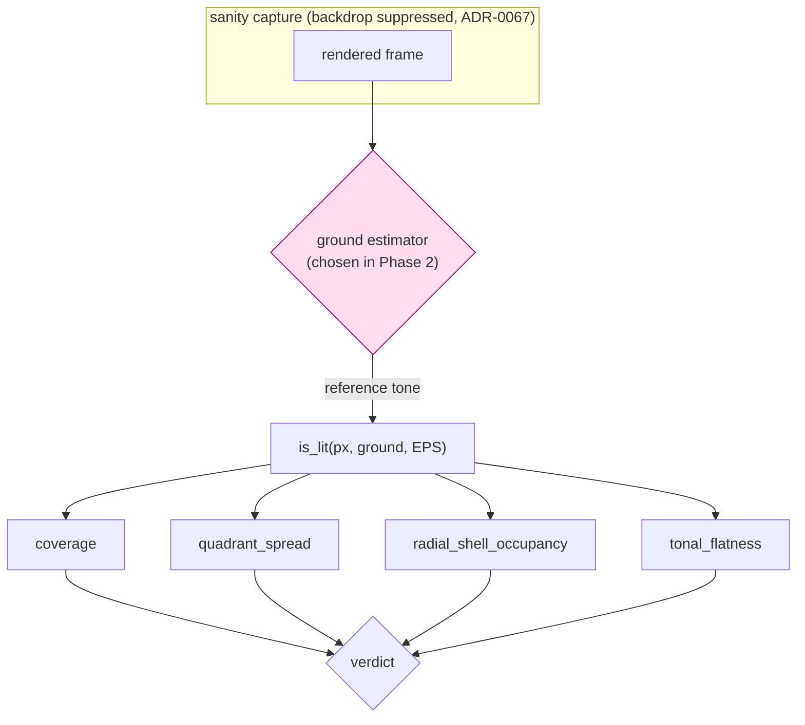

# 0116 — The sanity lens finds the ground

> **Status:** in-progress
> **Created:** 2026-08-25
> **Approved:** 2026-08-25
> **Owner skill(s):** dev, human
> **Related ADRs:** [0126](../adrs/0126-the-sanity-lens-measures-departure-from-the-frames-own-ground.md) (proposed)
> **Closes:** design-backlog 0128
> **Sequencing constraint:** must land **before [Plan 0113](0113-the-engine-paints-a-canvas.md)
> Phase 6**, which is where the emptying canvas arrives. Plan 0113 Phases 3-5 are unaffected and the
> two lanes can run in parallel until then.

## TL;DR

`core/tests/sanity.rs` measures every preset against a hardcoded `BLACK`, so a scene that paints its
own ground is unmeasurable: twelve shipped presets already read `coverage = 1.0000` exactly, and the
one statistic still live for them is read only at the excitation where the defect it guards against
cannot appear. This plan re-bases `is_lit` — and therefore all four statistics — on a ground
**derived from the frame**. The estimator is chosen in Phase 2 from Phase 1's measured table, not
from argument, because the obvious candidate is already falsified.

## Context & problem

ADR-0126 carries the full argument and the measurements. The short form is three facts:

1. **`coverage = 1.0000` already ships**, for all seven `fragment_field` presets plus `Vellum`,
   `Facet`, `Drift`, `Ink on Paper`, `Thomas` and `Valentine`. For those twelve, `coverage`,
   `quadrant_spread` and `radial_shell_occupancy` are constants, not measurements.
2. **The false negative is designed-in.** Plan 0113 Phase 6 builds a canvas the music empties.
   `sanity` reads `tonal_flatness` only at `LOUD`, where the canvas is fullest; the quiet capture
   buys only `MODERATE_MIN_COVERAGE`, which is degenerate for that family. An emptied canvas and a
   broken one are the same picture and nothing looks at it.
3. **The false positive convicts correct content.** `fragment_tiledmono` reads `flatness = 0.9346`
   against a `0.90` ceiling because its black *ink* is excluded as unlit.

The naive repair is already falsified and must not be re-attempted: re-basing on the most populous
luminance bucket changes the reference for **17 of 41** shipped presets.

## Decision

Implement ADR-0126: one derived reference tone, threaded through `is_lit`, with the estimator picked
by a measured stop gate. We take the root fix over the cheaper `tonal_flatness`-only change because
three of the four statistics are degenerate for exactly the content that motivates the work.

## Implementation phases

### Phase 1 — What each candidate ground would say

- **Owner skill:** dev
- **What:** A measurement harness only. **No production behaviour changes in this phase.** For every
  preset in the embedded set, at both `LOUD` and `MODERATE`, print the reference tone each candidate
  estimator picks and the four statistics that follow from it, beside today's `BLACK` baseline.
- **Candidate estimators to table** (the roster is the deliverable, not a choice yet): the frame's
  modal luminance bucket; the modal bucket among **border** pixels only; the modal **RGB** cluster
  rather than luminance; and `BLACK` itself as the control column.
- **Files touched:** `core/tests/` (a new reporting test or an example under `standalone/examples/`).
- **Done when:**
  - The table covers every preset in the embedded set at both excitations, and prints the control
    column so a candidate's effect is read as a difference rather than an absolute.
  - For each candidate, the report names **which presets change verdict** (pass→fail and fail→pass)
    against today's floors, since that count is what Phase 2 decides on.
  - `shape_collage` is included if Plan 0113's branch has merged by then; if not, the report says so
    where the table is read rather than silently omitting the family that motivates the work.
  - The harness is a report and gates nothing — it must not be able to redden CI on its own.

### Phase 2 — The stop gate

- **Owner skill:** human
- **What:** Read Phase 1's table and choose the estimator, or reject all of them.
- **Done when:** one of:
  - **An estimator is chosen** — Phase 3 proceeds with it, and the choice is recorded in this plan
    with the count of verdict changes it accepts.
  - **None is acceptable** (every candidate re-bases too much of the library). The plan stops here
    and routes back to `architect`; ADR-0126 gains a dated `Outcome` recording what was measured and
    that the derivation approach did not survive contact. **This is a real outcome, not a
    formality** — the alternative ADR-0126 kept alive for exactly this case is reading
    `tonal_flatness` at the quiet excitation, which is a much smaller change.

### Phase 3 — The lens takes a ground

- **Owner skill:** dev
- **What:** Thread the chosen reference through `is_lit` and the four statistics that call it.
- **Files touched:** `core/src/render/metrics.rs`, `core/tests/sanity.rs`, and every other caller of
  these metrics — **`golden.rs` and `reactivity.rs` pass `BLACK` to the same functions** and must be
  audited even where their answers do not move.
- **Done when:**
  - The estimator's behaviour on a frame with **no dominant tone** is defined in code and asserted,
    not discovered later. A uniform-noise frame is the test case.
  - `fragment_tiledmono` passes `every_preset_draws_a_real_shape`. It is the motivating false
    positive and the first thing that should stop being wrong.
  - Every other preset either keeps its verdict or appears on Phase 5's adjudication list. **No
    preset changes verdict silently.**
  - Callers that should be unaffected are shown to be unaffected: the golden baselines are
    **byte-identical**, or the phase explains per image why not.

### Phase 4 — The floors are re-derived, not re-used

- **Owner skill:** dev
- **What:** Every per-system `coverage_floor` and `MAX_FLOOR_SLACK` is a constant measured against
  the old predicate. Re-derive them against the new one.
- **Files touched:** `core/tests/sanity.rs`.
- **Done when:**
  - Each floor is re-derived by the rule already documented beside it (half the family minimum), from
    the **new** distribution, and the doc comment records the date and what moved.
  - The `shape_collage` arm stops inheriting `0.50` on the structural argument that its coverage is
    1.0 by construction — since after Phase 3 that premise is false, and the comment `dev` wrote on
    the Plan 0113 branch is re-pointed rather than left standing.
  - `MAX_FLOOR_SLACK` still holds against shipped content, or is re-measured with its own note.

### Phase 5 — Adjudicate what changed

- **Owner skill:** human
- **What:** For each preset whose verdict moved, decide: latent defect the old lens could not see, or
  correct content the new lens is wrong about.
- **Done when:** every entry on the list has a recorded verdict. A preset judged defective routes to
  `preset-author` as content work; a preset the new lens is wrong about is a Phase 3 finding and
  sends the estimator back, not the preset.

### Phase 6 — The emptying canvas is actually caught

- **Owner skill:** dev
- **What:** Close the false negative that started this, with a test that fails on today's lens.
- **Files touched:** `core/tests/sanity.rs`.
- **Done when:**
  - A capture of a canvas with no live elements — a bare ground — is **convicted**, and the test
    demonstrably fails if reverted onto the `BLACK` predicate.
  - The statistic that convicts it is read at an excitation where an emptied canvas can actually
    occur, which today's `LOUD`-only tonal read is not.
  - The distinction the lens must now make is asserted as a property, not a threshold: a bare ground
    and a composed canvas are separated, and **no number is invented** for how sparse a legitimate
    composition may be. That is a content judgement and stays one.

### Phase 7 — Documentation

- **Owner skill:** dev
- **What:** Sweep what the change makes stale.
- **Files touched:** `docs/capturing.md` (the gate table), `core/tests/sanity.rs` module docs.
- **Done when:** the module docs no longer describe the lens as measuring against black; the gate
  table in `docs/capturing.md` reflects what each statistic now answers. Prefer count-free phrasing.

## Architecture diagram

Today the diamond is the constant `BLACK`; everything downstream is unchanged in shape, which is
why this is one change at the root rather than four.

## Risks & open questions

- **The estimator may not exist.** Phase 2 can legitimately end the plan. That is why Phase 1 builds
  no production behaviour — a rejected estimator costs one harness, not a rewrite.
- **Verdict churn is the real cost**, not the code. Phase 5 is human work of unknown size, bounded
  only by Phase 1's measured count — which is exactly why Phase 2 decides on that count.
- **Racing Plan 0113.** If 0113 reaches Phase 6 first, its emptying canvas ships unmeasured. The
  phase added to 0113 records the dependency so `dev` sees it in the plan it is actually reading.
- **Open:** whether the quiet excitation should also read `tonal_flatness` once the ground is right.
  Deliberately not decided here; it is cheap to add and should be judged on Phase 1's table.

## What this plan does NOT do

- **It does not retune any preset.** `fragment_tiledmono` is unchanged; the lens changes.
- **It does not add a preset-level or system-level ground declaration.** ADR-0126 rejects both, on
  the measured fact that `fragment_field` hosts luminous and graphic presets simultaneously.
- **It does not add an exemption roster.** `KNOWN_FLAT` stays empty.
- **It does not change what the engine renders.** Every file it touches is a test or a metric.
- **It does not decide how sparse a composition may legitimately be.** No such threshold is invented.

## Implementation log

**Lane:** `WORK/lmv-plan-0116` on `plan-0116-sanity-ground`, branched from `main` at `e022a5d`.

| phase | owner | state | commit |
|---|---|---|---|
| 1 — What each candidate ground would say | dev | done | committed with this row |
| 2 — The stop gate | human | not started | — |
| 3 — The lens takes a ground | dev | not started | — |
| 4 — The floors are re-derived, not re-used | dev | not started | — |
| 5 — Adjudicate what changed | human | not started | — |
| 6 — The emptying canvas is actually caught | dev | not started | — |
| 7 — Documentation | dev | not started | — |

### Notes

- Phase 1's harness landed as an `#[ignore]`d test **inside `core/tests/sanity.rs`**, not as a new
  file: it then shares `coverage_floor`, `MAX_TONAL_FLATNESS`, `MIN_QUADRANTS`,
  `MIN_STRUCTURAL_SHELLS` and `MODERATE_MIN_COVERAGE` with the gate, so "against today's floors" is
  true by construction rather than by transcription.
- The held-out `presets/pending/fragment_tiledmono.toml` is tabled through `include_str!` — it is
  not in the embedded set, so `sanity_roster()` cannot reach it.
- `shape_collage` contributes no row (Plan 0113 unmerged). The test's doc comment and the printed
  header both say so where the table is read.
- **Measured, at both excitations, for all three candidates: zero verdict changes.** `pass->fail 0`
  and `fail->pass 0` against today's floors. `modal_luma` re-bases 17 of 41 presets at `LOUD` and 15
  at `MODERATE`; `modal_border` 16 / 16; `modal_rgb` 17 / 15. ADR-0126's "17 of 41" is reproduced
  exactly, and it costs no verdict.
- **Measured: no candidate repairs `Tiled Rosette Mono`.** It reads `flatness` `0.9346` under the
  `BLACK` control and `0.9413` / `0.9419` / `0.9413` under `modal_luma` / `modal_border` /
  `modal_rgb` — all three find the paper correctly at `(245,245,245)` and all three still fail the
  `0.90` ceiling. Phase 3's done-when names that preset, so it is **not reachable by a ground
  estimator alone**; input to the Phase 2 gate.
- Measured: the degeneracy ADR-0126 was raised on does clear. The fourteen presets the control
  scores at or above `0.98` spread to `0.1645`-`0.9969` under `modal_luma` — `Tiled Rosette`
  `1.0000` -> `0.1645`, `Ink on Paper` `1.0000` -> `0.2167`, `Vellum` `1.0000` -> `0.3704`.
- Observed, not acted on: `coverage_floor`'s `SystemKind::ShapeField` arm states the family "has
  zero shipped members and this floor has never gated anything", but `Facet` and `Pulse` ship and
  `Facet` is in the table at `coverage 1.0000`. Stale on `main`; Phase 4 is where floors are
  re-derived.
- Deviation from the plan's Phase 3 file list, authorized by the user before Phase 1 began:
  `presets/pending/fragment_tiledmono.toml` is to be `git mv`d into `presets/` at Phase 3, which
  `presets/pending/README.md` records as that preset's exit condition. Not yet done.
