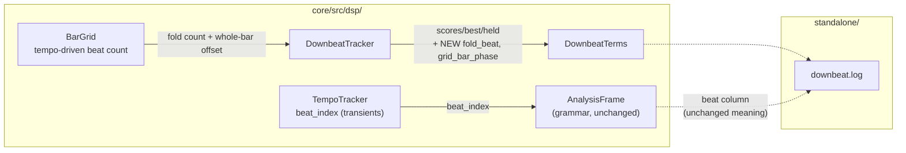

# 0117 — the downbeat log sees the counter it folds over

> **Status:** in-progress
> **Created:** 2026-08-25
> **Owner skill(s):** dev
> **Related ADRs:** [ADR-0109](../adrs/0109-the-beat-clock-counts-onsets-not-beats.md)
> (its `Outcome` names the gap this fills), [ADR-0052](../adrs/0052-analysis-diagnostics-are-native-only.md),
> [ADR-0050](../adrs/0050-downbeat-and-phrase-tracking-with-confidence-fallback.md)
> **Succeeds:** [0095](done/0095-the-downbeat-fold-gets-a-musical-beat.md), whose close this
> repairs — the blocker below was found by the `pre-push` hook after that plan's review had already
> passed it, because both the plan's close block and the review ran `-p lmv-core` rather than the
> workspace

## TL;DR

`--downbeat-log`'s `beat` column and its alignment columns stopped referring to the same counter.
Plan 0095 moved the fold onto the bar grid's beat count; the log still writes `beat_index`
(`standalone/src/downbeatlog.rs:168`), which is the transient counter. `s0`..`s3`, `best` and `held`
are indexed in grid space, `beat` is in transient space, and before Plan 0095 those were one number.
`a_synthesized_4_4_favours_the_alignment_it_was_built_with` fails on exactly that: the accent is
unambiguously on phase 0 by the `beat` column (mean bass **0.364** against 0.032 / 0.004 / 0.006)
and the fold reports `best = 3`. **`main` is red and unpushed at `c0869e6`.**

The repair is two appended columns carrying what the fold was actually handed, and a test that reads
them. It is also the instrument ADR-0109's `Outcome` says does not exist — with these columns a
capture can finally separate *the grid tracks and the accent feature is weak* from *the grid does
not track on this material*.

## Context & problem

Plan 0095 Phase 4 rewired `DownbeatTracker::process`'s second argument from `beat_index` to the
grid's beat count (`core/src/dsp/mod.rs:384-397`). The rename inside `downbeat.rs` was thorough —
the parameter, the field docs and the module header all say `beat_count` now. What no one swept is
that a **second crate** reads the same quantity out the other side: `standalone/`'s log writes
`self.frame.beat_index` next to `terms.scores`, and those two are no longer commensurable.

Nothing in `standalone/` changed during Plan 0095 — `git diff` over the plan's whole range is empty
there. The test broke from a core edit, which is exactly the coupling a workspace-scoped test run
exists to catch and a package-scoped one cannot.

**Three things this does *not* invalidate**, because the alarming reading is the wrong one:

- **Plan 0095 Phase 5's table stands.** `effect_raw`, `effect_corrected`, `null_share`, the
  rows-over-the-gate share and `best == held` are all computed inside grid space or are independent
  of the `beat` column. Nothing in that table cross-reads the two.
- **The paired reconstruction stands.** `spike/replay-old-fold.mjs` replays the *pre-0095* fold,
  for which `beat` is the correct counter by construction.
- **The published grammar stands.** `beat_in_bar` / `bar_index` / `bar_phase` are computed from the
  fold count throughout; only the log mixes spaces.

What is broken is the instrument, and it is broken in the direction that matters least visibly: a
capture still parses, still has plausible numbers in every column, and silently answers a different
question than the one its column names promise.

## Decision

**Add two columns; do not repoint `beat`.** `beat` keeps meaning `beat_index` because Plan 0086's
baseline captures and `replay-old-fold.mjs` both read it, and silently changing what a published
column means — same parse, same range, different quantity — is precisely the failure
[ADR-0109](../adrs/0109-the-beat-clock-counts-onsets-not-beats.md)'s Alternative B was rejected for.
Repeating it one layer out would be worse, not better, for being a log rather than a grammar
variable.

The two columns are **`fold_beat`** (the counter the fold buckets by) and **`grid_bar_phase`** (the
grid's own position across the bar, `[0, 1)`). They append **after `unix_ms`**, per the
frozen-prefix rule `docs/capturing.md:1183` already states for this file, so every capture taken
before today stays parseable by column name.

**They are sourced from `DownbeatTerms`, not from `AnalysisFrame`.** The tracker records the count
and phase it was handed and reports them in the struct the log already reads. That keeps the
diagnostic reporting *the tracker's own input* — the thing that changed invisibly — and keeps it off
the published grammar surface, which the preset engine reads and which has no business growing a
field for an operator log. Diagnostics stay native-only per
[ADR-0052](../adrs/0052-analysis-diagnostics-are-native-only.md); `LMV_ABI_VERSION` stays 4.

## Architecture diagram

## Implementation phases

### Phase 1 — the tracker reports what it was handed

- **Owner skill:** dev
- **What:** `DownbeatTracker` records the `beat_count` and `beat_phase` of the most recent
  `process` call, and `DownbeatTerms` gains `fold_beat: u32` and `grid_bar_phase: f32`.
  `grid_bar_phase` is the **ungated** reading — `(fold_beat % BEATS_PER_BAR) as f32 + phase` over
  `BEATS_PER_BAR`, with no `alignment` subtracted — because the question it exists to answer is
  where the *grid* is, not where the estimator thinks beat 1 is. Nothing outside the struct reads
  it yet.
- **Files touched:** `core/src/dsp/downbeat.rs`.
- **Done when:** the module keeps its panic-denial pragma, stays allocation-free after construction
  and clock-free, and its state remains fixed arrays plus these two scalars. A test drives the
  tracker with a known count/phase sequence and asserts `terms()` reports the last one it was given
  — including across a hop with `beat == false`, where the fold does not record but the position
  still moves.

### Phase 2 — the log carries them, and the test reads them

- **Owner skill:** dev
- **What:** `HEADER` gains `fold_beat` and `grid_bar_phase` **after `unix_ms`**, `Row`'s `Display`
  writes them in the same order, and
  `a_synthesized_4_4_favours_the_alignment_it_was_built_with` derives its accent phase from
  `fold_beat % BEATS_PER_BAR` instead of `beat % BEATS_PER_BAR`.
- **Files touched:** `standalone/src/downbeatlog.rs`, `docs/capturing.md`.
- **Done when:**
  - `cargo nextest run --workspace` is green — **the whole workspace, which is the gate this repair
    exists because nobody ran.**
  - The repointed test measures over the **settled** window only. The fold count is `beat_index`
    until the grid starts and the grid's count plus a whole-bar offset after, and the two advance
    at different rates, so rows spanning the handover mix two bucketings and dilute the reading.
    `bpm > 0` marks the handover and is **already a column** — no third column is needed. The
    warmup rows are skipped, not deleted, and the test says in one line why.
  - The existing header/row-shape assertions (`row.len() == columns().len()`) still hold, and the
    two round-trip tests near `downbeatlog.rs:547` and `:581` that assert a field by name still
    pass unchanged — which is what the frozen-prefix rule buys.
  - `docs/capturing.md`'s column table carries both new rows, and the "last three are appended,
    never interleaved" sentence is corrected to name the right count.

## Risks & open questions

- **The repointed test may still fail, and that would be a finding, not a phase failure.** It
  asserts the fold favours the alignment the accent is actually on. Measured against the right
  counter it should — `accented_pattern()` is a synthesized 4/4 with a kick on one beat of four —
  but the grid's bar is only a real bar when the tempo estimate is on the right octave (ADR-0109's
  `Outcome`), and this stimulus has never been read through the grid. If it lands an octave off,
  the fold's four buckets span two musical beats and the accent falls in two of them. **Record that
  rather than tuning the stimulus until it passes**; it is the same measurement Plan 0095 Phase 7b
  made on the grid, one layer out, and it would be the first end-to-end evidence either way.
- **`grid_bar_phase` on a warmup row is not a grid reading.** Before the grid runs the fold is
  handed `clock.bar`, the tempo tracker's onset-reset phase. The column is honest only where
  `bpm > 0`, and the doc row must say so rather than leaving an operator to average a column that
  changes meaning partway down the file.

## What this plan does NOT do

- **It does not re-run the three-genre captures.** The instrument is repaired here; spending the
  capture is a separate `human` call, worth making when there is an intent to act on what it says
  about the accent cue (ADR-0097's shortlist).
- **It does not amend ADR-0109's `Outcome`.** That `Outcome` says no instrument sees the grid, which
  is true of every capture taken to date and stays true of them. When a capture is taken *with*
  these columns, the amendment is that plan's.
- **It does not repoint or reorder any existing column**, and it does not touch the C ABI,
  `CONFIDENCE_THRESHOLD`, or anything the preset grammar publishes.
- **It does not widen `AnalysisFrame`.** The grammar surface gains nothing for an operator log.

## Implementation log

> Written by `dev` — one row per phase as that phase's commit lands, and the close block after the
> last one. **The phases above are the contract; everything here is what happened.**

**Lane:** `main` directly — the repair's whole subject is that `main` is red and unpushed at
`c0869e6`, so there is no branch to merge back.

| phase | owner | state | commit |
|---|---|---|---|
| 1 — the tracker reports what it was handed | dev | done | `fa5f040` |
| 2 — the log carries them, and the test reads them | dev | done | committed with this row |

### Notes

- `cargo nextest run --workspace`: 962 passed, 0 failed, 3 skipped (289 s).
- The Phase 2 risk did not fire: `a_synthesized_4_4_favours_the_alignment_it_was_built_with`
  passes on the repointed counter, with `bpm` reading 119.96 against a clip built at 120. This is
  the first end-to-end reading of the fold through the grid, and the stimulus was not touched.
- Two edits in Phase 2 beyond the plan's text, both in its listed files. In
  `standalone/src/downbeatlog.rs`, `the_original_columns_are_unchanged_and_still_lead` asserted the
  appended tail was exactly `bpm, time_since_beat, unix_ms`; its tail list now names five. The plan
  named the frozen prefix as what must not move and listed this test's siblings at `:547`/`:581` as
  passing unchanged, which they do — this third test is not one of them.
- In `docs/capturing.md`, the sentence "where it does not, `beat_index % 4` spans less than a bar
  and the four alignments are not the four beats of one" described the pre-0095 fold and
  contradicted the two rows this plan adds two paragraphs above it. Rewritten in the same edit.
- The plan's Decision and the doc row it prescribed both cite `spike/replay-old-fold.mjs` as a
  reader that keeps `beat` pinned. That file is not in the repo — `git ls-files spike` is empty and
  no commit touches the path — so the operator doc names pre-0095 captures instead of it. The
  Decision's reasoning is unaffected; the pointer was.

### Close triggers

- **`presets/` touched:** no.
- **Plan header `Closes:`** none — the header has no `Closes:` line.
- **What shipped:** feature (two appended `--downbeat-log` columns) plus the fix that returns
  `main` to green.
- **Operator docs touched:** `docs/capturing.md`.
- **Backlog probes (`node scripts/check-backlog-claims.mjs`):** exit 0. It reports 0109 as
  stamped 2026-08-17 against a `docs/capturing.md` last touched 2026-08-25 — this plan's own edit,
  and the plan says amending ADR-0109's `Outcome` belongs to whichever plan runs the capture.
  `check-doc-links.mjs` and `check-index-rows.mjs` also exit 0.
- **Outstanding `human` phases:** none — both phases are `dev`.

## Followups (after this lands)

- **Re-capture through the fixed instrument** — three genres, matched, with `fold_beat` and
  `grid_bar_phase` live, to finally separate *the grid tracks and the accent feature is weak* from
  *the grid does not track on this material*.
- **`docs/design-backlog.md` 0042** names exactly this instrument as its cheapest next step; when
  the capture above is run, that entry gets the dated update, not this plan.
