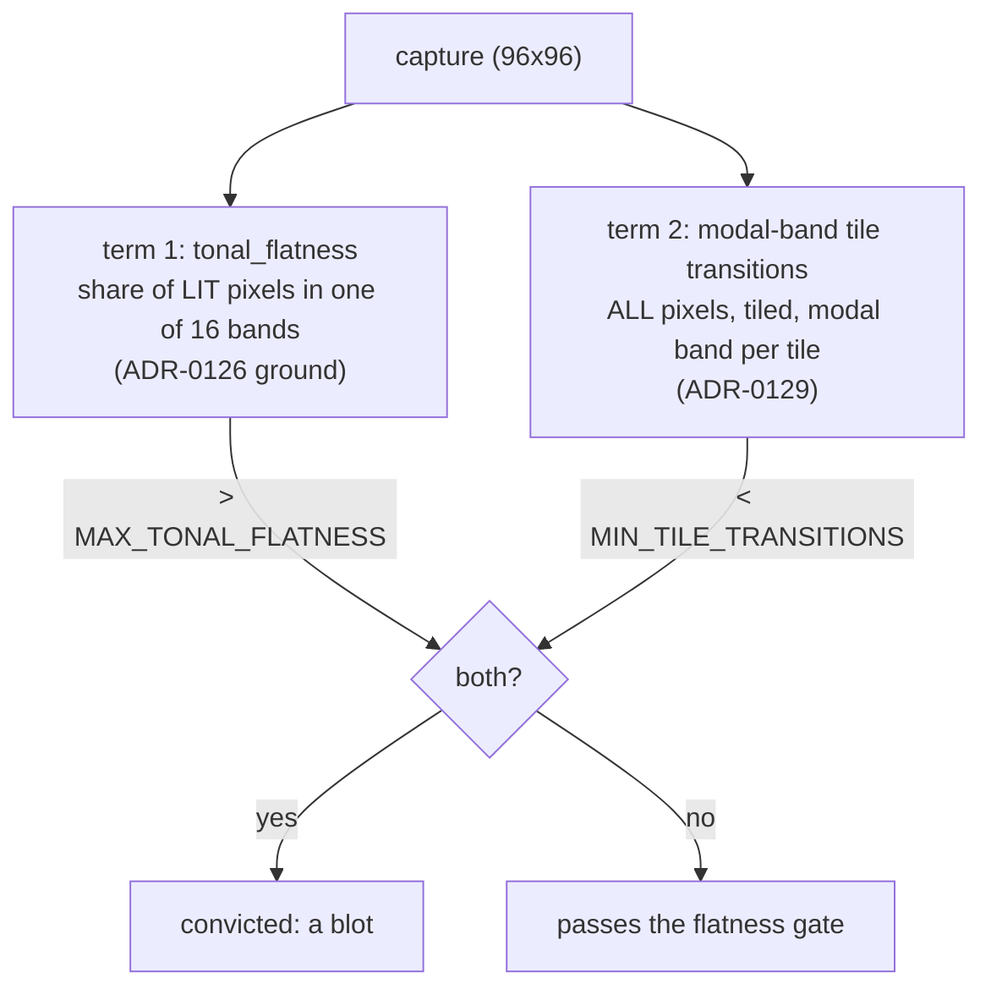

# 0119 — The flatness gate gets its second term

> **Status:** approved 2026-08-26
> **Created:** 2026-08-26
> **Owner skill(s):** dev, human
> **Related ADRs:** [0129](../adrs/0129-the-structural-term-is-measured-at-composition-scale-not-pixel-scale.md)
> (the axis and the stop condition), [0128](../adrs/0128-a-tonally-flat-picture-is-a-blot-only-if-it-is-also-structureless.md)
> (the conjunction this implements — its Decision stands, its mechanism did not),
> [0126](../adrs/0126-the-sanity-lens-measures-departure-from-the-frames-own-ground.md),
> [0071](../adrs/0071-a-numeric-test-contract-states-a-property-or-names-its-machine.md)
> **Ships:** `presets/pending/fragment_tiledmono.toml` into the curated set, or explains in a dated
> `Outcome` why it stays held.

## TL;DR

`tonal_flatness` becomes one of two terms. The second is **modal-band tile transition density** —
tile the capture, give each tile its modal luminance band, count how often adjacent tiles disagree —
and a preset is convicted only when it is tonally flat **and** below that term's threshold. Phase 1
measures the candidate against ADR-0129's three-part stop condition; Phase 2 is a human gate that can
end the plan; Phases 3-5 implement, ship the held preset, and sweep the docs.

## Context & problem

`presets/pending/fragment_tiledmono.toml` is finished, approved, and blocked by one number. It reads
`tonal_flatness = 0.9413` against a `0.90` ceiling, and **only** that: measured 2026-08-26, it clears
coverage (0.4952 against a 0.08 floor), quadrant spread (4), shell occupancy (10/10), `reactivity`
(`bass=0.3493`), `animation` (footprint 0.7579) and `distinctness` (no near-duplicate).

ADR-0126 diagnosed the flatness reading as a ground problem and Plan 0116 Phase 1 falsified that:
a duotone has two large populations, `is_lit` removes whichever one is the ground, and the survivor
holds ~94 % of what remains against **every** reference. ADR-0128 then decided the gate needs a
second, structural term, and Plan 0116 Phase 8 measured three candidates and killed all three.

ADR-0129 re-ran that instrument and found two things: all three candidates measure **one axis** —
pixel-scale geometry of the binary lit mask, which a particle blot has more of than the library's
quietest legitimate presets — and the stop condition was evaluated over the **whole library** when a
conjunction's second term is only ever asked about frames that failed the first. Conditioned
correctly, the population this term is calibrated on has **two members**.

## Decision

We implement ADR-0129's composition-scale statistic. We measure before implementing, because the two
ADRs before this one each named a mechanism without measuring it and each was falsified by the phase
that followed — ADR-0126's diagnosis by Plan 0116 Phase 1, ADR-0128's mechanism by Phase 8.

**Phase 2 can end this plan**, and that is the intended shape rather than a hedge.

## Architecture diagram

## Implementation phases

### Phase 1 — The fourth candidate joins the table, and the stop condition is conditioned

- **Owner skill:** dev
- **What:** Add the statistic as a fourth column of Plan 0116 Phase 8's existing instrument, and
  correct that instrument's stop condition per ADR-0129.
- **Files touched:** `core/tests/sanity.rs` (`each_structure_candidate_is_tabled_against_the_library`
  and the helpers beside `mask_sobel_density`).
- **Done when:**
  - `modal_band_tile_transitions(img, tiles)` exists beside the three mask helpers: the frame is cut
    into a `tiles x tiles` grid, each tile takes the modal luminance band **of all its pixels** under
    the same 16-band binning `metrics::tonal_flatness` uses, and the statistic is differing adjacent
    tile pairs over all adjacent pairs (4-neighbour, no wrap).
  - **The tile count is swept, not chosen.** The column appears once per grid in `[4, 6, 8, 12, 16]`
    at the 96x96 capture, so Phase 2 reads a curve rather than one number. 96 is divisible by all
    five, so no grid needs a ragged edge tile — if a future capture size is not, the helper's
    behaviour at the edge is stated in its docstring rather than left to integer division.
  - **The report prints `tonal_flatness` beside every candidate column**, because ADR-0129's
    criterion 2 cannot be read without it.
  - **The stop condition is the corrected one** and the report prints its verdict per candidate:
    (1) `Blown Out` below `Tiled Rosette Mono`; (2) no shipped frame between them **whose own
    `tonal_flatness` exceeds `MAX_TONAL_FLATNESS`** — frames in the gap below the ceiling are printed
    as *reported, not disqualifying*, with their flatness, so the reading is checkable; (3) a
    threshold exists that convicts `Blown Out`.
  - **The three existing candidates keep their columns and are re-judged under the corrected
    condition.** `boundary` is the control ADR-0129 Alternative A names: if the tiled statistic fails
    and `boundary` passes conditioned, that is a finding and it belongs in the same table.
  - The test stays `#[ignore]`d and asserts nothing. A report that informs a stop gate must not be
    able to redden CI on its own — Plan 0116 Phase 8's own rule, unchanged.
  - Running it prints every row and every verdict; the phase commit quotes nothing and decides
    nothing.

### Phase 2 — The stop gate

- **Owner skill:** human
- **What:** Read Phase 1's table and decide whether the second term ships.
- **Done when:** The user has chosen one of three, and the choice plus its reason is written into
  this plan:
  - **Continue** — a tile count meets all three parts of ADR-0129's stop condition. Name it and the
    threshold, and proceed to Phase 3.
  - **Continue on the control** — the tiled statistic misses but `boundary` passes conditioned. That
    is ADR-0129 Alternative A winning on measurement; it needs a superseding note on 0129, so this
    routes back to `architect` before Phase 3.
  - **Stop** — nothing passes. ADR-0129 takes a dated `Outcome`, `fragment_tiledmono` stays held, and
    the `presets/pending/README.md` row is updated with what this plan ruled out. **Phases 3-5 do not
    run.** This is a real outcome and it has now happened twice; it is not a failure of the plan.

### Phase 3 — The gate takes two terms

- **Owner skill:** dev
- **Depends on:** Phase 2 deciding *continue*. If it decided *stop*, this phase does not exist.
- **Files touched:** `core/src/render/metrics.rs` (the statistic moves next to `tonal_flatness`),
  `core/tests/sanity.rs`.
- **Done when:**
  - The statistic lives in `metrics.rs` beside `tonal_flatness`, not in the test file — it is now
    gate behaviour rather than an instrument, and `#[ignore]`d measurement helpers staying in
    `sanity.rs` is what kept the first three honest.
  - **The conviction is a conjunction.** `every_preset_draws_a_real_shape` fails a preset only when
    `tonal_flatness > MAX_TONAL_FLATNESS` **and** the structural term is under its threshold; the
    printed line carries both numbers for every preset, not only for failures.
  - **The threshold's docstring says it is a measurement, names its corpus, and names both frozen
    fixtures it was taken between** (ADR-0071, and ADR-0129's first Negative). It must state, in
    plain words, that the conditional population had two members — a claim of a derived floor here
    would be the exact error 0129 was written to stop.
  - **`MAX_TONAL_FLATNESS`'s own doc comment says its meaning narrowed.** It currently argues a
    verdict from the library's distribution; after this phase it argues one of two terms, and
    ADR-0128's last Negative names that paragraph as the one that otherwise becomes the most
    confidently wrong in the file.
  - **The true positive survives, demonstrated not assumed.** `Blown Out` is still convicted, and the
    existing frozen negative controls (`the_pre_repair_ridge_passed_the_old_gate_and_fails_this_one`
    and the blot fixture's own test) still fail on the frames they were written for. A test asserts
    the conjunction is not vacuous: reverted to term one alone the held preset fails, and reverted to
    term two alone the blot passes — so each term is load-bearing.
  - **The failure message names which term fired**, and tells an author what to do about that term
    rather than about flatness generally.
  - `cargo nextest run --workspace` is green.

### Phase 4 — The preset ships

- **Owner skill:** dev
- **Depends on:** Phase 3.
- **Files touched:** `presets/fragment_tiledmono.toml` (moved), `presets/pending/README.md`.
- **Done when:**
  - `git mv presets/pending/fragment_tiledmono.toml presets/` — the whole of shipping one, per that
    directory's own README.
  - **All five gates pass with it embedded**, run as `cargo nextest run --workspace` rather than a
    package-scoped subset.
  - **The preset's own header stops naming a blocker that no longer exists.** It records what held it
    and what released it, in the shape `presets/pending/README.md` requires of an entry — an entry
    leaves as soon as its blocker lifts, and a stale blocker in a shipped preset's header is the
    class of comment [Plan 0118](0118-the-comments-stop-narrating-the-plans-that-wrote-them.md) is
    about.
  - **`presets/pending/README.md`'s `Held today` table loses the row.** If the table is then empty,
    the file says so explicitly rather than leaving an empty table — the directory keeps its purpose
    with nothing in it.
  - The golden suite is unaffected: this preset is not a frozen fixture, and ADR-0023 does not
    pixel-pin shipped presets.

### Phase 5 — Documentation

- **Owner skill:** dev
- **Depends on:** Phase 3.
- **Files touched:** `docs/capturing.md`, `presets/README.md`.
- **Done when:**
  - **`docs/capturing.md`'s five-gate table says what `sanity` now measures.** Its `sanity` row
    currently describes the tonal check as a single condition; it becomes a conjunction, and the row
    says what each term asks and that a conviction needs both.
  - **The same file's "what the five gates can and cannot see" section gains the new blind spot** —
    a coarsely mottled blot passes the structural term (ADR-0129's third Negative). A gate's
    documented limits are the reason that section exists.
  - `presets/README.md` gains whatever the shipped preset's arrival requires and nothing more; this
    plan adds no scene param and no grammar.

## Risks & open questions

- **The two-member calibration is this plan's real risk**, and no phase removes it. Phase 3's
  docstring requirement is mitigation by disclosure, not by measurement. The first genuinely flat
  preset from a third family is what tests it, and that preset does not exist yet.
- **The tile sweep may show no plateau.** If the verdict flips between adjacent grids in
  `[4, 6, 8, 12, 16]`, the statistic is resolution-coupled and Phase 2 should read that as a *stop*
  even if one grid passes — a constant that only works at one tile count is a fitted number.
  Recorded here rather than as a stop-condition clause because judging a curve is what the human gate
  is for.
- **A gate that convicts nothing is not obviously broken.** After this change only frames failing
  both terms are caught, and the library has no such frame; a regression in the conjunction's *wiring*
  would look exactly like a healthy library. Phase 3's non-vacuity test is the only thing standing
  between those two readings, which is why it asserts each term separately rather than asserting the
  suite is green.
- **`Blown Out` is one frozen frame doing a lot of work.** It is the sole calibration anchor on the
  defect side across ADR-0128, ADR-0129 and this plan. If it is ever re-blessed, three thresholds
  move with it.

## What this plan does NOT do

- **It does not answer the full-coverage residue.** `Sumi`, `Whorl`, `Supernova` and `Neon Tunnel`
  still read honest `coverage` near 1.0 with nothing asking whether they are compositions or fills.
  ADR-0129 notes the new statistic is the instrument that question needs; spending it there is
  another plan.
- **It does not touch `MAX_TONAL_FLATNESS`'s value**, only the meaning of the check it participates
  in.
- **It does not revisit the ground estimator.** ADR-0126 is settled and Plan 0116 shipped it.
- **It does not add a preset roster or an exemption list.** ADR-0128 Alternative C and ADR-0129
  Alternative B both stay rejected.
- **It changes no render behaviour.** Entirely test-side plus one `metrics.rs` function; the C ABI,
  the `Scene` trait and the post chain are untouched.

## Implementation log

> Written by `dev` — one row per phase as that phase's commit lands.

**Lane:** _(fill on the first phase commit)_

| phase | owner | state | commit |
|---|---|---|---|
| 1 — The fourth candidate joins the table | dev | | |
| 2 — The stop gate | human | | |
| 3 — The gate takes two terms | dev | | |
| 4 — The preset ships | dev | | |
| 5 — Documentation | dev | | |

### Notes

### Close triggers

- **`presets/` touched:**
- **Plan header `Closes:`**
- **What shipped:**
- **Operator docs touched:**
- **Backlog probes (`node scripts/check-backlog-claims.mjs`):**
- **Outstanding `human` phases:**
- **Workspace at the tip:**

## Followups (after this lands)

- The composition-or-fill question for the four full-coverage luminous fields, using the same
  statistic.
- If Phase 2 stops the plan, `presets/pending/README.md`'s row should record all four ruled-out
  candidates rather than three, so a fifth attempt starts from the whole negative result.
