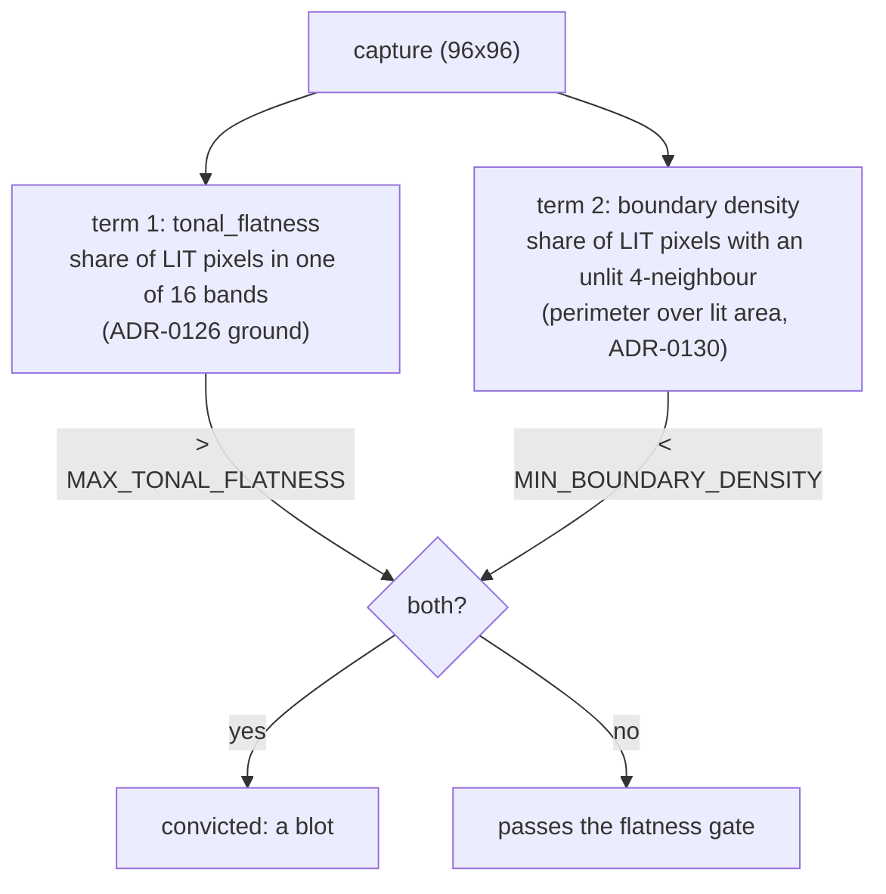

# 0119 — The flatness gate gets its second term

> **Status:** in-progress 2026-08-26
> **Created:** 2026-08-26
> **Owner skill(s):** dev, human
> **Related ADRs:** [0130](../adrs/0130-the-structural-term-is-boundary-density-and-conditioning-the-population-is-what-made-it-work.md)
> (**the term that ships**, written at Phase 2 on Phase 1's measurement),
> [0129](../adrs/0129-the-structural-term-is-measured-at-composition-scale-not-pixel-scale.md)
> (the stop condition, which stands — its Decision is superseded and it carries a dated `Outcome`),
> [0128](../adrs/0128-a-tonally-flat-picture-is-a-blot-only-if-it-is-also-structureless.md)
> (the conjunction this implements — its Decision stands, its mechanism did not),
> [0126](../adrs/0126-the-sanity-lens-measures-departure-from-the-frames-own-ground.md),
> [0071](../adrs/0071-a-numeric-test-contract-states-a-property-or-names-its-machine.md)
> **Ships:** `presets/pending/fragment_tiledmono.toml` into the curated set, or explains in a dated
> `Outcome` why it stays held.

## TL;DR

`tonal_flatness` becomes one of two terms, and a preset is convicted only when it is tonally flat
**and** below the second term's threshold. Phase 1 measured four candidates against ADR-0129's
three-part stop condition, and **Phase 2 chose `boundary`** — perimeter over lit area, the control
ADR-0129 rejected — not the tiled statistic that ADR proposed. See
[ADR-0130](../adrs/0130-the-structural-term-is-boundary-density-and-conditioning-the-population-is-what-made-it-work.md)
for why, and ADR-0129's dated `Outcome` for what its own measurement falsified. Phases 3-5 implement
the conjunction, ship the held preset, and sweep the docs.

## Context & problem

`presets/pending/fragment_tiledmono.toml` is finished, approved, and blocked by one number. It reads
`tonal_flatness = 0.9413` against a `0.90` ceiling, and **only** that: measured 2026-08-26, it clears
coverage (0.4952 against a 0.08 floor), quadrant spread (4), shell occupancy (10/10), `reactivity`
(`bass=0.3493`), `animation` (footprint 0.7579) and `distinctness` (no near-duplicate).

ADR-0126 diagnosed the flatness reading as a ground problem and Plan 0116 Phase 1 falsified that:
a duotone has two large populations, `is_lit` removes whichever one is the ground, and the survivor
holds ~94 % of what remains against **every** reference. ADR-0128 then decided the gate needs a
second, structural term, and Plan 0116 Phase 8 measured three candidates and killed all three.

ADR-0129 re-ran that instrument and found two things: all three candidates measure **one axis** —
pixel-scale geometry of the binary lit mask, which a particle blot has more of than the library's
quietest legitimate presets — and the stop condition was evaluated over the **whole library** when a
conjunction's second term is only ever asked about frames that failed the first. Conditioned
correctly, the population this term is calibrated on has **two members**.

## Decision

We implement ADR-0129's composition-scale statistic. We measure before implementing, because the two
ADRs before this one each named a mechanism without measuring it and each was falsified by the phase
that followed — ADR-0126's diagnosis by Plan 0116 Phase 1, ADR-0128's mechanism by Phase 8.

**Phase 2 can end this plan**, and that is the intended shape rather than a hedge.

## Architecture diagram

## Implementation phases

### Phase 1 — The fourth candidate joins the table, and the stop condition is conditioned

- **Owner skill:** dev
- **What:** Add the statistic as a fourth column of Plan 0116 Phase 8's existing instrument, and
  correct that instrument's stop condition per ADR-0129.
- **Files touched:** `core/tests/sanity.rs` (`each_structure_candidate_is_tabled_against_the_library`
  and the helpers beside `mask_sobel_density`).
- **Done when:**
  - `modal_band_tile_transitions(img, tiles)` exists beside the three mask helpers: the frame is cut
    into a `tiles x tiles` grid, each tile takes the modal luminance band **of all its pixels** under
    the same 16-band binning `metrics::tonal_flatness` uses, and the statistic is differing adjacent
    tile pairs over all adjacent pairs (4-neighbour, no wrap).
  - **The tile count is swept, not chosen.** The column appears once per grid in `[4, 6, 8, 12, 16]`
    at the 96x96 capture, so Phase 2 reads a curve rather than one number. 96 is divisible by all
    five, so no grid needs a ragged edge tile — if a future capture size is not, the helper's
    behaviour at the edge is stated in its docstring rather than left to integer division.
  - **The report prints `tonal_flatness` beside every candidate column**, because ADR-0129's
    criterion 2 cannot be read without it.
  - **The stop condition is the corrected one** and the report prints its verdict per candidate:
    (1) `Blown Out` below `Tiled Rosette Mono`; (2) no shipped frame between them **whose own
    `tonal_flatness` exceeds `MAX_TONAL_FLATNESS`** — frames in the gap below the ceiling are printed
    as *reported, not disqualifying*, with their flatness, so the reading is checkable; (3) a
    threshold exists that convicts `Blown Out`.
  - **The three existing candidates keep their columns and are re-judged under the corrected
    condition.** `boundary` is the control ADR-0129 Alternative A names: if the tiled statistic fails
    and `boundary` passes conditioned, that is a finding and it belongs in the same table.
  - The test stays `#[ignore]`d and asserts nothing. A report that informs a stop gate must not be
    able to redden CI on its own — Plan 0116 Phase 8's own rule, unchanged.
  - Running it prints every row and every verdict; the phase commit quotes nothing and decides
    nothing.

### Phase 2 — The stop gate

- **Owner skill:** human
- **What:** Read Phase 1's table and decide whether the second term ships.
- **Done when:** The user has chosen one of three, and the choice plus its reason is written into
  this plan:
  - **Continue** — a tile count meets all three parts of ADR-0129's stop condition. Name it and the
    threshold, and proceed to Phase 3.
  - **Continue on the control** — the tiled statistic misses but `boundary` passes conditioned. That
    is ADR-0129 Alternative A winning on measurement; it needs a superseding note on 0129, so this
    routes back to `architect` before Phase 3.
  - **Stop** — nothing passes. ADR-0129 takes a dated `Outcome`, `fragment_tiledmono` stays held, and
    the `presets/pending/README.md` row is updated with what this plan ruled out. **Phases 3-5 do not
    run.** This is a real outcome and it has now happened twice; it is not a failure of the plan.
- **Outcome (2026-08-26): continue on the control.** `boundary` ships as the second term at
  `MIN_BOUNDARY_DENSITY = 0.31`, not the tiled statistic. The reason, in full, is
  [ADR-0130](../adrs/0130-the-structural-term-is-boundary-density-and-conditioning-the-population-is-what-made-it-work.md);
  ADR-0129 keeps its corrected stop condition, takes a dated `Outcome`, and has its Decision
  superseded. In one paragraph: conditioned correctly the population is two members and criterion 2
  is inert, so **three** of the four candidates separate — the conditioning error was not hiding a
  design error, it *was* the error. The tiled statistic's verdict then flips between `tile@4` (not
  separated) and `tile@6` (6.00x) with no plateau above it, which this plan's Risks section
  pre-registered as a stop; and the three frozen `retired_mandalas` ADR-0129 put in the table
  precisely to test its thin-stroke Positive read `0.0000` at **every** grid against `0.87`-`0.96` on
  `boundary`, falsifying it. Among the three that pass, `boundary` normalizes by lit area (so it asks
  only about structure, where `sobel`'s frame-area denominator partly re-asks `coverage`) and does
  not invert on particle fields (where `components` scores `Drift Field` highest of all). Its price
  is a 1.37x margin inside the library's own spread, accepted knowingly.

### Phase 3 — The gate takes two terms

- **Owner skill:** dev
- **Depends on:** Phase 2, which decided *continue on the control*. The term is
  [ADR-0130](../adrs/0130-the-structural-term-is-boundary-density-and-conditioning-the-population-is-what-made-it-work.md)'s
  `boundary`, **not** the tiled statistic — read that ADR before starting.
- **Files touched:** `core/src/render/metrics.rs` (`boundary_density` moves next to
  `tonal_flatness`), `core/tests/sanity.rs`.
- **Done when:**
  - **`boundary_density` lives in `metrics.rs` beside `tonal_flatness`**, not in the test file — it
    is now gate behaviour rather than an instrument, and `#[ignore]`d measurement helpers staying in
    `sanity.rs` is what kept the candidates honest. It takes `(img, bg, eps)` like its neighbours and
    uses the real private `metrics::is_lit`, so the test file's `sanity_is_lit` / `lit_mask`
    restatements stop being the definition the gate runs on. **The instrument keeps its column** and
    reads the production function, so the table Phase 2 decided on stays re-runnable.
  - **The `#[ignore]`d instrument's other three candidates stay in the test file.** They are
    discarded candidates; a discarded candidate that ships as a `pub` production statistic is the
    thing that section's own header warns against.
  - **The conviction is a conjunction.** `every_preset_draws_a_real_shape` fails a preset only when
    `tonal_flatness > MAX_TONAL_FLATNESS` **and** `boundary_density < MIN_BOUNDARY_DENSITY`; the
    printed line carries both numbers for every preset, not only for failures.
  - **The floor is `boundary_floor(system)`, not one constant** — the mechanism `coverage_floor`
    already uses in this file. `SystemKind::ShapeCollage => 0.13`, everything else `0.31`. **A single
    global number is provably impossible**: `Suprematist` reads `0.2565`, *below* the blot's own
    `0.2631`, so no threshold both convicts the blot and admits a mono flat-graphic composition. See
    ADR-0130's Context.
  - **Each arm's docstring states its own derivation, and they are different kinds of number**
    (ADR-0071). The `0.31` default is a **measurement**: the midpoint of `0.2631` (the frozen
    `Blown Out` fixture) and `0.3602` (`Tiled Rosette Mono`, measured 2026-08-26 at `8389f2a`),
    `1.18x` above the defect and `1.16x` below the composition — and it says in plain words that the
    conditional population had two members and that half-the-sparsest-legitimate-content was
    unavailable, because the one legitimate member is the preset being admitted. The `0.13`
    `ShapeCollage` arm **is** half the sparsest legitimate member (`Suprematist`, `0.2565`), the
    ordinary ceremony, and says so. A claim of a derived floor on the default arm is the exact error
    ADR-0129 was written to stop.
  - **The `ShapeCollage` arm's comment carries the structural reason, not a preference.** ADR-0123
    holds that family's canvas under ADR-0046's tonemap knee and it therefore has no bloom, no glow
    and no over-range path at all — so the additive stacking that produced `Blown Out`, and that put
    four attractor presets into the library flat, cannot occur there. That is what distinguishes this
    arm from the `palette_steps` exemption ADR-0129 Alternative B rejected as reachable by
    declaration.
  - **`MAX_TONAL_FLATNESS`'s own doc comment says its meaning narrowed.** It currently argues a
    verdict from the library's distribution; after this phase it argues one of two terms, and
    ADR-0128's last Negative names that paragraph as the one that otherwise becomes the most
    confidently wrong in the file.
  - **The true positive survives, demonstrated not assumed.** `Blown Out` is still convicted, and the
    existing frozen negative controls (`the_pre_repair_ridge_passed_the_old_gate_and_fails_this_one`
    and the blot fixture's own test) still fail on the frames they were written for. A test asserts
    the conjunction is not vacuous: reverted to term one alone the held preset fails, and reverted to
    term two alone the blot passes — so each term is load-bearing.
  - **The exposure is printed, not left to be rediscovered.** 22 of the 42 shipped presets read below
    their own family's floor and are protected only by term one (ADR-0130's landmine Negative). The
    per-preset line `every_preset_draws_a_real_shape` already prints carries `boundary=` beside
    `flatness=` **and the floor it was judged against**, and the run prints a one-line count of how
    many presets sit under their floor. **It is a report, not an assertion** — no threshold on that
    count, because there is no measured basis for one, and because that count is expected to move
    as the mono cohort lands.
  - **The failure message names which term fired**, and tells an author what to do about that term
    rather than about flatness generally. For the structural term that advice is about *interior* —
    a convicted frame is a solid mass, and what it lacks is perimeter per unit lit area.
  - `cargo nextest run --workspace` is green.

### Phase 4 — The preset ships

- **Owner skill:** dev
- **Depends on:** Phase 3.
- **Files touched:** `presets/fragment_tiledmono.toml` (moved), `presets/pending/README.md`,
  `core/tests/sanity.rs`.
- **Done when:**
  - `git mv presets/pending/fragment_tiledmono.toml presets/` — the whole of shipping one, per that
    directory's own README.
  - **The calibration anchor is frozen into the test, and this is not optional.**
    `HELD_OUT_TOML` is `include_str!("../../presets/pending/fragment_tiledmono.toml")`, so the `git
    mv` breaks the build — and repointing it at the new path would be worse than the break: the
    composition-side anchor of `MIN_BOUNDARY_DENSITY` would become ordinary editable content, and a
    preset tweak could move a gate constant with nothing able to notice, because the constant would
    still read green. Freeze the measured TOML into `sanity.rs` as an inline literal the way
    `retired_mandalas()` already freezes three presets from a git revision, name the revision it was
    taken at, and let the shipped copy be judged by the gate like any other preset. ADR-0130's
    Decision requires both anchors frozen.
  - **All five gates pass with it embedded**, run as `cargo nextest run --workspace` rather than a
    package-scoped subset.
  - **The preset's own header stops naming a blocker that no longer exists.** It records what held it
    and what released it, in the shape `presets/pending/README.md` requires of an entry — an entry
    leaves as soon as its blocker lifts, and a stale blocker in a shipped preset's header is the
    class of comment [Plan 0118](0118-the-comments-stop-narrating-the-plans-that-wrote-them.md) is
    about. **It also carries the one line that makes it un-editable-by-accident**: this preset's
    frame is a calibration anchor for `MIN_BOUNDARY_DENSITY`, and re-tuning it re-opens that
    constant.
  - **`presets/pending/README.md`'s `Held today` table loses the row.** If the table is then empty,
    the file says so explicitly rather than leaving an empty table — the directory keeps its purpose
    with nothing in it.
  - The golden suite is unaffected: this preset is not a frozen fixture, and ADR-0023 does not
    pixel-pin shipped presets.

### Phase 5 — Documentation

- **Owner skill:** dev
- **Depends on:** Phase 3.
- **Files touched:** `docs/capturing.md`, `presets/README.md`.
- **Done when:**
  - **`docs/capturing.md`'s five-gate table says what `sanity` now measures.** Its `sanity` row
    currently describes the tonal check as a single condition; it becomes a conjunction, and the row
    says what each term asks and that a conviction needs both.
  - **The same file's "what the five gates can and cannot see" section gains the new blind spot**,
    which is ADR-0130's, not ADR-0129's: **a blot with a raggeder mask than `Blown Out`'s passes the
    structural term**, because `boundary` reads pixel-scale perimeter and a noisier particle field
    has more of it. Say the second half too — over half the shipped library reads below
    `MIN_BOUNDARY_DENSITY` and is held only by the tonal term — because a reader who knows only the
    first half will mis-price the gate. A gate's documented limits are the reason that section
    exists.
  - `presets/README.md` gains whatever the shipped preset's arrival requires and nothing more; this
    plan adds no scene param and no grammar.

## Risks & open questions

- **The two-member calibration is this plan's real risk**, and no phase removes it. Phase 3's
  docstring requirement is mitigation by disclosure, not by measurement. The first genuinely flat
  preset from a third family is what tests it, and that preset does not exist yet.
- ~~**The tile sweep may show no plateau.**~~ **It showed none, and that is what decided Phase 2.**
  The verdict flips between `tile@4` (not separated) and `tile@6` (6.00x), and the composition's own
  reading swings 2.24x between `tile@6` and `tile@8`. Pre-registering this before the numbers existed
  is the only reason the reading carries weight; keep the habit.
- **The margin that shipped is 1.37x, inside the library's own spread** (`0.0440..0.9839`). This is
  ADR-0129 Alternative A's objection, it was never rebutted, and ADR-0130 accepts it knowingly
  against the alternative of a fitted tile count. The decay mode it names — a blot with a raggeder
  mask — is real and unaddressed, and is what a fourth attempt would be about.
- **A gate that convicts nothing is not obviously broken.** After this change only frames failing
  both terms are caught, and the library has no such frame; a regression in the conjunction's *wiring*
  would look exactly like a healthy library. Phase 3's non-vacuity test is the only thing standing
  between those two readings, which is why it asserts each term separately rather than asserting the
  suite is green.
- **`Blown Out` is one frozen frame doing a lot of work.** It is the sole calibration anchor on the
  defect side across ADR-0128, ADR-0129 and this plan. If it is ever re-blessed, three thresholds
  move with it.

## What this plan does NOT do

- **It does not answer the full-coverage residue.** `Sumi`, `Whorl`, `Supernova` and `Neon Tunnel`
  still read honest `coverage` near 1.0 with nothing asking whether they are compositions or fills.
  ADR-0129 notes the new statistic is the instrument that question needs; spending it there is
  another plan.
- **It does not touch `MAX_TONAL_FLATNESS`'s value**, only the meaning of the check it participates
  in.
- **It does not revisit the ground estimator.** ADR-0126 is settled and Plan 0116 shipped it.
- **It does not add a preset roster or an exemption list.** ADR-0128 Alternative C and ADR-0129
  Alternative B both stay rejected.
- **It changes no render behaviour.** Entirely test-side plus one `metrics.rs` function; the C ABI,
  the `Scene` trait and the post chain are untouched.

## Implementation log

> Written by `dev` — one row per phase as that phase's commit lands.

**Lane:** `main`, in the primary worktree — no branch. The two live worktrees
(`plan-0087`, `plan-0114`) touch neither `core/tests/sanity.rs` nor
`core/src/render/metrics.rs`.

| phase | owner | state | commit |
|---|---|---|---|
| 1 — The fourth candidate joins the table | dev | done | `8389f2a` |
| 2 — The stop gate | human | decided: continue on the control | `53d3e8b` |
| 3 — The gate takes two terms | dev | done | `26b20b3` |
| 4 — The preset ships | dev | done | `7b552f7` |
| 5 — Documentation | dev | done | `40398d4` |

### Notes

- **Phase 3 deviates from one clause of its own non-vacuity done-when, and the plan's number is
  why.** The phase asks for a test asserting that "reverted to term one alone the held preset fails,
  and reverted to term two alone **the blot passes**". The first clause holds. The second is false
  on the term that shipped: `Blown Out` reads `boundary = 0.2631` against a `0.31` floor, so term
  two alone convicts it — ADR-0130's own table says so, and the test re-measures it at `0.2631`.
  `each_term_of_the_flatness_conjunction_is_load_bearing` therefore witnesses term one's necessity
  on a **shipped preset under its floor** instead: `Sumi`, `flatness 0.2075` (clears) and
  `boundary 0.1008` (under `0.31`), so a structure-only gate would convict legitimate content. The
  three rows it asserts are `Tiled Rosette Mono` 0.9413 / 0.3602, `Sumi` 0.2075 / 0.1008, and
  `Blown Out` 0.9154 / 0.2631. The witness is named in a constant with a comment saying it is a
  witness and not a fixture, and how to replace it.
- **The exposure count read 22 of 42**, matching ADR-0130's landmine Negative. The full list is
  printed by `every_preset_draws_a_real_shape` on every run and is unasserted, per the phase. It
  reads 22 of 43 after Phase 4, the shipped preset being above its floor.
- **Phase 4's "the header stops naming a blocker" was vacuous as written.** The preset's own header
  never named one — the blocker lived only in `presets/pending/README.md`'s table, though that
  README's own rule is that an entry "needs a named blocker, recorded in the preset's own header".
  The rest of that done-when is what landed: the header now records what held it, what released it,
  and the calibration-anchor warning.
- **The frozen anchor and the shipped copy were checked to agree, not assumed to.** Both read
  `tonal_flatness 0.9413` and `boundary_density 0.3602`; the shipped copy reads `coverage 0.4952`,
  the number the plan's Context recorded. The frozen literal is comment-stripped and its `name` is
  suffixed `(frozen)` — the suffix is load-bearing now that the preset ships, because
  `each_structure_candidate_is_tabled_against_the_library` pushes the anchor alongside
  `sanity_roster()`, and two presets of one name are not addressable by
  `Renderer::capture_preset`.
- **Phase 2 decided *continue on the control*, 2026-08-26.** `boundary` ships as the second term,
  not the tiled statistic. Per the phase's own routing that needs a superseding note on ADR-0129
  before Phase 3, so the plan is with `architect`; the reason belongs in that note and is not
  recorded here by `dev`.
- **What Phase 1 measured, as the gate read it.** The conditional population is two members, as
  ADR-0129 predicted, so criterion 2 is inert on every column — nothing else in the corpus is above
  the flatness ceiling to be in the gap. Conditioned, `boundary` (1.37x), `components` (2.33x) and
  `sobel` (6.31x) all pass, having all failed unconditioned at Plan 0116 Phase 8. The tiled sweep:
  `tile@4` does not separate (both anchors 0.3333), `tile@6` 6.00x, `tile@8` 2.50x, `tile@12` 5.14x,
  `tile@16` 6.10x — a verdict flip between the first two adjacent grids, and the composition swings
  2.24x between `tile@6` and `tile@8`. Frames reading exactly 0.0000 on the tiled term: 18 at
  `tile@6`, 14 at `tile@8`, 10 at `tile@12`, 6 at `tile@16`, including all three retired mandalas.

- **Criterion 3 is implemented as the midpoint between the two frozen fixtures**, so it is
  satisfied by construction whenever criterion 1 holds and never fails a candidate on its own.
  The ADR asks for a threshold that convicts the blot *with margin*, and margin is not mechanical
  with a two-member population — so the report prints the separation ratio and the column's
  legitimate spread beside the threshold instead of ruling on it, and the ruling is Phase 2's.
- **The report also prints the superseded ceremony** (half the sparsest legitimate content) per
  candidate, labelled as superseded. Not asked for by the phase; it is what makes the re-judging
  of the three existing candidates readable against Plan 0116 Phase 8's own printed result.

### Close triggers

- **`presets/` touched:** yes — `presets/fragment_tiledmono.toml` (renamed in from
  `presets/pending/`, 79 % similarity, header block added), `presets/pending/README.md`,
  `presets/README.md`. One preset joins the embedded set: 42 → 43.
- **Plan header `Closes:`** the header carries no `Closes:` line. Its `Ships:` line is satisfied by
  the first branch — the preset went into the curated set rather than taking a dated `Outcome`.
- **What shipped:** feature. A gate behaviour change (`metrics::boundary_density` is new production
  code, and `every_preset_draws_a_real_shape` convicts on a conjunction) plus one preset entering
  the embedded set. No render behaviour, no C ABI, no `Scene` trait, no post chain.
- **Operator docs touched:** `docs/capturing.md` (the five-gate table's `sanity` row, and the
  "what the five gates can and cannot see" section, which gains a fifth caveat),
  `presets/README.md` (one worked-example row), `presets/pending/README.md`.
- **Backlog probes (`node scripts/check-backlog-claims.mjs`):** exit 0. 4 unprobeable claims, which
  is the set nothing checks and is unchanged by this plan. `check-doc-links.mjs` and
  `check-index-rows.mjs` also exit 0.
- **Outstanding `human` phases:** none. Phase 2 was the only one and it is decided.
- **Workspace at the tip:** `cargo nextest run --workspace` 995 passed / 5 skipped, exit 0, run at
  Phase 4's tree (the Phase 5 commit is docs-only). `cargo fmt --all --check` and
  `cargo clippy --all-targets -- -D warnings` clean. Version is `0.79.0`, unbumped — the bump is
  architect's call at close (ADR-0005).

## The mono cohort, measured against this gate

Raised 2026-08-26 while sizing the next content step, and recorded here because the numbers are this
plan's own and a `preset-author` session should not have to re-derive them. **Converting a preset to
a two-ink print raises `tonal_flatness` toward `1.0` and leaves `boundary` alone**, so a preset's
`boundary` today is what decides whether its mono version passes.

**These 20 survive a mono conversion** (`boundary` at or above their family's floor):

| family | presets |
|---|---|
| `attractor` | `Thomas` 0.762, `Ink on Paper` 0.573, `Clifford` 0.463, `Leviathan` 0.406, `De Jong Gallery` 0.378 |
| `emitter` | `Drift Field` 0.959, `Perseids` 0.619, `Ember Jet` 0.587 |
| `fragment_field` | `Tiled Rosette` 0.637 (and the held `Tiled Rosette Mono` 0.360) |
| `shape_collage` | `On White` 0.306, `Suprematist` 0.257 — against the `0.13` arm |
| `reaction_diffusion` | `Etching` 0.362, `Verdigris` 0.349, `Mitosis` 0.341 |
| others | `Vellum` 0.984, `Rose Window` 0.895, `Halo` 0.853, `Shatter` 0.847, `Pulse` 0.565, `Drift` 0.531 |

**These 22 would be convicted**, and each needs its own floor arm with its own derivation before it
can ship mono: all of `parametric_curve` (`Ion Wake` 0.150, `Nightbloom` 0.161), `shape_field`'s
`Facet` 0.066, 12 of 17 `attractor` (`Torus Knot` 0.044 through `Barnsley Fern` 0.244), and 7 of 9
`fragment_field` — including **`Sumi` at 0.101**, an ink wash and the most natural mono target in the
library.

**The `attractor` fork is the one to decide deliberately.** Its ceremony-derived floor is `0.0220`,
`12x` below the blot and vacuous — and `attractor` is the family whose four flat presets
`core/tests/sanity.rs`'s header records as the reason `tonal_flatness` was added. Mono attractors and
blot-catching cannot both be had on this term.

## Followups (after this lands)

- The composition-or-fill question for the four full-coverage luminous fields (`Sumi`, `Whorl`,
  `Supernova`, `Neon Tunnel`). ADR-0129 argued its tiled statistic is the instrument that question
  needs; that argument is untouched by the tiled statistic losing *this* one, and the instrument is
  still in `sanity.rs` as an `#[ignore]`d column. Another plan.
- **The margin is the thing a fourth attempt would be about**, not the axis. 1.37x inside a
  `0.0440..0.9839` spread, with over half the library under the threshold and held only by term one.
  The trigger is the first genuinely flat preset from a third family — it is what tests the
  two-member calibration, and it does not exist yet.
