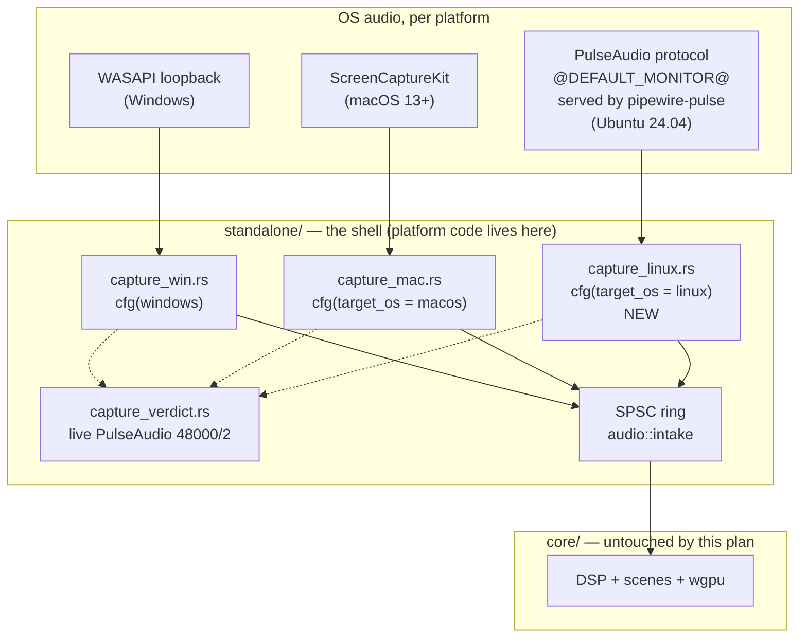

# 0120 — The standalone ships on Ubuntu

> **Status:** approved
> **Created:** 2026-08-26
> **Approved:** 2026-08-26
> **Owner skill(s):** dev, human
> **Related ADRs:** [0131](../adrs/0131-the-linux-standalone-captures-through-pulseaudios-simple-api.md) (proposed),
> [0038](../adrs/0038-tag-driven-release-unsigned-universal-mac-app.md),
> [0016](../adrs/0016-gpu-tests-opt-in-ci-scope.md),
> [0025](../adrs/0025-foobar-component-version-single-sourced.md),
> [0001](../adrs/0001-rust-core-wgpu-cabi-foobar-shim.md)
> **Coordinates with:** [0133](0133-the-engine-drives-the-lights.md) (also edits `standalone/src/run.rs`)
> and [0174](done/0174-the-clock-reading-tests-run-alone.md) (owns `.config/nextest.toml`'s groups) —
> sequence or merge `main` before Phase 2.

> **Amended 2026-09-14** (architect backlog sweep): line references follow the shell's split — the
> `Handle` alias, `start_capture`, `CAPTURE_BACKEND` and `capture_lost` live in
> `standalone/src/capture_start.rs`, not `main.rs`, so Phase 3's cfg list grows past "three sites";
> Phase 2's done-when names the `check` arm's **six** steps and the `-P fast` profile; the live
> verdict carries an endpoint; the per-user directory is `~/.local/share/Ritmolux/` (case matters on
> Linux); Phase 4's guard counts **5 zips + 1 tarball** and its upload globs must name the tarball;
> Phase 5's sweep adds the site's `PUBLISHED` map, `how-it-works`/`running`/`configuration`, and the
> two reader gates; the exclusions add the studio, `--stream`/Spout and the Art-Net sink. Two
> backlog entries fold in: **0181** (Phase 2 — subprocess tests isolate the Linux data root; Plan
> 0177 fixes the Windows arm first) and **0208** (Phase 5 — count-free platform wording; Plan 0178
> adds the gate for system counts).

> **Amended 2026-09-20 — this plan now ends at the last line of code it writes.** Phase 1 ran and
> the premise holds (see `## Implementation log`), and it surfaced the shape problem: **every
> remaining done-when that says "green" needs a push, and one needs the machine.** The conductor
> never pushes and a Windows session cannot run the Linux arm, so each of those would stop a lane
> that had already written the code. The split is therefore by **who can witness the evidence**,
> not by what the work is: 0120 keeps all the implementation and is done when the code and config
> are written and every gate this checkout can run is green;
> [0214](0214-the-linux-arm-reports-back.md) carries the three readings that exist only after a
> push — the `ubuntu-latest` arm's six steps, the adapter it resolves, the dry-run artifacts — plus
> the on-box run, which was Phase 6 here. Phase 6 is gone from this plan; Phases 2, 3 and 4 keep
> their work and hand their witnessing clauses across. **Nothing was cut** — every clause that left
> is quoted in 0214 where it lands.
>
> **The hazard this creates, named rather than hidden.** Phase 3's backend is `cfg`-gated to Linux,
> so **no machine in this loop compiles it** until CI does — the same shape as the standing finding
> against `plugin-foobar/viz_session.cpp`, whose first compilation is a release job. Two things
> blunt it, and neither is a gate: Phase 2 lands the CI arm **first**, so once the owner pushes
> once, every later push compiles the Linux arm as the phases land; and
> `cargo check --target x86_64-unknown-linux-gnu` type-checks Phase 2's `cfg` arms from Windows.
> That second one does **not** reach Phase 3 — `cargo check` runs build scripts, and
> `libpulse-sys`'s needs `pkg-config` and libpulse headers — which is a limit to know before the
> phase starts rather than to discover inside it.

> **Amended 2026-09-20 (architect) — the Linux build has no GPU backend, and nothing here
> would have said so.** `core/Cargo.toml` declares wgpu `default-features = false` and enables
> `dx12` under `[target.'cfg(windows)'.dependencies]` and `metal` under `cfg(target_os = "macos")`.
> **There is no Linux arm**, so a Linux build compiles wgpu with no backend and resolves **no
> adapter** at run time. It compiles clean, `cargo check --target x86_64-unknown-linux-gnu` is
> clean, and the GPU suites skip through [ADR-0016](../adrs/0016-gpu-tests-opt-in-ci-scope.md) —
> so a green arm would say nothing about it. Phase 2 gains the arm and a done-when below.

> **Amended 2026-09-22 (architect) — this plan runs on the Arch box, inside
> [Plan 0219](0219-the-arch-box-builds-tests-and-runs-every-lane.md)'s sequence.** The Windows-only
> premise behind the 2026-09-20 split is gone. The phases, their code and 0214's ownership of the
> CI and release readings are **unchanged**. Two things change:
> - **A clause that needs a Linux compiler, not a runner, is witnessed on the box and logged here.**
>   The first compilation of Phase 3, the Phase 3 unit tests, the subprocess tests leaving
>   `$HOME/.local/share` untouched, and the adapter a local run resolves are recorded in this plan's
>   log. The `ubuntu-latest` arm going green, and the adapter *it* resolves, stay 0214's. The Phase 2
>   `cargo check --target x86_64-unknown-linux-gnu` step becomes a native `cargo check`.
> - **The package names in Phases 2-3 are apt's**, and they are still right for the CI arm. On the Arch
>   box they are `libpulse`, `pkgconf`, `wayland`, `libxkbcommon` and `vulkan-swrast`, installed by
>   0219 Phase 1.
>
> Runs **after 0219 Phase 2** and **before 0219 Phase 3**, as a human-started session. It stays in
> `tools/conductor/queue.json`, but the conductor is not started on the Arch box until 0219 Phase 5
> has verified it there.

## TL;DR

The standalone gets a third platform: **Ubuntu 24.04 x86_64**. A new
`standalone/src/capture_linux.rs` opens the default sink's monitor source through PulseAudio's
simple API — which `pipewire-pulse` also serves — so an Ubuntu user hears what the machine is
playing, exactly as a Windows user does. CI gains an `ubuntu-latest` arm, and a `v*` tag gains a
Linux artifact beside its five zips: a `.tar.gz` staged the same way the Windows zip already is.

The first thing that happens is not code. **Phase 1 is a human probe on the target machine**, run
before `dev` starts, because ADR-0131's central premise — that `@DEFAULT_MONITOR@` resolves under
PipeWire's PulseAudio compat server — has never been tested from this dev box.

## Context & problem

The tree is already shaped for Linux and has never been compiled on it. `preset_data_root()` has an
`XDG_DATA_HOME` branch (`standalone/src/lib.rs:285`), `current_rss_bytes()` reads
`/proc/self/statm` (`standalone/src/rss.rs:81`), `capture_handle::Handle` has a `()` third arm
(`standalone/src/capture_start.rs`), and `start_capture` has an arm returning `CaptureVerdict::Unsupported`
that renders silence-driven visuals (`standalone/src/capture_start.rs`). None of it is built by anything:
`ci.yml`'s `check` matrix is `[windows-latest, macos-latest]`, and the `links`, `deny` and `miri`
jobs that do run on `ubuntu-latest` never invoke `cargo build`. So this is code that has been carried
for the project's whole life without a compiler ever seeing it.

What the user asked for is not that compile — it is **parity**: the Ubuntu build should do what the
Windows and macOS builds do, which means capturing system audio. On Linux that is a sound-server
concept rather than a kernel one, and the decision of which client protocol to speak is
[ADR-0131](../adrs/0131-the-linux-standalone-captures-through-pulseaudios-simple-api.md).

Three things are true about this work that shape the phasing:

- **The capture seam already exists and is the right one.** `capture_win.rs` and `capture_mac.rs`
  are siblings that each hand back a `CaptureHandle` and a `SampleConsumer`. The shell's platform
  branches are concentrated in `standalone/src/capture_start.rs` (the `Handle` alias, `start_capture`,
  `CAPTURE_BACKEND`, `capture_lost`, a macOS-only `use`), plus the `mod` declarations in `main.rs`
  and a handful of `cfg(windows)` sites in `app_state.rs` that already carry `not(windows)`
  fallbacks. A third backend is an addition, not a refactor, and `core/` is not touched at all.
- **The riskiest claim is cheap to test and expensive to be wrong about.** If `@DEFAULT_MONITOR@`
  does not resolve, the backend needs the asynchronous context API to find the default sink name —
  a different and larger program. One `parec` command on the target box settles it, so that command
  runs first.
- **There is a real Ubuntu 24.04 machine to validate on.** Unlike the macOS path, which shipped
  having never executed on Apple hardware (ADR-0038's Context), this one can be run before the tag.

## Decision

Take ADR-0131: a `libpulse-simple-binding` backend on `@DEFAULT_MONITOR@`, a `.tar.gz` built on
`ubuntu-latest`, and an `ubuntu-latest` CI arm whose GPU suites skip through ADR-0016's existing
mechanism. The plan runs the human probe first, then a contiguous `dev` block, then a human
validation of the artifact that actually ships.

## Architecture



The new box is `capture_linux.rs`, and it attaches to the two seams that already exist. Nothing
crosses into `core/`, which is what ADR-0001's split is for.

## Implementation phases

### Phase 1 — Probe the Ubuntu box before any code is written

- **Owner skill:** human

This phase runs **before `dev` starts**, on the real Ubuntu 24.04 machine, and it exists because
ADR-0131 rests on a premise this repo cannot test from Windows. It writes no code.

**Run it with music playing at a normal volume**, from a graphical session on the target box — not
over SSH, where there is no user sound server to talk to. Prerequisites, if absent:
`sudo apt-get install -y pulseaudio-utils vulkan-tools`.

```sh
# 1. Session and server identity.
echo "session: ${XDG_SESSION_TYPE:-unknown}"
pactl info | grep -E 'Server Name|Server Version|Default Sink'

# 2. What monitor sources exist at all.
pactl list short sources | grep -i monitor

# 3. THE PREMISE: does the special name resolve, and does it carry audio?
timeout 5 parec -d @DEFAULT_MONITOR@ --raw --format=s16le --rate=48000 --channels=2 \
    > /tmp/mon-special.raw
echo "special:  $(stat -c%s /tmp/mon-special.raw) bytes, \
$(tr -d '\000' < /tmp/mon-special.raw | wc -c) non-zero"

# 4. THE DISCRIMINATOR: the explicit name, same conditions.
timeout 5 parec -d "$(pactl get-default-sink).monitor" --raw --format=s16le --rate=48000 \
    --channels=2 > /tmp/mon-explicit.raw
echo "explicit: $(stat -c%s /tmp/mon-explicit.raw) bytes, \
$(tr -d '\000' < /tmp/mon-explicit.raw | wc -c) non-zero"

# 5. Build and runtime prerequisites.
apt-cache policy libpulse-dev libpulse0
vulkaninfo --summary 2>/dev/null | head -20 || echo "vulkaninfo absent"
```

Steps 3 and 4 both write silence-detecting counts rather than a file size, because **a monitor
source that resolves and delivers nothing is the failure mode this probe exists to catch** — and it
produces a perfectly healthy-looking non-empty file. In `s16le`, silence is zero bytes; music is
overwhelmingly not. A `special: 960000 bytes, 0 non-zero` line is a **failure**.

Step 4 is what makes a failure actionable. `@DEFAULT_MONITOR@` is a PulseAudio special name and
`<sink>.monitor` is an ordinary source, so the two probes fail for different reasons and separate
three outcomes that a single probe would blur into one "no":

| Step 3 | Step 4 | What it means | What happens next |
|--------|--------|---------------|-------------------|
| audio | (either) | The premise holds | ADR-0131 stands as written; `dev` starts at Phase 2 |
| silent/error | audio | The special name is unsupported here; monitor capture is fine | ADR-0131's Decision is amended to resolve the sink name at startup — the async API's `pa_context_get_server_info`. Bounded, but an ADR amendment and a re-plan of Phase 3 |
| silent/error | silent/error | Monitor capture is not working on this box at all | Stop. The cause is likelier configuration than design, and nothing in this plan is buildable against it until that is understood |

**Done when** four questions have answers, written into this plan's `## Implementation log`:

1. **Does `@DEFAULT_MONITOR@` resolve and carry audio?** Step 3's non-zero count is a large fraction
   of its byte count.
2. **If not, does the explicit `<sink>.monitor` name?** Step 4, read against the table above.
3. **What is the session type and the GPU?** Recorded, not acted on — Phase 6 needs to know whether
   `D` (move to next monitor) is expected to work, and Phase 2 wants to know what a real Vulkan
   device on this box looks like next to whatever CI resolves.
4. **Is `libpulse-dev` installable?**

**A row other than the first stops the plan and routes back to the architect.** This is a stop gate
on purpose, on the Plan 0115 Phase 1 precedent: the repair is an ADR amendment, not something `dev`
improvises mid-phase.

### Phase 2 — The tree compiles, lints and tests on Ubuntu

- **Owner skill:** dev

Add `ubuntu-latest` to `ci.yml`'s `check` matrix and make the third `cfg` arm compile. Expect to fix
whatever a compiler has never seen: the `capture_handle::Handle = ()` arm, unused-import warnings
under `-D warnings`, and any `#[cfg]` that assumed exactly two platforms.

The runner needs system packages for winit, wgpu and (from Phase 3) PulseAudio. Start from
`libxkbcommon-dev libwayland-dev libpulse-dev pkg-config` and converge — the exact list is one of
ADR-0131's Notes, not a settled fact.

Update the `check` job's own comment: it currently says the `-P fast` profile is *"Applied on BOTH
matrix arms"*, which stops being true here.

**Isolate the per-user data root in subprocess tests on Linux (backlog 0181, folded in
2026-09-14).** `help_cli.rs` spawns the built binary into `main()`, which migrates the per-user
directory, and `stream_pipe.rs` spawns `--stream`, which opens `diagnostics.log` under the same
root. Plan 0177 points those helpers at a scratch root on Windows and macOS first; this phase owns
the **Linux arm** of that isolation — `XDG_DATA_HOME` (and `HOME`, since `preset_data_root` falls
back to it) set to a scratch directory in the same helpers — so neither the runner nor the human's
Ubuntu box in Phase 6 has its real `~/.local/share/Ritmolux/` mutated by `cargo nextest run`. If
0177 has not landed when this phase starts, take both arms here and say so in the log.

**Done when** (amended 2026-09-20 — the witnessing clauses moved to
[0214](0214-the-linux-arm-reports-back.md) Phase 1):

- The `ubuntu-latest` arm is **declared** in `ci.yml` carrying all six existing steps —
  `cargo build`, `cargo nextest run --workspace -P fast`, `cargo test --workspace --doc`,
  `cargo clippy --workspace --all-targets -- -D warnings`, `cargo fmt --all --check`, and
  `cargo doc --workspace --no-deps` under `RUSTDOCFLAGS: -D warnings` — with the same `-P fast`
  profile the other two arms use, not a loosened one, and with the system packages the job needs.
  **Whether it runs them green is 0214's first reading**, because nothing here can run it.
- **`core/Cargo.toml` carries a Linux wgpu arm** — `[target.'cfg(target_os = "linux")'.dependencies]`
  enabling at least `vulkan` — and the job installs a Vulkan ICD (Mesa's lavapipe) so the runner can
  resolve one. Without the feature the build has no backend at all and `request_adapter` returns
  nothing; **that it resolves an adapter is [0214](0214-the-linux-arm-reports-back.md) Phase 1's
  reading**, as with every other clause here that needs the arm to run.
- The third `cfg` arm **type-checks from this checkout**:
  `cargo check --target x86_64-unknown-linux-gnu` is clean after `rustup target add`. This is the
  one Linux compile available before a push, and it is available **only in this phase** — it runs
  build scripts, so it stops working the moment Phase 3 puts `libpulse-sys` in the graph. Record in
  the log that it ran and what it caught; a phase that skips it hands its first compile to CI for
  no reason.
- The subprocess tests that reach `main()` or `--stream` set the Linux data root to a scratch
  directory — `XDG_DATA_HOME` and `HOME`, since `preset_data_root` falls back to it — and the
  Windows and macOS arms stay green with that change in. **That the Linux arm leaves
  `$HOME/.local/share` untouched is 0214's to witness.**
- No test's platform gate is widened or loosened in anticipation of the arm. A test that should not
  run on Linux gets a gate that says so, in ADR-0016's shape — written from the gate's own
  reasoning, never from a red CI run nobody in this plan can see.

### Phase 3 — The PulseAudio capture backend

- **Owner skill:** dev

Write `standalone/src/capture_linux.rs` as a structural sibling of `capture_mac.rs`, and wire it
into every platform branch: the `#[cfg(target_os = "linux")] mod capture_linux;` declaration in
`main.rs`, and in `standalone/src/capture_start.rs` the `capture_handle::Handle` alias, the
`start_capture` arm, `CAPTURE_BACKEND` (whose fallback arm reads `"none"` today and gains a
`"PulseAudio"` Linux arm), `capture_lost`, and the platform-scoped `use` at the head of the file.
The `cfg(windows)` sites in `app_state.rs` already have `not(windows)` fallbacks; read them rather
than assume they need no change.

Pin both pulse crates exact in a new `[target.'cfg(target_os = "linux")'.dependencies]` block, per
NFR §4 and the hygiene guard. Add `x86_64-unknown-linux-gnu` to `deny.toml`'s `[graph].targets` and
update that block's comment, which currently says the gate evaluates only Windows and macOS *"and
prunes crates pulled in solely by other targets — e.g. winit's Linux Wayland backend"*. That
sentence becomes false in this phase.

**Done when:**

- `capture_linux.rs` exports `CaptureError`, `CaptureHandle` with `format()`, and
  `start() -> Result<(CaptureHandle, SampleConsumer), CaptureError>` — the same three items
  `capture_mac.rs` exports, so nothing else in `capture_start.rs` changes shape.
- The Linux `start_capture` builds its verdict as
  `CaptureVerdict::live(CAPTURE_BACKEND, format, <endpoint>)` — the verdict carries an endpoint name
  (token `live {backend} {rate}/{channels} {endpoint}`), and `CaptureStart` carries `endpoint` and
  `failed_at_activation`. Name the endpoint the stream actually opened (the monitor source's
  description, or `@DEFAULT_MONITOR@` if nothing better is resolvable, as macOS reports
  `system audio`); set `failed_at_activation` on the same rule the other two arms use.
- The format is 48 kHz stereo and goes through `AudioFormat::validate()` at the intake boundary,
  once, like both other backends. The ring is built with the same `RING_CAPACITY_FRAMES = 16_384`
  the other two use.
- **The read loop allocates nothing.** The staging buffer is sized and allocated once, before the
  loop; the loop body performs no allocation, takes no lock, opens no file and logs nothing. This is
  a property, checkable by reading the loop body — there is no number attached to it.
- A **partial read is not a partial frame.** A `pa_simple_read` returning a byte count that is not a
  whole number of interleaved frames must neither push a truncated frame nor discard the remainder.
  A unit test asserts this on a synthetic buffer — it is a pure function of a byte slice and a frame
  size, so it needs no PulseAudio server and runs on every CI arm.
- Dropping the `CaptureHandle` stops the thread and closes the stream, and the shell's shutdown path
  does not hang waiting for a blocked read.
- `CaptureVerdict::Unsupported`'s `cfg_attr(..., allow(dead_code))` list gains `target_os = "linux"`,
  and the arm constructing it becomes
  `not(any(windows, target_os = "macos", target_os = "linux"))`. The doc comment on that variant
  names three platforms, not two.
- `cargo deny check` is green with the widened target list. If it is not, the fix is a **reasoned
  `ignore` entry naming the advisory id and why**, never a narrowed target list — narrowing would
  put the shipped Linux artifact back outside the gate. This one runs here: `deny` evaluates the
  dependency graph for a target, it does not build for it.
- **Amended 2026-09-20.** The retired clause *"the `check` arm from Phase 2 stays green with the
  new dependency present"* is [0214](0214-the-linux-arm-reports-back.md) Phase 1's, and with it
  goes the first compilation of everything this phase writes. So the done-whens above are the whole
  bar here, and two of them — the no-allocation read loop and the partial-read framing — are
  **properties a reader checks**, which is why they were written that way and why they still hold
  when no compiler has seen the file. Put the framing helper where the test can reach it on every
  platform: a pure function of a byte slice and a frame size belongs **outside** the `cfg`-gated
  module, or its test compiles on exactly the machine that cannot run it.

### Phase 4 — The release tarball

- **Owner skill:** dev

Add `packaging/linux/stage.sh` and a `linux` job in `release.yml` that calls it, following the
`packaging/macos/bundle.sh` precedent: **the build, the staging, the archiving and the verification
all live in the script**, so a developer running it on their own Ubuntu box is held to the CI job's
bar rather than a looser one. Invoke it as `bash packaging/linux/stage.sh` rather than as an
executable, for the same reason the macOS job does — this repo is developed on Windows with
`core.filemode=false`.

Write `packaging/linux/READ-ME-FIRST.md` mirroring the Windows one: `chmod +x ritmolux` then run it, the
same Controls table, F3's audio line reading `live PulseAudio 48000/2 <endpoint>` when capture
works, and the per-user directory at `~/.local/share/Ritmolux/` — capital R, from `APP_DIR_NAME`
in `standalone/src/lib.rs`; Linux paths are case-sensitive, so the lower-case spelling names a
directory that does not exist.

**Done when:**

- `stage.sh` produces `target/dist/ritmolux-v<version>-linux-x64.tar.gz`, whose single
  top-level entry is a folder of that name holding `ritmolux`, `presets/*.toml` and `READ-ME-FIRST.txt`.
- The version is parsed **section-anchored** from `[workspace.package]` in root `Cargo.toml` per
  [ADR-0025](../adrs/0025-foobar-component-version-single-sourced.md), not by a first-match
  `version =` — a naive match reads a member crate's line or a `[profile]` key.
- The script **verifies from the archive it wrote**, not from the staging directory, and mirrors
  the Windows job's assertions minus Spout: `ritmolux` and `READ-ME-FIRST.txt` are at the top level
  (the Windows job also requires `spout-license.txt`, which has no Linux counterpart — `--stream` /
  Spout is not built here), the `.toml` count equals `presets/*.toml` in the repo, and no `.md` file
  is present.
- The `release` job's `needs:` gains `linux` beside its five existing jobs, and **its count guard
  learns about the second archive kind**: it asserts exactly **5 `.zip` and exactly 1 `.tar.gz`**
  (the two standalone zips, the foobar2000 component and the two studio zips being the five). Today
  it counts `assets/*.zip` and asserts 5, which a silently-skipped Linux job would satisfy — so
  leaving that check alone would ship a short release without a red job anywhere.
- **Both publish commands carry the tarball.** `gh release upload "$TAG" assets/*.zip --clobber` and
  `gh release create "$TAG" assets/*.zip …` glob zips only; a `.tar.gz` that is counted but never
  uploaded is the same short release by a different route.
- The release notes gain a Linux bullet naming the floor (Ubuntu 24.04 or newer, x86_64) and the
  runtime requirement (PipeWire or PulseAudio — the binary will not start without `libpulse.so.0`).
- **Amended 2026-09-20.** *"`stage.sh` produces `target/dist/…tar.gz`"* and *"a `workflow_dispatch`
  dry run produces six artifacts and publishes nothing"* are the two clauses only a run can
  witness, and they are [0214](0214-the-linux-arm-reports-back.md) Phase 3's. What this phase owes
  instead is that **the script asserts them**: every check above is written into `stage.sh` and
  into the `release` job, so the run that eventually happens is checking itself rather than being
  inspected by a person. The count guard is the one to get right blind — it asserts **5 `.zip` and
  exactly 1 `.tar.gz`**, and a guard that still counts only zips passes a release that shipped
  nothing for Linux.

### Phase 5 — The docs say Linux

- **Owner skill:** dev

The operator-doc sweep, done in this phase rather than left to the close. Every place that says the
project ships on two platforms is updated, and every place that describes the loopback asymmetry
gains its Linux entry.

**Prefer count-free wording to "three" (backlog 0208, folded in 2026-09-14).** "Two platforms"
becoming "three platforms" is the same drift backlog 0208 records for system counts: a written
count is falsified by the next platform and nothing reports it. Where a sentence can name the
platforms, or say "every shipped platform", do that instead of writing a new number. Plan 0178 adds
a gate for system counts; it does not cover platform counts, so this phase is the only carrier.

**Done when** each of these has been opened and either updated or deliberately left alone:

- `README.md` — the platform statement and anything naming the shipped artifacts.
- `CLAUDE.md` — the "Architecture at a glance" diagram's frontend list, the `standalone/` and
  `packaging/` entries under "Where things live" (the `packaging/` entry states a zip count and a
  READ-ME-FIRST count, both of which move), and the **"Loopback capture is not symmetric"** bullet
  under "Platform realities", which currently contrasts Windows against macOS only.
- `docs/nfr.md` — §7's CI platform statement and §8's distribution posture.
- `docs/releasing.md` — a tag now builds and publishes a tarball beside the zips.
- `docs/on-device-validation.md` — a Linux section, which Phase 6 then executes.
- `docs/how-it-works.md` and `docs/running.md` — the operator material ADR-0169 moved out of the
  README: the frontends and platforms, and anything the running app does differently on Linux
  (the `D` hotkey under Wayland, the absent now-playing banner).
- `docs/configuration.md` — `--input` and `--list-devices` are marked Windows-only there; confirm
  the marking still reads correctly with a third platform, and add any Linux-specific path
  (`$XDG_DATA_HOME`).
- `docs/capturing.md` — only if a `shot` flag or harness behaviour differs on Linux; say so in the
  log if nothing changed.
- `site/src/plugins/rewrite-links.mjs` — **a new `packaging/linux/READ-ME-FIRST.md` reaches the
  site only if it is added to `PUBLISHED`** beside the Windows, macOS and foobar install pages
  ([ADR-0167](../adrs/0167-the-site-owns-its-entrance-and-the-install-page-is-the-testers-own-file.md)).
  Decide deliberately whether it joins; do not assume it does by existing.

And: `node scripts/check-doc-links.mjs`, `node scripts/check-index-rows.mjs`,
`node scripts/check-backlog-claims.mjs`, `node scripts/check-reader-prose.mjs` and
`node scripts/toc.mjs --check` all exit 0.

### Where the sixth phase went

The on-box run moved to [0214](0214-the-linux-arm-reports-back.md) Phase 4 on 2026-09-20, carried
across with its done-when list intact. It is named here rather than deleted because three earlier
sections still say "which Phase 6 then executes", and a phase that vanishes leaves those pointing at
nothing.

**This heading deliberately does not read `### Phase 6 — …`.** The conductor parses a plan's phases
out of exactly that shape and then demands an owner tag under each one, so a stub in that form is an
ownerless phase and refuses the entire queue — which is what it did on 2026-09-20 before this
wording.

## Implementation log

| phase | owner | state | commit |
|---|---|---|---|
| 1 — Probe the Ubuntu box before any code is written | human | done | — |
| 2 — The tree compiles, lints and tests on Ubuntu | dev | not started | |
| 3 — The PulseAudio capture backend | dev | not started | |
| 4 — The release tarball | dev | not started | |
| 5 — The docs say Linux | dev | not started | |
| 6 — Run it on the Ubuntu box | — | moved 2026-09-20 to Plan 0214 Phase 4 | |

### Notes

- **Phase 1 — the premise holds, and the probe was run on a box the plan did not describe.** Taken
  2026-09-20 by the owner on the target machine, music playing, from the graphical session. Both
  captures are 5 s of `s16le` stereo at 48 kHz — 589,824 bytes each, so neither timed out early:

  | step | device | bytes | non-zero | reading |
  |---|---|---|---|---|
  | 3 | `@DEFAULT_MONITOR@` | 589,824 | 570,244 (96.7 %) | audio |
  | 4 | `bluez_output.41_42_63_52_62_40.1.monitor` | 589,824 | 573,834 (97.3 %) | audio |

  That is the probe table's **first row**: the special name resolves and carries audio, so ADR-0131
  stands as written, nothing is amended, and `dev` starts at Phase 2.
- **The box is Ubuntu 26.04 LTS, kernel 7.0.0-31-generic — not the 24.04 this plan names.** Phase 4
  builds the tarball in CI, and a binary linked against the older glibc runs on the newer system and
  not the reverse, so the direction is the safe one; but Phase 6's verdict will be a reading about
  26.04, and the TL;DR's *Ubuntu 24.04 x86_64* is now the build target rather than the test machine.
- **The PulseAudio server is PipeWire.** `Server Name: PulseAudio (on PipeWire 1.6.2)`, protocol
  version 15.0.0 — the risk this plan's first open question names, answered in the affirmative
  against the emulation rather than against PulseAudio proper, which is the harder case and the one
  a current Ubuntu actually ships.
- **The default sink was Bluetooth**, `bluez_output.41_42_63_52_62_40.1`, its monitor `s16le 2ch
  48000Hz` and RUNNING, while `alsa_output.pci-0000_05_00.1.hdmi-stereo.monitor` sat SUSPENDED. So
  the special name resolved across a sink that is neither the first source nor a hardware one, and
  the monitor's own format already matches the capture format the backend asks for.
- **`libpulse-dev` is installable and not installed.** `apt-cache policy` reads
  `Installed: (none)`, `Candidate: 1:17.0+dfsg1-2ubuntu4` from `resolute/main`; the runtime
  `libpulse0` is present at the same version. Phase 2 installs the headers before its first build.
- **The session is Wayland.** Phase 6 reads that against `D` (move to next monitor).
- **The GPU is a discrete NVIDIA card on the proprietary driver, with llvmpipe beside it.** Vulkan
  instance 1.4.341, and two physical devices:

  | device | type | driver | api |
  |---|---|---|---|
  | NVIDIA GeForce RTX 3060 (`0x10de`/`0x2504`) | `DISCRETE_GPU` | `NVIDIA_PROPRIETARY` 595.84 | 1.4.329 |
  | llvmpipe (LLVM 21.1.8) | `CPU` | `MESA_LLVMPIPE`, Mesa 26.0.3 | 1.4.335 |

  So Phase 2's question is answered in both directions at once: this box gives wgpu a **hardware**
  adapter, and it also carries the software one CI resolves under ADR-0016 — the two paths can be
  compared on one machine rather than across two. The loader's two warnings
  (`vkGetPhysicalDeviceDisplayP*PropertiesKHR` not exported) are about the direct-display
  extensions, which a Wayland surface does not use; `vulkaninfo` prints them on this driver
  whatever the session.

## Risks & open questions

- **`@DEFAULT_MONITOR@` may not resolve under `pipewire-pulse`.** The whole backend rests on it.
  Phase 1 answers it before a line is written, and a negative answer stops the plan rather than
  redirecting it mid-flight.
- **The `ubuntu-latest` runner may resolve a software Vulkan adapter.** Then tests that skip on
  macOS for want of one will execute on Linux against a rasterizer this repo has never compared
  against, and any difference will look like a code bug. Phase 2 is required to *report* this rather
  than absorb it. The repo has twice blessed garbage off a software adapter; the mitigation is
  knowing which tests ran, not trusting them.
- **Widening `deny.toml` may go red.** The Linux dependency tree has never been through the
  supply-chain gate. The repair is a reasoned `ignore` entry, never a narrowed target list.
- **Wayland limits winit.** Window positioning and monitor moves are not available the way they are
  on X11; the `D` hotkey may be inert. Not solved here, and Phase 6 records it as a known gap.
- **The glibc floor is 24.04.** If a 22.04 user turns up, that is a new decision (ADR-0131
  Alternative G), not a tweak.
- **`libpulse-dev` on the runner image is unconfirmed.** If it is absent from `ubuntu-latest`, every
  ubuntu job that compiles `standalone` needs the `apt-get` step, and forgetting it in a new job is
  a build failure rather than a degraded build.

## What this plan does NOT do

- **No device enumeration or line-in on Linux.** `--list-devices` and `config.input.device` stay
  Windows-only; the config key exists and is inert. That is ADR-0131's Alternative B, deferred and
  additive.
- **No now-playing metadata on Linux.** Windows has SMTC (ADR-0110); the Linux equivalent is MPRIS
  over D-Bus and it is not in scope. The banner exists and is simply never fed, the same asymmetry
  macOS already carries.
- **No AppImage, `.deb` or Flatpak.** ADR-0131 Alternative F.
- **No GPU test coverage on Linux CI.** ADR-0131 Alternative H.
- **No 22.04 or ARM64 Linux build.** One target: `x86_64-unknown-linux-gnu`.
- **No Linux media-player plugin.** The foobar component is Windows-only and stays so; a DeaDBeeF or
  Audacious equivalent is a separate decision nobody has asked for.
- **No change to `core/`.** Capture is a shell concern by ADR-0001. A diff touching `core/` in this
  plan is a finding.
- **It does not witness any of its own work on Linux** (amended 2026-09-20). The `ubuntu-latest`
  arm running green, the wgpu adapter it resolves, the dry run's six artifacts and the tarball
  launching on the box are all [0214](0214-the-linux-arm-reports-back.md)'s, because each needs a
  push or the machine and this plan's lanes have neither. **This plan closes with Linux code that
  has never run**, which is a deliberate and stated position, not an oversight — and the reason
  0214 exists rather than being folded into a close ceremony.
- **No Linux studio build.** The studio ships as a zip per platform carrying its own player
  ([ADR-0178](../adrs/0178-the-studio-shell-conventions.md)), built for Windows and macOS only; a
  Linux studio zip is a separate decision.
- **No `--stream` / Spout on Linux.** Spout is a Windows texture-sharing SDK behind the `spout`
  feature; the Linux binary is built without it.
- **No Art-Net sink work.** [Plan 0133](0133-the-engine-drives-the-lights.md) builds the lighting
  output; whether it runs on the Linux binary is that plan's question, not this one's.
