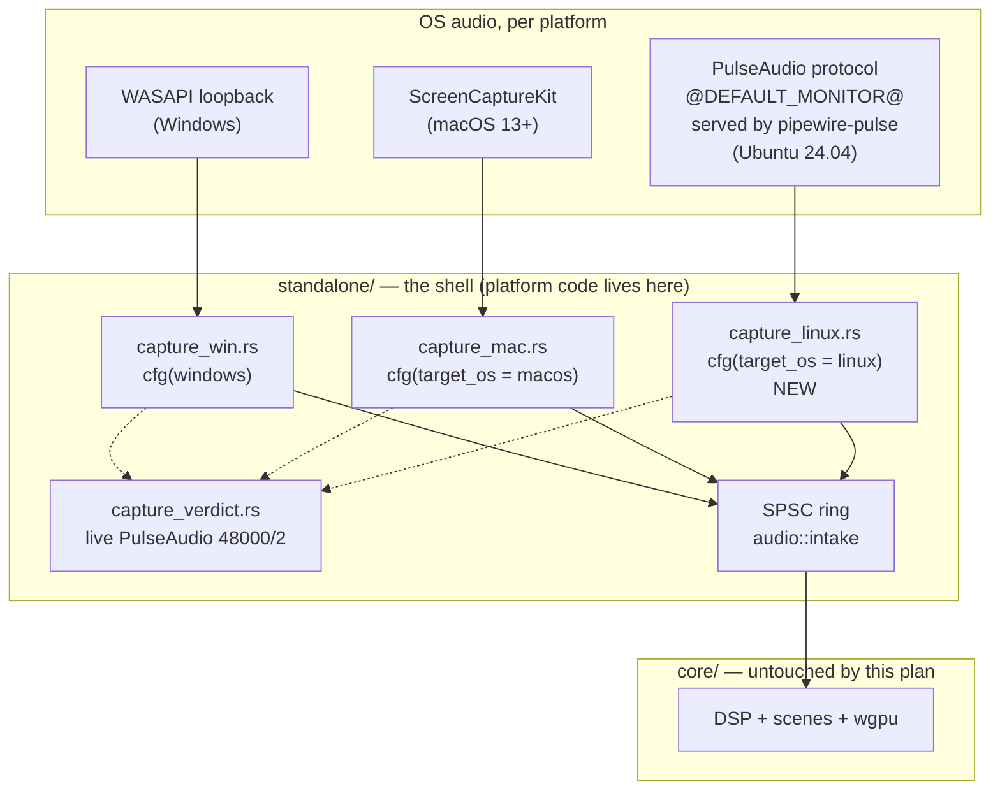

# 0120 — The standalone ships on Ubuntu

> **Status:** approved
> **Created:** 2026-08-26
> **Approved:** 2026-08-26
> **Owner skill(s):** dev, human
> **Related ADRs:** [0131](../adrs/0131-the-linux-standalone-captures-through-pulseaudios-simple-api.md) (proposed),
> [0038](../adrs/0038-tag-driven-release-unsigned-universal-mac-app.md),
> [0016](../adrs/0016-gpu-tests-opt-in-ci-scope.md),
> [0025](../adrs/0025-foobar-component-version-single-sourced.md),
> [0001](../adrs/0001-rust-core-wgpu-cabi-foobar-shim.md)

## TL;DR

The standalone gets a third platform: **Ubuntu 24.04 x86_64**. A new
`standalone/src/capture_linux.rs` opens the default sink's monitor source through PulseAudio's
simple API — which `pipewire-pulse` also serves — so an Ubuntu user hears what the machine is
playing, exactly as a Windows user does. CI gains an `ubuntu-latest` arm, and a `v*` tag gains a
fourth artifact: a `.tar.gz` staged the same way the Windows zip already is.

The first thing that happens is not code. **Phase 1 is a human probe on the target machine**, run
before `dev` starts, because ADR-0131's central premise — that `@DEFAULT_MONITOR@` resolves under
PipeWire's PulseAudio compat server — has never been tested from this dev box.

## Context & problem

The tree is already shaped for Linux and has never been compiled on it. `preset_data_root()` has an
`XDG_DATA_HOME` branch (`standalone/src/lib.rs:186`), `current_rss_bytes()` reads
`/proc/self/statm` (`standalone/src/rss.rs:78`), `capture_handle::Handle` has a `()` third arm
(`standalone/src/main.rs:191`), and `start_capture` has an arm returning `CaptureVerdict::Unsupported`
that renders silence-driven visuals (`standalone/src/main.rs:1220`). None of it is built by anything:
`ci.yml`'s `check` matrix is `[windows-latest, macos-latest]`, and the `links`, `deny` and `miri`
jobs that do run on `ubuntu-latest` never invoke `cargo build`. So this is code that has been carried
for the project's whole life without a compiler ever seeing it.

What the user asked for is not that compile — it is **parity**: the Ubuntu build should do what the
Windows and macOS builds do, which means capturing system audio. On Linux that is a sound-server
concept rather than a kernel one, and the decision of which client protocol to speak is
[ADR-0131](../adrs/0131-the-linux-standalone-captures-through-pulseaudios-simple-api.md).

Three things are true about this work that shape the phasing:

- **The capture seam already exists and is the right one.** `capture_win.rs` and `capture_mac.rs`
  are siblings that each hand back a `CaptureHandle` and a `SampleConsumer`; the shell branches on
  `cfg` in exactly three places. A third backend is an addition, not a refactor, and `core/` is not
  touched at all.
- **The riskiest claim is cheap to test and expensive to be wrong about.** If `@DEFAULT_MONITOR@`
  does not resolve, the backend needs the asynchronous context API to find the default sink name —
  a different and larger program. One `parec` command on the target box settles it, so that command
  runs first.
- **There is a real Ubuntu 24.04 machine to validate on.** Unlike the macOS path, which shipped
  having never executed on Apple hardware (ADR-0038's Context), this one can be run before the tag.

## Decision

Take ADR-0131: a `libpulse-simple-binding` backend on `@DEFAULT_MONITOR@`, a `.tar.gz` built on
`ubuntu-latest`, and an `ubuntu-latest` CI arm whose GPU suites skip through ADR-0016's existing
mechanism. The plan runs the human probe first, then a contiguous `dev` block, then a human
validation of the artifact that actually ships.

## Architecture



The new box is `capture_linux.rs`, and it attaches to the two seams that already exist. Nothing
crosses into `core/`, which is what ADR-0001's split is for.

## Implementation phases

### Phase 1 — Probe the Ubuntu box before any code is written

- **Owner skill:** human

This phase runs **before `dev` starts**, on the real Ubuntu 24.04 machine, and it exists because
ADR-0131 rests on a premise this repo cannot test from Windows. It writes no code.

**Run it with music playing at a normal volume**, from a graphical session on the target box — not
over SSH, where there is no user sound server to talk to. Prerequisites, if absent:
`sudo apt-get install -y pulseaudio-utils vulkan-tools`.

```sh
# 1. Session and server identity.
echo "session: ${XDG_SESSION_TYPE:-unknown}"
pactl info | grep -E 'Server Name|Server Version|Default Sink'

# 2. What monitor sources exist at all.
pactl list short sources | grep -i monitor

# 3. THE PREMISE: does the special name resolve, and does it carry audio?
timeout 5 parec -d @DEFAULT_MONITOR@ --raw --format=s16le --rate=48000 --channels=2 \
    > /tmp/mon-special.raw
echo "special:  $(stat -c%s /tmp/mon-special.raw) bytes, \
$(tr -d '\000' < /tmp/mon-special.raw | wc -c) non-zero"

# 4. THE DISCRIMINATOR: the explicit name, same conditions.
timeout 5 parec -d "$(pactl get-default-sink).monitor" --raw --format=s16le --rate=48000 \
    --channels=2 > /tmp/mon-explicit.raw
echo "explicit: $(stat -c%s /tmp/mon-explicit.raw) bytes, \
$(tr -d '\000' < /tmp/mon-explicit.raw | wc -c) non-zero"

# 5. Build and runtime prerequisites.
apt-cache policy libpulse-dev libpulse0
vulkaninfo --summary 2>/dev/null | head -20 || echo "vulkaninfo absent"
```

Steps 3 and 4 both write silence-detecting counts rather than a file size, because **a monitor
source that resolves and delivers nothing is the failure mode this probe exists to catch** — and it
produces a perfectly healthy-looking non-empty file. In `s16le`, silence is zero bytes; music is
overwhelmingly not. A `special: 960000 bytes, 0 non-zero` line is a **failure**.

Step 4 is what makes a failure actionable. `@DEFAULT_MONITOR@` is a PulseAudio special name and
`<sink>.monitor` is an ordinary source, so the two probes fail for different reasons and separate
three outcomes that a single probe would blur into one "no":

| Step 3 | Step 4 | What it means | What happens next |
|--------|--------|---------------|-------------------|
| audio | (either) | The premise holds | ADR-0131 stands as written; `dev` starts at Phase 2 |
| silent/error | audio | The special name is unsupported here; monitor capture is fine | ADR-0131's Decision is amended to resolve the sink name at startup — the async API's `pa_context_get_server_info`. Bounded, but an ADR amendment and a re-plan of Phase 3 |
| silent/error | silent/error | Monitor capture is not working on this box at all | Stop. The cause is likelier configuration than design, and nothing in this plan is buildable against it until that is understood |

**Done when** four questions have answers, written into this plan's `## Implementation log`:

1. **Does `@DEFAULT_MONITOR@` resolve and carry audio?** Step 3's non-zero count is a large fraction
   of its byte count.
2. **If not, does the explicit `<sink>.monitor` name?** Step 4, read against the table above.
3. **What is the session type and the GPU?** Recorded, not acted on — Phase 6 needs to know whether
   `D` (move to next monitor) is expected to work, and Phase 2 wants to know what a real Vulkan
   device on this box looks like next to whatever CI resolves.
4. **Is `libpulse-dev` installable?**

**A row other than the first stops the plan and routes back to the architect.** This is a stop gate
on purpose, on the Plan 0115 Phase 1 precedent: the repair is an ADR amendment, not something `dev`
improvises mid-phase.

### Phase 2 — The tree compiles, lints and tests on Ubuntu

- **Owner skill:** dev

Add `ubuntu-latest` to `ci.yml`'s `check` matrix and make the third `cfg` arm compile. Expect to fix
whatever a compiler has never seen: the `capture_handle::Handle = ()` arm, unused-import warnings
under `-D warnings`, and any `#[cfg]` that assumed exactly two platforms.

The runner needs system packages for winit, wgpu and (from Phase 3) PulseAudio. Start from
`libxkbcommon-dev libwayland-dev libpulse-dev pkg-config` and converge — the exact list is one of
ADR-0131's Notes, not a settled fact.

Update the `check` job's own comment: it currently says the `-E` filter is *"Applied on BOTH matrix
arms"*, which stops being true here.

**Done when:**

- The `ubuntu-latest` arm runs all five existing steps green — `cargo build`, the filtered
  `cargo nextest run --workspace`, `cargo test --workspace --doc`,
  `cargo clippy --workspace --all-targets -- -D warnings`, `cargo fmt --all --check` — with the same
  `-E` filter the other two arms use, not a loosened one.
- **The implementation log records which wgpu adapter, if any, resolves on the runner, and whether
  any GPU-touching test actually executed there rather than skipping.** This is the phase's real
  finding and it must not be absorbed silently: `ubuntu-latest` may ship Mesa's software Vulkan, in
  which case tests that skip on macOS for want of an adapter will *run* on Linux — against a
  rasterizer nothing in this repo has ever compared against. If any did run, name them.
- No test's platform gate is widened or loosened to make the arm green. A test that should not run
  on Linux gets a gate that says so, in ADR-0016's shape.

### Phase 3 — The PulseAudio capture backend

- **Owner skill:** dev

Write `standalone/src/capture_linux.rs` as a structural sibling of `capture_mac.rs`, and wire the
three `cfg` sites in `main.rs` (`mod` declaration, `capture_handle::Handle`, `start_capture`).

Pin both pulse crates exact in a new `[target.'cfg(target_os = "linux")'.dependencies]` block, per
NFR §4 and the hygiene guard. Add `x86_64-unknown-linux-gnu` to `deny.toml`'s `[graph].targets` and
update that block's comment, which currently says the gate evaluates only Windows and macOS *"and
prunes crates pulled in solely by other targets — e.g. winit's Linux Wayland backend"*. That
sentence becomes false in this phase.

**Done when:**

- `capture_linux.rs` exports `CaptureError`, `CaptureHandle` with `format()`, and
  `start() -> Result<(CaptureHandle, SampleConsumer), CaptureError>` — the same three items
  `capture_mac.rs` exports, so nothing else in `main.rs` changes shape.
- The format is 48 kHz stereo and goes through `AudioFormat::validate()` at the intake boundary,
  once, like both other backends. The ring is built with the same `RING_CAPACITY_FRAMES = 16_384`
  the other two use.
- **The read loop allocates nothing.** The staging buffer is sized and allocated once, before the
  loop; the loop body performs no allocation, takes no lock, opens no file and logs nothing. This is
  a property, checkable by reading the loop body — there is no number attached to it.
- A **partial read is not a partial frame.** A `pa_simple_read` returning a byte count that is not a
  whole number of interleaved frames must neither push a truncated frame nor discard the remainder.
  A unit test asserts this on a synthetic buffer — it is a pure function of a byte slice and a frame
  size, so it needs no PulseAudio server and runs on every CI arm.
- Dropping the `CaptureHandle` stops the thread and closes the stream, and the shell's shutdown path
  does not hang waiting for a blocked read.
- `CaptureVerdict::Unsupported`'s `cfg_attr(..., allow(dead_code))` list gains `target_os = "linux"`,
  and the arm constructing it becomes
  `not(any(windows, target_os = "macos", target_os = "linux"))`. The doc comment on that variant
  names three platforms, not two.
- `cargo deny check` is green with the widened target list. If it is not, the fix is a **reasoned
  `ignore` entry naming the advisory id and why**, never a narrowed target list — narrowing would
  put the shipped Linux artifact back outside the gate.
- The `check` arm from Phase 2 stays green with the new dependency present.

### Phase 4 — The release tarball

- **Owner skill:** dev

Add `packaging/linux/stage.sh` and a `linux` job in `release.yml` that calls it, following the
`packaging/macos/bundle.sh` precedent: **the build, the staging, the archiving and the verification
all live in the script**, so a developer running it on their own Ubuntu box is held to the CI job's
bar rather than a looser one. Invoke it as `bash packaging/linux/stage.sh` rather than as an
executable, for the same reason the macOS job does — this repo is developed on Windows with
`core.filemode=false`.

Write `packaging/linux/READ-ME-FIRST.md` mirroring the Windows one: `chmod +x lmv` then run it, the
same Controls table, F3's audio line reading `live PulseAudio 48000/2` when capture works, and the
per-user directory at `~/.local/share/light-music-visualizer/`.

**Done when:**

- `stage.sh` produces `target/dist/light-music-visualizer-v<version>-linux-x64.tar.gz`, whose single
  top-level entry is a folder of that name holding `lmv`, `presets/*.toml` and `READ-ME-FIRST.txt`.
- The version is parsed **section-anchored** from `[workspace.package]` in root `Cargo.toml` per
  [ADR-0025](../adrs/0025-foobar-component-version-single-sourced.md), not by a first-match
  `version =` — a naive match reads a member crate's line or a `[profile]` key.
- The script **verifies from the archive it wrote**, not from the staging directory, and makes the
  same four assertions the Windows job makes: `lmv` and `READ-ME-FIRST.txt` are at the top level, the
  `.toml` count equals `presets/*.toml` in the repo, and no `.md` file is present.
- The `release` job's `needs:` gains `linux`, and **its count guard learns about the second archive
  kind**: it asserts exactly **3 `.zip` and exactly 1 `.tar.gz`** (macOS, Windows and foobar being
  the three zips). Today it counts `assets/*.zip` and asserts 3, which a silently-skipped Linux job
  would satisfy — so leaving that check alone would ship a short release without a red job anywhere.
- The release notes gain a Linux bullet naming the floor (Ubuntu 24.04 or newer, x86_64) and the
  runtime requirement (PipeWire or PulseAudio — the binary will not start without `libpulse.so.0`).
- A `workflow_dispatch` dry run produces four artifacts and publishes nothing.

### Phase 5 — The docs say Linux

- **Owner skill:** dev

The operator-doc sweep, done in this phase rather than left to the close. Every place that says the
project ships on two platforms now says three, and every place that describes the loopback asymmetry
gains its third entry.

**Done when** each of these has been opened and either updated or deliberately left alone:

- `README.md` — the platform statement and anything naming the shipped artifacts.
- `CLAUDE.md` — the "Architecture at a glance" diagram's frontend list, the `standalone/` and
  `packaging/` entries under "Where things live", and the **"Loopback capture is not symmetric"**
  bullet under "Platform realities", which currently contrasts Windows against macOS only.
- `docs/nfr.md` — §7's CI platform statement and §8's distribution posture.
- `docs/releasing.md` — a tag now builds and publishes four artifacts, not two.
- `docs/on-device-validation.md` — a Linux section, which Phase 6 then executes.
- `docs/capturing.md` — only if a `shot` flag or harness behaviour differs on Linux; say so in the
  log if nothing changed.

And: `node scripts/check-doc-links.mjs`, `node scripts/check-index-rows.mjs` and
`node scripts/check-backlog-claims.mjs` all exit 0.

### Phase 6 — Run it on the Ubuntu box

- **Owner skill:** human

Validate the artifact that actually ships, not a `cargo run`. Extract the tarball produced by
Phase 4 (from a `workflow_dispatch` run, or from a local `stage.sh`) on the Ubuntu 24.04 machine.

**Done when** each of these is reported, pass or fail:

- It extracts and launches; `chmod +x` was or was not needed.
- Music plays and the visuals react to it.
- **F3's audio line reads `live PulseAudio 48000/2`.** A `failed PulseAudio …` line is a finding
  with its reason attached; `unsupported` means the wrong arm compiled.
- `~/.local/share/light-music-visualizer/` appears and holds `config.toml`, a preset copy and
  `diagnostics.log`; `diagnostics.log`'s `capture` column carries the same verdict token.
- `F` (fullscreen) works. `D` (next monitor) works, or is a no-op — expected under Wayland, per
  ADR-0131's Negative, and recorded either way rather than treated as a bug.
- The frame rate F3 shows, and whether the quality tier was auto-dropped.

Anything that fails here becomes a **backlog entry**, not a silent fix — the plan's `dev` phases are
finished by this point and a repair belongs in its own scope.

## Risks & open questions

- **`@DEFAULT_MONITOR@` may not resolve under `pipewire-pulse`.** The whole backend rests on it.
  Phase 1 answers it before a line is written, and a negative answer stops the plan rather than
  redirecting it mid-flight.
- **The `ubuntu-latest` runner may resolve a software Vulkan adapter.** Then tests that skip on
  macOS for want of one will execute on Linux against a rasterizer this repo has never compared
  against, and any difference will look like a code bug. Phase 2 is required to *report* this rather
  than absorb it. The repo has twice blessed garbage off a software adapter; the mitigation is
  knowing which tests ran, not trusting them.
- **Widening `deny.toml` may go red.** The Linux dependency tree has never been through the
  supply-chain gate. The repair is a reasoned `ignore` entry, never a narrowed target list.
- **Wayland limits winit.** Window positioning and monitor moves are not available the way they are
  on X11; the `D` hotkey may be inert. Not solved here, and Phase 6 records it as a known gap.
- **The glibc floor is 24.04.** If a 22.04 user turns up, that is a new decision (ADR-0131
  Alternative G), not a tweak.
- **`libpulse-dev` on the runner image is unconfirmed.** If it is absent from `ubuntu-latest`, every
  ubuntu job that compiles `standalone` needs the `apt-get` step, and forgetting it in a new job is
  a build failure rather than a degraded build.

## What this plan does NOT do

- **No device enumeration or line-in on Linux.** `--list-devices` and `config.input.device` stay
  Windows-only; the config key exists and is inert. That is ADR-0131's Alternative B, deferred and
  additive.
- **No now-playing metadata on Linux.** Windows has SMTC (ADR-0110); the Linux equivalent is MPRIS
  over D-Bus and it is not in scope. The banner exists and is simply never fed, the same asymmetry
  macOS already carries.
- **No AppImage, `.deb` or Flatpak.** ADR-0131 Alternative F.
- **No GPU test coverage on Linux CI.** ADR-0131 Alternative H.
- **No 22.04 or ARM64 Linux build.** One target: `x86_64-unknown-linux-gnu`.
- **No Linux media-player plugin.** The foobar component is Windows-only and stays so; a DeaDBeeF or
  Audacious equivalent is a separate decision nobody has asked for.
- **No change to `core/`.** Capture is a shell concern by ADR-0001. A diff touching `core/` in this
  plan is a finding.
