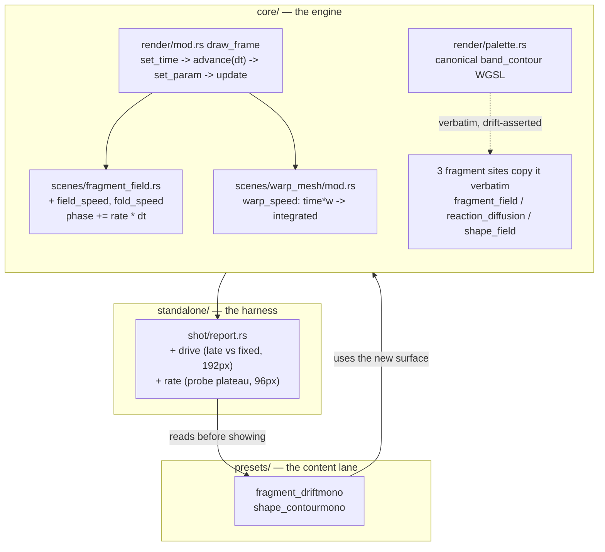

# 0121 — A rate, an ink edge, and a motion reading

> **Status:** in-progress
> **Created:** 2026-08-27
> **Approved:** 2026-08-27
> **Owner skill(s):** dev, human
> **Related ADRs:** [0132](../adrs/0132-a-rate-parameter-integrates-a-phase.md) (proposed),
> [0133](../adrs/0133-the-band-contour-fires-where-the-ink-changes.md) (proposed),
> [0134](../adrs/0134-motion-is-two-readings-and-anchoring-is-why-neither-can-be-a-threshold.md) (proposed)
> **Closes:** design-backlog 0131, 0137, 0138, 0139

## TL;DR

The mono cohort (`fragment_drostemono`, `shape_contourmono`, `fragment_driftmono`, committed
`d6ffa54`) hit three walls in one session and handed them back as API feedback. This plan takes down
all three: `fragment_field` gains `field_speed` and `fold_speed` so a world's animation rate stops
being welded to its flatness; `palette_contour` learns to read the LUT so it fires at ink changes
rather than at every band edge, which is the difference between usable and unusable on a limited-ink
print; and `shot --report` gains `drive` and `rate` columns so the content lane can see, before
showing the user, whether a world moves too much, too little, or ignores the music. The report phase
comes **first**, because it is the instrument that verifies the two engine phases and the content
pass at the end.

## Context & problem

The lane's own account is `spike/api-feedback-mono-cohort.md`, and its three items are filed as
design-backlog 0137, 0138 and 0139 with executable probes. Verified against the tree on 2026-08-27:

- **The rates are shader literals.** `core/src/render/scenes/fragment_field.rs:137-142` animates at
  `t * 0.7`, `t * 0.6` and `t * 0.5` with no uniform behind any of them. The only lever a preset has
  over the two fold rates is `warp`, which scales them — so "slow it down" and "flatten it out" are
  one knob. The field sweep turns out to be reachable, but by accident: `pan` lands in the same sum
  the field sine reads, so a symmetric `pan = -0.25 * time` cancels the clock and costs the preset
  its pan binding. That accident is what shipped.
- **The contour never reads the LUT.** `band_contour` (`core/src/render/palette.rs:742`, copied
  verbatim into `fragment_field.rs`, `reaction_diffusion.rs` and `shape_field.rs`) darkens at every
  band boundary whether or not the colour changes. A limited-ink palette is written as plateaus, so
  most of its boundaries are white-meets-white — where the contour draws exactly the grey shading a
  two-ink print is defined by not having. Four of the nine presets that name `palette_contour` set it
  to `0`.
- **Nothing measures motion.** Every `--report` statistic is a settled differential, so it cannot see
  rate; and its reactivity columns drive one band at a time, so it cannot see combined drive either.
  `fragment_driftmono` took four live passes with the user while the harness stayed green and
  unchanged through all four, `anim` moving in the wrong direction relative to the verdicts.

Two facts sit under the whole plan. **The raising note's "most-used scene in the library (12 of 46)"
is wrong** — `fragment_field` is second, with 12 of the 49 shipped presets against `attractor`'s 19;
the impact argument survives intact. And **the rate hazard already exists in the engine**:
`warp_mesh` computes `let wt = time * wspeed` (`warp_mesh/mod.rs:486`), which teleports the picture
the moment an audio-bound `warp_speed` moves. Nothing has found it because no preset binds it — but a
new rate parameter written the same way would be found immediately.

## Decision

Take all three, in one plan, with the instrument first.

**ADR-0132** makes every bindable rate in this engine integrate a phase (`phase += rate * dt`) rather
than scale absolute scene time, which is what makes an audio-bound rate a bend instead of a jump. It
binds the new `field_speed` / `fold_speed` and corrects the existing `warp_speed`. Rejected: one
proportional `field_speed` (it re-welds the very pair the complaint was about), three parameters (the
fold rates are a designed quadrature pair nobody has asked to split), an engine-wide `time_scale` (it
re-times every preset expression as a side effect), and documenting the jump (a surface whose advice
is "do not bind this" should not be bindable).

**ADR-0133** teaches `band_contour` to sample the two band centres either side of the nearest edge
and suppress the line when they resolve to the same colour, with **equality** as the test — below
the LUT's own 8-bit quantization. That preserves today's behaviour on every smooth palette at any
step count and fixes the plateau case with no new parameter. Rejected: a `palette_contour_mode` flag
(its correct value is derivable from data the shader already has), continuous scaling by colour
distance (it would divide the contour's strength by the step count and break shipped presets), and a
sign overload (Alternative A wearing a disguise).

**ADR-0134** adds `drive` and `rate` to `--report` as printed readings, never gates, in ADR-0083's
shape — because the raiser's own evidence shows a raw rate does not rank watchability: two
comfortable presets measure *higher* than the draft rejected for shaking, the difference being
anchoring, which no pixel statistic here models. Rejected: a threshold, `drive` alone, and a separate
`--motion` mode.

The name-truncation re-raise (design-backlog 0131) rides along, because it lands on the same tables
and the new columns make an already-ambiguous report worse.

## Architecture diagram



## Implementation phases

### Phase 1 — `--report` gains `drive` and `rate`

- **Owner skill:** dev
- **What:** The two motion readings of ADR-0134, computed from captures `build_family_report`
  already takes, printed in the reactivity table and emitted in the JSON.
- **Files touched:** `standalone/src/shot/report.rs`, `standalone/src/shot/report/tests.rs`,
  `docs/capturing.md`.
- **How:** `drive = frame_diff(&late, &fixed)` — the silent 48-frame and loud 48-frame captures the
  function already holds for `anim` and `cover`, so same frame count and same size. `rate` = the mean
  `frame_diff` over consecutive frames in the settled tail of the transient probe's loud plateau,
  from the `capture_preset_over` sequence `probe_response` already consumes. Neither adds a render
  pass, a readback or a resize.
- **Done when:**
  - Both columns print in the text table and appear in `--json`, and a preset with no audio bindings
    at all reads a `drive` at or below the golden suite's own `0.02` mean-channel drift floor, while
    a strongly-driven shipped preset reads well above it. (Naming a threshold for "well above" is
    exactly what ADR-0134 forbids — the claim is the *separation*, read against neighbours.)
  - `rate` is measured on frames that are genuinely consecutive: a unit test over a synthetic image
    sequence with a known per-frame step recovers that step as the mean, and the same sequence
    reversed or reordered does not.
  - A preset whose probe reports `rise_settled == false` has its `rate` cell **marked**, in the same
    shape the transient cells already use, and a unit test covers a marked cell and an unmarked one.
  - `docs/capturing.md` carries both columns, states that `rate` is measured at `PROBE_SIZE` (96×96)
    while the rest of the table is at `REPORT_SIZE` (192×192), and carries the anchoring caveat —
    that motion inside a static repeating structure reads calmer than the same motion unanchored, so
    the column is read against family neighbours and never sorted on.
  - `cargo nextest run --workspace` is green and a full-library `--report` run finishes in the same
    time bracket it does today.

### Phase 2 — preset names stop colliding in `--report`

- **Owner skill:** dev
- **What:** design-backlog 0131. The report truncates preset names to 14 characters and the library
  has its first collision: with `fragment_tiledmono` present, two rows print as `Tiled Rosette` in
  all three tables, and the only way to tell them apart is that one has zeroes in the `mid` / `onset`
  columns.
- **Files touched:** `standalone/src/shot/report.rs`, `standalone/src/shot/report/tests.rs`,
  `docs/capturing.md` if the table shape shown there changes.
- **Done when:** two presets whose display names share their first 14 characters print as
  distinguishable rows in **all three** tables, asserted by a test that constructs exactly that pair
  rather than relying on the current library containing one; and no row's rendered width grows
  enough to wrap at 100 columns with Phase 1's two new columns present.

### Phase 3 — `field_speed` and `fold_speed` on `fragment_field`

- **Owner skill:** dev
- **What:** ADR-0132's two rate parameters, integrated as phases.
- **Files touched:** `core/src/render/scenes/fragment_field.rs`, `presets/README.md`.
- **How:** `advance(dt)` stores `dt`; `update(frame)` — which runs *after* `set_param`, per the
  order at `core/src/render/mod.rs:602-701` — adds `fold_speed * dt` and `field_speed * dt` to two
  accumulators. The shader reads the two phases in place of the three `t * k` literals, keeping the
  fold pair's 0.7 : 0.6 ratio inside `fold_speed` and the sweep's 0.5 inside `field_speed`. Both
  default to `1.0`. The accumulators reset with the scene.
- **Done when:**
  - `field_speed = "0.4"` gives a field sweep at 0.4x the default rate, and `fold_speed = "0.4"`
    slows the fold **without** flattening it — the same preset at `fold_speed = 1` and
    `fold_speed = 0.4` differs in `rate` (Phase 1's column) and not in `cover`.
  - **The phase is continuous across a rate change**, asserted on the CPU with no rendering: with the
    scene at an arbitrary elapsed time, changing a rate parameter between two frames advances that
    accumulator by exactly `rate * dt` for the new rate — never by an amount that scales with elapsed
    time. This is the property ADR-0132 exists for, and it is what `warp_mesh` fails today.
  - **No shipped preset's golden moves.** Every preset leaves both parameters at `1.0`, where the
    integrated phase equals `rate * t` by construction; any movement is `f32` accumulation rounding
    and must sit far below `golden.rs`'s `0.02` drift floor. If a golden *does* move past that floor,
    that is a finding to report, not a re-bless.
  - `presets/README.md`'s `fragment_field` roster carries both parameters with their defaults and
    the note that they are rates in units of the scene's default speed.

### Phase 4 — `warp_speed` integrates too

- **Owner skill:** dev
- **What:** The correction ADR-0132 requires so its rule holds engine-wide rather than in the one
  scene written after it. `warp_mesh/mod.rs:486`'s `let wt = time * wspeed` becomes an integrated
  phase carried in the uniform.
- **Files touched:** `core/src/render/scenes/warp_mesh/mod.rs`, `presets/README.md`.
- **Done when:** at a constant `warp_speed` the warp phase equals `warp_speed * time` to within
  accumulation rounding — asserted as the same CPU property as Phase 3 — and the same continuity
  property holds across a rate change. No golden moves: `DEFAULT_WARP_SPEED` is `1.0` and no shipped
  preset binds `warp_speed`, which is also why this phase has no regression evidence beyond that
  equivalence and says so.
- **Separable.** If this phase has to be abandoned, Phase 3 still stands and ADR-0132's Negative
  section already records that `warp_speed` would then remain a live counterexample — but say so in
  the log rather than leaving it silent.

### Phase 5 — the contour reads the LUT

- **Owner skill:** dev
- **What:** ADR-0133. `band_contour` samples the two band centres either side of the nearest edge and
  suppresses the line when they resolve to the same colour within half a code value.
- **Files touched:** `core/src/render/palette.rs` (the canonical WGSL, its two drift assertions, and
  the CPU-side unit tests), `core/src/render/scenes/fragment_field.rs`,
  `core/src/render/scenes/reaction_diffusion.rs`, `core/src/render/scenes/shape_field.rs`,
  `docs/preset-palettes.md`, `presets/README.md`.
- **How:** `n = round(t * steps)`; sample at `(n - 0.5) / steps` and `(n + 0.5) / steps`, from both
  LUTs, crossfaded by `palette_mix` exactly as the main sample is. The two textures, the sampler and
  `palette_mix` are **explicit WGSL parameters** of the function — not module-scope globals it
  happens to find — so the shared copy cannot silently bind to a future site's differently-named
  textures. The existing `steps < 1.5 || amount <= 0.0` early-out stays first, ahead of the samples,
  so a preset with the contour off pays nothing.
- **Done when:**
  - On a plateau palette (a run of two or more bands holding one colour), a non-zero
    `palette_contour` draws **no** line inside a run and draws at each run boundary — asserted on
    rendered output, not by reading the shader.
  - On a smooth palette the contour is unchanged at every band edge, checked at a **high** step count
    as well as a low one: the failure mode Alternative B was rejected for is one that only appears
    when adjacent band centres are close together.
  - **The goldens of the five presets with a non-zero `palette_contour` do not move** —
    `fragment_mandala`, `fragment_strata`, `fragment_tiled`, `fragment_vitrail`, `shape_pulse`.
  - The verbatim-copy assertions still pass with the new signature at all three fragment sites, and
    `particles/shaders.rs` still has no `band_contour` (the vertex-stage exclusion ADR-0078 asserts).
  - `docs/preset-palettes.md` states the new rule and both of its honest edges: a "flat" run built
    from two stops that differ by one code value still contours, and a stop landing mid-band draws at
    the nearest band edge rather than at the stop. `presets/README.md`'s `palette_contour` row says
    where the line now falls.

### Phase 6 — the content pass that proves the surface

- **Owner skill:** human
- **What:** A `preset-author` session — the lane that raised all three items — re-tunes the cohort
  onto the new surface, which is the only evidence that the walls actually came down.
- **Files touched:** `presets/fragment_driftmono.toml`, `presets/shape_contourmono.toml`, and any
  other cohort member the author judges affected.
- **Done when:**
  - `fragment_driftmono` expresses its calm through `field_speed` / `fold_speed` and **frees its pan
    binding** — the accidental `-0.25 * time` cancellation is gone from both axes, and the preset's
    `rate` column reads in the same neighbourhood it does today.
  - `shape_contourmono` turns `palette_contour` on, and its header comment explaining why it had to
    be zero is replaced by what the parameter now does there.
  - Both still pass the five behavioural gates, and the author records their `drive` and `rate`
    readings against family neighbours in the plan's implementation log.
  - Anything the new surface still cannot express comes back as a fresh backlog entry rather than a
    workaround with a comment — the failure mode this whole plan is repairing.

## Data shapes

```rust
// illustrative — not the final interface

// Phase 1: two readings added to PresetReport, both derived from captures the
// function already holds. Neither is compared to a threshold anywhere.
struct PresetReport {
    // ...existing fields...
    /// Silent 48-frame capture against the fully-driven 48-frame capture, at
    /// REPORT_SIZE. The combined-stimulus differential the per-band columns
    /// cannot express (ADR-0134).
    drive: f32,
    /// Mean consecutive-frame difference over the settled tail of the transient
    /// probe's loud plateau, at PROBE_SIZE (96x96 - NOT the size the columns
    /// beside it are measured at). `settled` false means the response was still
    /// travelling, so the cell is marked rather than published bare.
    rate: f32,
    rate_settled: bool,
}

// Phase 3: the scene stops being stateless. Both phases equal `rate * t` at a
// constant rate, which is why every default-valued preset renders as before.
struct FragmentFieldScene {
    // ...existing fields...
    dt: f32,          // stored by `advance`, consumed by `update`
    fold_phase: f32,  // += fold_speed  * dt
    field_phase: f32, // += field_speed * dt
}
```

```wgsl
// illustrative — Phase 5's shape, not the final WGSL
fn band_contour(
    t: f32, steps: f32, amount: f32,
    lut_a: texture_2d<f32>, lut_b: texture_2d<f32>, samp: sampler, mix: f32,
) -> f32 {
    if (steps < 1.5 || amount <= 0.0) { return 1.0; }   // early-out stays FIRST
    let f = t * steps;
    let n = round(f);
    // The two band centres this edge separates, crossfaded exactly as the main
    // sample is. Same colour within half a code value = same ink = no line.
    // ...
}
```

## Risks & open questions

- **Phase 3/4 goldens move on `f32` accumulation.** A sum of `rate * dt` differs from
  `rate * (N * dt)` in the last place or two. The plan's position is that this sits far below the
  `0.02` drift floor `golden.rs` already calls rasterizer noise; if a golden moves past it, that is a
  **finding to report**, not a re-bless. Related trap already on the record: `LMV_BLESS` rewrites
  every baseline, not the failing one.
- **Phase 5 costs four extra LUT samples per pixel at three sites.** Cache-warm reads from a 256×1
  texture already resident, and gated behind the early-out — but it is the one phase here with a
  per-pixel cost, and `docs/nfr.md`'s frame budget is the thing to watch if a Rich-tier preset on the
  affected scenes moves.
- **Phase 5 contends with two approved plans on `shape_field.rs`** — [0098](0098-the-figure-nests-properly.md)
  and [0092](0092-the-engine-draws-an-authored-path.md), which both own that file. Run this plan and
  those in sequence or in separate worktree lanes; the collision is in the shader's fragment body,
  which is where all three edit.
- **Phase 4 has no regression evidence and cannot get any.** No shipped preset binds `warp_speed`, so
  the constant-rate equivalence assertion is the whole of the proof. Stated in the ADR's Negative
  section too, so it is not discovered at review.
- **`rate` is measured at a different size from every column beside it.** Accepted and documented
  rather than fixed, since equalizing means either a slower probe or a coarser report for a number
  that is never thresholded. The precedent for the danger is design-backlog 0130, where a statistic
  scaled with capture resolution and none of its floors said so.
- **`rate` cells will be marked often.** `PROBE_WINDOW`'s own comment records that a great many
  presets do not settle inside 48 frames. If the mark turns out to appear on most rows, that is worth
  reporting as a followup — a mark everyone ignores is not a mark.
- **Open:** whether `fold_speed` should eventually split into its two rates. Nothing has asked; the
  split is additive, and ADR-0132's Neutral section holds the position.

## What this plan does NOT do

- **It does not gate on motion.** ADR-0134 rejects a threshold on the raiser's own evidence, and no
  phase here adds one. If a future plan wants a gate, it needs a statistic that models anchoring,
  which does not exist yet.
- **It does not add an engine-wide `time_scale`.** ADR-0132 Alternative C — a separate and much
  larger decision, since it would re-time every preset *expression* as well.
- **It does not split `fold_speed` into two rates**, add a `palette_contour_mode`, or touch the
  vertex-stage LUT sites — ADR-0078's scoping stands exactly as written.
- **It does not re-tune any preset outside the mono cohort.** Phase 6 is the cohort that raised the
  feedback; whether the other eleven `fragment_field` worlds want the new rates is a curation
  question for a later content pass.
- **It does not touch the `--horizon` mode** or the five behavioural gates. Phase 1 is additive to
  the reading surface only.

## Implementation log

> Written by `dev` — one row per phase as that phase's commit lands, and the close block after the
> last one. **The phases above are the contract; everything here is what happened.**

**Lane:** `WORK/lmv-plan-0121` on branch `plan-0121-rate-ink-motion`

| phase | owner | state | commit |
|---|---|---|---|
| 1 — `--report` gains `drive` and `rate` | dev | done | `63461ee` |
| 2 — preset names stop colliding | dev | done | `0f8fa98` |
| 3 — `field_speed` and `fold_speed` | dev | done | `73d084c` |
| 4 — `warp_speed` integrates too | dev | done | `4014682` |
| 5 — the contour reads the LUT | dev | done | `324a30d` |
| 6 — the content pass | preset-author | done | `d74fa37` |

### Notes

**Deviations from the plan.**

- Phase 2 (`0f8fa98`) also touched `standalone/tests/shot_cli.rs`, which is not in its file list:
  that test located the easing fixture's report row by a name prefix the middle-elision shortens.
- Phase 5 (`324a30d`) also touched `core/src/render/scenes/warp_mesh/mod.rs`. `band_contour` is
  written **four** times, not the three the phase lists, and the fourth copy's text had already
  drifted (`dd` for `d`) — so `the_contour_reaches_the_fragment_sites_and_not_the_vertex_one` could
  not have caught it: it iterated three sites, and the one place drift had happened was not among
  them. The fourth copy is now canonical and the assertion covers it. `docs/preset-palettes.md`
  documents `palette_contour` as live on warp-mesh. Scope put to the user before taking it.
- Phase 5 (`324a30d`) added `core/tests/palette_contour.rs`. Its done-when requires assertions on
  rendered output and names no test file.

**Done-when criteria not satisfiable as stated.**

- Phase 1, third bullet: *"the same sequence reversed or reordered does not [recover the step]"*.
  `frame_diff` is symmetric, so a reversed sequence has the identical multiset of consecutive pairs
  and a mean over them is reversal-invariant for **any** input. Asserted instead: **reordering**
  changes `mean_consecutive_diff`, and **reversing** changes `probe_rate`, whose fixed window then
  selects different frames. The invariance is stated in the test's own doc comment.
- Phase 3, first bullet: the stated comparison holds — `rate` 0.0080 → 0.0063 at `fold_speed = 0.4`,
  `cover` 0.994 → 0.988 — but `cover` sits near 1.0 on any fullscreen field and does not separate a
  *slowed* fold from a *flattened* one: `warp` 0.55 → 0.22 moves it to 0.985. The
  no-flattening claim rests instead on a matched-phase equivalence: at `fold_speed`/`field_speed`
  0.4, frame 300 renders the picture the default renders at frame 120, while `warp` 0.22 at frame
  300 renders a different, visibly flatter field. Both images are in the Phase 3 commit message's
  numbers; the check was run by hand and is not in the suite.

**Followups noticed, not acted on.**

- A full-library `--report` marks **48 of 49** `rate` cells; only `Halo` reads unmarked. The plan's
  risk list names this shape and the followup list already carries the question.
- Phase 5's per-pixel cost was not measured against `docs/nfr.md`'s frame budget.

**Phase 6 — the content pass (`preset-author`).** Both worlds moved onto the new surface, the
suite is green (`cargo nextest run -p lmv-core`, **802 passed / 5 skipped**), and one done-when
turned out to rest on a premise the tree does not carry.

*`fragment_driftmono` — the rates, and the pan binding that was already free.* **The
`-0.25 * time` cancellation the phase asks to remove was never shipped.** `d6ffa54` binds
`pan_x`/`pan_y` to `noise` plus the mid surge and nothing else; what the file carried was the
*derivation* — a header block presenting a symmetric pan as the scene's rate knob, ending "there
is deliberately NO linear pan term". So the accident lived in the advice, not in the preset, and
Phase 6 retired the advice: that block is now history, explicitly labelled as history, with
`field_speed` substituted into the crawl-speed formula the world's four live verdicts fall out of.
The tuning proper is `warp` 0.42 → **0.62** with `fold_speed` **0.45** — the amplitude the three
calm passes had spent, bought back, with the fold's own clock holding the churn down instead:

| | `drive` | `rate` | `cover` | `anim` |
|---|---|---|---|---|
| Drift Mono, `d6ffa54` | 0.455 | 0.0411 | 0.450 | 0.316 |
| Drift Mono, **shipped** | **0.469** | **0.0370** | **0.659** | 0.264 |
| Tiled Rosette Mono | 0.461 | 0.0392 | 0.576 | 0.523 |
| Droste Mono | 0.393 | 0.0275 | 0.326 | 0.383 |
| Supernova (family top on `rate`) | 0.280 | 0.0654 | 0.908 | 0.236 |
| Tiled Rosette (family floor) | 0.072 | 0.0034 | 0.337 | 0.048 |

`rate` 0.0411 → 0.0370 sits well inside the neighbourhood the phase asks for, and it moved
**against** `cover` 0.450 → 0.659 — less churn per frame carrying half again as much structure,
which is the one pair `warp` alone could not have produced in either direction. `drive` rose
0.455 → 0.469 despite bass moving off `warp` onto the two rates: a rate change at a fixed capture
depth lands the field at a different *phase*, not merely a different amplitude. Both rates are
audio-bound (bass + onset on `fold_speed`, bass on `field_speed`, the latter straddling 1.0 at
±15 % on a 1.2 s constant), so ADR-0132's integrated phase is exercised by shipped content rather
than only by its unit test.

*`shape_contourmono` — the contour is on at `1.0`, and the reason it is at the maximum is the
finding.* The set of pixels the contour touches is fixed by geometry; `amount` only sets how dark
they go. So a low value pays the whole cost and buys an invisible line. Measured at 640x360, loud,
counting exact frame colours: `0` → **9** distinct colours, pure red 6.00 %; `0.25` → 80, 4.79 %,
invisible; `0.5` → 179, 4.73 %, barely visible; `1.0` → 684, 4.69 %, a key. Only at `1.0` does
about a sixth of the touched pixels reach true black — an ink core with the `fwidth` ramp either
side — which is what makes it read as a key line rather than as a smudge. Readings: `drive`
0.365 → **0.368**, `rate` 0.0034 → **0.0040**, `cover` 0.557 → 0.554, against family neighbours
Facet (0.112 / 0.0016) and Pulse (0.296 / 0.0074) — the contour is a colour change, so it barely
moves either motion column, which is the right outcome.

*Filed rather than worked around: **design-backlog 0140**.* ADR-0133 fixed *which* edges the
contour draws at and left *what* it draws untouched — a soft `smoothstep` darken toward black,
with no colour of its own. On a palette whose every band edge is already hard by construction that
makes the contour the only source of intermediate values in the frame. Priority **Low**: one
preset wants it, the shipped workaround looks good, and the fix costs a parameter on a surface
ADR-0133 deliberately kept parameterless.

*Two more cohort files inspected, one edited.* `fragment_driftmono`'s own `palette_contour = "0"`
carried the now-false plateau rationale, so it was **rewritten with a current, measured one** —
the world's five run boundaries are already at full contrast and a darkening line only fattens the
black, closing the white channels the flow reads through (56 → 741 exact frame colours at `1.0`).
`fragment_tiledmono`'s rationale needed no change: it never claimed the plateau case, and its
"the contour line is itself a gradient … the edges are already maximum contrast" is precisely what
0140 now records. `fragment_drostemono` and `fragment_tiledmono` were **not** given the rates —
both anchor their motion in a repeating structure and neither has asked, which is the followup
list's curation question, not this phase's.

*Pre-existing nit, not fixed here:* `fragment_drostemono:113` says "no contour - see the header"
and its header carries no contour note. Predates this plan; left alone rather than widened into.

### Close triggers

- **`presets/` touched:** `presets/README.md`, plus **two `.toml` retuned by Phase 6** —
  `fragment_driftmono.toml` (onto `field_speed` / `fold_speed`) and `shape_contourmono.toml`
  (`palette_contour` 0 → 1.0). No preset added or removed, so the curated set is unchanged in
  membership.
- **Plan header `Closes:`** design-backlog 0131, 0137, 0138, 0139
- **What shipped:** feature and fix. Feature: `field_speed` / `fold_speed` on `fragment_field`, and
  the `drive` / `rate` columns on `shot --report`. Fix: `warp_speed`'s teleport, the contour's
  every-edge firing, and the report's name collision.
- **Operator docs touched:** `docs/capturing.md`, `docs/preset-palettes.md`, `presets/README.md`.
- **Backlog probes (`node scripts/check-backlog-claims.mjs`):** exits **1**, 5 broken —
  **0131**, **0137**, **0138**, **0139** (the plan's four `Closes:` entries, each broken by its own
  fix landing) and **0132**, whose third probe pinned the report's exact header string that Phase 1
  widened. 0132's claim — *the report's column set carries no level column* — is unaffected:
  neither `drive` nor `rate` is a level column. **Phase 6 adds 0140** (a new live entry, probe
  green), so the roster to re-read at close is those five plus the new one.
- **Outstanding `human` phases:** none. Phase 6 landed as a `preset-author` session.

## Followups (after this lands)

- Whether the other eleven `fragment_field` worlds want the new rate parameters — a curation
  question, not an engine one.
- Whether a `rate` mark that appears on most rows is worth keeping in that shape.
- The per-hop motion series (ADR-0134 Alternative C), if the two columns turn out to under-serve.
