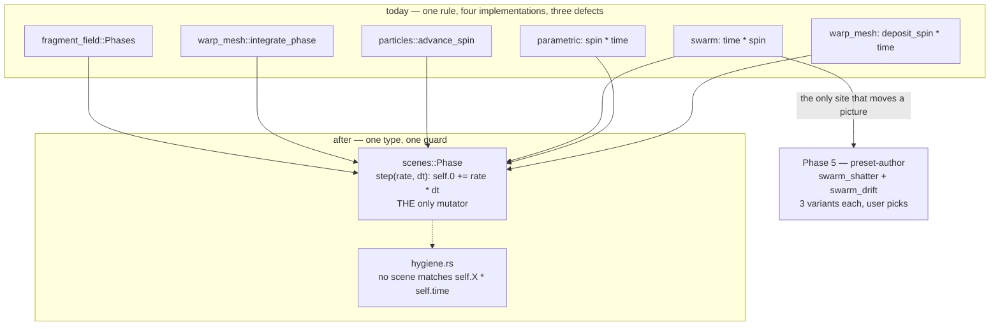

# 0122 — Every rate integrates

> **Status:** approved
> **Created:** 2026-08-27
> **Approved:** 2026-08-27
> **Owner skill(s):** dev, human
> **Related ADRs:** [0135](../adrs/0135-every-scene-rate-integrates-through-one-shared-phase.md) (proposed),
> [0132](../adrs/0132-a-rate-parameter-integrates-a-phase.md) (accepted, Outcome — the rule this finishes)
> **Closes:** design-backlog 0141

## TL;DR

[ADR-0132](../adrs/0132-a-rate-parameter-integrates-a-phase.md) decided that every bindable rate in
this engine integrates a phase, and shipped with three live counterexamples it had not looked for.
This plan takes the rule from a claim to a property: one `Phase` type in `scenes/mod.rs`, the three
correct implementations collapsed into it, the three defective sites moved onto it, and a hygiene
assertion that fails the build on the fourth. Only one of the three defects changes a picture —
`swarm`'s, bound to `mid` by two shipped presets — so the plan ends with a content pass and a human
verdict rather than with an equivalence assertion.

## Context & problem

Verified against the tree on 2026-08-27. The engine holds **six** bindable rates. Three integrate,
each through its own private copy of the same three lines; three multiply absolute scene time:

| site | rate | today | shipped content binds it |
|---|---|---|---|
| `fragment_field.rs` | `fold_speed`, `field_speed` | `Phases::step` | yes — `fragment_driftmono` |
| `warp_mesh/mod.rs` | `warp_speed` | `integrate_phase` | no |
| `particles/family.rs:981` | `spin` | `advance_spin` | yes — six attractor worlds |
| `swarm.rs:812` | `spin` | `self.time * self.spin` | **yes, to `mid`** |
| `lines/parametric.rs:410` | `spin` | `self.spin * self.time` | constants only |
| `warp_mesh/mod.rs:2070` | `deposit_spin` | `self.deposit_spin * self.time` | no |

**Only `swarm` has a measurable defect today**, and it is large. `swarm_shatter.toml:34` binds
`spin = "0.4 + clamp(mid * 0.9, 0, 0.75)"` with `[smoothing] spin = 0.3`. A one-pole at `tau = 0.3`
closes about 5.4 % of its gap per 60 Hz frame, so across that 0.75 swing `spin` moves ~0.04 in a
single frame; at t = 100 s the field clock therefore advances `100 × 0.04 = 4.0` s in that frame,
against a nominal `1.15 / 60 = 0.019` s. Roughly **210x**, on every loud passage, and it grows
without bound as a set runs. `swarm_drift.toml:96` binds a smaller swing (0.035) on a longer ease
(`tau = 1.30`), which at the same elapsed time is ~3.5 units of field coordinate delivered over
about a second against a nominal rate of 0.04/s — call it **67x**. Neither reads as a picture jump,
because `field_t` is the time coordinate of the curl-noise field the particles *steer* by rather than
a position: the flow re-rolls instead of teleporting, which is a look, and is the kind of thing a
viewer attributes to the music.

**The other two are latent, and cost nothing to fix.** `curve_ionwake` and `curve_nightbloom` bind
`spin` to constants (`0.25`, `0.06`), where `spin · time` and the integrated phase agree by
construction; `deposit_spin` defaults to `0.0` and no preset binds it, which is exactly the status
`warp_speed` had when ADR-0132 corrected it anyway rather than leaving a counterexample.

**The reason this is a plan and not three edits is the enumeration.** ADR-0132 named two sites and
was wrong; Plan 0121's close found a third; planning this found two more. Every one was found by
grepping, none by reading the list. The same shape cost this repo a plan cycle ten days ago, when
`band_contour` turned out to be four verbatim copies rather than the three its drift assertion
iterated — and the one copy that had drifted was the one the assertion could not see. A rule enforced
by a list of sites fails identically whether the list lives in a test or in an ADR.

## Decision

Take [ADR-0135](../adrs/0135-every-scene-rate-integrates-through-one-shared-phase.md): one `Phase`
type, every rate through it, and a text guard that fails the build on a fourth site.

The type accumulates `rate · dt` and **nothing else** — no constant scale folded in — because
`advance_spin`'s doc comment already records why that matters: the attractor defers its `SPIN_RATE`
multiply to the read so that at `spin = 1` the accumulator is `Σ dt` term for term, bit-for-bit the
same summation the renderer runs for its own clock, and no golden moves. A scene with its own
constant keeps applying it on read.

Rejected in the ADR: the text guard alone (it guards the defect and not the duplication, and the
duplication is how the defect returns); putting the integration in the `Scene` trait (it widens
ADR-0002's seam with a method seven rate-less scenes must stub, and the engine would need to know
each scene's scale factors and pairings); a newtype with full arithmetic (`Add<f32>` re-opens the
door the type exists to close); and correcting the sites with no mechanism, which is the option
already chosen twice.

## Architecture diagram



## Implementation phases

### Phase 1 — `scenes::Phase`, proven on the three sites that already work

- **Owner skill:** dev
- **What:** The type, and the migration of the three existing implementations onto it. No behavioural
  change anywhere — this phase is the abstraction, validated against code that is already correct.
- **Files touched:** `core/src/render/scenes/mod.rs`, `core/src/render/scenes/fragment_field.rs`,
  `core/src/render/scenes/warp_mesh/mod.rs`, `core/src/render/scenes/particles/family.rs`,
  `core/src/render/scenes/particles/mod.rs`, `core/src/render/scenes/particles/tests.rs`.
- **How:** `Phase(f32)` with `step(&mut self, rate, dt)` and `get(self) -> f32`, and no other
  mutator. `Phases`, `integrate_phase` and `advance_spin` are deleted; their doc comments are
  consolidated into the type's, since each states the same rule from scratch. `spin_phase` stays a
  scene-local function applying `SPIN_RATE` on read.
- **Done when:**
  - `Phase` has exactly one method that mutates, and no `Add`/`AddAssign`/`Deref`/`DerefMut` impl —
    asserted by the fact that a scene writing `phase + rate * time` does not compile, which the phase
    demonstrates once in a `compile_fail` doctest or records as tried-and-observed in the log.
  - **Every capture is byte-identical.** The migration preserves the summation term for term, so
    this is exact equality rather than a tolerance: `cargo nextest run --workspace` green with no
    golden baseline touched and `LMV_BLESS` never run. Any movement at all means the migration
    changed the arithmetic and is a finding to report, not a re-bless.
  - `particles/tests.rs`'s five `advance_spin` call sites survive as tests of `Phase`, asserting the
    same properties. They are the oldest evidence for the integrated form and deleting them with the
    function would trade a real test for a refactor.
  - The three deleted doc comments' content is in the type's, including the `advance_spin` note on
    why no constant scale is folded into the accumulation.

### Phase 2 — the two rates nothing binds

- **Owner skill:** dev
- **What:** `parametric_curve`'s `spin` and `warp_mesh`'s `deposit_spin` move onto `Phase`. Neither
  moves a picture, which is what makes them the cheap half.
- **Files touched:** `core/src/render/scenes/lines/parametric.rs`,
  `core/src/render/scenes/warp_mesh/mod.rs`.
- **How:** `parametric_curve` has **no `advance` today** — it takes the trait's default no-op — so it
  gains one that stores `dt` under the same non-finite guard the other scenes use, and integrates in
  `update`, where `rotation` is already computed. `warp_mesh` adds a `deposit_phase` beside its
  existing `warp_phase`, integrated in `update` and read in `render` where
  `self.deposit_spin * self.time` is read now.
- **Done when:**
  - At a constant rate each phase equals `rate · time` to within accumulation rounding, asserted on
    the CPU with no rendering — the same property Plan 0121's Phases 3 and 4 assert, now against the
    shared type.
  - The continuity property holds across a rate change: the phase advances by `rate · dt` for the
    new rate whatever the elapsed time.
  - **No golden moves, and the arithmetic says why rather than the tolerance.**
    `fixtures/parametric_curve.toml` binds `spin = "0"` and `DEFAULT_DEPOSIT_SPIN` is `0.0`; at rate
    zero the integrated phase and the multiply are both exactly zero, so these two are bit-identical
    and not merely close.
  - `presets/README.md` says both parameters integrate a phase, in the shape the `warp_speed` note
    added by Plan 0121 already uses.

### Phase 3 — `swarm`'s field clock

- **Owner skill:** dev
- **What:** The one defect with a measurable size and the one that moves shipped pictures. This phase
  ships the engine change **and the evidence**, not a retune — the retune is Phase 5's, and the
  verdict on it is the user's.
- **Files touched:** `core/src/render/scenes/swarm.rs`.
- **How:** `self.dt` is already stored by `advance` (`swarm.rs:709`). A `Phase` replaces
  `let field_t = self.time * self.spin;`, integrated in `update` before the particle loop reads it.
- **Done when:**
  - The constant-rate equivalence and the rate-change continuity both hold, asserted on the CPU as in
    Phase 2.
  - **The two affected presets' `drive`, `rate` and `cover` are recorded before and after**, read
    against their family neighbours — using the columns Plan 0121 added for exactly this. Readings,
    never thresholds ([ADR-0134](../adrs/0134-motion-is-two-readings-and-anchoring-is-why-neither-can-be-a-threshold.md)):
    the claim is that the numbers are *reported*, not that they land anywhere in particular. What the
    correction does to the look is Phase 5's question and is not settled here.
  - **The two golden fixtures are the honest edge, and the plan states it rather than assuming it.**
    `fixtures/swarm_shaped.toml` binds `spin = "0.0"` — bit-identical, exactly zero either way.
    `fixtures/swarm.toml` binds `spin = "0.1"`, and this is the **one** fixture in the repo where
    `Σ(rate · dt)` and `rate · Σ(dt)` differ at all: they differ in the last bits of an `f32`,
    accumulated over the fixture's 60 frames, on a noise coordinate of order 0.1. That is orders of
    magnitude under `golden.rs`'s `0.02` mean-channel floor. If `swarm.png` moves past that floor,
    that is a **finding to report**, not a re-bless — and `LMV_BLESS` rewrites every baseline, not
    the failing one.

### Phase 4 — the guard

- **Owner skill:** dev
- **What:** The hygiene assertion that makes ADR-0132's rule a property of the build instead of a
  claim in a document.
- **Files touched:** `core/tests/hygiene.rs`.
- **How:** Scan every `.rs` under `core/src/render/scenes/`, skipping declared test modules the way
  the existing hot-path guard does, and fail on `self.<ident> * self.time` or
  `self.time * self.<ident>`.
- **Runs after the three fixes, deliberately.** Landing it earlier would need an allowlist of the
  sites still to be corrected, and an allowlist is the same enumeration this plan exists to remove —
  a shrinking one is still a list someone can add a row to. Three phases inside one session is not
  long enough for a new instance to appear behind it.
- **Done when:**
  - The guard passes on the tree as Phase 3 leaves it, and covers every scene source rather than a
    named set — a new scene directory is scanned without anyone remembering to add it.
  - **It does not flag the legitimate uses.** `warp_mesh/shader.rs` multiplies `time` by about ten
    compile-time constants (the reference's own `0.005`/`0.3`/`family_rate` frequencies, none of them
    settable); those must pass, and the test says why in a comment rather than leaving the exclusion
    looking accidental.
  - **Inversion-probed**: reverting one corrected site makes the guard fail, run by hand and recorded
    in the log. This is the habit `hygiene.rs` already documents for its `cfg(test)` matcher — *"a
    guard that has stopped guarding still passes"* — and nothing permanent can replace it.
  - The doc comment **names the evasion it cannot see**: binding the clock to a local first
    (`let time = self.time;` then `time * self.spin`) passes, and `swarm.rs:822` and
    `emitter.rs:1194` already carry that first half for unrelated reasons. A reader must not mistake
    the guard for a proof.

### Phase 5 — the swarm content pass, and the verdict is the user's

- **Owner skill:** human
- **What:** A `preset-author` session that renders what the correction did to `swarm_shatter` and
  `swarm_drift`, and stops for a verdict in the running app. Nothing ships on the author's judgement
  alone, because the question — *was the lurch a defect or was it the look* — is not one a statistic
  in this repo can answer.
- **Files touched:** `presets/swarm_shatter.toml`, `presets/swarm_drift.toml`.
- **Done when:**
  - **Three variants are rendered per preset**: today's numbers on the old engine (the reference),
    today's numbers on the corrected engine, and a re-tuned variant for the case where the corrected
    motion reads too calm. `drive`, `rate` and `cover` recorded for each against family neighbours.
  - **The user picks, in the running app**, and the losing variants and the reason go into the
    implementation log — including the case where the answer is "the corrected one at today's
    numbers", which is a real outcome and not a null result.
  - Each preset's header records what changed and why, replacing any rationale that assumed the old
    behaviour. A `spin` value tuned against a clock that lurched is a workaround for a defect that no
    longer exists, which is precisely the class the close ceremony's stale-workaround grep hunts.
  - Anything the corrected surface cannot express comes back as a **fresh backlog entry** rather than
    a workaround with a comment.

## Data shapes

```rust
// illustrative — not the final interface

// core/src/render/scenes/mod.rs — the one implementation.
// Accumulates `rate * dt` and NOTHING else: a scene with its own constant
// scale applies it on read, so at rate 1.0 the accumulator is the renderer's
// own clock summation term for term and no golden moves (ADR-0135).
pub(crate) struct Phase(f32);

impl Phase {
    fn step(&mut self, rate: f32, dt: f32) { self.0 += rate * dt; }
    fn get(self) -> f32 { self.0 }
}
// No Add, no AddAssign, no Deref. `phase + self.spin * self.time` must not compile.

// swarm.rs — what Phase 3 replaces.
//   before:  let field_t = self.time * self.spin;
//   after:   self.field_phase.step(self.spin, self.dt);   // in `update`
//            let field_t = self.field_phase.get();
```

## Risks & open questions

- **The guard is evadable in one line, and two files already have the first half.** `swarm.rs:822`
  and `emitter.rs:1194` both bind `let time = self.time;` for unrelated reasons; a field multiplying
  *that* passes. Recorded in ADR-0135's Negative section and required in the guard's own doc comment.
  The plan's position is that raising the cost is worth having even though it is not a proof.
- **`update` is not idempotent and is called twice per frame in one case.** `scene_for_mut` is keyed
  by `SystemKind`, so a same-system dual-live dissolve resolves both sides to one scene instance and
  every `Phase` in it integrates at 2x for the dissolve's duration. Pre-existing —
  `particles::spin_time` and the emitter's field step already do this — and **no test can see it**,
  because headless capture always answers `Freeze`. This plan moves three more rates into that class
  without repairing it; filed as design-backlog 0142 rather than folded in, since the cause is scene
  sharing and not rates.
- **Phase 1 touches `particles/`, which is the scene with the most existing state.** The migration is
  mechanical, but `advance_spin` is named in five tests and the `SPIN_RATE` deferral is subtle enough
  that folding it in by accident would move every attractor golden. The byte-identical done-when is
  what catches that.
- **Phase 5 may conclude the correction made two presets worse.** That is a real outcome, not a
  failure of the plan: the engine change stands either way (the rule is the rule), and the answer
  would be a retune rather than a revert. What it must not become is a `spin` value chosen to
  reproduce the lurch, which would be re-implementing the defect in content.
- **Open:** whether `emitter`'s field step and the two `let time = self.time;` locals want the same
  treatment. Neither multiplies a settable field today, so neither is a defect; the question is
  whether `Phase` should eventually be the only way any scene reads the clock at all. Nothing has
  asked, and that is a much larger change.

## What this plan does NOT do

- **It does not repair the double-`update` on a same-system dissolve.** Its cause is `scene_for_mut`
  being keyed by `SystemKind`, which is a renderer question and touches every stateful scene, not
  only the rates — design-backlog 0142.
- **It does not put the integration in the `Scene` trait.** ADR-0135 Alternative B: it widens
  ADR-0002's seam with a method seven rate-less scenes must stub out.
- **It does not touch `warp_mesh/shader.rs`'s `time * <constant>` uses.** Those rates are compile-time
  constants from the MilkDrop reference, not settable, and so are not what ADR-0132 forbids.
- **It does not retune any preset outside the two `swarm` worlds.** The four rates whose behaviour
  does not change need no content pass, and whether other worlds want a rate they never had is a
  curation question for a later content plan.
- **It does not add a gate on motion.** `drive` and `rate` appear in Phase 3's done-when as
  **readings**, exactly as ADR-0134 requires, and no phase compares either to a threshold.

## Implementation log

> Written by `dev` — one row per phase as that phase's commit lands, and the close block after the
> last one. **The phases above are the contract; everything here is what happened.**
