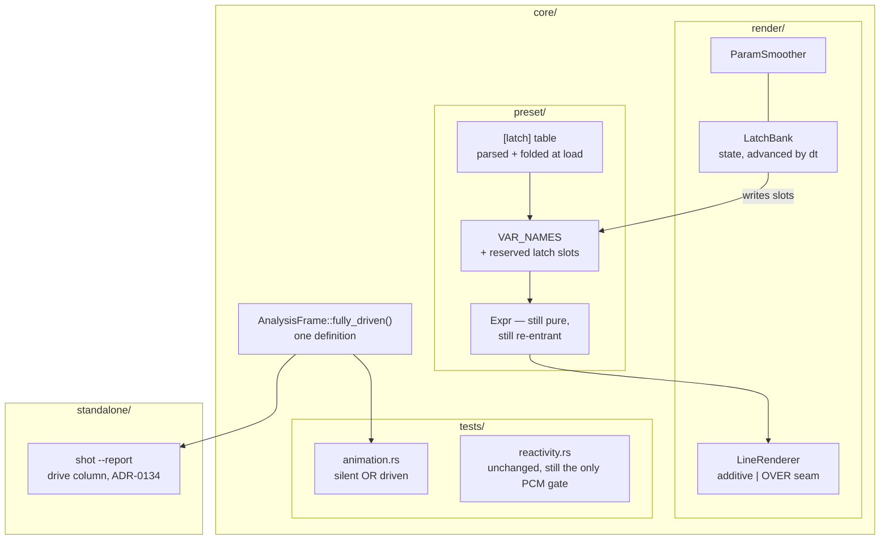

# 0123 — A gate, a latch and an ink

> **Status:** in-progress
> **Created:** 2026-08-27
> **Owner skill(s):** dev, human
> **Related ADRs:** [0136](../adrs/0136-the-animation-gate-asks-its-question-in-both-readings.md) (proposed), [0137](../adrs/0137-a-latch-is-render-layer-state-and-its-name-resolves-to-a-slot-at-load.md) (proposed), [0138](../adrs/0138-limited-ink-is-a-supported-palette-class-defined-at-the-draw-seam.md) (proposed)
> **Closes:** design-backlog 0145, design-backlog 0147, design-backlog 0148

## TL;DR

Three walls the content lane hit shipping the mono cohort, taken in one plan because the user asked
for one close. The `animation` gate learns to ask its question in both readings, so a world that
sits still on purpose and moves with the music stops having to buy motion it does not want. A
`[latch]` table gives the grammar its first armed-and-fired event without letting the evaluator hold
state. And the line family gets the opacity-preserving draw seam that already exists but nothing can
reach, under a stated limited-ink palette class. Each group ends with the content lane putting the
capability back into the preset that motivated it.

## Context & problem

Three entries came out of one `preset-author` note on 2026-08-27, all verified against the tree
before filing.

**[0145](../design-backlog.md) — the gate.** `core/tests/animation.rs` captures frames 24 and 48
against `AnalysisFrame::default()` and fails anything under `ANIM_FLOOR = 0.01`. `collage_mono` is a
poster: it sits still by design and does nearly all its moving in response to the music. It measures
`0.0025` while passing `reactivity` comfortably. What shipped is autonomous motion added for the
measurement — the `pan_x`/`pan_y` rates went `0.07`/`0.09` to `0.70`/`0.78` — and the lane measured
that the obvious levers are duds, because `drift` and `spin` multiply each element's own seeded
velocity and 0.4 s of that is nothing.

**[0147](../design-backlog.md) — the latch.** The evaluator is pure by hard invariant and
`[smoothing]` eases without holding, so there is no way to arm a gate on time and fire it on the
music. `collage_mono` wanted to recompose on the first strong onset after ninety seconds; it ships
as `mod(time + 50, 100) < 50`, one rise per hundred seconds, metronomic by construction. Second
independent instance of a gap first felt in archived 0034.

**[0148](../design-backlog.md) — the ink.** Every line and particle scene draws additively and
overlaps itself, so white over red sums to pink and a quantized palette's plateaus are gone. The
limited-ink class reaches 4 of 12 systems, by accident rather than by decision. `LineRenderer`
already carries a premultiplied-OVER pipeline built at Plan 0100 Phase 4, with one caller and no
preset-reachable selector.

## Decision

Three ADRs, one plan, nine phases in three groups. The gate becomes a disjunction over **its own
statistic** in both readings, with the branch printed so the still-in-silence set is a visible
roster (ADR-0136). A `[latch]` table holds per-frame state in the render layer beside
`ParamSmoother`, with author-chosen names resolved to reserved variable slots at load, so the
evaluator stays pure and re-entrant (ADR-0137). Limited ink becomes a supported palette class defined
at the **draw seam** rather than over the finished frame, and its first instalment is a
preset-reachable blend selector on the four line systems (ADR-0138).

We rejected lowering `ANIM_FLOOR` (ADR-0136 C — any floor admitting `0.0025` also admits ADR-0091's
`0.0072` one-pixel flicker), a `latch()` grammar function (ADR-0137 A — one expression is evaluated
N times per frame on the per-vertex and per-element paths, so per-call-site state has no correct
single answer), and a frame-level colour-counting invariant (ADR-0138 B — falsified on delivery by
bloom, tonemap, trails and `palette_contour`, and the repair is a tolerance with no mechanism behind
it).

**The packaging is the user's call and it has a stated cost.** These three groups share no files and
no risk; they are in one plan because one close, one review and one version bump were preferred to
three. The consequence is that a stall in any group holds the other two, and the close ceremony sees
one verdict where there are three independent ones. Group A is ordered first because it is the one
currently costing the content lane motion in a shipped preset.

## Architecture diagram



## Implementation phases

### Phase 1 — the gate asks both readings

- **Owner skill:** dev
- **What:** `every_preset_animates_over_time` passes a preset clearing its floor on either the
  silent reading it takes today or a silent-versus-driven one, both measured with `footprint_diff`;
  the sweep prints both values and which branch carried the pass. `loud_frame()` moves out of
  `standalone/src/shot/report.rs` into `core` as the one definition of a fully-driven
  `AnalysisFrame`, and `report.rs` reads it from there.
- **Files touched:** `core/tests/animation.rs`, `core/src/dsp/mod.rs` (or wherever `AnalysisFrame`
  lives), `standalone/src/shot/report.rs`, `docs/capturing.md`.
- **Done when:**
  - The driven floor's doc comment carries its **derivation**, in the shape `ANIM_FLOOR`'s own
    comment already uses — the shipped library's minimum on the driven statistic, read off the sweep
    this phase prints, and the stated relation between that minimum and the floor. A number chosen so
    that `collage_mono` passes does not satisfy this criterion; the derivation is the deliverable and
    the number falls out of it.
  - The static control from
    `the_footprint_statistic_separates_the_rejected_draft_from_the_static_control` **still fails, on
    both branches** — it does not move in silence and it does not move under full drive, which is
    what frozen has always meant here. If it turns out to move under drive, that is a finding about
    the control and goes in the log rather than being tuned away.
  - `collage_mono` with its `pan_x`/`pan_y` rates restored to `0.07`/`0.09` passes on the driven
    branch. (The preset is not edited in this phase — measure it with the rates overridden, so the
    gate is shown to work before anything depends on it.)
  - `reactivity.rs` is unchanged, and `docs/capturing.md`'s table still names it as the only gate
    that drives PCM through the real analyzer.

### Phase 2 — `collage_mono`'s sway comes back down

- **Owner skill:** human
- **What:** a `preset-author` session returning `collage_mono`'s `pan_x`/`pan_y` rates to what the
  composition wanted, now that the gate can see the preset is alive, and rewriting the header
  comment that currently explains the workaround.
- **Files touched:** `presets/collage_mono.toml`.
- **Done when:** the preset passes the full behavioral suite with rates chosen for the picture rather
  than for the measurement, and its header no longer describes a gate it is paying. The
  `(backlog 0145)` citation is replaced by whatever the header needs to say about the look, or
  removed.

### Phase 3 — `[latch]` parses, validates and resolves to a slot

- **Owner skill:** dev
- **What:** the `[latch]` table in the preset schema — `arm`, `fire`, `hold` per named latch,
  compiled like any other expression, validated at load, and the name bound to one of a fixed
  reserved block of `VAR_NAMES` slots. No runtime behavior yet; a latch reads as its rest value.
- **Files touched:** `core/src/preset/schema.rs`, `core/src/preset/expr.rs`, `core/src/preset/`
  tests.
- **Done when:**
  - The reserved block sits **before** `index`, whose slot is derived as `VAR_COUNT - 1` and stays
    last, and the existing name-to-slot assertions are extended to cover the new block — so
    reordering `VAR_NAMES` fails a test rather than silently re-pointing `RAW_SLOT_BASE` or
    `CLOCK_SLOT_BASE`. This project has shipped a positional-offset defect of exactly this shape
    before; the assertions are what stand in its way.
  - A preset declaring more latches than the block holds fails to load with an error naming the cap,
    and the cap's constant carries the reason it is that number — a chosen constant, stated as one,
    not presented as a measurement.
  - A `[latch]` entry whose `arm` or `fire` fails to compile is a load error at the same boundary and
    in the same shape as a bad `[params]` expression; `hold` is validated as a non-negative duration.
  - A preset with no `[latch]` table produces byte-identical captures to before this phase.

### Phase 4 — the latch bank runs

- **Owner skill:** dev
- **What:** per-preset latch state in the render layer beside `ParamSmoother` — armed/disarmed, edge
  detection on `fire`, a `hold` countdown advanced by the injected real `dt` — evaluated once per
  frame before the params that read it, and reset on preset switch alongside the smoothers.
- **Files touched:** `core/src/render/mod.rs`, `core/src/render/` tests.
- **Done when:**
  - **The behavioral property:** driven by a frame sequence containing many `fire` edges inside one
    arming window, a latch produces exactly **one** rise per window — the second and later edges
    inside the same window produce no rise, and the next rise requires `arm` to have fallen and risen
    again. A sequence with no `fire` edge inside a window produces no rise in it at all.
  - `hold` is frame-rate independent: the same latch driven by the same wall-clock duration split
    into a different number of frames holds for the same duration, within one frame. That is
    ADR-0014's rule and the reason the bank takes `dt` rather than counting frames.
  - Determinism: the same preset rendered twice over the same frame sequence and the same `dt`
    sequence produces byte-identical captures.
  - Every comment in the tree asserting that the expression layer holds no state between frames is
    corrected in this phase. `grep -rn "pure" core/src/preset/` is the starting point, not the whole
    of it.

### Phase 5 — the grammar docs learn the latch

- **Owner skill:** dev
- **What:** the operator-doc sweep for a grammar change, per Mode 4's table.
- **Files touched:** `docs/presets.md`, `presets/README.md`.
- **Done when:** `docs/presets.md` carries the `[latch]` table's shape, its three keys, the
  semantics of one rise per arming window, and the cap; `presets/README.md`'s table roster names it
  beside `[smoothing]`. Both state that a latch is the one part of the preset surface that depends on
  frame history, and that a single-frame probe reads it at rest. Count-free phrasing throughout.

### Phase 6 — `collage_mono` recomposes on the music

- **Owner skill:** human
- **What:** a `preset-author` session moving `recompose` off the wall clock onto a latch — armed on
  the window, fired on the first strong onset inside it — which is what backlog 0147 asked for.
- **Files touched:** `presets/collage_mono.toml`.
- **Done when:** the recomposition lands on a musical moment rather than on a hundred-second
  boundary, the preset passes the full suite, and the header's argument for the wall clock is
  replaced by what it now actually does.

### Phase 7 — the line family gets a seam

- **Owner skill:** dev
- **What:** a preset-reachable blend selector on the four line systems (`parametric_curve`,
  `lsystem`, `star_pattern`, `spectrum`), routing the batch through `LineRenderer`'s existing
  premultiplied-OVER pipeline instead of the additive seam.
- **Files touched:** `core/src/render/scenes/lines/renderer.rs`,
  `core/src/render/scenes/lines/{parametric,lsystem,star,spectrum}.rs`,
  `core/src/preset/schema.rs`, goldens.
- **Done when:**
  - **The behavioral property:** two overlapping strokes of two different palette inks produce, in
    the **interior** of the overlap, the colour of the later stroke — not the sum of the two. Stated
    for the interior because a stroke's edge is a coverage ramp and the property there is a blend by
    construction, which is a different claim.
  - The default is unchanged on every shipped preset: a preset that does not ask for the new seam
    produces byte-identical captures.
  - The selector's default and its name are swept into `presets/README.md` in Phase 8's doc pass.

### Phase 8 — the class is written down, and its leaks are enumerated

- **Owner skill:** dev
- **What:** ADR-0138's guarantee in `docs/preset-palettes.md`, with the complete enumeration of
  stages that introduce intermediate values and, for each, the parameter that disables it.
- **Files touched:** `docs/preset-palettes.md`, `presets/README.md`.
- **Done when:** a reader can take a shipped preset with a fully quantized palette, follow the
  enumerated list, and arrive at a frame whose colours are the palette's. The list is complete rather
  than representative — bloom, the tonemap, trails, kaleidoscope resampling and `palette_contour` are
  each named with their off switch, and any stage found during the sweep that is not on this list is
  added rather than omitted. The doc states plainly that the guarantee is at the draw seam and not
  over the finished frame, and that particles and compute are outside the class.

### Phase 9 — a mono line world

- **Owner skill:** human
- **What:** a `preset-author` session authoring the look that motivated backlog 0148 — a Maurer rose
  in black, white and red on the new seam.
- **Files touched:** `presets/` (one new preset).
- **Done when:** the preset ships, passes the behavioral suite, and reads as a limited-ink print
  rather than as luminous line work. If the seam turns out not to be enough — if something else in
  the chain destroys the plateaus — that is a finding for the log and a new backlog entry, not a
  reason to tune the palette until it looks acceptable.

## Data shapes

```toml
# illustrative — the [latch] table as ADR-0137 decides it
[latch]
recut = { arm = "mod(time, 100) > 90", fire = "onset > 0.6", hold = 0.5 }

[params]
recompose = "recut"
```

```rust
// illustrative — not the final interface
/// Per-preset latch state, held beside `ParamSmoother` in the render layer and
/// advanced by the injected real `dt`. The evaluator never sees this type.
struct LatchBank {
    armed: [bool; LATCH_CAP],
    /// Remaining hold, in seconds. Zero means the latch reads 0.0.
    hold_left: [f32; LATCH_CAP],
    /// Previous frame's `fire` truth, for edge detection.
    fired_last: [bool; LATCH_CAP],
}
```

## Risks & open questions

- **Adding to `VAR_NAMES` moves positional constants.** `INDEX_SLOT` is `VAR_COUNT - 1`;
  `RAW_SLOT_BASE` and `CLOCK_SLOT_BASE` are literals with name assertions behind them. Phase 3 puts
  the reserved block before `index` and extends those assertions. The failure mode if it does not is
  silent — a binding reads the wrong variable and the picture is merely different — and this repo has
  shipped that shape before with vertex attribute offsets.
- **WARP aliases identical bind-group layouts.** `LineRenderer`'s OVER pipeline shares the additive
  one's bind layout, and this project has recorded a DX12 software-adapter defect where a pass whose
  layout matches a live pipeline's picks up that pipeline's uniform — correct on hardware, garbage in
  the goldens. Phase 7 turns that pipeline on for four more scenes. **Compare adapters before
  blessing any golden this phase moves**, or the suite blesses the wrong picture.
- **`LMV_BLESS` rewrites every baseline, not the failing one.** Phases 7 and 9 move goldens; restore
  the unrelated baselines before committing.
- **The driven floor may not separate cleanly.** Phase 1 assumes the shipped library's distribution
  on the driven statistic has a gap the way the silent one does. If it does not — if some shipped
  preset reads near the derived floor on both branches — that is a finding about the library, and the
  phase reports the distribution rather than picking a number that hides it.
- **A latch is invisible to any single-frame probe.** `--report`'s reachability walk drives a frame
  sequence and will see one; anything evaluating one frame in isolation reads a latch at rest and
  cannot distinguish an unfirable latch from a quiet one. Phase 5 states this; nothing in this plan
  fixes it.
- **The packaging risk, restated because it is real.** Nine phases across three unrelated subsystems
  close together. Group A (1–2) is independently valuable and should land first for that reason.
- **Open question, left open on purpose:** whether the limited-ink class should eventually be
  enforced by a gate. ADR-0138 says why not now; nothing in this plan forecloses it.

## What this plan does NOT do

- **It does not touch [backlog 0146](../design-backlog.md)** — `warp_mesh` colouring its light at
  deposit time, so the palette cannot band the accumulated field. That entry stays captured with its
  probes. It is a second colour path on a scene that already has one, which is its own design
  question and is not folded in here.
- **It does not extend the ink class to particles or compute.** ADR-0138 names them as outside;
  nothing equivalent to the OVER pipeline exists in that renderer.
- **It does not repair `palette_contour`** ([backlog 0140](../design-backlog.md)). ADR-0138 gives that
  entry a contract to be repaired against and Phase 8 names the contour as an enumerated leak; the
  fix itself is untouched.
- **It adds no gate for the ink class**, and no colour-counting statistic.
- **It does not generalize the latch** into per-object or per-element state (archived backlog 0034's
  other half). One state per latch per preset, not one per element.
- **It does not change `reactivity.rs`**, `ANIM_FLOOR`, ADR-0134's `--report` columns, or the C ABI.

## Implementation log

> Written by `dev` — one row per phase as that phase's commit lands, and the close block after the
> last one. **The phases above are the contract; everything here is what happened.**

**Lane:** branch `plan-0123-a-gate-a-latch-and-an-ink`, worktree `../lmv-plan-0123`.

| phase | owner | state | commit |
|---|---|---|---|
| 1 — the gate asks both readings | dev | done | `c96f0fa` |
| 2 — `collage_mono`'s sway comes back down | human | done | `77dadd9` |
| 3 — `[latch]` parses and resolves to a slot | dev | done | `ba9c042` |
| 4 — the latch bank runs | dev | done | `696fca9` |
| 5 — the grammar docs learn the latch | dev | done | `96d88b9` |
| 6 — `collage_mono` recomposes on the music | human | not started | |
| 7 — the line family gets a seam | dev | done | `e745c45` |
| 8 — the class is written down | dev | done | `a9a16b9` |
| 9 — a mono line world | human | not started | |

### Notes

**Derivations and measurements**

- **`DRIVEN_FLOOR = 0.017`** (Phase 1). Shipped-library minimum on the driven
  statistic is **0.0345** (`Valentine`), median 0.19, maximum 0.71 — 53 presets,
  2026-08-27, DX12 software adapter, backdrops suppressed. Half the minimum,
  rounded down; slack 2.03x against `ANIM_FLOOR`'s 2.05x. The noise ceiling is
  literally the same one (same statistic, same mask floor), so ADR-0091's
  `1/139 = 0.0072` sits under it with 2.4x margin.
- **The driven branch carries nothing yet** (Phase 1). All 53 shipped presets
  pass on the *silent* branch, so the printed roster is empty and the gate is no
  weaker than it was. The branch is exercised by
  `the_driven_branch_carries_the_world_that_is_still_by_design`, which rewrites
  `collage_mono`'s two rate lines out of the shipped file: at `0.07`/`0.09` it
  reads silent **0.0025** / driven **0.0621**. Phase 2 makes the roster non-empty.
- **The driven roster is non-empty, with exactly one entry** (Phase 2). At the
  shipped rates `0.07`/`0.09` the sweep reads `Collage Mono` silent **0.0025** /
  driven **0.0621** — 3.65x over `DRIVEN_FLOOR` — and prints
  `still in silence, live on the music (1 of them): ["Collage Mono"]`. Those are
  the probe's own numbers to four places, which is what its doc comment said
  would happen: it rewrites the two rate lines to the values the file now
  carries, so it has stopped measuring a hypothetical preset and measures the
  shipped one.
- **`collage_mono` measured with every enumerated mixer off** (Phase 8), 1280x720:
  three flat regions, `#000000` exact over 86 007 px, and **none of the three
  carrying the palette's literal RGB** (`#ffffff` → `#e7e7e7`, `#b00808` →
  `#d63131`).

**Findings**

- **`ANIM_FLOOR`'s recorded derivation is stale** (Phase 1). Its comment names the
  shipped silent minimum as `0.0205` (`Banded Mandala`); the sweep now reads
  **0.0143** — `Collage Mono`, whose sway was raised for this measurement — so its
  stated 2.05x slack is really 1.43x. The plan forbids touching it, and Phase 2
  restored the premise: with the rates down the silent minimum reads `0.0201`
  (`On White`), so the recorded 2.05x is now 2.01x — accurate to within the
  rounding, but against a different preset than the comment names. Left for the
  close to decide whether to re-derive.
- **Four intermediate-value stages ADR-0138 does not name** (Phase 8), added per
  the phase's instruction: the **backdrop composite**, the **A/B palette
  crossfade**, the **duotone ink pass**, an **`over` layer join** (all four
  `LayerBlend` variants are mixers; the off switch is `join = "under"`), and the
  **internal post grid**, whose linear resample mixes neighbours whenever any
  stage is active.
- **One leak has no off switch**: the tonemap's static display dither (ADR-0096),
  ±1 encoded level before the 8-bit store. Its amplitude falls to zero at the
  rails, which the `collage_mono` measurement confirms.
- **One leak is about the preset's numbers**: the palette bakes into a 256-entry
  LUT sampled **linearly**, so a stop pair written to jump (`0.1249`/`0.1251`) is
  narrower than a texel and the whole transition sits inside it. The fix is to
  sample at plateau centres; there is no switch.
- **The WARP hazard did not fire** (Phase 7). The shared line renderer now builds
  the OVER pipelines unconditionally — the arrangement `renderer.rs`'s
  `over_pipeline` doc records as having moved five composite baselines. `golden`
  and `composite` are byte-identical and nothing was blessed.
- **A pre-existing defect, left alone** (Phase 3). `core/src/preset/schema.rs:756`
  and its `[layer]` twin build a warning string whose line continuation was lost
  (`...(x/y/rad/ang), which                      reads 0...`). On `main` since
  `4bd33fd`; cosmetic, and outside the phase.

**Unmet done-whens and deviations**

- **Phase 8's done-when is not achievable as worded.** It asks that following the
  list yields "a frame whose colours are the palette's"; the measurement above
  shows three *plateaus* whose values are all remapped. The page states the
  achievable claim, with the measurement under it.
- **Phase 1 costs one extra capture, not ADR-0136's two.** The driven differential
  is anchored at `FRAME_B` and shares that frame's silent capture, which also
  keeps both readings at the same point on the scene's clock.
- **Phase 3 added three invariants the plan does not name**, each with an
  assertion: a latch expression compiles with no latch name in scope (so a latch
  cannot read a latch, and "every latch, then the params" is a complete order); a
  latch name colliding with a variable, constant or function is a load error
  (latch names resolve last, so `recut = bass` would silently be the band); and
  the reserved `_latchN` placeholders are held out of the identifier lookup.
- **Phase 4 touched `core/src/preset/expr.rs` and `core/src/preset/mod.rs`**,
  which it does not list. `Variables::with_latches` is the write end of the
  reserved block and has nowhere else to live; the two module headers are the
  comment sweep the phase's own done-when requires. That sweep's result: three
  comments claimed the expression *layer* holds no state between frames, and are
  corrected. Every remaining `pure` in `core/src/preset/` is a claim about the
  *evaluator*, still true and deliberately left standing.
- **Phase 7 added `arc_over_pipeline`**, inside the file it lists. `star_pattern`
  is one of the four systems and its motifs are arcs from a second pipeline, so
  routing only the segments would have given that scene opaque strokes and
  additive circles in one picture.
- **Phase 7 did not touch `core/src/preset/schema.rs`**, which it lists.
  `SystemKind::param_names()` already delegates to each scene's `PARAMS`, so
  declaring `stroke_blend` in the four scenes is the whole of making it reachable.
- **Phase 7 landed one line of Phase 8's doc pass.**
  `every_declared_param_is_documented_in_the_presets_readme` fails the moment a
  `PARAMS` entry has no README mention, so `stroke_blend`'s roster rows and its
  entry are in Phase 7's commit; the class prose is in Phase 8's.

### Close triggers

- **`presets/` touched:** one `.toml` edited — `collage_mono.toml`, in Phase 2.
  No preset added or retired yet; Phase 9 is what would add one. `presets/README.md`
  in Phases 7 and 8.
- **Plan header `Closes:`** design-backlog 0145, 0147, 0148. **0145 is complete —
  both halves.** For the other two the **engine half** shipped and the content
  half is an outstanding `human` phase (0147 → Phase 6, 0148 → Phase 9).
- **What shipped:** feature. A `[latch]` grammar table with render-layer state, a
  preset-reachable `stroke_blend` on the four line systems, a disjunctive
  `animation` gate with a second derived floor, and `AnalysisFrame::fully_driven`
  in `core`. No C ABI change, no new scene, no new dependency.
- **Operator docs touched:** `docs/capturing.md`, `docs/presets.md`,
  `docs/preset-palettes.md`, `presets/README.md`.
- **Backlog probes (`node scripts/check-backlog-claims.mjs`): exits 1, one
  broken.** `docs/design-backlog.md:3389` — 0145's probe asserts
  `present: let audio = AnalysisFrame::default\(\); in: core/tests/animation.rs`,
  and Phase 1 renamed that binding to `silent_audio`. The entry is one this plan
  `Closes:`, so the probe is describing code the plan changed on purpose. **The
  tree's tip is red on this gate and `pre-push` runs it.** Nothing here edited
  `docs/design-backlog.md` — the backlog is architect's lane.
- **Outstanding `human` phases:** 6 (`collage_mono` recomposes on a latch) and 9
  (a mono line world on the new seam). Both are `preset-author` sessions and
  neither blocks the other. Phase 2 landed as `77dadd9`.

## Followups (after this lands)

- Backlog 0146 (`warp_mesh` field-level palette) is unaffected and stays live.
- Backlog 0140 (`palette_contour` has no ink of its own) gains a contract from ADR-0138 and should be
  re-read against it at this plan's close.
- Whether the limited-ink class extends to the particle renderer.
