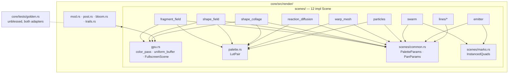

# 0125 — The scenes share their GPU boilerplate

> **Status:** in-progress
> **Created:** 2026-08-28
> **Owner skill(s):** dev
> **Related ADRs:** [ADR-0002](../adrs/0002-layered-preset-architecture.md) (the `Scene` trait stays thin — these helpers sit beside it, not on it), [ADR-0058](../adrs/0058-bind-group-layout-collisions-carry-evidence.md) (**two layouts that can be live in one frame may not share a shape without allowlist evidence — the constraint every helper here is designed around**, see Decision and Risks), [ADR-0037](../adrs/0037-internal-grid-is-a-resolution-not-a-shape.md)

**Drafted without an interview at the user's request.** The guesses: (1) the golden suite is the
acceptance oracle for every phase — a helper that changes one pixel is a wrong helper, so no
bless is permitted anywhere in this plan; (2) helpers are `pub(crate)` in `render::gpu` /
`render::palette` and are **not** added to the `Scene` trait, because ADR-0002 keeps that trait to
the preset engine's vocabulary; (3) the plan runs in a worktree after [0124](done/0124-the-review-fixes-that-move-no-pixels.md)
and before [0126](0126-the-large-files-split-along-their-seams.md), because 0126 splits the very
files this plan shrinks and a split of duplicated code is duplicated splitting.

## TL;DR

Twelve scenes implement `Scene`, and the 2026-08-28 review measured ~800–1000 lines of
copy-pasted wgpu plumbing among them: the palette LUT pair hand-rolled six times, the
load-preserving `RenderPassDescriptor` pasted 33 times, three fullscreen SDF scenes sharing a
byte-identical constructor bar one binding, `swarm`/`emitter` twins at the GPU layer, and the
`palette_mix / steps / contour / saturation / pan / hue / brightness` param block re-implemented
in every `set_param` with its defaults declared per file. This plan introduces five small shared
helpers and migrates the scenes onto them **one helper per phase, golden-identical at every
commit**. The visible behaviour of every preset is unchanged; what changes is that the next wgpu
field bump is one edit and the next scene starts ~150 lines shorter.

## Context & problem

`core/src/render/gpu.rs` already holds `texture()` / `sampler()` / `uniform()` layout entries
and `fullscreen_pipeline()`; `palette.rs` already holds `lut_texture()` / `lut_sampler()` /
`write_lut()`. The scenes under-use them: `shape_field.rs:456-467` and
`shape_collage.rs:937-948` hand-write the uniform entry `gpu::uniform()` provides, and every
scene that owns a palette carries the same `lut_texture_a/b + palette + palette_dirty` fields, the
same two-texture-two-view-one-sampler constructor and the same five-line `if palette_dirty`
flush (`fragment_field.rs:337-378,542-546`, `shape_field.rs:440-482,722-726`,
`shape_collage.rs:922-990,1501-1505`, `reaction_diffusion.rs:593-607,1028-1032`,
`warp_mesh/mod.rs:1389-1403,1985-1989`, `particles/resources.rs:439-456` + `encode.rs:117-121`).

The cost is not the lines. It is that the shared **semantics** drift per scene: `palette_mix`
clamps differently in two scenes, `brightness` exists in eight of twelve, and a wgpu bump that
adds one field to `RenderPassColorAttachment` (as `depth_slice` and `multiview_mask` already did)
is a 33-site edit that the compiler enforces but nobody reads.

The review's cross-scene findings, with the sites:

| Duplicate | Sites | Helper |
|---|---|---|
| Load-preserving colour `RenderPassDescriptor` | 13 in `scenes/`, 20 in `render/` | `gpu::color_pass(encoder, label, view, load)` |
| Palette LUT pair + dirty flush | 6 scenes | `palette::LutPair` |
| Common param block + per-file `DEFAULT_PALETTE_*` | 12 `set_param` matches, 3 consts × 12 files | `scenes::common::{PaletteParams, PanParams}` |
| Fullscreen SDF scene skeleton | `fragment_field`, `shape_field`, `shape_collage` | `gpu::FullscreenScene` |
| `swarm`/`emitter` instance quad twins | `swarm.rs:268-292,432-511,965-987`, `emitter.rs:303-327,921-1019,1296-1319` | `scenes::marks::InstancedQuads` |
| Uniform `BufferDescriptor` | 7 scenes; `particles/resources.rs:710` has a private one | promote `uniform_buffer` to `gpu` |

## Decision

Five helpers, introduced smallest-blast-radius first, each migrated across every consumer in its
own phase, each phase gated on the golden suite passing **unblessed** on both the software and
the hardware adapter **and on `no_two_layouts_share_a_shape_without_recorded_evidence`
(`core/src/render/tonemap/tests.rs:1243`) passing with its allowlist unchanged**. That second gate
is the design constraint: ADR-0058 forbids two layouts that can be live in one frame (layered
presets and A/B crossfades put two scenes in one frame routinely) from sharing a shape without
per-pair evidence, and a shared helper is precisely a machine for producing identical shapes.
So every helper here takes the layout **shape as an input** — bindings, visibility,
`min_binding_size` — and never decides it; a helper is allowed to remove the *code* that spells a
layout, never the *distinctness* of one. Helpers live in `render::gpu`, `render::palette` and a
new `render::scenes::common` — never on the `Scene` trait (ADR-0002) and never as a base-struct
inheritance pattern. We rejected a `SceneBase` struct every scene embeds (it would push
scene-specific state through a shared type and is the "god struct" the review is trying to
retire); we rejected a proc-macro for the param block (a dependency for a 40-line table, against
NFR 4); and we rejected doing this inside 0126 (see the guess above — a split first would
duplicate the duplication across more files).

## Architecture diagram



## Implementation phases

### Phase 1 — `gpu::color_pass` and `gpu::uniform_buffer`
- **Owner skill:** dev
- **What:** Add `gpu::color_pass(encoder, label, view, load: wgpu::LoadOp<Color>) -> RenderPass`
  producing the exact descriptor the 33 sites spell (one colour attachment, `store: Store`, no
  depth, `depth_slice: None`, `multiview_mask: None`); promote `particles/resources.rs:710
  uniform_buffer` to `gpu::uniform_buffer(device, label, size)`. Migrate every site that matches
  byte-for-byte; leave any that differs (a depth attachment, a second colour target) and list it.
- **Files touched:** `core/src/render/gpu.rs`, all `scenes/*` and `render/{mod,post,bloom,trails,
  kaleidoscope,transition,background}.rs` sites.
- **Done when:** `grep -rn "RenderPassDescriptor" core/src/render | grep -v gpu.rs` returns only
  the sites `dev` listed as structurally different, each with a one-line reason in the log;
  golden suite passes unblessed on both adapters; clippy green.

### Phase 2 — `palette::LutPair`
- **Owner skill:** dev
- **What:** A struct owning the A/B LUT textures, their views, the sampler and the dirty flag,
  with `new(device, label)`, `set(&mut self, palette)`, `flush(&mut self, queue)` and
  `bind_entries(&self, base_binding) -> [BindGroupEntry; 3]`. Migrate the six owners. The
  crossfade semantics (`docs/preset-palettes.md` A/B) are moved, not re-implemented — `dev`
  diffs the flush body against each original.
- **Files touched:** `core/src/render/palette.rs`, `fragment_field.rs`, `shape_field.rs`,
  `shape_collage.rs`, `reaction_diffusion.rs`, `warp_mesh/mod.rs`, `particles/{resources,encode}.rs`.
- **Done when:** no scene declares a field named `lut_texture_a` or `palette_dirty`; the
  `distinctness` and `golden` suites pass unblessed; a new unit test in `palette.rs` asserts
  `flush` uploads exactly once per `set` (dirty is cleared) and zero times otherwise.

### Phase 3 — `scenes::common::{PaletteParams, PanParams}`
- **Owner skill:** dev
- **What:** Two plain structs holding the shared raw params (`palette_mix, palette_steps,
  palette_contour, saturation, hue, brightness` / `pan_x, pan_y`) with `set(name, value) -> bool`,
  `reset()`, and the single `DEFAULT_*` consts they replace; each scene's `set_param` delegates
  first and handles its own names on `false`. Where two scenes currently clamp the same name
  differently, the **shipped default preset's value range** decides and the log states which
  scene moved — that is the only place this plan may change a number, and it is per-name, cited.
- **Files touched:** `core/src/render/scenes/common.rs` (new), all 12 scenes,
  `core/src/render/scenes/mod.rs`.
- **Done when:** `grep -rn "DEFAULT_PALETTE_MIX" core/src/render/scenes` returns one site;
  `presets/README.md`'s per-system parameter roster is unchanged in **which** names each system
  accepts (`shot --presets presets --report` prints the same unknown-param warnings before and
  after — zero); golden passes unblessed; any clamp that moved is named in the log with the two
  values.

### Phase 4 — `gpu::FullscreenScene`
- **Owner skill:** dev
- **What:** The constructor/render skeleton the three SDF scenes share — uniform buffer, LUT
  pair, one optional storage binding, `fullscreen_pipeline`, the render tail — as a struct the
  scene embeds. `fragment_field`, `shape_field` and `shape_collage` keep their own uniform
  packing and their own storage contents; what they stop owning is the wgpu graph.
- **Files touched:** `core/src/render/gpu.rs`, the three scenes.
- **Done when:** the three constructors are each under 60 lines; golden and `distinctness` pass
  unblessed; `no_two_layouts_share_a_shape_without_recorded_evidence` passes **with no new
  allowlist row** — if the three scenes' layouts already differ (one storage binding, a
  `min_binding_size`), the helper must preserve exactly that difference, and if adopting it would
  make two of them identical the helper takes a distinguishing parameter rather than the allowlist
  taking a row; the WARP-aliasing check from `docs/capturing.md` (compare adapters before trusting
  a golden) is run and both adapters agree.

### Phase 5 — `marks::InstancedQuads`
- **Owner skill:** dev
- **What:** The instance buffer + `Misc{v,m,s}` uniform + instanced-quad pipeline + draw tail
  that `swarm` and `emitter` each build, as one type parameterised by label, visibility and
  `min_binding_size`. The two scenes keep their simulation; they share the draw.
- **Files touched:** `core/src/render/scenes/marks.rs`, `swarm.rs`, `emitter.rs`.
- **Done when:** `swarm.rs` and `emitter.rs` no longer declare an `Instance` struct each; golden,
  `animation` and `reactivity` pass unblessed for every `swarm_*` and `emitter_*` preset.

## Data shapes

```rust
// illustrative — core/src/render/gpu.rs
pub(crate) fn color_pass<'a>(
    encoder: &'a mut wgpu::CommandEncoder,
    label: &str,
    view: &'a wgpu::TextureView,
    load: wgpu::LoadOp<wgpu::Color>,
) -> wgpu::RenderPass<'a>;

// illustrative — core/src/render/palette.rs
pub(crate) struct LutPair { a: Texture, b: Texture, views: [TextureView; 2], sampler: Sampler, dirty: bool }

// illustrative — core/src/render/scenes/common.rs
pub(crate) struct PaletteParams { pub mix: f32, pub steps: f32, pub contour: f32, pub saturation: f32, pub hue: f32, pub brightness: f32 }
impl PaletteParams { pub fn set(&mut self, name: &str, v: f32) -> bool; pub fn reset(&mut self); }
```

## Risks & open questions

- **ADR-0058 is the hazard this plan walks toward on purpose.** Four `warp_mesh` layouts carry a
  note explaining what makes their shape distinct from every other three-entry group in the crate
  (`:1304,1396,1452,1522` — visibility, `min_binding_size`). A helper that "simplifies" those into
  the common shape re-creates the WARP aliasing ADR-0058 records. Phases 1 and 2 touch
  *descriptors* and *resources*, not layouts; Phases 4 and 5 build layouts and must reproduce each
  scene's shape exactly. `dev` runs `no_two_layouts_share_a_shape_without_recorded_evidence`
  after every phase and must not add an allowlist row — a needed row means the helper is wrong.
- **WARP aliasing** (`docs/capturing.md`; memory: a new pass whose layout matches a live
  pipeline's gets that pass's uniform on WARP). Shared helpers make identical layouts *more*
  likely. Every phase's done-when therefore runs golden on both adapters; a green software run
  alone is not acceptance.
- **Phase 3 is the only phase allowed to move a number**, and only where two scenes already
  disagree. If `dev` finds more than three such disagreements, stop and report — that is a
  content-lane question (which clamp the presets were authored against), not a refactor.
- **`fragment_field` + lit backdrop is WARP-broken on `main`** (memory). Phase 4 must establish the
  pre-phase baseline on both adapters before calling a divergence its own.
- **Golden-identical is the oracle, and it is a 20-scene suite on two adapters per phase** — expect
  ~15 min per gate locally. That is the price of a refactor with no design surface; do not trim it.

## What this plan does NOT do

- Does not split any file — [0126](0126-the-large-files-split-along-their-seams.md).
- Does not touch the `Scene` trait, the C ABI, or `standalone/`.
- Does not add a shared uniform header (the per-scene `[f32; 4]` lane packing is deliberate for
  WGSL alignment and the review flagged it as a choice, not a paste).
- Does not re-tune any preset. A preset that looked different after a phase means the phase is
  wrong.

## Implementation log

> Written by `dev` — one row per phase as that phase's commit lands, and the close block after the
> last one. **The phases above are the contract; everything here is what happened.**
> **Observations, never conclusions:** this says where to look, architect decides how it went.
> No per-criterion pass list, no self-assessment, no narrative — but a deviation from the plan or
> an unmet done-when is always disclosed. Stays shorter than `## Implementation phases` above.

**Lane:** `WORK/lmv-plan-0125` on `plan-0125-the-scenes-share-their-gpu-boilerplate`

| phase | owner | state | commit |
|---|---|---|---|
| 1 — `gpu::color_pass` and `gpu::uniform_buffer` | dev | done | 8d2d590 |
| 2 — `palette::LutPair` | dev | committed with this row | |
| 3 — `scenes::common::{PaletteParams, PanParams}` | dev | not started | |
| 4 — `gpu::FullscreenScene` | dev | not started | |
| 5 — `marks::InstancedQuads` | dev | not started | |

### Notes

**Phase 1.** The plan counts 33 `RenderPassDescriptor` sites; there were **40**
(35 in shipped source, 5 in `#[cfg(test)]` modules under `render/`). All 40 matched the
canonical shape byte-for-byte, so all 40 migrated and the "list what differs" half of the
done-when has an empty list. The `grep` now returns only `gpu.rs`.

`gpu::uniform_buffer` took **25** `UNIFORM | COPY_DST` sites. One buffer was left: the blur-step
uniform at `core/src/render/scenes/warp_mesh/shader.rs` is a `create_buffer_init` with
`UNIFORM` alone — no `COPY_DST`, contents written once at creation — so it is a different
descriptor, not the same one spelled again. `bloom::small_uniform` was kept as a
one-line wrapper (it supplies the `V4` size to its four call sites) rather than deleted.

Comments that sat inside the descriptor's `ops` block were hoisted above the call and
re-wrapped; none was dropped.

**Phase 2.** There are **seven** owners of the LUT pair, not six: `render/background.rs` carries
`lut_texture_a`/`palette_dirty` too. It is not in this phase's *Files touched* and it is a
composite stage rather than a scene, so it was left alone and the done-when grep is clean as
written — but its flush is `if fresh || self.palette_dirty`, a third condition `LutPair` does not
model, so adopting it there is a decision rather than a sweep.

**The six split into two shapes, and `LutPair` went where the textures already were** so that no
allocation moved (a WARP hazard in its own right). `fragment_field`, `shape_field` and
`shape_collage` own theirs directly, and lost `palette` and `palette_dirty` outright.
`reaction_diffusion`, `warp_mesh` and the attractor keep the textures inside a lazily-built
`Resources`, so the pair went there and **the scene still holds a `Palette`** — `set_palette` can
arrive while `res` is `None`, and that field is what seeds the pair when it is finally built. Those
three now carry two copies of a 6 KB `Palette` while resources exist. `palette_dirty` is gone from
all six.

`bind_entries` takes **all three binding numbers** rather than the plan's single `base_binding`:
the six bind this triple at (0,1,2), (1,2,3), (3,4,5) and — for the two `shape_*` scenes — with
the sampler at 0 ahead of the textures. A `base_binding` would have decided part of the layout
shape, which the plan's own Decision forbids.

`flush` returns `bool` (did it upload). That is what the new
`the_lut_pair_uploads_once_per_set_and_never_otherwise` test in `palette.rs` reads; the six scenes
ignore it. The suite is 860 tests where Phase 1 ran 859.

`reaction_diffusion::present_bind_group` lost its `#[allow(clippy::too_many_arguments)]` — three
LUT arguments collapsed into one.

**A constraint Phases 4 and 5 inherit, found while reading the Phase-1 gate.**
`no_two_layouts_share_a_shape_without_recorded_evidence` reads layouts by **scanning
`core/src` source text** for `create_bind_group_layout` with a literal label and literal
entries, and `assert_scan_is_whole` holds the count at or above 25. A helper that builds a
bind-group layout from parameters is invisible to that scan and would both shrink the
enumeration and blind the collision check. So `FullscreenScene` and `InstancedQuads` must take
a layout the scene still spells literally, never build one.

### Close triggers

- **`presets/` touched:**
- **Plan header `Closes:`** none
- **What shipped:**
- **Operator docs touched:**
- **Backlog probes (`node scripts/check-backlog-claims.mjs`):**
- **Outstanding `human` phases:**

## Followups (after this lands)
