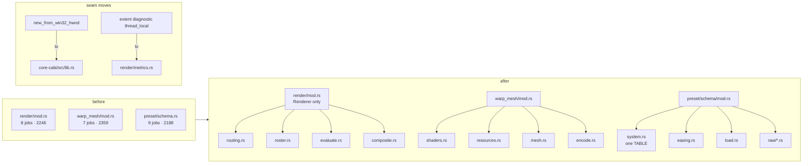

# 0126 — The large files split along their seams

> **Status:** approved
> **Created:** 2026-08-28
> **Owner skill(s):** dev
> **Related ADRs:** [ADR-0002](../adrs/0002-layered-preset-architecture.md) (the `Scene` seam stays where it is), [ADR-0072](../adrs/0072-the-c-abi-ships-from-its-own-crate.md) (where the Win32 constructor moves to), [ADR-0037](../adrs/0037-internal-grid-is-a-resolution-not-a-shape.md), [ADR-0127](../adrs/0127-a-comment-carries-the-mechanism-and-the-decision-record-stays-in-docs.md)

**Drafted without an interview at the user's request.** The guesses: (1) a split is a *move*,
never a rewrite — every phase is gated on the golden suite unblessed and on `cargo public-api`-
style stability of `lmv_core`'s two-deep surface the shells use; (2) the `particles/` directory
(`mod.rs` + `shaders.rs` + `resources.rs` + `encode.rs` + `family.rs`) is the template every other
split copies, because it already exists and the review found it the healthiest large scene;
(3) the two seam moves (the Win32 constructor into `core-cabi`, the `shot` diagnostic
thread-local into `render::metrics`) are small enough to carry here rather than earn an ADR each —
neither reverses a recorded decision, both *enforce* one; (4) the `foo_lmv.cpp` split is in
scope but last, because `plugin-foobar/build.ps1` compiles one file and must learn a list.

## TL;DR

Seven files carry the review's structural majors: two 400-line functions in `warp_mesh/mod.rs`,
a 429-line `draw_frame` in `render/mod.rs` with a four-times-repeated closure, a `schema.rs`
holding nine responsibilities and five hand-kept parallel `SystemKind` tables, `star.rs` with a
motif roster and a ring ornament that never talk, a 28-field `AppState` in `standalone/main.rs`,
and a 189-line `wnd_proc` in `foo_lmv.cpp`. Plus one genuine OCP violation — `GeneratorConfig`
fans into four unrelated line scenes' `configure` matches — and two layering seams that leaked.
This plan splits each file along the seams the review named, one file per phase, moving code
without changing it, and closes the OCP hole and the two seams while the files are open. **Every
phase is golden-identical.** After it, adding a scene touches one table in `schema.rs` and one
factory arm instead of ~24 sites across ~12 files.

## Context & problem

The review's per-file findings, confirmed at the line:

- **`core/src/render/mod.rs`** (2246 lines, 0.89 comment:code) — 8 responsibilities:
  routing `:163-270,365-378`, `Roster` `:272-363`, `ParamSmoother` `:380-429`, per-frame
  evaluation `:431-759`, composite `:761-925`, then `Renderer` with a 429-line `draw_frame`
  `:1791-2219` where the `VertexSurface` closure appears at `:1908,:1937,:2000,:2030` and the
  outgoing/incoming side evaluation `:1907-1957` vs `:1999-2051` differs only in side and
  smoother. `evaluate_preset` takes 12 params under `#[allow(too_many_arguments)]`.
- **`core/src/render/scenes/warp_mesh/mod.rs`** (2359) — `Resources::build` `:1235-1670` (436
  lines), `Scene::render` `:1929-2352` (424); four inline WGSL programs `:394-831`; defaults in
  both `new` `:1153-1217` and `reset_params` `:1765-1797`.
- **`core/src/preset/schema.rs`** (2188) — `SystemKind` + five parallel rosters
  (`ALL :80`, `from_name :100`, `as_str :121`, `param_names :145`, `variant_roster_reminder
  :167`), `Easing` (render-time math) `:218-307`, load orchestration `:536-1015` with ~80 lines
  duplicated between `from_toml_str` and `build_layer`, twelve `Raw*` serde tables `:1133-2159`.
- **`core/src/render/scenes/lines/star.rs`** (1851) — motif roster `:649-1141` and ring ornament
  `:1143-1548` are independent; `build_rings` (208 lines) writes its `place` closure three times;
  `Scallop` is special-cased in six roster methods.
- **`standalone/src/main.rs`** (1692) — `AppState` 28 fields, 7-arg ctor; CLI `:1383-1481`,
  preset-dir seeding `:1512-1570`, HUD `:810-914` (whose own comment `:75-77` admits drift from
  `overlay.rs`), input `:921-1135`, capture bootstrap `:1137-1229` all still in the shell entry.
- **`plugin-foobar/foo_lmv.cpp`** (1076) — `wnd_proc` `:738-926` with the context menu built
  inline `:816-902`; five file-scope mutable globals (`g_session`, `g_popup_hwnd`, `g_abi_ok`,
  `g_debug_flags`, `g_cfg_preset`); `maybe_log_metrics` `:454-478` reopens its file and calls
  `CreateDirectoryW` + `GetFileAttributesW` every second.
- **`core/src/render/scenes/shape_collage.rs`** (1561) — kind dispatch by `f32` range
  (`kind < 1.5`, `< 2.5`, … `:429-476`, `:118`) mirrored separately in `sdf.rs`; a mismatch is
  a silent wrong shape rather than a compile error.
- **OCP**: `GeneratorConfig` (`scenes/mod.rs:55`) is matched inside `lines/lsystem.rs:380`,
  `parametric.rs`, `spectrum.rs` and `star.rs:1698` — a new generator variant edits four scenes
  that do not use it.
- **Two seams**: `core/src/render/mod.rs:1195 #[cfg(windows)] new_from_win32_hwnd` is the only
  platform branch in `core/`; `standalone/src/shot/report.rs:26,296` reaches
  `lmv_core::render::scenes::lines::renderer::{set_extent_diagnostic, take_draw_extent}` — a
  `thread_local!` inside a scene renderer, five modules deep.

## Decision

One phase per file, ordered so the cheapest and most template-like split goes first
(`warp_mesh`, because `particles/` shows exactly the target shape) and the shell splits go last.
Each phase is a **move**: functions keep their bodies, `pub` surface at the two-deep paths the
shells import stays byte-identical, and the golden suite passes unblessed. The only behavioural
edits are the three the review called bugs-adjacent — the `SystemKind` table consolidation, the
`GeneratorConfig` `_ => {}` arm, and the `shape_collage` `enum Kind` — each with a test that fails
on the old shape. We rejected a single big-bang reorganisation (unreviewable diff, and the
golden gate would fire once at the end where it can no longer say which move broke it); rejected
leaving `foo_lmv.cpp` alone (it is the file with the least test coverage and the most globals);
and rejected making the seam moves separate ADRs (they reverse nothing — ADR-0072 already says
`core-cabi` owns the ABI-side construction, and the diagnostic already has a home in `metrics`).

## Architecture diagram



## Implementation phases

### Phase 1 — `warp_mesh/` takes the `particles/` shape
- **Owner skill:** dev
- **What:** Split `warp_mesh/mod.rs` into `shaders.rs` (the four WGSL programs + POD uniforms),
  `resources.rs` (`Resources` build / encode_clear), `mesh.rs` (`MeshState` + grid helpers) and
  `encode.rs` (the five banner-separated stages of `render`), leaving `mod.rs` as params,
  scene struct and `impl Scene`. `Resources::build` and `render` each become a sequence of named
  stage fns under 120 lines. Defaults are declared once and `reset_params` reads them.
- **Files touched:** `core/src/render/scenes/warp_mesh/{mod,shaders,resources,mesh,encode}.rs`,
  `core/tests/hygiene.rs` only if the scan set needs the new files named (it scans `render/`
  recursively — verify, do not assume).
- **Done when:** no fn in `warp_mesh/` exceeds 150 lines (`dev` states the longest and its
  length); golden passes unblessed on both adapters for every `warp_*` and every converted
  MilkDrop preset in the suite; `hot_path_modules_carry_the_panic_pragma` passes with the new
  files carrying the pragma.

### Phase 2 — `render/mod.rs` keeps the `Renderer` and nothing else
- **Owner skill:** dev
- **What:** Move routing to `render/routing.rs`, `Roster` + `ParamSmoother` to `render/roster.rs`,
  binding evaluation to `render/evaluate.rs`, composite encoding to `render/composite.rs`, and
  the tier governor to `render/tier_governor.rs` as an `impl Renderer` continuation (precedent:
  `capture_api.rs`). Collapse `draw_frame`'s duplicated side evaluation into one `evaluate_side`
  and the four `VertexSurface` closures into one; bundle `(vars, frame, time, dt)` into one
  `FrameInputs` struct so `evaluate_preset`/`evaluate_layer` drop below the `too_many_arguments`
  threshold and lose their `#[allow]`.
- **Files touched:** `core/src/render/{mod,routing,roster,evaluate,composite,tier_governor}.rs`.
- **Done when:** `render/mod.rs` is under 1200 lines and `draw_frame` under 200; zero
  `#[allow(clippy::too_many_arguments)]` remain in `render/mod.rs`; every `pub` item the shells
  import (`Renderer`, `Tier`, `HeadlessOptions`, `RenderError`, `metrics::*`) resolves at the same
  path — `cargo build --workspace` with no shell edit is the proof; golden and `transition`
  suites pass unblessed.

### Phase 3 — `schema.rs` becomes a directory, and `SystemKind` becomes one table
- **Owner skill:** dev
- **What:** `preset/schema/{mod,system,easing,error,load}.rs` + `raw/{palette,smoothing,milk,
  particles,spectrum,generator,feedback,mesh}.rs`. In `system.rs`, one
  `const TABLE: [(SystemKind, &str, &[&str]); VARIANT_COUNT]` from which `ALL`, `from_name`,
  `as_str`, `param_names` derive; `variant_roster_reminder` is deleted (the array length is the
  reminder). Extract the ~80 duplicated lines between `from_toml_str` and `build_layer` into
  `compile_bindings` / `fold_smoothing` / `warn_vertex_use`.
- **Files touched:** `core/src/preset/schema.rs` → `core/src/preset/schema/**`, `core/src/preset/mod.rs`.
- **Done when:** a test asserts every `SystemKind` round-trips `as_str → from_name` and that
  `param_names(k)` is non-empty for all `k` — and that test is written **against `TABLE`'s
  length**, so a variant added to the enum without a row fails to compile rather than pass;
  `preset.rs`'s 56 tests pass unchanged; `presets/README.md`'s roster is unchanged.

### Phase 4 — `GeneratorConfig` stops editing scenes that do not use it
- **Owner skill:** dev
- **What:** Route `GeneratorConfig` through the `scenes::create` factory to the one scene it
  targets, so `lsystem`, `parametric`, `spectrum` and `star` each `configure` only their own
  variant and carry a `_ => {}` arm (or the factory never hands them a foreign one — `dev`
  picks whichever keeps the exhaustive-match policy at `scenes/mod.rs:581-600` intact and states
  it). Do the same audit for any other enum matched inside more than one scene.
- **Files touched:** `core/src/render/scenes/mod.rs`, `lines/{lsystem,parametric,spectrum,star}.rs`.
- **Done when:** adding a dummy `GeneratorConfig` variant on a scratch branch compiles with edits
  to **one** scene file and the factory only (`dev` performs the experiment, reverts it, and
  states the file count); golden passes unblessed.

### Phase 5 — `star.rs` splits into motif and rings; `shape_collage` gets an `enum Kind`
- **Owner skill:** dev
- **What:** `lines/star/motif.rs` (pure geometry: `Motif`, biarc chains, budgets, `ArcShape`,
  scallop) and `lines/star/rings.rs` (`RingSpec`, `RingMotion`, hysteresis, `build_rings` with
  its `place` closure hoisted to one fn); the `outline_at` arms the comment at `:806-810` says
  are test-only reference go under `#[cfg(test)]`. In `shape_collage.rs`, replace the `f32`
  range dispatch with `enum Kind` carrying `fn from_f32`/`as_f32`, used by both `Element::build`
  and the WGSL dispatch constants, so `sdf.rs` and the AABB builder cannot disagree.
- **Files touched:** `core/src/render/scenes/lines/star.rs` → `star/{mod,motif,rings}.rs`,
  `core/src/render/scenes/shape_collage.rs`, `shape_collage/sdf.rs`.
- **Done when:** `build_rings` under 100 lines; a test asserts `Kind::from_f32(k.as_f32()) == k`
  for every variant and that the WGSL constant table equals `Kind::ALL`; golden passes unblessed
  for every `star_*` and `collage_*` preset (the `star` goldens are the ones ADR-0090's drift
  memory names — bless-vs-committed control first if any moves).

### Phase 6 — The two seams go home
- **Owner skill:** dev
- **What:** Move `new_from_win32_hwnd` out of `core/src/render/mod.rs` into `core-cabi/src/lib.rs`
  (which already builds the surface-target arguments and is Windows-only by ADR-0072), exposed
  from `core` as a platform-free `Renderer::new_from_surface_target(SurfaceTargetUnsafe, …)`.
  Move `set_extent_diagnostic`/`take_draw_extent` from `lines/renderer.rs` into `render::metrics`
  as fields on the existing diagnostics facade, keyed to the `Renderer` rather than a
  `thread_local!`; `shot/report.rs` imports from `lmv_core::render::metrics`.
- **Files touched:** `core/src/render/mod.rs`, `core-cabi/src/lib.rs`, `core/src/render/metrics.rs`,
  `core/src/render/scenes/lines/renderer.rs`, `standalone/src/shot/report.rs`.
- **Done when:** `grep -rn "cfg(windows)\|cfg(target_os" core/src` returns nothing outside
  `Cargo.toml` feature gating; `grep -rn "thread_local" core/src/render/scenes` returns nothing;
  `standalone/tests/shot_cli.rs`'s report tests pass; the C ABI conformance suite in `core-cabi`
  passes and `RLX_ABI_VERSION` is unchanged (no `extern "C"` signature moved — the constructor
  was never exported).

### Phase 7 — `standalone/main.rs` becomes shell glue
- **Owner skill:** dev
- **What:** Extract `cli.rs`, `preset_dir.rs` (seeding + hot-reload), `capture_start.rs` (the three
  `cfg` arms), `hud.rs` (text composition, sharing colour/geometry consts with `overlay.rs` so
  the admitted drift at `:75-77` ends) and `input.rs`. Group `AppState`'s 28 fields into
  `Diagnostics { … }` and `Hud { … }` sub-structs; `App` already carries the options, so
  `AppState::new` takes `&App`. Retire the three copy-pasted arg scanners for one.
- **Files touched:** `standalone/src/{main,cli,preset_dir,capture_start,hud,input}.rs`,
  `standalone/src/overlay.rs`.
- **Done when:** `main.rs` under 700 lines; `AppState` under 15 direct fields; every hotkey in
  `README.md`'s Controls table still dispatches (`dev` walks the table against `input.rs` and
  states any row it could not match); `standalone/tests/*` pass; the `--help` text is
  byte-identical before and after (`diff` it).

### Phase 8 — `foo_lmv.cpp` splits and `build.ps1` learns a list
- **Owner skill:** dev
- **What:** `viz_session.cpp/.h` (`VizSession`, now owning `abi_ok` and `debug_flags`),
  `presets.cpp` (the roster over the C ABI), `host_window.cpp` (`wnd_proc` with
  `build_context_menu` / `dispatch_menu_command` extracted, class registration, pop-out),
  leaving `foo_lmv.cpp` as component metadata + service registration. `maybe_log_metrics` opens
  its file once and keeps the handle. `build.ps1` compiles a source list.
- **Files touched:** `plugin-foobar/{foo_lmv,viz_session,presets,host_window}.cpp`,
  `plugin-foobar/viz_session.h`, `plugin-foobar/build.ps1`.
- **Done when:** `build.ps1` produces a component that loads in foobar2000 and renders a preset
  (this project's on-device check, `docs/on-device-validation.md`); no function in
  `plugin-foobar/` exceeds 120 lines; the file-scope mutable globals are down to `g_session` and
  `g_popup_hwnd` (the two the Win32 callback model genuinely needs); the widened hygiene gate from
  Plan 0124 Phase 3 exits 0 on the new files.

## Data shapes

```rust
// illustrative — core/src/render/evaluate.rs (Phase 2)
pub(crate) struct FrameInputs<'a> { pub vars: &'a Variables, pub frame: &'a AnalysisFrame, pub time: f32, pub dt: f32 }

// illustrative — core/src/preset/schema/system.rs (Phase 3)
const TABLE: [(SystemKind, &str, &[&str]); VARIANT_COUNT] = [
    (SystemKind::Attractor, "attractor", particles::PARAMS),
    // …
];
```

## Risks & open questions

- **A move that is secretly a rewrite.** The golden gate catches pixel changes; it does not catch
  a `pub(crate)` that became `pub` or a doc comment that lost its invariant. `dev` diffs each
  moved fn body with `git diff --color-moved=dimmed-zebra` and reports any hunk that is not pure
  move. The review's comment-hygiene findings (measurements transcribed into `kaleidoscope.rs`,
  `expr.rs:1300-1336`, `particles/mod.rs:333-358`, `star.rs:20-37`) are **not** rewritten here —
  a split commit that also edits prose is unreviewable. They wait on the open ADR question
  0124 parks.
- **Phase 3 changes `schema.rs`, which Plan 0123 Phase 3 also touches** (`VAR_NAMES` slot
  arithmetic is in `expr.rs`, but 0123's `[latch]` table lands a new `Raw*` struct). Sequence:
  this plan starts after 0123 closes, or Phase 3 is deferred to the end of this plan. Stated in
  the execution order.
- **Phase 6's `metrics` move changes what `shot --report` reads.** The `report_reachability`
  memory says the report only walks select/clamp; this does not widen that, but the extent
  column must read the same values — `shot_cli.rs` has the assertion.
- **Phase 8 cannot be tested in CI** (no foobar2000 there). Its done-when is the on-device
  checklist, which is a `dev` run on this machine, not a `human` phase — the user need not act.
- **Phase 1 goldens on converted MilkDrop presets** — `warp_mesh` is the MilkDrop host and its
  suite includes converted fixtures; a move that reorders shader-module creation can shift WARP's
  allocation (memory: WARP allocation shifts trails). Compare adapters before concluding.

## What this plan does NOT do

- No shared GPU helper — [0125](done/0125-the-scenes-share-their-gpu-boilerplate.md), which lands first.
- No comment rewrite beyond what a move forces (a moved item keeps its doc; a deleted duplicate
  loses its copy). The comment-weight question is an ADR, parked in 0124.
- Does not touch `kaleidoscope.rs` or `expr.rs` — the review rated both splits `minor` and
  they can wait for a plan that has a reason to open them.
- Does not change the `Scene` trait, the C ABI shape, or any preset.

## Implementation log

> Written by `dev` — one row per phase as that phase's commit lands, and the close block after the
> last one. **The phases above are the contract; everything here is what happened.**
> **Observations, never conclusions:** this says where to look, architect decides how it went.
> No per-criterion pass list, no self-assessment, no narrative — but a deviation from the plan or
> an unmet done-when is always disclosed. Stays shorter than `## Implementation phases` above.

**Lane:** _(`WORK/lmv-plan-0126` on `plan-0126-the-large-files-split-along-their-seams`)_

| phase | owner | state | commit |
|---|---|---|---|
| 1 — `warp_mesh/` takes the `particles/` shape | dev | not started | |
| 2 — `render/mod.rs` keeps the `Renderer` and nothing else | dev | not started | |
| 3 — `schema.rs` becomes a directory, `SystemKind` one table | dev | not started | |
| 4 — `GeneratorConfig` stops editing scenes that do not use it | dev | not started | |
| 5 — `star.rs` splits; `shape_collage` gets an `enum Kind` | dev | not started | |
| 6 — The two seams go home | dev | not started | |
| 7 — `standalone/main.rs` becomes shell glue | dev | not started | |
| 8 — `foo_lmv.cpp` splits and `build.ps1` learns a list | dev | not started | |

### Notes

### Close triggers

- **`presets/` touched:**
- **Plan header `Closes:`** none
- **What shipped:**
- **Operator docs touched:**
- **Backlog probes (`node scripts/check-backlog-claims.mjs`):**
- **Outstanding `human` phases:**

## Followups (after this lands)
