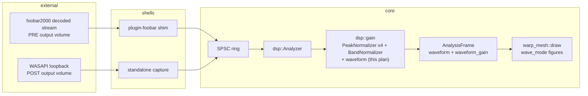

# 0127 — The picture stops depending on the volume slider

> **Status:** draft
> **Created:** 2026-08-28
> **Owner skill(s):** dev, human
> **Related ADRs:** [ADR-0139](../adrs/0139-the-waveform-is-levelled-at-the-analyzer-and-publishes-its-gain.md) (proposed — the level contract this builds), [ADR-0049](../adrs/0049-analysis-v2-dual-resolution-axis-normalized-bands.md) (the normalizer it reuses), [ADR-0037](../adrs/0037-internal-grid-is-a-resolution-not-a-shape.md) (the aspect habit Phase 2 applies one level down), [ADR-0113](../adrs/0113-milkdrop-presets-are-translated-ahead-of-time-onto-a-warp-mesh-idiom.md) (the idiom the trace draws into)
> **Closes:** design-backlog 0123, design-backlog 0122, design-backlog 0120 (conditionally — see Phase 3)

## TL;DR

The waveform is the one un-normalized analysis output, so the Windows volume slider is a visual
parameter: at 18 % *Geiss - Blur Mix 3* draws a near-flat ribbon, at 60 % it fills the frame, with
nothing else changed. Worse, the foobar plugin taps the decoded stream **before** the output volume
and the standalone taps loopback **after** it, so one core draws two different pictures from one
track. This plan levels the trace at the analyzer with the peak normalizer the bands already use and
publishes the divisor as `waveform_gain` (ADR-0139), width-normalizes the mode-6/7 trace that today
spans `1/aspect` of the frame, and spends one session on the `foo_vis_milk2` reference rig to derive
the base amplitude constant that backlog 0120 stopped on. After Phase 1 the same track looks the same
at any volume, on either frontend.

## Context & problem

Three filed entries, one subsystem, one file at the consuming end.

- **[design-backlog 0123](../design-backlog.md) — the volume slider changes the picture.** Measured
  on the development box: one `lmv.exe`, one preset (`nWaveMode = 6`, `fWaveScale = 3.266`), one clip
  looping, two captures ten seconds apart with the Windows master volume as the only variable — 18 %
  gives a thin near-flat ribbon, 60 % gives a violently active trace at roughly ±40 % of frame height
  with a halo filling the frame. The same preset through `shot --audio` on a file saturates, so the
  engine's response is not weak; the arriving level is. `core/src/dsp/mod.rs:112` documents the trace
  as deliberately un-normalized, and the reason it gives argues against *instantaneous*
  normalization, which is not what a slow running peak does. The two frontends then disagree by
  construction — `plugin-foobar/foo_lmv.cpp` pulls `visualisation_stream` (pre-volume), the
  standalone pulls loopback (post-volume) — and nothing levels them.
- **[design-backlog 0122](../design-backlog.md) — the mode-6/7 trace covers `1/aspect` of the
  width.** `draw.rs`'s arm places points at `t = i/(count-1) - 0.5` and divides x by `aspect`;
  `uv_to_world` multiplies x **by** `aspect`. The two cancel exactly, so the trace's world length is
  `2.0` whatever the target's shape while the frame is `2 * aspect` wide — 56.25 % at 16:9, which is
  the "roughly the middle 57 %" Plan 0109's look gate reported. Said plainly: the trace is normalized
  to the frame's **height**. At aspect 1 it is full width, which is why nothing caught it — ADR-0037's
  coincidence, one level down. `a_straight_wave_trace_spans_one_over_aspect_of_the_width` pins the
  defect as a property over three aspects.
- **[design-backlog 0120](../design-backlog.md) — `wave_scale` is applied raw.** `*slot = held *
  scale`, straight from `fWaveScale`, onto a trace already in `-1..1`, with no base amplitude
  constant. The corpus settles the shape of the missing piece: across the 552 presets in
  `milkdrop-original` that set `fWaveScale`, the median is **0.9724** — authored about unity — so
  what is missing is a single base amplitude, not a per-preset or per-mode correction. The entry
  **stopped once already**: Plan 0111 Phase 5 refused to derive the constant by matching a picture,
  because a number right for one preset at one wave mode is wrong for the corpus, and no MilkDrop
  source or authoring documentation exists in this environment.

The three interact, which is why they are one plan rather than three. An un-normalized trace times an
un-normalized `wave_scale` is **hypersensitive** — blown out at full scale, dead at listening volume
— so 0120's constant cannot be derived while 0123 is live: the reading would depend on the volume it
was taken at. And 0122's extent question and 0120's amplitude question have the same missing source
and are answered by the same capture.

## Decision

We level the trace at the analyzer and publish the gain we removed (ADR-0139, Alternative A
rejected because an input AGC moves the raw magnitudes the tempo tracker, onset detector and novelty
detector are tuned against and defeats the silence floor; Alternative B rejected because conditioning
only `warp_mesh` leaves the contract unstated and the two frontends disagreeing for the next
consumer). Then we fix the extent, then we spend one human session on the reference rig to buy the
amplitude constant — in that order, because each step makes the next one measurable. The base
amplitude is a **derived measurement or nothing**: if the capture cannot produce one, Phase 4 does
not run and backlog 0120 stays live with its corpus statistics, which is a smaller loss than a
constant tuned to one preset.

## Architecture diagram



The level leaks in at the two arrows on the left, which carry different absolute amplitudes for the
same track. `GAIN` is where they stop being different.

## Implementation phases

### Phase 1 — The analyzer levels the trace and publishes its gain

- **Owner skill:** dev
- **What:** `AnalysisFrame::waveform` becomes peak-normalized against a slowly-released running peak
  of its own magnitude, and `AnalysisFrame::waveform_gain` carries the divisor, so `waveform[i] *
  waveform_gain` recovers today's value. The normalizer is constructed beside the four existing ones
  and runs at the same place — on the way out, after every internal consumer has read raw.
- **Files touched:** `core/src/dsp/gain.rs` (a trace normalizer + its floor), `core/src/dsp/mod.rs`
  (the field, the fill site, the doc comment that currently argues the opposite), `core/src/dsp/`
  tests.
- **Done when:**
  - **Scale invariance is exact and asserted as such.** The normalizer is homogeneous of degree zero
    above its floor, so feeding the same stimulus at `1.0x` and at `0.18x` yields traces that agree
    to within float error once the running peak has adopted each — not "close", *equal*. Assert the
    property, not a tolerance chosen to make one stimulus pass.
  - **Dynamics inside a track survive.** On a stimulus with a loud passage and a quiet one inside the
    release window, the quiet passage's normalized peak is strictly lower than the loud one's. Stated
    as an ordering, not a ratio — the ratio is a function of the release constant and belongs to
    ADR-0049, not to this test.
  - **Silence stays silent.** A zero signal, and a signal whose tracked peak sits below the floor,
    normalize to exactly zero rather than to amplified noise.
  - **The floor is derived, and it names its stimulus.** The waveform's floor is in *amplitude*
    units and cannot be copied from `BAND_FLOOR` (band-magnitude units): measure the trace peak of
    `signal::dynamic_groove`, then keep the margin `BAND_FLOOR`'s derivation keeps (110x-1000x), so a
    copy of the same material a decade quieter still clears it. The doc comment states the
    measurement and the margin, per ADR-0071.
  - **Nothing on the hot path allocates**, the analyzer's existing panic-denial pragma still holds,
    and `cargo nextest run --workspace` is green.
  - **`waveform_gain` is a real escape hatch:** a test reconstructs the raw trace from the published
    pair and matches the un-normalized window tail.

### Phase 2 — The trace spans the frame's width

- **Owner skill:** dev
- **What:** Backlog 0122. Drop the `/aspect` at the point in the mode-6/7 arm so the trace's length
  is width-normalized and `uv_to_world`'s multiply is the only aspect term in the construction.
- **Files touched:** `core/src/render/scenes/warp_mesh/draw.rs`,
  `core/src/render/scenes/warp_mesh/tests.rs`, `milkconv/tests/draw_layer.rs` if it pins a span.
- **Done when:**
  - `a_straight_wave_trace_spans_one_over_aspect_of_the_width` is **replaced** by its inverse — a
    horizontal mode-6 trace spans the full width at 1:1, 4:3 and 16:9, asserted as a property over
    the three aspects rather than as one frozen span. The test's doc block explains what changed and
    why the old reading was the defect.
  - The amplitude term stays aspect-free for the un-rotated case: at `wave_mystery = 0` the trace's
    peak-to-peak in world y does not depend on aspect. (For a rotated trace the amplitude picks up
    the target's shape, which is what a screen-space construction does and what the reference does —
    say so in the comment, do not "fix" it.)
  - The whole golden suite is re-run. Any converted-preset baseline that moves is blessed **in this
    commit** with the reading recorded, and the goldens that do *not* move are named — the preset
    gates synthesize their analysis frames, so most of the suite is blind to Phase 1 by construction
    and is expected to be unchanged.

### Phase 3 — One reference capture, on the rig that already exists

- **Owner skill:** human
- **What:** The measurement backlog 0120 stopped for: what fraction of the frame a unit-scale
  waveform occupies in real MilkDrop, and whether its mode-6 trace spans the full width at 16:9.
  **This is a stop gate — Phase 4 does not run without a number from it, and the plan is closeable
  without one.**
- **Files touched:** none in the repo. Output is two readings plus screenshots, recorded in the
  implementation log.
- **How:**
  - Reference side: `foo_vis_milk2` 0.2.0.0 in foobar2000 v2, presets read **only** from
    `%APPDATA%\foobar2000-v2\milkdrop2\` (no preferences setting exists; the 552-file pack is
    already there from the 2026-08-19 gate — check before budgeting time to rebuild it). `L` opens
    the browser, `SCROLL LOCK` pins.
  - Our side: **the foobar component (`foo_lmv.dll`), not the standalone.** Both then read the same
    decoded pre-volume stream, which removes the level variable from the comparison entirely — using
    the standalone here would measure the loopback tap instead of the constant.
  - The stimulus: an amplitude-revealing preset — `nWaveMode = 6`, `fWaveScale = 1.0`,
    `fWaveSmoothing = 0`, `mystery = 0`, no warp, dark background — over a **full-scale sine**, so
    the trace's peak-to-peak is unambiguous, plus one music track as a sanity read.
  - Pre-flight with `shot --presets <dir> --all` before opening foobar; a `--signal dynamic:110`
    filmstrip reads what a constant stimulus cannot.
- **Done when:** two numbers are recorded — (a) the peak-to-peak of a unit-scale, full-scale-input
  trace in **frame heights** in the reference, and (b) the reference trace's x-extent at 16:9 as a
  fraction of frame width — each with the screenshot it was read from; **or** an explicit "not
  obtainable", naming what blocked it. Both outcomes are a valid end to this phase.

### Phase 4 — The base amplitude constant, applied once (conditional on Phase 3)

- **Owner skill:** dev
- **What:** Backlog 0120. Introduce one named base amplitude at the trace-build site so
  `fWaveScale = 1` draws what the reference draws at `fWaveScale = 1`, leaving the per-mode geometry
  factors (mode 6/7's `0.15`, and the equivalents in the other arms) as the reference's own per-mode
  terms rather than folding them together.
- **Files touched:** `core/src/render/scenes/warp_mesh/draw.rs`, its tests, `milkconv/tests/`
  conformance, converted-preset goldens.
- **Done when:**
  - The constant is a **measurement with its source named** — the Phase 3 reading, the preset and the
    stimulus it was taken from — not a value chosen to make a shipped preset look right.
  - Both ends of the corpus distribution stay usable: at `p10 = 0.01` the trace is a visible flat
    line rather than nothing, and at `p90 = 3.235` it is inside the frame. Asserted on the geometry
    the draw layer builds, which `milkconv/tests/draw_layer.rs` can read without a capture.
  - The seven judged presets from Plan 0109's gate render with the trace at the reference's
    amplitude; the goldens that move are blessed in this commit and named in the log.
  - **If Phase 3 returned "not obtainable", this phase is skipped and the log says so.** Backlog 0120
    stays live; the plan still closes on 0123 and 0122.

### Phase 5 — The docs say what the contract is

- **Owner skill:** dev
- **What:** The sweep the level contract owes.
- **Files touched:** `core/src/dsp/mod.rs` (the `waveform` doc block — it currently argues *against*
  what now ships, and must state the contract, the escape hatch and the two-frontend reason),
  `core/src/dsp/gain.rs` (module docs list what is normalized), `docs/capturing.md` (waveform
  mentions), `CLAUDE.md`'s "validate at the boundary" line if amplitude is named there,
  `docs/specs/0002-ring-determinism.md` if it states the frame's purity.
- **Done when:** no doc comment in `core/src/dsp/` still describes the trace as un-normalized;
  `node scripts/check-doc-links.mjs`, `node scripts/check-comment-hygiene.mjs` and
  `node scripts/check-backlog-claims.mjs` all exit 0 (0123's and 0120's probes are written to go red
  **on delivery** — repairing the entries is architect's step at the close, and `dev` reports the red
  rather than editing them).

## Data shapes

```rust
// illustrative — not the final interface
pub struct AnalysisFrame {
    /// The most recent WAVE_SAMPLES of the mono signal, in time order,
    /// peak-normalized against a slowly-released running peak (ADR-0139).
    pub waveform: [f32; WAVE_SAMPLES],
    /// The divisor removed above: `waveform[i] * waveform_gain` is the raw
    /// amplitude. Zero while the tracked peak sits under the silence floor.
    pub waveform_gain: f32,
    // ... unchanged
}
```

The normalizer itself is the existing `PeakNormalizer` shape applied to an array — instant attack,
`RELEASE_TAU_SECS` release, a floor — with the trace divided by one scalar, exactly as
`BandNormalizer` divides the 64 bands by one shared peak.

## Risks & open questions

- **The reference capture may not settle the constant.** MilkDrop conditions its own audio before
  drawing, so "unit scale" there is a reading about a conditioned signal too. The mitigation is the
  full-scale sine: at digital full scale both sides are at their own ceiling, which is the one point
  where the two conditioning curves are comparable. If the reading is still ambiguous, Phase 3 ends
  in "not obtainable" and Phase 4 does not run.
- **A levelled trace makes converted presets louder on quiet material**, and until Phase 4 lands they
  are louder against an already-raw `wave_scale`. Phases 1 and 4 are correct together; between them
  the waveform family reads hot. Acceptable inside one plan, worth knowing if the plan is split.
- **Between-track dynamics are lost, deliberately.** A quiet master now reads like a loud one after
  ~2.5 s. This is ADR-0139's stated price; if a look gate later objects, the lever is the release
  constant, not the decision.
- **The floor is the one place gain-portability can break** (`BAND_FLOOR`'s own history: at 1e-3 a
  -20 dB track lost its mid and treble entirely). Phase 1's done-when makes the margin the thing to
  get right rather than the value.
- **The preset gates cannot see any of this.** Only `reactivity` drives PCM through the real
  analyzer; `sanity`, `animation`, `distinctness` and `golden` synthesize their frames. A green suite
  after Phase 1 is therefore *not* evidence that the level contract works — the evidence is Phase 1's
  own scale-invariance property and, for the picture, Phase 3's capture.
- **Phase 2 touches a file Plan 0123 does not, but both are in `warp_mesh`'s neighbourhood.** No
  overlap with 0123's three groups (`animation` gate, `[latch]`, line-family ink); check before
  starting if 0123 is mid-flight.

## What this plan does NOT do

- **No input AGC and no boundary levelling of the PCM** — ADR-0139 Alternative A, rejected there.
- **Nothing about `wave_mode`'s other six figures beyond the shared amplitude term.** Modes 0-5's
  geometry is out of scope.
- **No new expression-grammar surface.** The trace is not reachable from a preset expression
  (ADR-0036 keeps the grammar scalar) and this plan does not change that.
- **Nothing about backlog 0119** (`ang`'s branch cut) or the other converted-fidelity entries; they
  share a file and not a question.
- **No C ABI change.** `AnalysisFrame` does not cross the boundary; `LMV_ABI_VERSION` stays at 6.

## Implementation log

> Written by `dev` — one row per phase as that phase's commit lands, and the close block after the
> last one. **The phases above are the contract; everything here is what happened.**

**Lane:** _(to be filled by `dev`)_

| phase | owner | state | commit |
|---|---|---|---|
| 1 — The analyzer levels the trace | dev | not started | |
| 2 — The trace spans the width | dev | not started | |
| 3 — One reference capture | human | not started | |
| 4 — The base amplitude constant | dev | not started | |
| 5 — The docs say what the contract is | dev | not started | |

### Notes

### Close triggers

- **`presets/` touched:**
- **Plan header `Closes:`** design-backlog 0123, 0122, 0120 (0120 conditional on Phase 3)
- **What shipped:**
- **Operator docs touched:**
- **Backlog probes (`node scripts/check-backlog-claims.mjs`):**
- **Outstanding `human` phases:**

## Followups (after this lands)

- If the release constant reads as pumping or as numbness on the waveform family specifically, the
  trace may want its own time constant rather than `RELEASE_TAU_SECS`. Measure before adding a knob.
- A native scope scene is now possible without a new field (`waveform_gain` is the escape hatch).
  Nothing asks for one yet.
