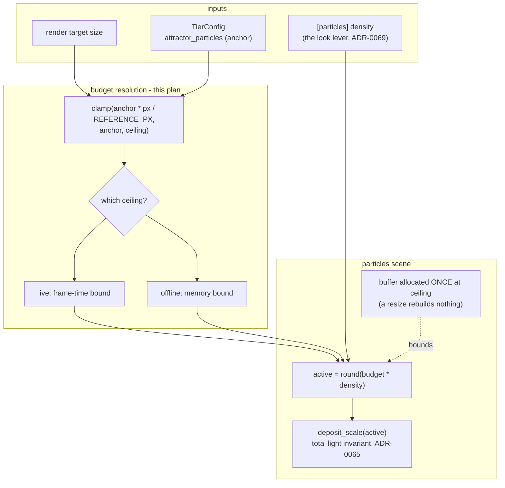

# 0128 — The rendered file stops looking upscaled

> **Status:** approved
> **Created:** 2026-08-28
> **Owner skill(s):** dev, human
> **Related ADRs:** [ADR-0140](../adrs/0140-a-sample-budget-is-a-density-against-the-render-target.md) (proposed — the density law this builds), [ADR-0065](../adrs/0065-the-attractor-deposit-is-normalized-by-particle-count.md) (why more samples is not more light), [ADR-0069](../adrs/0069-the-attractor-trades-sample-count-for-trace-length.md) (budget vs. active count), [ADR-0045](../adrs/0045-quality-tiers-floor-and-rich.md) (what a tier promises), [ADR-0121](../adrs/0121-the-diffusion-filter-is-an-offline-stage-with-profiles-and-it-interpolates-its-own-stride.md) (the profile Phase 5 probes)
> **Closes:** design-backlog 0110, design-backlog 0130

## TL;DR

`attractor_particles` is a flat tier constant with no term for the target it draws into, so the
figure gets **grainier the larger it is rendered**: 0.651 particles per pixel per frame in a
640x360-class window, 0.072 at 1080p. That is the whole of Plan 0101's *"it just looks like Leviathan
upscaled"* verdict on the first music video this engine produced. This plan makes the drawn count a
density against the render target — capped by frame time live, by memory offline — measures the three
constants that law needs rather than asserting them, and puts a real 1080p render in front of a
human to say whether the complaint is answered. It also runs the cheap side-by-side backlog 0125 asks
for (`fast` vs `quality` diffusion profile), because the render that drew that complaint was made at
the *smaller* of the two and the larger has never been run on a track.

## Context & problem

**[design-backlog 0110](../design-backlog.md).** `TierConfig::attractor_particles` is 50,000 at
`Floor` and 150,000 at `Rich`, fixed. The trail grid is surface-sized (Plan 0027), so the deposit
spreads over whatever the target holds:

| target | pixels | particles/px/frame at `Rich` | vs. 640x360 |
|---|---|---|---|
| 640x360 | 230,400 | 0.651 | 1.0x |
| 1280x720 | 921,600 | 0.163 | 0.25x |
| 1920x1080 | 2,073,600 | 0.072 | 0.11x |

Going to 1080p multiplies pixels 9x while `Rich` multiplies particles 3x against `Floor`, so density
falls as resolution rises. `tier.rs`'s own module docs stop one step short of this: the count is
documented as *"a sample count and not a brightness"* whose deposit is divided by the count
(ADR-0065), so *"raising it buys a smoother figure rather than a brighter one"* — and the count never
learned that the number of pixels it smooths over is not fixed.

**Why it surfaced only now.** Every capture path in this repo renders small — the golden suite is
128x128 and `Tier::Floor` by construction, the sanity suite 96x96 — and the live app runs at a window
size where the density is fine. Plan 0101 is the first path that renders at 1080p and asks the result
to stand on its own as a *file*. It is also where the fix is affordable: no 60 Hz deadline, no
governor, and 60 MB of particle state in a one-shot process is nothing.

**[design-backlog 0130](../design-backlog.md)** is the same error one level down, and it is why this
plan carries it. `boundary_density` counts perimeter over area, so the reading scales as ~1/L in the
capture's linear resolution — the same scene at 192x192 reads about half what it reads at 96x96 — and
neither the function's docstring nor either of the two floors read against it names the 96x96 they
were measured at. `metrics` is the module `shot --report` consumes, and Plan 0119's own followups
propose re-using this instrument at report resolutions. A column computed at 1280x720 against a floor
derived at 96x96 is off by roughly an order of magnitude and would read as a finding about the
presets.

**[design-backlog 0125](../design-backlog.md)** shares a verdict with 0110 and nothing else — one is
a sample budget against a render target, the other a pixel budget against a VRAM wall — so it enters
this plan as one probe phase and no design. The clip that drew *"it would obviously be great if
resolution would be higher"* was rendered at the **`fast`** profile (262,144 px, 680x384 at 16:9);
`quality` is 1024x576, 2.25x the pixels, and has never been rendered on a real track.

## Decision

The drawn count becomes `clamp(round(tier_count * target_px / REFERENCE_PX), tier_count, ceiling)`
(ADR-0140) — never fewer than today, so every existing capture is byte-identical and nothing is
blessed; more as the target grows; capped by a live ceiling measured against the frame-time floor and
a larger offline ceiling bounded by memory. The buffer is allocated once at the ceiling, so a resize
changes the active count and rebuilds no GPU resource. `REFERENCE_PX` and both ceilings are
**measured in Phase 1 and not chosen here**; a plan that named them would be inventing numbers it did
not take. We rejected raising the flat constant (over-samples every small window to fix a large one),
a preset-authorable density alone (`[particles] density` is the look lever, and this would make every
one of 17 attractor worlds carry a per-display retune), offline sub-steps (a step is not a sample: the
map families iterate once per step, so N steps is N times the iteration rate — a look change), and
offline supersampling (the same deposits over more texels is the same information, softer).

## Architecture diagram



## Implementation phases

### Phase 1 — Measure the three constants the law needs

- **Owner skill:** dev
- **What:** The readings ADR-0140 deliberately refuses to invent: where the density is acceptable,
  where frame time stops holding, and where the per-particle deposit stops being representable.
- **Files touched:** none shipped — a scratch harness plus the readings, recorded in the
  implementation log.
- **Done when** the log carries three tables, each naming the machine and the adapter it was taken on
  (ADR-0071), taken on the **hardware** adapter and not WARP:
  - **Density.** `attractor_leviathan` at `--tier rich`, one still per target size (640x360,
    1280x720, 1920x1080, and one 4K), with the resolved particles/px alongside. This is arithmetic,
    not judgement — it pins the anchor the law is written against.
  - **Frame time.** At 1920x1080, `Rich`, hardware adapter, with the count swept upward (150k, 300k,
    600k, 1.2M, and the law's own 1080p value), p50 and p99 frame time per step. The live ceiling is
    the largest swept count whose p99 holds NFR section 1's floor with margin — and the margin is
    stated, not implied.
  - **Deposit precision.** The smallest per-particle deposit at each swept count against the
    accumulation format's resolution near the field's working level, so the ceiling is bounded by
    precision if precision binds before frame time. If the deposit quantizes first, **that** is the
    ceiling and the log says so.
  - Plus one line of arithmetic for the offline ceiling: particles x 48 B, against the memory the
    render process can spend.

### Phase 2 — The law, live

- **Owner skill:** dev
- **What:** The budget becomes a function of the target; allocation moves to the ceiling; the active
  count keeps composing with `[particles] density` exactly as ADR-0069 resolves it today.
- **Files touched:** `core/src/render/tier.rs`, `core/src/render/scenes/particles/mod.rs`,
  `core/src/render/scenes/particles/resources.rs`, `core/src/render/scenes/mod.rs`, their tests.
- **Done when:**
  - **Every existing capture resolves to exactly today's count**, asserted on the resolved value at
    128x128 and 96x96 rather than inferred from pixels — the same shape of argument ADR-0065 used for
    `deposit_scale` being exactly 1.0 at `Floor`. The golden suite runs **unblessed and
    byte-identical on both adapters**; if any baseline moves, the law is wrong and the phase stops.
  - **A resize builds no GPU resource.** The buffer is sized at the ceiling at construction, so
    changing the target changes the active count and nothing else — asserted by the resize path, not
    by eye. (Building GPU resources mid-run is what shifts what the trails resolve to on the software
    adapter; the field block's rebuild stays the only one, as Plan 0029 left it.)
  - **Total light stays invariant across budgets.** A headless probe at two resolved budgets deposits
    the same total light into the accumulation, within the tolerance ADR-0065's normalization
    implies. This is the property that makes "more samples" mean "less shot noise" rather than
    "brighter".
  - **The law is monotone and clamped at both ends**, asserted as a property over a sweep of target
    sizes from 128x128 to 4K: never below the anchor, never above the ceiling, never decreasing.
  - `cargo nextest run --workspace` green; `clippy --workspace --all-targets` clean.

### Phase 3 — The offline ceiling

- **Owner skill:** dev
- **What:** The headless render path resolves the larger ceiling, so a rendered file reaches the
  reference density instead of the live cap.
- **Files touched:** `standalone/src/shot/render.rs`, `standalone/src/shot/`, `core/src/render/`
  (whatever carries the surface-vs-headless distinction), `docs/capturing.md`.
- **Done when:**
  - `shot --render` at 1920x1080 `--tier rich` resolves the law's own 1080p value rather than the
    live ceiling, asserted on the resolved number.
  - The **deposits per output pixel** rise by exactly the ratio the law predicts. Stated as sample
    arithmetic on purpose: an image statistic would be the wrong instrument here, because the
    statistics this repo has are themselves resolution-bound — which is the other half of this plan
    (see Phase 6).
  - Peak process memory for a 1080p render stays inside the bound Phase 1's arithmetic named, and the
    log records the reading.
  - `shot` still captures at `Floor` by construction where it always did; no golden path acquires the
    offline ceiling.

### Phase 4 — Does it still look upscaled?

- **Owner skill:** human
- **What:** The look gate the whole plan exists for. Re-render the clip that produced the verdict —
  `attractor_leviathan`, the same 4:41 track, 1920x1080/60, `--tier rich` — and judge it against Plan
  0101's original render.
- **Files touched:** none. Verdict recorded in the implementation log.
- **Done when:** a one-line verdict exists, in the user's words, plus which of the two files it
  refers to. **A "still grainy" verdict is a valid outcome and does not fail the plan** — it means
  the remaining term is not the sample count, and the candidates are then the trail grid's cap and
  the deposit's falloff, which is a new backlog entry rather than a phase here.

### Phase 5 — The diffusion side-by-side (backlog 0125's own cheap first move)

- **Owner skill:** human
- **What:** The same still rendered through the diffusion filter at `fast` (262,144 px) and at
  `quality` (589,824 px), judged side by side. **Best run in the same sitting as Phase 4** — the two
  are independent, and both are a human looking at two images.
- **Files touched:** none. Verdict recorded in the implementation log.
- **Done when:** a verdict exists on whether `quality` answers *"it would obviously be great if
  resolution would be higher"*. If it does, backlog 0125 closes as a profile choice and no resolution
  ADR is ever needed. If it does not, the entry stays live with the reading attached and the walls it
  names (SD1.5 duplicating above ~768 squared; SDXL + ControlNet at ~7.5 GB against an 8 GB card;
  2.721 s/frame at 589,824 px, ~5.9 h for a 4-minute track) become the design problem — for a
  different plan.

### Phase 6 — The statistic names the capture it was measured at

- **Owner skill:** dev
- **What:** Backlog 0130. `boundary_density`'s docstring says the reading scales with the capture's
  linear resolution and is comparable only at a fixed one; `boundary_floor`'s derivation paragraph
  adds "measured at the 96x96 sanity capture" to the date and revision it already names.
- **Files touched:** `core/src/render/metrics.rs`, `core/tests/sanity.rs`.
- **Done when:** the docstring no longer reads as scale-free (today it says a solid mass reads near
  zero *"however large it is"* and a hatched figure near one *"however small"*, while a 4x4 solid
  block reads 1.0000); both floors name their capture size; `node scripts/check-comment-hygiene.mjs`
  and `node scripts/check-backlog-claims.mjs` exit 0. No behavior changes and no golden moves.

## Data shapes

```rust
// illustrative — not the final interface
/// The drawn sample budget for a target, before `[particles] density`.
///
/// Anchored so it can only add samples above `REFERENCE_PX`: at or below it the
/// result is the tier's own constant, which is what keeps every existing
/// capture byte-identical.
pub fn attractor_budget(tier: &TierConfig, target_px: u32, ceiling: u32) -> u32 {
    let scaled = (tier.attractor_particles as f32 * target_px as f32 / REFERENCE_PX as f32).round();
    (scaled as u32).clamp(tier.attractor_particles, ceiling)
}
```

`REFERENCE_PX`, the live ceiling and the offline ceiling are Phase 1 outputs. The particle buffer is
sized at the ceiling; `active = round(budget * density)` is unchanged from ADR-0069.

## Risks & open questions

- **The governor may start demoting at 1080p `Rich`.** It demotes one way, once per session, and a
  demotion now also drops the density anchor, so the visible step is larger than it was. Mitigated by
  taking the live ceiling from Phase 1's p99 sweep *with stated margin* rather than from the largest
  count that merely fits.
- **Precision may bind before frame time.** The deposit is divided by the active count, so a 9x
  budget is a 9x smaller per-particle contribution into a limited-precision accumulation. Phase 1
  measures it; if it binds, the ceiling is a precision bound and the plan says so rather than
  quietly shipping a dimmer figure.
- **`Rich` pays the ceiling's allocation in every window** — 21.6 MB at a 3x ceiling against 7.2 MB
  today. Bounded and named; if Phase 1's ceiling lands much higher, the allocation argument is worth
  re-taking (allocating for the *current* target instead would reintroduce a mid-run resource
  rebuild, which is the thing the ceiling allocation exists to avoid).
- **The trail grid caps at 3840x2160 (`Rich`).** Below 4K the grid is the surface, so the law's
  density is the real density; at and above the cap the grid stops growing while the law keeps adding
  samples, and the density over-delivers. Harmless (more samples into fewer texels is still less
  noise) but it means the 4K row in Phase 1's table is not the same measurement as the others — say
  so where it is recorded.
- **Two adapters, and one of them lies.** Compare hardware against WARP before blessing anything;
  this project has twice had a software-rasterizer artifact bless garbage. Phase 2's expectation is
  that *nothing* needs blessing, which makes any move a finding rather than a chore.
- **Phase 4 may come back negative**, and the plan is written so that is an outcome and not a
  failure. The next suspects are named there.

## What this plan does NOT do

- **It does not touch `swarm_particles` or `emitter_objects`.** They have the same shape of exposure
  and a different argument — their marks are authored sizes, not a deposit smoothed over texels — so
  reusing this law there would be assertion, not reasoning.
- **It does not design anything for the diffusion filter.** Phase 5 is a probe with a verdict;
  raising the diffusion budget is a separate ADR against a VRAM wall, and backlog 0125's note says so.
- **It does not take [backlog 0126](../design-backlog.md)** (a render is one prompt, one seed, one
  preset from first frame to last). Same gate, same day, entirely different question — the entry
  itself says not to fold it into a resolution plan.
- **It does not add a new tier.** A third tier would put `deposit_scale` above 1.0 and amplify shot
  noise; that is ADR-0065's note, not this plan's business.
- **It does not make the offline path reproduce the live path.** After Phase 3 a rendered file is
  deliberately not the frames the app would have drawn at that size.

## Implementation log

> Written by `dev` — one row per phase as that phase's commit lands, and the close block after the
> last one. **The phases above are the contract; everything here is what happened.**

**Lane:** _(to be filled by `dev`)_

| phase | owner | state | commit |
|---|---|---|---|
| 1 — Measure the three constants | dev | not started | |
| 2 — The law, live | dev | not started | |
| 3 — The offline ceiling | dev | not started | |
| 4 — Does it still look upscaled? | human | not started | |
| 5 — The diffusion side-by-side | human | not started | |
| 6 — The statistic names its capture | dev | not started | |

### Notes

### Close triggers

- **`presets/` touched:**
- **Plan header `Closes:`** design-backlog 0110, 0130 (0125 probed, not closed)
- **What shipped:**
- **Operator docs touched:**
- **Backlog probes (`node scripts/check-backlog-claims.mjs`):**
- **Outstanding `human` phases:**

## Followups (after this lands)

- If Phase 4 comes back negative, file the trail-grid cap and the deposit falloff as the next two
  suspects, with the render that produced the verdict attached.
- `shot --report` gaining a `boundary_density` column still needs either a fixed internal capture or
  a documented per-resolution floor (backlog 0130's open half). Phase 6 documents the hazard; it does
  not build the column.
