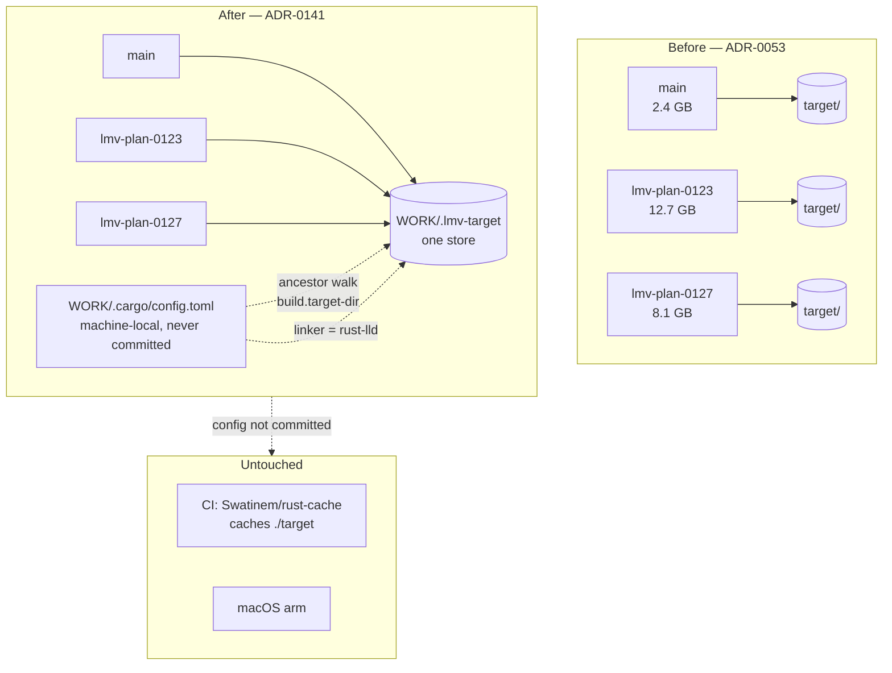

# 0129 — The build stops being paid three times

> **Status:** approved
> **Created:** 2026-08-28
> **Owner skill(s):** dev
> **Related ADRs:** [ADR-0141](../adrs/0141-one-artifact-store-serves-every-lane.md) (proposed)

## TL;DR

Three worktrees hold **23.2 GB of `target/`** — the same 305-crate dependency graph compiled three
times, optimized, and linked across 41 test binaries each. This plan points every lane at **one
shared artifact store** and at the toolchain's bundled **`rust-lld`**, both configured in a
machine-local `.cargo/config.toml` that sits one directory *above* the worktrees so cargo finds it
from every lane and CI never sees it. Nothing about what is tested changes. A new lane starts warm
instead of paying a cold 305-crate build before its first edit compiles.

## Context & problem

The user's report: *"every time we start new plan implementation, create worktree etc we are
spending enormous amount of time to rebuild binaries and test everything over and over again — small
change is taking hours."* Three cost centres were named: the **first build in a new worktree**, the
**rebuild after each small edit**, and the **test suites' wall time**. The close ceremony was
explicitly *not* named. The quality budget is **tooling only, zero coverage change**; developer-
machine tooling is permitted.

Measured on this box, 2026-08-28:

| fact | value |
|---|---|
| `target/` across three live worktrees | 2.4 + 12.7 + 8.1 = **23.2 GB** |
| crates resolved by `Cargo.lock` | **305** |
| dependency `opt-level` in the dev profile | **2** (`[profile.dev.package."*"]`) |
| integration-test binaries in `core/tests/` | **41** |
| `cargo build` on a warm `main` with no edit of ours | **2m12s** |
| `.cargo/config.toml` in the repo | **none — no store, no cache, no linker override** |
| `rust-lld.exe` in the pinned 1.97.1 sysroot | **present, and not on `PATH`** |
| approved plans queued behind this | **7** (0120, 0123, 0124, 0125, 0126, 0127, 0128) |

Two facts constrain the fix and are why this is not a three-line commit. CI uses
`Swatinem/rust-cache@v2`, which caches `./target` — so a **committed** redirect would break the
cache on all three jobs and two operating systems, turning a local win into a CI regression. And
`plugin-foobar/build.ps1:31` resolves the C ABI staticlib as `$repo\target\release\lmv_core_c.lib`,
an assumption a redirect falsifies, on the one build path CI cannot cover.

## Decision

Land ADR-0141: one shared artifact store for every worktree, plus `rust-lld` on the MSVC target,
configured in `WORK/.cargo/config.toml` — machine-local, never committed, found by cargo's ancestor
walk so a new lane needs no setup. Repair `build.ps1` to ask cargo where the target directory is
rather than assuming. Measure before and after, so every claim in this plan carries a number from
this machine.

We rejected **sccache** because it does not reduce the 23.2 GB, wants `CARGO_INCREMENTAL=0` (which
taxes the inner loop the user also named), and buys lock-free concurrency we do not use. We rejected
a **committed relative `target-dir`** because it breaks CI's cache. We rejected a **warm worktree
pool** because it replaces "abandon a lane by deleting a directory" with a destructive reset. Full
reasoning in ADR-0141.

The two levers the user's quality budget ruled out — deferring GPU suites to CI, and consolidating
the 41 test binaries — are not in this plan and are not smuggled into it.

## Architecture diagram



## Implementation phases

### Phase 1 — Take the baseline
- **Owner skill:** dev
- **What:** The control every later phase is measured against, taken *before* anything changes.
- **Files touched:** none (measurements go in the implementation log).
- **How:** Create a scratch worktree (`git worktree add ../lmv-measure-0129 main`), and in it time,
  from cold: `cargo build`, then `cargo nextest run --workspace --no-run` (the compile+link of all
  41 test binaries, without running them). Then in an already-warm lane, time an inner-loop edit:
  touch one file in `core/src/`, and time `cargo nextest run --workspace --no-run` again. Record the
  scratch worktree's `target/` size. Remove the scratch worktree.
- **Done when:** The implementation log carries a table with four numbers — cold `cargo build`, cold
  test-binary build, warm one-file-edit rebuild, and cold `target/` size — each naming this machine,
  per [ADR-0071](../adrs/0071-a-numeric-test-contract-states-a-property-or-names-its-machine.md). These
  are measurements, not thresholds; no test asserts them.

### Phase 2 — Point the MSVC target at `rust-lld`
- **Owner skill:** dev
- **What:** The linker half, landed alone and first so a bisect has somewhere to land.
- **Files touched:** `C:/Users/Igor Konovalov/WORK/.cargo/config.toml` (created, outside every
  repo — nothing in the tree changes in this phase).
- **How:** `rust-lld.exe` lives at
  `$(rustc --print sysroot)/lib/rustlib/x86_64-pc-windows-msvc/bin/rust-lld.exe` and is **not on
  `PATH`**, so the working incantation must be established rather than assumed — try
  `[target.x86_64-pc-windows-msvc] linker = "rust-lld.exe"` first, and fall back to an explicit
  `-Clinker=<sysroot path>` plus `-Clinker-flavor=lld-link` in `rustflags` if that does not resolve.
  Record which form worked.
- **Done when:** `cargo nextest run --workspace` links all 41 test binaries under `rust-lld` and
  passes with the same result set as Phase 1's baseline run, **and the golden suite is
  byte-identical unblessed on this machine's hardware adapter** — a different linker must not move a
  pixel. The log records the link-time delta against Phase 1 and the exact config stanza that
  worked. If `rust-lld` fails to link or moves a golden, **stop and report**: the store in Phase 3
  is independent of this and the plan continues without it.

### Phase 3 — One artifact store for every lane
- **Owner skill:** dev
- **What:** `build.target-dir` redirected to a single store, in the same machine-local config.
- **Files touched:** `WORK/.cargo/config.toml` (extended).
- **How:** Add `[build] target-dir = "C:/Users/Igor Konovalov/WORK/.lmv-target"`. Then **verify
  cargo's ancestor discovery actually reaches a config one level above the workspace root** — this
  plan asserts it does, and the assertion is load-bearing enough to check rather than trust.
- **Done when:** `cargo build` run from *each* of the three live worktrees writes into
  `WORK/.lmv-target` and none of them re-creates its own `target/`; and running `cargo build` in a
  worktree that has never built before completes **without recompiling any dependency** — the log
  records its wall time against Phase 1's cold number, which is the plan's headline claim.

### Phase 4 — Prove nothing about the tests changed
- **Owner skill:** dev
- **What:** The "zero coverage change" contract, discharged by evidence rather than assertion.
- **Files touched:** none expected.
- **Done when:** `cargo nextest run --workspace` from the shared store runs **the same set of
  tests** as Phase 1's baseline — same count, same names, same pass/fail — with no suite silently
  skipped; `cargo clippy --workspace --all-targets -- -D warnings` and `cargo fmt --all --check`
  pass; the golden suite is byte-identical unblessed; and `standalone/tests/shot_cli.rs` still
  locates `examples/shot.exe`, which is the one test whose own comments flag it as sensitive to
  `CARGO_TARGET_DIR`. Any test that finds the store but not its fixtures is a finding, not a fix-up.

### Phase 5 — Repair the one script the redirect breaks
- **Owner skill:** dev
- **What:** `plugin-foobar/build.ps1` stops assuming `$repo\target` and asks cargo instead.
- **Files touched:** `plugin-foobar/build.ps1`.
- **How:** Line 31 hardcodes `Join-Path $repo "target\release\lmv_core_c.lib"`. Replace the `$repo\target`
  assumption with cargo's own answer — `cargo metadata --format-version 1` reports
  `target_directory`, which is correct whether or not a redirect is in effect and on any machine
  that has not opted in.
- **Done when:** `plugin-foobar/build.ps1` produces `foo_lmv.dll` with the store redirect active,
  and the resolved staticlib path it reports is inside `WORK/.lmv-target`. This is the phase that
  cannot be covered by CI, so the log records the built DLL's size against the last known figure.

### Phase 6 — Measure where the suite time actually goes
- **Owner skill:** dev
- **What:** The evidence behind the deferred `opt-level` question — a report, not a change.
- **Files touched:** none (findings go in the implementation log).
- **How:** The `reactivity` suite costs ~89 s and sweeps every shipped preset through the analyzer
  and a GPU. Its cost splits between WARP rasterization (already `opt-level = 2`, being a
  dependency) and our own `lmv-core` code at `opt-level = 0` — preset parsing, the analyzer, the
  image metrics. Establish the split: the cheapest honest probe is a one-off local build with
  `CARGO_PROFILE_DEV_OPT_LEVEL` raised, timing the suite with and without. **Do not commit the
  change** — root `Cargo.toml` forbids widening `opt-level` to workspace crates because inlining
  muddies the line mapping ADR-0033's coverage ratchet is derived from, and that argument is not
  reopened by this phase.
- **Done when:** The log states, with numbers from this machine, roughly what fraction of the
  `reactivity` suite is our unoptimized code. If it is a minority, the log says so and the question
  is closed for free. If it is a majority, that is a finding for architect and a candidate ADR —
  **not** an edit made here.

### Phase 7 — Write down what a machine has to do
- **Owner skill:** dev
- **What:** The documentation that stands in for the gate this cannot have.
- **Files touched:** `CLAUDE.md`, `.claude/skills/architect/references/project-context.md`,
  `.claude/skills/dev/references/project-context.md`.
- **How:** Record the opt-in — what the file is, where it goes, what it contains, and the three
  hazards a shared store introduces: `cargo clean` in any lane wipes it for all lanes; the store
  grows monotonically and needs periodic manual cleanup; and two lanes building at once serialize on
  cargo's lock. Phrase it the way ADR-0033's `core.hooksPath` opt-in is phrased — inert if skipped,
  and say so, since a machine that has not opted in must still build correctly.
- **Done when:** `node scripts/check-doc-links.mjs` exits 0, and a reader who has never seen this
  plan can set a fresh machine up from the docs alone without opening ADR-0141.

## Data shapes

The whole configuration surface, illustrative — the exact `rust-lld` stanza is Phase 2's finding:

```toml
# C:/Users/Igor Konovalov/WORK/.cargo/config.toml
# MACHINE-LOCAL. Never committed: CI's Swatinem/rust-cache caches ./target,
# and the rust-lld path is sysroot-specific. See ADR-0141.

[build]
target-dir = "C:/Users/Igor Konovalov/WORK/.lmv-target"

[target.x86_64-pc-windows-msvc]
linker = "rust-lld.exe"   # Phase 2 confirms this form resolves; it is not on PATH
```

## Risks & open questions

- **`rust-lld` moves a golden.** A different linker should not change rendered output, but it can
  change code layout and therefore floating-point details in principle. Phase 2 gates on
  byte-identical goldens precisely so this surfaces there; if it does, the linker half is dropped
  and the store half proceeds unaffected.
- **Ancestor discovery might not reach `WORK/`.** The plan asserts cargo walks parent directories
  past the workspace root. Phase 3's done-when verifies it rather than trusting it. If it does not,
  the fallback is a gitignored `.cargo/config.toml` per worktree, at the cost of per-lane setup and
  one committed `.gitignore` line.
- **Cross-lane fingerprint thrash could eat the win.** Dependencies stay cached, but hopping between
  two branches recompiles `lmv-core` and its 41 test binaries each way. Phase 1's warm-edit number
  and Phase 3's are the honest comparison; if switching turns out worse than the cold build it
  replaced, that is a finding and ADR-0141's Alternative A (sccache) becomes live again.
- **`cargo clean` is now destructive across lanes.** No gate can prevent this — Phase 7's
  documentation is the only defence, and it is a weaker one. Named in ADR-0141's Negative section
  and accepted.
- **Other Rust projects under `WORK/` join the store.** Cargo namespaces artifacts by package,
  version and feature hash, so this is shared disk rather than shared binaries. Untidy, accepted.
- **The disk still needs sweeping, just less often.** One monotonically growing store replaces three
  that died with their worktrees. Phase 7 documents the chore; nothing automates it.

## What this plan does NOT do

- **It does not change what is tested.** No suite deferred to CI, no threshold moved, no scope
  narrowed, no test binary consolidated. The user's budget was tooling-only and this plan honours it
  exactly.
- **It does not touch CI.** The config is never committed, so all three jobs keep paying the cost
  this plan removes locally. Making CI faster is a separate question with a separate answer
  (`Swatinem/rust-cache` tuning, or a self-hosted runner) and no plan yet.
- **It does not raise `lmv-core`'s `opt-level`.** Phase 6 measures the case for it and stops. Acting
  on that measurement needs an ADR, because ADR-0033's coverage ratchet was derived against the
  current line mapping.
- **It does not adopt sccache.** ADR-0141 Alternative A keeps it documented as the answer if lanes
  ever genuinely go parallel.
- **It does not amend the close ceremony or the worktree layout.** ADR-0053 stands apart from the
  one positive ADR-0141 revokes.

## Implementation log

> Written by `dev` — one row per phase as that phase's commit lands, and the close block after the
> last one. **The phases above are the contract; everything here is what happened.**

**Lane:** _(to be filled by `dev`)_

| phase | owner | state | commit |
|---|---|---|---|
| 1 — Take the baseline | dev | not started | |
| 2 — Point the MSVC target at `rust-lld` | dev | not started | |
| 3 — One artifact store for every lane | dev | not started | |
| 4 — Prove nothing about the tests changed | dev | not started | |
| 5 — Repair the one script the redirect breaks | dev | not started | |
| 6 — Measure where the suite time actually goes | dev | not started | |
| 7 — Write down what a machine has to do | dev | not started | |

### Notes

### Close triggers

- **`presets/` touched:**
- **Plan header `Closes:`** none
- **What shipped:**
- **Operator docs touched:**
- **Backlog probes (`node scripts/check-backlog-claims.mjs`):**
- **Outstanding `human` phases:** none

## Followups (after this lands)

- CI pays the cost this plan removes locally, on every push, across three jobs. Worth its own look
  once the local numbers exist to argue from.
- If Phase 6 finds our unoptimized code dominates the GPU suites, that is an ADR question about the
  ADR-0033 ratchet's derivation, not a profile edit.
