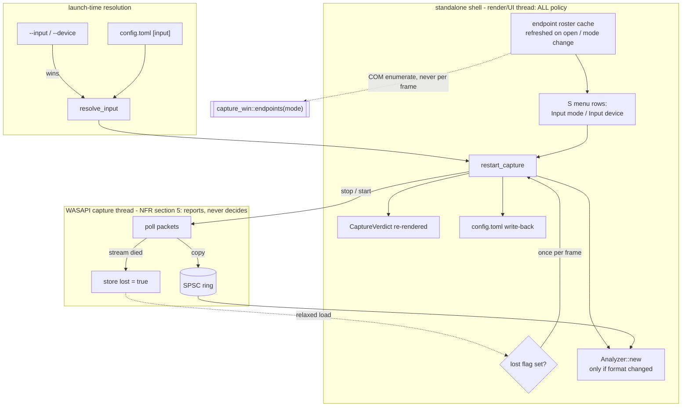

# 0130 — The audio input becomes an operator surface

> **Status:** in-progress
> **Created:** 2026-08-28
> **Owner skill(s):** dev, human
> **Related ADRs:** [0142](../adrs/0142-the-audio-input-is-switched-live-and-the-shell-owns-the-policy.md) (proposed)

## TL;DR

The standalone's input selector works and cannot be reached. `[input] mode` / `[input] device` have
picked between loopback and line-in since Plan 0009 Phase 2, but they are read once before the
window exists and are editable only by quitting the show and hand-editing TOML. This plan gives
them the two surfaces every other operator choice already has — `--input` / `--device` flags at
launch, and two live rows on the `S` menu — by making the capture stream restartable at runtime
with the shell owning the policy. The first user-visible behavior is
`lmv --input line-in --device "Line (ZOOM AMS-22 Audio)"` starting on the interface regardless of
what `config.toml` says.

## Context & problem

Verified live on 2026-08-28: `[input] mode = "line-in"`, `device = "Line (ZOOM AMS-22 Audio)"`
produced `live WASAPI 44100/2` with moving band levels, where the same machine's loopback rows in
the same `diagnostics.log` read `live WASAPI 48000/2` with every band at `0.0000`. The mechanism is
sound. The user's request — *"I need to make it a part of config"* — is about the surface, not the
mechanism: selecting an input should be a thing you do from inside the running app and from the
command line, like quality, auto-rotate, dwell, fullscreen, display, diagnostics and the two HUD
toggles already are.

Three concrete gaps, each verified against the tree:

1. **No launch override.** `parse_tier_arg` (`standalone/src/main.rs:1443`) and `resolve_tier` give
   `--tier` > `LMV_TIER` > config. Input has no equivalent — `config.input` goes straight into
   `start_capture` (`standalone/src/main.rs:245`) with nothing above it.
2. **No live surface.** `SettingsRow::ALL` is a fixed array of ten
   (`standalone/src/settings.rs:150`) and holds no input row. `settings.rs` is deliberately pure —
   window-free, renderer-free, config-free — so the values it shows arrive in a `SettingsView` the
   shell fills each time the rows are drawn or edited.
3. **No signal when the input dies.** `run_capture_loop` breaks its packet loop on any WASAPI error,
   sleeps `POLL_INTERVAL`, and loops again forever (`standalone/src/capture_win.rs:380`). Unplug the
   interface and the thread spins delivering nothing; the picture dies and no surface says why.

The constraint that shapes everything: the capture thread is this app's audio callback and obeys
NFR §5. Enumeration and device activation are COM — they allocate and block — which is why
`capture_win.rs`'s header records that naming happens once at setup, *before* the loop. So the
thread cannot decide which device to run, and cannot recover itself.

## Decision

The shell owns the swap. The render/UI thread stops the old stream, starts the new one, rebuilds
the `Analyzer` only when the negotiated `AudioFormat` changed, and re-renders the capture verdict;
the capture thread gains exactly one new job, storing an `AtomicBool` when its stream has died.
Selection resolves `--input` / `--device` over `[input]`, mirroring ADR-0045's precedence shape.
Device loss recovers through the same swap path the menu uses, on the mode's default endpoint,
bounded.

We rejected **next-launch-only** (write config, apply on restart) because it cannot answer the one
question the row exists for — *is it listening to the right thing?* — and an operator who must
restart to find out will keep editing TOML. We rejected **a supervisor thread** because the
`Analyzer` rebuild lives on the render side and would have to be marshalled back, buying a smooth
frame during a keypress at the price of a permanent second concurrency seam. We rejected **recovery
inside the capture thread** on NFR §5, and **`IMMNotificationClient` hot-plug** as an upgrade path
rather than on merit — it is a second reporting seam built before the first has shipped. All four
are recorded in [ADR-0142](../adrs/0142-the-audio-input-is-switched-live-and-the-shell-owns-the-policy.md).

## Architecture diagram



## Implementation phases

### Phase 1 — The endpoint roster becomes a value, and the flags override config

- **Owner skill:** dev
- **What:** Split enumeration from printing so the roster can be *had* rather than only shown, and
  add `--input` / `--device` above `config.toml` in a `resolve_input` that mirrors `resolve_tier`.
- **Files touched:** `standalone/src/capture_win.rs` (a `pub fn endpoints(mode: CaptureMode) ->
  Result<Vec<String>, CaptureError>`, with `list_devices` rewritten to print what it returns —
  one enumeration path, not two), `standalone/src/main.rs` (`parse_input_args`, `resolve_input`,
  `InputSource`, wiring into `start_capture`), `standalone/src/lib.rs` if the resolver is to be unit
  tested, `README.md`.
- **Done when:**
  - `lmv --input line-in --device "Line (ZOOM AMS-22 Audio)"` captures from the interface with
    `config.toml` still saying `loopback`, and prints an `audio input …` line naming the flag as the
    source, in the shape `quality tier pinned … by …` already uses.
  - `--input` with a value that is neither `loopback` nor `line-in` prints a usage error and exits
    non-zero — the `--tier` precedent (`standalone/src/main.rs:1447`: a bad flag was typed for this
    run, so degrading past it answers the wrong question).
  - `--device` naming an endpoint that is not present degrades to the mode's default endpoint and
    says so, rather than exiting — that is the existing `config.input.device` behavior and a flag
    must not be stricter about the world than about its own spelling.
  - `--input` / `--device` accept both the `--flag value` and `--flag=value` spellings, as
    `--soak` and `--tier` do.
  - Both spellings and the precedence order are covered by unit tests over the resolver, not by
    running the app: the resolver takes the two optional flag values and the config `Input` and
    returns the resolved `Input` plus its source.
  - `--list-devices` prints exactly what it printed before this phase.
  - `README.md` documents both flags where `--tier` is documented.

### Phase 2 — The two rows exist in the pure state machine

- **Owner skill:** dev
- **What:** `Input mode` and `Input device` join `SettingsRow`, with the values arriving through
  `SettingsView` and the edits leaving as `SettingsAction` — no platform types, no config, no COM.
- **Files touched:** `standalone/src/settings.rs`, `standalone/src/settings/tests.rs`.
- **Done when:**
  - `SettingsRow::ALL` carries twelve rows in the order the interview settled: the two input rows
    sit together, after `Diagnostics` and before `PresetName`, with the read-only `Presets` row
    still last.
  - `SettingsView` gains `input_mode`, `input_device_index`, `input_device_count`,
    `input_device_name` and `input_editable`; the `Input device` row renders in the
    `"2 of 2 - Line (ZOOM AMS-22 Audio)"` shape the `Display` row established, and `Input mode`
    renders the kebab-case config word (`loopback` / `line-in`) so what the menu shows and what the
    file holds are the same string.
  - `Left`/`Right` on `Input mode` yields `SetInputMode`, on `Input device` yields
    `CycleInputDevice`; the device cycle **wraps**, as `CycleDisplay` does.
  - With `input_editable: false`, both rows return `SettingsAction::None` from `edit` and still
    render their value — the read-only treatment `Presets` already gets, asserted as such.
  - A view reporting `input_device_count: 0` renders without panicking and yields `None` from
    `edit`. An enumeration that failed and an endpoint roster that is genuinely empty reach this
    module identically, and a live-show modal must not be the thing that crashes.
  - The existing settings tests that assert a fixed row count are updated, not deleted.

### Phase 3 — The shell swaps capture live

- **Owner skill:** dev
- **What:** `restart_capture` on `State`, the cached endpoint roster behind it, and the
  `apply_settings_action` arms that drive both from the two rows.
- **Files touched:** `standalone/src/main.rs`, `standalone/src/capture_verdict.rs` (module header:
  the verdict is current state, re-rendered on swap — its "decided once at startup" paragraph is what
  ADR-0142 supersedes), `README.md`.
- **Done when:**
  - `restart_capture(&mut self, input: &config::Input)` drops the handle, starts the new stream,
    replaces `consumer`, re-renders `capture_token`, and rebuilds `Analyzer` **only when the
    negotiated `AudioFormat` differs from the running one** — an unchanged format keeps the AGC's
    running peak and the tempo history, which is most swaps between two 48 kHz endpoints.
  - A failed restart leaves the app rendering without audio on the `FALLBACK_FORMAT` path and puts
    the reason in the verdict, exactly as a failed startup capture already does. A swap that fails
    must not be able to end the show.
  - The endpoint roster is cached on `State` and refreshed **only** when the settings modal opens
    and when `Input mode` changes — never inside `settings_view()`, which runs every frame the modal
    is up (`standalone/src/main.rs:842`). A COM enumeration per frame on the render thread is the
    trap this bullet exists to name.
  - Changing either row writes `[input]` to `config.toml` through the existing `save_config`, so the
    choice survives a restart like every other row's.
  - `--input` / `--device` pin the *launch*, not the session: the menu can move off a flagged
    selection, and doing so writes the new value to config, as the `Quality` row already does over
    `--tier`.
  - `README.md`'s `S` row lists the two new rows in its enumeration of what the menu contains
    (currently "quality, auto-rotate, dwell bounds, fullscreen, display, diagnostics, preset name,
    now playing" — that list is load-bearing and goes stale silently).

### Phase 4 — A dead input reports itself and the shell recovers

- **Owner skill:** dev
- **What:** The capture thread stores a `lost` flag instead of spinning silently; the shell observes
  it once per frame and restarts on the mode's default endpoint, bounded.
- **Files touched:** `standalone/src/capture_win.rs`, `standalone/src/main.rs`,
  `standalone/src/capture_verdict.rs`.
- **Done when:**
  - The packet loop distinguishes "no packet right now" from "this stream is dead": a `break` on
    `GetNextPacketSize` / `GetBuffer` / `ReleaseBuffer` returning `AUDCLNT_E_DEVICE_INVALIDATED`
    stores `lost = true` and exits the outer loop rather than sleeping into it again. The thread
    stores an atomic and returns — it allocates nothing, locks nothing, logs nothing, and decides
    nothing (NFR §5, ADR-0142).
  - A transient error that is *not* device invalidation keeps today's behavior — break the packet
    loop, sleep, retry — because the current code cannot tell the two apart and this phase is not
    licensed to turn every hiccup into a teardown.
  - The shell reads the flag once per frame with a relaxed load and, when set, restarts on the
    **mode's default endpoint** (not the named one, which is the endpoint that just went away).
  - Recovery is bounded and the bound is a named constant with its reasoning in the comment: after
    the last attempt the shell stops trying and the verdict says the input was lost and not
    recovered. An unbounded retry is a COM call per frame against an audio subsystem that is not
    coming back, which would stutter the show worse than silence does.
  - A successful recovery is visible in `diagnostics.log` and the F3 overlay through the re-rendered
    verdict — the token names the endpoint actually running, so the log answers "what is it
    listening to now".
  - The flag and the bounded-retry decision are unit-testable as values without WASAPI: the retry
    policy is a small state machine over (lost, attempts) and is tested as one.

### Phase 5 — On-device gate: swap it, unplug it, plug it back

- **Owner skill:** human
- **What:** The three things no test on this repo's CI can reach, on the real box with the real
  interface and real audio playing.
- **Files touched:** none (findings go into the plan's implementation log).
- **Done when:**
  - With music playing through the speakers and into the ZOOM, `S` → `Input mode` → `Input device`
    switches the visuals between the loopback and line-in sources, and the picture follows the
    source that is actually feeding it. Note the perceived hitch length and whether the AGC
    re-adaptation after a 48 → 44.1 kHz swap is acceptable or merely tolerable.
  - `config.toml` holds the last selection after a clean quit, and the next launch opens on it.
  - Unplugging the ZOOM mid-show recovers to the default endpoint within a few frames, and F3 says
    what it fell back to. Re-plugging does **not** need to restore it automatically — that is the
    `IMMNotificationClient` case ADR-0142 defers, and confirming it stays unrecovered is the check.
  - If the interface offers a 96 kHz mode, run it and record whether the low end reads mushy. This
    is design-backlog 0032's stated trigger — *"worth taking the day someone runs the standalone on
    a 96 kHz interface and says the sub-bass reads mushy"* — and this plan is the first thing that
    makes hitting it a keypress. A finding here is a backlog update, not a fix in this plan.

## Data shapes

```rust
// illustrative — not the final interface

/// Where the resolved input selection came from, for the startup line.
/// Mirrors the tier-source shape ADR-0045 established.
enum InputSource { Flag, Config, Default }

/// Phase 1: enumeration as a value. `list_devices` prints what this returns.
pub fn endpoints(mode: CaptureMode) -> Result<Vec<String>, CaptureError>;

/// Phase 2: the four fields the rows read, added to the existing SettingsView.
pub struct SettingsView {
    // ...existing fields...
    pub input_mode: InputMode,
    pub input_device_index: usize,
    pub input_device_count: usize,
    pub input_device_name: String,
    /// False on macOS and Linux: the rows render, and `edit` returns `None`.
    pub input_editable: bool,
}

pub enum SettingsAction {
    // ...existing variants...
    SetInputMode(InputMode),
    CycleInputDevice,
}

/// Phase 4: the whole of what the capture thread gains. Stored, never read there.
struct CaptureHandle {
    // ...existing fields...
    lost: Arc<AtomicBool>,
}
```

## Risks & open questions

- **The hitch may be worse than "tens of milliseconds".** WASAPI device activation on a cold or
  USB-attached interface is the unknown, and Phase 5 is where it gets measured rather than assumed.
  If it reads as a stall on stage, the fallback is not Alternative B's supervisor thread but showing
  a brief "switching input" state so the freeze is legible as deliberate.
- **`AUDCLNT_E_DEVICE_INVALIDATED` may not be the only code a real unplug produces.** The device
  could also fail at `GetBuffer` with something else entirely, or the packet loop could simply keep
  returning zero frames forever — which is indistinguishable from silence and would make Phase 4's
  recovery never fire. Phase 5's unplug is what tells us which; if it is the zero-frames case, the
  honest fix is a silence-duration heuristic and that is a *worse* mechanism worth its own decision,
  not a quiet addition here.
- **Bounded retry has no obviously right constant** (ADR-0142 says so plainly). Pick one, name it,
  and put the reasoning in the comment; Phase 5 is the only evidence we will have about whether it
  is right, and one operator on one interface is not much evidence.
- **A rate change is now one keypress away**, which makes design-backlog 0032 operable rather than
  theoretical: both analysis windows are sized in samples, so 96 kHz costs a third of the band axis.
  This plan does not fix it and must not pretend to; Phase 5 records what it looks like.
- **The cached roster can go stale against reality** — a device appears or disappears while the modal
  is open and the list is wrong until it is reopened. Accepted: the refresh points are open and
  mode-change, and the alternative is enumerating on the render thread more often than that.
- **`input_editable: false` on two platforms is dead UI on those platforms.** The interview chose it
  over hiding the rows so the menu keeps one shape and a Mac user learns why. If it reads as clutter
  in Phase 5, hiding is a one-line change to `ALL` and a fresh decision.

## What this plan does NOT do

- **No `LMV_INPUT` / `LMV_DEVICE` environment variables.** `--tier` has `LMV_TIER` because a tier pin
  is a property of a *machine* that an operator sets once; an input selection is a property of a
  *rig* and already persists to `config.toml`. Two flags and a config key are the surface; a third
  precedence level would be one more thing to reason about at load-in for no reached use case.
- **No macOS or Linux input selection.** `start_capture`'s macOS arm ignores `config.input` entirely
  (`standalone/src/main.rs:1191`) and Plan 0120 puts Linux enumeration explicitly out of scope. Both
  get the read-only rows and nothing else. Giving either a real selector is its own plan against its
  own platform API.
- **No `IMMNotificationClient` hot-plug**, so re-plugging an interface does not restore it and a
  default-endpoint change underneath a running stream is not noticed. ADR-0142 Alternative D.
- **No fix for design-backlog 0032.** Sizing the analysis windows in seconds re-opens ADR-0049 and is
  ADR territory by that entry's own argument.
- **No change to `core/`.** Capture is a shell concern by ADR-0001; nothing here reaches past
  `Analyzer::new`.
- **No device selection for the `shot` CLI or the foobar plugin.** `shot` is headless and fed from
  files; the plugin gets its samples from foobar and has no capture path at all.

## Implementation log

> Written by `dev` — one row per phase as that phase's commit lands, and the close block after the
> last one. **The phases above are the contract; everything here is what happened.**

**Lane:** `WORK/lmv-plan-0130` on `plan-0130-the-audio-input-becomes-an-operator-surface`.

| phase | owner | state | commit |
|---|---|---|---|
| 1 — endpoint roster as a value, flags over config | dev | done | `9005a8d` |
| 2 — the two rows in the pure state machine | dev | done | `7eee5f0` |
| 3 — the shell swaps capture live | dev | done | `dd8fbf3` |
| 4 — a dead input reports itself | dev | done | `5e29453` |
| 5 — on-device gate | human | not started | |

### Notes

- Phase 1 touched `standalone/src/config.rs`, which no phase lists: `InputMode::as_str` /
  `from_name` (the kebab word) are needed by the startup line here and by the settings row in
  Phase 2, and the `rename_all = "kebab-case"` they must agree with lives in that file.
- The resolver and its tests went in `main.rs`, not `lib.rs`: `mod config` is a binary module, so
  `Input`/`InputMode` are not visible from the lib crate.
- Phase 2 also touched `standalone/src/main.rs`, which its file list omits: extending
  `SettingsView` breaks the shell's `settings_view()` and `apply_settings_action()`, so the phase
  cannot build without them. The wiring it lands is a stub — `input_editable: false`, an empty
  roster, and a no-op arm for the two actions — which Phase 3 replaces.
- Phase 3 also touched `standalone/src/capture_win.rs` (Phase 4's file) to add
  `enumerating_from_an_sta_leaves_the_apartment_intact`: the render thread enumerates from an STA,
  which `CoInitializeEx(MULTITHREADED)` answers with `RPC_E_CHANGED_MODE`, and nothing else in the
  suite exercises that.
- The settings menu's endpoint roster leads with a synthetic `default` entry, so the value
  `config.toml` ships with is reachable by cycling. The plan does not specify the roster's contents.
- Phase 3's live `S` -> `Input mode` -> `Input device` swap is **not** verified here: driving the
  window needs foreground focus, which Windows denies a process started from a background shell
  (two attempts, `AppActivate` and `SetForegroundWindow`). It is Phase 5's first bullet.
- `--input` and `--device` override **field by field** (`--device` alone keeps the configured
  mode). The plan's done-when pins only the both-flags case; the per-field rule is documented in
  `README.md` and asserted in `the_flags_override_the_config_field_by_field`.
- Phase 4 widened the capture token to satisfy "the token names the endpoint actually running":
  `CaptureVerdict::Live` gained an `endpoint` field, fed by a friendly name `capture_win` now reads
  at setup and carries on the handle, so a row reads `live WASAPI 48000/2 Speakers (Realtek(R)
  Audio)`. That is a format change to the `diagnostics.log` `capture` column.
- Phase 4 added a fourth verdict, `CaptureVerdict::Lost`, for "lost and not recovered" — `Failed`
  is a start that never worked, and the done-when distinguishes them.
- Those two forced three files no phase lists: `standalone/src/diaglog.rs` (its live-capture test
  asserts the token verbatim), `docs/on-device-validation.md` and both
  `packaging/*/READ-ME-FIRST.md`, which quote the old token to a tester.
- Phase 5's on-device gate is untouched and none of its four bullets is covered here.

### Close triggers

- **`presets/` touched:** no.
- **Plan header `Closes:`** none — the header carries no `Closes:` line.
- **What shipped:** feature.
- **Operator docs touched:** `README.md` (the `S` row, and `--input` / `--device` beside `--tier`),
  `docs/on-device-validation.md` (the F3 `audio` line), plus `packaging/windows/READ-ME-FIRST.md`
  and `packaging/macos/READ-ME-FIRST.md`.
- **Backlog probes (`node scripts/check-backlog-claims.mjs`):** exit 0 — 101 reductions hold across
  51 live entries. Advisory only: entry 0032, which Phase 5's fourth bullet is the stated trigger
  for, is among the 49 whose probed paths moved since their stamp.
- **Outstanding `human` phases:** Phase 5 — swap it, unplug it, plug it back, and the 96 kHz read.
