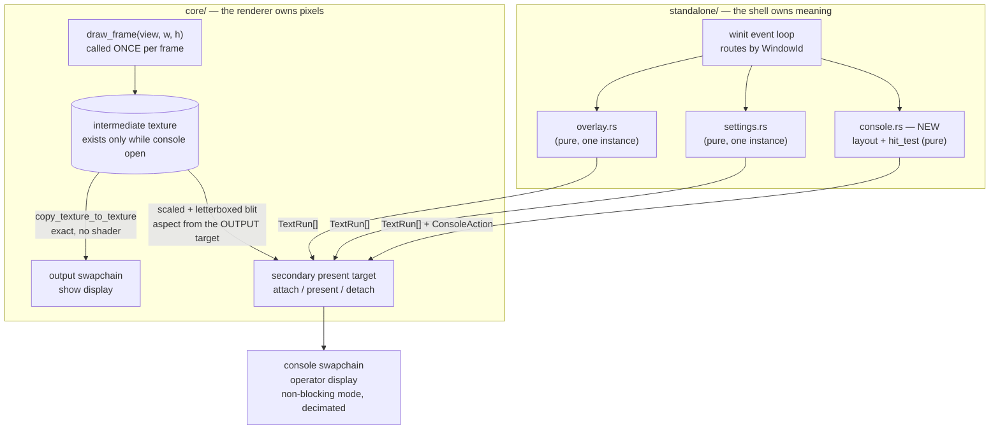

# 0131 — The operator gets a console

> **Status:** draft
> **Created:** 2026-08-28
> **Owner skill(s):** dev, human
> **Related ADRs:** [ADR-0143](../adrs/0143-the-operator-console-is-a-second-surface-and-the-shell-owns-its-meaning.md) (proposed)

## TL;DR

The standalone opens a **second window** — an operator console — on a display other than the one
the show is on. It carries the two modals that exist today (the preset browser and the S-menu), a
transport for next / prev / go-to and the rotation, and a **live thumbnail of the output**. The
console is a second `wgpu::Surface` on the renderer's existing device, not a second renderer: the
frame is drawn once, copied exactly to the output swapchain, and blitted scaled into the console.
No new dependency, no C ABI change, no cue monitor.

## Context & problem

Multi-display targeting already works. `[output] display_name` picks the show's monitor, `D`
advances it, `F` opens borderless-fullscreen on it (Plan 0009 onward). What is missing is a place
for the operator to *stand*. The app has exactly one window and one `Renderer`, and both modals —
`standalone/src/overlay.rs` (preset browser) and `standalone/src/settings.rs` (S-menu) — draw their
rows into the show through the core's glyphon text seam. Driving the app means typing at the output.

The user asked for a desk-side operator seat: output on the far display, a small navigation and
settings window on the near one, and a way to see what is going out without looking up. The two
motivations named in the interview were **the desk-side seat** and **not being able to see what is
coming next**; the two control sets asked for were **the existing modals, mirrored** and **live
performance transport**, plus **a preview of the output**. Standalone only.

**One premise this plan was drafted on turned out to be false, and the correction changed its
dependencies.** The interview offered sequencing behind Plan 0115, on the stated ground that its
Phase 2 frame tap was what the preview would consume. Reading that phase shows it is not: the tap
*re-renders* through `draw_frame` — which advances the dissolve at its end, so a second call per
frame double-steps every crossfade — and then reads the result back to the CPU through
`map_async` + `poll(Wait)`, which Plan 0115's own Risks section names as forbidden in the live
display loop. That tap is right for `--stream` and unusable here. **The dependency on Plan 0115 is
therefore withdrawn; only the Plan 0126 Phase 7 dependency is real** (that phase turns
`standalone/src/main.rs` into shell glue, and this plan edits that file heavily). The user's sequencing answer was given on
the wrong premise and should be re-confirmed — the correction only ever loosens the order.

## Decision

Build the console as a **second winit window whose surface attaches to the renderer's existing wgpu
device** (ADR-0143). `core` gains a secondary present target — attach a surface, present into it,
detach — and learns nothing about consoles: it is handed a scaled copy of the frame it just drew
plus the `TextRun`s the shell queued. Every question about *meaning* stays in the shell, where the
two modals already live as pure, window-free state machines; the console adds one more pure module
for its own layout and hit-testing.

The preview is a GPU-side blit. While the console is open the on-surface path draws into a
sampleable intermediate and reaches the output swapchain by `copy_texture_to_texture` — exact, no
shader, no sRGB round-trip — and the console samples that same intermediate scaled and letterboxed.
One render, one frame, two destinations.

We rejected the shell owning its own wgpu pipeline (it would force `core` to hand out its device and
duplicate the text stack), a separate console process (its preview needs a blocking CPU readback in
the display loop), reusing Plan 0115's tap (double-renders, lands on the CPU), a widget toolkit (NFR
4), and a localhost web page (a network listener for a same-desk problem). ADR-0143 records each.

## Architecture diagram



## Implementation phases

### Phase 1 — The console window opens

- **Owner skill:** dev
- **What:** a second winit window, toggled by `C`, whose surface attaches to the renderer's existing
  device through a new secondary-present-target API in `core`. It draws one static text line. Event
  routing switches from ignoring `WindowId` to matching on it. This is the walking skeleton: a
  second surface that presents, on a display of its own.
- **Files touched:** `core/src/render/mod.rs`, a new `core/src/render/aux.rs`,
  `standalone/src/main.rs`, `standalone/src/diaglog.rs`.
- **Done when:**
  - `C` opens a second window and `C` closes it. When more than one monitor is present it opens on
    one that is **not** the output's; with a single monitor it opens as an ordinary window on that
    one (the single-display fallback is a supported mode, not an error).
  - Closing the console window by its own close button leaves the app running with the show intact;
    closing the output window still exits.
  - Key events are dispatched by `WindowId`, asserted as a **unit test over the routing function**
    rather than by hand: the same `KeyCode` delivered with the console's id and with the output's id
    produces the two different dispatch targets.
  - **A console surface that cannot be configured on the renderer's existing adapter is not fatal.**
    The console opens with its text and no preview, and states the reason once in the diagnostic log.
    This is the dual-GPU path and CI cannot exercise it — Phase 6 is where it gets a real machine.
  - The console's swapchain takes a **non-blocking present mode when `Surface::get_capabilities`
    offers one** and `Fifo` otherwise, and the chosen mode is named in the diagnostic log so Phase 6
    can read which arm ran.
  - `cargo nextest run --workspace` and `cargo clippy --workspace --all-targets` are clean, and the
    hot-path panic-denial pragma is on every file added under `core/src/render/`.

### Phase 2 — The program preview

- **Owner skill:** dev
- **What:** the intermediate render target, the exact copy to the output swapchain, and the scaled
  letterboxed blit into the console. After this phase the console shows the show.
- **Files touched:** `core/src/render/mod.rs`, `core/src/render/aux.rs`, a new file under
  `core/tests/`, `standalone/src/main.rs`.
- **Done when:**
  - **An output frame rendered with the console open is byte-identical to the same frame rendered
    with the console closed**, for the same preset, the same clock and the same `AnalysisFrame`.
    Asserted **exactly**, on the precedent of `standalone/tests/shot_cli.rs`'s
    `a_rendered_frame_is_byte_identical_to_the_png_the_app_writes` and for its reason: a tolerance
    would pass with the copy silently round-tripping through sRGB, which is the failure most likely
    to ship unnoticed. ADR-0096 dithers at the display write, so a lost bit here is a real defect
    wearing the costume of rounding.
  - **The preview's drawn rectangle carries the output render target's aspect** — not the console
    window's, not the thumbnail slot's. Asserted as a value returned by the pure layout function
    (no GPU, no window): at a console window deliberately given a different aspect than the output,
    the returned rectangle letterboxes rather than stretches. This is ADR-0037, which this project
    has shipped wrong twice; and note the trap it shipped through both times — a test written only
    at 16:9 output and a 16:9 console slot cannot tell the two sources apart.
  - The intermediate is built when the console opens and released when it closes; **300 consecutive
    frames with the console open allocate no per-frame GPU resource**, stated against what is
    observable exactly as Plan 0115 Phase 2 states it — the resident set does not grow across them
    beyond the sampling noise `ResidentSet` already reports. Reuse that helper.
  - The golden suite is **unblessed and unchanged**. Goldens run the headless path, which this phase
    does not touch; a baseline that moves is a finding, not a bless.

### Phase 3 — The modals move to the console

- **Owner skill:** dev
- **What:** the preset browser and the S-menu render on the console while it is open, and on the
  output otherwise. One instance of each state machine, two possible surfaces.
- **Files touched:** `standalone/src/main.rs`, `standalone/src/console.rs`.
- **Done when:**
  - With the console open, opening either modal draws **no modal text into the output**: the output
    frame with a modal open is byte-identical to the output frame with it closed, using the same
    instrument Phase 2 built.
  - With the console closed, both modals behave exactly as they do today. **No test in
    `standalone/src/overlay/tests.rs` or `standalone/src/settings/tests.rs` is edited by this
    phase** — those two modules are pure and this phase gives them a second reader, not new rules.
    If one must change, that is a deviation to disclose in the implementation log.
  - The console draws a modal from the **same `visible()` rows** the output path draws, not from a
    parallel list — asserted by a test that both paths are handed the same row slice for the same
    state.
  - Keys reach one state machine from either window: a filter typed at the console and the same
    filter typed at the output leave `OverlayState` in equal states.

### Phase 4 — Transport, staging and the mouse

- **Owner skill:** dev
- **What:** a new pure `standalone/src/console.rs` owning the console's layout constants, its button
  rectangles and `hit_test`; the transport itself (next / prev / go-to, pause-resume auto-rotate,
  nudge dwell, rotate now); and a **"next up" line** naming what the rotation will take — the
  staging answer, in text, not a second render.
- **Files touched:** `standalone/src/console.rs`, `standalone/src/console/tests.rs`,
  `standalone/src/main.rs`, `standalone/src/director.rs`.
- **Done when:**
  - `hit_test` returns the action under a point and `None` in the gaps, asserted at each button
    rectangle's corners and one pixel outside each edge. Pure — no window, no GPU. Layout constants
    live in this module for the reason `overlay.rs` states in its own header: a layout function
    reading its constants from its caller cannot be unit-tested.
  - **Prev adds nothing to the core's public surface.** `Renderer` exposes `cycle_preset` (forward)
    and `select_preset`; prev is the wrapped predecessor index computed shell-side and handed to
    `select_preset`. The `Renderer` API and the C ABI are unchanged by this phase — if that turns
    out to be impossible, it is an ADR question and a stop, not a quiet widening.
  - The "next up" line names the preset **the director would actually take next**, read from the
    director's own state rather than recomputed alongside it — asserted by a test that drives the
    director to a rotation and compares the announced name with the one it then selects. Under a
    random or shuffled rotation policy where no single next preset exists, the line says so rather
    than naming a guess.
  - A rotation-transport row and the equivalent S-menu row produce the **same** action value for the
    same change — asserted directly, so the two surfaces cannot drift into two behaviours.

### Phase 5 — Persistence, the flag, and the docs

- **Owner skill:** dev
- **What:** a `[console]` config section, a `--console` launch flag, and the operator-doc sweep.
- **Files touched:** `standalone/src/config.rs`, `standalone/src/main.rs`, `README.md`,
  `docs/on-device-validation.md`.
- **Done when:**
  - `[console] enabled` and `[console] display_name` round-trip through `config.toml`, and a console
    opened on a named display reopens on that display after a restart.
  - Display resolution **reuses `resolve_monitor`'s existing name-over-index rule** rather than
    reimplementing it — winit's monitor ordering is not stable across boot or hotplug, and the
    console must not learn a second answer to a question the output already answers.
  - `--console` opens it at launch; the flag, the config key and the `C` hotkey are one path, so the
    persisted value cannot disagree with what the key does.
  - `README.md`'s Controls table lists `C`, and `docs/on-device-validation.md` gains the two-display
    console check. Prefer count-free phrasing over hard numbers.

### Phase 6 — The on-device gate

- **Owner skill:** human
- **What:** the only evidence this plan will get for the two things CI structurally cannot see —
  what a second swapchain costs the output, and whether a two-GPU machine can configure the console
  surface at all.
- **Done when:**
  - The output's frame time is recorded **console-closed and console-open**, on two displays of
    *different* refresh rates, with the console on the slower one. Reported as a **measurement that
    names the machine, both displays' refresh rates, the GPU and which present mode Phase 1 logged**
    (ADR-0071) — not asserted as a threshold, and not written into a test. Same-refresh displays do
    not answer this question: that is precisely the configuration where the two pacing sources agree
    and no measurement can tell them apart.
  - A verdict on the cadence: whether the non-blocking present mode alone is sufficient, or whether
    the console needs an explicit decimated present. **"It costs the output frames" is a valid
    outcome** and routes back to architect rather than being tuned away here.
  - If a dual-GPU laptop is available, a statement of whether the console surface configured on the
    renderer's adapter or fell to the no-preview path. If none is available, say so — an untested
    path honestly named beats a guess.
  - A legibility judgement at desk distance: the rows, the transport and the thumbnail at the size
    the console actually opens.

## Data shapes

```rust
// illustrative — not the final interface

// core/src/render/aux.rs — the vocabulary is "surface", never "console".
impl Renderer {
    /// Attach a secondary present target on this renderer's existing device.
    /// Returns the reason on failure (a dual-GPU display the adapter cannot
    /// reach) so the caller can degrade rather than abort.
    pub fn attach_aux_surface(&mut self, surface: wgpu::Surface<'static>, w: u32, h: u32)
        -> Result<(), AuxSurfaceError>;

    /// Present into the attached target: the last drawn frame, scaled and
    /// letterboxed to the OUTPUT target's aspect, plus these text runs over it.
    pub fn present_aux(&mut self, runs: &[TextRun<'_>], preview: PreviewSlot);

    pub fn detach_aux_surface(&mut self);
}

/// Where the preview goes inside the console, in console-window px. The aspect
/// correction is core's; the slot is the shell's (ADR-0037).
pub struct PreviewSlot { pub x: f32, pub y: f32, pub w: f32, pub h: f32 }

// standalone/src/console.rs — pure, window-free, GPU-free.
pub enum ConsoleAction {
    None,
    Next, Prev, GoTo(usize),
    ToggleAutoRotate, NudgeDwell(i32), RotateNow,
    Settings(SettingsAction),
    Overlay(OverlayAction),
}
pub fn hit_test(x: f32, y: f32, w: f32, h: f32) -> ConsoleAction;
pub fn preview_slot(w: f32, h: f32, output_aspect: f32) -> PreviewSlot;
```

## Risks & open questions

- **The exact copy may not be exact on every backend.** `copy_texture_to_texture` needs the
  swapchain texture to accept `COPY_DST` and the formats to match. Where it does not, the fallback
  is a shader blit — and then Phase 2's byte-identity criterion becomes a tolerance, which is a
  **finding to disclose**, not a criterion to soften. It would mean the console silently changes the
  show's pixels, which is the one thing this design promises it does not do.
- **The dual-GPU path is untestable where we develop.** CI has one adapter; so, most likely, does
  the dev box. This is the "two sources that agree on the one configuration we test at" habit: a
  console surface configured on the renderer's adapter and a console surface configured on its own
  adapter are indistinguishable on a single-GPU machine. Phase 1 builds the degrade path blind and
  Phase 6 is the only thing that looks at it.
- **Present pacing is stated as a property, not a number, because we cannot yet do the arithmetic.**
  How much a second swapchain costs the output depends on the swapchain image count, the driver and
  the two refresh rates. Phase 6 measures it on a named machine; nothing asserts a frame-rate
  threshold anywhere in this plan.
- **`main.rs` is contended.** Plan 0126 Phase 7 splits it, and Plan 0130 is rewriting
  `settings.rs` and `main.rs` in a live lane right now. Taking this plan first guarantees a merge
  fight in the largest file in the shell; the recommended order is 0126 first. This is a scheduling
  risk, not a design one.
- **The console inherits `overlay.rs`'s text-metric estimate.** Core exposes no text-measurement API
  (ADR-0009), so column widths are estimated from font size and a character budget and long names
  truncate. On a narrow console window that will bite sooner than it does on a full-screen list. The
  mitigation is a minimum console width, not a measurement API — that would be an ADR-0009
  supplement and is out of scope.
- **Two windows, one dissolve clock.** The console presents on its own cadence while the output
  presents on the display's. The preview will therefore sometimes show a frame the output has
  already replaced. That is correct for a monitor and worth stating so nobody later reads it as lag.

## What this plan does NOT do

- **No cue monitor.** The console shows the program, not a live render of the staged preset. A cue
  render is a second `Renderer` with its own scene state and its own clock, and it cannot share a
  dissolve — the interview declined it and ADR-0143 records why. Staging is a text line (Phase 4).
- **No blackout and no freeze.** Both are new *core* primitives — a master output level and a scene
  clock the shell can stop — and the interview left them out. The `hold` and `freeze` already in the
  tree are the preset-expression latch and the dual-live budget latch, which are unrelated.
- **No per-preset parameter tweaking.** Sliders over the active preset's exposed params are a
  different surface with a different problem (which params, named how, persisted where).
- **No foobar console and no C ABI movement.** Standalone only; the `extern "C"` surface is untouched.
- **No web or remote control surface.** ADR-0143 Alternative E — revisitable if reach is ever wanted,
  and it composes with this rather than replacing it.
- **It does not adopt, reshape or block Plan 0115's frame tap.** The two taps are different
  mechanisms serving different consumers; this plan builds its own and leaves that one alone.

## Implementation log

> Written by `dev` — one row per phase as that phase's commit lands, and the close block after the
> last one. **The phases above are the contract; everything here is what happened.**

**Lane:** _(to be filled by `dev`)_

| phase | owner | state | commit |
|---|---|---|---|
| 1 — The console window opens | dev | not started | |
| 2 — The program preview | dev | not started | |
| 3 — The modals move to the console | dev | not started | |
| 4 — Transport, staging and the mouse | dev | not started | |
| 5 — Persistence, the flag, and the docs | dev | not started | |
| 6 — The on-device gate | human | not started | |

### Notes

### Close triggers

- **`presets/` touched:**
- **Plan header `Closes:`** none
- **What shipped:**
- **Operator docs touched:**
- **Backlog probes (`node scripts/check-backlog-claims.mjs`):**
- **Outstanding `human` phases:**

## Followups (after this lands)

- Blackout and freeze as operator primitives, if the console makes their absence felt in use.
- Whether the secondary present target should serve a *second show output* (a confidence monitor or
  a second projector) — the seam generalizes, nothing else does yet.
- A minimum console width, or an ADR-0009 supplement for text measurement, if truncation bites.
