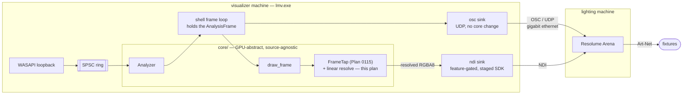

# 0132 — The lighting rig follows the visuals

> **Status:** draft
> **Created:** 2026-08-28
> **Owner skill(s):** dev, human
> **Related ADRs:** [0144](../adrs/0144-the-lighting-feed-is-a-resolved-ndi-sender-and-a-fixed-osc-telemetry-set.md) (proposed),
> [0125](../adrs/0125-the-live-video-out-is-a-spout-sender-fed-by-a-frame-tap.md) (proposed),
> [0046](../adrs/0046-linear-light-hdr-composite-bloom-tonemap.md),
> [0140](../adrs/0140-a-sample-budget-is-a-density-against-the-render-target.md) (proposed),
> [0142](../adrs/0142-the-audio-input-is-switched-live-and-the-shell-owns-the-policy.md) (proposed)

## TL;DR

The standalone grows **two optional sinks** so that real stage lighting follows what the visualizer
is doing. An **OSC telemetry stream** publishes the analyzer's fixed signal set to Resolume Arena on
the lighting machine; an **NDI sender** publishes the rendered scene, resolved down in linear light,
so Arena can sample it onto fixtures and the room inherits the preset's actual colour.

**The OSC half ships first and stands alone.** It touches no `core` code, needs no GPU, no SDK and
no Plan 0115, and its first user-visible behavior is **a lamp changing on the beat**. The NDI half
is behind two gates that can each kill it, and the plan is ordered so that neither takes the OSC
half down with it.

## Context & problem

The user runs a live rig: DJ audio on the visualizer box, **Resolume Arena on a separate machine**
joined by **switched Ethernet**, and Art-Net out of Arena to real fixtures. Arena already owns the
patch, the zoning and the dimming. What it has no source for is a signal that moves the way the
music does — which is exactly what this engine already computes and already draws.

[ADR-0144](../adrs/0144-the-lighting-feed-is-a-resolved-ndi-sender-and-a-fixed-osc-telemetry-set.md)
is the decision: two sinks, Arena owns the mapping, the transport set is constrained by what Arena
can natively ingest across machines. It also lists **six facts it rests on that are unverified in
this repo** — the NDI licence chief among them — and this plan's first phase is where they are
established, before any code exists to be wasted.

**The two halves have very different dependency weight, and the phase order is built on that.** The
OSC half is a UDP socket and a message encoder in the shell. The NDI half needs
[Plan 0115](0115-the-engine-becomes-a-live-video-source.md)'s frame tap, which is **approved and not
started**, plus a third-party SDK whose licence terms nobody here has read. Interleaving them would
put the cheap, certain half behind the expensive, uncertain one.

## Decision

Take ADR-0144 as written, and **order the plan so value lands before risk**: the human rig gate
first, then the entire OSC path through to a lamp moving on the beat, then the video path.

## Architecture diagram

## Implementation phases

### Phase 1 — Establish the six unverified facts on the real rig, with no engine code

- **Owner skill:** human
- **What:** settle every assumption ADR-0144's `## Notes` lists, using generic tools only, on the
  actual Arena installation and the actual fixtures. **This is a stop gate with three separable
  outcomes**, and which one occurs decides how much of this plan runs.
- **Files touched:** none in the repo. Findings go in this plan's `## Implementation log`.
- **How:** two independent probes, either order.
  - **OSC probe.** From the visualizer machine, send OSC to Arena with any generic sender, bind an
    incoming address to a parameter in Arena, and watch a fixture. Record the port, the address
    matching rules, and whether a value arriving at frame rate is acted on per message or throttled.
  - **NDI probe.** From the visualizer machine, publish a generic NDI source (a test pattern or
    screen capture from NDI's own tools) across the Ethernet link, and receive it in Arena. Record
    Arena's edition and version, whether NDI appears as a source at all, and the name and sampling
    model of Arena's DMX/Art-Net output feature — read off the running app, not from memory.
  - **The licence read.** Open the NDI SDK's own licence and record what it says about accepting
    terms, redistributing the runtime, and attribution.
- **Done when** this plan's log records all six of ADR-0144's unverified facts, **and states which
  of these three outcomes occurred:**
  - **(a) Both probes work and the licence permits our distribution model.** The whole plan
    proceeds as written.
  - **(b) OSC works; NDI does not** — unsupported by that Arena, or the licence refuses. **Phases 2
    to 4 proceed and Phases 5 to 7 do not.** ADR-0144 is accepted with a dated `Outcome` section
    recording which, and its **Alternative C** (HDMI plus a capture card) becomes the live question
    for a separate plan. This outcome still delivers a working feature.
  - **(c) Neither works.** The plan stops here and ADR-0144 is superseded rather than accepted.
- **Note the fallback that is not a failure:** if the licence forbids *redistribution* but permits
  the operator installing the NDI runtime on both machines, that is outcome (a) with a documented
  install step, not outcome (b). Say which one it is.

### Phase 2 — The OSC telemetry sink, through to values on the wire

- **Owner skill:** dev
- **What:** a new `standalone` module publishing ADR-0144's fixed telemetry set over UDP. **No
  `core` change at all** — the shell already holds the `AnalysisFrame` it passes to
  `Renderer::render` and to the `Director`.
- **Files touched:** new `standalone/src/osc.rs` (+ `osc/tests.rs`), `standalone/src/main.rs`,
  `standalone/src/config.rs`, `standalone/src/lib.rs`.
- **How:**
  - **Hand-roll the OSC 1.0 encoder; add no crate.** A message is an address string, a type-tag
    string and the arguments, each padded to a 4-byte boundary — on the order of a hundred lines for
    the `f`, `i` and `s` types this needs. [NFR section 4](../nfr.md)'s dependency gate asks for a
    justification for any crate pulling a large transitive graph, and the honest answer here is that
    the encoder is smaller than the justification would be. `std::net::UdpSocket` is the transport.
  - **The address space is versioned in the addresses themselves** — `/lmv/v1/...` — so a later
    change is additive and an operator's Arena mapping keeps working. Publish the four normalized
    levels, the raw levels, onset, the beat counter, beat phase, tempo, and the preset name.
    `AnalysisFrame`'s `bar` field is beat phase under a documented misnomer (ADR-0050); **publish it
    under its true name**, since nothing outside this repo inherits that naming debt.
  - **Config and CLI:** `[osc]` in `config.toml` (enabled, target `host:port`, send rate) plus an
    `--osc <host:port>` override, following the `[input]` precedent
    ([ADR-0142](../adrs/0142-the-audio-input-is-switched-live-and-the-shell-owns-the-policy.md)).
    **Off by default.**
  - **Decide the failure behaviour deliberately.** A send error must not propagate with `?` into the
    frame loop and must not spam a log every frame. Whatever it does — drop silently, back off,
    latch a status line — is a stated choice, in a comment, with the mechanism.
- **Done when:**
  - With the app running against real audio and an OSC monitor listening on another host, every
    published address carries a value, and the level and onset addresses **change with the music**.
  - `standalone`'s tests assert the encoder against **the OSC 1.0 spec's own padding rules**: an
    address of length 4 still takes a full 4 bytes of padding, a 3-character string pads to 4, and
    every message length is a multiple of 4. These are exact, dimensionless properties — no
    tolerances and no machine dependence.
  - `cargo nextest run --workspace` is green and **no golden baseline moves**, blessed or otherwise.
    This phase adds no render path; a baseline that moves is a finding.

### Phase 3 — Decide the send path by measurement, and record the number

- **Owner skill:** dev
- **What:** establish whether the inline `sendto` belongs in the frame loop, and take the dedicated
  sender thread only if the measurement says so. ADR-0144 states both exits; this phase picks one.
- **Files touched:** `standalone/src/osc.rs`, `standalone/src/main.rs`.
- **How:** measure the frame-time distribution with the sink **off** and with it **on**, against a
  **LAN** target rather than localhost — localhost is the cheap case and the wrong one. Repeat each
  configuration enough times to characterize its own run-to-run spread.
- **Done when** the log records the measured distributions and which exit was taken, against this
  criterion:
  - **The property, not a threshold:** enabling the sink must not move the frame-time distribution
    outside the run-to-run variance the *same* configuration shows against itself. If sink-on sits
    inside sink-off's own spread, the inline send ships. If it sits outside it, the sender thread
    lands in this phase.
  - This is stated as a property on purpose. A fixed microsecond budget would be a number invented
    here rather than earned, and it would not survive a different machine — whereas "smaller than
    this configuration's own noise" is checkable anywhere and means the same thing everywhere.
  - The log names the machine and the link the measurement was taken on, per
    [ADR-0071](../adrs/0071-a-numeric-test-contract-states-a-property-or-names-its-machine.md).

### Phase 4 — Human: the OSC half against real fixtures

- **Owner skill:** human
- **What:** run the app into Arena on the rig, bind the telemetry to fixtures, and play a set.
- **Files touched:** none. Findings go in the log.
- **Done when** the log records:
  - **A fixture visibly changes on the beat**, driven by our telemetry. This is the plan's walking
    skeleton and the first thing anyone can point at.
  - **Which addresses turned out useful and which were noise.** This is the real feedback the fixed
    set needs: ADR-0144 chose a fixed vocabulary over preset-declared channels, so the only way it
    gets better is an operator saying which signals earned their place.
  - Anything that behaved unlike Phase 1's probe predicted.

### Phase 5 — The frame tap grows a linear resolve stage

- **Owner skill:** dev
- **Depends on:** [Plan 0115](0115-the-engine-becomes-a-live-video-source.md) Phase 2 having landed
  the frame tap. **This plan does not build that tap.** If 0115 has not reached Phase 2 when this
  plan is taken up, this phase and the two after it wait; Phases 1 to 4 do not.
- **What:** add a GPU-side reduction to the tap that resolves the show-size render down to the
  lighting size **in linear light**, so the readback is the small buffer rather than the large one.
- **Files touched:** `core/src/render/` (the tap module 0115 Phase 2 creates), plus its tests.
- **How:** establish first — by reading the code, and recording it in the log — **whether the
  tonemap's output offscreen is linear float or already display-encoded**, which is ADR-0144's
  unverified fact 5. If it is already encoded, the resolve decodes to linear before averaging and
  re-encodes once at the end.
- **Done when:**
  - **The discriminating test passes, and it is exact.** Resolve a frame that is half full-white and
    half full-black. A correct linear average is 0.5 in linear light, which sRGB-encodes to roughly
    **0.735** (about byte 188). Averaging the *encoded* bytes instead gives 127.5 (byte 128). The
    test asserts the linear answer. The two are far enough apart that no tolerance argument is
    needed — this is a property of the transfer function, derivable on paper, and it fails loudly
    if the resolve ever silently moves back into encoded space.
  - A constant-colour frame resolves to exactly that colour, at every supported lighting size.
  - **No golden baseline moves.** The resolve is a new path off the tap; it changes nothing the
    window or the capture paths render.
  - `cargo nextest run --workspace` green, `cargo clippy --workspace --all-targets` clean.

### Phase 6 — The NDI sender in the standalone

- **Owner skill:** dev
- **Depends on:** Phase 1 outcome (a), and Phase 5.
- **What:** publish each resolved frame as an NDI source, behind a cargo feature that is **off by
  default**.
- **Files touched:** new `standalone/src/ndi.rs`, `standalone/Cargo.toml`, `standalone/src/main.rs`,
  the SDK staging script, CI's release job.
- **How:** stage the SDK by **pinned fetch, never committed**, exactly as
  [ADR-0115](../adrs/0115-the-foobar-component-is-a-released-artifact-with-a-parameterized-sdk.md)
  already stages the foobar2000 SDK and as ADR-0125 plans to stage Spout — one pattern, third use.
  The feature being off by default is what keeps an ordinary `cargo build`, CI's default job and the
  macOS target untouched.
- **Done when:**
  - An NDI monitor on **the other machine** shows the stream, at the configured size and rate, with
    the picture recognisably the scene.
  - A default `cargo build` and the default CI job are byte-unaffected — the feature-off build links
    no NDI symbol.
  - The staged SDK's licence obligations (attribution, notices) are discharged wherever the release
    artifacts carry licence text, per Phase 1's reading.
  - Sender lifetime is defined across a **resolution change** and across the receiver disappearing
    and returning; the log states which behaviour was chosen.

### Phase 7 — Human: the whole rig, and the question this plan cannot answer

- **Owner skill:** human
- **What:** run the full path — audio to visuals to NDI to Arena to Art-Net to fixtures — for a real
  set, and judge whether the lamps **read**.
- **Files touched:** none. Findings go in the log.
- **Done when** the log records:
  - **The verdict on legibility.** ADR-0144 predicts this openly: the engine draws sparse bright
    marks on black for a projector, and averaged onto lamps that may be a dim room with occasional
    flashes. This phase is the only instrument that exists for it.
  - **If the room is too dim, which remedy is wanted** — Arena-side gain, a gain or lift inside our
    resolve, or a lighting-specific render path. **None of the three is built here.** The choice is
    routed to the design backlog, and the third is ADR-worthy.
  - **The observed skew between the two paths** — whether an OSC-triggered effect and the
    pixel-driven wash agree about where the beat was, which ADR-0144 lists as unmeasured.
  - Session behaviour over the set: whether either sink degraded, stalled or dropped.

### Phase 8 — The operator documentation

- **Owner skill:** dev
- **What:** write the operator guide and sweep the docs a new surface makes stale.
- **Files touched:** new `docs/lighting.md`, `README.md`, `docs/nfr.md`.
- **How:** `docs/lighting.md` carries the rig topology, the Arena-side setup Phase 1 established, the
  **full `/lmv/v1/` address table**, the config keys and CLI flags, and the gigabit-Ethernet link
  requirement including the note that Art-Net shares that LAN. `README.md` gains the new flags and
  config keys. `docs/nfr.md` section 10 (live performance) gains the lighting path, since it already
  names the live-show use this serves.
- **Done when** `node scripts/check-doc-links.mjs` exits 0, the address table matches what Phase 2
  actually emits (checked against the code, not against this plan), and the README's flag list
  matches `--help`.

## Risks & open questions

- **The NDI licence is the single largest risk and it is unquantified.** Spout was BSD and this is
  not. Phase 1 reads it before a line of NDI code exists, which is the cheapest possible ordering,
  and outcome (b) is a real and survivable end.
- **Plan 0115 is approved and unstarted**, so Phases 5 to 7 have a dependency outside this plan's
  control. That is why the OSC half is complete by Phase 4 rather than interleaved.
- **Legibility may be the real finding.** It is plausible that this whole path works perfectly and
  the lamps still look wrong, because the source material was never designed for them. Phase 7 is
  built to surface that as a *routed decision* rather than an improvised fix at 2 a.m.
- **The fixed OSC set may prove too narrow**, which is ADR-0144's Alternative F waiting to be
  revisited. Phase 4's "which addresses were useful" note is the evidence that question needs.
- **Two networked sinks enter a live show path.** Failure behaviour is a stated choice in Phase 2,
  but nothing here makes the show robust to a switch dying.
- **Open:** whether the lighting resolution should be operator-configurable or fixed. The plan
  assumes configurable with a small default; Phase 7 may argue it should be pinned.

## What this plan does NOT do

- **No Art-Net, sACN or DMX leaves this application.** Arena owns fixture profiles, patching,
  zoning, dimmer curves and DMX timing. ADR-0144 Alternative E records why.
- **No zone extraction and no lighting-specific render path.** We resolve the picture we already
  draw. If Phase 7 says that is not enough, the remedy is routed, not built.
- **No preset-declared OSC channels.** ADR-0144 Alternative F, rejected on the mid-show contract
  break.
- **No foobar plugin support.** Standalone only, so `LMV_ABI_VERSION` does not move and the C ABI
  contract is not engaged.
- **This plan does not build Plan 0115's frame tap.** It adds a resolve stage to it.
- **No WiFi and no remote-over-internet path.** ADR-0144's arithmetic assumes a wired gigabit link.
- **No audio crosses either sink.**
- **No golden coverage is claimed for either sink.** Both are wall-clock paced and their output
  leaves the process; every claim about them is a human reading or a property test on a
  deterministic sub-part.

## Implementation log

> Written by `dev` — one row per phase as that phase's commit lands, and the close block after the
> last one. **The phases above are the contract; everything here is what happened.**

**Lane:** _(to be filled by `dev`)_

| phase | owner | state | commit |
|-------|-------|-------|--------|
| 1 | human | not started | — |
| 2 | dev | not started | — |
| 3 | dev | not started | — |
| 4 | human | not started | — |
| 5 | dev | not started | — |
| 6 | dev | not started | — |
| 7 | human | not started | — |
| 8 | dev | not started | — |
