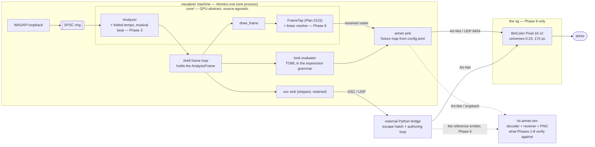

# 0133 — The engine drives the lights

> **Status:** approved
> **Created:** 2026-08-29
> **Owner skill(s):** dev, human
> **Related ADRs:** [0145](../adrs/0145-the-engine-drives-the-fixtures-directly-over-art-net.md) (proposed),
> [0174](../adrs/0174-the-art-net-path-is-verified-against-a-simulated-rig.md) (proposed - the reordering),
> [0144](../adrs/0144-the-lighting-feed-is-a-resolved-ndi-sender-and-a-fixed-osc-telemetry-set.md) (superseded in part),
> [0142](../adrs/0142-the-audio-input-is-switched-live-and-the-shell-owns-the-policy.md),
> [0109](../adrs/0109-the-beat-clock-counts-onsets-not-beats.md),
> [0046](../adrs/0046-linear-light-hdr-composite-bloom-tonemap.md)
>
> **Closes:** design-backlog 0157, 0158

## TL;DR

`standalone` grows an **Art-Net sink** that drives pixel fixtures directly, with the rig described
in `config.toml` and the look authored as a TOML file in the existing expression grammar. This
replaces the Arena-on-a-second-machine architecture of ADR-0144, which a live set on 2026-08-29
bypassed entirely and which the user has since rejected outright.

**The starting point is not zero.** The `/rlx/v1` OSC sink is built and shipped (Plan 0132 Phase 2),
and an external Python bridge already turned it into a room the user called *"looks amazing"*. This
plan brings that path inside the application, generalizes the rig from constants to configuration,
and moves the look from throwaway Python into content the project owns.

**The rig is unreachable, so the plan is ordered around a simulator.** `rlx-artnet-sim` decodes
the Art-Net we emit and renders it as the rig's 24 x 170 raster, so eight of the ten phases verify
against bytes on a wire instead of lamps in a room - several of them more exactly than the rig ever
could. The physical questions are batched into one session at Phase 9. That split, what it buys and
what it cannot see are [ADR-0174](../adrs/0174-the-art-net-path-is-verified-against-a-simulated-rig.md).

**It also fixes the two engine gaps that path exposed** — the tempo estimate that reads double on
real material and the beat counter that counts onsets — because the bridge had to work around both,
in three lines each, and every future consumer would write those same three lines.

## Context & problem

[ADR-0145](../adrs/0145-the-engine-drives-the-fixtures-directly-over-art-net.md) is the decision and
carries the full argument. The short form:

ADR-0144 put Resolume Arena on a second machine in the middle of the path, and rejected direct
Art-Net output in one line — *"it makes us a lighting console"* — on the grounds that Arena already
owned the patch, the zoning and the dimming. **This rig has no console.** It is two BinColor
Pixel-16 Ethernet-to-SPI controllers, plain RGB, universes 0-23, and what they want is pixels.
Alternative E's decisive reason is not merely inconvenient here; it is false.

**The rig is a 24 x 170 raster** — universe index tracks height, one universe drives a chain of two
to three sticks at 170 pixels. That was established by probe, and it is the fact the design turns
on: the eventual picture path is a downsample and a copy, not a transport problem, provided the
emitter is in the same process as the renderer.

**What exists today, and where.** `WORK/lmv-lighting-probes/` holds thirteen throwaway instruments
plus the hardened show path built on 2026-08-29 (`show.py`, `showrun.ps1`). None of it is in version
control, and it encodes rig facts — latching nodes, full-universe frames, the height coordinate, the
WireGuard capture of `192.168.1.0/24` — that cost an evening to establish and will cost another to
rediscover. **This plan does not delete that folder.** It stays the fast authoring loop and the
escape hatch, and ADR-0145 keeps the OSC sink that feeds it.

## Decision

Take ADR-0145 as written. **The rig is unreachable, so the ordering principle is no longer "the rig
lights up before anything clever happens" but "the wire carries a frame we can see before anything
clever happens"** — [ADR-0174](../adrs/0174-the-art-net-path-is-verified-against-a-simulated-rig.md).
Build the simulator first, then a flat configured colour it can show, then the analyzer signals, then
the cost measurement that decides the send path, then the look grammar, then the look that already
works, then operator control. The picture path stays behind its own dependency, and **the single rig
session is second-to-last**, carrying every question the simulator cannot answer.

## Architecture diagram

## Implementation phases

**Phases 1-8 need no fixtures.** ADR-0174 splits what the rig answers into *bytes on the wire*,
which `rlx-artnet-sim` reads more exactly than a person watches a room, and *physical behaviour*,
which nothing but the rig can answer. Phase 9 is the whole of the second half, in one session.

### Phase 1 — The virtual rig, validated against the specification

- **Owner skill:** dev
- **What:** `rlx-artnet-sim` — an `ArtDmx` decoder, a UDP receiver that reassembles datagrams into
  the rig's 24 x 170 raster, and a PNG writer. A workspace member **outside `default-members`**,
  following `core-cabi` (ADR-0072) and `milkconv` (ADR-0113). **No emitter yet** — nothing in this
  repo sends Art-Net when this phase lands, and that is the point.
- **Files touched:** new `rlx-artnet-sim/` (`Cargo.toml`, `src/lib.rs`, `src/main.rs`,
  `src/tests.rs`), root `Cargo.toml` (`members`, **not** `default-members`).
- **How:**
  - **The decoder is validated against a hand-built byte fixture derived from the Art-Net
    specification, not against our encoder.** This ordering is the phase's reason for existing: if
    the simulator's only input were the encoder Phase 2 writes, a shared misreading of the spec
    would round-trip perfectly and be invisible on every subsequent phase. Write the fixture from
    the spec, by hand, and say in a comment that it is spec-derived.
  - **Frame delimitation is the design work.** Art-Net without `ArtSync` has no frame boundary — 24
    unsynchronized datagrams simply arrive. Close a frame when a universe index repeats. That is
    exact for a sender emitting each universe once per frame, which is the sender Phase 2 builds;
    record the assumption, because a different sender would break it silently.
  - The library is what the tests use; `main.rs` is a viewer an author runs by hand
    (`cargo run -p rlx-artnet-sim -- --listen 0.0.0.0:6454 --out target/rig/`). Nothing runs the
    binary automatically — the same renderer-not-a-gate distinction `scripts/` already draws.
  - **170 x 24 is a hairline.** Upscale by an integer factor with nearest-neighbour for viewing, so
    a pixel stays a pixel.
  - The one dependency is `image = "=0.25.10"` with `default-features = false, features = ["png"]`
    — already pinned in both `core` and `standalone`, so the workspace gains no new crate.
- **Done when:**
  - **A spec-derived `ArtDmx` byte fixture decodes to the expected universe and channel data**, and
    a malformed one — wrong identifier, wrong opcode, odd length field, short body — is rejected
    rather than silently mis-decoded.
  - **A synthesized 24 x 170 raster round-trips**: fed as datagrams into the receiver, it reassembles
    to the same raster and writes a PNG whose pixels match it.
  - **The frame delimiter is asserted**, not assumed: two frames' worth of datagrams produce exactly
    two frames.
  - `cargo build -p rlx-artnet-sim` succeeds and **a bare `cargo build` does not build it** — the
    `default-members` property, checked rather than intended.
  - `cargo nextest run --workspace` green, `cargo clippy --workspace --all-targets` clean.

### Phase 2 — A configured rig lights up on the simulator, and goes dark when we leave

- **Owner skill:** dev
- **What:** the walking skeleton. A new `standalone/src/artnet.rs` that reads a fixture map from
  `config.toml`, emits `ArtDmx`, and holds a flat colour. **No look, no telemetry, no expression
  grammar** — a constant colour is the whole visual ambition.
- **Files touched:** new `standalone/src/artnet.rs` (+ `artnet/tests.rs`), new
  `standalone/tests/artnet_loopback.rs`, `standalone/src/config.rs`, `standalone/src/app_state.rs`,
  `standalone/src/cli.rs`, `standalone/src/lib.rs`, `standalone/Cargo.toml` (dev-dependency on
  `rlx-artnet-sim`).
- **How:**
  - **The fixture map is the design work of this phase**, and it is the part most likely to be
    revised later, so keep it small and literal: node addresses, a universe range, pixels per
    universe, and how universe index maps to a normalized spatial coordinate. Describe the rig we
    have without asserting that every rig looks like it.
  - **The map is unconfirmed until Phase 9, deliberately** (ADR-0174). It comes from a probe on
    2026-08-29 that is recorded nowhere in version control. **Write it so the mapping is data, not
    structure** — if Phase 9 finds universe index is not height, or a chain is two sticks and not
    three, the repair must be a config edit and not a rewrite. That constraint is what makes
    deferring the confirmation affordable, so it is a requirement of this phase, not a hope.
  - **A frame fills the whole universe.** 170 pixels, 510 channels. Short frames leave the later
    sticks in a chain holding stale data, which presents as half the rig being broken — record that
    in a comment, because the symptom does not suggest the cause. **The simulator cannot see the
    symptom**, only the cause, which is why the length is asserted rather than watched.
  - **Blackout on every exit path**, per ADR-0145. Normal exit, operator quit, and panic. State in
    the log which paths are actually covered and which are not — an abort almost certainly is not,
    and saying so is worth more than implying it is.
  - `[artnet]` in `config.toml`, off by default, following the `[osc]` and `[input]` precedent.
  - **Failure behaviour is the `[osc]` sink's, deliberately:** a send error drops the datagram,
    counts it, and prints only on the transition to failing and back. Never `?` into the frame loop,
    never a line per frame.
- **Done when:**
  - **A colour configured in `config.toml` appears in the PNG the simulator writes**, on all 24
    universes and across all 170 pixels of each — the whole raster, which is the assertable form of
    "including the last stick of each chain".
  - **Every datagram carries 510 channels**, asserted over a captured run. This is the short-frame
    trap, and it is now a test rather than a comment.
  - **Quitting leaves an all-zero final frame on every universe**, asserted from the captured
    stream on the normal-exit and operator-quit paths. This is strictly stronger than watching a
    dark room, which cannot distinguish blackout from a node that merely stopped receiving.
  - Encoder tests assert the `ArtDmx` packet against the Art-Net specification: the `Art-Net\0`
    identifier, opcode `0x5000` little-endian, protocol version 14 big-endian, and a length field
    that is big-endian and even. These are exact, dimensionless properties.
  - **The encoder and Phase 1's decoder round-trip**, which is only evidence because the decoder was
    validated against the spec independently first.
  - `cargo nextest run --workspace` green, `cargo clippy --workspace --all-targets` clean, **no
    golden baseline moves** — this phase adds no render path, so a baseline that moves is a finding.

### Phase 3 — The analyzer publishes a folded tempo and a musical beat

- **Owner skill:** dev
- **What:** close design-backlog 0157 and 0158. The Python bridge had to fold the tempo estimate and
  gate the beat counter, in three lines each, and **every consumer of this telemetry will write the
  same two workarounds.** Publish both signals from the engine instead. **This phase never needed
  the rig** and is unchanged by ADR-0174.
- **Files touched:** `core/src/dsp/` (the analyzer), `standalone/src/osc.rs`, plus tests.
- **How:**
  - **Both signals are additive.** Nothing existing changes meaning: `tempo` keeps reporting what
    the estimator says, and `beat_index` keeps counting onsets, because presets and the OSC contract
    are bound to both. The new signals sit beside them. **A golden baseline that moves is a
    finding**, and that property is what keeps this phase inside a lighting plan rather than
    becoming its own.
  - **The fold is a stated range, not a magic constant.** The bridge folds into 70-140 BPM by
    halving and doubling. Whether that window is right, and whether the fold belongs in the engine
    at all rather than in the estimator, is the open question — if the answer turns out to be "fix
    the estimator", **this phase splits out into its own plan with its own ADR** rather than
    shipping a heuristic under a plan that is about lighting. Say which happened.
  - **The musical beat is derived, and its derivation is the deliverable.** `beat_index` fires
    1.2x-2.3x per musical beat depending on material (ADR-0109), and it fired 3.6 times a second on
    the rig. Gating by the folded tempo is what the bridge did and it worked; whether that is the
    right mechanism inside the engine is this phase's design question.
- **Done when:**
  - The log records **what the estimator reports and what the fold produces, on real material**, and
    names the machine and the material per
    [ADR-0071](../adrs/0071-a-numeric-test-contract-states-a-property-or-names-its-machine.md).
  - **The property, not a threshold:** against a signal synthesized at a known BPM, the folded
    tempo lands within the fold window and is a power-of-two multiple of the synthesized rate. That
    is exact and machine-independent; the *estimator's* accuracy is explicitly not what this asserts.
  - **The musical beat fires at most once per folded beat period**, asserted over a synthesized
    signal. That is a property of the gate, derivable on paper, and it fails loudly if the gate is
    ever removed.
  - No golden baseline moves, blessed or otherwise.

### Phase 4 — Decide the send path by measurement, and record the number

- **Owner skill:** dev
- **What:** establish whether building and sending 24 universes belongs inline in the frame loop.
  This is a different question from Plan 0132 Phase 3, which measured a 392-byte `sendto` and found
  it free; this builds 4,080 pixels and sends 24 datagrams, and **that plan's own log warns why its
  answer does not transfer** — the inline exit there was earned by GPU-wait slack on a 165 Hz
  display, not by the send being cheap.
- **Files touched:** `standalone/src/artnet.rs`, `standalone/src/app_state.rs`.
- **How:**
  - **Measure to a dead destination on a live LAN segment, not to loopback and not to the rig.**
    Art-Net is fire-and-forget UDP and a node never replies, so the only thing the rig contributes
    to send cost is being an address that resolves (ADR-0174). Pre-populate the ARP entry —
    `netsh interface ipv4 add neighbors "<interface>" <ip> <mac>` — so no send stalls on address
    resolution, and pick an address on a segment whose **interface is actually up**, because a down
    link takes a different path through the driver.
  - **Loopback is not a substitute here** and the plan says so: it skips the driver and the PHY,
    which is precisely the part being measured.
  - Measure the frame-time distribution with the sink off and on, alternating runs so drift falls on
    both configurations. Repeat each configuration enough times to characterize its own run-to-run
    spread.
- **Done when** the log records the distributions and which exit was taken, against this criterion:
  - **The property:** enabling the sink must not move the frame-time distribution outside the
    run-to-run variance the *same* configuration shows against itself. Inside it, the inline build
    and send ships. Outside it, **the dedicated sender thread lands in this phase** — behind a
    lock-free handoff, the same discipline as the audio/render seam.
  - **Measure the build and the send separately**, as Plan 0132 Phase 3 did, because a distribution
    that does not move says nothing about how much headroom is left. The pixel build is CPU work
    that a GPU wait can hide on one machine and cannot on another.
  - The log names the machine, the display refresh rate, **the network interface, the destination
    address, and that the ARP entry was pre-populated** — the last three because the substitution
    for the rig is what makes this number arguable, and an unstated substitution is an unfalsifiable
    number.

### Phase 5 — A look is a TOML file

- **Owner skill:** dev
- **What:** the look evaluator. A lighting look is a file in the existing expression grammar,
  evaluated per universe per frame against the telemetry and a spatial coordinate.
- **Files touched:** `standalone/src/artnet.rs` or a new look module, the expression evaluator's
  binding surface, `presets/` or a new `looks/` directory, plus tests.
- **How:**
  - **Reuse the grammar; do not invent a second one.** The evaluator already handles `bass`, `mid`,
    `treb`, `onset`, `beat`, `tempo`, `time`. A look adds a spatial coordinate and returns a colour.
    What that costs the grammar is this phase's design question, and if the answer is "a new
    capability in the evaluator" then it is `dev` work in `core` and needs saying.
  - **Decide where looks live and say why.** Beside `presets/` as a sibling directory is the obvious
    shape; embedding them the way `core/build.rs` globs presets (ADR-0022) is the obvious mechanism.
  - Selection is by name in `config.toml`, plus a CLI override, following `[osc]`'s precedent.
- **Done when:**
  - **A look file drives the simulator, and editing that file and restarting changes the PNG
    sequence** — the whole point of looks-as-data, in the form that is available without fixtures.
  - **A look with no audio is exactly reproducible.** Fed a fixed telemetry sequence, two runs
    produce byte-identical rasters. That is the determinism rule applied to this path, it is free to
    assert here, and it is what makes Phase 6's comparison mean anything.
  - The evaluator's new bindings are covered by tests that assert values, not non-emptiness.
  - `cargo nextest run --workspace` green, no golden baseline moves.

### Phase 6 — The look that already works, ported

- **Owner skill:** dev
- **What:** express `artnet_rise2.py`'s look — the slow red rise that whitens on the beat — as a
  look file. This is the acceptance test for Phase 5's grammar: **a look known to be good, that a
  room has already approved.**
- **Files touched:** a look file, and whatever Phase 5's grammar turns out to lack.
- **How:**
  - The Python is the specification and it is 200 lines with its reasoning in comments — the
    asymmetric crest (hard leading edge `EDGE = 0.09`, long trailing glow `TAIL = 0.34`), the white
    surge confined to the crest by `band ** 3`, one climb per eight beats, the near-black floor.
  - **Point the Python bridge at the simulator too.** It emits Art-Net, so it can be captured as a
    PNG sequence on the same audio and the same telemetry that drives the ported look. That gives
    this phase a side-by-side of the two emitters instead of a comparison against memory — which is
    the strongest form this judgement has ever been available in (ADR-0174).
- **Done when:**
  - **Both look sequences are captured from the simulator on the same material, and a human says
    they are the same look.** This is still a judgement and the plan still says so; there is no
    pixel-identity claim to make across two evaluators on two clocks. What has changed is that the
    comparison is two image sequences rather than one image and a memory of a room.
  - **Every capability the port needed but the grammar lacked is listed in the log.** That list is
    the real output of this phase — it is the first honest measurement of whether the expression
    grammar can express lighting, and if it is long, that is a finding that routes back to
    `architect` rather than a gap to paper over in Rust.

### Phase 7 — The operator can stop it

- **Owner skill:** dev
- **What:** the controls a live set needs. Blackout, master level, look selection.
- **Files touched:** `standalone/src/app_state.rs`, the settings surface, `standalone/src/artnet.rs`.
- **How:** mirror the existing operator surfaces rather than inventing one — the settings modal and
  the hotkey set are the precedent, and [Plan 0131](done/0131-the-operator-gets-a-console.md)'s console is
  where this eventually belongs if that plan has landed.
  - **Blackout must be reachable in one keystroke**, because its use case is "something is wrong
    right now, in front of an audience".
  - **Coupling is opt-in and off**, per ADR-0145: the operator's look selection is held across a
    preset rotation unless the operator has allowed a preset to request one.
- **Done when:**
  - **Blackout is asserted from the captured stream:** after the keystroke, every subsequent frame
    is all-zero on every universe — not merely a dark PNG, which a stalled sender also produces.
  - **Master level scales the decoded values**, asserted at two levels against the same look.
  - Look selection switches which look drives the raster, asserted by the sequences differing.
  - The log records what the coupling opt-in actually looks like in config.

### Phase 8 — The picture drives the lamps

- **Owner skill:** dev
- **Depends on:** [Plan 0115](done/0115-the-engine-becomes-a-live-video-source.md) Phase 2 having landed
  the frame tap. **This plan does not build that tap.** If 0115 has not reached Phase 2, this phase
  waits and Phases 1 to 7 do not.
- **What:** resolve the rendered frame down to the rig's raster in linear light, so the lamps show
  the actual preset. ADR-0144's best idea, arriving without Arena or NDI.
- **How:** establish first — by reading the code, and recording it in the log — **whether the
  tonemap's output offscreen is linear float or already display-encoded** (ADR-0144's unverified
  fact 5). If it is encoded, the resolve decodes to linear before averaging and re-encodes once.
- **Done when:**
  - **The discriminating test passes, and it is exact.** Resolve a frame that is half full-white and
    half full-black. A correct linear average is 0.5 in linear light, which sRGB-encodes to roughly
    **0.735** (about byte 188); averaging the encoded bytes gives 127.5 (byte 128). The test asserts
    the linear answer. The two are far enough apart that no tolerance argument is needed. **This
    test never needed the rig** and lands here.
  - A constant-colour frame resolves to exactly that colour.
  - A resolved frame reaches the simulator and writes a recognizable PNG of the preset.
  - **Whether the lamps read is not asked here — it moves to Phase 9.** ADR-0144 predicted openly
    that they might not, and that prediction is perceptual: sparse bright marks on black averaged
    onto sticks may be a dim room with occasional flashes. The simulator's PNG cannot answer it.
  - No golden baseline moves.

### Phase 9 — Human: the rig session

- **Owner skill:** human
- **What:** the single session that asks the fixtures everything only they can answer. **This is the
  first rig contact in the plan**, and it carries what Phases 2, 5, 6 and 8 each used to ask
  separately (ADR-0174).
- **Files touched:** none. Findings go in the log.
- **How:** run a real set with the app driving the fixtures directly, with the Python bridge
  available as the fallback but not used. Take the checklist below in order — **the fixture-map
  items first**, because everything downstream is conditioned on them, and finding a map error
  before the set is worth more than finding it after.
- **Done when** the log records:
  - **Whether the fixture map is right.** Is universe index actually height? Are the chains 170
    pixels, two sticks or three? Does every stick in every chain show the configured colour? This is
    the item six phases were built on top of unconfirmed, and it is the first thing to check.
  - **Whether the nodes latch, and whether the 510-channel rule holds in practice.** The length is
    asserted in Phase 2; whether that is *sufficient* is a hardware fact.
  - **What refresh rate the hardware prefers, and whether `ArtSync` matters.** The probes chose
    40 Hz, achieved ~32, and sent 24 unsynchronized universes per frame; nothing establishes what
    the nodes want.
  - **Whether the room is as good as the bridge's.** The bridge is the benchmark and it has already
    passed; this is the only instrument that can say whether the port kept what mattered. Phase 6's
    side-by-side narrows the question but cannot close it.
  - **Whether the lamps read**, if Phase 8 landed. **If it is too dim, the remedy is routed, not
    built here.**
  - **What the in-process sink cost in resilience.** ADR-0145 names this as the price: the bridge
    survived the app restarting and this does not. Whether that was felt during a real set is the
    evidence that decides whether it needs mitigating.
  - **Blackout works on real fixtures**, and session behaviour over the whole set: whether the sink
    stalled, drifted, or drops accumulated.

### Phase 10 — The operator documentation, and the probes come home

- **Owner skill:** dev
- **What:** write the operator guide, and bring the rig knowledge into the repository.
- **Files touched:** new `docs/lighting.md`, `README.md`, `docs/nfr.md`, `docs/testing.md`,
  `presets/README.md` or the looks equivalent.
- **How:** `docs/lighting.md` carries the fixture map format, the config keys and CLI flags, the
  look-authoring reference, the operator controls, and — **the part that only exists outside the
  repo today** — the rig facts: latching nodes, full-universe frames, the height coordinate, the
  static-IP requirement and the WireGuard capture of `192.168.1.0/24`, **as Phase 9 confirmed or
  corrected them**. `docs/testing.md` gains `rlx-artnet-sim`: what it is, how to run the viewer, and
  the enumerated list of what it cannot see.
- **Done when** `node scripts/check-doc-links.mjs` exits 0, the config keys documented match what
  `config.rs` actually parses (checked against the code, not against this plan), and the README's
  flag list matches the binary's.

## Risks & open questions

- **Eight phases rest on an unconfirmed fixture map, and that is the price of the reordering.** The
  24 x 170 raster and "universe index is height" come from one probe on 2026-08-29, recorded nowhere
  in version control, and nothing confirms them until Phase 9. The bet is Phase 2's requirement that
  the mapping be **data rather than structure**, so a wrong map costs a config edit and not a
  rewrite. If Phase 2 cannot honour that, this risk gets much more expensive and the reordering
  should be reconsidered.
- **The simulator can pass while the rig fails.** ADR-0174's Negative section enumerates the known
  ways — latching, the stale-stick symptom, refresh rate, `ArtSync`, the sticks' gamma, and every
  perceptual question. Phase 9 carries all of them; the risk is that a *ninth* thing is on that list
  and nobody has thought of it yet.
- **Phase 9 is one evening carrying what five would have.** A large human phase is more likely to be
  partly done, and its checklist is ordered so the fixture-map items come first for exactly that
  reason.
- **The fixture map is generalized from one rig.** "Universe index is a spatial coordinate" may be an
  accident of how this structure was patched. A format designed against a single instance will be
  revised, and Phase 2 should aim to be revisable rather than complete.
- **The in-process sink gives up a property that was load-bearing tonight.** The bridge survived the
  app restarting, and looks were iterated all evening without the visuals going down. Phase 9 is the
  only instrument that can say whether that matters in practice.
- **Phase 6 may find the expression grammar cannot express lighting.** That is a real outcome, its
  evidence is the capability list Phase 6 is required to produce, and it routes to `architect`.
- **Phase 3 may turn out to be estimator work rather than a fold**, in which case it leaves this plan.
- **Nothing in the golden suite covers any of this.** The sink is wall-clock paced and its output
  leaves the process — the position ADR-0144 and ADR-0125 both accepted. What the simulator adds is
  a *different* gate, on the wire format and the raster, not an extension of the golden suite.
- **The Art-Net refresh rate and ArtSync are both unexamined.** The probes chose 40 Hz, achieved ~32,
  and sent 24 unsynchronized universes per frame; nothing establishes what the hardware prefers, and
  the simulator's frame delimiter assumes the sender we are building rather than discovering it.
- **Open:** whether a rig that speaks sACN is a second transport under the same fixture map or a
  different decision. Not answered here because no such rig exists yet.

## What this plan does NOT do

- **No fixture profiles, no patching UI, no dimmer curves, no cue stack.** The fixture map describes
  a pixel surface; it does not become a lighting console's data model.
- **No second machine, no NDI, no Spout, no video transport of any kind.** ADR-0145 records why.
- **This plan does not build Plan 0115's frame tap.** Phase 8 resolves onto it.
- **It does not delete the external bridge or the OSC sink.** Both stay supported, per ADR-0145.
- **No foobar plugin support.** Standalone only, so `RLX_ABI_VERSION` does not move.
- **No sACN.** The rig speaks Art-Net; a second transport waits for a rig that needs it.
- **No lighting-specific render path.** If Phase 9 says the picture is too dim, the remedy is routed.
- **The simulator is not a fixture emulator.** It reads the wire and draws the raster; it models no
  node behaviour, no latching, no timing preference and no stick response. ADR-0174 enumerates what
  that leaves to Phase 9, and adding a behavioural model would be a new decision, not a refinement.
- **`rlx-artnet-sim` never ships**, and nothing shipped depends on it - `core-cabi` and `milkconv`'s
  position, out of `default-members`.

## Implementation log

> Written by `dev` — one row per phase as that phase's commit lands, and the close block after the
> last one. **The phases above are the contract; everything here is what happened.**
