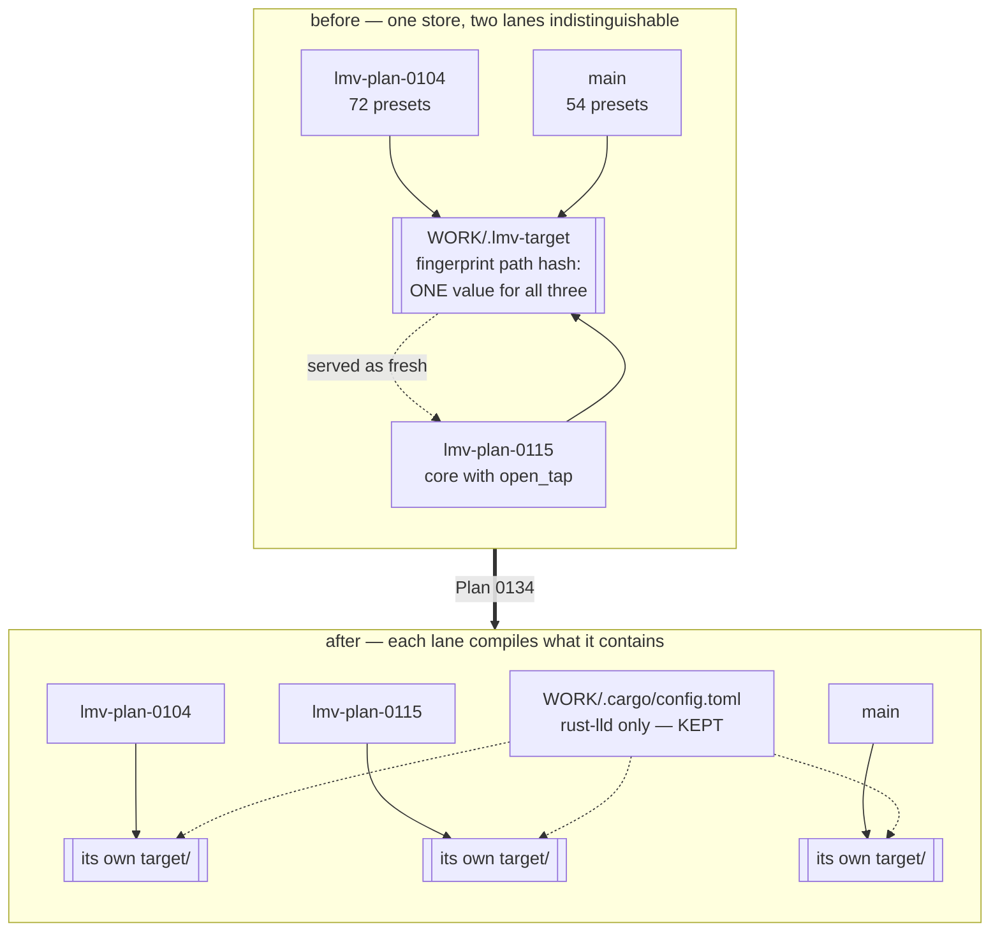

# 0134 — The lanes stop sharing a store

> **Status:** draft
> **Created:** 2026-08-29
> **Owner skill(s):** dev, human
> **Related ADRs:** [0147](../adrs/0147-the-shared-artifact-store-is-revoked-and-the-linker-stays.md) (proposed),
> [0141](../adrs/0141-one-artifact-store-serves-every-lane.md),
> [0053](../adrs/0053-plan-lanes-run-in-git-worktrees.md)

## TL;DR

The shared artifact store [ADR-0141](../adrs/0141-one-artifact-store-serves-every-lane.md) put in
place this morning serves one lane another lane's compiled `lmv-core`, because **the worktree path
is not in cargo's fingerprint** — so two worktrees with the same layout and the same dependency
graph are indistinguishable and one lane's artifact is handed to the other as fresh. Plan 0115's
lane compiled against a `core` that does not contain its own new methods; Plan 0104's lane, which
holds 18 presets `main` does not, would embed `main`'s preset library instead of its own. We delete
the `target-dir` redirect, **keep the `rust-lld` linker**, and delete the poisoned store. The first
visible behavior is `cargo build` in a lane writing into that lane's own `target/` again.

## Context & problem

[ADR-0147](../adrs/0147-the-shared-artifact-store-is-revoked-and-the-linker-stays.md) carries the
full evidence. The short form:

- Across all eight `lmv-core` library fingerprints in the store, cargo's `path` field holds **one**
  value; across all six build-script compile units, **one**. One of those units is provably from the
  Plan 0115 worktree. The worktree path is not hashed.
- Freshness then resolves the dep-info's **relative** source paths against whichever package root is
  building, and compares mtimes — so a lane whose files predate its neighbour's build is told the
  neighbour's artifact is current.
- `core/build.rs` collides the same way, and it is the half that reaches content: seven build-script
  outputs, all 57 entries, none containing `lsystem_bower`, which exists only in the Plan 0104
  worktree (**72 presets against `main`'s 54**).

`CLAUDE.md` names three hazards for this store — `cargo clean` wiping every lane, monotonic growth,
lock serialization. All three cost time and disk. This one **compiles against source the lane does
not contain**, and here it failed loudly only because a method was missing. Two lanes whose cores
differ only in behaviour would go green.

The exposure window is short — ADR-0141 was accepted 2026-08-29 and this was found the same day —
but **two lanes are live inside it**: `lmv-plan-0115` and `lmv-plan-0104`. Plan 0115's `dev` session
already discarded a full-suite run rather than report it, because it could not be known which core
it ran against.

## Decision

Remove `[build] target-dir` from the machine-local `WORK/.cargo/config.toml`, keep the
`[target.x86_64-pc-windows-msvc] linker = "rust-lld.exe"` block, and delete `WORK/.lmv-target`. We
rejected **a detector** (a build-script-recorded manifest dir asserted by a test) because the test
binary is subject to the identical collision, so the instrument shares the failure mode of the thing
it measures; **`sccache` under per-lane `target/`** because it is a tool to install and pin, wants
`CARGO_INCREMENTAL=0`, and the cost it would recover is 105 s per new lane — it stays the answer if
the cold build turns out to hurt; and **serializing lanes by discipline** because the store persists,
so the hazard is sequential rather than concurrent and no scheduling rule touches it.

## Architecture diagram

## Implementation phases

### Phase 1 — Cut the redirect and destroy the poisoned store

- **Owner skill:** human
- **What:** the machine-local config is not in the repository and no skill can edit it. Delete the
  `[build]` table from `WORK/.cargo/config.toml`, leave the `[target.x86_64-pc-windows-msvc]` block
  exactly as it is, then delete `WORK/.lmv-target` entirely.
- **Files touched:** none in the repository. `WORK/.cargo/config.toml` and `WORK/.lmv-target`, both
  outside it.
- **Notes for the implementer:**
  - **Delete the store rather than keep it.** Its artifacts have no recoverable provenance; anything
    left in it can still be served to a lane whose graph happens to match.
  - Do not run `cargo clean` to do it — that is the ADR-0141 hazard, and with the redirect already
    removed it would clean the wrong directory anyway. Remove the directory.
  - **Nothing else in that file changes.** The linker is not implicated and it is measured: 171 s →
    145 s on the cold path to every test binary, moving no golden.
- **Done when:**
  - `WORK/.cargo/config.toml` contains the linker block and nothing else.
  - `WORK/.lmv-target` does not exist.
  - `cargo metadata --format-version 1 --no-deps` run in **each** live worktree reports a
    `target_directory` inside that worktree.

### Phase 2 — Prove each lane compiles what it contains

- **Owner skill:** dev
- **What:** re-establish, per live worktree, that the tree in front of you is the tree that built —
  and specifically re-take the two readings the store invalidated. No production code changes.
- **Files touched:** none expected. Any change here is a finding, not a fix.
- **Notes for the implementer:**
  - **Run this in each live worktree separately** (`main`, `lmv-plan-0104`, `lmv-plan-0115`), because
    the whole question is whether they differ.
  - The `lmv-plan-0104` check is the sharp one: that lane holds **72** presets, `main` holds 54, and
    every build-script output in the deleted store carried 54. It is the only place the *content*
    half of the collision is observable.
  - Expect a cold build — 105 s by Plan 0129 Phase 1's measurement, per lane. That is the price
    ADR-0147 accepts and it is not a finding.
- **Done when:**
  - In `lmv-plan-0104`, the embedded preset set the build produces has **72 entries, not 54**, and
    names at least one preset that exists only in that lane (`lsystem_bower` is the one this plan
    checked). **This is the check that the content half is actually gone**; a 54-entry answer means
    something still shares.
  - In `lmv-plan-0115`, `cargo nextest run --workspace` is green, including
    `standalone/tests/frame_tap_memory.rs` — the test whose `no method named open_tap` failure was
    the loud instance. **This is the run `dev` discarded rather than report**, and it now has an
    attributable answer.
  - On `main`, `cargo nextest run --workspace` is green with every golden **unblessed and
    byte-identical**. A golden that moves here means the baselines on `main` were blessed against a
    foreign core, which is a finding of its own and stops this phase.
  - Each of the three runs states which worktree it ran in, in the log.

### Phase 3 — The record says what happened

- **Owner skill:** dev
- **What:** correct the two places that describe the store as it was, so the next session reading
  either one is not told to set up a thing that has been revoked.
- **Files touched:** `CLAUDE.md` (the *"Machine setup: the shared artifact store"* section),
  `docs/plans/README.md` (roster + next-free-number).
- **Notes for the implementer:**
  - `CLAUDE.md`'s section is ~30 lines describing the store, its config and its three hazards. It
    becomes a section about **the linker alone** — same shape, same opt-in-and-inert-when-skipped
    framing, without the `[build]` table.
  - **The three hazards go with it**, since two of them (`cargo clean` across lanes, monotonic
    growth) no longer exist and the third (lock serialization) is the property that comes back. In
    their place, one line: the store was tried, and ADR-0147 says why it was revoked. A reader who
    wants the detail follows the number.
  - **ADR-0053's disk Negative is live again** and `CLAUDE.md` should not imply otherwise — removing
    a finished lane's worktree is prescribed there and is the only defence.
  - Cite by **bare number** (`ADR-0147`), per the comment/decision-record rule.
- **Done when:**
  - `CLAUDE.md` describes the linker override and no artifact store, and nothing in the repository
    still tells a reader to point `target-dir` anywhere.
  - `node scripts/check-doc-links.mjs` and `node scripts/check-index-rows.mjs` exit 0.
  - `grep -rn "lmv-target" --include="*.md" .` returns only ADR-0141, ADR-0147 and this plan — the
    three documents whose job is to record that it existed.

## Risks & open questions

- **The 105 s cold build per lane is what this costs, and it is the only thing that can send us
  back.** If it becomes the thing that hurts, ADR-0147 Alternative B (`sccache`) is the recorded
  answer and is the only one that returns the warm start without returning the defect.
- **Phase 2's `main` golden check could go red**, and that would be the worse finding: it would mean
  a baseline on `main` was blessed against a core built elsewhere. The plan stops there rather than
  reblessing — a bless is exactly the wrong move when provenance is the question.
- **Nothing gates any of this.** The config is machine-local by construction (ADR-0141's reasons
  still hold: `Swatinem/rust-cache` caches `./target`, the macOS arm differs, `rust-lld` needs a
  sysroot path), so no check can assert the redirect is gone. This plan is documentation and one
  manual edit, which is weaker than a gate and is accepted as such — the same way ADR-0141 accepted
  it in the other direction.
- **Backlog 0160 and 0161 stay live.** The committed scripts that resolve cargo output under
  `<repo>/target` become correct again by accident, not by repair; asking `cargo metadata` is right
  under either configuration.

## What this plan does NOT do

- **It does not touch `rust-lld`.** That half is measured, separable and not implicated.
- **It does not reopen ADR-0053.** Worktrees stay, the merge direction stays, the five-step close
  stays.
- **It does not install or evaluate `sccache`.** That is ADR-0147 Alternative B and it waits on the
  cold build actually hurting.
- **It does not add a gate**, because none is possible against a file the repository cannot see.
- **It does not fix backlog 0160 or 0161.**
