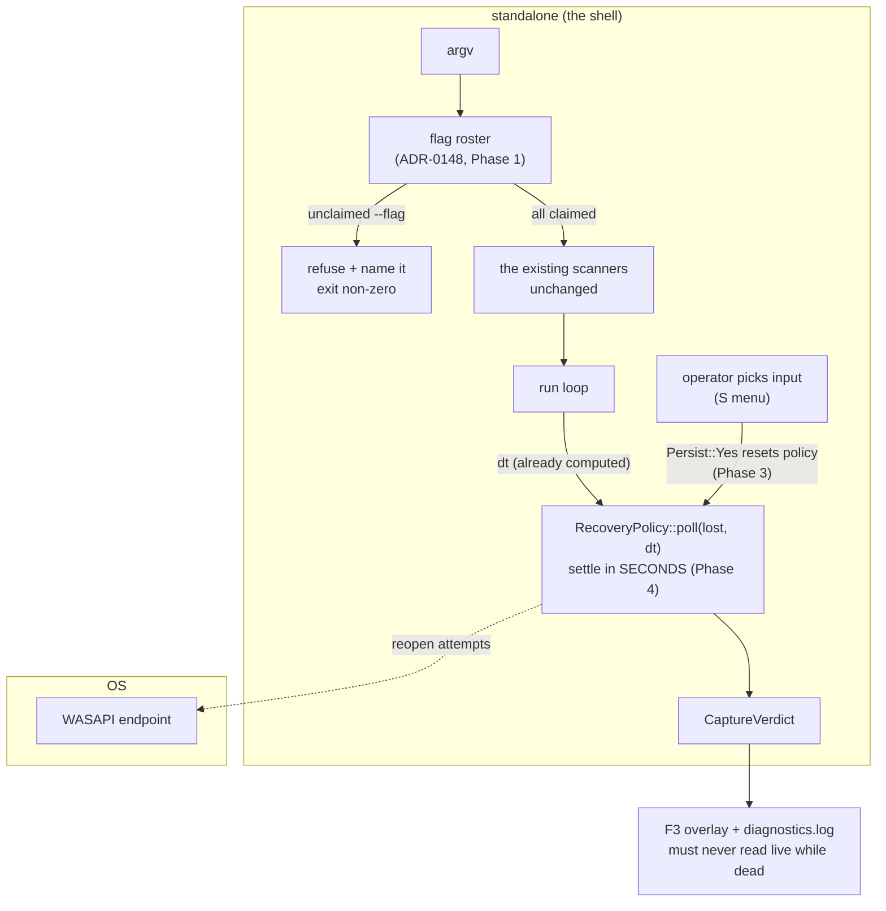

# 0135 — The show-night surfaces stop lying

> **Status:** in-progress
> **Created:** 2026-08-29
> **Owner skill(s):** dev, human
> **Related ADRs:** [0148](../adrs/0148-the-cli-refuses-an-argument-no-scanner-claimed.md) (proposed)
> **Closes:** design-backlog 0159, 0156, 0155. **0154 is carried, not closed** — see Phase 5.

## TL;DR

Four defects share one property: **the standalone tells an operator something that is not true, on
the paths that only matter during a performance.** A misspelt `--osc` starts a visualizer with a
dark rig and says nothing; a capture that died inside the recovery settle window keeps reporting
`live` while delivering nothing; the settle window itself is counted in frames, so the guarantee it
buys is ~1 s on a 60 Hz display and ~250 ms on a 240 Hz one. The first visible behavior is
`lmv --ocs 127.0.0.1:9000` refusing to start and naming the misspelling.

## Context & problem

Three of these four entries were filed at [Plan 0130](done/0130-the-audio-input-becomes-an-operator-surface.md)'s
Mode 4 review and the fourth on the pinned 2026-08-29 show build, while hardening the live lighting
path. They are grouped here because they share files (`standalone/src/main.rs`,
`standalone/src/capture_win.rs`), share a failure class, and share an audience — the operator
reading a surface mid-show, who has no source access and no time.

The class is worth naming precisely, because it is what makes four low-severity entries worth one
plan. **None of these is a crash and none renders wrong.** Every one of them is a surface that
states the opposite of what is happening, on a path reachable only when something has already gone
wrong. [Plan 0083](done/0083-the-build-says-why-it-hears-nothing.md) built `CaptureVerdict` to
prevent exactly that, and [Plan 0130](done/0130-the-audio-input-becomes-an-operator-surface.md)
added the `Lost` variant for the single job of distinguishing a run that had audio and lost it from
one that never had any. Backlog 0156 is the path where that variant states the opposite.

The forcing function is [Plan 0133](0133-the-engine-drives-the-lights.md): once `standalone` drives
physical fixtures, the room is the only evidence a flag took effect, and a lying surface costs a
show rather than a debugging session.

**What this plan does not assume.** Backlog 0154 (a COM `REGDB_E_CLASSNOTREG` on one activation in
22) names three candidate fixes and says plainly that choosing between them *"wants the unplug
evidence rather than more reasoning"*. That evidence has never been gathered —
[`docs/on-device-validation.md`](../on-device-validation.md)'s unplug item has never run. This plan
therefore gathers it and does **not** pre-commit to a repair.

## Decision

**Take the three entries whose fix shape is settled, and gate the fourth behind the evidence it
asks for.** Phases 1-2 are the CLI (ADR-0148); Phase 3 resets the recovery policy on an
operator-initiated restart, which is one line and also removes the surprise that a manual swap does
not restore the retry budget; Phase 4 moves the settle window from frames to seconds, using the real
`dt` the standalone already computes eleven lines below the call site. Phase 5 is a `human` unplug
gate that produces 0154's missing evidence and **decides nothing on its own** — if it convicts a
mechanism, the entry is updated and an ADR follows in a later plan.

We rejected folding 0154's fix in on a guess, because all three of its candidate shapes are
defensible and one of them (a long-lived enumerator on the render thread) is a structural change to
COM lifetime that would be expensive to reverse. We also rejected splitting the CLI work into its
own plan, because Phase 3 and Phase 4 touch `main.rs` in the same region and a second lane would
contend with this one for no benefit.

## Architecture diagram



## Implementation phases

### Phase 1 — The binary knows its own flags
- **Owner skill:** dev
- **What:** Add the `FlagSpec` roster and the single pre-scanner pass that refuses an unclaimed
  `--`-prefixed argument, per [ADR-0148](../adrs/0148-the-cli-refuses-an-argument-no-scanner-claimed.md).
  No scanner changes shape.
- **Files touched:** `standalone/src/main.rs`.
- **Notes for the implementer:**
  - The roster is `&[FlagSpec]` — name, takes-a-value, one line of help. Keep it adjacent to the
    scanners it describes so a reader adding a flag sees both.
  - The near-miss suggestion is the point of the error, not decoration: `--ocs` must name `--osc`.
    A plain edit distance over the roster is enough; do not add a crate for it.
  - **Refusal is a hard exit.** ADR-0148's Alternative C records why a warning was rejected.
- **Done when:**
  - `lmv --definitely-not-a-flag` exits non-zero naming the argument, and `lmv --ocs 127.0.0.1:9000`
    exits non-zero naming `--osc` as the nearest match. Both are the entry's own reduction and are
    re-runnable against any build.
  - Every flag `README.md` documents starts the app when spelled correctly — the roster is additive,
    and a flag that regresses to being refused is a Phase 1 failure, not an acceptable cost.

### Phase 2 — `--help` prints the roster and exits
- **Owner skill:** dev
- **What:** `lmv --help` (and `-h`) prints the roster with its help text and exits 0.
- **Files touched:** `standalone/src/main.rs`, `README.md` (point the flags section at `--help` as
  the authority rather than restating the list a third time).
- **Notes for the implementer:**
  - **This is what a guard shells out to**, and one already hung the lighting runner doing it.
    `--help` must write to stdout and exit without creating a window, a wgpu device or a capture
    client — assert the exit, not just the output.
  - A test asserting every `--`-prefixed string literal reachable from the scanners appears in the
    roster is ADR-0148's drift gate and belongs in this phase, not Phase 1, because it is what makes
    `--help` trustworthy rather than merely present.
- **Done when:**
  - `lmv --help` prints usage and exits 0 in under a second, with no window shown.
  - The literal-scan test fails if a flag is added to a scanner and not to the roster (`dev` states
    the check it used).

### Phase 3 — An operator's choice is a new incident
- **Owner skill:** dev
- **What:** Close backlog 0156. A `Persist::Yes` restart resets `RecoveryPolicy`, so a stream that
  dies after an operator-initiated swap writes its own verdict instead of inheriting a spent
  latch.
- **Files touched:** `standalone/src/main.rs`.
- **Notes for the implementer:**
  - The bug is that the inherited state silences the **verdict**, not that it withholds the budget.
    Resetting the policy fixes both, and the budget half is a deliberate behavior named in
    `INPUT_RECOVERY_SETTLE_FRAMES`'s own comment — so **state in the log that the reset changes it
    on purpose**, and correct that comment.
  - Two comment corrections in the same file ride along, both non-behavioural and both from the
    entry: `restart_capture`'s *"it is what was asked for, so the row shows it"* is false of the
    `Input device` row (a failed start leaves `capture_endpoint` `None`, so the row reads `default`
    while `self.input.device` holds the operator's pick); and `settings.rs`'s header calls `Tier`
    and `InputMode` *"two config enums"* when `Tier` is `lmv_core::render::Tier`, a core type a
    config key happens to name.
- **Done when:**
  - After a give-up, a manual swap, and a death inside the settle window, the capture verdict reads
    `lost`, not `live` — asserted as a test over the policy state machine, which needs no device.
  - The retry budget is restored by an operator swap, and a test says so.

### Phase 4 — The settle window is in seconds
- **Owner skill:** dev
- **What:** Close backlog 0155. `RecoveryPolicy::poll` takes `dt` and accumulates against an
  `INPUT_RECOVERY_SETTLE_SECS`.
- **Files touched:** `standalone/src/main.rs`.
- **Notes for the implementer:**
  - The `dt` is already computed in `redraw`, eleven lines below the `poll_input_lost()` call. This
    is threading one `f32`, not building a clock.
  - **This project decided this question once already**: Plan 0014 retired `SCENE_DT` for an injected
    real `dt` so behaviour would be identical on every device. This is the same rule reaching a
    policy constant that predates it.
  - Pick the seconds value from what the frame count *meant on the machine it was written on*, and
    say so in the constant's comment per ADR-0071 — the dev box is at 165 Hz, where 60 frames is
    ~360 ms, not the ~1 s a reader assumes.
- **Done when:**
  - The settle test asserts the window from both sides in seconds, and passes when fed frame times
    for 30 Hz and 240 Hz — the two ends where the frame-count version gave different guarantees.
  - No remaining constant in the recovery path is expressed in frames.

### Phase 5 — The unplug gate (evidence only, no repair)
- **Owner skill:** human
- **What:** Run [`docs/on-device-validation.md`](../on-device-validation.md)'s unplug item, which has
  never run, and record what the recovery path actually does against a real endpoint removal.
- **Files touched:** `docs/design-backlog.md` (a dated update on entry 0154),
  `docs/on-device-validation.md` (the item's result).
- **Notes for the implementer:**
  - **This phase writes no code and picks no fix.** Backlog 0154 names three shapes and says the
    choice wants this evidence; producing the evidence is the whole deliverable.
  - What to capture: whether `CoCreateInstance` ever returns `REGDB_E_CLASSNOTREG` during a *real*
    loss (as opposed to the menu-speed churn where it was seen), how many of the three attempts a
    real unplug consumes, and whether the verdict that lands names the right cause.
  - Run it **after** Phases 3 and 4, so the policy under test is the repaired one.
  - One activation in 22 is a single sample, not a rate. If the error does not reproduce, that is a
    result worth recording, not a failed phase.
- **Done when:**
  - Backlog 0154 carries a dated update stating what was observed, and either names the fix the
    evidence selects or states that the evidence did not separate the three.
  - `docs/on-device-validation.md`'s unplug item is no longer marked as never-run.

## Data shapes

```rust
// illustrative — not the final interface
struct FlagSpec {
    name: &'static str,   // "--osc", including the dashes
    takes_value: bool,    // whether the next argv entry belongs to it
    help: &'static str,   // one line, printed by --help
}

// Phase 4: the policy takes real elapsed time, not a frame tick.
impl RecoveryPolicy {
    fn poll(&mut self, lost: bool, dt: f32) -> Recovery { /* … */ }
}
```

## Risks & open questions

- **Phase 1 is a behavior change on the startup path, and `main.rs` is contended.**
  [Plan 0131](done/0131-the-operator-gets-a-console.md) is being built directly on `main` inside this
  file and [Plan 0126](0126-the-large-files-split-along-their-seams.md) Phase 7 splits it. Sequence
  this behind 0126 if both are live, or expect a merge. The roster is additive and localized, which
  is the mitigation.
- **A hard exit will surface stale flags in the user's own shortcuts** on the first run after the
  change. That is the intended behavior and it is also the most likely way this plan annoys its
  author. Phase 1's second done-when exists to catch the case where the roster is *wrong* rather
  than the invocation.
- **Phase 5 may produce nothing.** A 1-in-22 error observed once under menu churn may not appear
  during a real unplug at all. The phase is still worth running — the unplug item has never run for
  any reason, and 0156's repair is on that same path.
- **The literal-scan drift gate is one-directional.** It cannot assert that every roster entry is
  reachable, so a retired flag can linger in `--help`. Recorded as a Negative in ADR-0148 rather
  than solved here.

## What this plan does NOT do

- **It does not restructure argument parsing.** ADR-0148's Alternative A — scanners reporting what
  they claimed — is the structurally right answer and is explicitly deferred, not rejected on merit.
- **It does not fix backlog 0154.** Phase 5 gathers evidence; the repair is a later plan's, with an
  ADR if the evidence supports a structural change.
- **It does not touch the Art-Net or OSC paths themselves.** Those are
  [Plan 0133](0133-the-engine-drives-the-lights.md)'s. This plan only makes a misspelt flag reaching
  them impossible to miss.
- **It adds no CLI dependency.** See ADR-0148 Alternative B.

## Implementation log

> Written by `dev` — one row per phase as that phase's commit lands, and the close block after the
> last one. **The phases above are the contract; everything here is what happened.**

**Lane:** `WORK/lmv-plan-0135` on `plan-0135-show-night-surfaces`

| phase | owner | state | commit |
|---|---|---|---|
| 1 — The binary knows its own flags | dev | done | `915fc74` |
| 2 — `--help` prints the roster and exits | dev | done | `c937026` |
| 3 — An operator's choice is a new incident | dev | done | `e0fd1a7` |
| 4 — The settle window is in seconds | dev | done | committed with this row |
| 5 — The unplug gate (evidence only) | human | not started | |

### Notes

### Close triggers

- **`presets/` touched:**
- **Plan header `Closes:`**
- **What shipped:**
- **Operator docs touched:**
- **Backlog probes (`node scripts/check-backlog-claims.mjs`):**
- **Outstanding `human` phases:**
