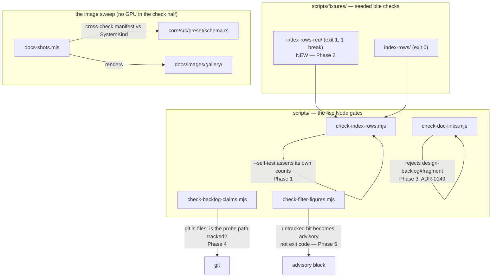

# 0136 — The gates can convict

> **Status:** approved
> **Created:** 2026-08-29
> **Owner skill(s):** dev, human
> **Related ADRs:** [0149](../adrs/0149-a-backlog-reference-is-a-bare-number-and-a-file-link.md) (proposed)
> **Closes:** design-backlog 0104, 0143, 0162, 0127, 0133. **0160 and 0161 are corrected in place,
> not closed** — see Phase 6.

## TL;DR

This repository verifies itself with five Node gates and a rendered-image sweep, and several of
them cannot fail when they should. `check-index-rows.mjs` has no assertion it can convict with — a
mutation that makes its row detector match nothing still exits 0 at all three call sites.
`check-backlog-claims.mjs` resolves probe paths against the working tree, so a probe pointing into
gitignored territory passes on the authoring machine and can only ever fail on CI, after the push.
`docs-shots.mjs` throws before rendering anything and has done since 2026-08-15, so four committed
gallery images show a stroke the engine no longer draws. The first visible behavior is a seeded red
fixture that makes `check-index-rows.mjs` exit 1 on demand.

## Context & problem

[ADR-0033](../adrs/0033-testing-strategy-coverage-ratchet-and-pre-push-gate.md)'s whole argument is
that **a rule nothing re-runs is a rule nobody follows**. The corollary this plan addresses is
sharper: *a check that re-runs and cannot fail is the same rule wearing a green tick.*

That failure has now been found and repaired twice —
[Plan 0084](done/0084-two-gates-stop-lying-about-what-they-check.md) found the link checker covering
one of markdown's two link forms, and
[Plan 0094](done/0094-the-two-doc-gates-check-what-they-claim-to.md) found a directory-name skip
swallowing a real tree plus a whole half of ADR-0108's rule invisible to a bullet-driven check. Both
gates now ship fixtures expecting **exit 1 with an exact break count**. `check-index-rows.mjs` is the
one of the three that was never given that treatment, and its fixture asserts exit 0 — a choice
`scripts/fixtures/README.md` argues was correct against a tree holding 136 over-cap rows, and which
Plan 0105's own later phases made false.

The demonstration is in backlog 0104 and is not hypothetical: copying the script and replacing
`TABLE_ROW` and `BULLET` with regexes that match nothing yields `3 regions, 0 rows, 0 over cap` and
**exit 0**, from the fixture and from the repository alike. Pre-push, the CI `links` job and the
architect close ceremony all go green. The per-file counts the script prints are the documented
mitigation, and they are *printed*, not asserted.

Two of the six entries here have a common shape worth naming: **the gate is green precisely where
the fix would be cheap.** 0162's probe-path bug goes green at pre-push and red on CI, so the author
learns from a runner after pushing that a claim they verified does not verify. 0133's image sweep
fails only for the human who tries to run it at a close, eleven days after the commit that broke it.

## Decision

**Repair the instruments before trusting more findings from them**, and take the entries in
increasing order of how much judgement they need. Phases 1-2 give `check-index-rows.mjs` both shapes
backlog 0104 names — they are explicitly not exclusive, the `--self-test` covers the demonstrated
mutation and the red fixture covers the reporting path that nothing currently runs. Phase 3
implements [ADR-0149](../adrs/0149-a-backlog-reference-is-a-bare-number-and-a-file-link.md). Phase 4
teaches the claim gate to ask git whether a probe path is tracked. Phase 5 takes the figure gate's
untracked-file complaint as an advisory rather than an exit code. Phase 6 corrects two entries whose
premise ADR-0147 falsified this morning. Phase 7 revives the image sweep, and Phase 8 is the human
look at what it re-shoots.

We rejected doing the doc-image work first even though it is the most visibly stale thing here,
because Phase 7's manifest decision wants `warp_mesh` to have something to be a picture *of*, and
that is a content question the plan should reach with its cheap mechanical work already banked.

## Architecture diagram

## Implementation phases

### Phase 1 — The row gate asserts its own counts
- **Owner skill:** dev
- **What:** Close the first half of backlog 0104. Add `--self-test` to `check-index-rows.mjs` on the
  model `check-backlog-claims.mjs` already carries, asserting the green fixture's own counts so a
  detector that finds nothing fails loudly.
- **Files touched:** `scripts/check-index-rows.mjs`, `scripts/fixtures/README.md`.
- **Notes for the implementer:**
  - The assertion is the fixture's **exact** region and row counts (3 regions, 4 rows), not a
    non-zero check. A `> 0` assertion survives a detector that matches one row in ten.
  - `check-backlog-claims.mjs`'s `--self-test` additionally pins a non-vacuity assertion to the
    **real repository** rather than to the fixture. Do the same here — the repository's own row
    count is what a matches-nothing mutation collapses.
  - Wire `--self-test` into the same call sites the gate already has, or it is a mechanism nobody
    runs, which is the defect being repaired.
- **Done when:**
  - Replacing `TABLE_ROW` and `BULLET` with regexes that match nothing makes the gate exit non-zero.
    That mutation is backlog 0104's own reduction; `dev` states the result of running it.
  - The unmutated gate still exits 0 on the current tree.

### Phase 2 — A seeded tree the row gate rejects
- **Owner skill:** dev
- **What:** Close the second half of backlog 0104. Add `scripts/fixtures/index-rows-red/` holding one
  over-cap row inside a marked region, run as its own root and expected to exit 1 with exactly one
  break.
- **Files touched:** `scripts/fixtures/index-rows-red/**` (new), `scripts/fixtures/README.md`,
  `.githooks/pre-push` and the CI `links` job if the fixture needs its own invocation.
- **Notes for the implementer:**
  - **Do not flip the existing green fixture.** It carries four negative assertions (a row outside
    markers, an unmarked table, and so on) that are worth keeping; the entry is explicit that the two
    shapes are complementary.
  - Expect **exit 1 with an exact break count**, matching what Plans 0084 and 0094 established for
    the sibling gates. A bare "exits non-zero" passes on a crash.
  - This is the phase that exercises the reporting path — the `file:line N bytes (cap C)` formatting
    — which nothing currently runs at all.
- **Done when:** the red fixture exits 1 naming exactly one over-cap row, and a change that breaks the
  reporting format fails it rather than printing garbage and passing.

### Phase 3 — Backlog references stop using fragments
- **Owner skill:** dev
- **What:** Close backlog 0143. Implement
  [ADR-0149](../adrs/0149-a-backlog-reference-is-a-bare-number-and-a-file-link.md): rewrite all 24
  anchored references to the bare-number-plus-file-link form, and teach `check-doc-links.mjs` to
  reject a `design-backlog.md#…` or `design-backlog-archive.md#…` fragment.
- **Files touched:** `scripts/check-doc-links.mjs`, plus roughly 20 files under `docs/adrs/` and
  `docs/plans/done/`.
- **Notes for the implementer:**
  - The 20 archived numbers are listed in ADR-0149's Context. Re-derive the set rather than trusting
    the list — it was measured 2026-08-27 and closes have run since.
  - **This edits append-only documents.** ADR-0149's Decision permits it and says why; the edit is
    the link form and nothing else. Do not reword surrounding prose, and do not add `Outcome`
    sections.
  - The new rule needs its own fixture bite, or it joins the class this plan exists to fix.
- **Done when:**
  - No `design-backlog*.md#` fragment remains in the repository, and adding one back fails
    `check-doc-links.mjs`.
  - The gate still exits 0 on the repaired tree.

### Phase 4 — A probe path is checked against the repository, not the disk
- **Owner skill:** dev
- **What:** Close backlog 0162. `check-backlog-claims.mjs` asks git whether a probe path is tracked,
  and reports *"probe path is not tracked"* rather than passing locally and failing only on CI.
- **Files touched:** `scripts/check-backlog-claims.mjs`, `scripts/fixtures/**`.
- **Notes for the implementer:**
  - `git ls-files -- <path>` returns nothing for an untracked path and handles directories, which
    probe paths often are, so a non-empty result is the whole test. `git check-ignore -q` answers
    from the other side.
  - **Batch it.** One invocation covering the whole probe set keeps this to a single process, the way
    the staleness advisory already batches its `git log`.
  - The message matters as much as the check: a CI reader currently gets *"does not exist"* for a
    file sitting in front of them in their own tree.
  - Preserve the shallow-clone courtesy already in the advisory — if git cannot answer, print a
    notice in ADR-0016's shape rather than failing 25 entries.
- **Done when:**
  - A probe naming a path under `renders/` (gitignored in full) is reported as untracked by a local
    run, where today it passes.
  - The gate still exits 0 on the current tree, and its `--self-test` still holds.

### Phase 5 — The figure gate stops convicting untracked files
- **Owner skill:** dev
- **What:** Close backlog 0127. `check-filter-figures.mjs` keeps walking the working tree, but an
  untracked hit becomes an **advisory that does not set the exit code**.
- **Files touched:** `scripts/check-filter-figures.mjs`, `scripts/fixtures/**`.
- **Notes for the implementer:**
  - The entry costs the counter-argument honestly and lands on this shape: restricting the scan to
    `git ls-files` buys ergonomics and **gives up the gate's whole reason for existing**, which is
    that the copy that broke it was the one outside the list anyone was checking (ADR-0122).
    Advisory keeps both.
  - Use the shape `check-backlog-claims.mjs`'s advisory block already uses, so there is one idiom for
    "reported, never part of the exit code" rather than two.
- **Done when:** a gitignored file carrying a cost figure is named in the advisory and does not fail
  the pre-push hook; a **tracked** one still fails it.

### Phase 6 — Two entries whose premise the store revocation falsified
- **Owner skill:** dev
- **What:** Correct backlog 0160 and 0161 in place. Neither is closed.
- **Files touched:** `docs/design-backlog.md`, `standalone/tests/shot_cli.rs`,
  `packaging/macos/bundle.sh`, `renders/README.md`.
- **Notes for the implementer:**
  - **Read this before editing.** Both entries were filed 2026-08-29 against
    [ADR-0141](../adrs/0141-one-artifact-store-serves-every-lane.md)'s shared store, and
    [ADR-0147](../adrs/0147-the-shared-artifact-store-is-revoked-and-the-linker-stays.md) revoked
    that store the same day. Entry 0160's stated defect — *"a `target/` inside the worktree that no
    redirect reaches"* — **no longer holds**: with each lane writing to its own `target/`,
    `repo_root().join("target")` is the build tree again and the doc comment it convicts is correct.
    Per the architect's rule, an entry whose premise turns out false is **corrected in place and
    stays live**, because a wrong live entry sends the next reader to do work already done.
  - What survives in 0160 is smaller and real: `scratch()` derives a build path from
    `CARGO_MANIFEST_DIR` rather than from where cargo writes, which is fragile if a redirect ever
    returns. `env!("CARGO_TARGET_TMPDIR")` is the fix and is right under any layout.
  - 0161 survives intact — the documentation still says *"never hardcode `<repo>/target` in a script
    or a test"* and `packaging/macos/bundle.sh` still does, on a **release** path. The two
    `renders/` scripts are archived one-offs; a line in `renders/README.md` is an honest resolution
    for those.
  - **Re-run `node scripts/check-backlog-claims.mjs` after editing.** Several probes on these two
    entries were written to go red on delivery.
- **Done when:**
  - 0160 carries a dated update naming ADR-0147 as what falsified its premise, and states the
    reduced claim that remains.
  - `bundle.sh` resolves `target_directory` from `cargo metadata`, the way `plugin-foobar/build.ps1`
    already does.
  - The claim gate exits 0.

### Phase 7 — The image sweep runs again
- **Owner skill:** dev
- **What:** Close backlog 0133. Add the three missing gallery manifest entries so `docs-shots.mjs`
  stops throwing, and move its manifest-vs-`SystemKind` cross-check somewhere that runs without
  rendering.
- **Files touched:** `scripts/docs-shots.mjs`, `docs/images/gallery/**`, and the cross-check's new
  home (`core/tests/` or the CI `links` job).
- **Notes for the implementer:**
  - The guard is **not** the bug — it is doing exactly what its comment says and it caught exactly
    what it was built for. What failed is the cadence: the only thing that executes it is a human at
    a close, and [ADR-0100](../adrs/0100-documentation-images-are-committed-headless-renders.md)
    deliberately keeps the *rendering* out of CI because renders are not byte-reproducible.
  - **The cross-check is pure text.** It reads the manifest and `schema.rs` and needs no GPU, so it
    can fail on the commit that ships a scene instead of silently disabling the sweep for eleven
    days. That is a different claim from "the images are current", which ADR-0100 correctly refuses
    to gate — keep them separate.
  - `shape_field` and `shape_collage` have obvious shipped worlds (`shape_pulse`,
    `collage_suprematist`). `warp_mesh` ships none, so it needs a fixture bundle or a converted
    `.milk` named in the manifest's provenance line like every other entry — that is the Phase 8
    question, so leave a placeholder rather than guessing.
  - **This phase renders.** It needs a free GPU and must not run while a show is live.
- **Done when:**
  - `node scripts/docs-shots.mjs` completes without throwing and re-shoots the eight images that
    have nothing to do with the three missing systems.
  - Adding a thirteenth `SystemKind` with no gallery entry fails a check that runs without a GPU.

### Phase 8 — What the pictures are of
- **Owner skill:** human
- **What:** Decide what `warp_mesh` should be a picture *of*, and look at the re-shot gallery.
- **Files touched:** `scripts/docs-shots.mjs` (the provenance line), `docs/images/gallery/**`.
- **Notes for the implementer:**
  - Four of the nine gallery images (`parametric_curve`, `lsystem`, `star_pattern`, `spectrum`) show
    a stroke the engine no longer draws — Plan 0114 moved the line stroke's default `softness` and
    retuned six line presets. Phase 7 re-shoots them; **this phase is where someone confirms the new
    ones are actually better**, which no script can answer.
  - `warp_mesh` ships no preset. The options are a fixture bundle or a converted `.milk`, and the
    choice is content, not engineering.
- **Done when:** the gallery has twelve images, each with a provenance line, and the user has seen
  them.

## Risks & open questions

- **Phase 3 edits ~20 append-only documents.** ADR-0149 argues a link form is not content, and that
  argument is the load-bearing part of this plan's most reversible-looking phase. If it is rejected
  at review, Phase 3 reverts cleanly and ADR-0149 is superseded; nothing else in the plan depends on
  it.
- **Phase 6 is the one phase that edits the backlog rather than the code**, and its judgement — that
  0160's premise is falsified — could be wrong if a redirect returns. It is written as a dated
  correction rather than an archive precisely so it survives that.
- **Phase 7 needs a GPU and this plan may be taken while shows are running.** Phases 1-6 need
  none — they are Node, markdown and one shell script — so the plan is safely splittable at that
  seam if the machine is busy.
- **The gates repaired here are the ones that verified this plan's own siblings.** Anything Phase 1
  or Phase 4 turns up may retroactively weaken a finding from an earlier close. That is the point,
  and it should be reported rather than quietly absorbed.

## What this plan does NOT do

- **It does not add a general fragment checker.** ADR-0149 handles one class by prohibition and says
  why the general checker got less likely as a result.
- **It does not gate image freshness.** ADR-0100's refusal to put non-reproducible renders in CI
  stands; only the text cross-check moves.
- **It does not close backlog 0160 or 0161.** Phase 6 corrects and reduces them.
- **It does not touch `check-comment-hygiene.mjs`**, the one gate in `scripts/` with no live
  complaint against it.
