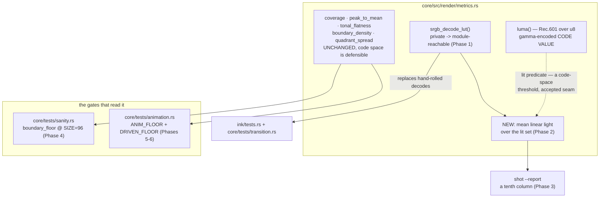

# 0137 — The metrics measure light

> **Status:** in-progress
> **Created:** 2026-08-29
> **Owner skill(s):** dev
> **Related ADRs:** [0150](../adrs/0150-the-level-question-is-asked-in-linear-light.md) (proposed),
> [0071](../adrs/0071-a-numeric-test-contract-states-a-property-or-names-its-machine.md)
> **Closes:** design-backlog 0132, 0130, 0151, 0152.

## TL;DR

Four entries about the same instrument. `metrics` answers no level question at all, and the
substitute anyone reaches for — a mean over `luma()` — measures gamma-encoded code value, so a
30 % brightness trim reads as 5 %. `boundary_density` scales with the capture resolution and neither
it nor its two floors names the 96x96 they were measured at. `animation.rs`'s `DRIVEN_FLOOR` says
two non-vacuity probes are *"pinned as standing tests below"* and one of them is printed and
discarded. `ANIM_FLOOR`'s derivation says "the shipped library's minimum" when the gate now has two
branches and the phrase has three defensible readings, two orders of magnitude apart. The first
visible behavior is a level column in `shot --report` that moves when a preset's brightness does.

## Context & problem

Three of these were filed at Mode 4 reviews (Plans 0119 and 0123) and one by `preset-author` at
Plan 0114 Phase 6, where a retune brief's own question — *does a crisper stroke read brighter, and
roughly by how much* — had no instrument and the lane had to write one in a scratch directory.

They share a failure shape that this project has now hit repeatedly: **the obvious experiment
returns a reading, and the reading is meaningless.** Nothing is broken, every gate is green, and the
encoded mean produces a plausible number for anyone who does not stop to ask what space it is in.
The same shape appears in `boundary_density`, whose docstring reads as scale-freeness — *"a solid
mass … reads near zero **however large it is**"* — where size is exactly the direction in which it
is not free: a 4x4 solid block reads `1.0000`.

Two of the four are assertion and prose defects rather than measurement defects, and they belong
here because they are in the same two files and share the same root: **a comment that reads like
coverage.** `DRIVEN_FLOOR`'s claim that both probes are pinned survives review precisely because it
sounds like it was checked. `ANIM_FLOOR`'s derivation instructs a future reader to re-derive from
the printed sweep, and following that instruction now yields `0.0025` off the top of the sorted
output — which would halve the floor to `0.00125` and admit the one-pixel flicker the same
comment's noise-ceiling paragraph exists to exclude. **The instruction and the arithmetic disagree,
and only prose stands between them.**

## Decision

**Add the missing level statistic per
[ADR-0150](../adrs/0150-the-level-question-is-asked-in-linear-light.md), then repair the three
claims the module and its gates make about themselves.** Phase 1 makes the sRGB decode reachable and
retires the two hand-rolled copies — it is a pure refactor and lands first so the rest builds on one
decode. Phase 2 adds the statistic. Phase 3 gives it a `--report` column. Phases 4-6 are the
documentation and assertion repairs, each independent of the others.

We rejected moving the existing shape statistics to linear light (ADR-0150 Alternative B): it moves
blessed baselines across the whole suite for no gain to the question being asked, and a large diff
of moved numbers is where a real regression hides. We also rejected fixing `boundary_density`'s
resolution dependence rather than documenting it — the gate runs at 96 and only at 96, the statistic
is correct there, and the defect is that **no test at the configuration this project develops on can
distinguish a resolution-bound constant from a resolution-free one.**

## Architecture diagram



## Implementation phases

### Phase 1 — One sRGB decode
- **Owner skill:** dev
- **What:** Make `srgb_decode_lut` reachable inside `metrics` and replace the hand-rolled decodes in
  `core/src/render/ink/tests.rs` and `core/tests/transition.rs` with it.
- **Files touched:** `core/src/render/metrics.rs`, `core/src/render/ink/tests.rs`,
  `core/tests/transition.rs`.
- **Notes for the implementer:**
  - Pure refactor. **No test's asserted value may move.** If one does, the hand-rolled copy differed
    from the table and that is a finding to report, not to bless.
  - `linear_diff`'s doc comment carries the reasoning for decoding and should be the place the module
    now points at, rather than repeating it.
- **Done when:** exactly one sRGB decode table exists in the workspace, and the transition and ink
  suites pass with their existing expected values unchanged.

### Phase 2 — A level statistic
- **Owner skill:** dev
- **What:** Add the mean-linear-light-over-the-lit-set statistic to `metrics`, per ADR-0150.
- **Files touched:** `core/src/render/metrics.rs`.
- **Notes for the implementer:**
  - The lit predicate is the one `coverage` already defines. **Do not invent a second one**, and do
    not change `coverage`.
  - **The doc comment must state the seam**: this is linear light over a set selected by a code-space
    threshold. ADR-0150's Decision says why that is accepted rather than solved, and a reader who
    does not know it will eventually "fix" the wrong half.
  - Anchor the statistic with the entry's own measurement as a test: on a frame where the source
    trim is 30 %, the encoded mean moves ~5 % and the linear reading ~13 %. Per
    [ADR-0071](../adrs/0071-a-numeric-test-contract-states-a-property-or-names-its-machine.md), state
    that as a **property** (the linear reading responds substantially more than the encoded one to
    the same trim), not as a frozen pair of numbers — the exact figures are `star_rosewindow` on one
    adapter.
- **Done when:** trimming a preset's `brightness` by 30 % moves the new statistic by substantially
  more than it moves a mean over `luma()`, asserted as a property in a test that names neither a
  machine nor a frozen constant.

### Phase 3 — A column for it
- **Owner skill:** dev
- **What:** Give `shot --report` a level column.
- **Files touched:** `standalone/src/shot/report.rs`, `docs/capturing.md`.
- **Notes for the implementer:**
  - **This widens the header string that backlog 0132's own probe pins.** That probe was rewritten
    once already (Plan 0121 broke it by widening the header) to pin the numeric-column *shape*
    rather than each name. Widening it again is expected — update the probe, do not work around it.
  - `docs/capturing.md` documents `--report`'s columns and is a required operator-doc sweep.
- **Done when:** `shot --presets presets --report` prints a level column for every preset, and
  `docs/capturing.md` describes what it measures and in what space.

### Phase 4 — `boundary_density` says what it is bound to
- **Owner skill:** dev
- **What:** Close backlog 0130. Two doc comments; no constant moves.
- **Files touched:** `core/src/render/metrics.rs`, `core/tests/sanity.rs`.
- **Notes for the implementer:**
  - `boundary_density` counts perimeter over area, so the ratio goes as ~1/L in the capture's linear
    resolution — the same scene at 192x192 reads roughly half what it reads at 96x96, and a solid
    disc of radius `r` px reads about `2/r`. Say that, and say the reading is comparable only at a
    fixed capture.
  - The docstring's *"reads near zero **however large it is**"* is the sentence that misleads, and it
    is wrong in the size direction specifically. Correct it rather than appending a caveat under it.
  - Add "measured at the 96x96 sanity capture" to `boundary_floor`'s derivation paragraph. That
    paragraph already names the date and revision per ADR-0071 — the capture size is the one part of
    the configuration the number is actually bound to, and it is the part missing.
  - `radial_shell_occupancy`, three functions away in the same file, names the sanity suite's 96x96
    three times in one doc comment for a weaker coupling. Match that convention.
- **Done when:** both doc comments name the capture size the numbers are bound to, and the
  scale-freeness sentence no longer claims size-independence. No asserted value changes.

### Phase 5 — The driven floor's second probe is actually pinned
- **Owner skill:** dev
- **What:** Close backlog 0151. One `match` arm and two assertions in `core/tests/animation.rs`.
- **Files touched:** `core/tests/animation.rs`.
- **Notes for the implementer:**
  - `rosette_spin_only` is **not** an interchangeable second zero. `star_frozen` is frozen in both
    readings, so its driven zero is consistent with any broken driven statistic — one measuring
    nothing at all would satisfy it exactly as well. `rosette_spin_only` turns steadily on its own
    clock and binds no band, so it is the single probe in the file that says the driven reading
    responds to **the music** rather than to motion.
  - Assert **both** halves: `rosette.driven < DRIVEN_FLOOR`, and the silent half
    `>= ANIM_FLOOR` so the probe cannot quietly stop moving and make the driven zero vacuous.
  - The failure message should name what a failure would mean — that autonomous motion has leaked
    into the driven differential.
- **Done when:** `DRIVEN_FLOOR`'s comment claim that both probes are pinned as standing tests is
  true, and a mutation letting autonomous motion into the driven reading fails this test where it
  previously passed (`dev` states the mutation used).

### Phase 6 — Both floors name their population
- **Owner skill:** dev
- **What:** Close backlog 0152. Prose only; **no constant moves.**
- **Files touched:** `core/tests/animation.rs`.
- **Notes for the implementer:**
  - The floor is not wrong: `0.01` sits under the silent-branch minimum `0.0201` with 2.01x slack,
    which is the 2.05x the comment claims to within rounding. What is wrong is the *statement*.
  - Name the population in both derivations — *"the minimum among presets that pass **this
    branch**"* — and say why the other branch's presets are excluded. Re-measure and record the
    number and preset; the comment currently names `Banded Mandala` at `0.0205`, which is no longer
    the minimum of either reading.
  - **`DRIVEN_FLOOR` inherited the same phrasing** and is unambiguous today only by luck, because no
    shipped preset yet sits below it on the branch it gates. Fix both.
  - The hazard being closed is concrete: a reader following the comment's own instruction to
    re-derive from the printed sweep reads `0.0025` off the top of the sorted output and would halve
    the floor to `0.00125`, admitting ADR-0091's `1/139 = 0.0072` one-pixel flicker that the same
    comment's noise-ceiling paragraph exists to exclude.
- **Done when:** both derivations name the population they measured over, and re-deriving by
  following the comment's instruction lands on the floor that is actually there.

## Data shapes

```rust
// illustrative — not the final interface
// Linear light over the lit set. The lit predicate is coverage's, which is a
// threshold in CODE space: this is linear light over a code-space-selected set.
// ADR-0150 records why that seam is accepted rather than solved.
pub fn mean_lit_level(px: &[u8], w: u32, h: u32) -> f32;
```

## Risks & open questions

- **Phase 1 touches `core/tests/transition.rs`, whose assertions are about timing, not level.** A
  mistake there breaks tests in an area this plan is not otherwise reasoning about. The mitigation is
  that no expected value may move — if one does, stop.
- **Phase 3 widens a header string that a backlog probe pins**, and that probe has already been
  broken once by exactly this. Expected and planned for, but it means `check-backlog-claims.mjs`
  will go red mid-plan and that is not a finding.
- **The level statistic is background-independent by construction**, so a preset that goes wrong by
  changing its background is invisible to it. ADR-0150 records this as a Negative; it is the correct
  tradeoff for the question and it is still a blind spot.
- **Phases 2-5 need a real adapter** for their measurements. Phases 4 and 6 are prose and need
  nothing, so the plan splits at that seam if the machine is busy.
- **The re-measurement in Phase 6 may find the numbers have moved again** — it was taken 2026-08-28
  over 54 shipped presets, and the library has grown since. Re-measure rather than copying the table.

## What this plan does NOT do

- **It does not move the existing shape statistics to linear light.** ADR-0150 Alternative B says
  why, and the short form is that it moves blessed baselines for no gain.
- **It does not change `coverage` or its lit predicate**, which is what keeps every existing
  baseline still.
- **It does not fix `boundary_density`'s resolution dependence**, only its documentation. Making it
  resolution-free is a design question that only becomes live if the statistic reaches `--report`,
  and it is explicitly not answered here.
- **It moves no floor.** Phases 4 and 6 repair statements about numbers; the numbers stay.

## Implementation log

> Written by `dev` — one row per phase as that phase's commit lands, and the close block after the
> last one. **The phases above are the contract; everything here is what happened.**

**Lane:** `WORK/lmv-plan-0137` on `plan-0137-metrics-light`

| phase | owner | state | commit |
|---|---|---|---|
| 1 — One sRGB decode | dev | done | committed with this row |
| 2 — A level statistic | dev | not started | — |
| 3 — A column for it | dev | not started | — |
| 4 — `boundary_density` says what it is bound to | dev | not started | — |
| 5 — The driven floor's second probe is actually pinned | dev | not started | — |
| 6 — Both floors name their population | dev | not started | — |

### Notes

### Close triggers

- **`presets/` touched:**
- **Plan header `Closes:`**
- **What shipped:**
- **Operator docs touched:**
- **Backlog probes (`node scripts/check-backlog-claims.mjs`):**
- **Full suite:**
- **Outstanding `human` phases:**
