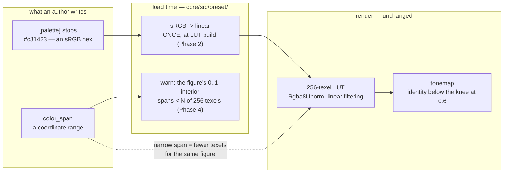

# 0138 — The colour surface stops misleading its authors

> **Status:** approved
> **Created:** 2026-08-29
> **Owner skill(s):** dev, human
> **Related ADRs:** [0151](../adrs/0151-palette-stops-are-authored-in-srgb-and-converted-at-load.md) (proposed)
> **Closes:** design-backlog 0153, 0099.

## TL;DR

Two ways the colour surface tells a preset author something false. A stop written `#c81423` renders
`#dd4c64` — the green channel nearly quadrupled — because stops are consumed as linear light, and
`preset-palettes.md` tells limited-ink authors that shift is unavoidable when below the tonemap knee
it is exactly correctable. Separately, a narrow `color_span` silently spends the palette's 256-texel
budget: a sharp star's interior occupied **9.6 texels** with a **1.31-texel** edge transition, which
is why the user called those probes *"dirty and upscaled"* and why the complaint was misread twice
as a silhouette problem. The first visible behavior is one paragraph in `preset-palettes.md` that
stops telling authors to give up.

## Context & problem

Both entries come from look verdicts that were **attributed to the wrong subsystem**, which is what
makes them one plan rather than two.

Backlog 0099's user verdict — *"dirty and upscaled"* — was read first as a silhouette complaint and
second as a shading one. It was neither: the figures were drawn through 8 to 32 of the palette's 256
texels, and a 1.3-texel transition stretched across half a screen and sampled with linear filtering
is precisely an upscaled gradient. Re-rendered with `palette_steps` bound, the same five silhouettes
come back crisp — the silhouettes were exact all along. That misattribution **nearly routed a
composite-scale lighting plan** (backlog 0092) off a misread.

Backlog 0153's shift was measured at Plan 0123 Phase 9 and recorded there; Phase 8 had recorded the
same shift on `collage_mono` without naming its cause. The entry is explicit that it has two
separable halves and that **the second is worth having whatever the first decides** — the page is
wrong either way.

The population that cares is new. [ADR-0138](../adrs/0138-limited-ink-is-a-supported-palette-class-defined-at-the-draw-seam.md)
made limited ink a supported palette class, and its authors are the ones who write a hex because
they mean an ink. The misleading paragraph shipped in the same plan that added the class.

## Decision

**Take the free repair first, then the re-basing, then the warning.** Phase 1 is the
`preset-palettes.md` paragraph — it is correct under either answer to
[ADR-0151](../adrs/0151-palette-stops-are-authored-in-srgb-and-converted-at-load.md), costs one
paragraph, and stops the content lane writing more presets against a false claim. Phases 2-3
implement ADR-0151, migrating every shipped palette so that **the rendered output does not move**.
Phase 4 adds the `color_span` warning.

We rejected a per-preset colour-space switch (ADR-0151 Alternative B) because two readings of a hex
triple makes a palette file unreadable. We rejected enlarging `LUT_SIZE` or nearest-filtering the
LUT for 0099 — the entry names both as *not* the fix: the first moves the threshold without removing
the trap and costs every scene memory, the second would turn every smooth gradient in the library
into bands.

## Architecture diagram

## Implementation phases

### Phase 1 — The page stops telling authors to give up
- **Owner skill:** dev
- **What:** Close backlog 0153's second half. Rewrite `docs/preset-palettes.md`'s Remaps paragraph.
- **Files touched:** `docs/preset-palettes.md`.
- **Notes for the implementer:**
  - The sentence to replace is *"a limited-ink frame's plateaus almost never carry the palette's
    literal RGB, and that is fine."* It is aimed at exactly the authors who care most about exact
    inks, and it is false below the knee.
  - Give the mechanism and the recipe: stops are consumed as linear light; pre-converting the stop
    corrects it exactly below the tonemap knee at linear `0.6`, where the curve is the identity;
    above the knee the channels scale together and the plateau survives anyway.
  - **Write this so it survives Phase 2.** After the migration the recipe becomes unnecessary — so
    phrase the paragraph around the *mechanism* and mark the manual recipe as what to do on a build
    that predates the conversion, rather than as standing advice.
- **Done when:** the Remaps section states the mechanism, gives the exact-correction recipe with its
  domain (below the knee), and no longer tells the author the shift is unavoidable.

### Phase 2 — Stops are sRGB, and the library is re-based
- **Owner skill:** dev
- **What:** Implement ADR-0151. Convert stops sRGB-to-linear once at LUT build, and migrate every
  shipped palette and custom stop so the rendered output is unchanged.
- **Files touched:** `core/src/render/palette.rs`, `core/src/preset/schema.rs`, every
  `presets/*.toml` carrying a `[palette]` custom stop.
- **Notes for the implementer:**
  - **The goldens are the migration's only real check, and they must not move.** Each existing stop
    is replaced by its sRGB-encoded equivalent, chosen so the linear value fed to the LUT is
    identical. A baseline that shifts is a mistyped stop, not an accepted cost — stop and find it.
  - Do the migration **mechanically**, by a script that reads each stop and writes back
    `linear_to_srgb(stop)`. Hand-editing 40-odd hex triples is how one gets transposed.
  - `palette.rs`'s comment cites *"no perceptual/gamma management; that is deferred, ADR-0021 Alt E"*
    — that pointer is now wrong and must move to ADR-0151, or the next reader follows it to a
    superseded deferral.
  - The conversion is at LUT build, **not per sample**. ADR-0151 Alternative C records why.
- **Done when:**
  - A palette stop written `#c81423` renders within 2/255 of `#c81423` below the knee, asserted as a
    test.
  - The full golden suite is **byte-identical and unblessed** on both adapters. Any moved baseline is
    a finding.

### Phase 3 — The colour docs describe the new contract
- **Owner skill:** dev
- **What:** Sweep the operator docs for the changed authoring contract.
- **Files touched:** `docs/preset-palettes.md`, `presets/README.md`, `docs/presets.md` if it names
  the stop format.
- **Notes for the implementer:**
  - Phase 1's paragraph is now partly historical — fold it forward rather than leaving two accounts.
  - **These three files are load-bearing for the `preset-author` lane**, which keeps no catalogue of
    its own and points at them. A stop format that changed without them changing is how that lane
    authors against a surface that does not exist.
- **Done when:** the three docs describe stops as sRGB, with no surviving instruction to
  pre-convert, and `preset-palettes.md` names the knee as the domain of exactness.

### Phase 4 — A narrow `color_span` warns
- **Owner skill:** dev
- **What:** Close backlog 0099. A load-time warning when a `shape_field` preset's `color_span` puts
  the figure's own `0..1` interior below a small number of LUT texels.
- **Files touched:** `core/src/render/scenes/shape_field.rs` (or wherever the scene validates), the
  ADR-0020 warning surface.
- **Notes for the implementer:**
  - **It cannot be exact**, and the entry says so: how much of the coordinate the *figure* occupies
    depends on the shape's inradius and the framing. The scene knows both, so the estimate is
    available — state it as an estimate in the warning text.
  - Anchor the threshold on the measured table rather than inventing one: `p3a sharp7` at 8.6 texels
    and a 1.31-texel edge is the case that read as upscaled; `p3e hand6` at 32.3 with a 4.86 edge did
    not. Per ADR-0071 state the property, not a frozen constant from one probe set.
  - **Name the remedy in the warning.** `palette_steps` removes the interpolation entirely and is the
    documented workaround; a warning that does not say so just relocates the confusion.
  - No shipped preset is affected — `shape_pulse` binds `palette_steps` and is unaffected by
    construction — so this should fire on **nothing** in the library. If it fires, that is a finding.
- **Done when:**
  - A `shape_field` preset with a `color_span` narrow enough to starve the gradient emits a warning
    naming the estimated texel count and `palette_steps`.
  - The whole shipped set loads warning-free.

### Phase 5 — The look gate
- **Owner skill:** human
- **What:** Confirm the migrated library looks unchanged, and that the limited-ink presets now carry
  the inks they name.
- **Files touched:** none.
- **Notes for the implementer:**
  - The goldens prove byte-identity at 128x128; this phase is the check at a real size, on the
    presets whose whole point is an exact ink — `collage_mono` and the limited-ink cohort.
  - **This is where a mistyped stop surfaces if the goldens somehow missed it.**
- **Done when:** the user has seen the limited-ink cohort before and after and confirms nothing moved
  except that the named inks are now the rendered inks.

## Risks & open questions

- **Phase 2 is a large mechanical diff whose correctness rests on the goldens.** That is a strong
  check — byte-identity across the whole suite on two adapters — but it is the only one, and a stop
  that is wrong in a way that lands under the 128x128 rasterizer noise floor would pass. Phase 5 is
  the mitigation and it is a human one.
- **It re-bases anyone's local presets.** Pre-1.0 this is acceptable, but it is a real break for a
  user with content outside the repository, and there is no migration path for them beyond the
  recipe Phase 1 documents.
- **Phase 4's threshold is a judgement.** The measured table has five points and one clear verdict at
  the bottom of it. A threshold set too high fires on legitimate authoring; set too low it never
  fires at all, which is the failure mode this repository has already met in three gates.
- **Phase 2 contends with any live `presets/` lane**, since it rewrites every custom stop. Check
  `git worktree list` before starting.

## What this plan does NOT do

- **It does not take backlog 0038.** That entry is routed to `preset-author` as a content pass — it
  needs no engine change and no ADR, and it is §4 of `content-brief.md` paired with Plan 0071's
  standing `occlude` retune. **It becomes newly measurable once Plan 0137 lands a level statistic**,
  which is the honest ordering.
- **It does not take backlog 0075.** Its remaining half is ADR-0102, proposed with no plan **by the
  user's call**, and it is expected to hold until a look asks for the clamp.
- **It does not enlarge `LUT_SIZE` or change the LUT's filtering.** Backlog 0099 names both as not
  the fix.
- **It does not touch the tonemap.** The knee is where the exactness domain ends, not something this
  plan moves.
