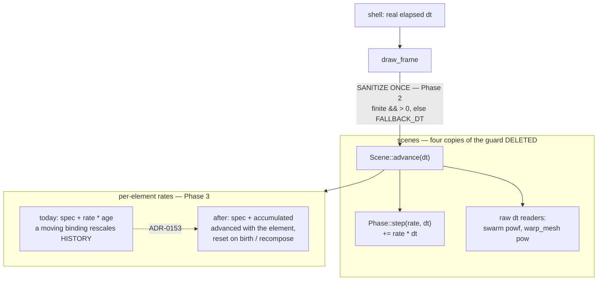

# 0140 — Every rate integrates, for real

> **Status:** approved
> **Created:** 2026-08-29
> **Owner skill(s):** dev, human
> **Related ADRs:** [0152](../adrs/0152-the-frame-delta-is-sanitized-at-the-scene-seam.md) (proposed),
> [0153](../adrs/0153-a-per-element-rate-integrates-per-element.md) (proposed)
> **Closes:** design-backlog 0149, 0150. **0142 is carried, not closed** — see Phase 6.

## TL;DR

Plan 0122 made every rate integrate — against the clock it grepped for. **Three more rates multiply
a per-element `age` instead**, which is the same defect against a different clock, and the
`hygiene.rs` guard matches the shared clock by name so it passes all three. Three shipped presets
bind them to audio, more content than the `swarm` pair Plan 0122 existed to fix, and
`presets/README.md` documents the defective form as the safe one. Separately, `Phase::step` accepts
any `dt`, so the guard against a permanently-poisoned accumulator is four byte-identical copies in
callers — and the attractor, which holds a `Phase`, has none. The first visible behavior is
`presets/README.md` no longer teaching a rate form that ADR-0132 forbids.

## Context & problem

Both entries were raised at Plan 0122's Mode 4 close review — one by grepping for the *mechanism*
(`* age`) rather than the spelling the guard knows, one from the review's second `minor`. They are
one plan because they are the same failure at two levels: **a rule enforced by a list of sites, and
the site that is not on the list.**

That is ADR-0135's own sentence. Its Context calls four copies of three lines *"a rule enforced by a
list of sites"* and rejects its Alternative A on the ground that duplication is how the defect
returns. Four copies of the `dt` guard is that sentence again; `particles/mod.rs` is the site it
predicts. And ADR-0132's rule about rates is enforced by a guard that knows one spelling, so three
rates against a different clock were never in scope.

Neither has been observed in the wild, and both are filed at the size they are because **the cost of
repair only grows.** `Phase` is now the engine's one rate mechanism, so every rate added after this
inherits whichever answer is not chosen.

The user-visible half is real, though, and it is the quiet passage. `shape_collage`'s `recompose` is
gated on `hash(beat_index)`, so with no onsets it never fires, `age` grows unbounded, and **the first
bass hit after a long quiet stretch lands the full accumulated swing.** In ordinary playback the
same defect is a ~49x single-frame jitter on `spin` and ~35x on `drift`.

## Decision

**Fix the documentation first, then the invariant, then the rates.** Phase 1 is the
`presets/README.md` correction — ADR-0153 says explicitly it is worth making whether or not the
engine repair is taken, and it is what stops the content lane writing a fourth affected preset.
Phase 2 implements [ADR-0152](../adrs/0152-the-frame-delta-is-sanitized-at-the-scene-seam.md).
Phases 3-5 implement [ADR-0153](../adrs/0153-a-per-element-rate-integrates-per-element.md), with the
emitter's third case **measured before it is repaired**. Phase 6 is the honest note on backlog 0142.

We rejected copying the fourth `dt` guard into `particles/mod.rs` — it leaves five copies, which is
the option ADR-0135 rejected by name. We rejected baking the collage rates at spawn (ADR-0153
Alternative A) because it makes a moving binding affect only new elements, which on an onset-gated
recompose is close to no reactivity in the passages that want it. And we rejected widening
`hygiene.rs` to `* age`, because `emitter`'s `v0 * age` ballistics are legitimate and a guard needing
an allowlist teaches suppression.

## Architecture diagram

## Implementation phases

### Phase 1 — The operator doc stops teaching the defect
- **Owner skill:** dev
- **What:** Correct `presets/README.md:1536`, which describes the defective form as the safe one.
- **Files touched:** `presets/README.md`.
- **Notes for the implementer:**
  - The sentence is *"Integrated against real elapsed time, so the canvas moves identically at any
    refresh rate."* It is **true about frame-rate independence and false about ADR-0132** — the rate
    scales the accumulation rather than being integrated into it. Correct the second claim without
    losing the first, which is still right.
  - The `pump_*` row three lines below says *"drive the depth from the music"* and is load-bearing
    for the `preset-author` lane. Check it says something still true after this phase.
  - **This lands first on purpose.** It is one sentence, and it is the thing that produced three
    affected presets.
- **Done when:** `presets/README.md` no longer describes a `rate · age` form as integrated, and the
  row names what an author should bind instead.

### Phase 2 — The frame delta is sanitized at the seam
- **Owner skill:** dev
- **What:** Implement ADR-0152. Sanitize `dt` in `draw_frame` before `Scene::advance`, delete the
  four in-scene copies, and state the new contract on the trait.
- **Files touched:** `core/src/render/mod.rs`, `core/src/render/scenes/mod.rs`,
  `fragment_field.rs`, `lines/parametric.rs`, `swarm.rs`, `warp_mesh/mod.rs`,
  `particles/mod.rs`.
- **Notes for the implementer:**
  - **Write the guarantee into `Scene::advance`'s doc comment**, or it is forgotten. ADR-0152's
    Negative section says this is the only thing standing where four visible guards used to be.
  - The four deleted guards each carry a separately-written comment giving the same reason. **That
    reasoning has to survive in one place**, at the seam — do not let the *why* go with the
    duplication.
  - `FALLBACK_DT` moves to the seam and keeps its value.
  - The attractor's `self.dt = dt` at `particles/mod.rs:1339` is the live hole; after this phase it is
    safe **because of the seam**, not because it gained a guard. Do not add a fifth copy.
  - `FixedStep::advance` self-heals via `accumulator.min(step)`, which is why the omission read as
    safe. Leave that alone; it is correct.
- **Done when:**
  - A test feeding `NaN`, a negative and a zero `dt` through `draw_frame` leaves every scene's `Phase`
    finite and advancing, **including the attractor's `spin_time`**, which today would be poisoned
    permanently.
  - No `dt.is_finite() && dt > 0.0` remains in any scene.
  - The golden suite is unmoved and unblessed.

### Phase 3 — The collage rates integrate per element
- **Owner skill:** dev
- **What:** Implement ADR-0153 for `shape_collage`'s `drift` and `spin`.
- **Files touched:** `core/src/render/scenes/shape_collage.rs`.
- **Notes for the implementer:**
  - **This is not `scenes::Phase`.** `Phase` is one accumulator per scene; these need one per element,
    advanced with the element and reset when it is born or the canvas recomposes. That difference is
    exactly why Plan 0122 scoped them out.
  - The reset points are element birth and `recompose`. Getting the reset wrong reintroduces the
    unbounded-`age` cliff in a new form.
  - **Measure the per-frame cost.** ADR-0153 records the write-per-element-per-frame as a real
    regression in a hot loop that must be measured, not assumed.
  - **Goldens will move here**, and that is expected rather than a finding — the response genuinely
    changes. Bless deliberately and say so in the log; do not bless anything from Phase 2.
- **Done when:**
  - A binding that moves changes the canvas from that moment forward and does not retroactively
    rescale an element's existing placement, asserted as a test over two frames with a moved binding.
  - The quiet-passage case — no onsets for a long stretch, then a bass hit — no longer lands an
    accumulated swing.

### Phase 4 — Measure the emitter's third case
- **Owner skill:** dev
- **What:** Measure whether `emitter::sprite_angle`'s `base + rate * age` is observable, then repair
  or document.
- **Files touched:** `core/src/render/scenes/emitter.rs`, `docs/design-backlog.md`.
- **Notes for the implementer:**
  - Sprites are short-lived, so `age` is small and the defect **may be unobservable**. Backlog 0149
    says to measure before spending anything on it.
  - `spin` here is bound only to constants in shipped content today — the same status
    `parametric_curve`'s `spin` and `warp_mesh`'s `deposit_spin` had when ADR-0132 corrected them
    anyway. **A rate whose clock cannot grow is a different fact from a rate nobody happens to bind**,
    and the measurement is what separates them.
  - **Do not repair `emitter.rs:375-376`'s `v0 * age`.** That is legitimate ballistics with a
    spawn-baked velocity, and it is the reason the guard is not widened.
  - If left unrepaired, record it as a stated exception with the measurement behind it.
- **Done when:** the sprite rotation is either integrated per element or documented as
  bounded-by-lifetime with the measured `age` range that justifies it.

### Phase 5 — The three collage presets are retuned
- **Owner skill:** dev
- **What:** Re-tune `collage_onwhite`, `collage_suprematist` and `collage_mono` against the corrected
  response, and re-bless.
- **Files touched:** the three presets, golden baselines.
- **Notes for the implementer:**
  - Their `[smoothing]` values (all ~0.6) were tuned against the defective response, where a moving
    binding was amplified by `age`. After Phase 3 the same numbers produce a much smaller motion.
  - **This is the boundary case for the lane split.** ADR-0081 puts new preset content in
    `preset-author`, but this is `dev` editing presets because an engine change forced it, which is
    the stated exception. Keep it to restoring the intended motion — **not** re-designing the look.
  - If the looks need real re-design, that is a `preset-author` hand-off, and say so rather than
    doing it here.
- **Done when:** the three presets read as they did before the engine change, with bindings that now
  steer rather than rescale, and the moved goldens are blessed with the reason stated.

### Phase 6 — The dissolve note
- **Owner skill:** dev
- **What:** Record what this plan does and does not do for backlog 0142.
- **Files touched:** `docs/design-backlog.md`.
- **Notes for the implementer:**
  - Backlog 0142 — a same-system dissolve runs `Scene::update` twice in one frame, so every stateful
    scene advances at 2x for its duration — is **filed rather than planned** solely because *"nothing
    in the suite can currently observe the bug, so nothing can observe the repair either."*
  - Phase 2 does **not** fix it and does not make it observable: sanitizing `dt` says nothing about
    `update` running twice. Say that plainly rather than letting a reader assume the rate work
    covered it.
  - What *has* changed is the population: with Phase 3, `shape_collage` joins the scenes carrying
    per-frame state that is not idempotent, so the dissolve defect now reaches one more system.
    **That is a size update on 0142 and it belongs on the entry.**
- **Done when:** backlog 0142 carries a dated update stating that this plan did not repair it, and
  that its affected population grew.

## Risks & open questions

- **Phase 3 moves goldens and Phase 2 must not.** Running them in one session risks blessing Phase
  2's suite by accident. Commit Phase 2 with an unmoved suite before starting Phase 3.
- **Phase 5 is a retune under a `dev` owner tag**, which is the lane boundary's stated exception and
  also where it is most likely to be abused. If the presets need more than restoring intended motion,
  stop and hand off.
- **The guard still cannot see this class after this plan.** ADR-0153 declines to widen `hygiene.rs`
  for good reasons, which means the next per-element rate has nothing catching it but review — the
  exact route these three arrived by. Phase 1 is the only durable mitigation, and it is a doc.
- **Phase 2 contends with [Plan 0125](0125-the-scenes-share-their-gpu-boilerplate.md)** — that plan
  touches all twelve scenes' boilerplate and this one edits five of them. Take them in series.
- **The 49x and 35x figures are computed, not measured**, from a one-pole at `tau = 0.6` and
  `SPIN_SPEED = 0.07`. Per ADR-0071 do not assert them; they justify the work, they are not a
  done-when.

## What this plan does NOT do

- **It does not fix backlog 0142.** Phase 6 records why, and the instrument question — making the
  dual-live render path reachable from a test — is its own design problem.
- **It does not widen the `hygiene.rs` guard.** ADR-0153 Alternative B says why.
- **It does not introduce a `Dt` newtype.** ADR-0152 Alternative B records it as the right long-term
  shape and defers it on diff size against Plan 0126's concurrent splits.
- **It does not touch the six rates Plan 0122 already fixed**, or `Phase` itself.
